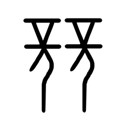

# Component Visual Gallery / 构件图像查看: obs-comp-cand-000796

English:
This page displays OBIMD subcharacter PNG assets extracted into this concrete corpus object directory for human review.

简体中文：
本页展示抽取到当前具体 corpus 对象目录内的 OBIMD subcharacter PNG 资料，供人工复核使用。

Boundary / 边界：dataset image candidate only; not a confirmed component form, component assignment, or decipherment claim.

## asset-013594

- source_zip_member: `Sub-character Images/2tq601zel0/obbko8nghy/obbko8nghy.png`
- checksum_sha256: `9de7ba925bc2945c269a2dff7861cf4b6ad50e7f7cb28b80c607211e3789a5ef`
- review_status: `needs_human_visual_review`
- caution: OBIMD subcharacter image is a source-marked review asset only; it is not a confirmed component form, component assignment, or decipherment conclusion.
