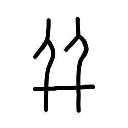

# Component Visual Gallery / 构件图像查看: obs-comp-cand-000802

English:
This page displays OBIMD subcharacter PNG assets extracted into this concrete corpus object directory for human review.

简体中文：
本页展示抽取到当前具体 corpus 对象目录内的 OBIMD subcharacter PNG 资料，供人工复核使用。

Boundary / 边界：dataset image candidate only; not a confirmed component form, component assignment, or decipherment claim.

## asset-013599

- source_zip_member: `Sub-character Images/cawhttc4j5/cawhttc4j5/cawhttc4j5.png`
- checksum_sha256: `d60f800b69ed984bb1270fecffdfcdf5ad6cc7fece2ac9e8f31022b44a77c06a`
- review_status: `needs_human_visual_review`
- caution: OBIMD subcharacter image is a source-marked review asset only; it is not a confirmed component form, component assignment, or decipherment conclusion.
