# Component Visual Gallery / 构件图像查看: obs-comp-cand-000812

English:
This page displays OBIMD subcharacter PNG assets extracted into this concrete
corpus object directory for human review.

简体中文：
本页展示抽取到当前具体 corpus 对象目录内的 OBIMD subcharacter PNG 资料，供人工复核使用。

Boundary / 边界：
dataset image candidate only; not a confirmed component form, not a component
assignment, and not a decipherment claim.
- not a confirmed component form
- not a component assignment
- not a decipherment claim

## Concrete Questions To Check / 具体待查问题

- Open 06_component-visual-index.csv and name the local image row.
- 打开 06_component-visual-index.csv，写明本地图像行。
- Open 09_component-visual-route-index.csv and name the source route row.
- 打开 09_component-visual-route-index.csv，写明来源路线行。
- Open 13_component-context-evidence-dossier.md for character context.
- 打开 13_component-context-evidence-dossier.md，核对单字与卜辞上下文。
- Record the missing image, near-shape, source, or context route.
- 记录缺失的图像、近形、来源或上下文路线。

## asset-013608

- source_zip_member: `Sub-character Images/aetgi1oyaa/aetgi1oyaa/02w7v7qq0z.png`
- checksum_sha256: see `06_component-visual-index.csv`.
- review_status: `needs_human_visual_review`
- caution: source-marked review image only.

## asset-013609

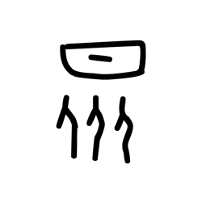

- source_zip_member: `Sub-character Images/aetgi1oyaa/aetgi1oyaa/0cy4s37nhs.png`
- checksum_sha256: see `06_component-visual-index.csv`.
- review_status: `needs_human_visual_review`
- caution: source-marked review image only.

## asset-013610

- source_zip_member: `Sub-character Images/aetgi1oyaa/aetgi1oyaa/0inynystvz.png`
- checksum_sha256: see `06_component-visual-index.csv`.
- review_status: `needs_human_visual_review`
- caution: source-marked review image only.

## asset-013611

- source_zip_member: `Sub-character Images/aetgi1oyaa/aetgi1oyaa/0qtxqhmh2m.png`
- checksum_sha256: see `06_component-visual-index.csv`.
- review_status: `needs_human_visual_review`
- caution: source-marked review image only.

## asset-013612

- source_zip_member: `Sub-character Images/aetgi1oyaa/aetgi1oyaa/128pqakkw6.png`
- checksum_sha256: see `06_component-visual-index.csv`.
- review_status: `needs_human_visual_review`
- caution: source-marked review image only.

## asset-013613

- source_zip_member: `Sub-character Images/aetgi1oyaa/aetgi1oyaa/3dejwskuy2.png`
- checksum_sha256: see `06_component-visual-index.csv`.
- review_status: `needs_human_visual_review`
- caution: source-marked review image only.

## asset-013614

- source_zip_member: `Sub-character Images/aetgi1oyaa/aetgi1oyaa/3nhun8mgw9.png`
- checksum_sha256: see `06_component-visual-index.csv`.
- review_status: `needs_human_visual_review`
- caution: source-marked review image only.

## asset-013615

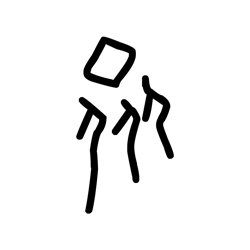

- source_zip_member: `Sub-character Images/aetgi1oyaa/aetgi1oyaa/45jp6ms9u9.png`
- checksum_sha256: see `06_component-visual-index.csv`.
- review_status: `needs_human_visual_review`
- caution: source-marked review image only.

## asset-013616

- source_zip_member: `Sub-character Images/aetgi1oyaa/aetgi1oyaa/4gmpusj44c.png`
- checksum_sha256: see `06_component-visual-index.csv`.
- review_status: `needs_human_visual_review`
- caution: source-marked review image only.

## asset-013617

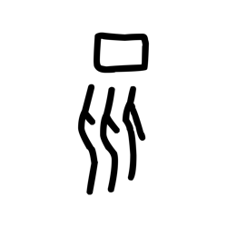

- source_zip_member: `Sub-character Images/aetgi1oyaa/aetgi1oyaa/4tsd7dhtfm.png`
- checksum_sha256: see `06_component-visual-index.csv`.
- review_status: `needs_human_visual_review`
- caution: source-marked review image only.

## asset-013618

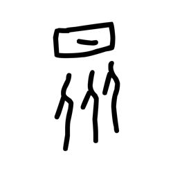

- source_zip_member: `Sub-character Images/aetgi1oyaa/aetgi1oyaa/515u354zkm.png`
- checksum_sha256: see `06_component-visual-index.csv`.
- review_status: `needs_human_visual_review`
- caution: source-marked review image only.

## asset-013619

- source_zip_member: `Sub-character Images/aetgi1oyaa/aetgi1oyaa/56oy4jop0k.png`
- checksum_sha256: see `06_component-visual-index.csv`.
- review_status: `needs_human_visual_review`
- caution: source-marked review image only.

## asset-013620

- source_zip_member: `Sub-character Images/aetgi1oyaa/aetgi1oyaa/6uzz0xoqxl.png`
- checksum_sha256: see `06_component-visual-index.csv`.
- review_status: `needs_human_visual_review`
- caution: source-marked review image only.

## asset-013621

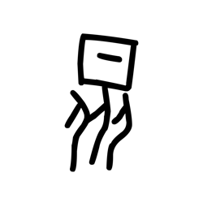

- source_zip_member: `Sub-character Images/aetgi1oyaa/aetgi1oyaa/6xvi0l7f5v.png`
- checksum_sha256: see `06_component-visual-index.csv`.
- review_status: `needs_human_visual_review`
- caution: source-marked review image only.

## asset-013622

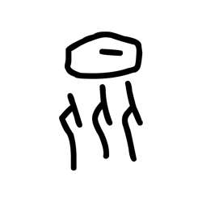

- source_zip_member: `Sub-character Images/aetgi1oyaa/aetgi1oyaa/7nf9rjvure.png`
- checksum_sha256: see `06_component-visual-index.csv`.
- review_status: `needs_human_visual_review`
- caution: source-marked review image only.

## asset-013623

- source_zip_member: `Sub-character Images/aetgi1oyaa/aetgi1oyaa/7sdywaq0kt.png`
- checksum_sha256: see `06_component-visual-index.csv`.
- review_status: `needs_human_visual_review`
- caution: source-marked review image only.

## asset-013624

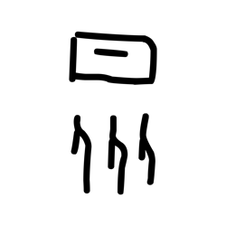

- source_zip_member: `Sub-character Images/aetgi1oyaa/aetgi1oyaa/7t62bec4ez.png`
- checksum_sha256: see `06_component-visual-index.csv`.
- review_status: `needs_human_visual_review`
- caution: source-marked review image only.

## asset-013625

- source_zip_member: `Sub-character Images/aetgi1oyaa/aetgi1oyaa/8hvlwpjvs6.png`
- checksum_sha256: see `06_component-visual-index.csv`.
- review_status: `needs_human_visual_review`
- caution: source-marked review image only.

## asset-013626

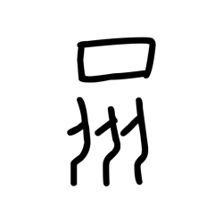

- source_zip_member: `Sub-character Images/aetgi1oyaa/aetgi1oyaa/92qsq736w2.png`
- checksum_sha256: see `06_component-visual-index.csv`.
- review_status: `needs_human_visual_review`
- caution: source-marked review image only.

## asset-013627

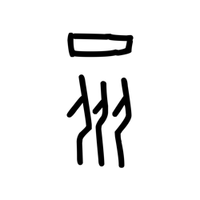

- source_zip_member: `Sub-character Images/aetgi1oyaa/aetgi1oyaa/9h9k508qhw.png`
- checksum_sha256: see `06_component-visual-index.csv`.
- review_status: `needs_human_visual_review`
- caution: source-marked review image only.

## asset-013628

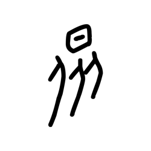

- source_zip_member: `Sub-character Images/aetgi1oyaa/aetgi1oyaa/9if7a8am4d.png`
- checksum_sha256: see `06_component-visual-index.csv`.
- review_status: `needs_human_visual_review`
- caution: source-marked review image only.

## asset-013629

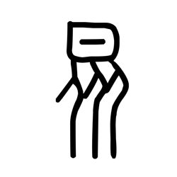

- source_zip_member: `Sub-character Images/aetgi1oyaa/aetgi1oyaa/aetgi1oyaa.png`
- checksum_sha256: see `06_component-visual-index.csv`.
- review_status: `needs_human_visual_review`
- caution: source-marked review image only.

## asset-013630

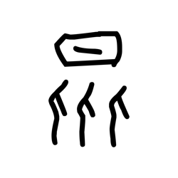

- source_zip_member: `Sub-character Images/aetgi1oyaa/aetgi1oyaa/aifd0yye3m.png`
- checksum_sha256: see `06_component-visual-index.csv`.
- review_status: `needs_human_visual_review`
- caution: source-marked review image only.

## asset-013631

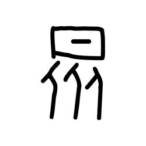

- source_zip_member: `Sub-character Images/aetgi1oyaa/aetgi1oyaa/at1put56lh.png`
- checksum_sha256: see `06_component-visual-index.csv`.
- review_status: `needs_human_visual_review`
- caution: source-marked review image only.

## asset-013632

- source_zip_member: `Sub-character Images/aetgi1oyaa/aetgi1oyaa/bl879omwyr.png`
- checksum_sha256: see `06_component-visual-index.csv`.
- review_status: `needs_human_visual_review`
- caution: source-marked review image only.

## asset-013633

- source_zip_member: `Sub-character Images/aetgi1oyaa/aetgi1oyaa/c4o7tjjjvf.png`
- checksum_sha256: see `06_component-visual-index.csv`.
- review_status: `needs_human_visual_review`
- caution: source-marked review image only.

## asset-013634

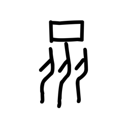

- source_zip_member: `Sub-character Images/aetgi1oyaa/aetgi1oyaa/c529eonf4x.png`
- checksum_sha256: see `06_component-visual-index.csv`.
- review_status: `needs_human_visual_review`
- caution: source-marked review image only.

## asset-013635

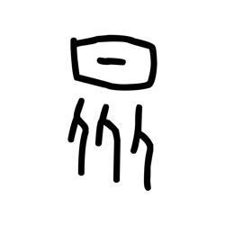

- source_zip_member: `Sub-character Images/aetgi1oyaa/aetgi1oyaa/ca7yso2st8.png`
- checksum_sha256: see `06_component-visual-index.csv`.
- review_status: `needs_human_visual_review`
- caution: source-marked review image only.

## asset-013636

- source_zip_member: `Sub-character Images/aetgi1oyaa/aetgi1oyaa/cmlxlcbg1h.png`
- checksum_sha256: see `06_component-visual-index.csv`.
- review_status: `needs_human_visual_review`
- caution: source-marked review image only.

## asset-013637

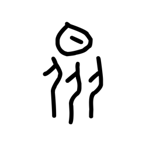

- source_zip_member: `Sub-character Images/aetgi1oyaa/aetgi1oyaa/comntnp0uz.png`
- checksum_sha256: see `06_component-visual-index.csv`.
- review_status: `needs_human_visual_review`
- caution: source-marked review image only.

## asset-013638

- source_zip_member: `Sub-character Images/aetgi1oyaa/aetgi1oyaa/cs1fuooguz.png`
- checksum_sha256: see `06_component-visual-index.csv`.
- review_status: `needs_human_visual_review`
- caution: source-marked review image only.

## asset-013639

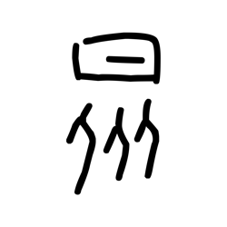

- source_zip_member: `Sub-character Images/aetgi1oyaa/aetgi1oyaa/di58enkdyj.png`
- checksum_sha256: see `06_component-visual-index.csv`.
- review_status: `needs_human_visual_review`
- caution: source-marked review image only.

## asset-013640

- source_zip_member: `Sub-character Images/aetgi1oyaa/aetgi1oyaa/ea7qxvtwve.png`
- checksum_sha256: see `06_component-visual-index.csv`.
- review_status: `needs_human_visual_review`
- caution: source-marked review image only.

## asset-013641

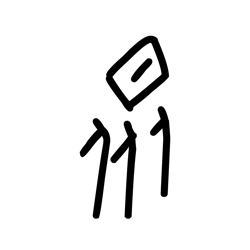

- source_zip_member: `Sub-character Images/aetgi1oyaa/aetgi1oyaa/ezox19mrw2.png`
- checksum_sha256: see `06_component-visual-index.csv`.
- review_status: `needs_human_visual_review`
- caution: source-marked review image only.

## asset-013642

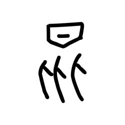

- source_zip_member: `Sub-character Images/aetgi1oyaa/aetgi1oyaa/f2vweupr53.png`
- checksum_sha256: see `06_component-visual-index.csv`.
- review_status: `needs_human_visual_review`
- caution: source-marked review image only.

## asset-013643

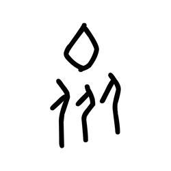

- source_zip_member: `Sub-character Images/aetgi1oyaa/aetgi1oyaa/f6mjjgercn.png`
- checksum_sha256: see `06_component-visual-index.csv`.
- review_status: `needs_human_visual_review`
- caution: source-marked review image only.

## asset-013644

- source_zip_member: `Sub-character Images/aetgi1oyaa/aetgi1oyaa/fb3ebtc27n.png`
- checksum_sha256: see `06_component-visual-index.csv`.
- review_status: `needs_human_visual_review`
- caution: source-marked review image only.

## asset-013645

- source_zip_member: `Sub-character Images/aetgi1oyaa/aetgi1oyaa/fecxu53qbq.png`
- checksum_sha256: see `06_component-visual-index.csv`.
- review_status: `needs_human_visual_review`
- caution: source-marked review image only.

## asset-013646

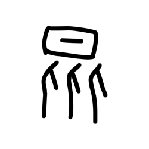

- source_zip_member: `Sub-character Images/aetgi1oyaa/aetgi1oyaa/fq28nqsu8k.png`
- checksum_sha256: see `06_component-visual-index.csv`.
- review_status: `needs_human_visual_review`
- caution: source-marked review image only.

## asset-013647

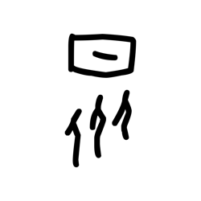

- source_zip_member: `Sub-character Images/aetgi1oyaa/aetgi1oyaa/hiirxo8yuk.png`
- checksum_sha256: see `06_component-visual-index.csv`.
- review_status: `needs_human_visual_review`
- caution: source-marked review image only.

## asset-013648

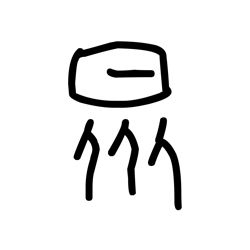

- source_zip_member: `Sub-character Images/aetgi1oyaa/aetgi1oyaa/iel86lnoxd.png`
- checksum_sha256: see `06_component-visual-index.csv`.
- review_status: `needs_human_visual_review`
- caution: source-marked review image only.

## asset-013649

- source_zip_member: `Sub-character Images/aetgi1oyaa/aetgi1oyaa/j03d2zxuc6.png`
- checksum_sha256: see `06_component-visual-index.csv`.
- review_status: `needs_human_visual_review`
- caution: source-marked review image only.

## asset-013650

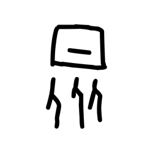

- source_zip_member: `Sub-character Images/aetgi1oyaa/aetgi1oyaa/jfqzgy48nv.png`
- checksum_sha256: see `06_component-visual-index.csv`.
- review_status: `needs_human_visual_review`
- caution: source-marked review image only.

## asset-013651

- source_zip_member: `Sub-character Images/aetgi1oyaa/aetgi1oyaa/jh91rxptj8.png`
- checksum_sha256: see `06_component-visual-index.csv`.
- review_status: `needs_human_visual_review`
- caution: source-marked review image only.

## asset-013652

- source_zip_member: `Sub-character Images/aetgi1oyaa/aetgi1oyaa/kbu8a2omiy.png`
- checksum_sha256: see `06_component-visual-index.csv`.
- review_status: `needs_human_visual_review`
- caution: source-marked review image only.

## asset-013653

- source_zip_member: `Sub-character Images/aetgi1oyaa/aetgi1oyaa/kcrn7clfj5.png`
- checksum_sha256: see `06_component-visual-index.csv`.
- review_status: `needs_human_visual_review`
- caution: source-marked review image only.

## asset-013654

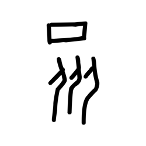

- source_zip_member: `Sub-character Images/aetgi1oyaa/aetgi1oyaa/klfep0x8u1.png`
- checksum_sha256: see `06_component-visual-index.csv`.
- review_status: `needs_human_visual_review`
- caution: source-marked review image only.

## asset-013655

- source_zip_member: `Sub-character Images/aetgi1oyaa/aetgi1oyaa/l1ah12ex6b.png`
- checksum_sha256: see `06_component-visual-index.csv`.
- review_status: `needs_human_visual_review`
- caution: source-marked review image only.

## asset-013656

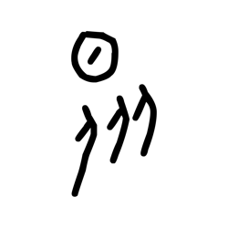

- source_zip_member: `Sub-character Images/aetgi1oyaa/aetgi1oyaa/lttbuq5fnx.png`
- checksum_sha256: see `06_component-visual-index.csv`.
- review_status: `needs_human_visual_review`
- caution: source-marked review image only.

## asset-013657

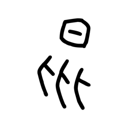

- source_zip_member: `Sub-character Images/aetgi1oyaa/aetgi1oyaa/m72aiqp7h0.png`
- checksum_sha256: see `06_component-visual-index.csv`.
- review_status: `needs_human_visual_review`
- caution: source-marked review image only.

## asset-013658

- source_zip_member: `Sub-character Images/aetgi1oyaa/aetgi1oyaa/mjoqpey7gc.png`
- checksum_sha256: see `06_component-visual-index.csv`.
- review_status: `needs_human_visual_review`
- caution: source-marked review image only.

## asset-013659

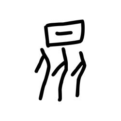

- source_zip_member: `Sub-character Images/aetgi1oyaa/aetgi1oyaa/n2v3y5p8un.png`
- checksum_sha256: see `06_component-visual-index.csv`.
- review_status: `needs_human_visual_review`
- caution: source-marked review image only.

## asset-013660

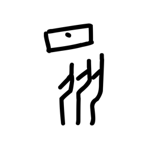

- source_zip_member: `Sub-character Images/aetgi1oyaa/aetgi1oyaa/oj43qrz88r.png`
- checksum_sha256: see `06_component-visual-index.csv`.
- review_status: `needs_human_visual_review`
- caution: source-marked review image only.

## asset-013661

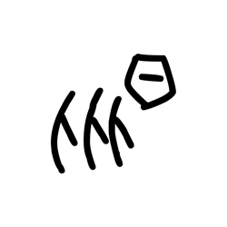

- source_zip_member: `Sub-character Images/aetgi1oyaa/aetgi1oyaa/oswb27m3hy.png`
- checksum_sha256: see `06_component-visual-index.csv`.
- review_status: `needs_human_visual_review`
- caution: source-marked review image only.

## asset-013662

- source_zip_member: `Sub-character Images/aetgi1oyaa/aetgi1oyaa/ou5l6ix34a.png`
- checksum_sha256: see `06_component-visual-index.csv`.
- review_status: `needs_human_visual_review`
- caution: source-marked review image only.

## asset-013663

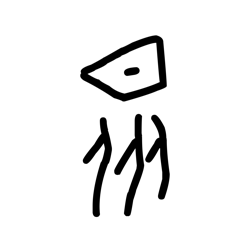

- source_zip_member: `Sub-character Images/aetgi1oyaa/aetgi1oyaa/p3p2ldqxev.png`
- checksum_sha256: see `06_component-visual-index.csv`.
- review_status: `needs_human_visual_review`
- caution: source-marked review image only.

## asset-013664

- source_zip_member: `Sub-character Images/aetgi1oyaa/aetgi1oyaa/qii502f6h0.png`
- checksum_sha256: see `06_component-visual-index.csv`.
- review_status: `needs_human_visual_review`
- caution: source-marked review image only.

## asset-013665

- source_zip_member: `Sub-character Images/aetgi1oyaa/aetgi1oyaa/qood3ixnw6.png`
- checksum_sha256: see `06_component-visual-index.csv`.
- review_status: `needs_human_visual_review`
- caution: source-marked review image only.

## asset-013666

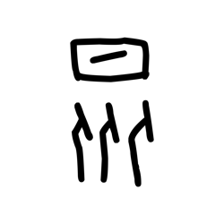

- source_zip_member: `Sub-character Images/aetgi1oyaa/aetgi1oyaa/r70bh7dy9a.png`
- checksum_sha256: see `06_component-visual-index.csv`.
- review_status: `needs_human_visual_review`
- caution: source-marked review image only.

## asset-013667

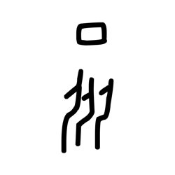

- source_zip_member: `Sub-character Images/aetgi1oyaa/aetgi1oyaa/r7fkb46qp6.png`
- checksum_sha256: see `06_component-visual-index.csv`.
- review_status: `needs_human_visual_review`
- caution: source-marked review image only.

## asset-013668

- source_zip_member: `Sub-character Images/aetgi1oyaa/aetgi1oyaa/rcynalu3p6.png`
- checksum_sha256: see `06_component-visual-index.csv`.
- review_status: `needs_human_visual_review`
- caution: source-marked review image only.

## asset-013669

- source_zip_member: `Sub-character Images/aetgi1oyaa/aetgi1oyaa/scm5ri9ezb.png`
- checksum_sha256: see `06_component-visual-index.csv`.
- review_status: `needs_human_visual_review`
- caution: source-marked review image only.

## asset-013670

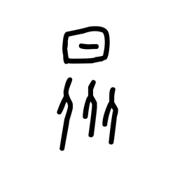

- source_zip_member: `Sub-character Images/aetgi1oyaa/aetgi1oyaa/tgsnnch5ce.png`
- checksum_sha256: see `06_component-visual-index.csv`.
- review_status: `needs_human_visual_review`
- caution: source-marked review image only.

## asset-013671

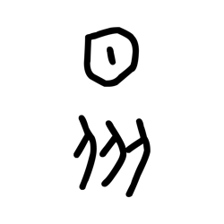

- source_zip_member: `Sub-character Images/aetgi1oyaa/aetgi1oyaa/u6qi487e7p.png`
- checksum_sha256: see `06_component-visual-index.csv`.
- review_status: `needs_human_visual_review`
- caution: source-marked review image only.

## asset-013672

- source_zip_member: `Sub-character Images/aetgi1oyaa/aetgi1oyaa/ujgqhyrugx.png`
- checksum_sha256: see `06_component-visual-index.csv`.
- review_status: `needs_human_visual_review`
- caution: source-marked review image only.

## asset-013673

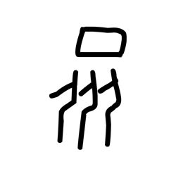

- source_zip_member: `Sub-character Images/aetgi1oyaa/aetgi1oyaa/uoq5khtf2p.png`
- checksum_sha256: see `06_component-visual-index.csv`.
- review_status: `needs_human_visual_review`
- caution: source-marked review image only.

## asset-013674

- source_zip_member: `Sub-character Images/aetgi1oyaa/aetgi1oyaa/v5keuyt1nt.png`
- checksum_sha256: see `06_component-visual-index.csv`.
- review_status: `needs_human_visual_review`
- caution: source-marked review image only.

## asset-013675

- source_zip_member: `Sub-character Images/aetgi1oyaa/aetgi1oyaa/vbei473gzy.png`
- checksum_sha256: see `06_component-visual-index.csv`.
- review_status: `needs_human_visual_review`
- caution: source-marked review image only.

## asset-013676

- source_zip_member: `Sub-character Images/aetgi1oyaa/aetgi1oyaa/voj2mybwmi.png`
- checksum_sha256: see `06_component-visual-index.csv`.
- review_status: `needs_human_visual_review`
- caution: source-marked review image only.

## asset-013677

- source_zip_member: `Sub-character Images/aetgi1oyaa/aetgi1oyaa/wxoemb6oge.png`
- checksum_sha256: see `06_component-visual-index.csv`.
- review_status: `needs_human_visual_review`
- caution: source-marked review image only.

## asset-013678

- source_zip_member: `Sub-character Images/aetgi1oyaa/aetgi1oyaa/x7k3lnm0p5.png`
- checksum_sha256: see `06_component-visual-index.csv`.
- review_status: `needs_human_visual_review`
- caution: source-marked review image only.

## asset-013679

- source_zip_member: `Sub-character Images/aetgi1oyaa/aetgi1oyaa/xnpjoodjg2.png`
- checksum_sha256: see `06_component-visual-index.csv`.
- review_status: `needs_human_visual_review`
- caution: source-marked review image only.

## asset-013680

- source_zip_member: `Sub-character Images/aetgi1oyaa/aetgi1oyaa/xrr71equbs.png`
- checksum_sha256: see `06_component-visual-index.csv`.
- review_status: `needs_human_visual_review`
- caution: source-marked review image only.

## asset-013681

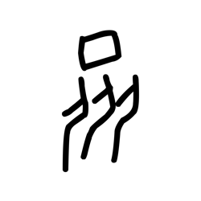

- source_zip_member: `Sub-character Images/aetgi1oyaa/aetgi1oyaa/yevri0z00w.png`
- checksum_sha256: see `06_component-visual-index.csv`.
- review_status: `needs_human_visual_review`
- caution: source-marked review image only.

## asset-013682

- source_zip_member: `Sub-character Images/aetgi1oyaa/aetgi1oyaa/ygsfxezc5l.png`
- checksum_sha256: see `06_component-visual-index.csv`.
- review_status: `needs_human_visual_review`
- caution: source-marked review image only.

## asset-013683

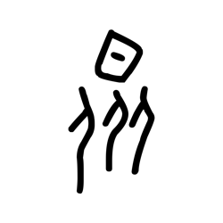

- source_zip_member: `Sub-character Images/aetgi1oyaa/aetgi1oyaa/znk7lyc5rt.png`
- checksum_sha256: see `06_component-visual-index.csv`.
- review_status: `needs_human_visual_review`
- caution: source-marked review image only.
