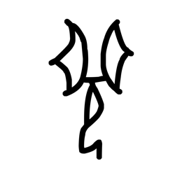

# Component Visual Gallery / 构件图像查看: obs-comp-cand-000852

English:
This page displays OBIMD subcharacter PNG assets extracted into this concrete corpus object directory for human review.

简体中文：
本页展示抽取到当前具体 corpus 对象目录内的 OBIMD subcharacter PNG 资料，供人工复核使用。

Boundary / 边界：dataset image candidate only; not a confirmed component form, component assignment, or decipherment claim.

## asset-013722

- source_zip_member: `Sub-character Images/yokl5p9l41/yokl5p9l41/yokl5p9l41.png`
- checksum_sha256: `72e811336087189800998db5eb118ef1ecd3c96edfeb2d566ad802b5c783da0b`
- review_status: `needs_human_visual_review`
- caution: OBIMD subcharacter image is a source-marked review asset only; it is not a confirmed component form, component assignment, or decipherment conclusion.
