# Component Visual Gallery / 构件图像查看: obs-comp-cand-000854

English:
This page displays OBIMD subcharacter PNG assets extracted into this concrete
corpus object directory for human review.

简体中文：
本页展示抽取到当前具体 corpus 对象目录内的 OBIMD subcharacter PNG 资料，供人工复核使用。

Boundary / 边界：
dataset image candidate only; not a confirmed component form, not a component
assignment, and not a decipherment claim.
- not a confirmed component form
- not a component assignment
- not a decipherment claim

## Concrete Questions To Check / 具体待查问题

- Open 06_component-visual-index.csv and name the local image row.
- 打开 06_component-visual-index.csv，写明本地图像行。
- Open 09_component-visual-route-index.csv and name the source route row.
- 打开 09_component-visual-route-index.csv，写明来源路线行。
- Open 13_component-context-evidence-dossier.md for character context.
- 打开 13_component-context-evidence-dossier.md，核对单字与卜辞上下文。
- Record the missing image, near-shape, source, or context route.
- 记录缺失的图像、近形、来源或上下文路线。

## asset-013724

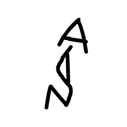

- source_zip_member: `Sub-character Images/ji97td3npi/ji97td3npi/05df3c9msa.png`
- checksum_sha256: see `06_component-visual-index.csv`.
- review_status: `needs_human_visual_review`
- caution: source-marked review image only.

## asset-013725

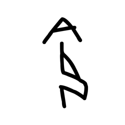

- source_zip_member: `Sub-character Images/ji97td3npi/ji97td3npi/09dfypwwqi.png`
- checksum_sha256: see `06_component-visual-index.csv`.
- review_status: `needs_human_visual_review`
- caution: source-marked review image only.

## asset-013726

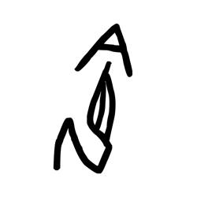

- source_zip_member: `Sub-character Images/ji97td3npi/ji97td3npi/0nmcry6dw9.png`
- checksum_sha256: see `06_component-visual-index.csv`.
- review_status: `needs_human_visual_review`
- caution: source-marked review image only.

## asset-013727

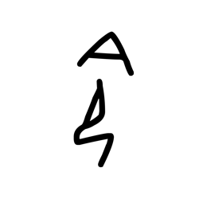

- source_zip_member: `Sub-character Images/ji97td3npi/ji97td3npi/18e2ouvhd5.png`
- checksum_sha256: see `06_component-visual-index.csv`.
- review_status: `needs_human_visual_review`
- caution: source-marked review image only.

## asset-013728

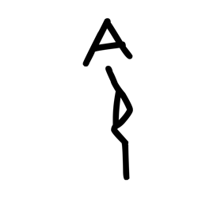

- source_zip_member: `Sub-character Images/ji97td3npi/ji97td3npi/1aad0dfqxi.png`
- checksum_sha256: see `06_component-visual-index.csv`.
- review_status: `needs_human_visual_review`
- caution: source-marked review image only.

## asset-013729

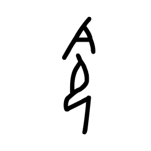

- source_zip_member: `Sub-character Images/ji97td3npi/ji97td3npi/2uvatgu7hn.png`
- checksum_sha256: see `06_component-visual-index.csv`.
- review_status: `needs_human_visual_review`
- caution: source-marked review image only.

## asset-013730

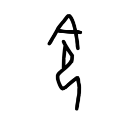

- source_zip_member: `Sub-character Images/ji97td3npi/ji97td3npi/2xqqlw48h2.png`
- checksum_sha256: see `06_component-visual-index.csv`.
- review_status: `needs_human_visual_review`
- caution: source-marked review image only.

## asset-013731

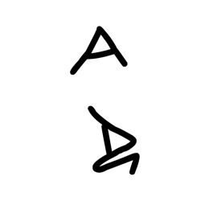

- source_zip_member: `Sub-character Images/ji97td3npi/ji97td3npi/37bsvedpzr.png`
- checksum_sha256: see `06_component-visual-index.csv`.
- review_status: `needs_human_visual_review`
- caution: source-marked review image only.

## asset-013732

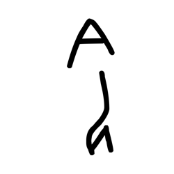

- source_zip_member: `Sub-character Images/ji97td3npi/ji97td3npi/3e08yse5pr.png`
- checksum_sha256: see `06_component-visual-index.csv`.
- review_status: `needs_human_visual_review`
- caution: source-marked review image only.

## asset-013733

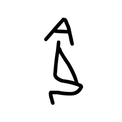

- source_zip_member: `Sub-character Images/ji97td3npi/ji97td3npi/3her0vbeij.png`
- checksum_sha256: see `06_component-visual-index.csv`.
- review_status: `needs_human_visual_review`
- caution: source-marked review image only.

## asset-013734

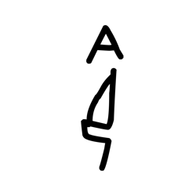

- source_zip_member: `Sub-character Images/ji97td3npi/ji97td3npi/3lo5jwhc7t.png`
- checksum_sha256: see `06_component-visual-index.csv`.
- review_status: `needs_human_visual_review`
- caution: source-marked review image only.

## asset-013735

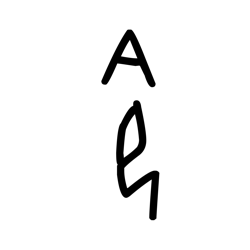

- source_zip_member: `Sub-character Images/ji97td3npi/ji97td3npi/3tmlzgz8en.png`
- checksum_sha256: see `06_component-visual-index.csv`.
- review_status: `needs_human_visual_review`
- caution: source-marked review image only.

## asset-013736

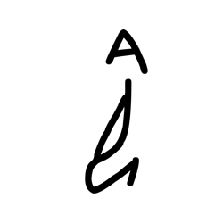

- source_zip_member: `Sub-character Images/ji97td3npi/ji97td3npi/545g5m7nd9.png`
- checksum_sha256: see `06_component-visual-index.csv`.
- review_status: `needs_human_visual_review`
- caution: source-marked review image only.

## asset-013737

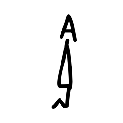

- source_zip_member: `Sub-character Images/ji97td3npi/ji97td3npi/5ffjtjb40p.png`
- checksum_sha256: see `06_component-visual-index.csv`.
- review_status: `needs_human_visual_review`
- caution: source-marked review image only.

## asset-013738

- source_zip_member: `Sub-character Images/ji97td3npi/ji97td3npi/5mg7wq53j5.png`
- checksum_sha256: see `06_component-visual-index.csv`.
- review_status: `needs_human_visual_review`
- caution: source-marked review image only.

## asset-013739

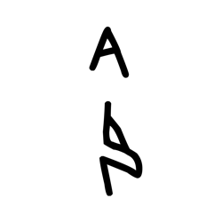

- source_zip_member: `Sub-character Images/ji97td3npi/ji97td3npi/5oo9z7zjpv.png`
- checksum_sha256: see `06_component-visual-index.csv`.
- review_status: `needs_human_visual_review`
- caution: source-marked review image only.

## asset-013740

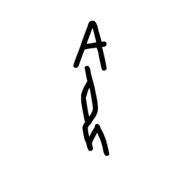

- source_zip_member: `Sub-character Images/ji97td3npi/ji97td3npi/5rracsc491.png`
- checksum_sha256: see `06_component-visual-index.csv`.
- review_status: `needs_human_visual_review`
- caution: source-marked review image only.

## asset-013741

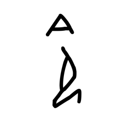

- source_zip_member: `Sub-character Images/ji97td3npi/ji97td3npi/5vhrx54l6o.png`
- checksum_sha256: see `06_component-visual-index.csv`.
- review_status: `needs_human_visual_review`
- caution: source-marked review image only.

## asset-013742

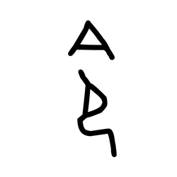

- source_zip_member: `Sub-character Images/ji97td3npi/ji97td3npi/69gn8j9nx1.png`
- checksum_sha256: see `06_component-visual-index.csv`.
- review_status: `needs_human_visual_review`
- caution: source-marked review image only.

## asset-013743

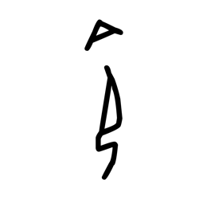

- source_zip_member: `Sub-character Images/ji97td3npi/ji97td3npi/6eynd9z1x3.png`
- checksum_sha256: see `06_component-visual-index.csv`.
- review_status: `needs_human_visual_review`
- caution: source-marked review image only.

## asset-013744

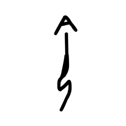

- source_zip_member: `Sub-character Images/ji97td3npi/ji97td3npi/6mxo90a9zc.png`
- checksum_sha256: see `06_component-visual-index.csv`.
- review_status: `needs_human_visual_review`
- caution: source-marked review image only.

## asset-013745

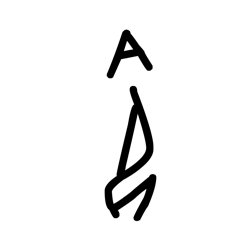

- source_zip_member: `Sub-character Images/ji97td3npi/ji97td3npi/6sdcnmk5q6.png`
- checksum_sha256: see `06_component-visual-index.csv`.
- review_status: `needs_human_visual_review`
- caution: source-marked review image only.

## asset-013746

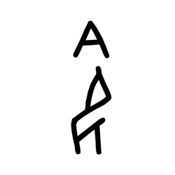

- source_zip_member: `Sub-character Images/ji97td3npi/ji97td3npi/6sq2thmbvd.png`
- checksum_sha256: see `06_component-visual-index.csv`.
- review_status: `needs_human_visual_review`
- caution: source-marked review image only.

## asset-013747

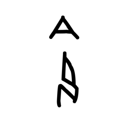

- source_zip_member: `Sub-character Images/ji97td3npi/ji97td3npi/6t3qmari1v.png`
- checksum_sha256: see `06_component-visual-index.csv`.
- review_status: `needs_human_visual_review`
- caution: source-marked review image only.

## asset-013748

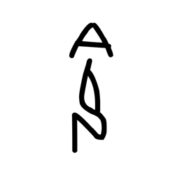

- source_zip_member: `Sub-character Images/ji97td3npi/ji97td3npi/6vtixxy4tx.png`
- checksum_sha256: see `06_component-visual-index.csv`.
- review_status: `needs_human_visual_review`
- caution: source-marked review image only.

## asset-013749

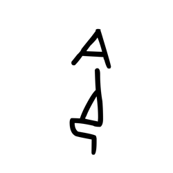

- source_zip_member: `Sub-character Images/ji97td3npi/ji97td3npi/7am2m7fs9r.png`
- checksum_sha256: see `06_component-visual-index.csv`.
- review_status: `needs_human_visual_review`
- caution: source-marked review image only.

## asset-013750

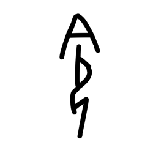

- source_zip_member: `Sub-character Images/ji97td3npi/ji97td3npi/7eut2t7ju4.png`
- checksum_sha256: see `06_component-visual-index.csv`.
- review_status: `needs_human_visual_review`
- caution: source-marked review image only.

## asset-013751

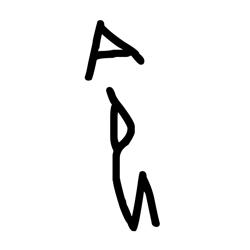

- source_zip_member: `Sub-character Images/ji97td3npi/ji97td3npi/7txq9xi6tj.png`
- checksum_sha256: see `06_component-visual-index.csv`.
- review_status: `needs_human_visual_review`
- caution: source-marked review image only.

## asset-013752

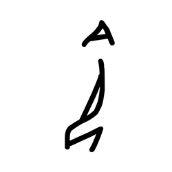

- source_zip_member: `Sub-character Images/ji97td3npi/ji97td3npi/80isku80bk.png`
- checksum_sha256: see `06_component-visual-index.csv`.
- review_status: `needs_human_visual_review`
- caution: source-marked review image only.

## asset-013753

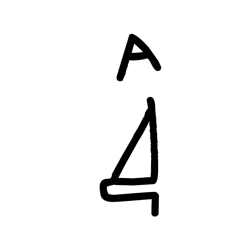

- source_zip_member: `Sub-character Images/ji97td3npi/ji97td3npi/86wfca30gw.png`
- checksum_sha256: see `06_component-visual-index.csv`.
- review_status: `needs_human_visual_review`
- caution: source-marked review image only.

## asset-013754

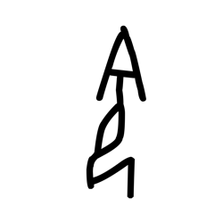

- source_zip_member: `Sub-character Images/ji97td3npi/ji97td3npi/8adg8wjkw1.png`
- checksum_sha256: see `06_component-visual-index.csv`.
- review_status: `needs_human_visual_review`
- caution: source-marked review image only.

## asset-013755

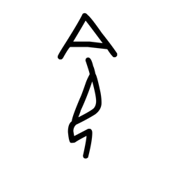

- source_zip_member: `Sub-character Images/ji97td3npi/ji97td3npi/8ldqh7rv5t.png`
- checksum_sha256: see `06_component-visual-index.csv`.
- review_status: `needs_human_visual_review`
- caution: source-marked review image only.

## asset-013756

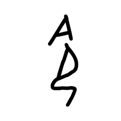

- source_zip_member: `Sub-character Images/ji97td3npi/ji97td3npi/94s38u9w08.png`
- checksum_sha256: see `06_component-visual-index.csv`.
- review_status: `needs_human_visual_review`
- caution: source-marked review image only.

## asset-013757

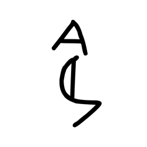

- source_zip_member: `Sub-character Images/ji97td3npi/ji97td3npi/966ry8o50y.png`
- checksum_sha256: see `06_component-visual-index.csv`.
- review_status: `needs_human_visual_review`
- caution: source-marked review image only.

## asset-013758

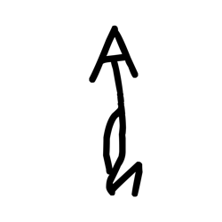

- source_zip_member: `Sub-character Images/ji97td3npi/ji97td3npi/9c6zpmge2p.png`
- checksum_sha256: see `06_component-visual-index.csv`.
- review_status: `needs_human_visual_review`
- caution: source-marked review image only.

## asset-013759

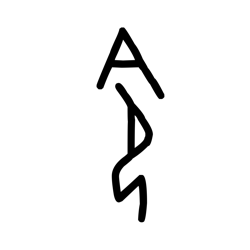

- source_zip_member: `Sub-character Images/ji97td3npi/ji97td3npi/9nvm3tkiuh.png`
- checksum_sha256: see `06_component-visual-index.csv`.
- review_status: `needs_human_visual_review`
- caution: source-marked review image only.

## asset-013760

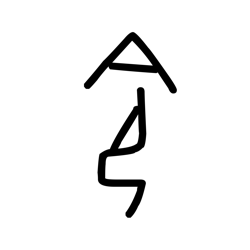

- source_zip_member: `Sub-character Images/ji97td3npi/ji97td3npi/9tz7a129pk.png`
- checksum_sha256: see `06_component-visual-index.csv`.
- review_status: `needs_human_visual_review`
- caution: source-marked review image only.

## asset-013761

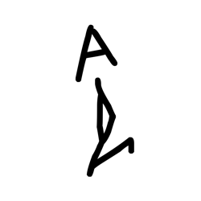

- source_zip_member: `Sub-character Images/ji97td3npi/ji97td3npi/9u3dqbhc1p.png`
- checksum_sha256: see `06_component-visual-index.csv`.
- review_status: `needs_human_visual_review`
- caution: source-marked review image only.

## asset-013762

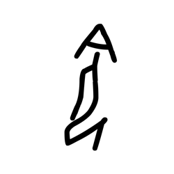

- source_zip_member: `Sub-character Images/ji97td3npi/ji97td3npi/9vsjyxm61o.png`
- checksum_sha256: see `06_component-visual-index.csv`.
- review_status: `needs_human_visual_review`
- caution: source-marked review image only.

## asset-013763

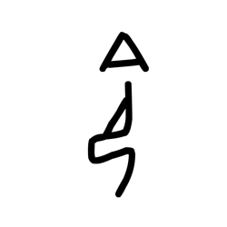

- source_zip_member: `Sub-character Images/ji97td3npi/ji97td3npi/9w9sk9fyqo.png`
- checksum_sha256: see `06_component-visual-index.csv`.
- review_status: `needs_human_visual_review`
- caution: source-marked review image only.

## asset-013764

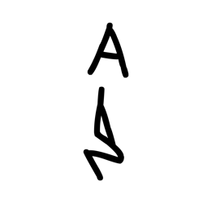

- source_zip_member: `Sub-character Images/ji97td3npi/ji97td3npi/9zzoaws8q0.png`
- checksum_sha256: see `06_component-visual-index.csv`.
- review_status: `needs_human_visual_review`
- caution: source-marked review image only.

## asset-013765

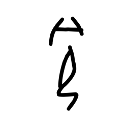

- source_zip_member: `Sub-character Images/ji97td3npi/ji97td3npi/a6j4p7kyn6.png`
- checksum_sha256: see `06_component-visual-index.csv`.
- review_status: `needs_human_visual_review`
- caution: source-marked review image only.

## asset-013766

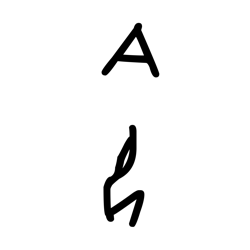

- source_zip_member: `Sub-character Images/ji97td3npi/ji97td3npi/a7xot4vejc.png`
- checksum_sha256: see `06_component-visual-index.csv`.
- review_status: `needs_human_visual_review`
- caution: source-marked review image only.

## asset-013767

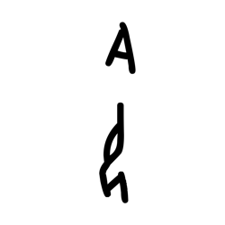

- source_zip_member: `Sub-character Images/ji97td3npi/ji97td3npi/aii62rj1ck.png`
- checksum_sha256: see `06_component-visual-index.csv`.
- review_status: `needs_human_visual_review`
- caution: source-marked review image only.

## asset-013768

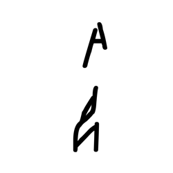

- source_zip_member: `Sub-character Images/ji97td3npi/ji97td3npi/aopoki120t.png`
- checksum_sha256: see `06_component-visual-index.csv`.
- review_status: `needs_human_visual_review`
- caution: source-marked review image only.

## asset-013769

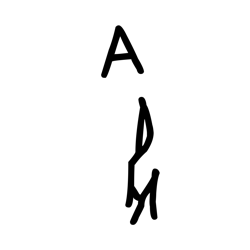

- source_zip_member: `Sub-character Images/ji97td3npi/ji97td3npi/bkspunfid7.png`
- checksum_sha256: see `06_component-visual-index.csv`.
- review_status: `needs_human_visual_review`
- caution: source-marked review image only.

## asset-013770

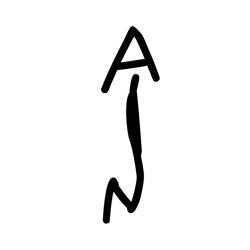

- source_zip_member: `Sub-character Images/ji97td3npi/ji97td3npi/bvxisfp0nu.png`
- checksum_sha256: see `06_component-visual-index.csv`.
- review_status: `needs_human_visual_review`
- caution: source-marked review image only.

## asset-013771

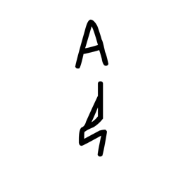

- source_zip_member: `Sub-character Images/ji97td3npi/ji97td3npi/bw6xhmkky4.png`
- checksum_sha256: see `06_component-visual-index.csv`.
- review_status: `needs_human_visual_review`
- caution: source-marked review image only.

## asset-013772

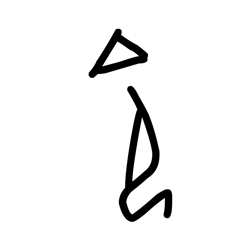

- source_zip_member: `Sub-character Images/ji97td3npi/ji97td3npi/bwdckomm8b.png`
- checksum_sha256: see `06_component-visual-index.csv`.
- review_status: `needs_human_visual_review`
- caution: source-marked review image only.

## asset-013773

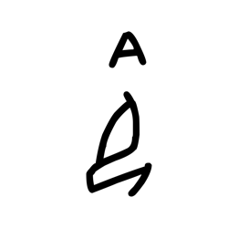

- source_zip_member: `Sub-character Images/ji97td3npi/ji97td3npi/c68bjd0egh.png`
- checksum_sha256: see `06_component-visual-index.csv`.
- review_status: `needs_human_visual_review`
- caution: source-marked review image only.

## asset-013774

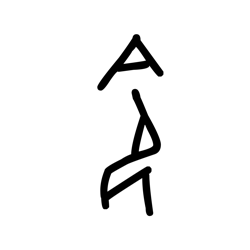

- source_zip_member: `Sub-character Images/ji97td3npi/ji97td3npi/cavqx2ymqj.png`
- checksum_sha256: see `06_component-visual-index.csv`.
- review_status: `needs_human_visual_review`
- caution: source-marked review image only.

## asset-013775

- source_zip_member: `Sub-character Images/ji97td3npi/ji97td3npi/cfa0ebjkr7.png`
- checksum_sha256: see `06_component-visual-index.csv`.
- review_status: `needs_human_visual_review`
- caution: source-marked review image only.

## asset-013776

- source_zip_member: `Sub-character Images/ji97td3npi/ji97td3npi/cgh52can7v.png`
- checksum_sha256: see `06_component-visual-index.csv`.
- review_status: `needs_human_visual_review`
- caution: source-marked review image only.

## asset-013777

- source_zip_member: `Sub-character Images/ji97td3npi/ji97td3npi/cyclqdbcyj.png`
- checksum_sha256: see `06_component-visual-index.csv`.
- review_status: `needs_human_visual_review`
- caution: source-marked review image only.

## asset-013778

- source_zip_member: `Sub-character Images/ji97td3npi/ji97td3npi/dpc179jehh.png`
- checksum_sha256: see `06_component-visual-index.csv`.
- review_status: `needs_human_visual_review`
- caution: source-marked review image only.

## asset-013779

- source_zip_member: `Sub-character Images/ji97td3npi/ji97td3npi/dwq6n637ck.png`
- checksum_sha256: see `06_component-visual-index.csv`.
- review_status: `needs_human_visual_review`
- caution: source-marked review image only.

## asset-013780

- source_zip_member: `Sub-character Images/ji97td3npi/ji97td3npi/e499r413ry.png`
- checksum_sha256: see `06_component-visual-index.csv`.
- review_status: `needs_human_visual_review`
- caution: source-marked review image only.

## asset-013781

- source_zip_member: `Sub-character Images/ji97td3npi/ji97td3npi/e85qs4r9mb.png`
- checksum_sha256: see `06_component-visual-index.csv`.
- review_status: `needs_human_visual_review`
- caution: source-marked review image only.

## asset-013782

- source_zip_member: `Sub-character Images/ji97td3npi/ji97td3npi/eczqpasfy0.png`
- checksum_sha256: see `06_component-visual-index.csv`.
- review_status: `needs_human_visual_review`
- caution: source-marked review image only.

## asset-013783

- source_zip_member: `Sub-character Images/ji97td3npi/ji97td3npi/eev995nc0k.png`
- checksum_sha256: see `06_component-visual-index.csv`.
- review_status: `needs_human_visual_review`
- caution: source-marked review image only.

## asset-013784

- source_zip_member: `Sub-character Images/ji97td3npi/ji97td3npi/ep9ue7fku7.png`
- checksum_sha256: see `06_component-visual-index.csv`.
- review_status: `needs_human_visual_review`
- caution: source-marked review image only.

## asset-013785

- source_zip_member: `Sub-character Images/ji97td3npi/ji97td3npi/eu7vorlngb.png`
- checksum_sha256: see `06_component-visual-index.csv`.
- review_status: `needs_human_visual_review`
- caution: source-marked review image only.

## asset-013786

- source_zip_member: `Sub-character Images/ji97td3npi/ji97td3npi/f5xj2sw16c.png`
- checksum_sha256: see `06_component-visual-index.csv`.
- review_status: `needs_human_visual_review`
- caution: source-marked review image only.

## asset-013787

- source_zip_member: `Sub-character Images/ji97td3npi/ji97td3npi/fq9tgjku2u.png`
- checksum_sha256: see `06_component-visual-index.csv`.
- review_status: `needs_human_visual_review`
- caution: source-marked review image only.

## asset-013788

- source_zip_member: `Sub-character Images/ji97td3npi/ji97td3npi/fro8agmd88.png`
- checksum_sha256: see `06_component-visual-index.csv`.
- review_status: `needs_human_visual_review`
- caution: source-marked review image only.

## asset-013789

- source_zip_member: `Sub-character Images/ji97td3npi/ji97td3npi/fx9wcn2i6f.png`
- checksum_sha256: see `06_component-visual-index.csv`.
- review_status: `needs_human_visual_review`
- caution: source-marked review image only.

## asset-013790

- source_zip_member: `Sub-character Images/ji97td3npi/ji97td3npi/fxq8yifev9.png`
- checksum_sha256: see `06_component-visual-index.csv`.
- review_status: `needs_human_visual_review`
- caution: source-marked review image only.

## asset-013791

- source_zip_member: `Sub-character Images/ji97td3npi/ji97td3npi/gpf03izox8.png`
- checksum_sha256: see `06_component-visual-index.csv`.
- review_status: `needs_human_visual_review`
- caution: source-marked review image only.

## asset-013792

- source_zip_member: `Sub-character Images/ji97td3npi/ji97td3npi/gvve9w9bb0.png`
- checksum_sha256: see `06_component-visual-index.csv`.
- review_status: `needs_human_visual_review`
- caution: source-marked review image only.

## asset-013793

- source_zip_member: `Sub-character Images/ji97td3npi/ji97td3npi/h6razfpnww.png`
- checksum_sha256: see `06_component-visual-index.csv`.
- review_status: `needs_human_visual_review`
- caution: source-marked review image only.

## asset-013794

- source_zip_member: `Sub-character Images/ji97td3npi/ji97td3npi/hyitmjay5t.png`
- checksum_sha256: see `06_component-visual-index.csv`.
- review_status: `needs_human_visual_review`
- caution: source-marked review image only.

## asset-013795

- source_zip_member: `Sub-character Images/ji97td3npi/ji97td3npi/i87124qpiy.png`
- checksum_sha256: see `06_component-visual-index.csv`.
- review_status: `needs_human_visual_review`
- caution: source-marked review image only.

## asset-013796

- source_zip_member: `Sub-character Images/ji97td3npi/ji97td3npi/i8bry6f5lb.png`
- checksum_sha256: see `06_component-visual-index.csv`.
- review_status: `needs_human_visual_review`
- caution: source-marked review image only.

## asset-013797

- source_zip_member: `Sub-character Images/ji97td3npi/ji97td3npi/i97uttdkwd.png`
- checksum_sha256: see `06_component-visual-index.csv`.
- review_status: `needs_human_visual_review`
- caution: source-marked review image only.

## asset-013798

- source_zip_member: `Sub-character Images/ji97td3npi/ji97td3npi/ihiouj5ize.png`
- checksum_sha256: see `06_component-visual-index.csv`.
- review_status: `needs_human_visual_review`
- caution: source-marked review image only.

## asset-013799

- source_zip_member: `Sub-character Images/ji97td3npi/ji97td3npi/ihox75nyji.png`
- checksum_sha256: see `06_component-visual-index.csv`.
- review_status: `needs_human_visual_review`
- caution: source-marked review image only.

## asset-013800

- source_zip_member: `Sub-character Images/ji97td3npi/ji97td3npi/iq8tvj38u8.png`
- checksum_sha256: see `06_component-visual-index.csv`.
- review_status: `needs_human_visual_review`
- caution: source-marked review image only.

## asset-013801

- source_zip_member: `Sub-character Images/ji97td3npi/ji97td3npi/j0ay25shvm.png`
- checksum_sha256: see `06_component-visual-index.csv`.
- review_status: `needs_human_visual_review`
- caution: source-marked review image only.

## asset-013802

- source_zip_member: `Sub-character Images/ji97td3npi/ji97td3npi/j762eywmxl.png`
- checksum_sha256: see `06_component-visual-index.csv`.
- review_status: `needs_human_visual_review`
- caution: source-marked review image only.

## asset-013803

- source_zip_member: `Sub-character Images/ji97td3npi/ji97td3npi/j87gmot2nf.png`
- checksum_sha256: see `06_component-visual-index.csv`.
- review_status: `needs_human_visual_review`
- caution: source-marked review image only.

## asset-013804

- source_zip_member: `Sub-character Images/ji97td3npi/ji97td3npi/ji97td3npi.png`
- checksum_sha256: see `06_component-visual-index.csv`.
- review_status: `needs_human_visual_review`
- caution: source-marked review image only.

## asset-013805

- source_zip_member: `Sub-character Images/ji97td3npi/ji97td3npi/jxr5wk3aro.png`
- checksum_sha256: see `06_component-visual-index.csv`.
- review_status: `needs_human_visual_review`
- caution: source-marked review image only.

## asset-013806

- source_zip_member: `Sub-character Images/ji97td3npi/ji97td3npi/kt7bc10l5b.png`
- checksum_sha256: see `06_component-visual-index.csv`.
- review_status: `needs_human_visual_review`
- caution: source-marked review image only.

## asset-013807

- source_zip_member: `Sub-character Images/ji97td3npi/ji97td3npi/kvar35r97k.png`
- checksum_sha256: see `06_component-visual-index.csv`.
- review_status: `needs_human_visual_review`
- caution: source-marked review image only.

## asset-013808

- source_zip_member: `Sub-character Images/ji97td3npi/ji97td3npi/kzn78dejd7.png`
- checksum_sha256: see `06_component-visual-index.csv`.
- review_status: `needs_human_visual_review`
- caution: source-marked review image only.

## asset-013809

- source_zip_member: `Sub-character Images/ji97td3npi/ji97td3npi/lnf1prvdj4.png`
- checksum_sha256: see `06_component-visual-index.csv`.
- review_status: `needs_human_visual_review`
- caution: source-marked review image only.

## asset-013810

- source_zip_member: `Sub-character Images/ji97td3npi/ji97td3npi/lxpmdtugyk.png`
- checksum_sha256: see `06_component-visual-index.csv`.
- review_status: `needs_human_visual_review`
- caution: source-marked review image only.

## asset-013811

- source_zip_member: `Sub-character Images/ji97td3npi/ji97td3npi/mbc667u9yc.png`
- checksum_sha256: see `06_component-visual-index.csv`.
- review_status: `needs_human_visual_review`
- caution: source-marked review image only.

## asset-013812

- source_zip_member: `Sub-character Images/ji97td3npi/ji97td3npi/mna8o9v9g8.png`
- checksum_sha256: see `06_component-visual-index.csv`.
- review_status: `needs_human_visual_review`
- caution: source-marked review image only.

## asset-013813

- source_zip_member: `Sub-character Images/ji97td3npi/ji97td3npi/n25yme6hup.png`
- checksum_sha256: see `06_component-visual-index.csv`.
- review_status: `needs_human_visual_review`
- caution: source-marked review image only.

## asset-013814

- source_zip_member: `Sub-character Images/ji97td3npi/ji97td3npi/o3izqk5uze.png`
- checksum_sha256: see `06_component-visual-index.csv`.
- review_status: `needs_human_visual_review`
- caution: source-marked review image only.

## asset-013815

- source_zip_member: `Sub-character Images/ji97td3npi/ji97td3npi/o4pxg6hlcb.png`
- checksum_sha256: see `06_component-visual-index.csv`.
- review_status: `needs_human_visual_review`
- caution: source-marked review image only.

## asset-013816

- source_zip_member: `Sub-character Images/ji97td3npi/ji97td3npi/okuz3fsos6.png`
- checksum_sha256: see `06_component-visual-index.csv`.
- review_status: `needs_human_visual_review`
- caution: source-marked review image only.

## asset-013817

- source_zip_member: `Sub-character Images/ji97td3npi/ji97td3npi/pg55hjtw66.png`
- checksum_sha256: see `06_component-visual-index.csv`.
- review_status: `needs_human_visual_review`
- caution: source-marked review image only.

## asset-013818

- source_zip_member: `Sub-character Images/ji97td3npi/ji97td3npi/q30u4aduxw.png`
- checksum_sha256: see `06_component-visual-index.csv`.
- review_status: `needs_human_visual_review`
- caution: source-marked review image only.

## asset-013819

- source_zip_member: `Sub-character Images/ji97td3npi/ji97td3npi/q8b7zk7qk9.png`
- checksum_sha256: see `06_component-visual-index.csv`.
- review_status: `needs_human_visual_review`
- caution: source-marked review image only.

## asset-013820

- source_zip_member: `Sub-character Images/ji97td3npi/ji97td3npi/qgtsbsf1qc.png`
- checksum_sha256: see `06_component-visual-index.csv`.
- review_status: `needs_human_visual_review`
- caution: source-marked review image only.

## asset-013821

- source_zip_member: `Sub-character Images/ji97td3npi/ji97td3npi/qjewa3yri4.png`
- checksum_sha256: see `06_component-visual-index.csv`.
- review_status: `needs_human_visual_review`
- caution: source-marked review image only.

## asset-013822

- source_zip_member: `Sub-character Images/ji97td3npi/ji97td3npi/ql9ccmv1lr.png`
- checksum_sha256: see `06_component-visual-index.csv`.
- review_status: `needs_human_visual_review`
- caution: source-marked review image only.

## asset-013823

- source_zip_member: `Sub-character Images/ji97td3npi/ji97td3npi/r1o0z3o5wk.png`
- checksum_sha256: see `06_component-visual-index.csv`.
- review_status: `needs_human_visual_review`
- caution: source-marked review image only.

## asset-013824

- source_zip_member: `Sub-character Images/ji97td3npi/ji97td3npi/r5vwx1iem8.png`
- checksum_sha256: see `06_component-visual-index.csv`.
- review_status: `needs_human_visual_review`
- caution: source-marked review image only.

## asset-013825

- source_zip_member: `Sub-character Images/ji97td3npi/ji97td3npi/r7y3b92dis.png`
- checksum_sha256: see `06_component-visual-index.csv`.
- review_status: `needs_human_visual_review`
- caution: source-marked review image only.

## asset-013826

- source_zip_member: `Sub-character Images/ji97td3npi/ji97td3npi/rvdrwzr9el.png`
- checksum_sha256: see `06_component-visual-index.csv`.
- review_status: `needs_human_visual_review`
- caution: source-marked review image only.

## asset-013827

- source_zip_member: `Sub-character Images/ji97td3npi/ji97td3npi/s2uhjndebi.png`
- checksum_sha256: see `06_component-visual-index.csv`.
- review_status: `needs_human_visual_review`
- caution: source-marked review image only.

## asset-013828

- source_zip_member: `Sub-character Images/ji97td3npi/ji97td3npi/seywsp1kal.png`
- checksum_sha256: see `06_component-visual-index.csv`.
- review_status: `needs_human_visual_review`
- caution: source-marked review image only.

## asset-013829

- source_zip_member: `Sub-character Images/ji97td3npi/ji97td3npi/sg0fv6sndx.png`
- checksum_sha256: see `06_component-visual-index.csv`.
- review_status: `needs_human_visual_review`
- caution: source-marked review image only.

## asset-013830

- source_zip_member: `Sub-character Images/ji97td3npi/ji97td3npi/slz0r7e2vx.png`
- checksum_sha256: see `06_component-visual-index.csv`.
- review_status: `needs_human_visual_review`
- caution: source-marked review image only.

## asset-013831

- source_zip_member: `Sub-character Images/ji97td3npi/ji97td3npi/sn1pu8gfmv.png`
- checksum_sha256: see `06_component-visual-index.csv`.
- review_status: `needs_human_visual_review`
- caution: source-marked review image only.

## asset-013832

- source_zip_member: `Sub-character Images/ji97td3npi/ji97td3npi/ubynm9nen8.png`
- checksum_sha256: see `06_component-visual-index.csv`.
- review_status: `needs_human_visual_review`
- caution: source-marked review image only.

## asset-013833

- source_zip_member: `Sub-character Images/ji97td3npi/ji97td3npi/uf9908zs2x.png`
- checksum_sha256: see `06_component-visual-index.csv`.
- review_status: `needs_human_visual_review`
- caution: source-marked review image only.

## asset-013834

- source_zip_member: `Sub-character Images/ji97td3npi/ji97td3npi/vnt0oyeuzb.png`
- checksum_sha256: see `06_component-visual-index.csv`.
- review_status: `needs_human_visual_review`
- caution: source-marked review image only.

## asset-013835

- source_zip_member: `Sub-character Images/ji97td3npi/ji97td3npi/vpzqy0irlv.png`
- checksum_sha256: see `06_component-visual-index.csv`.
- review_status: `needs_human_visual_review`
- caution: source-marked review image only.

## asset-013836

- source_zip_member: `Sub-character Images/ji97td3npi/ji97td3npi/vq4oupxwnp.png`
- checksum_sha256: see `06_component-visual-index.csv`.
- review_status: `needs_human_visual_review`
- caution: source-marked review image only.

## asset-013837

- source_zip_member: `Sub-character Images/ji97td3npi/ji97td3npi/vqhma9npwd.png`
- checksum_sha256: see `06_component-visual-index.csv`.
- review_status: `needs_human_visual_review`
- caution: source-marked review image only.

## asset-013838

- source_zip_member: `Sub-character Images/ji97td3npi/ji97td3npi/w1nhjw906q.png`
- checksum_sha256: see `06_component-visual-index.csv`.
- review_status: `needs_human_visual_review`
- caution: source-marked review image only.

## asset-013839

- source_zip_member: `Sub-character Images/ji97td3npi/ji97td3npi/wzj2sdaqc8.png`
- checksum_sha256: see `06_component-visual-index.csv`.
- review_status: `needs_human_visual_review`
- caution: source-marked review image only.

## asset-013840

- source_zip_member: `Sub-character Images/ji97td3npi/ji97td3npi/wzopfnumfn.png`
- checksum_sha256: see `06_component-visual-index.csv`.
- review_status: `needs_human_visual_review`
- caution: source-marked review image only.

## asset-013841

- source_zip_member: `Sub-character Images/ji97td3npi/ji97td3npi/x49cugddkx.png`
- checksum_sha256: see `06_component-visual-index.csv`.
- review_status: `needs_human_visual_review`
- caution: source-marked review image only.

## asset-013842

- source_zip_member: `Sub-character Images/ji97td3npi/ji97td3npi/xj8hozj5aj.png`
- checksum_sha256: see `06_component-visual-index.csv`.
- review_status: `needs_human_visual_review`
- caution: source-marked review image only.

## asset-013843

- source_zip_member: `Sub-character Images/ji97td3npi/ji97td3npi/xzgryk9v3w.png`
- checksum_sha256: see `06_component-visual-index.csv`.
- review_status: `needs_human_visual_review`
- caution: source-marked review image only.

## asset-013844

- source_zip_member: `Sub-character Images/ji97td3npi/ji97td3npi/yexsn44jj5.png`
- checksum_sha256: see `06_component-visual-index.csv`.
- review_status: `needs_human_visual_review`
- caution: source-marked review image only.

## asset-013845

- source_zip_member: `Sub-character Images/ji97td3npi/ji97td3npi/ygevzigs0n.png`
- checksum_sha256: see `06_component-visual-index.csv`.
- review_status: `needs_human_visual_review`
- caution: source-marked review image only.

## asset-013846

- source_zip_member: `Sub-character Images/ji97td3npi/ji97td3npi/yjf6m64hog.png`
- checksum_sha256: see `06_component-visual-index.csv`.
- review_status: `needs_human_visual_review`
- caution: source-marked review image only.

## asset-013847

- source_zip_member: `Sub-character Images/ji97td3npi/ji97td3npi/ylxyuwuof8.png`
- checksum_sha256: see `06_component-visual-index.csv`.
- review_status: `needs_human_visual_review`
- caution: source-marked review image only.

## asset-013848

- source_zip_member: `Sub-character Images/ji97td3npi/ji97td3npi/ymrv6g9m7u.png`
- checksum_sha256: see `06_component-visual-index.csv`.
- review_status: `needs_human_visual_review`
- caution: source-marked review image only.

## asset-013849

- source_zip_member: `Sub-character Images/ji97td3npi/ji97td3npi/yquylux3bm.png`
- checksum_sha256: see `06_component-visual-index.csv`.
- review_status: `needs_human_visual_review`
- caution: source-marked review image only.

## asset-013850

- source_zip_member: `Sub-character Images/ji97td3npi/ji97td3npi/yxfdlhgmaw.png`
- checksum_sha256: see `06_component-visual-index.csv`.
- review_status: `needs_human_visual_review`
- caution: source-marked review image only.

## asset-013851

- source_zip_member: `Sub-character Images/ji97td3npi/ji97td3npi/z9jctyqizc.png`
- checksum_sha256: see `06_component-visual-index.csv`.
- review_status: `needs_human_visual_review`
- caution: source-marked review image only.

## asset-013852

- source_zip_member: `Sub-character Images/ji97td3npi/ji97td3npi/zrxrqa1ucx.png`
- checksum_sha256: see `06_component-visual-index.csv`.
- review_status: `needs_human_visual_review`
- caution: source-marked review image only.
