# Component Visual Gallery / 构件图像查看: obs-comp-cand-000872

English:
This page displays OBIMD subcharacter PNG assets extracted into this concrete
corpus object directory for human review.

简体中文：
本页展示抽取到当前具体 corpus 对象目录内的 OBIMD subcharacter PNG 资料，供人工复核使用。

Boundary / 边界：
dataset image candidate only; not a confirmed component form, not a component
assignment, and not a decipherment claim.
- not a confirmed component form
- not a component assignment
- not a decipherment claim

## Concrete Questions To Check / 具体待查问题

- Open 06_component-visual-index.csv and name the local image row.
- 打开 06_component-visual-index.csv，写明本地图像行。
- Open 09_component-visual-route-index.csv and name the source route row.
- 打开 09_component-visual-route-index.csv，写明来源路线行。
- Open 13_component-context-evidence-dossier.md for character context.
- 打开 13_component-context-evidence-dossier.md，核对单字与卜辞上下文。
- Record the missing image, near-shape, source, or context route.
- 记录缺失的图像、近形、来源或上下文路线。

## asset-013869

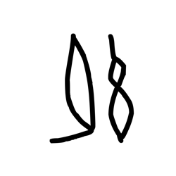

- source_zip_member: `Sub-character Images/o6m37o3l7o/o6m37o3l7o/07cji3i2co.png`
- checksum_sha256: see `06_component-visual-index.csv`.
- review_status: `needs_human_visual_review`
- caution: source-marked review image only.

## asset-013870

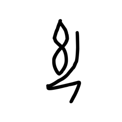

- source_zip_member: `Sub-character Images/o6m37o3l7o/o6m37o3l7o/0okjhs0hf8.png`
- checksum_sha256: see `06_component-visual-index.csv`.
- review_status: `needs_human_visual_review`
- caution: source-marked review image only.

## asset-013871

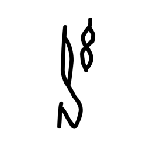

- source_zip_member: `Sub-character Images/o6m37o3l7o/o6m37o3l7o/13fgt4vowf.png`
- checksum_sha256: see `06_component-visual-index.csv`.
- review_status: `needs_human_visual_review`
- caution: source-marked review image only.

## asset-013872

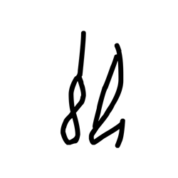

- source_zip_member: `Sub-character Images/o6m37o3l7o/o6m37o3l7o/2bhewgmnsd.png`
- checksum_sha256: see `06_component-visual-index.csv`.
- review_status: `needs_human_visual_review`
- caution: source-marked review image only.

## asset-013873

- source_zip_member: `Sub-character Images/o6m37o3l7o/o6m37o3l7o/3fsg418bzl.png`
- checksum_sha256: see `06_component-visual-index.csv`.
- review_status: `needs_human_visual_review`
- caution: source-marked review image only.

## asset-013874

- source_zip_member: `Sub-character Images/o6m37o3l7o/o6m37o3l7o/3wxub0vnw2.png`
- checksum_sha256: see `06_component-visual-index.csv`.
- review_status: `needs_human_visual_review`
- caution: source-marked review image only.

## asset-013875

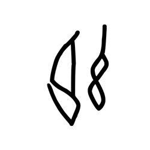

- source_zip_member: `Sub-character Images/o6m37o3l7o/o6m37o3l7o/3yktcv9s6o.png`
- checksum_sha256: see `06_component-visual-index.csv`.
- review_status: `needs_human_visual_review`
- caution: source-marked review image only.

## asset-013876

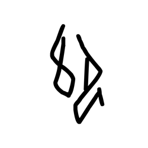

- source_zip_member: `Sub-character Images/o6m37o3l7o/o6m37o3l7o/4w6vdfxzo8.png`
- checksum_sha256: see `06_component-visual-index.csv`.
- review_status: `needs_human_visual_review`
- caution: source-marked review image only.

## asset-013877

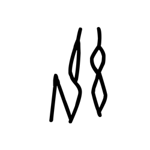

- source_zip_member: `Sub-character Images/o6m37o3l7o/o6m37o3l7o/5kjac2s4d8.png`
- checksum_sha256: see `06_component-visual-index.csv`.
- review_status: `needs_human_visual_review`
- caution: source-marked review image only.

## asset-013878

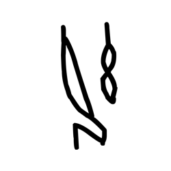

- source_zip_member: `Sub-character Images/o6m37o3l7o/o6m37o3l7o/5pe7hsltcz.png`
- checksum_sha256: see `06_component-visual-index.csv`.
- review_status: `needs_human_visual_review`
- caution: source-marked review image only.

## asset-013879

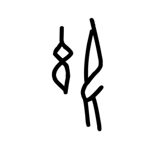

- source_zip_member: `Sub-character Images/o6m37o3l7o/o6m37o3l7o/5vxrpvo713.png`
- checksum_sha256: see `06_component-visual-index.csv`.
- review_status: `needs_human_visual_review`
- caution: source-marked review image only.

## asset-013880

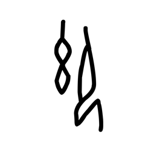

- source_zip_member: `Sub-character Images/o6m37o3l7o/o6m37o3l7o/6o32xzzmjk.png`
- checksum_sha256: see `06_component-visual-index.csv`.
- review_status: `needs_human_visual_review`
- caution: source-marked review image only.

## asset-013881

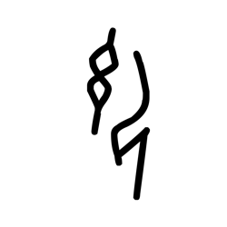

- source_zip_member: `Sub-character Images/o6m37o3l7o/o6m37o3l7o/7av554nfhx.png`
- checksum_sha256: see `06_component-visual-index.csv`.
- review_status: `needs_human_visual_review`
- caution: source-marked review image only.

## asset-013882

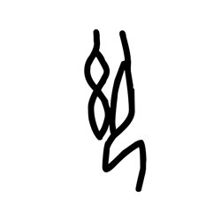

- source_zip_member: `Sub-character Images/o6m37o3l7o/o6m37o3l7o/7hes1uudq1.png`
- checksum_sha256: see `06_component-visual-index.csv`.
- review_status: `needs_human_visual_review`
- caution: source-marked review image only.

## asset-013883

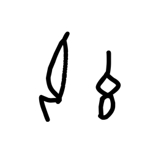

- source_zip_member: `Sub-character Images/o6m37o3l7o/o6m37o3l7o/7mhvml6zte.png`
- checksum_sha256: see `06_component-visual-index.csv`.
- review_status: `needs_human_visual_review`
- caution: source-marked review image only.

## asset-013884

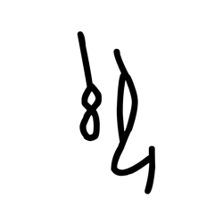

- source_zip_member: `Sub-character Images/o6m37o3l7o/o6m37o3l7o/8klj8cpt3y.png`
- checksum_sha256: see `06_component-visual-index.csv`.
- review_status: `needs_human_visual_review`
- caution: source-marked review image only.

## asset-013885

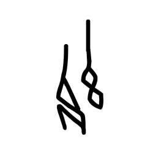

- source_zip_member: `Sub-character Images/o6m37o3l7o/o6m37o3l7o/8mj98qit2x.png`
- checksum_sha256: see `06_component-visual-index.csv`.
- review_status: `needs_human_visual_review`
- caution: source-marked review image only.

## asset-013886

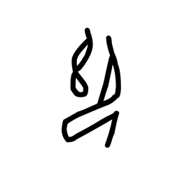

- source_zip_member: `Sub-character Images/o6m37o3l7o/o6m37o3l7o/8ndrf10abc.png`
- checksum_sha256: see `06_component-visual-index.csv`.
- review_status: `needs_human_visual_review`
- caution: source-marked review image only.

## asset-013887

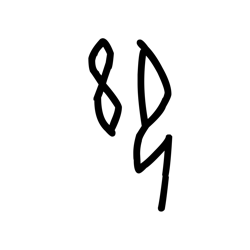

- source_zip_member: `Sub-character Images/o6m37o3l7o/o6m37o3l7o/acfgj4n1id.png`
- checksum_sha256: see `06_component-visual-index.csv`.
- review_status: `needs_human_visual_review`
- caution: source-marked review image only.

## asset-013888

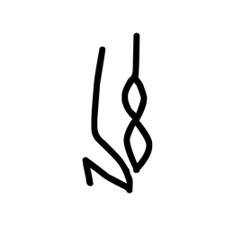

- source_zip_member: `Sub-character Images/o6m37o3l7o/o6m37o3l7o/al1e22h4ed.png`
- checksum_sha256: see `06_component-visual-index.csv`.
- review_status: `needs_human_visual_review`
- caution: source-marked review image only.

## asset-013889

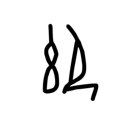

- source_zip_member: `Sub-character Images/o6m37o3l7o/o6m37o3l7o/b7rrmfxstb.png`
- checksum_sha256: see `06_component-visual-index.csv`.
- review_status: `needs_human_visual_review`
- caution: source-marked review image only.

## asset-013890

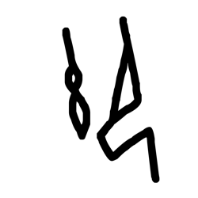

- source_zip_member: `Sub-character Images/o6m37o3l7o/o6m37o3l7o/bfo45p6tc7.png`
- checksum_sha256: see `06_component-visual-index.csv`.
- review_status: `needs_human_visual_review`
- caution: source-marked review image only.

## asset-013891

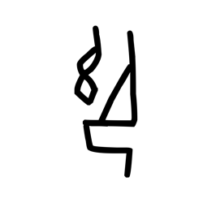

- source_zip_member: `Sub-character Images/o6m37o3l7o/o6m37o3l7o/bw5d2oonrt.png`
- checksum_sha256: see `06_component-visual-index.csv`.
- review_status: `needs_human_visual_review`
- caution: source-marked review image only.

## asset-013892

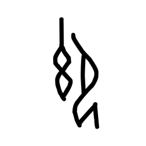

- source_zip_member: `Sub-character Images/o6m37o3l7o/o6m37o3l7o/by54aa3auk.png`
- checksum_sha256: see `06_component-visual-index.csv`.
- review_status: `needs_human_visual_review`
- caution: source-marked review image only.

## asset-013893

- source_zip_member: `Sub-character Images/o6m37o3l7o/o6m37o3l7o/crkbwl30qq.png`
- checksum_sha256: see `06_component-visual-index.csv`.
- review_status: `needs_human_visual_review`
- caution: source-marked review image only.

## asset-013894

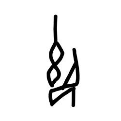

- source_zip_member: `Sub-character Images/o6m37o3l7o/o6m37o3l7o/czsv3ryx4c.png`
- checksum_sha256: see `06_component-visual-index.csv`.
- review_status: `needs_human_visual_review`
- caution: source-marked review image only.

## asset-013895

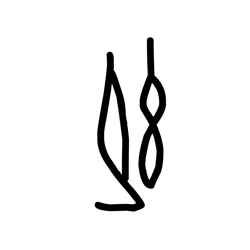

- source_zip_member: `Sub-character Images/o6m37o3l7o/o6m37o3l7o/daqtolp7nl.png`
- checksum_sha256: see `06_component-visual-index.csv`.
- review_status: `needs_human_visual_review`
- caution: source-marked review image only.

## asset-013896

- source_zip_member: `Sub-character Images/o6m37o3l7o/o6m37o3l7o/e7zdakf5vo.png`
- checksum_sha256: see `06_component-visual-index.csv`.
- review_status: `needs_human_visual_review`
- caution: source-marked review image only.

## asset-013897

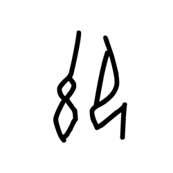

- source_zip_member: `Sub-character Images/o6m37o3l7o/o6m37o3l7o/e8k9yqvg4m.png`
- checksum_sha256: see `06_component-visual-index.csv`.
- review_status: `needs_human_visual_review`
- caution: source-marked review image only.

## asset-013898

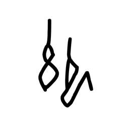

- source_zip_member: `Sub-character Images/o6m37o3l7o/o6m37o3l7o/ea7xzor2ar.png`
- checksum_sha256: see `06_component-visual-index.csv`.
- review_status: `needs_human_visual_review`
- caution: source-marked review image only.

## asset-013899

- source_zip_member: `Sub-character Images/o6m37o3l7o/o6m37o3l7o/ep2x6ukyd7.png`
- checksum_sha256: see `06_component-visual-index.csv`.
- review_status: `needs_human_visual_review`
- caution: source-marked review image only.

## asset-013900

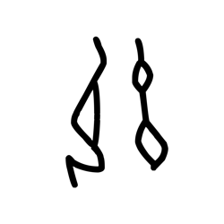

- source_zip_member: `Sub-character Images/o6m37o3l7o/o6m37o3l7o/epq8ihkqv0.png`
- checksum_sha256: see `06_component-visual-index.csv`.
- review_status: `needs_human_visual_review`
- caution: source-marked review image only.

## asset-013901

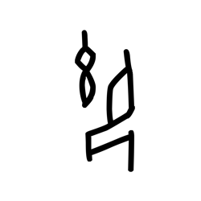

- source_zip_member: `Sub-character Images/o6m37o3l7o/o6m37o3l7o/euodgcr7bd.png`
- checksum_sha256: see `06_component-visual-index.csv`.
- review_status: `needs_human_visual_review`
- caution: source-marked review image only.

## asset-013902

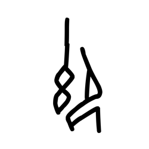

- source_zip_member: `Sub-character Images/o6m37o3l7o/o6m37o3l7o/f19mbclrez.png`
- checksum_sha256: see `06_component-visual-index.csv`.
- review_status: `needs_human_visual_review`
- caution: source-marked review image only.

## asset-013903

- source_zip_member: `Sub-character Images/o6m37o3l7o/o6m37o3l7o/f1h8i63tmv.png`
- checksum_sha256: see `06_component-visual-index.csv`.
- review_status: `needs_human_visual_review`
- caution: source-marked review image only.

## asset-013904

- source_zip_member: `Sub-character Images/o6m37o3l7o/o6m37o3l7o/fh85fu7s99.png`
- checksum_sha256: see `06_component-visual-index.csv`.
- review_status: `needs_human_visual_review`
- caution: source-marked review image only.

## asset-013905

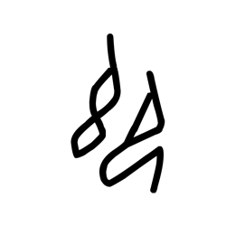

- source_zip_member: `Sub-character Images/o6m37o3l7o/o6m37o3l7o/fo91zg09bw.png`
- checksum_sha256: see `06_component-visual-index.csv`.
- review_status: `needs_human_visual_review`
- caution: source-marked review image only.

## asset-013906

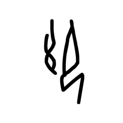

- source_zip_member: `Sub-character Images/o6m37o3l7o/o6m37o3l7o/foq18gvxjq.png`
- checksum_sha256: see `06_component-visual-index.csv`.
- review_status: `needs_human_visual_review`
- caution: source-marked review image only.

## asset-013907

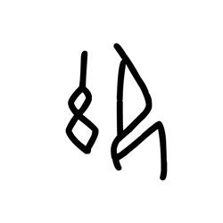

- source_zip_member: `Sub-character Images/o6m37o3l7o/o6m37o3l7o/gj8x0e7gd4.png`
- checksum_sha256: see `06_component-visual-index.csv`.
- review_status: `needs_human_visual_review`
- caution: source-marked review image only.

## asset-013908

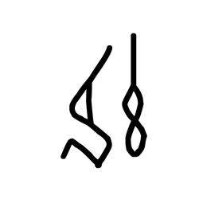

- source_zip_member: `Sub-character Images/o6m37o3l7o/o6m37o3l7o/gypprv4k8h.png`
- checksum_sha256: see `06_component-visual-index.csv`.
- review_status: `needs_human_visual_review`
- caution: source-marked review image only.

## asset-013909

- source_zip_member: `Sub-character Images/o6m37o3l7o/o6m37o3l7o/hqvidwoqh8.png`
- checksum_sha256: see `06_component-visual-index.csv`.
- review_status: `needs_human_visual_review`
- caution: source-marked review image only.

## asset-013910

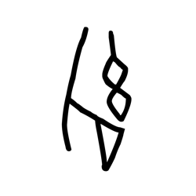

- source_zip_member: `Sub-character Images/o6m37o3l7o/o6m37o3l7o/iexrmradtb.png`
- checksum_sha256: see `06_component-visual-index.csv`.
- review_status: `needs_human_visual_review`
- caution: source-marked review image only.

## asset-013911

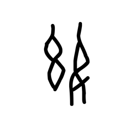

- source_zip_member: `Sub-character Images/o6m37o3l7o/o6m37o3l7o/jl7mkit3ig.png`
- checksum_sha256: see `06_component-visual-index.csv`.
- review_status: `needs_human_visual_review`
- caution: source-marked review image only.

## asset-013912

- source_zip_member: `Sub-character Images/o6m37o3l7o/o6m37o3l7o/jqrtsn28fg.png`
- checksum_sha256: see `06_component-visual-index.csv`.
- review_status: `needs_human_visual_review`
- caution: source-marked review image only.

## asset-013913

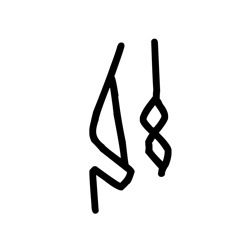

- source_zip_member: `Sub-character Images/o6m37o3l7o/o6m37o3l7o/juhqbqvqxu.png`
- checksum_sha256: see `06_component-visual-index.csv`.
- review_status: `needs_human_visual_review`
- caution: source-marked review image only.

## asset-013914

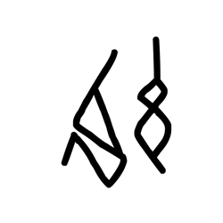

- source_zip_member: `Sub-character Images/o6m37o3l7o/o6m37o3l7o/lj8450b6ar.png`
- checksum_sha256: see `06_component-visual-index.csv`.
- review_status: `needs_human_visual_review`
- caution: source-marked review image only.

## asset-013915

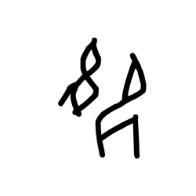

- source_zip_member: `Sub-character Images/o6m37o3l7o/o6m37o3l7o/mdca5dmt93.png`
- checksum_sha256: see `06_component-visual-index.csv`.
- review_status: `needs_human_visual_review`
- caution: source-marked review image only.

## asset-013916

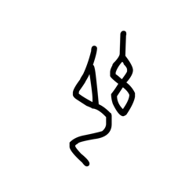

- source_zip_member: `Sub-character Images/o6m37o3l7o/o6m37o3l7o/mlsspowa7q.png`
- checksum_sha256: see `06_component-visual-index.csv`.
- review_status: `needs_human_visual_review`
- caution: source-marked review image only.

## asset-013917

- source_zip_member: `Sub-character Images/o6m37o3l7o/o6m37o3l7o/mmo5il4787.png`
- checksum_sha256: see `06_component-visual-index.csv`.
- review_status: `needs_human_visual_review`
- caution: source-marked review image only.

## asset-013918

- source_zip_member: `Sub-character Images/o6m37o3l7o/o6m37o3l7o/mqa5js4bgi.png`
- checksum_sha256: see `06_component-visual-index.csv`.
- review_status: `needs_human_visual_review`
- caution: source-marked review image only.

## asset-013919

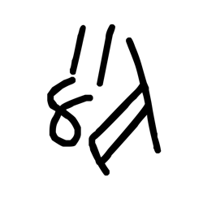

- source_zip_member: `Sub-character Images/o6m37o3l7o/o6m37o3l7o/msro67r11q.png`
- checksum_sha256: see `06_component-visual-index.csv`.
- review_status: `needs_human_visual_review`
- caution: source-marked review image only.

## asset-013920

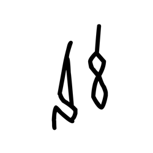

- source_zip_member: `Sub-character Images/o6m37o3l7o/o6m37o3l7o/n37elx4945.png`
- checksum_sha256: see `06_component-visual-index.csv`.
- review_status: `needs_human_visual_review`
- caution: source-marked review image only.

## asset-013921

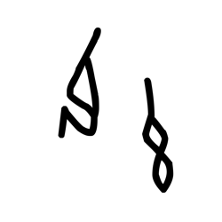

- source_zip_member: `Sub-character Images/o6m37o3l7o/o6m37o3l7o/nrdnl5658g.png`
- checksum_sha256: see `06_component-visual-index.csv`.
- review_status: `needs_human_visual_review`
- caution: source-marked review image only.

## asset-013922

- source_zip_member: `Sub-character Images/o6m37o3l7o/o6m37o3l7o/nsgje2g2rg.png`
- checksum_sha256: see `06_component-visual-index.csv`.
- review_status: `needs_human_visual_review`
- caution: source-marked review image only.

## asset-013923

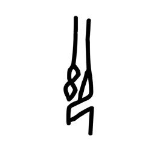

- source_zip_member: `Sub-character Images/o6m37o3l7o/o6m37o3l7o/nt1q077uey.png`
- checksum_sha256: see `06_component-visual-index.csv`.
- review_status: `needs_human_visual_review`
- caution: source-marked review image only.

## asset-013924

- source_zip_member: `Sub-character Images/o6m37o3l7o/o6m37o3l7o/o51c5mqppv.png`
- checksum_sha256: see `06_component-visual-index.csv`.
- review_status: `needs_human_visual_review`
- caution: source-marked review image only.

## asset-013925

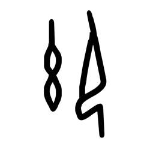

- source_zip_member: `Sub-character Images/o6m37o3l7o/o6m37o3l7o/o6m37o3l7o.png`
- checksum_sha256: see `06_component-visual-index.csv`.
- review_status: `needs_human_visual_review`
- caution: source-marked review image only.

## asset-013926

- source_zip_member: `Sub-character Images/o6m37o3l7o/o6m37o3l7o/obcxgwa5jq.png`
- checksum_sha256: see `06_component-visual-index.csv`.
- review_status: `needs_human_visual_review`
- caution: source-marked review image only.

## asset-013927

- source_zip_member: `Sub-character Images/o6m37o3l7o/o6m37o3l7o/p0d7504ea3.png`
- checksum_sha256: see `06_component-visual-index.csv`.
- review_status: `needs_human_visual_review`
- caution: source-marked review image only.

## asset-013928

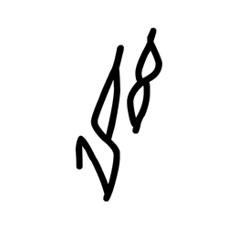

- source_zip_member: `Sub-character Images/o6m37o3l7o/o6m37o3l7o/p0ijvtnnn2.png`
- checksum_sha256: see `06_component-visual-index.csv`.
- review_status: `needs_human_visual_review`
- caution: source-marked review image only.

## asset-013929

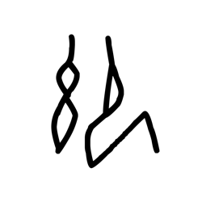

- source_zip_member: `Sub-character Images/o6m37o3l7o/o6m37o3l7o/pzgp7wc10p.png`
- checksum_sha256: see `06_component-visual-index.csv`.
- review_status: `needs_human_visual_review`
- caution: source-marked review image only.

## asset-013930

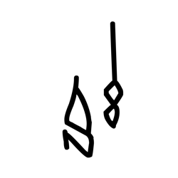

- source_zip_member: `Sub-character Images/o6m37o3l7o/o6m37o3l7o/sb2edbp40a.png`
- checksum_sha256: see `06_component-visual-index.csv`.
- review_status: `needs_human_visual_review`
- caution: source-marked review image only.

## asset-013931

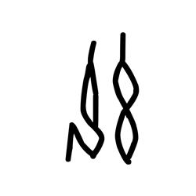

- source_zip_member: `Sub-character Images/o6m37o3l7o/o6m37o3l7o/tf7pt60g3r.png`
- checksum_sha256: see `06_component-visual-index.csv`.
- review_status: `needs_human_visual_review`
- caution: source-marked review image only.

## asset-013932

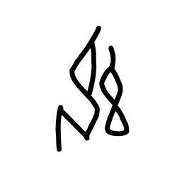

- source_zip_member: `Sub-character Images/o6m37o3l7o/o6m37o3l7o/tt5g7uk82c.png`
- checksum_sha256: see `06_component-visual-index.csv`.
- review_status: `needs_human_visual_review`
- caution: source-marked review image only.

## asset-013933

- source_zip_member: `Sub-character Images/o6m37o3l7o/o6m37o3l7o/ucvje78m3o.png`
- checksum_sha256: see `06_component-visual-index.csv`.
- review_status: `needs_human_visual_review`
- caution: source-marked review image only.

## asset-013934

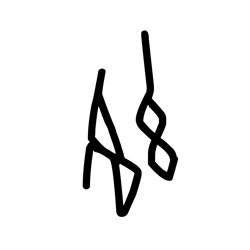

- source_zip_member: `Sub-character Images/o6m37o3l7o/o6m37o3l7o/ugr2ds989y.png`
- checksum_sha256: see `06_component-visual-index.csv`.
- review_status: `needs_human_visual_review`
- caution: source-marked review image only.

## asset-013935

- source_zip_member: `Sub-character Images/o6m37o3l7o/o6m37o3l7o/umh25olpew.png`
- checksum_sha256: see `06_component-visual-index.csv`.
- review_status: `needs_human_visual_review`
- caution: source-marked review image only.

## asset-013936

- source_zip_member: `Sub-character Images/o6m37o3l7o/o6m37o3l7o/ur5gqy3oe5.png`
- checksum_sha256: see `06_component-visual-index.csv`.
- review_status: `needs_human_visual_review`
- caution: source-marked review image only.

## asset-013937

- source_zip_member: `Sub-character Images/o6m37o3l7o/o6m37o3l7o/v1euh2685p.png`
- checksum_sha256: see `06_component-visual-index.csv`.
- review_status: `needs_human_visual_review`
- caution: source-marked review image only.

## asset-013938

- source_zip_member: `Sub-character Images/o6m37o3l7o/o6m37o3l7o/v4m2q9sux3.png`
- checksum_sha256: see `06_component-visual-index.csv`.
- review_status: `needs_human_visual_review`
- caution: source-marked review image only.

## asset-013939

- source_zip_member: `Sub-character Images/o6m37o3l7o/o6m37o3l7o/x6sm2r6yoh.png`
- checksum_sha256: see `06_component-visual-index.csv`.
- review_status: `needs_human_visual_review`
- caution: source-marked review image only.

## asset-013940

- source_zip_member: `Sub-character Images/o6m37o3l7o/o6m37o3l7o/xic7xk33uc.png`
- checksum_sha256: see `06_component-visual-index.csv`.
- review_status: `needs_human_visual_review`
- caution: source-marked review image only.

## asset-013941

- source_zip_member: `Sub-character Images/o6m37o3l7o/o6m37o3l7o/xsf0m0esd6.png`
- checksum_sha256: see `06_component-visual-index.csv`.
- review_status: `needs_human_visual_review`
- caution: source-marked review image only.

## asset-013942

- source_zip_member: `Sub-character Images/o6m37o3l7o/o6m37o3l7o/xxpoqgu0i5.png`
- checksum_sha256: see `06_component-visual-index.csv`.
- review_status: `needs_human_visual_review`
- caution: source-marked review image only.

## asset-013943

- source_zip_member: `Sub-character Images/o6m37o3l7o/o6m37o3l7o/yasgo77hen.png`
- checksum_sha256: see `06_component-visual-index.csv`.
- review_status: `needs_human_visual_review`
- caution: source-marked review image only.

## asset-013944

- source_zip_member: `Sub-character Images/o6m37o3l7o/o6m37o3l7o/z7kgqo4eoz.png`
- checksum_sha256: see `06_component-visual-index.csv`.
- review_status: `needs_human_visual_review`
- caution: source-marked review image only.
