# Component Visual Gallery / 构件图像查看: obs-comp-cand-000912

English:
This page displays OBIMD subcharacter PNG assets extracted into this concrete
corpus object directory for human review.

简体中文：
本页展示抽取到当前具体 corpus 对象目录内的 OBIMD subcharacter PNG 资料，供人工复核使用。

Boundary / 边界：
dataset image candidate only; not a confirmed component form, not a component
assignment, and not a decipherment claim.
- not a confirmed component form
- not a component assignment
- not a decipherment claim

## Concrete Questions To Check / 具体待查问题

- Which local image should be opened first?
- 应先打开哪一张本地构件图像？
- Which source zip member anchors this image?
- 哪一个 source zip member 能定位这张图像？
- Which near-shape or variant comparison is still missing?
- 还缺哪些近形或异体比较？
- Which character or inscription context should be checked next?
- 下一步应核对哪些单字或卜辞上下文？
- What evidence is missing before a component assignment?
- 正式构件归属前还缺哪些证据？

## asset-013984

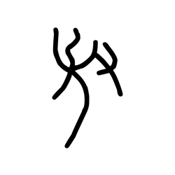

- source_zip_member: `Sub-character Images/7p7pi5fxkj/9m5jjuadiy/02oevvnz5u.png`
- checksum_sha256: see `06_component-visual-index.csv`.
- review_status: `needs_human_visual_review`
- caution: source-marked review image only.

## asset-013985

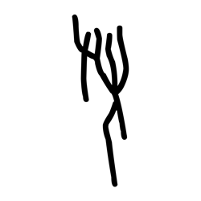

- source_zip_member: `Sub-character Images/7p7pi5fxkj/9m5jjuadiy/75ik90t5cq.png`
- checksum_sha256: see `06_component-visual-index.csv`.
- review_status: `needs_human_visual_review`
- caution: source-marked review image only.

## asset-013986

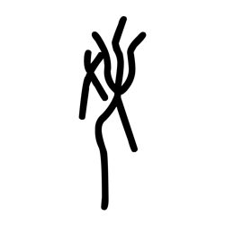

- source_zip_member: `Sub-character Images/7p7pi5fxkj/9m5jjuadiy/9b7misy72g.png`
- checksum_sha256: see `06_component-visual-index.csv`.
- review_status: `needs_human_visual_review`
- caution: source-marked review image only.

## asset-013987

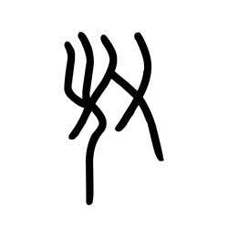

- source_zip_member: `Sub-character Images/7p7pi5fxkj/9m5jjuadiy/9m5jjuadiy.png`
- checksum_sha256: see `06_component-visual-index.csv`.
- review_status: `needs_human_visual_review`
- caution: source-marked review image only.

## asset-013988

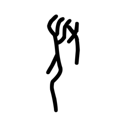

- source_zip_member: `Sub-character Images/7p7pi5fxkj/9m5jjuadiy/a85eg15xk3.png`
- checksum_sha256: see `06_component-visual-index.csv`.
- review_status: `needs_human_visual_review`
- caution: source-marked review image only.

## asset-013989

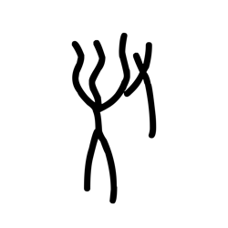

- source_zip_member: `Sub-character Images/7p7pi5fxkj/9m5jjuadiy/i0lydz04xk.png`
- checksum_sha256: see `06_component-visual-index.csv`.
- review_status: `needs_human_visual_review`
- caution: source-marked review image only.

## asset-013990

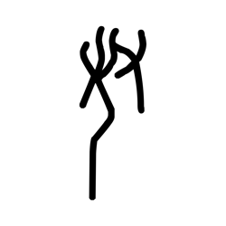

- source_zip_member: `Sub-character Images/7p7pi5fxkj/9m5jjuadiy/o04ufpimfi.png`
- checksum_sha256: see `06_component-visual-index.csv`.
- review_status: `needs_human_visual_review`
- caution: source-marked review image only.

## asset-013991

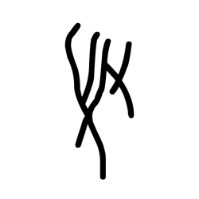

- source_zip_member: `Sub-character Images/7p7pi5fxkj/9m5jjuadiy/oes65qb4do.png`
- checksum_sha256: see `06_component-visual-index.csv`.
- review_status: `needs_human_visual_review`
- caution: source-marked review image only.

## asset-013992

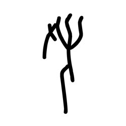

- source_zip_member: `Sub-character Images/7p7pi5fxkj/9m5jjuadiy/sj1zyl8ejq.png`
- checksum_sha256: see `06_component-visual-index.csv`.
- review_status: `needs_human_visual_review`
- caution: source-marked review image only.

## asset-013993

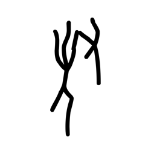

- source_zip_member: `Sub-character Images/7p7pi5fxkj/9m5jjuadiy/spfjlmuxqb.png`
- checksum_sha256: see `06_component-visual-index.csv`.
- review_status: `needs_human_visual_review`
- caution: source-marked review image only.

## asset-013994

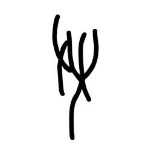

- source_zip_member: `Sub-character Images/7p7pi5fxkj/9m5jjuadiy/st13geeurc.png`
- checksum_sha256: see `06_component-visual-index.csv`.
- review_status: `needs_human_visual_review`
- caution: source-marked review image only.

## asset-013995

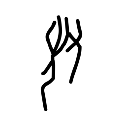

- source_zip_member: `Sub-character Images/7p7pi5fxkj/9m5jjuadiy/tenv7878ks.png`
- checksum_sha256: see `06_component-visual-index.csv`.
- review_status: `needs_human_visual_review`
- caution: source-marked review image only.
