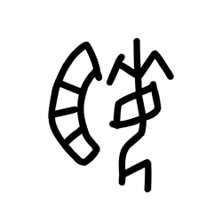

# Component Visual Gallery / 构件图像查看: obs-comp-cand-000953

English:
This page displays OBIMD subcharacter PNG assets extracted into this concrete corpus object directory for human review.

简体中文：
本页展示抽取到当前具体 corpus 对象目录内的 OBIMD subcharacter PNG 资料，供人工复核使用。

Boundary / 边界：dataset image candidate only; not a confirmed component form, component assignment, or decipherment claim.

## asset-014036

- source_zip_member: `Sub-character Images/g546qlgz9n/p261sltt8d/p261sltt8d.png`
- checksum_sha256: `0b5113104ac97c40dd85cb0b487587cbfe025ea51d01cc26aa3b41e1e511e1e0`
- review_status: `needs_human_visual_review`
- caution: OBIMD subcharacter image is a source-marked review asset only; it is not a confirmed component form, component assignment, or decipherment conclusion.
