# Component Visual Gallery / 构件图像查看: obs-comp-cand-000969

English:
This page displays OBIMD subcharacter PNG assets extracted into this concrete
corpus object directory for human review.

简体中文：
本页展示抽取到当前具体 corpus 对象目录内的 OBIMD subcharacter PNG 资料，供人工复核使用。

Boundary / 边界：
dataset image candidate only; not a confirmed component form, not a component
assignment, and not a decipherment claim.
- not a confirmed component form
- not a component assignment
- not a decipherment claim

## Concrete Questions To Check / 具体待查问题

- Open 06_component-visual-index.csv and name the local image row.
- 打开 06_component-visual-index.csv，写明本地图像行。
- Open 09_component-visual-route-index.csv and name the source route row.
- 打开 09_component-visual-route-index.csv，写明来源路线行。
- Open 13_component-context-evidence-dossier.md for character context.
- 打开 13_component-context-evidence-dossier.md，核对单字与卜辞上下文。
- Record the missing image, near-shape, source, or context route.
- 记录缺失的图像、近形、来源或上下文路线。

## asset-014052

- source_zip_member: `Sub-character Images/yhwcwu1uot/yhwcwu1uot/05fn030fqg.png`
- checksum_sha256: see `06_component-visual-index.csv`.
- review_status: `needs_human_visual_review`
- caution: source-marked review image only.

## asset-014053

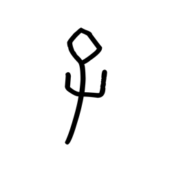

- source_zip_member: `Sub-character Images/yhwcwu1uot/yhwcwu1uot/0akit1begv.png`
- checksum_sha256: see `06_component-visual-index.csv`.
- review_status: `needs_human_visual_review`
- caution: source-marked review image only.

## asset-014054

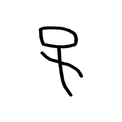

- source_zip_member: `Sub-character Images/yhwcwu1uot/yhwcwu1uot/12q9ry3v00.png`
- checksum_sha256: see `06_component-visual-index.csv`.
- review_status: `needs_human_visual_review`
- caution: source-marked review image only.

## asset-014055

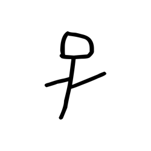

- source_zip_member: `Sub-character Images/yhwcwu1uot/yhwcwu1uot/1g8hfkp60z.png`
- checksum_sha256: see `06_component-visual-index.csv`.
- review_status: `needs_human_visual_review`
- caution: source-marked review image only.

## asset-014056

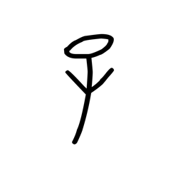

- source_zip_member: `Sub-character Images/yhwcwu1uot/yhwcwu1uot/283bqtcfoq.png`
- checksum_sha256: see `06_component-visual-index.csv`.
- review_status: `needs_human_visual_review`
- caution: source-marked review image only.

## asset-014057

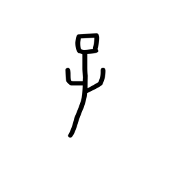

- source_zip_member: `Sub-character Images/yhwcwu1uot/yhwcwu1uot/2aug7j9p4h.png`
- checksum_sha256: see `06_component-visual-index.csv`.
- review_status: `needs_human_visual_review`
- caution: source-marked review image only.

## asset-014058

- source_zip_member: `Sub-character Images/yhwcwu1uot/yhwcwu1uot/3rxk7xcikb.png`
- checksum_sha256: see `06_component-visual-index.csv`.
- review_status: `needs_human_visual_review`
- caution: source-marked review image only.

## asset-014059

- source_zip_member: `Sub-character Images/yhwcwu1uot/yhwcwu1uot/3wgr7a9svc.png`
- checksum_sha256: see `06_component-visual-index.csv`.
- review_status: `needs_human_visual_review`
- caution: source-marked review image only.

## asset-014060

- source_zip_member: `Sub-character Images/yhwcwu1uot/yhwcwu1uot/41adlym21d.png`
- checksum_sha256: see `06_component-visual-index.csv`.
- review_status: `needs_human_visual_review`
- caution: source-marked review image only.

## asset-014061

- source_zip_member: `Sub-character Images/yhwcwu1uot/yhwcwu1uot/4kal1n511w.png`
- checksum_sha256: see `06_component-visual-index.csv`.
- review_status: `needs_human_visual_review`
- caution: source-marked review image only.

## asset-014062

- source_zip_member: `Sub-character Images/yhwcwu1uot/yhwcwu1uot/4ugqjiyokj.png`
- checksum_sha256: see `06_component-visual-index.csv`.
- review_status: `needs_human_visual_review`
- caution: source-marked review image only.

## asset-014063

- source_zip_member: `Sub-character Images/yhwcwu1uot/yhwcwu1uot/5knsg62nor.png`
- checksum_sha256: see `06_component-visual-index.csv`.
- review_status: `needs_human_visual_review`
- caution: source-marked review image only.

## asset-014064

- source_zip_member: `Sub-character Images/yhwcwu1uot/yhwcwu1uot/5q1t60opvt.png`
- checksum_sha256: see `06_component-visual-index.csv`.
- review_status: `needs_human_visual_review`
- caution: source-marked review image only.

## asset-014065

- source_zip_member: `Sub-character Images/yhwcwu1uot/yhwcwu1uot/6ol4sejou0.png`
- checksum_sha256: see `06_component-visual-index.csv`.
- review_status: `needs_human_visual_review`
- caution: source-marked review image only.

## asset-014066

- source_zip_member: `Sub-character Images/yhwcwu1uot/yhwcwu1uot/76s0y47nzz.png`
- checksum_sha256: see `06_component-visual-index.csv`.
- review_status: `needs_human_visual_review`
- caution: source-marked review image only.

## asset-014067

- source_zip_member: `Sub-character Images/yhwcwu1uot/yhwcwu1uot/799zek877o.png`
- checksum_sha256: see `06_component-visual-index.csv`.
- review_status: `needs_human_visual_review`
- caution: source-marked review image only.

## asset-014068

- source_zip_member: `Sub-character Images/yhwcwu1uot/yhwcwu1uot/7e7j4n494i.png`
- checksum_sha256: see `06_component-visual-index.csv`.
- review_status: `needs_human_visual_review`
- caution: source-marked review image only.

## asset-014069

- source_zip_member: `Sub-character Images/yhwcwu1uot/yhwcwu1uot/7elcg08cg0.png`
- checksum_sha256: see `06_component-visual-index.csv`.
- review_status: `needs_human_visual_review`
- caution: source-marked review image only.

## asset-014070

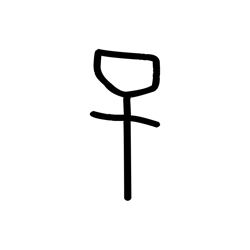

- source_zip_member: `Sub-character Images/yhwcwu1uot/yhwcwu1uot/7uy4hbacoy.png`
- checksum_sha256: see `06_component-visual-index.csv`.
- review_status: `needs_human_visual_review`
- caution: source-marked review image only.

## asset-014071

- source_zip_member: `Sub-character Images/yhwcwu1uot/yhwcwu1uot/87mex2zoyx.png`
- checksum_sha256: see `06_component-visual-index.csv`.
- review_status: `needs_human_visual_review`
- caution: source-marked review image only.

## asset-014072

- source_zip_member: `Sub-character Images/yhwcwu1uot/yhwcwu1uot/8accu4tid6.png`
- checksum_sha256: see `06_component-visual-index.csv`.
- review_status: `needs_human_visual_review`
- caution: source-marked review image only.

## asset-014073

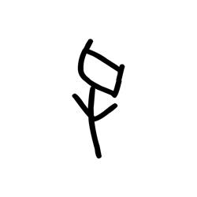

- source_zip_member: `Sub-character Images/yhwcwu1uot/yhwcwu1uot/8n8ym7i0h5.png`
- checksum_sha256: see `06_component-visual-index.csv`.
- review_status: `needs_human_visual_review`
- caution: source-marked review image only.

## asset-014074

- source_zip_member: `Sub-character Images/yhwcwu1uot/yhwcwu1uot/8xra8gd8ek.png`
- checksum_sha256: see `06_component-visual-index.csv`.
- review_status: `needs_human_visual_review`
- caution: source-marked review image only.

## asset-014075

- source_zip_member: `Sub-character Images/yhwcwu1uot/yhwcwu1uot/9bl4r7gl6d.png`
- checksum_sha256: see `06_component-visual-index.csv`.
- review_status: `needs_human_visual_review`
- caution: source-marked review image only.

## asset-014076

- source_zip_member: `Sub-character Images/yhwcwu1uot/yhwcwu1uot/9x8ewc8qps.png`
- checksum_sha256: see `06_component-visual-index.csv`.
- review_status: `needs_human_visual_review`
- caution: source-marked review image only.

## asset-014077

- source_zip_member: `Sub-character Images/yhwcwu1uot/yhwcwu1uot/a69up1ri7k.png`
- checksum_sha256: see `06_component-visual-index.csv`.
- review_status: `needs_human_visual_review`
- caution: source-marked review image only.

## asset-014078

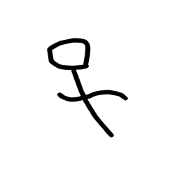

- source_zip_member: `Sub-character Images/yhwcwu1uot/yhwcwu1uot/ab1pmiljhp.png`
- checksum_sha256: see `06_component-visual-index.csv`.
- review_status: `needs_human_visual_review`
- caution: source-marked review image only.

## asset-014079

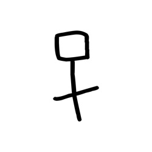

- source_zip_member: `Sub-character Images/yhwcwu1uot/yhwcwu1uot/akorjwuxua.png`
- checksum_sha256: see `06_component-visual-index.csv`.
- review_status: `needs_human_visual_review`
- caution: source-marked review image only.

## asset-014080

- source_zip_member: `Sub-character Images/yhwcwu1uot/yhwcwu1uot/akvgy775f4.png`
- checksum_sha256: see `06_component-visual-index.csv`.
- review_status: `needs_human_visual_review`
- caution: source-marked review image only.

## asset-014081

- source_zip_member: `Sub-character Images/yhwcwu1uot/yhwcwu1uot/asnz0ysxpm.png`
- checksum_sha256: see `06_component-visual-index.csv`.
- review_status: `needs_human_visual_review`
- caution: source-marked review image only.

## asset-014082

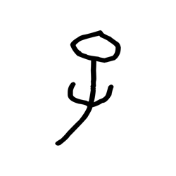

- source_zip_member: `Sub-character Images/yhwcwu1uot/yhwcwu1uot/axk7r6vzi2.png`
- checksum_sha256: see `06_component-visual-index.csv`.
- review_status: `needs_human_visual_review`
- caution: source-marked review image only.

## asset-014083

- source_zip_member: `Sub-character Images/yhwcwu1uot/yhwcwu1uot/azb0d0g91y.png`
- checksum_sha256: see `06_component-visual-index.csv`.
- review_status: `needs_human_visual_review`
- caution: source-marked review image only.

## asset-014084

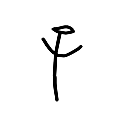

- source_zip_member: `Sub-character Images/yhwcwu1uot/yhwcwu1uot/b1shsbvior.png`
- checksum_sha256: see `06_component-visual-index.csv`.
- review_status: `needs_human_visual_review`
- caution: source-marked review image only.

## asset-014085

- source_zip_member: `Sub-character Images/yhwcwu1uot/yhwcwu1uot/bi09jhu7qy.png`
- checksum_sha256: see `06_component-visual-index.csv`.
- review_status: `needs_human_visual_review`
- caution: source-marked review image only.

## asset-014086

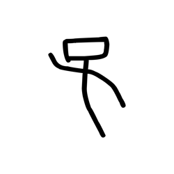

- source_zip_member: `Sub-character Images/yhwcwu1uot/yhwcwu1uot/bs8xjjfcra.png`
- checksum_sha256: see `06_component-visual-index.csv`.
- review_status: `needs_human_visual_review`
- caution: source-marked review image only.

## asset-014087

- source_zip_member: `Sub-character Images/yhwcwu1uot/yhwcwu1uot/bwrh7iz2pk.png`
- checksum_sha256: see `06_component-visual-index.csv`.
- review_status: `needs_human_visual_review`
- caution: source-marked review image only.

## asset-014088

- source_zip_member: `Sub-character Images/yhwcwu1uot/yhwcwu1uot/cd2bcf2204.png`
- checksum_sha256: see `06_component-visual-index.csv`.
- review_status: `needs_human_visual_review`
- caution: source-marked review image only.

## asset-014089

- source_zip_member: `Sub-character Images/yhwcwu1uot/yhwcwu1uot/cfu73wpbd2.png`
- checksum_sha256: see `06_component-visual-index.csv`.
- review_status: `needs_human_visual_review`
- caution: source-marked review image only.

## asset-014090

- source_zip_member: `Sub-character Images/yhwcwu1uot/yhwcwu1uot/cos93cklnb.png`
- checksum_sha256: see `06_component-visual-index.csv`.
- review_status: `needs_human_visual_review`
- caution: source-marked review image only.

## asset-014091

- source_zip_member: `Sub-character Images/yhwcwu1uot/yhwcwu1uot/crsjy0w5j9.png`
- checksum_sha256: see `06_component-visual-index.csv`.
- review_status: `needs_human_visual_review`
- caution: source-marked review image only.

## asset-014092

- source_zip_member: `Sub-character Images/yhwcwu1uot/yhwcwu1uot/dqw4lwaeh4.png`
- checksum_sha256: see `06_component-visual-index.csv`.
- review_status: `needs_human_visual_review`
- caution: source-marked review image only.

## asset-014093

- source_zip_member: `Sub-character Images/yhwcwu1uot/yhwcwu1uot/e2vdpyaqlo.png`
- checksum_sha256: see `06_component-visual-index.csv`.
- review_status: `needs_human_visual_review`
- caution: source-marked review image only.

## asset-014094

- source_zip_member: `Sub-character Images/yhwcwu1uot/yhwcwu1uot/epbx9l0hqr.png`
- checksum_sha256: see `06_component-visual-index.csv`.
- review_status: `needs_human_visual_review`
- caution: source-marked review image only.

## asset-014095

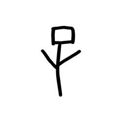

- source_zip_member: `Sub-character Images/yhwcwu1uot/yhwcwu1uot/f7pihoy5fq.png`
- checksum_sha256: see `06_component-visual-index.csv`.
- review_status: `needs_human_visual_review`
- caution: source-marked review image only.

## asset-014096

- source_zip_member: `Sub-character Images/yhwcwu1uot/yhwcwu1uot/fw18fkcs5n.png`
- checksum_sha256: see `06_component-visual-index.csv`.
- review_status: `needs_human_visual_review`
- caution: source-marked review image only.

## asset-014097

- source_zip_member: `Sub-character Images/yhwcwu1uot/yhwcwu1uot/fwq7vdf6jh.png`
- checksum_sha256: see `06_component-visual-index.csv`.
- review_status: `needs_human_visual_review`
- caution: source-marked review image only.

## asset-014098

- source_zip_member: `Sub-character Images/yhwcwu1uot/yhwcwu1uot/fzrb7xgvbm.png`
- checksum_sha256: see `06_component-visual-index.csv`.
- review_status: `needs_human_visual_review`
- caution: source-marked review image only.

## asset-014099

- source_zip_member: `Sub-character Images/yhwcwu1uot/yhwcwu1uot/g7hseu5oh7.png`
- checksum_sha256: see `06_component-visual-index.csv`.
- review_status: `needs_human_visual_review`
- caution: source-marked review image only.

## asset-014100

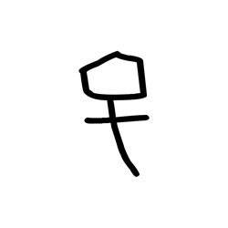

- source_zip_member: `Sub-character Images/yhwcwu1uot/yhwcwu1uot/gtgqo0r6u8.png`
- checksum_sha256: see `06_component-visual-index.csv`.
- review_status: `needs_human_visual_review`
- caution: source-marked review image only.

## asset-014101

- source_zip_member: `Sub-character Images/yhwcwu1uot/yhwcwu1uot/hjyftmu1iv.png`
- checksum_sha256: see `06_component-visual-index.csv`.
- review_status: `needs_human_visual_review`
- caution: source-marked review image only.

## asset-014102

- source_zip_member: `Sub-character Images/yhwcwu1uot/yhwcwu1uot/hw76ema5sc.png`
- checksum_sha256: see `06_component-visual-index.csv`.
- review_status: `needs_human_visual_review`
- caution: source-marked review image only.

## asset-014103

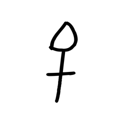

- source_zip_member: `Sub-character Images/yhwcwu1uot/yhwcwu1uot/ifrt8utq9f.png`
- checksum_sha256: see `06_component-visual-index.csv`.
- review_status: `needs_human_visual_review`
- caution: source-marked review image only.

## asset-014104

- source_zip_member: `Sub-character Images/yhwcwu1uot/yhwcwu1uot/ivdgxjiqoj.png`
- checksum_sha256: see `06_component-visual-index.csv`.
- review_status: `needs_human_visual_review`
- caution: source-marked review image only.

## asset-014105

- source_zip_member: `Sub-character Images/yhwcwu1uot/yhwcwu1uot/kdp3l9vori.png`
- checksum_sha256: see `06_component-visual-index.csv`.
- review_status: `needs_human_visual_review`
- caution: source-marked review image only.

## asset-014106

- source_zip_member: `Sub-character Images/yhwcwu1uot/yhwcwu1uot/kmhngyohr2.png`
- checksum_sha256: see `06_component-visual-index.csv`.
- review_status: `needs_human_visual_review`
- caution: source-marked review image only.

## asset-014107

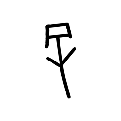

- source_zip_member: `Sub-character Images/yhwcwu1uot/yhwcwu1uot/kpyndln3wk.png`
- checksum_sha256: see `06_component-visual-index.csv`.
- review_status: `needs_human_visual_review`
- caution: source-marked review image only.

## asset-014108

- source_zip_member: `Sub-character Images/yhwcwu1uot/yhwcwu1uot/ld5satdrma.png`
- checksum_sha256: see `06_component-visual-index.csv`.
- review_status: `needs_human_visual_review`
- caution: source-marked review image only.

## asset-014109

- source_zip_member: `Sub-character Images/yhwcwu1uot/yhwcwu1uot/mtyfzw9kxz.png`
- checksum_sha256: see `06_component-visual-index.csv`.
- review_status: `needs_human_visual_review`
- caution: source-marked review image only.

## asset-014110

- source_zip_member: `Sub-character Images/yhwcwu1uot/yhwcwu1uot/ntaugg82j4.png`
- checksum_sha256: see `06_component-visual-index.csv`.
- review_status: `needs_human_visual_review`
- caution: source-marked review image only.

## asset-014111

- source_zip_member: `Sub-character Images/yhwcwu1uot/yhwcwu1uot/nyubn1pa5m.png`
- checksum_sha256: see `06_component-visual-index.csv`.
- review_status: `needs_human_visual_review`
- caution: source-marked review image only.

## asset-014112

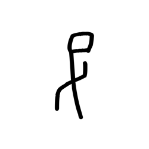

- source_zip_member: `Sub-character Images/yhwcwu1uot/yhwcwu1uot/o4iqlc181b.png`
- checksum_sha256: see `06_component-visual-index.csv`.
- review_status: `needs_human_visual_review`
- caution: source-marked review image only.

## asset-014113

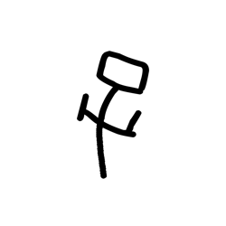

- source_zip_member: `Sub-character Images/yhwcwu1uot/yhwcwu1uot/orwvf2ra8f.png`
- checksum_sha256: see `06_component-visual-index.csv`.
- review_status: `needs_human_visual_review`
- caution: source-marked review image only.

## asset-014114

- source_zip_member: `Sub-character Images/yhwcwu1uot/yhwcwu1uot/p1c0ta1jdl.png`
- checksum_sha256: see `06_component-visual-index.csv`.
- review_status: `needs_human_visual_review`
- caution: source-marked review image only.

## asset-014115

- source_zip_member: `Sub-character Images/yhwcwu1uot/yhwcwu1uot/pnjmw936oo.png`
- checksum_sha256: see `06_component-visual-index.csv`.
- review_status: `needs_human_visual_review`
- caution: source-marked review image only.

## asset-014116

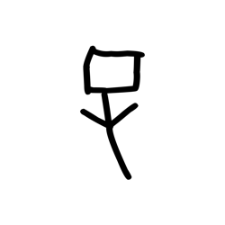

- source_zip_member: `Sub-character Images/yhwcwu1uot/yhwcwu1uot/pwu7os74dg.png`
- checksum_sha256: see `06_component-visual-index.csv`.
- review_status: `needs_human_visual_review`
- caution: source-marked review image only.

## asset-014117

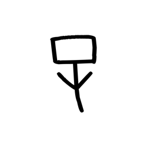

- source_zip_member: `Sub-character Images/yhwcwu1uot/yhwcwu1uot/qa55p2wfhl.png`
- checksum_sha256: see `06_component-visual-index.csv`.
- review_status: `needs_human_visual_review`
- caution: source-marked review image only.

## asset-014118

- source_zip_member: `Sub-character Images/yhwcwu1uot/yhwcwu1uot/qpghu2s8xf.png`
- checksum_sha256: see `06_component-visual-index.csv`.
- review_status: `needs_human_visual_review`
- caution: source-marked review image only.

## asset-014119

- source_zip_member: `Sub-character Images/yhwcwu1uot/yhwcwu1uot/r13ict33op.png`
- checksum_sha256: see `06_component-visual-index.csv`.
- review_status: `needs_human_visual_review`
- caution: source-marked review image only.

## asset-014120

- source_zip_member: `Sub-character Images/yhwcwu1uot/yhwcwu1uot/s2figkfutt.png`
- checksum_sha256: see `06_component-visual-index.csv`.
- review_status: `needs_human_visual_review`
- caution: source-marked review image only.

## asset-014121

- source_zip_member: `Sub-character Images/yhwcwu1uot/yhwcwu1uot/swig9ch45g.png`
- checksum_sha256: see `06_component-visual-index.csv`.
- review_status: `needs_human_visual_review`
- caution: source-marked review image only.

## asset-014122

- source_zip_member: `Sub-character Images/yhwcwu1uot/yhwcwu1uot/t0prawpz26.png`
- checksum_sha256: see `06_component-visual-index.csv`.
- review_status: `needs_human_visual_review`
- caution: source-marked review image only.

## asset-014123

- source_zip_member: `Sub-character Images/yhwcwu1uot/yhwcwu1uot/twn3536tdi.png`
- checksum_sha256: see `06_component-visual-index.csv`.
- review_status: `needs_human_visual_review`
- caution: source-marked review image only.

## asset-014124

- source_zip_member: `Sub-character Images/yhwcwu1uot/yhwcwu1uot/tybq7j0ulx.png`
- checksum_sha256: see `06_component-visual-index.csv`.
- review_status: `needs_human_visual_review`
- caution: source-marked review image only.

## asset-014125

- source_zip_member: `Sub-character Images/yhwcwu1uot/yhwcwu1uot/u3lzohhnnd.png`
- checksum_sha256: see `06_component-visual-index.csv`.
- review_status: `needs_human_visual_review`
- caution: source-marked review image only.

## asset-014126

- source_zip_member: `Sub-character Images/yhwcwu1uot/yhwcwu1uot/wbew1k9n81.png`
- checksum_sha256: see `06_component-visual-index.csv`.
- review_status: `needs_human_visual_review`
- caution: source-marked review image only.

## asset-014127

- source_zip_member: `Sub-character Images/yhwcwu1uot/yhwcwu1uot/wojsgsxeug.png`
- checksum_sha256: see `06_component-visual-index.csv`.
- review_status: `needs_human_visual_review`
- caution: source-marked review image only.

## asset-014128

- source_zip_member: `Sub-character Images/yhwcwu1uot/yhwcwu1uot/xeozuq481p.png`
- checksum_sha256: see `06_component-visual-index.csv`.
- review_status: `needs_human_visual_review`
- caution: source-marked review image only.

## asset-014129

- source_zip_member: `Sub-character Images/yhwcwu1uot/yhwcwu1uot/xo5axe7crt.png`
- checksum_sha256: see `06_component-visual-index.csv`.
- review_status: `needs_human_visual_review`
- caution: source-marked review image only.

## asset-014130

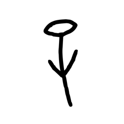

- source_zip_member: `Sub-character Images/yhwcwu1uot/yhwcwu1uot/xv57r9l8gl.png`
- checksum_sha256: see `06_component-visual-index.csv`.
- review_status: `needs_human_visual_review`
- caution: source-marked review image only.

## asset-014131

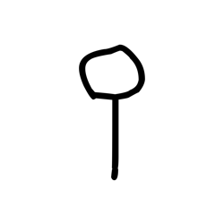

- source_zip_member: `Sub-character Images/yhwcwu1uot/yhwcwu1uot/yc7j0vwtkg.png`
- checksum_sha256: see `06_component-visual-index.csv`.
- review_status: `needs_human_visual_review`
- caution: source-marked review image only.

## asset-014132

- source_zip_member: `Sub-character Images/yhwcwu1uot/yhwcwu1uot/yhwcwu1uot.png`
- checksum_sha256: see `06_component-visual-index.csv`.
- review_status: `needs_human_visual_review`
- caution: source-marked review image only.

## asset-014133

- source_zip_member: `Sub-character Images/yhwcwu1uot/yhwcwu1uot/yrczpoggo2.png`
- checksum_sha256: see `06_component-visual-index.csv`.
- review_status: `needs_human_visual_review`
- caution: source-marked review image only.

## asset-014134

- source_zip_member: `Sub-character Images/yhwcwu1uot/yhwcwu1uot/z85e8nseg4.png`
- checksum_sha256: see `06_component-visual-index.csv`.
- review_status: `needs_human_visual_review`
- caution: source-marked review image only.

## asset-014135

- source_zip_member: `Sub-character Images/yhwcwu1uot/yhwcwu1uot/zl6ynuty42.png`
- checksum_sha256: see `06_component-visual-index.csv`.
- review_status: `needs_human_visual_review`
- caution: source-marked review image only.

## asset-014136

- source_zip_member: `Sub-character Images/yhwcwu1uot/yhwcwu1uot/zwc3ppxtrb.png`
- checksum_sha256: see `06_component-visual-index.csv`.
- review_status: `needs_human_visual_review`
- caution: source-marked review image only.
