# Component Visual Gallery / 构件图像查看: obs-comp-cand-000970

English:
This page displays OBIMD subcharacter PNG assets extracted into this concrete
corpus object directory for human review.

简体中文：
本页展示抽取到当前具体 corpus 对象目录内的 OBIMD subcharacter PNG 资料，供人工复核使用。

Boundary / 边界：
dataset image candidate only; not a confirmed component form, not a component
assignment, and not a decipherment claim.
- not a confirmed component form
- not a component assignment
- not a decipherment claim

## Concrete Questions To Check / 具体待查问题

- Open 06_component-visual-index.csv and name the local image row.
- 打开 06_component-visual-index.csv，写明本地图像行。
- Open 09_component-visual-route-index.csv and name the source route row.
- 打开 09_component-visual-route-index.csv，写明来源路线行。
- Open 13_component-context-evidence-dossier.md for character context.
- 打开 13_component-context-evidence-dossier.md，核对单字与卜辞上下文。
- Record the missing image, near-shape, source, or context route.
- 记录缺失的图像、近形、来源或上下文路线。

## asset-014137

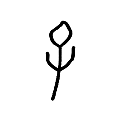

- source_zip_member: `Sub-character Images/d7mczw6osp/d7mczw6osp/0rbj6zl5d0.png`
- checksum_sha256: see `06_component-visual-index.csv`.
- review_status: `needs_human_visual_review`
- caution: source-marked review image only.

## asset-014138

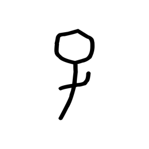

- source_zip_member: `Sub-character Images/d7mczw6osp/d7mczw6osp/0rg3vw1ra1.png`
- checksum_sha256: see `06_component-visual-index.csv`.
- review_status: `needs_human_visual_review`
- caution: source-marked review image only.

## asset-014139

- source_zip_member: `Sub-character Images/d7mczw6osp/d7mczw6osp/0w89yponlb.png`
- checksum_sha256: see `06_component-visual-index.csv`.
- review_status: `needs_human_visual_review`
- caution: source-marked review image only.

## asset-014140

- source_zip_member: `Sub-character Images/d7mczw6osp/d7mczw6osp/1mdxxqivwq.png`
- checksum_sha256: see `06_component-visual-index.csv`.
- review_status: `needs_human_visual_review`
- caution: source-marked review image only.

## asset-014141

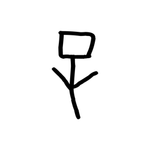

- source_zip_member: `Sub-character Images/d7mczw6osp/d7mczw6osp/1ohlyynjdh.png`
- checksum_sha256: see `06_component-visual-index.csv`.
- review_status: `needs_human_visual_review`
- caution: source-marked review image only.

## asset-014142

- source_zip_member: `Sub-character Images/d7mczw6osp/d7mczw6osp/29pmhiikfw.png`
- checksum_sha256: see `06_component-visual-index.csv`.
- review_status: `needs_human_visual_review`
- caution: source-marked review image only.

## asset-014143

- source_zip_member: `Sub-character Images/d7mczw6osp/d7mczw6osp/2p6alryawr.png`
- checksum_sha256: see `06_component-visual-index.csv`.
- review_status: `needs_human_visual_review`
- caution: source-marked review image only.

## asset-014144

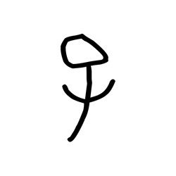

- source_zip_member: `Sub-character Images/d7mczw6osp/d7mczw6osp/2r0cvfy29p.png`
- checksum_sha256: see `06_component-visual-index.csv`.
- review_status: `needs_human_visual_review`
- caution: source-marked review image only.

## asset-014145

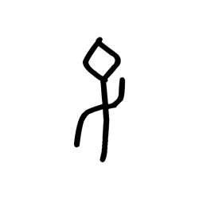

- source_zip_member: `Sub-character Images/d7mczw6osp/d7mczw6osp/42lt60ikat.png`
- checksum_sha256: see `06_component-visual-index.csv`.
- review_status: `needs_human_visual_review`
- caution: source-marked review image only.

## asset-014146

- source_zip_member: `Sub-character Images/d7mczw6osp/d7mczw6osp/44ufg0d1f4.png`
- checksum_sha256: see `06_component-visual-index.csv`.
- review_status: `needs_human_visual_review`
- caution: source-marked review image only.

## asset-014147

- source_zip_member: `Sub-character Images/d7mczw6osp/d7mczw6osp/49uiemt9dz.png`
- checksum_sha256: see `06_component-visual-index.csv`.
- review_status: `needs_human_visual_review`
- caution: source-marked review image only.

## asset-014148

- source_zip_member: `Sub-character Images/d7mczw6osp/d7mczw6osp/4o06kvuk7d.png`
- checksum_sha256: see `06_component-visual-index.csv`.
- review_status: `needs_human_visual_review`
- caution: source-marked review image only.

## asset-014149

- source_zip_member: `Sub-character Images/d7mczw6osp/d7mczw6osp/4rhbyvz42i.png`
- checksum_sha256: see `06_component-visual-index.csv`.
- review_status: `needs_human_visual_review`
- caution: source-marked review image only.

## asset-014150

- source_zip_member: `Sub-character Images/d7mczw6osp/d7mczw6osp/53ii38bcl2.png`
- checksum_sha256: see `06_component-visual-index.csv`.
- review_status: `needs_human_visual_review`
- caution: source-marked review image only.

## asset-014151

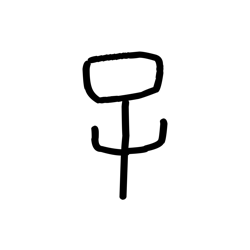

- source_zip_member: `Sub-character Images/d7mczw6osp/d7mczw6osp/56s725f49y.png`
- checksum_sha256: see `06_component-visual-index.csv`.
- review_status: `needs_human_visual_review`
- caution: source-marked review image only.

## asset-014152

- source_zip_member: `Sub-character Images/d7mczw6osp/d7mczw6osp/5heszksg50.png`
- checksum_sha256: see `06_component-visual-index.csv`.
- review_status: `needs_human_visual_review`
- caution: source-marked review image only.

## asset-014153

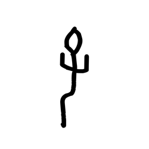

- source_zip_member: `Sub-character Images/d7mczw6osp/d7mczw6osp/5wwypehvpk.png`
- checksum_sha256: see `06_component-visual-index.csv`.
- review_status: `needs_human_visual_review`
- caution: source-marked review image only.

## asset-014154

- source_zip_member: `Sub-character Images/d7mczw6osp/d7mczw6osp/5yn5576d8c.png`
- checksum_sha256: see `06_component-visual-index.csv`.
- review_status: `needs_human_visual_review`
- caution: source-marked review image only.

## asset-014155

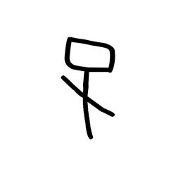

- source_zip_member: `Sub-character Images/d7mczw6osp/d7mczw6osp/5zx25bn0hs.png`
- checksum_sha256: see `06_component-visual-index.csv`.
- review_status: `needs_human_visual_review`
- caution: source-marked review image only.

## asset-014156

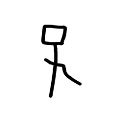

- source_zip_member: `Sub-character Images/d7mczw6osp/d7mczw6osp/6537ghsz4g.png`
- checksum_sha256: see `06_component-visual-index.csv`.
- review_status: `needs_human_visual_review`
- caution: source-marked review image only.

## asset-014157

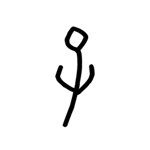

- source_zip_member: `Sub-character Images/d7mczw6osp/d7mczw6osp/6c0cx15glu.png`
- checksum_sha256: see `06_component-visual-index.csv`.
- review_status: `needs_human_visual_review`
- caution: source-marked review image only.

## asset-014158

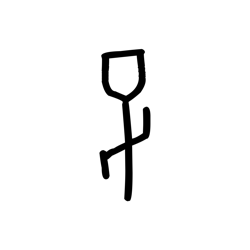

- source_zip_member: `Sub-character Images/d7mczw6osp/d7mczw6osp/7wmmp1z94z.png`
- checksum_sha256: see `06_component-visual-index.csv`.
- review_status: `needs_human_visual_review`
- caution: source-marked review image only.

## asset-014159

- source_zip_member: `Sub-character Images/d7mczw6osp/d7mczw6osp/7yklp94yq8.png`
- checksum_sha256: see `06_component-visual-index.csv`.
- review_status: `needs_human_visual_review`
- caution: source-marked review image only.

## asset-014160

- source_zip_member: `Sub-character Images/d7mczw6osp/d7mczw6osp/8wyf17xt28.png`
- checksum_sha256: see `06_component-visual-index.csv`.
- review_status: `needs_human_visual_review`
- caution: source-marked review image only.

## asset-014161

- source_zip_member: `Sub-character Images/d7mczw6osp/d7mczw6osp/99bic9bhr0.png`
- checksum_sha256: see `06_component-visual-index.csv`.
- review_status: `needs_human_visual_review`
- caution: source-marked review image only.

## asset-014162

- source_zip_member: `Sub-character Images/d7mczw6osp/d7mczw6osp/9iju5qecpa.png`
- checksum_sha256: see `06_component-visual-index.csv`.
- review_status: `needs_human_visual_review`
- caution: source-marked review image only.

## asset-014163

- source_zip_member: `Sub-character Images/d7mczw6osp/d7mczw6osp/9jrpsxb49r.png`
- checksum_sha256: see `06_component-visual-index.csv`.
- review_status: `needs_human_visual_review`
- caution: source-marked review image only.

## asset-014164

- source_zip_member: `Sub-character Images/d7mczw6osp/d7mczw6osp/9nfasfy08s.png`
- checksum_sha256: see `06_component-visual-index.csv`.
- review_status: `needs_human_visual_review`
- caution: source-marked review image only.

## asset-014165

- source_zip_member: `Sub-character Images/d7mczw6osp/d7mczw6osp/9osm4ivg8z.png`
- checksum_sha256: see `06_component-visual-index.csv`.
- review_status: `needs_human_visual_review`
- caution: source-marked review image only.

## asset-014166

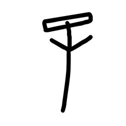

- source_zip_member: `Sub-character Images/d7mczw6osp/d7mczw6osp/ajfmoqb2je.png`
- checksum_sha256: see `06_component-visual-index.csv`.
- review_status: `needs_human_visual_review`
- caution: source-marked review image only.

## asset-014167

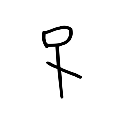

- source_zip_member: `Sub-character Images/d7mczw6osp/d7mczw6osp/aumrz5qo49.png`
- checksum_sha256: see `06_component-visual-index.csv`.
- review_status: `needs_human_visual_review`
- caution: source-marked review image only.

## asset-014168

- source_zip_member: `Sub-character Images/d7mczw6osp/d7mczw6osp/bigq3ylvjq.png`
- checksum_sha256: see `06_component-visual-index.csv`.
- review_status: `needs_human_visual_review`
- caution: source-marked review image only.

## asset-014169

- source_zip_member: `Sub-character Images/d7mczw6osp/d7mczw6osp/bmxjkn3p30.png`
- checksum_sha256: see `06_component-visual-index.csv`.
- review_status: `needs_human_visual_review`
- caution: source-marked review image only.

## asset-014170

- source_zip_member: `Sub-character Images/d7mczw6osp/d7mczw6osp/bxa5ohen8e.png`
- checksum_sha256: see `06_component-visual-index.csv`.
- review_status: `needs_human_visual_review`
- caution: source-marked review image only.

## asset-014171

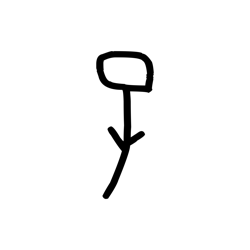

- source_zip_member: `Sub-character Images/d7mczw6osp/d7mczw6osp/cfgpwwlibd.png`
- checksum_sha256: see `06_component-visual-index.csv`.
- review_status: `needs_human_visual_review`
- caution: source-marked review image only.

## asset-014172

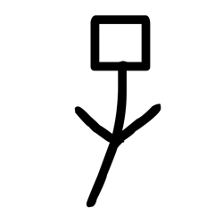

- source_zip_member: `Sub-character Images/d7mczw6osp/d7mczw6osp/d7mczw6osp.png`
- checksum_sha256: see `06_component-visual-index.csv`.
- review_status: `needs_human_visual_review`
- caution: source-marked review image only.

## asset-014173

- source_zip_member: `Sub-character Images/d7mczw6osp/d7mczw6osp/dk9sits8su.png`
- checksum_sha256: see `06_component-visual-index.csv`.
- review_status: `needs_human_visual_review`
- caution: source-marked review image only.

## asset-014174

- source_zip_member: `Sub-character Images/d7mczw6osp/d7mczw6osp/emlfa9r4kt.png`
- checksum_sha256: see `06_component-visual-index.csv`.
- review_status: `needs_human_visual_review`
- caution: source-marked review image only.

## asset-014175

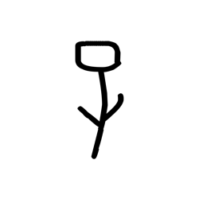

- source_zip_member: `Sub-character Images/d7mczw6osp/d7mczw6osp/erbs004t2f.png`
- checksum_sha256: see `06_component-visual-index.csv`.
- review_status: `needs_human_visual_review`
- caution: source-marked review image only.

## asset-014176

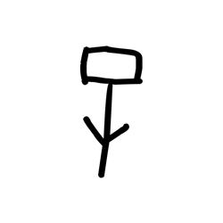

- source_zip_member: `Sub-character Images/d7mczw6osp/d7mczw6osp/f9dxs2gu4e.png`
- checksum_sha256: see `06_component-visual-index.csv`.
- review_status: `needs_human_visual_review`
- caution: source-marked review image only.

## asset-014177

- source_zip_member: `Sub-character Images/d7mczw6osp/d7mczw6osp/fqa51bfluk.png`
- checksum_sha256: see `06_component-visual-index.csv`.
- review_status: `needs_human_visual_review`
- caution: source-marked review image only.

## asset-014178

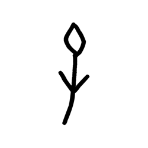

- source_zip_member: `Sub-character Images/d7mczw6osp/d7mczw6osp/g78qwiet8j.png`
- checksum_sha256: see `06_component-visual-index.csv`.
- review_status: `needs_human_visual_review`
- caution: source-marked review image only.

## asset-014179

- source_zip_member: `Sub-character Images/d7mczw6osp/d7mczw6osp/gmvs3no1d8.png`
- checksum_sha256: see `06_component-visual-index.csv`.
- review_status: `needs_human_visual_review`
- caution: source-marked review image only.

## asset-014180

- source_zip_member: `Sub-character Images/d7mczw6osp/d7mczw6osp/hq1xzo9v1x.png`
- checksum_sha256: see `06_component-visual-index.csv`.
- review_status: `needs_human_visual_review`
- caution: source-marked review image only.

## asset-014181

- source_zip_member: `Sub-character Images/d7mczw6osp/d7mczw6osp/hwzxr94u8d.png`
- checksum_sha256: see `06_component-visual-index.csv`.
- review_status: `needs_human_visual_review`
- caution: source-marked review image only.

## asset-014182

- source_zip_member: `Sub-character Images/d7mczw6osp/d7mczw6osp/i8585q5xgg.png`
- checksum_sha256: see `06_component-visual-index.csv`.
- review_status: `needs_human_visual_review`
- caution: source-marked review image only.

## asset-014183

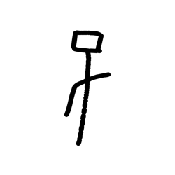

- source_zip_member: `Sub-character Images/d7mczw6osp/d7mczw6osp/iimwh9r4n5.png`
- checksum_sha256: see `06_component-visual-index.csv`.
- review_status: `needs_human_visual_review`
- caution: source-marked review image only.

## asset-014184

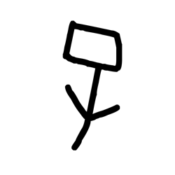

- source_zip_member: `Sub-character Images/d7mczw6osp/d7mczw6osp/jajeqhpltg.png`
- checksum_sha256: see `06_component-visual-index.csv`.
- review_status: `needs_human_visual_review`
- caution: source-marked review image only.

## asset-014185

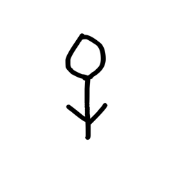

- source_zip_member: `Sub-character Images/d7mczw6osp/d7mczw6osp/jyp90e723f.png`
- checksum_sha256: see `06_component-visual-index.csv`.
- review_status: `needs_human_visual_review`
- caution: source-marked review image only.

## asset-014186

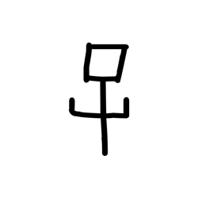

- source_zip_member: `Sub-character Images/d7mczw6osp/d7mczw6osp/l9sxsn257w.png`
- checksum_sha256: see `06_component-visual-index.csv`.
- review_status: `needs_human_visual_review`
- caution: source-marked review image only.

## asset-014187

- source_zip_member: `Sub-character Images/d7mczw6osp/d7mczw6osp/lao0zzejsk.png`
- checksum_sha256: see `06_component-visual-index.csv`.
- review_status: `needs_human_visual_review`
- caution: source-marked review image only.

## asset-014188

- source_zip_member: `Sub-character Images/d7mczw6osp/d7mczw6osp/lap9dmojmf.png`
- checksum_sha256: see `06_component-visual-index.csv`.
- review_status: `needs_human_visual_review`
- caution: source-marked review image only.

## asset-014189

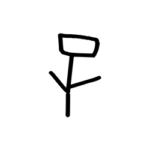

- source_zip_member: `Sub-character Images/d7mczw6osp/d7mczw6osp/m20amk2kxe.png`
- checksum_sha256: see `06_component-visual-index.csv`.
- review_status: `needs_human_visual_review`
- caution: source-marked review image only.

## asset-014190

- source_zip_member: `Sub-character Images/d7mczw6osp/d7mczw6osp/m2q7q4bpj5.png`
- checksum_sha256: see `06_component-visual-index.csv`.
- review_status: `needs_human_visual_review`
- caution: source-marked review image only.

## asset-014191

- source_zip_member: `Sub-character Images/d7mczw6osp/d7mczw6osp/maiktuf6p9.png`
- checksum_sha256: see `06_component-visual-index.csv`.
- review_status: `needs_human_visual_review`
- caution: source-marked review image only.

## asset-014192

- source_zip_member: `Sub-character Images/d7mczw6osp/d7mczw6osp/mfzpfp4acp.png`
- checksum_sha256: see `06_component-visual-index.csv`.
- review_status: `needs_human_visual_review`
- caution: source-marked review image only.

## asset-014193

- source_zip_member: `Sub-character Images/d7mczw6osp/d7mczw6osp/mklgeo2dhw.png`
- checksum_sha256: see `06_component-visual-index.csv`.
- review_status: `needs_human_visual_review`
- caution: source-marked review image only.

## asset-014194

- source_zip_member: `Sub-character Images/d7mczw6osp/d7mczw6osp/mmr4e1d82a.png`
- checksum_sha256: see `06_component-visual-index.csv`.
- review_status: `needs_human_visual_review`
- caution: source-marked review image only.

## asset-014195

- source_zip_member: `Sub-character Images/d7mczw6osp/d7mczw6osp/ne7tjiyg8p.png`
- checksum_sha256: see `06_component-visual-index.csv`.
- review_status: `needs_human_visual_review`
- caution: source-marked review image only.

## asset-014196

- source_zip_member: `Sub-character Images/d7mczw6osp/d7mczw6osp/o4wztpuc1p.png`
- checksum_sha256: see `06_component-visual-index.csv`.
- review_status: `needs_human_visual_review`
- caution: source-marked review image only.

## asset-014197

- source_zip_member: `Sub-character Images/d7mczw6osp/d7mczw6osp/o9h7sgrfoo.png`
- checksum_sha256: see `06_component-visual-index.csv`.
- review_status: `needs_human_visual_review`
- caution: source-marked review image only.

## asset-014198

- source_zip_member: `Sub-character Images/d7mczw6osp/d7mczw6osp/ohpb7ufsq6.png`
- checksum_sha256: see `06_component-visual-index.csv`.
- review_status: `needs_human_visual_review`
- caution: source-marked review image only.

## asset-014199

- source_zip_member: `Sub-character Images/d7mczw6osp/d7mczw6osp/ombz3e7x44.png`
- checksum_sha256: see `06_component-visual-index.csv`.
- review_status: `needs_human_visual_review`
- caution: source-marked review image only.

## asset-014200

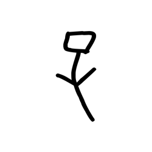

- source_zip_member: `Sub-character Images/d7mczw6osp/d7mczw6osp/pdqyxo9gf7.png`
- checksum_sha256: see `06_component-visual-index.csv`.
- review_status: `needs_human_visual_review`
- caution: source-marked review image only.

## asset-014201

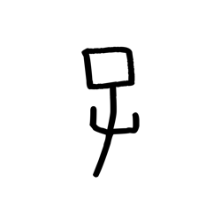

- source_zip_member: `Sub-character Images/d7mczw6osp/d7mczw6osp/peo8iwb5uv.png`
- checksum_sha256: see `06_component-visual-index.csv`.
- review_status: `needs_human_visual_review`
- caution: source-marked review image only.

## asset-014202

- source_zip_member: `Sub-character Images/d7mczw6osp/d7mczw6osp/pkip4gelf1.png`
- checksum_sha256: see `06_component-visual-index.csv`.
- review_status: `needs_human_visual_review`
- caution: source-marked review image only.

## asset-014203

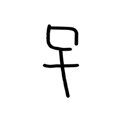

- source_zip_member: `Sub-character Images/d7mczw6osp/d7mczw6osp/pn69etjxez.png`
- checksum_sha256: see `06_component-visual-index.csv`.
- review_status: `needs_human_visual_review`
- caution: source-marked review image only.

## asset-014204

- source_zip_member: `Sub-character Images/d7mczw6osp/d7mczw6osp/pnqcscpsuu.png`
- checksum_sha256: see `06_component-visual-index.csv`.
- review_status: `needs_human_visual_review`
- caution: source-marked review image only.

## asset-014205

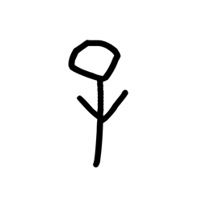

- source_zip_member: `Sub-character Images/d7mczw6osp/d7mczw6osp/psgitl322m.png`
- checksum_sha256: see `06_component-visual-index.csv`.
- review_status: `needs_human_visual_review`
- caution: source-marked review image only.

## asset-014206

- source_zip_member: `Sub-character Images/d7mczw6osp/d7mczw6osp/pthcmjdfhq.png`
- checksum_sha256: see `06_component-visual-index.csv`.
- review_status: `needs_human_visual_review`
- caution: source-marked review image only.

## asset-014207

- source_zip_member: `Sub-character Images/d7mczw6osp/d7mczw6osp/py96h20qg4.png`
- checksum_sha256: see `06_component-visual-index.csv`.
- review_status: `needs_human_visual_review`
- caution: source-marked review image only.

## asset-014208

- source_zip_member: `Sub-character Images/d7mczw6osp/d7mczw6osp/q91pja6em7.png`
- checksum_sha256: see `06_component-visual-index.csv`.
- review_status: `needs_human_visual_review`
- caution: source-marked review image only.

## asset-014209

- source_zip_member: `Sub-character Images/d7mczw6osp/d7mczw6osp/qb42kuujgh.png`
- checksum_sha256: see `06_component-visual-index.csv`.
- review_status: `needs_human_visual_review`
- caution: source-marked review image only.

## asset-014210

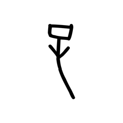

- source_zip_member: `Sub-character Images/d7mczw6osp/d7mczw6osp/qpnz7pv5gu.png`
- checksum_sha256: see `06_component-visual-index.csv`.
- review_status: `needs_human_visual_review`
- caution: source-marked review image only.

## asset-014211

- source_zip_member: `Sub-character Images/d7mczw6osp/d7mczw6osp/r38evpmoyr.png`
- checksum_sha256: see `06_component-visual-index.csv`.
- review_status: `needs_human_visual_review`
- caution: source-marked review image only.

## asset-014212

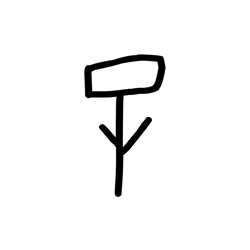

- source_zip_member: `Sub-character Images/d7mczw6osp/d7mczw6osp/rlhdptxow7.png`
- checksum_sha256: see `06_component-visual-index.csv`.
- review_status: `needs_human_visual_review`
- caution: source-marked review image only.

## asset-014213

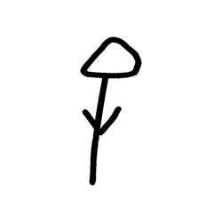

- source_zip_member: `Sub-character Images/d7mczw6osp/d7mczw6osp/rwno1o94ro.png`
- checksum_sha256: see `06_component-visual-index.csv`.
- review_status: `needs_human_visual_review`
- caution: source-marked review image only.

## asset-014214

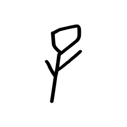

- source_zip_member: `Sub-character Images/d7mczw6osp/d7mczw6osp/s60bft6xw9.png`
- checksum_sha256: see `06_component-visual-index.csv`.
- review_status: `needs_human_visual_review`
- caution: source-marked review image only.

## asset-014215

- source_zip_member: `Sub-character Images/d7mczw6osp/d7mczw6osp/stl5zm14js.png`
- checksum_sha256: see `06_component-visual-index.csv`.
- review_status: `needs_human_visual_review`
- caution: source-marked review image only.

## asset-014216

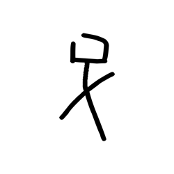

- source_zip_member: `Sub-character Images/d7mczw6osp/d7mczw6osp/tvdoxr4uqc.png`
- checksum_sha256: see `06_component-visual-index.csv`.
- review_status: `needs_human_visual_review`
- caution: source-marked review image only.

## asset-014217

- source_zip_member: `Sub-character Images/d7mczw6osp/d7mczw6osp/ubob6skql9.png`
- checksum_sha256: see `06_component-visual-index.csv`.
- review_status: `needs_human_visual_review`
- caution: source-marked review image only.

## asset-014218

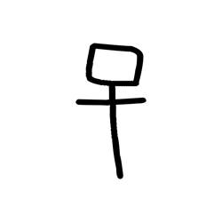

- source_zip_member: `Sub-character Images/d7mczw6osp/d7mczw6osp/v8syruutpt.png`
- checksum_sha256: see `06_component-visual-index.csv`.
- review_status: `needs_human_visual_review`
- caution: source-marked review image only.

## asset-014219

- source_zip_member: `Sub-character Images/d7mczw6osp/d7mczw6osp/vaf9xxx2qo.png`
- checksum_sha256: see `06_component-visual-index.csv`.
- review_status: `needs_human_visual_review`
- caution: source-marked review image only.

## asset-014220

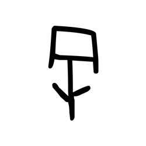

- source_zip_member: `Sub-character Images/d7mczw6osp/d7mczw6osp/whys1qbi7e.png`
- checksum_sha256: see `06_component-visual-index.csv`.
- review_status: `needs_human_visual_review`
- caution: source-marked review image only.

## asset-014221

- source_zip_member: `Sub-character Images/d7mczw6osp/d7mczw6osp/x0b2z3q8mq.png`
- checksum_sha256: see `06_component-visual-index.csv`.
- review_status: `needs_human_visual_review`
- caution: source-marked review image only.

## asset-014222

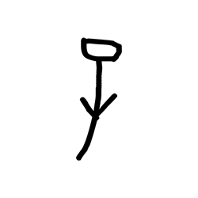

- source_zip_member: `Sub-character Images/d7mczw6osp/d7mczw6osp/x1p0qvxrmk.png`
- checksum_sha256: see `06_component-visual-index.csv`.
- review_status: `needs_human_visual_review`
- caution: source-marked review image only.

## asset-014223

- source_zip_member: `Sub-character Images/d7mczw6osp/d7mczw6osp/xwzbmije9z.png`
- checksum_sha256: see `06_component-visual-index.csv`.
- review_status: `needs_human_visual_review`
- caution: source-marked review image only.

## asset-014224

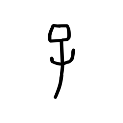

- source_zip_member: `Sub-character Images/d7mczw6osp/d7mczw6osp/ycxmejgpwg.png`
- checksum_sha256: see `06_component-visual-index.csv`.
- review_status: `needs_human_visual_review`
- caution: source-marked review image only.

## asset-014225

- source_zip_member: `Sub-character Images/d7mczw6osp/d7mczw6osp/yn4o6lhylc.png`
- checksum_sha256: see `06_component-visual-index.csv`.
- review_status: `needs_human_visual_review`
- caution: source-marked review image only.

## asset-014226

- source_zip_member: `Sub-character Images/d7mczw6osp/d7mczw6osp/yycez4s588.png`
- checksum_sha256: see `06_component-visual-index.csv`.
- review_status: `needs_human_visual_review`
- caution: source-marked review image only.

## asset-014227

- source_zip_member: `Sub-character Images/d7mczw6osp/d7mczw6osp/zvkz70c52j.png`
- checksum_sha256: see `06_component-visual-index.csv`.
- review_status: `needs_human_visual_review`
- caution: source-marked review image only.
