# Component Visual Gallery / 构件图像查看: obs-comp-cand-000973

English:
This page displays OBIMD subcharacter PNG assets extracted into this concrete
corpus object directory for human review.

简体中文：
本页展示抽取到当前具体 corpus 对象目录内的 OBIMD subcharacter PNG 资料，供人工复核使用。

Boundary / 边界：
dataset image candidate only; not a confirmed component form, not a component
assignment, and not a decipherment claim.
- not a confirmed component form
- not a component assignment
- not a decipherment claim

## Concrete Questions To Check / 具体待查问题

- Open 06_component-visual-index.csv and name the local image row.
- 打开 06_component-visual-index.csv，写明本地图像行。
- Open 09_component-visual-route-index.csv and name the source route row.
- 打开 09_component-visual-route-index.csv，写明来源路线行。
- Open 13_component-context-evidence-dossier.md for character context.
- 打开 13_component-context-evidence-dossier.md，核对单字与卜辞上下文。
- Record the missing image, near-shape, source, or context route.
- 记录缺失的图像、近形、来源或上下文路线。

## asset-014230

- source_zip_member: `Sub-character Images/r79attbhro/r79attbhro/062x9wdoce.png`
- checksum_sha256: see `06_component-visual-index.csv`.
- review_status: `needs_human_visual_review`
- caution: source-marked review image only.

## asset-014231

- source_zip_member: `Sub-character Images/r79attbhro/r79attbhro/1aitsg5dhi.png`
- checksum_sha256: see `06_component-visual-index.csv`.
- review_status: `needs_human_visual_review`
- caution: source-marked review image only.

## asset-014232

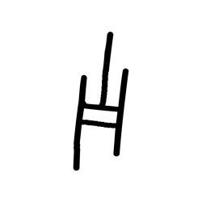

- source_zip_member: `Sub-character Images/r79attbhro/r79attbhro/1uvv8sqdvu.png`
- checksum_sha256: see `06_component-visual-index.csv`.
- review_status: `needs_human_visual_review`
- caution: source-marked review image only.

## asset-014233

- source_zip_member: `Sub-character Images/r79attbhro/r79attbhro/2y07laqeow.png`
- checksum_sha256: see `06_component-visual-index.csv`.
- review_status: `needs_human_visual_review`
- caution: source-marked review image only.

## asset-014234

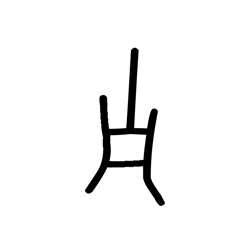

- source_zip_member: `Sub-character Images/r79attbhro/r79attbhro/5olzx6gima.png`
- checksum_sha256: see `06_component-visual-index.csv`.
- review_status: `needs_human_visual_review`
- caution: source-marked review image only.

## asset-014235

- source_zip_member: `Sub-character Images/r79attbhro/r79attbhro/67q0k9iei4.png`
- checksum_sha256: see `06_component-visual-index.csv`.
- review_status: `needs_human_visual_review`
- caution: source-marked review image only.

## asset-014236

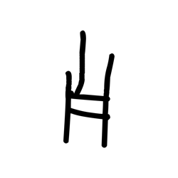

- source_zip_member: `Sub-character Images/r79attbhro/r79attbhro/6p4mxq6iwi.png`
- checksum_sha256: see `06_component-visual-index.csv`.
- review_status: `needs_human_visual_review`
- caution: source-marked review image only.

## asset-014237

- source_zip_member: `Sub-character Images/r79attbhro/r79attbhro/9u698t3isa.png`
- checksum_sha256: see `06_component-visual-index.csv`.
- review_status: `needs_human_visual_review`
- caution: source-marked review image only.

## asset-014238

- source_zip_member: `Sub-character Images/r79attbhro/r79attbhro/bh5f6xd1bp.png`
- checksum_sha256: see `06_component-visual-index.csv`.
- review_status: `needs_human_visual_review`
- caution: source-marked review image only.

## asset-014239

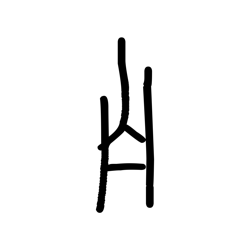

- source_zip_member: `Sub-character Images/r79attbhro/r79attbhro/c1pe1kwz3l.png`
- checksum_sha256: see `06_component-visual-index.csv`.
- review_status: `needs_human_visual_review`
- caution: source-marked review image only.

## asset-014240

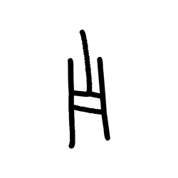

- source_zip_member: `Sub-character Images/r79attbhro/r79attbhro/d0jgqfnpql.png`
- checksum_sha256: see `06_component-visual-index.csv`.
- review_status: `needs_human_visual_review`
- caution: source-marked review image only.

## asset-014241

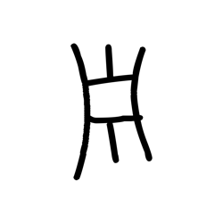

- source_zip_member: `Sub-character Images/r79attbhro/r79attbhro/e9ej78zen6.png`
- checksum_sha256: see `06_component-visual-index.csv`.
- review_status: `needs_human_visual_review`
- caution: source-marked review image only.

## asset-014242

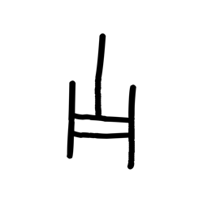

- source_zip_member: `Sub-character Images/r79attbhro/r79attbhro/fg9pl8hegc.png`
- checksum_sha256: see `06_component-visual-index.csv`.
- review_status: `needs_human_visual_review`
- caution: source-marked review image only.

## asset-014243

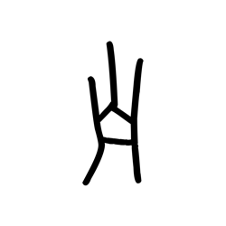

- source_zip_member: `Sub-character Images/r79attbhro/r79attbhro/g6bio59q6z.png`
- checksum_sha256: see `06_component-visual-index.csv`.
- review_status: `needs_human_visual_review`
- caution: source-marked review image only.

## asset-014244

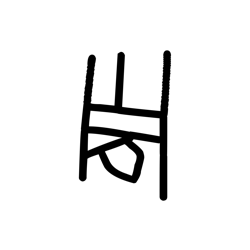

- source_zip_member: `Sub-character Images/r79attbhro/r79attbhro/h60sc3yieg.png`
- checksum_sha256: see `06_component-visual-index.csv`.
- review_status: `needs_human_visual_review`
- caution: source-marked review image only.

## asset-014245

- source_zip_member: `Sub-character Images/r79attbhro/r79attbhro/l68lvlca0i.png`
- checksum_sha256: see `06_component-visual-index.csv`.
- review_status: `needs_human_visual_review`
- caution: source-marked review image only.

## asset-014246

- source_zip_member: `Sub-character Images/r79attbhro/r79attbhro/li94y7i1e2.png`
- checksum_sha256: see `06_component-visual-index.csv`.
- review_status: `needs_human_visual_review`
- caution: source-marked review image only.

## asset-014247

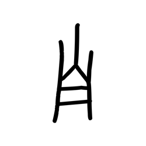

- source_zip_member: `Sub-character Images/r79attbhro/r79attbhro/mmg9agjm2a.png`
- checksum_sha256: see `06_component-visual-index.csv`.
- review_status: `needs_human_visual_review`
- caution: source-marked review image only.

## asset-014248

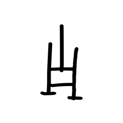

- source_zip_member: `Sub-character Images/r79attbhro/r79attbhro/nz3itabfck.png`
- checksum_sha256: see `06_component-visual-index.csv`.
- review_status: `needs_human_visual_review`
- caution: source-marked review image only.

## asset-014249

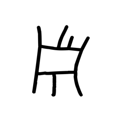

- source_zip_member: `Sub-character Images/r79attbhro/r79attbhro/o3gih4f2o1.png`
- checksum_sha256: see `06_component-visual-index.csv`.
- review_status: `needs_human_visual_review`
- caution: source-marked review image only.

## asset-014250

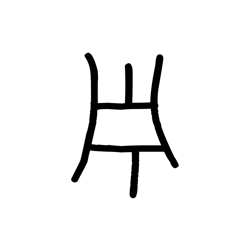

- source_zip_member: `Sub-character Images/r79attbhro/r79attbhro/qu8e7vphx8.png`
- checksum_sha256: see `06_component-visual-index.csv`.
- review_status: `needs_human_visual_review`
- caution: source-marked review image only.

## asset-014251

- source_zip_member: `Sub-character Images/r79attbhro/r79attbhro/r79attbhro.png`
- checksum_sha256: see `06_component-visual-index.csv`.
- review_status: `needs_human_visual_review`
- caution: source-marked review image only.

## asset-014252

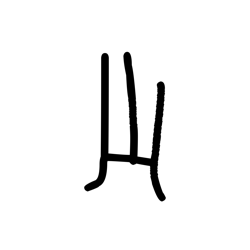

- source_zip_member: `Sub-character Images/r79attbhro/r79attbhro/ralssluo9q.png`
- checksum_sha256: see `06_component-visual-index.csv`.
- review_status: `needs_human_visual_review`
- caution: source-marked review image only.

## asset-014253

- source_zip_member: `Sub-character Images/r79attbhro/r79attbhro/tmxdr98yan.png`
- checksum_sha256: see `06_component-visual-index.csv`.
- review_status: `needs_human_visual_review`
- caution: source-marked review image only.

## asset-014254

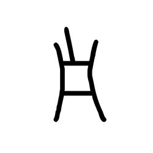

- source_zip_member: `Sub-character Images/r79attbhro/r79attbhro/uiu44rafov.png`
- checksum_sha256: see `06_component-visual-index.csv`.
- review_status: `needs_human_visual_review`
- caution: source-marked review image only.

## asset-014255

- source_zip_member: `Sub-character Images/r79attbhro/r79attbhro/uy154qd6ev.png`
- checksum_sha256: see `06_component-visual-index.csv`.
- review_status: `needs_human_visual_review`
- caution: source-marked review image only.

## asset-014256

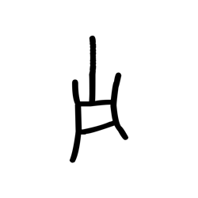

- source_zip_member: `Sub-character Images/r79attbhro/r79attbhro/vpgx8wwuya.png`
- checksum_sha256: see `06_component-visual-index.csv`.
- review_status: `needs_human_visual_review`
- caution: source-marked review image only.

## asset-014257

- source_zip_member: `Sub-character Images/r79attbhro/r79attbhro/zntw6cpjdy.png`
- checksum_sha256: see `06_component-visual-index.csv`.
- review_status: `needs_human_visual_review`
- caution: source-marked review image only.
