# Component Visual Gallery / 构件图像查看: obs-comp-cand-000983

English:
This page displays OBIMD subcharacter PNG assets extracted into this concrete corpus object directory for human review.

简体中文：
本页展示抽取到当前具体 corpus 对象目录内的 OBIMD subcharacter PNG 资料，供人工复核使用。

Boundary / 边界：dataset image candidate only; not a confirmed component form, component assignment, or decipherment claim.

## asset-014265

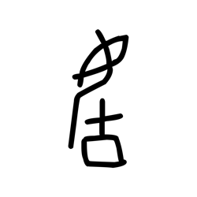

- source_zip_member: `Sub-character Images/wex7jm17pb/7qphk65ozb/03tl5wzcvo.png`
- checksum_sha256: `d90c1a8e68dced020a653aa0b52cda20bc262a956226850c5a5e02f7d9d5cc11`
- review_status: `needs_human_visual_review`
- caution: OBIMD subcharacter image is a source-marked review asset only; it is not a confirmed component form, component assignment, or decipherment conclusion.

## asset-014266

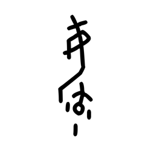

- source_zip_member: `Sub-character Images/wex7jm17pb/7qphk65ozb/0753pnjnw2.png`
- checksum_sha256: `a7d53cd6108404907dae052cbdf02dcba5dd68a7cd48b6e9cc1bdbdcc0adec00`
- review_status: `needs_human_visual_review`
- caution: OBIMD subcharacter image is a source-marked review asset only; it is not a confirmed component form, component assignment, or decipherment conclusion.

## asset-014267

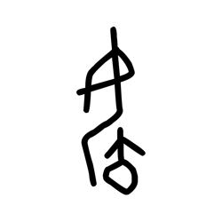

- source_zip_member: `Sub-character Images/wex7jm17pb/7qphk65ozb/0om526qv4c.png`
- checksum_sha256: `1a31d65ee80871fa4c1821273f4bc8fc15e45c82c37de50ac1409de1988611f5`
- review_status: `needs_human_visual_review`
- caution: OBIMD subcharacter image is a source-marked review asset only; it is not a confirmed component form, component assignment, or decipherment conclusion.

## asset-014268

- source_zip_member: `Sub-character Images/wex7jm17pb/7qphk65ozb/1cqcd2p9qd.png`
- checksum_sha256: `f00b2cb60d19f3f23a44521155be31825398c0fa7f60294839f5eb463a230609`
- review_status: `needs_human_visual_review`
- caution: OBIMD subcharacter image is a source-marked review asset only; it is not a confirmed component form, component assignment, or decipherment conclusion.

## asset-014269

- source_zip_member: `Sub-character Images/wex7jm17pb/7qphk65ozb/2nhqz7qt6u.png`
- checksum_sha256: `ac1eeaf04fabc3bb11454cd2eb232d296cc81ece4e6a37a8daf4f54a12ffbc5e`
- review_status: `needs_human_visual_review`
- caution: OBIMD subcharacter image is a source-marked review asset only; it is not a confirmed component form, component assignment, or decipherment conclusion.

## asset-014270

- source_zip_member: `Sub-character Images/wex7jm17pb/7qphk65ozb/4brnzv1nh5.png`
- checksum_sha256: `b423e922a4800dc915bc9c80509d12e98a45c1102e3383f8e66aae2dfefbc65a`
- review_status: `needs_human_visual_review`
- caution: OBIMD subcharacter image is a source-marked review asset only; it is not a confirmed component form, component assignment, or decipherment conclusion.

## asset-014271

- source_zip_member: `Sub-character Images/wex7jm17pb/7qphk65ozb/4n83kidwsd.png`
- checksum_sha256: `bcaf5b9901f67b9d5dcfff1b676e12fd3a0323479e1d33107c6828ac5298cc20`
- review_status: `needs_human_visual_review`
- caution: OBIMD subcharacter image is a source-marked review asset only; it is not a confirmed component form, component assignment, or decipherment conclusion.

## asset-014272

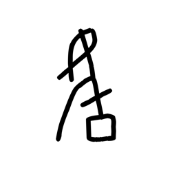

- source_zip_member: `Sub-character Images/wex7jm17pb/7qphk65ozb/5jbw66zd7o.png`
- checksum_sha256: `2e121a2e108f7ce5ec945d0b9443db1f91d45a141f9e961722c967dba635dd96`
- review_status: `needs_human_visual_review`
- caution: OBIMD subcharacter image is a source-marked review asset only; it is not a confirmed component form, component assignment, or decipherment conclusion.

## asset-014273

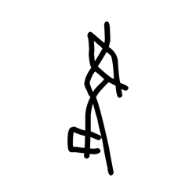

- source_zip_member: `Sub-character Images/wex7jm17pb/7qphk65ozb/67txqa533e.png`
- checksum_sha256: `4344fee55331d7d48bd00d4a41d1486485813a8d1a6ceaaa539191245d601d27`
- review_status: `needs_human_visual_review`
- caution: OBIMD subcharacter image is a source-marked review asset only; it is not a confirmed component form, component assignment, or decipherment conclusion.

## asset-014274

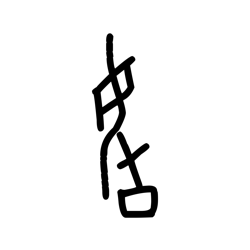

- source_zip_member: `Sub-character Images/wex7jm17pb/7qphk65ozb/684krzizwo.png`
- checksum_sha256: `cc1d689191bc0fb097db708e3621d5b9b585a51fac8cb97a4ed473730362225b`
- review_status: `needs_human_visual_review`
- caution: OBIMD subcharacter image is a source-marked review asset only; it is not a confirmed component form, component assignment, or decipherment conclusion.

## asset-014275

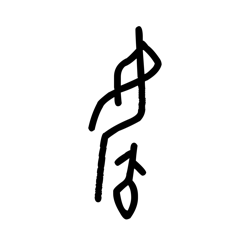

- source_zip_member: `Sub-character Images/wex7jm17pb/7qphk65ozb/68ghhza011.png`
- checksum_sha256: `80f4a6d7416e74a50f038baa5bc1c6d4e8df03c496b346ac791b39f48ebdf265`
- review_status: `needs_human_visual_review`
- caution: OBIMD subcharacter image is a source-marked review asset only; it is not a confirmed component form, component assignment, or decipherment conclusion.

## asset-014276

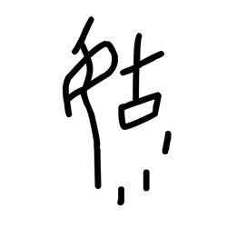

- source_zip_member: `Sub-character Images/wex7jm17pb/7qphk65ozb/6l2no8gfu9.png`
- checksum_sha256: `bb413ce85b28e4cb91aa6f292494b3e8309c478769c08c854492b11e66eec260`
- review_status: `needs_human_visual_review`
- caution: OBIMD subcharacter image is a source-marked review asset only; it is not a confirmed component form, component assignment, or decipherment conclusion.

## asset-014277

- source_zip_member: `Sub-character Images/wex7jm17pb/7qphk65ozb/6mp79prjjt.png`
- checksum_sha256: `14d8fbcfee51f8c5e3bb132bcb04f3958bc1f26aa8f6bf5bdc66a46cf6ac15ee`
- review_status: `needs_human_visual_review`
- caution: OBIMD subcharacter image is a source-marked review asset only; it is not a confirmed component form, component assignment, or decipherment conclusion.

## asset-014278

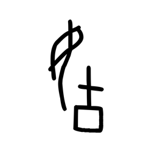

- source_zip_member: `Sub-character Images/wex7jm17pb/7qphk65ozb/6nczya5u8t.png`
- checksum_sha256: `b97e5daf22609c54fa4084aad7342eff641c949aac3e4d81f7cdb49370406644`
- review_status: `needs_human_visual_review`
- caution: OBIMD subcharacter image is a source-marked review asset only; it is not a confirmed component form, component assignment, or decipherment conclusion.

## asset-014279

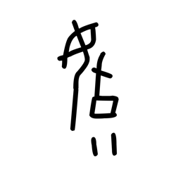

- source_zip_member: `Sub-character Images/wex7jm17pb/7qphk65ozb/6qczvehgqj.png`
- checksum_sha256: `f80109c068b014ad15adb5d5c78748b0fb77f2806ebd3f02679989e9b6166302`
- review_status: `needs_human_visual_review`
- caution: OBIMD subcharacter image is a source-marked review asset only; it is not a confirmed component form, component assignment, or decipherment conclusion.

## asset-014280

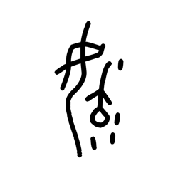

- source_zip_member: `Sub-character Images/wex7jm17pb/7qphk65ozb/6vjy989ypr.png`
- checksum_sha256: `62494aa5f4d477bfccb6add641f5d2213f611ef8eebcdcadcbbc93316411b791`
- review_status: `needs_human_visual_review`
- caution: OBIMD subcharacter image is a source-marked review asset only; it is not a confirmed component form, component assignment, or decipherment conclusion.

## asset-014281

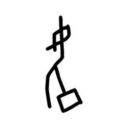

- source_zip_member: `Sub-character Images/wex7jm17pb/7qphk65ozb/7jaug9582m.png`
- checksum_sha256: `2afc52d3c70fa6c8822d36670699151c9598c881050d41928e332d8ddee56029`
- review_status: `needs_human_visual_review`
- caution: OBIMD subcharacter image is a source-marked review asset only; it is not a confirmed component form, component assignment, or decipherment conclusion.

## asset-014282

- source_zip_member: `Sub-character Images/wex7jm17pb/7qphk65ozb/7qphk65ozb.png`
- checksum_sha256: `34f4c286b01ffeb143bc6e6b59996bf891e126135a0e0ffdf441d1ee50befde3`
- review_status: `needs_human_visual_review`
- caution: OBIMD subcharacter image is a source-marked review asset only; it is not a confirmed component form, component assignment, or decipherment conclusion.

## asset-014283

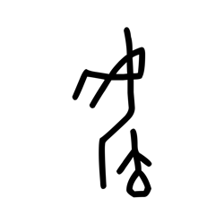

- source_zip_member: `Sub-character Images/wex7jm17pb/7qphk65ozb/8mpnpndtyg.png`
- checksum_sha256: `57a68a56ac5e5f4f3bc344de737a39147cedbca3470307270f2f6e9dfe828afc`
- review_status: `needs_human_visual_review`
- caution: OBIMD subcharacter image is a source-marked review asset only; it is not a confirmed component form, component assignment, or decipherment conclusion.

## asset-014284

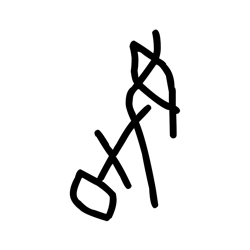

- source_zip_member: `Sub-character Images/wex7jm17pb/7qphk65ozb/91zaqekmrj.png`
- checksum_sha256: `b6897d6692d3503b42b39f595d458a569ae1ed9e9fc47f9a12446cebe5894b72`
- review_status: `needs_human_visual_review`
- caution: OBIMD subcharacter image is a source-marked review asset only; it is not a confirmed component form, component assignment, or decipherment conclusion.

## asset-014285

- source_zip_member: `Sub-character Images/wex7jm17pb/7qphk65ozb/96ih9rnccz.png`
- checksum_sha256: `2760c71b24d85ae36ac3bfb5facb38d2bd79e937539e3b8642fea64f115860f4`
- review_status: `needs_human_visual_review`
- caution: OBIMD subcharacter image is a source-marked review asset only; it is not a confirmed component form, component assignment, or decipherment conclusion.

## asset-014286

- source_zip_member: `Sub-character Images/wex7jm17pb/7qphk65ozb/9ojsj3gp0c.png`
- checksum_sha256: `ec9d86e89cd0fad4cf23efb4b8c837367276de93756ec452685ef5484ff4264c`
- review_status: `needs_human_visual_review`
- caution: OBIMD subcharacter image is a source-marked review asset only; it is not a confirmed component form, component assignment, or decipherment conclusion.

## asset-014287

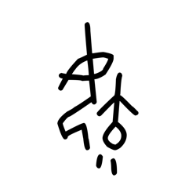

- source_zip_member: `Sub-character Images/wex7jm17pb/7qphk65ozb/aqa8d3avqq.png`
- checksum_sha256: `f8b570c7c8071a7e8c3b7ece231b4394bf8998381b489192cb999b966e2fc052`
- review_status: `needs_human_visual_review`
- caution: OBIMD subcharacter image is a source-marked review asset only; it is not a confirmed component form, component assignment, or decipherment conclusion.

## asset-014288

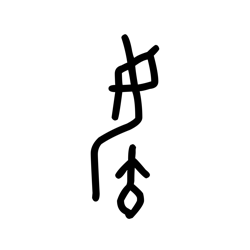

- source_zip_member: `Sub-character Images/wex7jm17pb/7qphk65ozb/aqed0vg5gc.png`
- checksum_sha256: `6a06999dd937ed260a028d4d49ff8996e06f9f20e04ba7e0fd86910d0861cf90`
- review_status: `needs_human_visual_review`
- caution: OBIMD subcharacter image is a source-marked review asset only; it is not a confirmed component form, component assignment, or decipherment conclusion.

## asset-014289

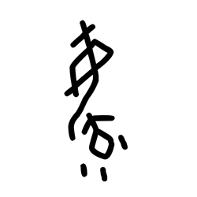

- source_zip_member: `Sub-character Images/wex7jm17pb/7qphk65ozb/bbxbnrbund.png`
- checksum_sha256: `d9729093c711f3e42dbd25b8f6fe39c16b7c8791c88da0e39e76f9bcc59cafe2`
- review_status: `needs_human_visual_review`
- caution: OBIMD subcharacter image is a source-marked review asset only; it is not a confirmed component form, component assignment, or decipherment conclusion.

## asset-014290

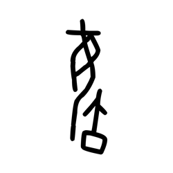

- source_zip_member: `Sub-character Images/wex7jm17pb/7qphk65ozb/c0reibax49.png`
- checksum_sha256: `be7ca46585d55ffded28d903358a70ab79920ffc457c2ce588d685644a6fd76b`
- review_status: `needs_human_visual_review`
- caution: OBIMD subcharacter image is a source-marked review asset only; it is not a confirmed component form, component assignment, or decipherment conclusion.

## asset-014291

- source_zip_member: `Sub-character Images/wex7jm17pb/7qphk65ozb/c6t881svq0.png`
- checksum_sha256: `8c3cdd45a51ac7cfa24bb34858255f74d0a8bcd1fb8e9a526afbb7070314c2e7`
- review_status: `needs_human_visual_review`
- caution: OBIMD subcharacter image is a source-marked review asset only; it is not a confirmed component form, component assignment, or decipherment conclusion.

## asset-014292

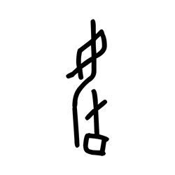

- source_zip_member: `Sub-character Images/wex7jm17pb/7qphk65ozb/c97okzburz.png`
- checksum_sha256: `cf6a111184d2061b5c9c596956615575c8527b8dd7e17a283bd1860689800b08`
- review_status: `needs_human_visual_review`
- caution: OBIMD subcharacter image is a source-marked review asset only; it is not a confirmed component form, component assignment, or decipherment conclusion.

## asset-014293

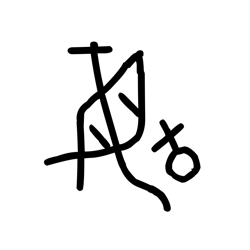

- source_zip_member: `Sub-character Images/wex7jm17pb/7qphk65ozb/cuxymuisoq.png`
- checksum_sha256: `aea34d4e9ea5cf4f3a19cd8f5eb8cf0109bfb4a2ccc271da674dbc1d1af16ba1`
- review_status: `needs_human_visual_review`
- caution: OBIMD subcharacter image is a source-marked review asset only; it is not a confirmed component form, component assignment, or decipherment conclusion.

## asset-014294

- source_zip_member: `Sub-character Images/wex7jm17pb/7qphk65ozb/cz4ctsnmfy.png`
- checksum_sha256: `46126162caefa4da1b21834bbe7a7cd5b4b266ac23a9954ee6afac5b555b47b6`
- review_status: `needs_human_visual_review`
- caution: OBIMD subcharacter image is a source-marked review asset only; it is not a confirmed component form, component assignment, or decipherment conclusion.

## asset-014295

- source_zip_member: `Sub-character Images/wex7jm17pb/7qphk65ozb/e19b5ajjzm.png`
- checksum_sha256: `2b04ad9a4e70b33cbc72a53e4f051cdf09d4647db525526cda3d641854b6c504`
- review_status: `needs_human_visual_review`
- caution: OBIMD subcharacter image is a source-marked review asset only; it is not a confirmed component form, component assignment, or decipherment conclusion.

## asset-014296

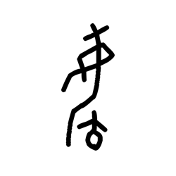

- source_zip_member: `Sub-character Images/wex7jm17pb/7qphk65ozb/e69ym547qd.png`
- checksum_sha256: `70f8aaab98c83c40e1a4b256c1ad2ca3ac6bc5bec09a84d0b6fe0cd82828723b`
- review_status: `needs_human_visual_review`
- caution: OBIMD subcharacter image is a source-marked review asset only; it is not a confirmed component form, component assignment, or decipherment conclusion.

## asset-014297

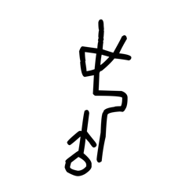

- source_zip_member: `Sub-character Images/wex7jm17pb/7qphk65ozb/ex0jsza81i.png`
- checksum_sha256: `05718bf6041ecb0abadb3632710fecbfd02ff8ddf417d7ee62b08ffb58b907d7`
- review_status: `needs_human_visual_review`
- caution: OBIMD subcharacter image is a source-marked review asset only; it is not a confirmed component form, component assignment, or decipherment conclusion.

## asset-014298

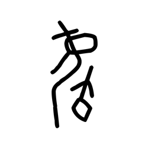

- source_zip_member: `Sub-character Images/wex7jm17pb/7qphk65ozb/fsmpdii95l.png`
- checksum_sha256: `2d6cb3a1f0da2748d06eda2213b27a6fffa1adb52c3635a8e7635b75de77de6f`
- review_status: `needs_human_visual_review`
- caution: OBIMD subcharacter image is a source-marked review asset only; it is not a confirmed component form, component assignment, or decipherment conclusion.

## asset-014299

- source_zip_member: `Sub-character Images/wex7jm17pb/7qphk65ozb/g8vu5i8mas.png`
- checksum_sha256: `ba0461b8df5ac87e9603c3b211510273693b19f147a847c29c48d53df3f32593`
- review_status: `needs_human_visual_review`
- caution: OBIMD subcharacter image is a source-marked review asset only; it is not a confirmed component form, component assignment, or decipherment conclusion.

## asset-014300

- source_zip_member: `Sub-character Images/wex7jm17pb/7qphk65ozb/gdavzmpdw6.png`
- checksum_sha256: `4e53fe6bf1ad08292b981ad4c26de1f19c428cb12476e0d9867e9e263dbdd71b`
- review_status: `needs_human_visual_review`
- caution: OBIMD subcharacter image is a source-marked review asset only; it is not a confirmed component form, component assignment, or decipherment conclusion.

## asset-014301

- source_zip_member: `Sub-character Images/wex7jm17pb/7qphk65ozb/gqnn7eqe50.png`
- checksum_sha256: `d2afcf935066789fe5b878b8fba99df8d7915e6bb5a551abd600ffd40020d831`
- review_status: `needs_human_visual_review`
- caution: OBIMD subcharacter image is a source-marked review asset only; it is not a confirmed component form, component assignment, or decipherment conclusion.

## asset-014302

- source_zip_member: `Sub-character Images/wex7jm17pb/7qphk65ozb/gr51ryfj95.png`
- checksum_sha256: `817604bb0921a46973d05e2c8f7ef415e872891072efef82285ef04339e984fb`
- review_status: `needs_human_visual_review`
- caution: OBIMD subcharacter image is a source-marked review asset only; it is not a confirmed component form, component assignment, or decipherment conclusion.

## asset-014303

- source_zip_member: `Sub-character Images/wex7jm17pb/7qphk65ozb/h7oqg31eza.png`
- checksum_sha256: `78968cd1d3867ddcd23c74f5d4b550f2cd5e79d45b7dfa075ffb41bfba898e5f`
- review_status: `needs_human_visual_review`
- caution: OBIMD subcharacter image is a source-marked review asset only; it is not a confirmed component form, component assignment, or decipherment conclusion.

## asset-014304

- source_zip_member: `Sub-character Images/wex7jm17pb/7qphk65ozb/h9lopn97f8.png`
- checksum_sha256: `4469863361143f5491f75aeb4481920a5928aaa3980cf96b13955d699294f4c2`
- review_status: `needs_human_visual_review`
- caution: OBIMD subcharacter image is a source-marked review asset only; it is not a confirmed component form, component assignment, or decipherment conclusion.

## asset-014305

- source_zip_member: `Sub-character Images/wex7jm17pb/7qphk65ozb/htbkg0uizk.png`
- checksum_sha256: `b65609eae6f8e653c372e767c589fee54322c3b001fb745677954fcbb0c2581a`
- review_status: `needs_human_visual_review`
- caution: OBIMD subcharacter image is a source-marked review asset only; it is not a confirmed component form, component assignment, or decipherment conclusion.

## asset-014306

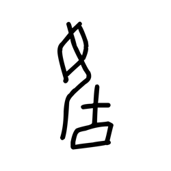

- source_zip_member: `Sub-character Images/wex7jm17pb/7qphk65ozb/j74cmxkvw6.png`
- checksum_sha256: `c1331ef5dc275a1233972e1054bc9ac1072ea33b2dda6e972588d1afed0023b6`
- review_status: `needs_human_visual_review`
- caution: OBIMD subcharacter image is a source-marked review asset only; it is not a confirmed component form, component assignment, or decipherment conclusion.

## asset-014307

- source_zip_member: `Sub-character Images/wex7jm17pb/7qphk65ozb/jf5a66h0tm.png`
- checksum_sha256: `2d1e03aadbbcf4f4c78b30a233b869d73c61e2ca9867ff6f3a1da4a5c4788840`
- review_status: `needs_human_visual_review`
- caution: OBIMD subcharacter image is a source-marked review asset only; it is not a confirmed component form, component assignment, or decipherment conclusion.

## asset-014308

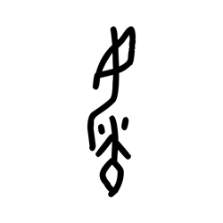

- source_zip_member: `Sub-character Images/wex7jm17pb/7qphk65ozb/jm05o8mixl.png`
- checksum_sha256: `b69f31e00626c2e134cd52e9f4f5cc277bce272f81ae3da447ac2bf0cd2de403`
- review_status: `needs_human_visual_review`
- caution: OBIMD subcharacter image is a source-marked review asset only; it is not a confirmed component form, component assignment, or decipherment conclusion.

## asset-014309

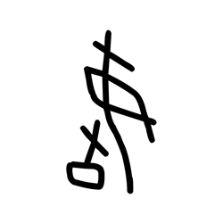

- source_zip_member: `Sub-character Images/wex7jm17pb/7qphk65ozb/k1uzytspls.png`
- checksum_sha256: `aded38086ad024a26762bfbc4dceb2abec7aa2f6f1a7d5d969789abc6b7ea1ef`
- review_status: `needs_human_visual_review`
- caution: OBIMD subcharacter image is a source-marked review asset only; it is not a confirmed component form, component assignment, or decipherment conclusion.

## asset-014310

- source_zip_member: `Sub-character Images/wex7jm17pb/7qphk65ozb/k4ttbmj61b.png`
- checksum_sha256: `1640c217e648f5166291ba2f5012a40c36ce17de28b97100a0b51b6ea027d455`
- review_status: `needs_human_visual_review`
- caution: OBIMD subcharacter image is a source-marked review asset only; it is not a confirmed component form, component assignment, or decipherment conclusion.

## asset-014311

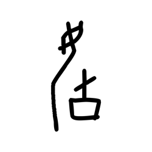

- source_zip_member: `Sub-character Images/wex7jm17pb/7qphk65ozb/k8258twtlo.png`
- checksum_sha256: `f72eb3bca89332074d82c9da5dd2fd9a069f60317d3cc6f23c0bb9093f32186f`
- review_status: `needs_human_visual_review`
- caution: OBIMD subcharacter image is a source-marked review asset only; it is not a confirmed component form, component assignment, or decipherment conclusion.

## asset-014312

- source_zip_member: `Sub-character Images/wex7jm17pb/7qphk65ozb/ko9nnxgw2m.png`
- checksum_sha256: `07e0f20ffdf9324045d54b5bb9e4beb3e18afad79e3b2ec5c9b75b025ce05bf1`
- review_status: `needs_human_visual_review`
- caution: OBIMD subcharacter image is a source-marked review asset only; it is not a confirmed component form, component assignment, or decipherment conclusion.

## asset-014313

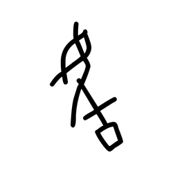

- source_zip_member: `Sub-character Images/wex7jm17pb/7qphk65ozb/l176vl7nza.png`
- checksum_sha256: `b2c51185069492656829f3b574c90b5fb8b239e2456a1bde1d0af9bef80b4b74`
- review_status: `needs_human_visual_review`
- caution: OBIMD subcharacter image is a source-marked review asset only; it is not a confirmed component form, component assignment, or decipherment conclusion.

## asset-014314

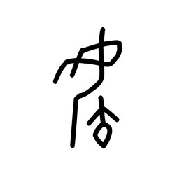

- source_zip_member: `Sub-character Images/wex7jm17pb/7qphk65ozb/lvk8i3w7fd.png`
- checksum_sha256: `6c02eb23b9494aea3a03d7beae23ce34ff2ba90e80eb43967150fd9b06e484e2`
- review_status: `needs_human_visual_review`
- caution: OBIMD subcharacter image is a source-marked review asset only; it is not a confirmed component form, component assignment, or decipherment conclusion.

## asset-014315

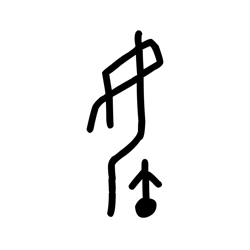

- source_zip_member: `Sub-character Images/wex7jm17pb/7qphk65ozb/mtg7xkpm4y.png`
- checksum_sha256: `7a48f62a7274c9e6ba471459dd223e4d1ef2df622f3b97fb3424149ed134dc60`
- review_status: `needs_human_visual_review`
- caution: OBIMD subcharacter image is a source-marked review asset only; it is not a confirmed component form, component assignment, or decipherment conclusion.

## asset-014316

- source_zip_member: `Sub-character Images/wex7jm17pb/7qphk65ozb/my6c6msnxu.png`
- checksum_sha256: `a9ccfd4664d72ee8ddafae7c96261f42660a6da934ea272395c09458a0d9d171`
- review_status: `needs_human_visual_review`
- caution: OBIMD subcharacter image is a source-marked review asset only; it is not a confirmed component form, component assignment, or decipherment conclusion.

## asset-014317

- source_zip_member: `Sub-character Images/wex7jm17pb/7qphk65ozb/o14svpee8r.png`
- checksum_sha256: `57322382ffb588caa0e99b16103ffcee063c2a9034e049d7d6e767abdc223df3`
- review_status: `needs_human_visual_review`
- caution: OBIMD subcharacter image is a source-marked review asset only; it is not a confirmed component form, component assignment, or decipherment conclusion.

## asset-014318

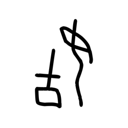

- source_zip_member: `Sub-character Images/wex7jm17pb/7qphk65ozb/pg5vv6q67h.png`
- checksum_sha256: `0fe49376f04137214e69c805249dbbb6462b36ad0510f60b5fafd2b6cdbfdece`
- review_status: `needs_human_visual_review`
- caution: OBIMD subcharacter image is a source-marked review asset only; it is not a confirmed component form, component assignment, or decipherment conclusion.

## asset-014319

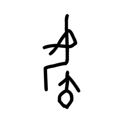

- source_zip_member: `Sub-character Images/wex7jm17pb/7qphk65ozb/plpxqyxre7.png`
- checksum_sha256: `182d9516d82eb4ee0080b4536a41fa18a6953e9500f679913a2522b9d8d663a7`
- review_status: `needs_human_visual_review`
- caution: OBIMD subcharacter image is a source-marked review asset only; it is not a confirmed component form, component assignment, or decipherment conclusion.

## asset-014320

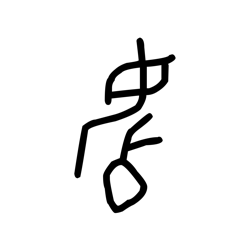

- source_zip_member: `Sub-character Images/wex7jm17pb/7qphk65ozb/q3izt34yvs.png`
- checksum_sha256: `f1bf645e7d712610fd88fc8917591c21920af4ef8c26457d812746d649ba7a81`
- review_status: `needs_human_visual_review`
- caution: OBIMD subcharacter image is a source-marked review asset only; it is not a confirmed component form, component assignment, or decipherment conclusion.

## asset-014321

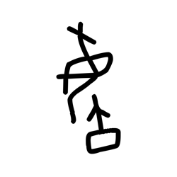

- source_zip_member: `Sub-character Images/wex7jm17pb/7qphk65ozb/qn344yt6l0.png`
- checksum_sha256: `d5f327300ff3cfebdfb092a71bb1e59b1c4b6955d66988635833914a4c9b9af7`
- review_status: `needs_human_visual_review`
- caution: OBIMD subcharacter image is a source-marked review asset only; it is not a confirmed component form, component assignment, or decipherment conclusion.

## asset-014322

- source_zip_member: `Sub-character Images/wex7jm17pb/7qphk65ozb/qr3p9p62q5.png`
- checksum_sha256: `a5a265f466b2001b0f0f4447381d1230606a2820e7aa913b741e93af8d3b0fc9`
- review_status: `needs_human_visual_review`
- caution: OBIMD subcharacter image is a source-marked review asset only; it is not a confirmed component form, component assignment, or decipherment conclusion.

## asset-014323

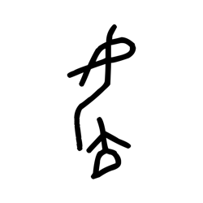

- source_zip_member: `Sub-character Images/wex7jm17pb/7qphk65ozb/qxj8yge7yd.png`
- checksum_sha256: `e33f3dbc1ff2ab4aa890e4e525c2b11dd9c02c6fdb765cb09718f65e98987b05`
- review_status: `needs_human_visual_review`
- caution: OBIMD subcharacter image is a source-marked review asset only; it is not a confirmed component form, component assignment, or decipherment conclusion.

## asset-014324

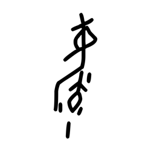

- source_zip_member: `Sub-character Images/wex7jm17pb/7qphk65ozb/r25t3h7uus.png`
- checksum_sha256: `73f9fa86cc5acd25b7e5441c1cc7eda9934aba9ce0a6dc2e9c9201bb3df4f8ae`
- review_status: `needs_human_visual_review`
- caution: OBIMD subcharacter image is a source-marked review asset only; it is not a confirmed component form, component assignment, or decipherment conclusion.

## asset-014325

- source_zip_member: `Sub-character Images/wex7jm17pb/7qphk65ozb/razbl2q76x.png`
- checksum_sha256: `e5c857def0bf128b59a1fe15f7a75c739065491ef1a504a905c75ac17c7bd57b`
- review_status: `needs_human_visual_review`
- caution: OBIMD subcharacter image is a source-marked review asset only; it is not a confirmed component form, component assignment, or decipherment conclusion.

## asset-014326

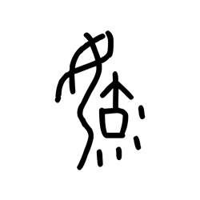

- source_zip_member: `Sub-character Images/wex7jm17pb/7qphk65ozb/rj2e9uy2mu.png`
- checksum_sha256: `667f6cbac7597d459cf3b7ab091968da9079e4acf5d70dadec4dcf1e6a2493fb`
- review_status: `needs_human_visual_review`
- caution: OBIMD subcharacter image is a source-marked review asset only; it is not a confirmed component form, component assignment, or decipherment conclusion.

## asset-014327

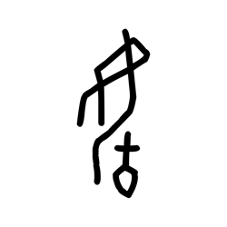

- source_zip_member: `Sub-character Images/wex7jm17pb/7qphk65ozb/s2o9nrdcrr.png`
- checksum_sha256: `c11456169e2addc13df4fa7793ed0ed21da7d90a2c4944b0973ac05c075585b8`
- review_status: `needs_human_visual_review`
- caution: OBIMD subcharacter image is a source-marked review asset only; it is not a confirmed component form, component assignment, or decipherment conclusion.

## asset-014328

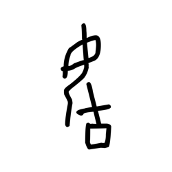

- source_zip_member: `Sub-character Images/wex7jm17pb/7qphk65ozb/s2xphhkjfs.png`
- checksum_sha256: `bd02fb217a141fee1f6397d0d1cd31a6c5b58d6a97573c6a5de573b40a5c65ff`
- review_status: `needs_human_visual_review`
- caution: OBIMD subcharacter image is a source-marked review asset only; it is not a confirmed component form, component assignment, or decipherment conclusion.

## asset-014329

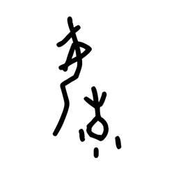

- source_zip_member: `Sub-character Images/wex7jm17pb/7qphk65ozb/s82e24bhzb.png`
- checksum_sha256: `d9b4b5d38465383d6aeba16ed094e4d201660f970b74511d42316f54fbd84a0a`
- review_status: `needs_human_visual_review`
- caution: OBIMD subcharacter image is a source-marked review asset only; it is not a confirmed component form, component assignment, or decipherment conclusion.

## asset-014330

- source_zip_member: `Sub-character Images/wex7jm17pb/7qphk65ozb/sn1jw4q24i.png`
- checksum_sha256: `7e10434447a19086e7d1d5f5fcc2f7b27a423e75b98d98d5e4de63a40e076cd1`
- review_status: `needs_human_visual_review`
- caution: OBIMD subcharacter image is a source-marked review asset only; it is not a confirmed component form, component assignment, or decipherment conclusion.

## asset-014331

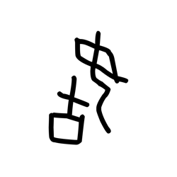

- source_zip_member: `Sub-character Images/wex7jm17pb/7qphk65ozb/sqbo0g6rlq.png`
- checksum_sha256: `19899584bebe34f13006c4fa1aed1b724f68c35f6a898ad021c3bf911aba8cec`
- review_status: `needs_human_visual_review`
- caution: OBIMD subcharacter image is a source-marked review asset only; it is not a confirmed component form, component assignment, or decipherment conclusion.

## asset-014332

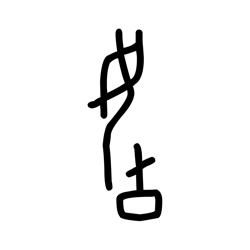

- source_zip_member: `Sub-character Images/wex7jm17pb/7qphk65ozb/ss4m4tmw7f.png`
- checksum_sha256: `84da8ea439898e806987d5d27159ddd61f0b20101d76e386eba2139a121fd630`
- review_status: `needs_human_visual_review`
- caution: OBIMD subcharacter image is a source-marked review asset only; it is not a confirmed component form, component assignment, or decipherment conclusion.

## asset-014333

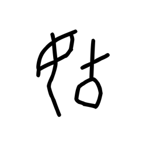

- source_zip_member: `Sub-character Images/wex7jm17pb/7qphk65ozb/svpfaf0nv9.png`
- checksum_sha256: `3b948e07d1c2bec1016d2ee6aa141f447b179c6d20d273c71f997c10aad4eac3`
- review_status: `needs_human_visual_review`
- caution: OBIMD subcharacter image is a source-marked review asset only; it is not a confirmed component form, component assignment, or decipherment conclusion.

## asset-014334

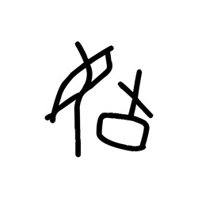

- source_zip_member: `Sub-character Images/wex7jm17pb/7qphk65ozb/tixigffafa.png`
- checksum_sha256: `727ef0980795e05e62f4289892be6622496b4a75e05326176c76e2b3a5f0b37a`
- review_status: `needs_human_visual_review`
- caution: OBIMD subcharacter image is a source-marked review asset only; it is not a confirmed component form, component assignment, or decipherment conclusion.

## asset-014335

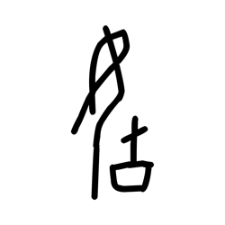

- source_zip_member: `Sub-character Images/wex7jm17pb/7qphk65ozb/u1j2v08nfu.png`
- checksum_sha256: `17bc8703597760a7715dacfc7fe47e0d1413c81823176a81216c63ce3fffd5a9`
- review_status: `needs_human_visual_review`
- caution: OBIMD subcharacter image is a source-marked review asset only; it is not a confirmed component form, component assignment, or decipherment conclusion.

## asset-014336

- source_zip_member: `Sub-character Images/wex7jm17pb/7qphk65ozb/uyftl9gwv3.png`
- checksum_sha256: `0d860fb526689460708a2c357da74053249b2bfe46f800aa83379484d5b63b7b`
- review_status: `needs_human_visual_review`
- caution: OBIMD subcharacter image is a source-marked review asset only; it is not a confirmed component form, component assignment, or decipherment conclusion.

## asset-014337

- source_zip_member: `Sub-character Images/wex7jm17pb/7qphk65ozb/v72fhl7bup.png`
- checksum_sha256: `2b8f9f3bfacfc42a6f1482ed115b311c477bda8c5fbce8a9ce3e86303dd2e08d`
- review_status: `needs_human_visual_review`
- caution: OBIMD subcharacter image is a source-marked review asset only; it is not a confirmed component form, component assignment, or decipherment conclusion.

## asset-014338

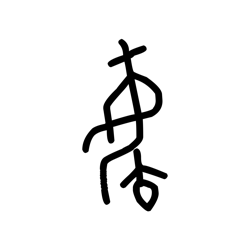

- source_zip_member: `Sub-character Images/wex7jm17pb/7qphk65ozb/vmio08ytig.png`
- checksum_sha256: `38a8f17a97519c895a6a7d219efeec2259eef95223087ae85a4f15ae8582e399`
- review_status: `needs_human_visual_review`
- caution: OBIMD subcharacter image is a source-marked review asset only; it is not a confirmed component form, component assignment, or decipherment conclusion.

## asset-014339

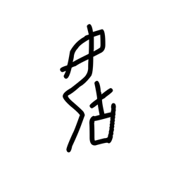

- source_zip_member: `Sub-character Images/wex7jm17pb/7qphk65ozb/vxssi9lqgu.png`
- checksum_sha256: `368308f1f2795d092982fd077fa43a6013c13d67896105c27c5de059ec1f54a0`
- review_status: `needs_human_visual_review`
- caution: OBIMD subcharacter image is a source-marked review asset only; it is not a confirmed component form, component assignment, or decipherment conclusion.

## asset-014340

- source_zip_member: `Sub-character Images/wex7jm17pb/7qphk65ozb/wfo8edhrql.png`
- checksum_sha256: `78c4c8de8a664ae814f0e8a3956d72a331a54051009c0c48aa921bed7e6397bd`
- review_status: `needs_human_visual_review`
- caution: OBIMD subcharacter image is a source-marked review asset only; it is not a confirmed component form, component assignment, or decipherment conclusion.

## asset-014341

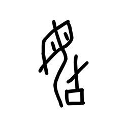

- source_zip_member: `Sub-character Images/wex7jm17pb/7qphk65ozb/y9ydj2bpjv.png`
- checksum_sha256: `4eb008fdefc23aae9d65dfc63dc09134d9e6cae2e5efbf571bc7f682da6a9bde`
- review_status: `needs_human_visual_review`
- caution: OBIMD subcharacter image is a source-marked review asset only; it is not a confirmed component form, component assignment, or decipherment conclusion.

## asset-014342

- source_zip_member: `Sub-character Images/wex7jm17pb/7qphk65ozb/ycr86vtewc.png`
- checksum_sha256: `558ad6e6827d7677f7cec12db0320c964d0f9087fe162fe008ea4c29f546de09`
- review_status: `needs_human_visual_review`
- caution: OBIMD subcharacter image is a source-marked review asset only; it is not a confirmed component form, component assignment, or decipherment conclusion.

## asset-014343

- source_zip_member: `Sub-character Images/wex7jm17pb/7qphk65ozb/yecr18i0xy.png`
- checksum_sha256: `921da60b910620b262e899530ecbd4630f183f1b60436f92ced3394dfef26901`
- review_status: `needs_human_visual_review`
- caution: OBIMD subcharacter image is a source-marked review asset only; it is not a confirmed component form, component assignment, or decipherment conclusion.

## asset-014344

- source_zip_member: `Sub-character Images/wex7jm17pb/7qphk65ozb/ymra34d5q2.png`
- checksum_sha256: `2208d063ab6977c201c276abd31b9d45fc15d3d83c91d985754fa9756e51e9dd`
- review_status: `needs_human_visual_review`
- caution: OBIMD subcharacter image is a source-marked review asset only; it is not a confirmed component form, component assignment, or decipherment conclusion.

## asset-014345

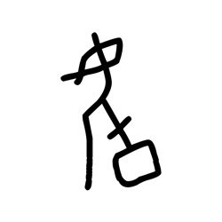

- source_zip_member: `Sub-character Images/wex7jm17pb/7qphk65ozb/yxcp0v99ff.png`
- checksum_sha256: `50118eb44efa7d7ad7d900babd75b029307f3334a71cfefbe075ef9504446608`
- review_status: `needs_human_visual_review`
- caution: OBIMD subcharacter image is a source-marked review asset only; it is not a confirmed component form, component assignment, or decipherment conclusion.

## asset-014346

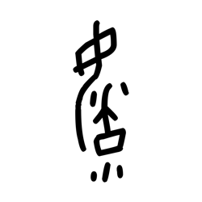

- source_zip_member: `Sub-character Images/wex7jm17pb/7qphk65ozb/yxrp9urbmk.png`
- checksum_sha256: `357565812d9924678c71600ca861cbee28de1bee0531d996cdf8b82f921882af`
- review_status: `needs_human_visual_review`
- caution: OBIMD subcharacter image is a source-marked review asset only; it is not a confirmed component form, component assignment, or decipherment conclusion.

## asset-014347

- source_zip_member: `Sub-character Images/wex7jm17pb/7qphk65ozb/z0lh6obuvd.png`
- checksum_sha256: `98f620a0c2984f309321e39ff513929e1ef1f5c083440e0a7324189110409da6`
- review_status: `needs_human_visual_review`
- caution: OBIMD subcharacter image is a source-marked review asset only; it is not a confirmed component form, component assignment, or decipherment conclusion.

## asset-014348

- source_zip_member: `Sub-character Images/wex7jm17pb/7qphk65ozb/z9bmghx0bl.png`
- checksum_sha256: `bbc8641df0ee2e8bb73654c9d9280925af94a5727c8e81503356a0fd0dc91b9f`
- review_status: `needs_human_visual_review`
- caution: OBIMD subcharacter image is a source-marked review asset only; it is not a confirmed component form, component assignment, or decipherment conclusion.

## asset-014349

- source_zip_member: `Sub-character Images/wex7jm17pb/7qphk65ozb/zamcay5tq5.png`
- checksum_sha256: `103623fdee437156d363fa5e7850e2212d54174735f60153eaf6f3ac028ea01f`
- review_status: `needs_human_visual_review`
- caution: OBIMD subcharacter image is a source-marked review asset only; it is not a confirmed component form, component assignment, or decipherment conclusion.

## asset-014350

- source_zip_member: `Sub-character Images/wex7jm17pb/7qphk65ozb/zb7qxgi49d.png`
- checksum_sha256: `4bf3de3d7c0a9ccb073d0d7e4d23fc38d8df150c1cf27fab99afeee26609f440`
- review_status: `needs_human_visual_review`
- caution: OBIMD subcharacter image is a source-marked review asset only; it is not a confirmed component form, component assignment, or decipherment conclusion.

## asset-014351

- source_zip_member: `Sub-character Images/wex7jm17pb/7qphk65ozb/zkt8na00yb.png`
- checksum_sha256: `8c5807782e054470b35cc07a729785625ca7d75156620c46c08c44c1e97bd6a6`
- review_status: `needs_human_visual_review`
- caution: OBIMD subcharacter image is a source-marked review asset only; it is not a confirmed component form, component assignment, or decipherment conclusion.

## asset-014352

- source_zip_member: `Sub-character Images/wex7jm17pb/7qphk65ozb/zqkbtobszq.png`
- checksum_sha256: `045b0cd7f8544a6600865b00a5ab0b45aea92c1ba45f90f915bcd882c337eb14`
- review_status: `needs_human_visual_review`
- caution: OBIMD subcharacter image is a source-marked review asset only; it is not a confirmed component form, component assignment, or decipherment conclusion.

## asset-014353

- source_zip_member: `Sub-character Images/wex7jm17pb/7qphk65ozb/zy4ba0p19f.png`
- checksum_sha256: `1d69780d5de86841362a5fd9557ef968e24ef737458d784e7e39cc4636947c2a`
- review_status: `needs_human_visual_review`
- caution: OBIMD subcharacter image is a source-marked review asset only; it is not a confirmed component form, component assignment, or decipherment conclusion.
