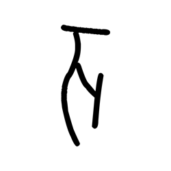
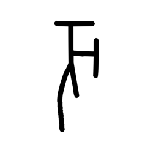
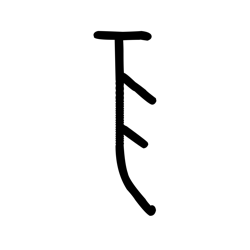
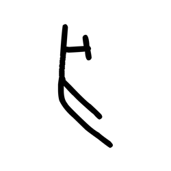
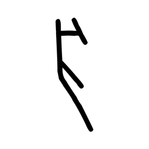
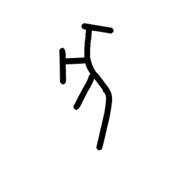

# Component Visual Gallery / 构件图像查看: obs-comp-cand-000996

English:
This page displays OBIMD subcharacter PNG assets extracted into this concrete
corpus object directory for human review.

简体中文：
本页展示抽取到当前具体 corpus 对象目录内的 OBIMD subcharacter PNG 资料，供人工复核使用。

Boundary / 边界：
dataset image candidate only; not a confirmed component form, not a component
assignment, and not a decipherment claim.
- not a confirmed component form
- not a component assignment
- not a decipherment claim

## Concrete Questions To Check / 具体待查问题

- Open 06_component-visual-index.csv and name the local image row.
- 打开 06_component-visual-index.csv，写明本地图像行。
- Open 09_component-visual-route-index.csv and name the source route row.
- 打开 09_component-visual-route-index.csv，写明来源路线行。
- Open 13_component-context-evidence-dossier.md for character context.
- 打开 13_component-context-evidence-dossier.md，核对单字与卜辞上下文。
- Record the missing image, near-shape, source, or context route.
- 记录缺失的图像、近形、来源或上下文路线。

## asset-014366

- source_zip_member: `Sub-character Images/q71z8tnnc6/q71z8tnnc6/05rv5jfu7e.png`
- checksum_sha256: see `06_component-visual-index.csv`.
- review_status: `needs_human_visual_review`
- caution: source-marked review image only.

## asset-014367

- source_zip_member: `Sub-character Images/q71z8tnnc6/q71z8tnnc6/2jtmeqxd6e.png`
- checksum_sha256: see `06_component-visual-index.csv`.
- review_status: `needs_human_visual_review`
- caution: source-marked review image only.

## asset-014368

- source_zip_member: `Sub-character Images/q71z8tnnc6/q71z8tnnc6/2ocoil9tl4.png`
- checksum_sha256: see `06_component-visual-index.csv`.
- review_status: `needs_human_visual_review`
- caution: source-marked review image only.

## asset-014369

- source_zip_member: `Sub-character Images/q71z8tnnc6/q71z8tnnc6/2pkib0drmn.png`
- checksum_sha256: see `06_component-visual-index.csv`.
- review_status: `needs_human_visual_review`
- caution: source-marked review image only.

## asset-014370

- source_zip_member: `Sub-character Images/q71z8tnnc6/q71z8tnnc6/3zzkvkv1ic.png`
- checksum_sha256: see `06_component-visual-index.csv`.
- review_status: `needs_human_visual_review`
- caution: source-marked review image only.

## asset-014371

- source_zip_member: `Sub-character Images/q71z8tnnc6/q71z8tnnc6/4flanltpsk.png`
- checksum_sha256: see `06_component-visual-index.csv`.
- review_status: `needs_human_visual_review`
- caution: source-marked review image only.

## asset-014372

- source_zip_member: `Sub-character Images/q71z8tnnc6/q71z8tnnc6/4pn6kzlesd.png`
- checksum_sha256: see `06_component-visual-index.csv`.
- review_status: `needs_human_visual_review`
- caution: source-marked review image only.

## asset-014373

- source_zip_member: `Sub-character Images/q71z8tnnc6/q71z8tnnc6/4yclkytwtn.png`
- checksum_sha256: see `06_component-visual-index.csv`.
- review_status: `needs_human_visual_review`
- caution: source-marked review image only.

## asset-014374

- source_zip_member: `Sub-character Images/q71z8tnnc6/q71z8tnnc6/5969cdmjms.png`
- checksum_sha256: see `06_component-visual-index.csv`.
- review_status: `needs_human_visual_review`
- caution: source-marked review image only.

## asset-014375

- source_zip_member: `Sub-character Images/q71z8tnnc6/q71z8tnnc6/5lqopzk5u2.png`
- checksum_sha256: see `06_component-visual-index.csv`.
- review_status: `needs_human_visual_review`
- caution: source-marked review image only.

## asset-014376

- source_zip_member: `Sub-character Images/q71z8tnnc6/q71z8tnnc6/5qziwbrip6.png`
- checksum_sha256: see `06_component-visual-index.csv`.
- review_status: `needs_human_visual_review`
- caution: source-marked review image only.

## asset-014377

- source_zip_member: `Sub-character Images/q71z8tnnc6/q71z8tnnc6/5u3dfwcfwq.png`
- checksum_sha256: see `06_component-visual-index.csv`.
- review_status: `needs_human_visual_review`
- caution: source-marked review image only.

## asset-014378

- source_zip_member: `Sub-character Images/q71z8tnnc6/q71z8tnnc6/6flmetera6.png`
- checksum_sha256: see `06_component-visual-index.csv`.
- review_status: `needs_human_visual_review`
- caution: source-marked review image only.

## asset-014379

- source_zip_member: `Sub-character Images/q71z8tnnc6/q71z8tnnc6/6hm1jzuyos.png`
- checksum_sha256: see `06_component-visual-index.csv`.
- review_status: `needs_human_visual_review`
- caution: source-marked review image only.

## asset-014380

- source_zip_member: `Sub-character Images/q71z8tnnc6/q71z8tnnc6/6ur4dq21ej.png`
- checksum_sha256: see `06_component-visual-index.csv`.
- review_status: `needs_human_visual_review`
- caution: source-marked review image only.

## asset-014381

- source_zip_member: `Sub-character Images/q71z8tnnc6/q71z8tnnc6/72c96dcam6.png`
- checksum_sha256: see `06_component-visual-index.csv`.
- review_status: `needs_human_visual_review`
- caution: source-marked review image only.

## asset-014382

- source_zip_member: `Sub-character Images/q71z8tnnc6/q71z8tnnc6/7ha5mgnj1c.png`
- checksum_sha256: see `06_component-visual-index.csv`.
- review_status: `needs_human_visual_review`
- caution: source-marked review image only.

## asset-014383

- source_zip_member: `Sub-character Images/q71z8tnnc6/q71z8tnnc6/8by4trxipc.png`
- checksum_sha256: see `06_component-visual-index.csv`.
- review_status: `needs_human_visual_review`
- caution: source-marked review image only.

## asset-014384

- source_zip_member: `Sub-character Images/q71z8tnnc6/q71z8tnnc6/8n8t9trxdb.png`
- checksum_sha256: see `06_component-visual-index.csv`.
- review_status: `needs_human_visual_review`
- caution: source-marked review image only.

## asset-014385

- source_zip_member: `Sub-character Images/q71z8tnnc6/q71z8tnnc6/90d47lwgi4.png`
- checksum_sha256: see `06_component-visual-index.csv`.
- review_status: `needs_human_visual_review`
- caution: source-marked review image only.

## asset-014386

- source_zip_member: `Sub-character Images/q71z8tnnc6/q71z8tnnc6/99q0hguuvi.png`
- checksum_sha256: see `06_component-visual-index.csv`.
- review_status: `needs_human_visual_review`
- caution: source-marked review image only.

## asset-014387

- source_zip_member: `Sub-character Images/q71z8tnnc6/q71z8tnnc6/9yna6ws8r5.png`
- checksum_sha256: see `06_component-visual-index.csv`.
- review_status: `needs_human_visual_review`
- caution: source-marked review image only.

## asset-014388

- source_zip_member: `Sub-character Images/q71z8tnnc6/q71z8tnnc6/a3pd94h5sd.png`
- checksum_sha256: see `06_component-visual-index.csv`.
- review_status: `needs_human_visual_review`
- caution: source-marked review image only.

## asset-014389

- source_zip_member: `Sub-character Images/q71z8tnnc6/q71z8tnnc6/acj4jnxiso.png`
- checksum_sha256: see `06_component-visual-index.csv`.
- review_status: `needs_human_visual_review`
- caution: source-marked review image only.

## asset-014390

- source_zip_member: `Sub-character Images/q71z8tnnc6/q71z8tnnc6/b875615pzh.png`
- checksum_sha256: see `06_component-visual-index.csv`.
- review_status: `needs_human_visual_review`
- caution: source-marked review image only.

## asset-014391

- source_zip_member: `Sub-character Images/q71z8tnnc6/q71z8tnnc6/cbf5wl2h68.png`
- checksum_sha256: see `06_component-visual-index.csv`.
- review_status: `needs_human_visual_review`
- caution: source-marked review image only.

## asset-014392

- source_zip_member: `Sub-character Images/q71z8tnnc6/q71z8tnnc6/clpvj2opf5.png`
- checksum_sha256: see `06_component-visual-index.csv`.
- review_status: `needs_human_visual_review`
- caution: source-marked review image only.

## asset-014393

- source_zip_member: `Sub-character Images/q71z8tnnc6/q71z8tnnc6/d7bk60hyvu.png`
- checksum_sha256: see `06_component-visual-index.csv`.
- review_status: `needs_human_visual_review`
- caution: source-marked review image only.

## asset-014394

- source_zip_member: `Sub-character Images/q71z8tnnc6/q71z8tnnc6/dvtzn1q346.png`
- checksum_sha256: see `06_component-visual-index.csv`.
- review_status: `needs_human_visual_review`
- caution: source-marked review image only.

## asset-014395

- source_zip_member: `Sub-character Images/q71z8tnnc6/q71z8tnnc6/e3ivjh79bu.png`
- checksum_sha256: see `06_component-visual-index.csv`.
- review_status: `needs_human_visual_review`
- caution: source-marked review image only.

## asset-014396

- source_zip_member: `Sub-character Images/q71z8tnnc6/q71z8tnnc6/ffee9n6yy3.png`
- checksum_sha256: see `06_component-visual-index.csv`.
- review_status: `needs_human_visual_review`
- caution: source-marked review image only.

## asset-014397

- source_zip_member: `Sub-character Images/q71z8tnnc6/q71z8tnnc6/giw29riyiz.png`
- checksum_sha256: see `06_component-visual-index.csv`.
- review_status: `needs_human_visual_review`
- caution: source-marked review image only.

## asset-014398

- source_zip_member: `Sub-character Images/q71z8tnnc6/q71z8tnnc6/i0oie0zfbu.png`
- checksum_sha256: see `06_component-visual-index.csv`.
- review_status: `needs_human_visual_review`
- caution: source-marked review image only.

## asset-014399

- source_zip_member: `Sub-character Images/q71z8tnnc6/q71z8tnnc6/ia59587a51.png`
- checksum_sha256: see `06_component-visual-index.csv`.
- review_status: `needs_human_visual_review`
- caution: source-marked review image only.

## asset-014400

- source_zip_member: `Sub-character Images/q71z8tnnc6/q71z8tnnc6/ij550palup.png`
- checksum_sha256: see `06_component-visual-index.csv`.
- review_status: `needs_human_visual_review`
- caution: source-marked review image only.

## asset-014401

- source_zip_member: `Sub-character Images/q71z8tnnc6/q71z8tnnc6/inek5bf8tt.png`
- checksum_sha256: see `06_component-visual-index.csv`.
- review_status: `needs_human_visual_review`
- caution: source-marked review image only.

## asset-014402

- source_zip_member: `Sub-character Images/q71z8tnnc6/q71z8tnnc6/itk57cd16c.png`
- checksum_sha256: see `06_component-visual-index.csv`.
- review_status: `needs_human_visual_review`
- caution: source-marked review image only.

## asset-014403

- source_zip_member: `Sub-character Images/q71z8tnnc6/q71z8tnnc6/ivzwhmn1w3.png`
- checksum_sha256: see `06_component-visual-index.csv`.
- review_status: `needs_human_visual_review`
- caution: source-marked review image only.

## asset-014404

- source_zip_member: `Sub-character Images/q71z8tnnc6/q71z8tnnc6/j2f217llkw.png`
- checksum_sha256: see `06_component-visual-index.csv`.
- review_status: `needs_human_visual_review`
- caution: source-marked review image only.

## asset-014405

- source_zip_member: `Sub-character Images/q71z8tnnc6/q71z8tnnc6/k9zb04yclx.png`
- checksum_sha256: see `06_component-visual-index.csv`.
- review_status: `needs_human_visual_review`
- caution: source-marked review image only.

## asset-014406

- source_zip_member: `Sub-character Images/q71z8tnnc6/q71z8tnnc6/kcimwaz69f.png`
- checksum_sha256: see `06_component-visual-index.csv`.
- review_status: `needs_human_visual_review`
- caution: source-marked review image only.

## asset-014407

- source_zip_member: `Sub-character Images/q71z8tnnc6/q71z8tnnc6/ksxn3oc6h8.png`
- checksum_sha256: see `06_component-visual-index.csv`.
- review_status: `needs_human_visual_review`
- caution: source-marked review image only.

## asset-014408

- source_zip_member: `Sub-character Images/q71z8tnnc6/q71z8tnnc6/lh2xnbkm3q.png`
- checksum_sha256: see `06_component-visual-index.csv`.
- review_status: `needs_human_visual_review`
- caution: source-marked review image only.

## asset-014409

- source_zip_member: `Sub-character Images/q71z8tnnc6/q71z8tnnc6/mri4a41joc.png`
- checksum_sha256: see `06_component-visual-index.csv`.
- review_status: `needs_human_visual_review`
- caution: source-marked review image only.

## asset-014410

- source_zip_member: `Sub-character Images/q71z8tnnc6/q71z8tnnc6/ozow9ehuq1.png`
- checksum_sha256: see `06_component-visual-index.csv`.
- review_status: `needs_human_visual_review`
- caution: source-marked review image only.

## asset-014411

- source_zip_member: `Sub-character Images/q71z8tnnc6/q71z8tnnc6/pp5qbrgf1s.png`
- checksum_sha256: see `06_component-visual-index.csv`.
- review_status: `needs_human_visual_review`
- caution: source-marked review image only.

## asset-014412

- source_zip_member: `Sub-character Images/q71z8tnnc6/q71z8tnnc6/q71z8tnnc6.png`
- checksum_sha256: see `06_component-visual-index.csv`.
- review_status: `needs_human_visual_review`
- caution: source-marked review image only.

## asset-014413

- source_zip_member: `Sub-character Images/q71z8tnnc6/q71z8tnnc6/qcx33fu8g9.png`
- checksum_sha256: see `06_component-visual-index.csv`.
- review_status: `needs_human_visual_review`
- caution: source-marked review image only.

## asset-014414

- source_zip_member: `Sub-character Images/q71z8tnnc6/q71z8tnnc6/ri9n865zp2.png`
- checksum_sha256: see `06_component-visual-index.csv`.
- review_status: `needs_human_visual_review`
- caution: source-marked review image only.

## asset-014415

- source_zip_member: `Sub-character Images/q71z8tnnc6/q71z8tnnc6/rn8cppw9ca.png`
- checksum_sha256: see `06_component-visual-index.csv`.
- review_status: `needs_human_visual_review`
- caution: source-marked review image only.

## asset-014416

- source_zip_member: `Sub-character Images/q71z8tnnc6/q71z8tnnc6/sdntyvw0wv.png`
- checksum_sha256: see `06_component-visual-index.csv`.
- review_status: `needs_human_visual_review`
- caution: source-marked review image only.

## asset-014417

- source_zip_member: `Sub-character Images/q71z8tnnc6/q71z8tnnc6/t85p52wqfw.png`
- checksum_sha256: see `06_component-visual-index.csv`.
- review_status: `needs_human_visual_review`
- caution: source-marked review image only.

## asset-014418

- source_zip_member: `Sub-character Images/q71z8tnnc6/q71z8tnnc6/u5qwluvr9e.png`
- checksum_sha256: see `06_component-visual-index.csv`.
- review_status: `needs_human_visual_review`
- caution: source-marked review image only.

## asset-014419

- source_zip_member: `Sub-character Images/q71z8tnnc6/q71z8tnnc6/ufvhphkvht.png`
- checksum_sha256: see `06_component-visual-index.csv`.
- review_status: `needs_human_visual_review`
- caution: source-marked review image only.

## asset-014420

- source_zip_member: `Sub-character Images/q71z8tnnc6/q71z8tnnc6/uhu4h4006j.png`
- checksum_sha256: see `06_component-visual-index.csv`.
- review_status: `needs_human_visual_review`
- caution: source-marked review image only.

## asset-014421

- source_zip_member: `Sub-character Images/q71z8tnnc6/q71z8tnnc6/ursyz3av8f.png`
- checksum_sha256: see `06_component-visual-index.csv`.
- review_status: `needs_human_visual_review`
- caution: source-marked review image only.

## asset-014422

- source_zip_member: `Sub-character Images/q71z8tnnc6/q71z8tnnc6/vf74jdv7i7.png`
- checksum_sha256: see `06_component-visual-index.csv`.
- review_status: `needs_human_visual_review`
- caution: source-marked review image only.

## asset-014423

- source_zip_member: `Sub-character Images/q71z8tnnc6/q71z8tnnc6/vn2en9qpep.png`
- checksum_sha256: see `06_component-visual-index.csv`.
- review_status: `needs_human_visual_review`
- caution: source-marked review image only.

## asset-014424

- source_zip_member: `Sub-character Images/q71z8tnnc6/q71z8tnnc6/vu9mg1gkn0.png`
- checksum_sha256: see `06_component-visual-index.csv`.
- review_status: `needs_human_visual_review`
- caution: source-marked review image only.

## asset-014425

- source_zip_member: `Sub-character Images/q71z8tnnc6/q71z8tnnc6/w43ggt1xfw.png`
- checksum_sha256: see `06_component-visual-index.csv`.
- review_status: `needs_human_visual_review`
- caution: source-marked review image only.

## asset-014426

- source_zip_member: `Sub-character Images/q71z8tnnc6/q71z8tnnc6/wfwrw08aqq.png`
- checksum_sha256: see `06_component-visual-index.csv`.
- review_status: `needs_human_visual_review`
- caution: source-marked review image only.

## asset-014427

- source_zip_member: `Sub-character Images/q71z8tnnc6/q71z8tnnc6/xo6e04fp6x.png`
- checksum_sha256: see `06_component-visual-index.csv`.
- review_status: `needs_human_visual_review`
- caution: source-marked review image only.

## asset-014428

- source_zip_member: `Sub-character Images/q71z8tnnc6/q71z8tnnc6/y33qjhgj8i.png`
- checksum_sha256: see `06_component-visual-index.csv`.
- review_status: `needs_human_visual_review`
- caution: source-marked review image only.

## asset-014429

- source_zip_member: `Sub-character Images/q71z8tnnc6/q71z8tnnc6/zuozy0eu7e.png`
- checksum_sha256: see `06_component-visual-index.csv`.
- review_status: `needs_human_visual_review`
- caution: source-marked review image only.
