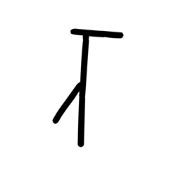
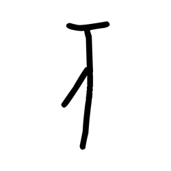
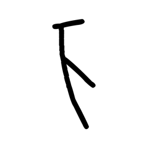
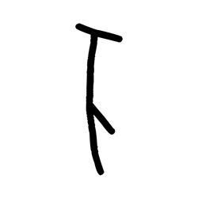
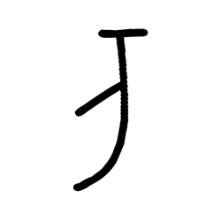
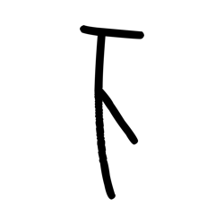

# Component Visual Gallery / 构件图像查看: obs-comp-cand-000997

English:
This page displays OBIMD subcharacter PNG assets extracted into this concrete corpus object directory for human review.

简体中文：
本页展示抽取到当前具体 corpus 对象目录内的 OBIMD subcharacter PNG 资料，供人工复核使用。

Boundary / 边界：dataset image candidate only; not a confirmed component form, component assignment, or decipherment claim.

## asset-014430

- source_zip_member: `Sub-character Images/q71z8tnnc6/siyjqf2nk4/4rgxkwos89.png`
- checksum_sha256: `1a9f5e048bff049ebd99884b21ff03c7125a2d61830ac949d8bfba3aca10447d`
- review_status: `needs_human_visual_review`
- caution: OBIMD subcharacter image is a source-marked review asset only; it is not a confirmed component form, component assignment, or decipherment conclusion.

## asset-014431

- source_zip_member: `Sub-character Images/q71z8tnnc6/siyjqf2nk4/dn0jxwhzln.png`
- checksum_sha256: `3f5f62c5556f22b7eb697d00473cbe09bba3e0082241d62433489f2a3f9d5bda`
- review_status: `needs_human_visual_review`
- caution: OBIMD subcharacter image is a source-marked review asset only; it is not a confirmed component form, component assignment, or decipherment conclusion.

## asset-014432

- source_zip_member: `Sub-character Images/q71z8tnnc6/siyjqf2nk4/oh7yosm14p.png`
- checksum_sha256: `448870fd772db6167f42c81efc9dc006519e21c0505fc1498aa47877bbf5080d`
- review_status: `needs_human_visual_review`
- caution: OBIMD subcharacter image is a source-marked review asset only; it is not a confirmed component form, component assignment, or decipherment conclusion.

## asset-014433

- source_zip_member: `Sub-character Images/q71z8tnnc6/siyjqf2nk4/pb4mcv39b9.png`
- checksum_sha256: `6ab2068af5d33eabca15d0be331b47e39aa3370151635923ddb9b1a1112f846b`
- review_status: `needs_human_visual_review`
- caution: OBIMD subcharacter image is a source-marked review asset only; it is not a confirmed component form, component assignment, or decipherment conclusion.

## asset-014434

- source_zip_member: `Sub-character Images/q71z8tnnc6/siyjqf2nk4/siyjqf2nk4.png`
- checksum_sha256: `e0c9c8a4fc0f6a7cdd93af6d048015cf8dad87f2c084e517b6dbd3cd5ad4734e`
- review_status: `needs_human_visual_review`
- caution: OBIMD subcharacter image is a source-marked review asset only; it is not a confirmed component form, component assignment, or decipherment conclusion.

## asset-014435

- source_zip_member: `Sub-character Images/q71z8tnnc6/siyjqf2nk4/vufffiynlo.png`
- checksum_sha256: `25202bc43117cff367df35c7dd34e50d0ccc9b5c5fb8edb31b256f5cd829c495`
- review_status: `needs_human_visual_review`
- caution: OBIMD subcharacter image is a source-marked review asset only; it is not a confirmed component form, component assignment, or decipherment conclusion.
