# Component Visual Gallery / 构件图像查看: obs-comp-cand-001015

English:
This page displays OBIMD subcharacter PNG assets extracted into this concrete
corpus object directory for human review.

简体中文：
本页展示抽取到当前具体 corpus 对象目录内的 OBIMD subcharacter PNG 资料，供人工复核使用。

Boundary / 边界：
dataset image candidate only; not a confirmed component form, not a component
assignment, and not a decipherment claim.
- not a confirmed component form
- not a component assignment
- not a decipherment claim

## Concrete Questions To Check / 具体待查问题

- Which local image should be opened first?
- 应先打开哪一张本地构件图像？
- Which source zip member anchors this image?
- 哪一个 source zip member 能定位这张图像？
- Which near-shape or variant comparison is still missing?
- 还缺哪些近形或异体比较？
- Which character or inscription context should be checked next?
- 下一步应核对哪些单字或卜辞上下文？
- What evidence is missing before a component assignment?
- 正式构件归属前还缺哪些证据？

## asset-014478

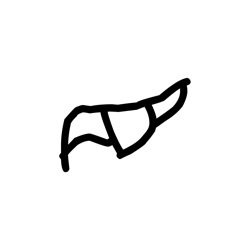

- source_zip_member: `Sub-character Images/47ioadp9wd/47ioadp9wd/174hzkbpms.png`
- checksum_sha256: see `06_component-visual-index.csv`.
- review_status: `needs_human_visual_review`
- caution: source-marked review image only.

## asset-014479

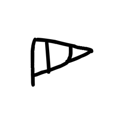

- source_zip_member: `Sub-character Images/47ioadp9wd/47ioadp9wd/2ad0k1rapn.png`
- checksum_sha256: see `06_component-visual-index.csv`.
- review_status: `needs_human_visual_review`
- caution: source-marked review image only.

## asset-014480

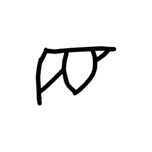

- source_zip_member: `Sub-character Images/47ioadp9wd/47ioadp9wd/40jr04ulbk.png`
- checksum_sha256: see `06_component-visual-index.csv`.
- review_status: `needs_human_visual_review`
- caution: source-marked review image only.

## asset-014481

- source_zip_member: `Sub-character Images/47ioadp9wd/47ioadp9wd/47ioadp9wd.png`
- checksum_sha256: see `06_component-visual-index.csv`.
- review_status: `needs_human_visual_review`
- caution: source-marked review image only.

## asset-014482

- source_zip_member: `Sub-character Images/47ioadp9wd/47ioadp9wd/579vp2fn84.png`
- checksum_sha256: see `06_component-visual-index.csv`.
- review_status: `needs_human_visual_review`
- caution: source-marked review image only.

## asset-014483

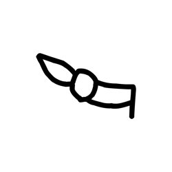

- source_zip_member: `Sub-character Images/47ioadp9wd/47ioadp9wd/5nctt57ysp.png`
- checksum_sha256: see `06_component-visual-index.csv`.
- review_status: `needs_human_visual_review`
- caution: source-marked review image only.

## asset-014484

- source_zip_member: `Sub-character Images/47ioadp9wd/47ioadp9wd/7198np7v6r.png`
- checksum_sha256: see `06_component-visual-index.csv`.
- review_status: `needs_human_visual_review`
- caution: source-marked review image only.

## asset-014485

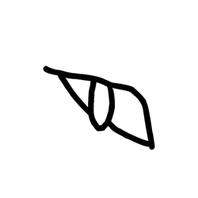

- source_zip_member: `Sub-character Images/47ioadp9wd/47ioadp9wd/avbwraoxi2.png`
- checksum_sha256: see `06_component-visual-index.csv`.
- review_status: `needs_human_visual_review`
- caution: source-marked review image only.

## asset-014486

- source_zip_member: `Sub-character Images/47ioadp9wd/47ioadp9wd/cjf2cbliue.png`
- checksum_sha256: see `06_component-visual-index.csv`.
- review_status: `needs_human_visual_review`
- caution: source-marked review image only.

## asset-014487

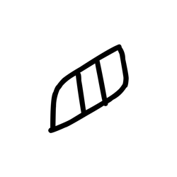

- source_zip_member: `Sub-character Images/47ioadp9wd/47ioadp9wd/dk9efn4xet.png`
- checksum_sha256: see `06_component-visual-index.csv`.
- review_status: `needs_human_visual_review`
- caution: source-marked review image only.

## asset-014488

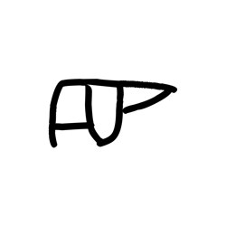

- source_zip_member: `Sub-character Images/47ioadp9wd/47ioadp9wd/dzbp36l5cs.png`
- checksum_sha256: see `06_component-visual-index.csv`.
- review_status: `needs_human_visual_review`
- caution: source-marked review image only.

## asset-014489

- source_zip_member: `Sub-character Images/47ioadp9wd/47ioadp9wd/jq9yskil19.png`
- checksum_sha256: see `06_component-visual-index.csv`.
- review_status: `needs_human_visual_review`
- caution: source-marked review image only.

## asset-014490

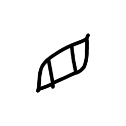

- source_zip_member: `Sub-character Images/47ioadp9wd/47ioadp9wd/meuw8ifffg.png`
- checksum_sha256: see `06_component-visual-index.csv`.
- review_status: `needs_human_visual_review`
- caution: source-marked review image only.

## asset-014491

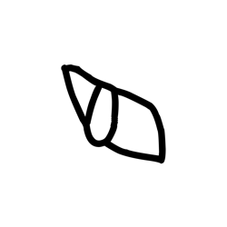

- source_zip_member: `Sub-character Images/47ioadp9wd/47ioadp9wd/nxx4fz50ii.png`
- checksum_sha256: see `06_component-visual-index.csv`.
- review_status: `needs_human_visual_review`
- caution: source-marked review image only.

## asset-014492

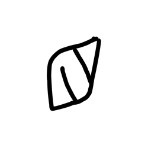

- source_zip_member: `Sub-character Images/47ioadp9wd/47ioadp9wd/sjtb3p4tok.png`
- checksum_sha256: see `06_component-visual-index.csv`.
- review_status: `needs_human_visual_review`
- caution: source-marked review image only.

## asset-014493

- source_zip_member: `Sub-character Images/47ioadp9wd/47ioadp9wd/whr3xvvpwc.png`
- checksum_sha256: see `06_component-visual-index.csv`.
- review_status: `needs_human_visual_review`
- caution: source-marked review image only.

## asset-014494

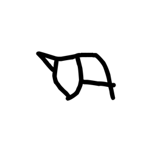

- source_zip_member: `Sub-character Images/47ioadp9wd/47ioadp9wd/wn4hdflqxt.png`
- checksum_sha256: see `06_component-visual-index.csv`.
- review_status: `needs_human_visual_review`
- caution: source-marked review image only.

## asset-014495

- source_zip_member: `Sub-character Images/47ioadp9wd/47ioadp9wd/y8aj9xqso2.png`
- checksum_sha256: see `06_component-visual-index.csv`.
- review_status: `needs_human_visual_review`
- caution: source-marked review image only.

## asset-014496

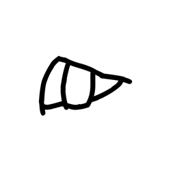

- source_zip_member: `Sub-character Images/47ioadp9wd/47ioadp9wd/yvmjdydby0.png`
- checksum_sha256: see `06_component-visual-index.csv`.
- review_status: `needs_human_visual_review`
- caution: source-marked review image only.

## asset-014497

- source_zip_member: `Sub-character Images/47ioadp9wd/47ioadp9wd/z3xvu4mgzy.png`
- checksum_sha256: see `06_component-visual-index.csv`.
- review_status: `needs_human_visual_review`
- caution: source-marked review image only.
