# Component Visual Gallery / 构件图像查看: obs-comp-cand-001024

English:
This page displays OBIMD subcharacter PNG assets extracted into this concrete corpus object directory for human review.

简体中文：
本页展示抽取到当前具体 corpus 对象目录内的 OBIMD subcharacter PNG 资料，供人工复核使用。

Boundary / 边界：dataset image candidate only; not a confirmed component form, component assignment, or decipherment claim.

## asset-014506

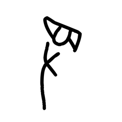

- source_zip_member: `Sub-character Images/altlfztjg5/altlfztjg5/2wsosek0on.png`
- checksum_sha256: `a78902abfdf53316b1e07c09021041b32d391029692a65f922a1a6f7817ea838`
- review_status: `needs_human_visual_review`
- caution: OBIMD subcharacter image is a source-marked review asset only; it is not a confirmed component form, component assignment, or decipherment conclusion.

## asset-014507

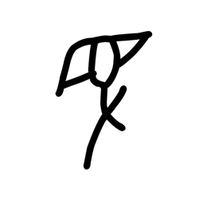

- source_zip_member: `Sub-character Images/altlfztjg5/altlfztjg5/altlfztjg5.png`
- checksum_sha256: `bf2a01d0670424b2266bc3ce7558c7fdd1c8295c4aafa1998765be60401f6b9a`
- review_status: `needs_human_visual_review`
- caution: OBIMD subcharacter image is a source-marked review asset only; it is not a confirmed component form, component assignment, or decipherment conclusion.

## asset-014508

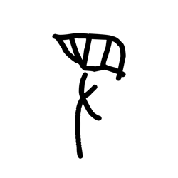

- source_zip_member: `Sub-character Images/altlfztjg5/altlfztjg5/k6g5mva0gb.png`
- checksum_sha256: `566652b0185ed69198834f460ac54c2a11fa10f4b5ce68bf30408120b5d52f11`
- review_status: `needs_human_visual_review`
- caution: OBIMD subcharacter image is a source-marked review asset only; it is not a confirmed component form, component assignment, or decipherment conclusion.

## asset-014509

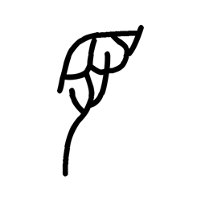

- source_zip_member: `Sub-character Images/altlfztjg5/altlfztjg5/l9mt7avlrb.png`
- checksum_sha256: `7e5f96cb08eb85b1bc195d462a57f8fbad83cac4bbf15a40051c6249d85398c2`
- review_status: `needs_human_visual_review`
- caution: OBIMD subcharacter image is a source-marked review asset only; it is not a confirmed component form, component assignment, or decipherment conclusion.

## asset-014510

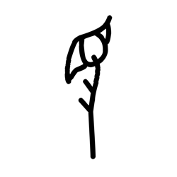

- source_zip_member: `Sub-character Images/altlfztjg5/altlfztjg5/lb8yqbhflr.png`
- checksum_sha256: `09c5f059e3829e30d275afe48449308df2d4c0ccfb839397db5bed83e17db77f`
- review_status: `needs_human_visual_review`
- caution: OBIMD subcharacter image is a source-marked review asset only; it is not a confirmed component form, component assignment, or decipherment conclusion.

## asset-014511

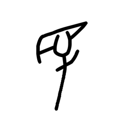

- source_zip_member: `Sub-character Images/altlfztjg5/altlfztjg5/mryldzuhoc.png`
- checksum_sha256: `948c0f17a055e90208c61fc7c30efd0244e787807602ff7febf41834fdfde236`
- review_status: `needs_human_visual_review`
- caution: OBIMD subcharacter image is a source-marked review asset only; it is not a confirmed component form, component assignment, or decipherment conclusion.

## asset-014512

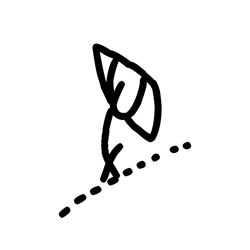

- source_zip_member: `Sub-character Images/altlfztjg5/altlfztjg5/msszvq33jv.png`
- checksum_sha256: `3e0766b63318a93eb28fa42e898f20391833ec9b4af71bfef4966a7432022f51`
- review_status: `needs_human_visual_review`
- caution: OBIMD subcharacter image is a source-marked review asset only; it is not a confirmed component form, component assignment, or decipherment conclusion.

## asset-014513

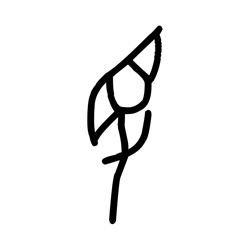

- source_zip_member: `Sub-character Images/altlfztjg5/altlfztjg5/naada4t3n4.png`
- checksum_sha256: `c5444514933dbf0985050055ce4b45fe46bd174ced25d7c0971d0d328cb8231e`
- review_status: `needs_human_visual_review`
- caution: OBIMD subcharacter image is a source-marked review asset only; it is not a confirmed component form, component assignment, or decipherment conclusion.

## asset-014514

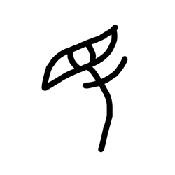

- source_zip_member: `Sub-character Images/altlfztjg5/altlfztjg5/vsc8nh82rh.png`
- checksum_sha256: `bff25940800efad52e80ac039994eee2f13692463056edea9c15a888210feeec`
- review_status: `needs_human_visual_review`
- caution: OBIMD subcharacter image is a source-marked review asset only; it is not a confirmed component form, component assignment, or decipherment conclusion.

## asset-014515

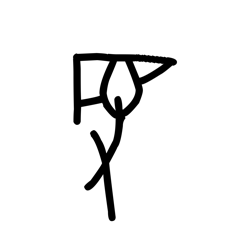

- source_zip_member: `Sub-character Images/altlfztjg5/altlfztjg5/w082unekw0.png`
- checksum_sha256: `16ce23080cf5cef0a31c1b6b7ff4acc720deee2a8bc828f70a6c5374be86d514`
- review_status: `needs_human_visual_review`
- caution: OBIMD subcharacter image is a source-marked review asset only; it is not a confirmed component form, component assignment, or decipherment conclusion.

## asset-014516

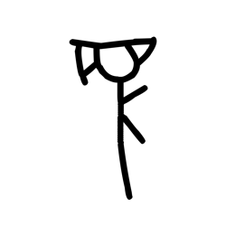

- source_zip_member: `Sub-character Images/altlfztjg5/altlfztjg5/wd3l3ozqfg.png`
- checksum_sha256: `9b0af7da8dee33e3ab7b172b102c69ea2a01ced00c7af593f4d98626f32683b9`
- review_status: `needs_human_visual_review`
- caution: OBIMD subcharacter image is a source-marked review asset only; it is not a confirmed component form, component assignment, or decipherment conclusion.

## asset-014517

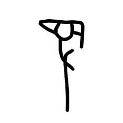

- source_zip_member: `Sub-character Images/altlfztjg5/altlfztjg5/yr1x60zyyf.png`
- checksum_sha256: `9764e689685ad9ed570f5448ed55652c802d16f2b189a750f8f34e4723a604b7`
- review_status: `needs_human_visual_review`
- caution: OBIMD subcharacter image is a source-marked review asset only; it is not a confirmed component form, component assignment, or decipherment conclusion.
