# Component Visual Gallery / 构件图像查看: obs-comp-cand-001039

English:
This page displays OBIMD subcharacter PNG assets extracted into this concrete
corpus object directory for human review.

简体中文：
本页展示抽取到当前具体 corpus 对象目录内的 OBIMD subcharacter PNG 资料，供人工复核使用。

Boundary / 边界：
dataset image candidate only; not a confirmed component form, not a component
assignment, and not a decipherment claim.
- not a confirmed component form
- not a component assignment
- not a decipherment claim

## Concrete Questions To Check / 具体待查问题

- Open 06_component-visual-index.csv and name the local image row.
- 打开 06_component-visual-index.csv，写明本地图像行。
- Open 09_component-visual-route-index.csv and name the source route row.
- 打开 09_component-visual-route-index.csv，写明来源路线行。
- Open 13_component-context-evidence-dossier.md for character context.
- 打开 13_component-context-evidence-dossier.md，核对单字与卜辞上下文。
- Record the missing image, near-shape, source, or context route.
- 记录缺失的图像、近形、来源或上下文路线。

## asset-014532

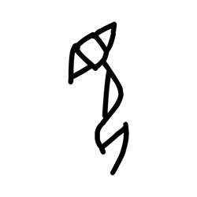

- source_zip_member: `Sub-character Images/r9cvuw9v1t/r9cvuw9v1t/09hpwwk8cq.png`
- checksum_sha256: see `06_component-visual-index.csv`.
- review_status: `needs_human_visual_review`
- caution: source-marked review image only.

## asset-014533

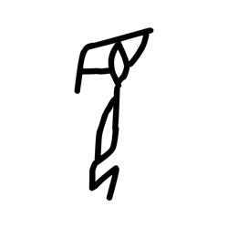

- source_zip_member: `Sub-character Images/r9cvuw9v1t/r9cvuw9v1t/0lxhmvhkha.png`
- checksum_sha256: see `06_component-visual-index.csv`.
- review_status: `needs_human_visual_review`
- caution: source-marked review image only.

## asset-014534

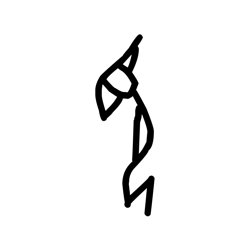

- source_zip_member: `Sub-character Images/r9cvuw9v1t/r9cvuw9v1t/1hrd0pzlzo.png`
- checksum_sha256: see `06_component-visual-index.csv`.
- review_status: `needs_human_visual_review`
- caution: source-marked review image only.

## asset-014535

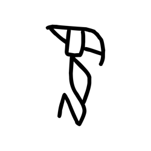

- source_zip_member: `Sub-character Images/r9cvuw9v1t/r9cvuw9v1t/338t255ler.png`
- checksum_sha256: see `06_component-visual-index.csv`.
- review_status: `needs_human_visual_review`
- caution: source-marked review image only.

## asset-014536

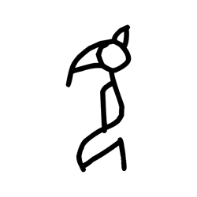

- source_zip_member: `Sub-character Images/r9cvuw9v1t/r9cvuw9v1t/4aog5hcx02.png`
- checksum_sha256: see `06_component-visual-index.csv`.
- review_status: `needs_human_visual_review`
- caution: source-marked review image only.

## asset-014537

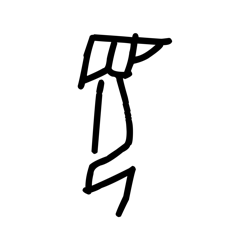

- source_zip_member: `Sub-character Images/r9cvuw9v1t/r9cvuw9v1t/50i7rrwkkm.png`
- checksum_sha256: see `06_component-visual-index.csv`.
- review_status: `needs_human_visual_review`
- caution: source-marked review image only.

## asset-014538

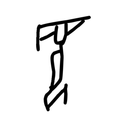

- source_zip_member: `Sub-character Images/r9cvuw9v1t/r9cvuw9v1t/703msrovjm.png`
- checksum_sha256: see `06_component-visual-index.csv`.
- review_status: `needs_human_visual_review`
- caution: source-marked review image only.

## asset-014539

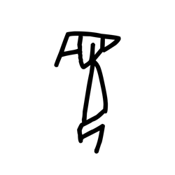

- source_zip_member: `Sub-character Images/r9cvuw9v1t/r9cvuw9v1t/7glshlwotn.png`
- checksum_sha256: see `06_component-visual-index.csv`.
- review_status: `needs_human_visual_review`
- caution: source-marked review image only.

## asset-014540

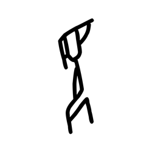

- source_zip_member: `Sub-character Images/r9cvuw9v1t/r9cvuw9v1t/9ca7tg89eb.png`
- checksum_sha256: see `06_component-visual-index.csv`.
- review_status: `needs_human_visual_review`
- caution: source-marked review image only.

## asset-014541

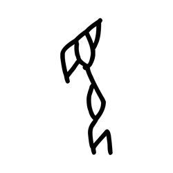

- source_zip_member: `Sub-character Images/r9cvuw9v1t/r9cvuw9v1t/9ds0kygw4f.png`
- checksum_sha256: see `06_component-visual-index.csv`.
- review_status: `needs_human_visual_review`
- caution: source-marked review image only.

## asset-014542

- source_zip_member: `Sub-character Images/r9cvuw9v1t/r9cvuw9v1t/afcjw6ypl5.png`
- checksum_sha256: see `06_component-visual-index.csv`.
- review_status: `needs_human_visual_review`
- caution: source-marked review image only.

## asset-014543

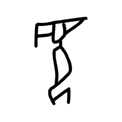

- source_zip_member: `Sub-character Images/r9cvuw9v1t/r9cvuw9v1t/aof9fbqxa8.png`
- checksum_sha256: see `06_component-visual-index.csv`.
- review_status: `needs_human_visual_review`
- caution: source-marked review image only.

## asset-014544

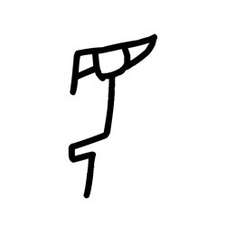

- source_zip_member: `Sub-character Images/r9cvuw9v1t/r9cvuw9v1t/asfqm1z8a2.png`
- checksum_sha256: see `06_component-visual-index.csv`.
- review_status: `needs_human_visual_review`
- caution: source-marked review image only.

## asset-014545

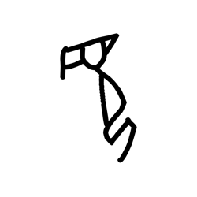

- source_zip_member: `Sub-character Images/r9cvuw9v1t/r9cvuw9v1t/at5fm43nxs.png`
- checksum_sha256: see `06_component-visual-index.csv`.
- review_status: `needs_human_visual_review`
- caution: source-marked review image only.

## asset-014546

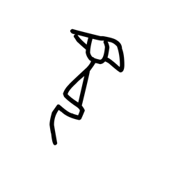

- source_zip_member: `Sub-character Images/r9cvuw9v1t/r9cvuw9v1t/b8kc995e74.png`
- checksum_sha256: see `06_component-visual-index.csv`.
- review_status: `needs_human_visual_review`
- caution: source-marked review image only.

## asset-014547

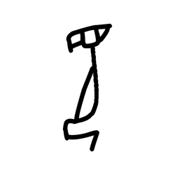

- source_zip_member: `Sub-character Images/r9cvuw9v1t/r9cvuw9v1t/bdpuwsh8lc.png`
- checksum_sha256: see `06_component-visual-index.csv`.
- review_status: `needs_human_visual_review`
- caution: source-marked review image only.

## asset-014548

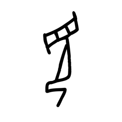

- source_zip_member: `Sub-character Images/r9cvuw9v1t/r9cvuw9v1t/df14rqkwy3.png`
- checksum_sha256: see `06_component-visual-index.csv`.
- review_status: `needs_human_visual_review`
- caution: source-marked review image only.

## asset-014549

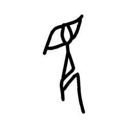

- source_zip_member: `Sub-character Images/r9cvuw9v1t/r9cvuw9v1t/dkzg11yq6z.png`
- checksum_sha256: see `06_component-visual-index.csv`.
- review_status: `needs_human_visual_review`
- caution: source-marked review image only.

## asset-014550

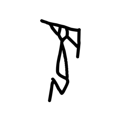

- source_zip_member: `Sub-character Images/r9cvuw9v1t/r9cvuw9v1t/e5ong7jjut.png`
- checksum_sha256: see `06_component-visual-index.csv`.
- review_status: `needs_human_visual_review`
- caution: source-marked review image only.

## asset-014551

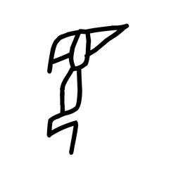

- source_zip_member: `Sub-character Images/r9cvuw9v1t/r9cvuw9v1t/e8euhym47v.png`
- checksum_sha256: see `06_component-visual-index.csv`.
- review_status: `needs_human_visual_review`
- caution: source-marked review image only.

## asset-014552

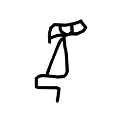

- source_zip_member: `Sub-character Images/r9cvuw9v1t/r9cvuw9v1t/ejj4sh46k6.png`
- checksum_sha256: see `06_component-visual-index.csv`.
- review_status: `needs_human_visual_review`
- caution: source-marked review image only.

## asset-014553

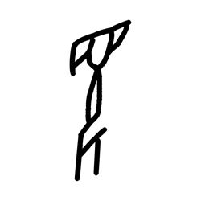

- source_zip_member: `Sub-character Images/r9cvuw9v1t/r9cvuw9v1t/f127kzu6cp.png`
- checksum_sha256: see `06_component-visual-index.csv`.
- review_status: `needs_human_visual_review`
- caution: source-marked review image only.

## asset-014554

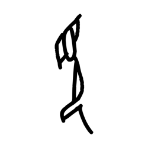

- source_zip_member: `Sub-character Images/r9cvuw9v1t/r9cvuw9v1t/f9kny4pwff.png`
- checksum_sha256: see `06_component-visual-index.csv`.
- review_status: `needs_human_visual_review`
- caution: source-marked review image only.

## asset-014555

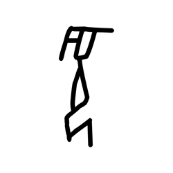

- source_zip_member: `Sub-character Images/r9cvuw9v1t/r9cvuw9v1t/fqpij85dr3.png`
- checksum_sha256: see `06_component-visual-index.csv`.
- review_status: `needs_human_visual_review`
- caution: source-marked review image only.

## asset-014556

- source_zip_member: `Sub-character Images/r9cvuw9v1t/r9cvuw9v1t/getamqco1d.png`
- checksum_sha256: see `06_component-visual-index.csv`.
- review_status: `needs_human_visual_review`
- caution: source-marked review image only.

## asset-014557

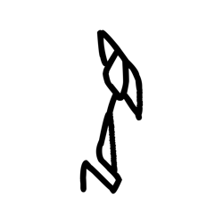

- source_zip_member: `Sub-character Images/r9cvuw9v1t/r9cvuw9v1t/giil2x56vf.png`
- checksum_sha256: see `06_component-visual-index.csv`.
- review_status: `needs_human_visual_review`
- caution: source-marked review image only.

## asset-014558

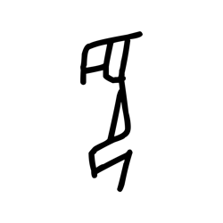

- source_zip_member: `Sub-character Images/r9cvuw9v1t/r9cvuw9v1t/go4pmsawa0.png`
- checksum_sha256: see `06_component-visual-index.csv`.
- review_status: `needs_human_visual_review`
- caution: source-marked review image only.

## asset-014559

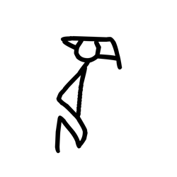

- source_zip_member: `Sub-character Images/r9cvuw9v1t/r9cvuw9v1t/gx0x79xoqa.png`
- checksum_sha256: see `06_component-visual-index.csv`.
- review_status: `needs_human_visual_review`
- caution: source-marked review image only.

## asset-014560

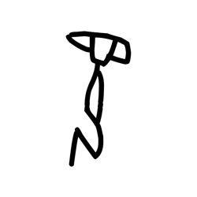

- source_zip_member: `Sub-character Images/r9cvuw9v1t/r9cvuw9v1t/h037n2av6s.png`
- checksum_sha256: see `06_component-visual-index.csv`.
- review_status: `needs_human_visual_review`
- caution: source-marked review image only.

## asset-014561

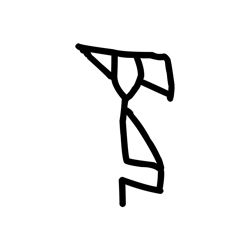

- source_zip_member: `Sub-character Images/r9cvuw9v1t/r9cvuw9v1t/kkzma0bwie.png`
- checksum_sha256: see `06_component-visual-index.csv`.
- review_status: `needs_human_visual_review`
- caution: source-marked review image only.

## asset-014562

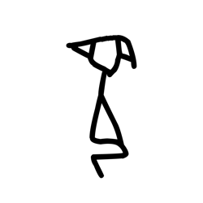

- source_zip_member: `Sub-character Images/r9cvuw9v1t/r9cvuw9v1t/klczuhi1r9.png`
- checksum_sha256: see `06_component-visual-index.csv`.
- review_status: `needs_human_visual_review`
- caution: source-marked review image only.

## asset-014563

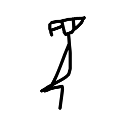

- source_zip_member: `Sub-character Images/r9cvuw9v1t/r9cvuw9v1t/kntbkgbf1i.png`
- checksum_sha256: see `06_component-visual-index.csv`.
- review_status: `needs_human_visual_review`
- caution: source-marked review image only.

## asset-014564

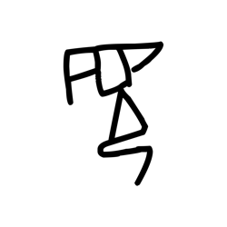

- source_zip_member: `Sub-character Images/r9cvuw9v1t/r9cvuw9v1t/krhr42st5x.png`
- checksum_sha256: see `06_component-visual-index.csv`.
- review_status: `needs_human_visual_review`
- caution: source-marked review image only.

## asset-014565

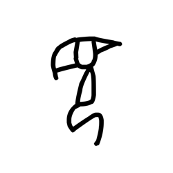

- source_zip_member: `Sub-character Images/r9cvuw9v1t/r9cvuw9v1t/oghluvjbx1.png`
- checksum_sha256: see `06_component-visual-index.csv`.
- review_status: `needs_human_visual_review`
- caution: source-marked review image only.

## asset-014566

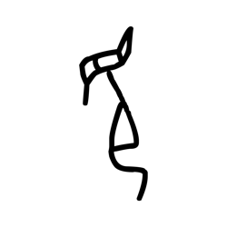

- source_zip_member: `Sub-character Images/r9cvuw9v1t/r9cvuw9v1t/ommc8d971w.png`
- checksum_sha256: see `06_component-visual-index.csv`.
- review_status: `needs_human_visual_review`
- caution: source-marked review image only.

## asset-014567

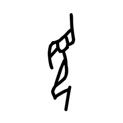

- source_zip_member: `Sub-character Images/r9cvuw9v1t/r9cvuw9v1t/ossimss4ol.png`
- checksum_sha256: see `06_component-visual-index.csv`.
- review_status: `needs_human_visual_review`
- caution: source-marked review image only.

## asset-014568

- source_zip_member: `Sub-character Images/r9cvuw9v1t/r9cvuw9v1t/plpkda3s5r.png`
- checksum_sha256: see `06_component-visual-index.csv`.
- review_status: `needs_human_visual_review`
- caution: source-marked review image only.

## asset-014569

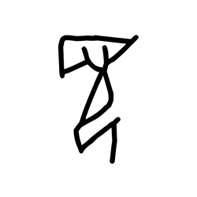

- source_zip_member: `Sub-character Images/r9cvuw9v1t/r9cvuw9v1t/ppxmt1m1lo.png`
- checksum_sha256: see `06_component-visual-index.csv`.
- review_status: `needs_human_visual_review`
- caution: source-marked review image only.

## asset-014570

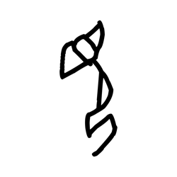

- source_zip_member: `Sub-character Images/r9cvuw9v1t/r9cvuw9v1t/qjou1yiz5v.png`
- checksum_sha256: see `06_component-visual-index.csv`.
- review_status: `needs_human_visual_review`
- caution: source-marked review image only.

## asset-014571

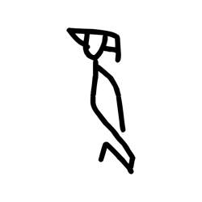

- source_zip_member: `Sub-character Images/r9cvuw9v1t/r9cvuw9v1t/qv26rmdohn.png`
- checksum_sha256: see `06_component-visual-index.csv`.
- review_status: `needs_human_visual_review`
- caution: source-marked review image only.

## asset-014572

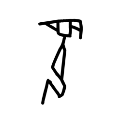

- source_zip_member: `Sub-character Images/r9cvuw9v1t/r9cvuw9v1t/r1cuhwrb4g.png`
- checksum_sha256: see `06_component-visual-index.csv`.
- review_status: `needs_human_visual_review`
- caution: source-marked review image only.

## asset-014573

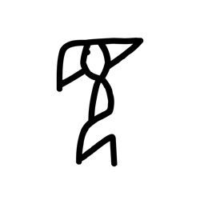

- source_zip_member: `Sub-character Images/r9cvuw9v1t/r9cvuw9v1t/r9cvuw9v1t.png`
- checksum_sha256: see `06_component-visual-index.csv`.
- review_status: `needs_human_visual_review`
- caution: source-marked review image only.

## asset-014574

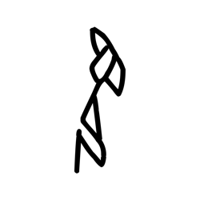

- source_zip_member: `Sub-character Images/r9cvuw9v1t/r9cvuw9v1t/rbtfw7vpmj.png`
- checksum_sha256: see `06_component-visual-index.csv`.
- review_status: `needs_human_visual_review`
- caution: source-marked review image only.

## asset-014575

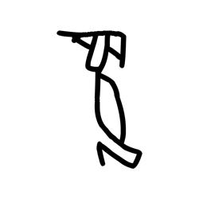

- source_zip_member: `Sub-character Images/r9cvuw9v1t/r9cvuw9v1t/rl0ay4tnxl.png`
- checksum_sha256: see `06_component-visual-index.csv`.
- review_status: `needs_human_visual_review`
- caution: source-marked review image only.

## asset-014576

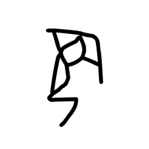

- source_zip_member: `Sub-character Images/r9cvuw9v1t/r9cvuw9v1t/spel9zjwvi.png`
- checksum_sha256: see `06_component-visual-index.csv`.
- review_status: `needs_human_visual_review`
- caution: source-marked review image only.

## asset-014577

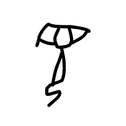

- source_zip_member: `Sub-character Images/r9cvuw9v1t/r9cvuw9v1t/ss22r7lpp8.png`
- checksum_sha256: see `06_component-visual-index.csv`.
- review_status: `needs_human_visual_review`
- caution: source-marked review image only.

## asset-014578

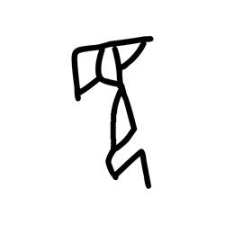

- source_zip_member: `Sub-character Images/r9cvuw9v1t/r9cvuw9v1t/syihujy2nn.png`
- checksum_sha256: see `06_component-visual-index.csv`.
- review_status: `needs_human_visual_review`
- caution: source-marked review image only.

## asset-014579

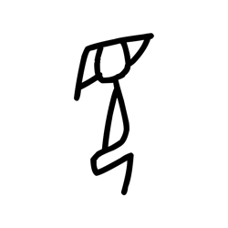

- source_zip_member: `Sub-character Images/r9cvuw9v1t/r9cvuw9v1t/tsusmq73l7.png`
- checksum_sha256: see `06_component-visual-index.csv`.
- review_status: `needs_human_visual_review`
- caution: source-marked review image only.

## asset-014580

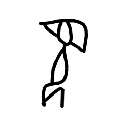

- source_zip_member: `Sub-character Images/r9cvuw9v1t/r9cvuw9v1t/ubgbklzhs5.png`
- checksum_sha256: see `06_component-visual-index.csv`.
- review_status: `needs_human_visual_review`
- caution: source-marked review image only.

## asset-014581

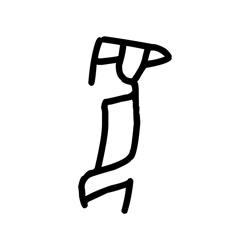

- source_zip_member: `Sub-character Images/r9cvuw9v1t/r9cvuw9v1t/ukmz17dd9t.png`
- checksum_sha256: see `06_component-visual-index.csv`.
- review_status: `needs_human_visual_review`
- caution: source-marked review image only.

## asset-014582

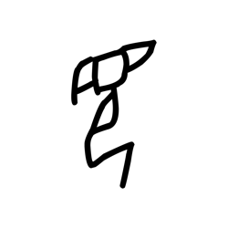

- source_zip_member: `Sub-character Images/r9cvuw9v1t/r9cvuw9v1t/v2znptsom7.png`
- checksum_sha256: see `06_component-visual-index.csv`.
- review_status: `needs_human_visual_review`
- caution: source-marked review image only.

## asset-014583

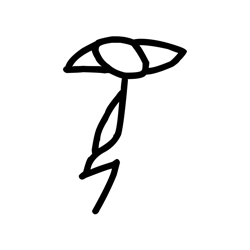

- source_zip_member: `Sub-character Images/r9cvuw9v1t/r9cvuw9v1t/wbtadn99ru.png`
- checksum_sha256: see `06_component-visual-index.csv`.
- review_status: `needs_human_visual_review`
- caution: source-marked review image only.

## asset-014584

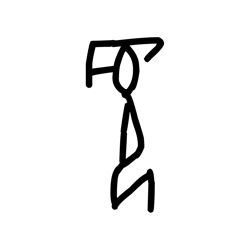

- source_zip_member: `Sub-character Images/r9cvuw9v1t/r9cvuw9v1t/wnjvuunm97.png`
- checksum_sha256: see `06_component-visual-index.csv`.
- review_status: `needs_human_visual_review`
- caution: source-marked review image only.

## asset-014585

- source_zip_member: `Sub-character Images/r9cvuw9v1t/r9cvuw9v1t/xpaneywcfs.png`
- checksum_sha256: see `06_component-visual-index.csv`.
- review_status: `needs_human_visual_review`
- caution: source-marked review image only.

## asset-014586

- source_zip_member: `Sub-character Images/r9cvuw9v1t/r9cvuw9v1t/xwk8aem83q.png`
- checksum_sha256: see `06_component-visual-index.csv`.
- review_status: `needs_human_visual_review`
- caution: source-marked review image only.

## asset-014587

- source_zip_member: `Sub-character Images/r9cvuw9v1t/r9cvuw9v1t/ysjhv1sn8j.png`
- checksum_sha256: see `06_component-visual-index.csv`.
- review_status: `needs_human_visual_review`
- caution: source-marked review image only.

## asset-014588

- source_zip_member: `Sub-character Images/r9cvuw9v1t/r9cvuw9v1t/yytsq4r6vx.png`
- checksum_sha256: see `06_component-visual-index.csv`.
- review_status: `needs_human_visual_review`
- caution: source-marked review image only.

## asset-014589

- source_zip_member: `Sub-character Images/r9cvuw9v1t/r9cvuw9v1t/zoddf729qo.png`
- checksum_sha256: see `06_component-visual-index.csv`.
- review_status: `needs_human_visual_review`
- caution: source-marked review image only.
