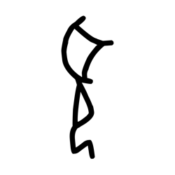

# Component Visual Gallery / 构件图像查看: obs-comp-cand-001071

English:
This page displays OBIMD subcharacter PNG assets extracted into this concrete corpus object directory for human review.

简体中文：
本页展示抽取到当前具体 corpus 对象目录内的 OBIMD subcharacter PNG 资料，供人工复核使用。

Boundary / 边界：dataset image candidate only; not a confirmed component form, component assignment, or decipherment claim.

## asset-014621

- source_zip_member: `Sub-character Images/a7fntjnau2/x3w07ykbbp/x3w07ykbbp.png`
- checksum_sha256: `f47e50a57b92bd5ea5ffd45b960589e81caf933b7dc664e168648868f1c36c0c`
- review_status: `needs_human_visual_review`
- caution: OBIMD subcharacter image is a source-marked review asset only; it is not a confirmed component form, component assignment, or decipherment conclusion.
