# Component Visual Gallery / 构件图像查看: obs-comp-cand-001076

English:
This page displays OBIMD subcharacter PNG assets extracted into this concrete
corpus object directory for human review.

简体中文：
本页展示抽取到当前具体 corpus 对象目录内的 OBIMD subcharacter PNG 资料，供人工复核使用。

Boundary / 边界：
dataset image candidate only; not a confirmed component form, not a component
assignment, and not a decipherment claim.
- not a confirmed component form
- not a component assignment
- not a decipherment claim

## Concrete Questions To Check / 具体待查问题

- Which local image should be opened first?
- 应先打开哪一张本地构件图像？
- Which source zip member anchors this image?
- 哪一个 source zip member 能定位这张图像？
- Which near-shape or variant comparison is still missing?
- 还缺哪些近形或异体比较？
- Which character or inscription context should be checked next?
- 下一步应核对哪些单字或卜辞上下文？
- What evidence is missing before a component assignment?
- 正式构件归属前还缺哪些证据？

## asset-014626

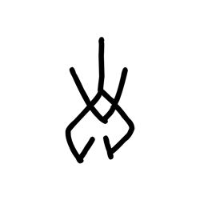

- source_zip_member: `Sub-character Images/0cwxw7rveh/0cwxw7rveh/02ne7wkfna.png`
- checksum_sha256: see `06_component-visual-index.csv`.
- review_status: `needs_human_visual_review`
- caution: source-marked review image only.

## asset-014627

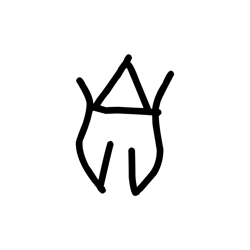

- source_zip_member: `Sub-character Images/0cwxw7rveh/0cwxw7rveh/07lf07519v.png`
- checksum_sha256: see `06_component-visual-index.csv`.
- review_status: `needs_human_visual_review`
- caution: source-marked review image only.

## asset-014628

- source_zip_member: `Sub-character Images/0cwxw7rveh/0cwxw7rveh/0cwxw7rveh.png`
- checksum_sha256: see `06_component-visual-index.csv`.
- review_status: `needs_human_visual_review`
- caution: source-marked review image only.

## asset-014629

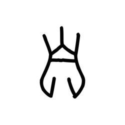

- source_zip_member: `Sub-character Images/0cwxw7rveh/0cwxw7rveh/0gwgtnx4n0.png`
- checksum_sha256: see `06_component-visual-index.csv`.
- review_status: `needs_human_visual_review`
- caution: source-marked review image only.

## asset-014630

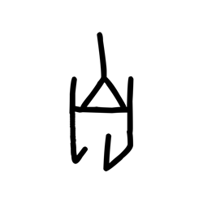

- source_zip_member: `Sub-character Images/0cwxw7rveh/0cwxw7rveh/0jgcq5zath.png`
- checksum_sha256: see `06_component-visual-index.csv`.
- review_status: `needs_human_visual_review`
- caution: source-marked review image only.

## asset-014631

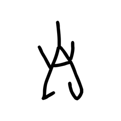

- source_zip_member: `Sub-character Images/0cwxw7rveh/0cwxw7rveh/0ubahz2wvs.png`
- checksum_sha256: see `06_component-visual-index.csv`.
- review_status: `needs_human_visual_review`
- caution: source-marked review image only.

## asset-014632

- source_zip_member: `Sub-character Images/0cwxw7rveh/0cwxw7rveh/0wt14ijdrl.png`
- checksum_sha256: see `06_component-visual-index.csv`.
- review_status: `needs_human_visual_review`
- caution: source-marked review image only.

## asset-014633

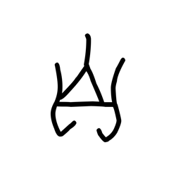

- source_zip_member: `Sub-character Images/0cwxw7rveh/0cwxw7rveh/0x7hijsodm.png`
- checksum_sha256: see `06_component-visual-index.csv`.
- review_status: `needs_human_visual_review`
- caution: source-marked review image only.

## asset-014634

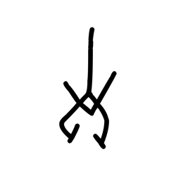

- source_zip_member: `Sub-character Images/0cwxw7rveh/0cwxw7rveh/15bchxjh21.png`
- checksum_sha256: see `06_component-visual-index.csv`.
- review_status: `needs_human_visual_review`
- caution: source-marked review image only.

## asset-014635

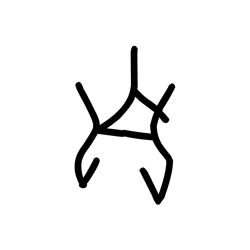

- source_zip_member: `Sub-character Images/0cwxw7rveh/0cwxw7rveh/1eepg6z2rl.png`
- checksum_sha256: see `06_component-visual-index.csv`.
- review_status: `needs_human_visual_review`
- caution: source-marked review image only.

## asset-014636

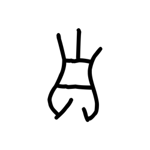

- source_zip_member: `Sub-character Images/0cwxw7rveh/0cwxw7rveh/1jetx9nx8m.png`
- checksum_sha256: see `06_component-visual-index.csv`.
- review_status: `needs_human_visual_review`
- caution: source-marked review image only.

## asset-014637

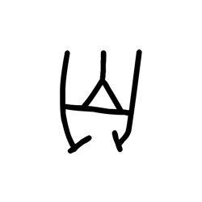

- source_zip_member: `Sub-character Images/0cwxw7rveh/0cwxw7rveh/1tnssu0azv.png`
- checksum_sha256: see `06_component-visual-index.csv`.
- review_status: `needs_human_visual_review`
- caution: source-marked review image only.

## asset-014638

- source_zip_member: `Sub-character Images/0cwxw7rveh/0cwxw7rveh/1xo7t3f0k3.png`
- checksum_sha256: see `06_component-visual-index.csv`.
- review_status: `needs_human_visual_review`
- caution: source-marked review image only.

## asset-014639

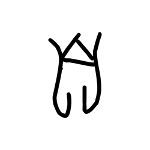

- source_zip_member: `Sub-character Images/0cwxw7rveh/0cwxw7rveh/2bkbrn40dk.png`
- checksum_sha256: see `06_component-visual-index.csv`.
- review_status: `needs_human_visual_review`
- caution: source-marked review image only.

## asset-014640

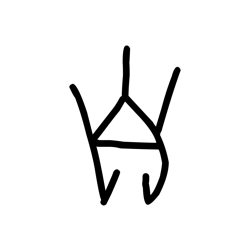

- source_zip_member: `Sub-character Images/0cwxw7rveh/0cwxw7rveh/2dv3wk11oy.png`
- checksum_sha256: see `06_component-visual-index.csv`.
- review_status: `needs_human_visual_review`
- caution: source-marked review image only.

## asset-014641

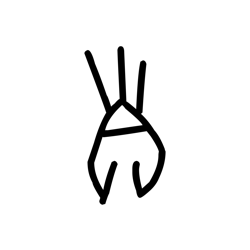

- source_zip_member: `Sub-character Images/0cwxw7rveh/0cwxw7rveh/2jjw0ypcc9.png`
- checksum_sha256: see `06_component-visual-index.csv`.
- review_status: `needs_human_visual_review`
- caution: source-marked review image only.

## asset-014642

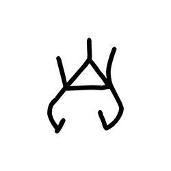

- source_zip_member: `Sub-character Images/0cwxw7rveh/0cwxw7rveh/2ko114rowd.png`
- checksum_sha256: see `06_component-visual-index.csv`.
- review_status: `needs_human_visual_review`
- caution: source-marked review image only.

## asset-014643

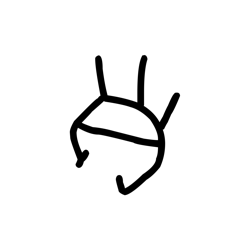

- source_zip_member: `Sub-character Images/0cwxw7rveh/0cwxw7rveh/2zwnc6cw56.png`
- checksum_sha256: see `06_component-visual-index.csv`.
- review_status: `needs_human_visual_review`
- caution: source-marked review image only.

## asset-014644

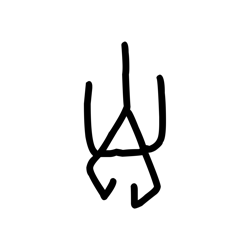

- source_zip_member: `Sub-character Images/0cwxw7rveh/0cwxw7rveh/37mdpkwypp.png`
- checksum_sha256: see `06_component-visual-index.csv`.
- review_status: `needs_human_visual_review`
- caution: source-marked review image only.

## asset-014645

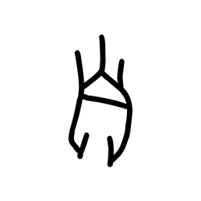

- source_zip_member: `Sub-character Images/0cwxw7rveh/0cwxw7rveh/3pse83su1j.png`
- checksum_sha256: see `06_component-visual-index.csv`.
- review_status: `needs_human_visual_review`
- caution: source-marked review image only.

## asset-014646

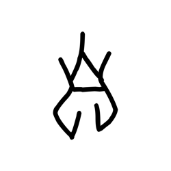

- source_zip_member: `Sub-character Images/0cwxw7rveh/0cwxw7rveh/3sff3sqn9t.png`
- checksum_sha256: see `06_component-visual-index.csv`.
- review_status: `needs_human_visual_review`
- caution: source-marked review image only.

## asset-014647

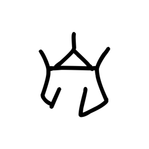

- source_zip_member: `Sub-character Images/0cwxw7rveh/0cwxw7rveh/42n8mtfnre.png`
- checksum_sha256: see `06_component-visual-index.csv`.
- review_status: `needs_human_visual_review`
- caution: source-marked review image only.

## asset-014648

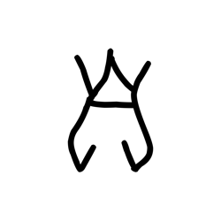

- source_zip_member: `Sub-character Images/0cwxw7rveh/0cwxw7rveh/4fp8nr4kfc.png`
- checksum_sha256: see `06_component-visual-index.csv`.
- review_status: `needs_human_visual_review`
- caution: source-marked review image only.

## asset-014649

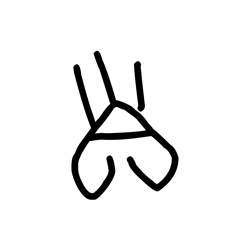

- source_zip_member: `Sub-character Images/0cwxw7rveh/0cwxw7rveh/4j5a6b5ppx.png`
- checksum_sha256: see `06_component-visual-index.csv`.
- review_status: `needs_human_visual_review`
- caution: source-marked review image only.

## asset-014650

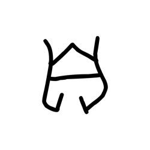

- source_zip_member: `Sub-character Images/0cwxw7rveh/0cwxw7rveh/4l4wzg477e.png`
- checksum_sha256: see `06_component-visual-index.csv`.
- review_status: `needs_human_visual_review`
- caution: source-marked review image only.

## asset-014651

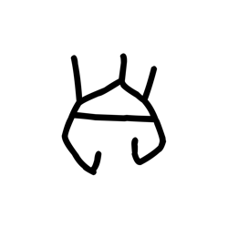

- source_zip_member: `Sub-character Images/0cwxw7rveh/0cwxw7rveh/4oedr7rvmg.png`
- checksum_sha256: see `06_component-visual-index.csv`.
- review_status: `needs_human_visual_review`
- caution: source-marked review image only.

## asset-014652

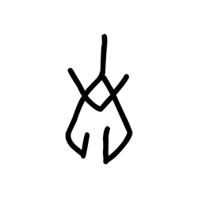

- source_zip_member: `Sub-character Images/0cwxw7rveh/0cwxw7rveh/5h60ki99ga.png`
- checksum_sha256: see `06_component-visual-index.csv`.
- review_status: `needs_human_visual_review`
- caution: source-marked review image only.

## asset-014653

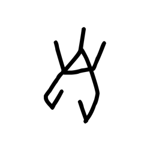

- source_zip_member: `Sub-character Images/0cwxw7rveh/0cwxw7rveh/5mpl9bxevf.png`
- checksum_sha256: see `06_component-visual-index.csv`.
- review_status: `needs_human_visual_review`
- caution: source-marked review image only.

## asset-014654

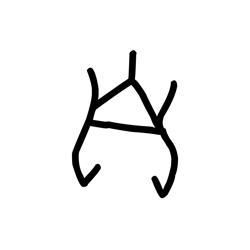

- source_zip_member: `Sub-character Images/0cwxw7rveh/0cwxw7rveh/5s0yio3y3d.png`
- checksum_sha256: see `06_component-visual-index.csv`.
- review_status: `needs_human_visual_review`
- caution: source-marked review image only.

## asset-014655

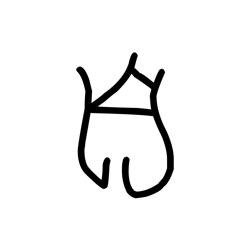

- source_zip_member: `Sub-character Images/0cwxw7rveh/0cwxw7rveh/62do911hbl.png`
- checksum_sha256: see `06_component-visual-index.csv`.
- review_status: `needs_human_visual_review`
- caution: source-marked review image only.

## asset-014656

- source_zip_member: `Sub-character Images/0cwxw7rveh/0cwxw7rveh/639zzcnns4.png`
- checksum_sha256: see `06_component-visual-index.csv`.
- review_status: `needs_human_visual_review`
- caution: source-marked review image only.

## asset-014657

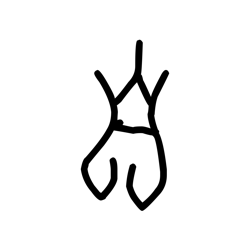

- source_zip_member: `Sub-character Images/0cwxw7rveh/0cwxw7rveh/69aeukl7ez.png`
- checksum_sha256: see `06_component-visual-index.csv`.
- review_status: `needs_human_visual_review`
- caution: source-marked review image only.

## asset-014658

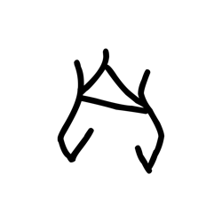

- source_zip_member: `Sub-character Images/0cwxw7rveh/0cwxw7rveh/6dr28vqqbb.png`
- checksum_sha256: see `06_component-visual-index.csv`.
- review_status: `needs_human_visual_review`
- caution: source-marked review image only.

## asset-014659

- source_zip_member: `Sub-character Images/0cwxw7rveh/0cwxw7rveh/6yh8dihr02.png`
- checksum_sha256: see `06_component-visual-index.csv`.
- review_status: `needs_human_visual_review`
- caution: source-marked review image only.

## asset-014660

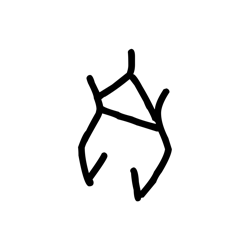

- source_zip_member: `Sub-character Images/0cwxw7rveh/0cwxw7rveh/6z8fkcuqrm.png`
- checksum_sha256: see `06_component-visual-index.csv`.
- review_status: `needs_human_visual_review`
- caution: source-marked review image only.

## asset-014661

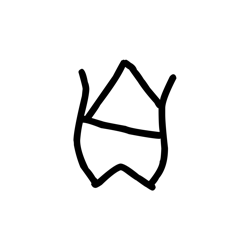

- source_zip_member: `Sub-character Images/0cwxw7rveh/0cwxw7rveh/7fylr9onlo.png`
- checksum_sha256: see `06_component-visual-index.csv`.
- review_status: `needs_human_visual_review`
- caution: source-marked review image only.

## asset-014662

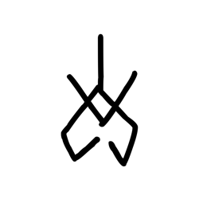

- source_zip_member: `Sub-character Images/0cwxw7rveh/0cwxw7rveh/7sz4ltklfc.png`
- checksum_sha256: see `06_component-visual-index.csv`.
- review_status: `needs_human_visual_review`
- caution: source-marked review image only.

## asset-014663

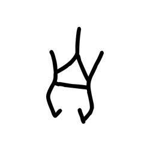

- source_zip_member: `Sub-character Images/0cwxw7rveh/0cwxw7rveh/87zizgu7ac.png`
- checksum_sha256: see `06_component-visual-index.csv`.
- review_status: `needs_human_visual_review`
- caution: source-marked review image only.

## asset-014664

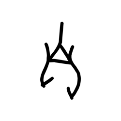

- source_zip_member: `Sub-character Images/0cwxw7rveh/0cwxw7rveh/8904pq7z2s.png`
- checksum_sha256: see `06_component-visual-index.csv`.
- review_status: `needs_human_visual_review`
- caution: source-marked review image only.

## asset-014665

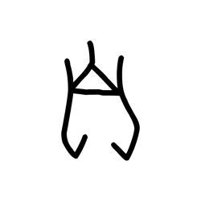

- source_zip_member: `Sub-character Images/0cwxw7rveh/0cwxw7rveh/8bwlalm53d.png`
- checksum_sha256: see `06_component-visual-index.csv`.
- review_status: `needs_human_visual_review`
- caution: source-marked review image only.

## asset-014666

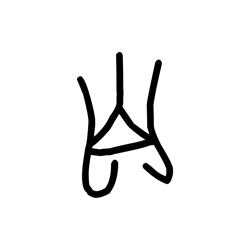

- source_zip_member: `Sub-character Images/0cwxw7rveh/0cwxw7rveh/8d0nw82yrv.png`
- checksum_sha256: see `06_component-visual-index.csv`.
- review_status: `needs_human_visual_review`
- caution: source-marked review image only.

## asset-014667

- source_zip_member: `Sub-character Images/0cwxw7rveh/0cwxw7rveh/8i7z3t2r81.png`
- checksum_sha256: see `06_component-visual-index.csv`.
- review_status: `needs_human_visual_review`
- caution: source-marked review image only.

## asset-014668

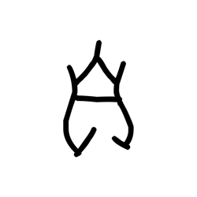

- source_zip_member: `Sub-character Images/0cwxw7rveh/0cwxw7rveh/8n9qkd8x6k.png`
- checksum_sha256: see `06_component-visual-index.csv`.
- review_status: `needs_human_visual_review`
- caution: source-marked review image only.

## asset-014669

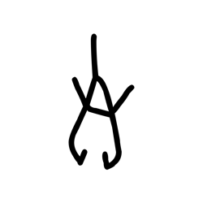

- source_zip_member: `Sub-character Images/0cwxw7rveh/0cwxw7rveh/8yynarc86a.png`
- checksum_sha256: see `06_component-visual-index.csv`.
- review_status: `needs_human_visual_review`
- caution: source-marked review image only.

## asset-014670

- source_zip_member: `Sub-character Images/0cwxw7rveh/0cwxw7rveh/8yzbth8gng.png`
- checksum_sha256: see `06_component-visual-index.csv`.
- review_status: `needs_human_visual_review`
- caution: source-marked review image only.

## asset-014671

- source_zip_member: `Sub-character Images/0cwxw7rveh/0cwxw7rveh/90ue1x8en1.png`
- checksum_sha256: see `06_component-visual-index.csv`.
- review_status: `needs_human_visual_review`
- caution: source-marked review image only.

## asset-014672

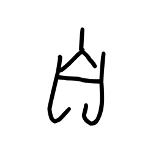

- source_zip_member: `Sub-character Images/0cwxw7rveh/0cwxw7rveh/96w4ykawa0.png`
- checksum_sha256: see `06_component-visual-index.csv`.
- review_status: `needs_human_visual_review`
- caution: source-marked review image only.

## asset-014673

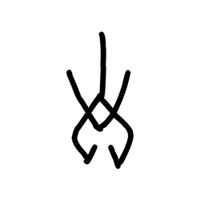

- source_zip_member: `Sub-character Images/0cwxw7rveh/0cwxw7rveh/98ftk5enlt.png`
- checksum_sha256: see `06_component-visual-index.csv`.
- review_status: `needs_human_visual_review`
- caution: source-marked review image only.

## asset-014674

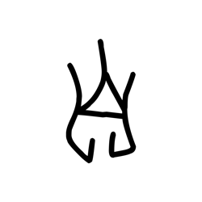

- source_zip_member: `Sub-character Images/0cwxw7rveh/0cwxw7rveh/98pj4u65md.png`
- checksum_sha256: see `06_component-visual-index.csv`.
- review_status: `needs_human_visual_review`
- caution: source-marked review image only.

## asset-014675

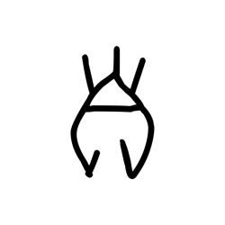

- source_zip_member: `Sub-character Images/0cwxw7rveh/0cwxw7rveh/9g0yufb6d0.png`
- checksum_sha256: see `06_component-visual-index.csv`.
- review_status: `needs_human_visual_review`
- caution: source-marked review image only.

## asset-014676

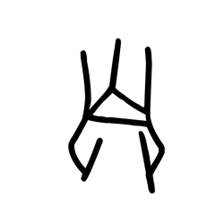

- source_zip_member: `Sub-character Images/0cwxw7rveh/0cwxw7rveh/ab4bczdu6a.png`
- checksum_sha256: see `06_component-visual-index.csv`.
- review_status: `needs_human_visual_review`
- caution: source-marked review image only.

## asset-014677

- source_zip_member: `Sub-character Images/0cwxw7rveh/0cwxw7rveh/agxta7nkef.png`
- checksum_sha256: see `06_component-visual-index.csv`.
- review_status: `needs_human_visual_review`
- caution: source-marked review image only.

## asset-014678

- source_zip_member: `Sub-character Images/0cwxw7rveh/0cwxw7rveh/an3ezxb0ei.png`
- checksum_sha256: see `06_component-visual-index.csv`.
- review_status: `needs_human_visual_review`
- caution: source-marked review image only.

## asset-014679

- source_zip_member: `Sub-character Images/0cwxw7rveh/0cwxw7rveh/b1u278ixqj.png`
- checksum_sha256: see `06_component-visual-index.csv`.
- review_status: `needs_human_visual_review`
- caution: source-marked review image only.

## asset-014680

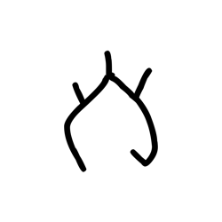

- source_zip_member: `Sub-character Images/0cwxw7rveh/0cwxw7rveh/b4ouxodo8a.png`
- checksum_sha256: see `06_component-visual-index.csv`.
- review_status: `needs_human_visual_review`
- caution: source-marked review image only.

## asset-014681

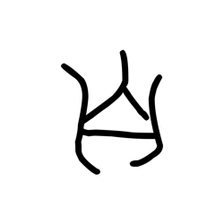

- source_zip_member: `Sub-character Images/0cwxw7rveh/0cwxw7rveh/bltmxukcbn.png`
- checksum_sha256: see `06_component-visual-index.csv`.
- review_status: `needs_human_visual_review`
- caution: source-marked review image only.

## asset-014682

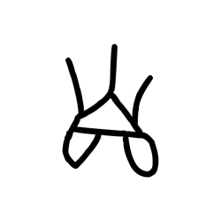

- source_zip_member: `Sub-character Images/0cwxw7rveh/0cwxw7rveh/buzakyzuhr.png`
- checksum_sha256: see `06_component-visual-index.csv`.
- review_status: `needs_human_visual_review`
- caution: source-marked review image only.

## asset-014683

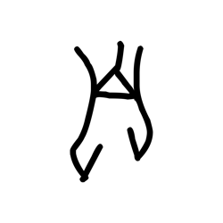

- source_zip_member: `Sub-character Images/0cwxw7rveh/0cwxw7rveh/bz05g6yx95.png`
- checksum_sha256: see `06_component-visual-index.csv`.
- review_status: `needs_human_visual_review`
- caution: source-marked review image only.

## asset-014684

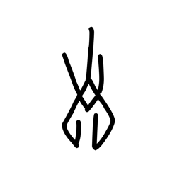

- source_zip_member: `Sub-character Images/0cwxw7rveh/0cwxw7rveh/cd1r55mqvw.png`
- checksum_sha256: see `06_component-visual-index.csv`.
- review_status: `needs_human_visual_review`
- caution: source-marked review image only.

## asset-014685

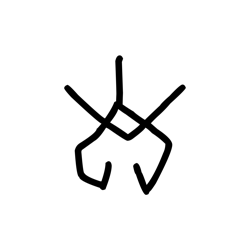

- source_zip_member: `Sub-character Images/0cwxw7rveh/0cwxw7rveh/cker2g9vm6.png`
- checksum_sha256: see `06_component-visual-index.csv`.
- review_status: `needs_human_visual_review`
- caution: source-marked review image only.

## asset-014686

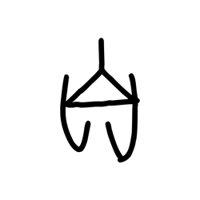

- source_zip_member: `Sub-character Images/0cwxw7rveh/0cwxw7rveh/cskuvl3hb0.png`
- checksum_sha256: see `06_component-visual-index.csv`.
- review_status: `needs_human_visual_review`
- caution: source-marked review image only.

## asset-014687

- source_zip_member: `Sub-character Images/0cwxw7rveh/0cwxw7rveh/d4nrdxoh9x.png`
- checksum_sha256: see `06_component-visual-index.csv`.
- review_status: `needs_human_visual_review`
- caution: source-marked review image only.

## asset-014688

- source_zip_member: `Sub-character Images/0cwxw7rveh/0cwxw7rveh/dazcvokqyl.png`
- checksum_sha256: see `06_component-visual-index.csv`.
- review_status: `needs_human_visual_review`
- caution: source-marked review image only.

## asset-014689

- source_zip_member: `Sub-character Images/0cwxw7rveh/0cwxw7rveh/dnk7lgh50c.png`
- checksum_sha256: see `06_component-visual-index.csv`.
- review_status: `needs_human_visual_review`
- caution: source-marked review image only.

## asset-014690

- source_zip_member: `Sub-character Images/0cwxw7rveh/0cwxw7rveh/dpxmompwo3.png`
- checksum_sha256: see `06_component-visual-index.csv`.
- review_status: `needs_human_visual_review`
- caution: source-marked review image only.

## asset-014691

- source_zip_member: `Sub-character Images/0cwxw7rveh/0cwxw7rveh/dugx0jvvm0.png`
- checksum_sha256: see `06_component-visual-index.csv`.
- review_status: `needs_human_visual_review`
- caution: source-marked review image only.

## asset-014692

- source_zip_member: `Sub-character Images/0cwxw7rveh/0cwxw7rveh/dx8jgj6o2v.png`
- checksum_sha256: see `06_component-visual-index.csv`.
- review_status: `needs_human_visual_review`
- caution: source-marked review image only.

## asset-014693

- source_zip_member: `Sub-character Images/0cwxw7rveh/0cwxw7rveh/dy8idkkmrv.png`
- checksum_sha256: see `06_component-visual-index.csv`.
- review_status: `needs_human_visual_review`
- caution: source-marked review image only.

## asset-014694

- source_zip_member: `Sub-character Images/0cwxw7rveh/0cwxw7rveh/eg9f7y522w.png`
- checksum_sha256: see `06_component-visual-index.csv`.
- review_status: `needs_human_visual_review`
- caution: source-marked review image only.

## asset-014695

- source_zip_member: `Sub-character Images/0cwxw7rveh/0cwxw7rveh/enf1v6rpf8.png`
- checksum_sha256: see `06_component-visual-index.csv`.
- review_status: `needs_human_visual_review`
- caution: source-marked review image only.

## asset-014696

- source_zip_member: `Sub-character Images/0cwxw7rveh/0cwxw7rveh/ewrzs2ak34.png`
- checksum_sha256: see `06_component-visual-index.csv`.
- review_status: `needs_human_visual_review`
- caution: source-marked review image only.

## asset-014697

- source_zip_member: `Sub-character Images/0cwxw7rveh/0cwxw7rveh/f2sjgpsk5f.png`
- checksum_sha256: see `06_component-visual-index.csv`.
- review_status: `needs_human_visual_review`
- caution: source-marked review image only.

## asset-014698

- source_zip_member: `Sub-character Images/0cwxw7rveh/0cwxw7rveh/f7vqw22mpl.png`
- checksum_sha256: see `06_component-visual-index.csv`.
- review_status: `needs_human_visual_review`
- caution: source-marked review image only.

## asset-014699

- source_zip_member: `Sub-character Images/0cwxw7rveh/0cwxw7rveh/fbcy4nakxq.png`
- checksum_sha256: see `06_component-visual-index.csv`.
- review_status: `needs_human_visual_review`
- caution: source-marked review image only.

## asset-014700

- source_zip_member: `Sub-character Images/0cwxw7rveh/0cwxw7rveh/fuk8jaqyaa.png`
- checksum_sha256: see `06_component-visual-index.csv`.
- review_status: `needs_human_visual_review`
- caution: source-marked review image only.

## asset-014701

- source_zip_member: `Sub-character Images/0cwxw7rveh/0cwxw7rveh/g46jk3dlko.png`
- checksum_sha256: see `06_component-visual-index.csv`.
- review_status: `needs_human_visual_review`
- caution: source-marked review image only.

## asset-014702

- source_zip_member: `Sub-character Images/0cwxw7rveh/0cwxw7rveh/gmmtnlptkc.png`
- checksum_sha256: see `06_component-visual-index.csv`.
- review_status: `needs_human_visual_review`
- caution: source-marked review image only.

## asset-014703

- source_zip_member: `Sub-character Images/0cwxw7rveh/0cwxw7rveh/gs7gikrs70.png`
- checksum_sha256: see `06_component-visual-index.csv`.
- review_status: `needs_human_visual_review`
- caution: source-marked review image only.

## asset-014704

- source_zip_member: `Sub-character Images/0cwxw7rveh/0cwxw7rveh/gw1g3ktb8e.png`
- checksum_sha256: see `06_component-visual-index.csv`.
- review_status: `needs_human_visual_review`
- caution: source-marked review image only.

## asset-014705

- source_zip_member: `Sub-character Images/0cwxw7rveh/0cwxw7rveh/h4xjrsgyet.png`
- checksum_sha256: see `06_component-visual-index.csv`.
- review_status: `needs_human_visual_review`
- caution: source-marked review image only.

## asset-014706

- source_zip_member: `Sub-character Images/0cwxw7rveh/0cwxw7rveh/h67y5uhnhd.png`
- checksum_sha256: see `06_component-visual-index.csv`.
- review_status: `needs_human_visual_review`
- caution: source-marked review image only.

## asset-014707

- source_zip_member: `Sub-character Images/0cwxw7rveh/0cwxw7rveh/hxz94wjszk.png`
- checksum_sha256: see `06_component-visual-index.csv`.
- review_status: `needs_human_visual_review`
- caution: source-marked review image only.

## asset-014708

- source_zip_member: `Sub-character Images/0cwxw7rveh/0cwxw7rveh/i1qpbx5q2t.png`
- checksum_sha256: see `06_component-visual-index.csv`.
- review_status: `needs_human_visual_review`
- caution: source-marked review image only.

## asset-014709

- source_zip_member: `Sub-character Images/0cwxw7rveh/0cwxw7rveh/i1yi9qfsm1.png`
- checksum_sha256: see `06_component-visual-index.csv`.
- review_status: `needs_human_visual_review`
- caution: source-marked review image only.

## asset-014710

- source_zip_member: `Sub-character Images/0cwxw7rveh/0cwxw7rveh/i245un3wdn.png`
- checksum_sha256: see `06_component-visual-index.csv`.
- review_status: `needs_human_visual_review`
- caution: source-marked review image only.

## asset-014711

- source_zip_member: `Sub-character Images/0cwxw7rveh/0cwxw7rveh/i36sb49fpj.png`
- checksum_sha256: see `06_component-visual-index.csv`.
- review_status: `needs_human_visual_review`
- caution: source-marked review image only.

## asset-014712

- source_zip_member: `Sub-character Images/0cwxw7rveh/0cwxw7rveh/izla3vnpyy.png`
- checksum_sha256: see `06_component-visual-index.csv`.
- review_status: `needs_human_visual_review`
- caution: source-marked review image only.

## asset-014713

- source_zip_member: `Sub-character Images/0cwxw7rveh/0cwxw7rveh/j2go6l4tg0.png`
- checksum_sha256: see `06_component-visual-index.csv`.
- review_status: `needs_human_visual_review`
- caution: source-marked review image only.

## asset-014714

- source_zip_member: `Sub-character Images/0cwxw7rveh/0cwxw7rveh/j6bpnfqxj4.png`
- checksum_sha256: see `06_component-visual-index.csv`.
- review_status: `needs_human_visual_review`
- caution: source-marked review image only.

## asset-014715

- source_zip_member: `Sub-character Images/0cwxw7rveh/0cwxw7rveh/j72rbs4wlr.png`
- checksum_sha256: see `06_component-visual-index.csv`.
- review_status: `needs_human_visual_review`
- caution: source-marked review image only.

## asset-014716

- source_zip_member: `Sub-character Images/0cwxw7rveh/0cwxw7rveh/j9x825emi7.png`
- checksum_sha256: see `06_component-visual-index.csv`.
- review_status: `needs_human_visual_review`
- caution: source-marked review image only.

## asset-014717

- source_zip_member: `Sub-character Images/0cwxw7rveh/0cwxw7rveh/jtjykzsct2.png`
- checksum_sha256: see `06_component-visual-index.csv`.
- review_status: `needs_human_visual_review`
- caution: source-marked review image only.

## asset-014718

- source_zip_member: `Sub-character Images/0cwxw7rveh/0cwxw7rveh/jvdr83v4k8.png`
- checksum_sha256: see `06_component-visual-index.csv`.
- review_status: `needs_human_visual_review`
- caution: source-marked review image only.

## asset-014719

- source_zip_member: `Sub-character Images/0cwxw7rveh/0cwxw7rveh/k95vprclqi.png`
- checksum_sha256: see `06_component-visual-index.csv`.
- review_status: `needs_human_visual_review`
- caution: source-marked review image only.

## asset-014720

- source_zip_member: `Sub-character Images/0cwxw7rveh/0cwxw7rveh/kedxa63tza.png`
- checksum_sha256: see `06_component-visual-index.csv`.
- review_status: `needs_human_visual_review`
- caution: source-marked review image only.

## asset-014721

- source_zip_member: `Sub-character Images/0cwxw7rveh/0cwxw7rveh/kuetdpqqnn.png`
- checksum_sha256: see `06_component-visual-index.csv`.
- review_status: `needs_human_visual_review`
- caution: source-marked review image only.

## asset-014722

- source_zip_member: `Sub-character Images/0cwxw7rveh/0cwxw7rveh/kulqezeegj.png`
- checksum_sha256: see `06_component-visual-index.csv`.
- review_status: `needs_human_visual_review`
- caution: source-marked review image only.

## asset-014723

- source_zip_member: `Sub-character Images/0cwxw7rveh/0cwxw7rveh/lpummsxiir.png`
- checksum_sha256: see `06_component-visual-index.csv`.
- review_status: `needs_human_visual_review`
- caution: source-marked review image only.

## asset-014724

- source_zip_member: `Sub-character Images/0cwxw7rveh/0cwxw7rveh/m7a35hf9qe.png`
- checksum_sha256: see `06_component-visual-index.csv`.
- review_status: `needs_human_visual_review`
- caution: source-marked review image only.

## asset-014725

- source_zip_member: `Sub-character Images/0cwxw7rveh/0cwxw7rveh/mncnjytnws.png`
- checksum_sha256: see `06_component-visual-index.csv`.
- review_status: `needs_human_visual_review`
- caution: source-marked review image only.

## asset-014726

- source_zip_member: `Sub-character Images/0cwxw7rveh/0cwxw7rveh/ms4ayiznll.png`
- checksum_sha256: see `06_component-visual-index.csv`.
- review_status: `needs_human_visual_review`
- caution: source-marked review image only.

## asset-014727

- source_zip_member: `Sub-character Images/0cwxw7rveh/0cwxw7rveh/mw49zatjou.png`
- checksum_sha256: see `06_component-visual-index.csv`.
- review_status: `needs_human_visual_review`
- caution: source-marked review image only.

## asset-014728

- source_zip_member: `Sub-character Images/0cwxw7rveh/0cwxw7rveh/mydfs37cvg.png`
- checksum_sha256: see `06_component-visual-index.csv`.
- review_status: `needs_human_visual_review`
- caution: source-marked review image only.

## asset-014729

- source_zip_member: `Sub-character Images/0cwxw7rveh/0cwxw7rveh/n89wuqejug.png`
- checksum_sha256: see `06_component-visual-index.csv`.
- review_status: `needs_human_visual_review`
- caution: source-marked review image only.

## asset-014730

- source_zip_member: `Sub-character Images/0cwxw7rveh/0cwxw7rveh/o2w2mpedlo.png`
- checksum_sha256: see `06_component-visual-index.csv`.
- review_status: `needs_human_visual_review`
- caution: source-marked review image only.

## asset-014731

- source_zip_member: `Sub-character Images/0cwxw7rveh/0cwxw7rveh/oab171dywf.png`
- checksum_sha256: see `06_component-visual-index.csv`.
- review_status: `needs_human_visual_review`
- caution: source-marked review image only.

## asset-014732

- source_zip_member: `Sub-character Images/0cwxw7rveh/0cwxw7rveh/ofcrmrajue.png`
- checksum_sha256: see `06_component-visual-index.csv`.
- review_status: `needs_human_visual_review`
- caution: source-marked review image only.

## asset-014733

- source_zip_member: `Sub-character Images/0cwxw7rveh/0cwxw7rveh/ota39wwfwg.png`
- checksum_sha256: see `06_component-visual-index.csv`.
- review_status: `needs_human_visual_review`
- caution: source-marked review image only.

## asset-014734

- source_zip_member: `Sub-character Images/0cwxw7rveh/0cwxw7rveh/p4jsvmj416.png`
- checksum_sha256: see `06_component-visual-index.csv`.
- review_status: `needs_human_visual_review`
- caution: source-marked review image only.

## asset-014735

- source_zip_member: `Sub-character Images/0cwxw7rveh/0cwxw7rveh/p6jyvqe8u1.png`
- checksum_sha256: see `06_component-visual-index.csv`.
- review_status: `needs_human_visual_review`
- caution: source-marked review image only.

## asset-014736

- source_zip_member: `Sub-character Images/0cwxw7rveh/0cwxw7rveh/pb1sqd22ws.png`
- checksum_sha256: see `06_component-visual-index.csv`.
- review_status: `needs_human_visual_review`
- caution: source-marked review image only.

## asset-014737

- source_zip_member: `Sub-character Images/0cwxw7rveh/0cwxw7rveh/pfrcxyj38n.png`
- checksum_sha256: see `06_component-visual-index.csv`.
- review_status: `needs_human_visual_review`
- caution: source-marked review image only.

## asset-014738

- source_zip_member: `Sub-character Images/0cwxw7rveh/0cwxw7rveh/pwenuhzn2w.png`
- checksum_sha256: see `06_component-visual-index.csv`.
- review_status: `needs_human_visual_review`
- caution: source-marked review image only.

## asset-014739

- source_zip_member: `Sub-character Images/0cwxw7rveh/0cwxw7rveh/q5m2nsseyh.png`
- checksum_sha256: see `06_component-visual-index.csv`.
- review_status: `needs_human_visual_review`
- caution: source-marked review image only.

## asset-014740

- source_zip_member: `Sub-character Images/0cwxw7rveh/0cwxw7rveh/qlxjra170r.png`
- checksum_sha256: see `06_component-visual-index.csv`.
- review_status: `needs_human_visual_review`
- caution: source-marked review image only.

## asset-014741

- source_zip_member: `Sub-character Images/0cwxw7rveh/0cwxw7rveh/qoi8srvz4s.png`
- checksum_sha256: see `06_component-visual-index.csv`.
- review_status: `needs_human_visual_review`
- caution: source-marked review image only.

## asset-014742

- source_zip_member: `Sub-character Images/0cwxw7rveh/0cwxw7rveh/qvdtipk987.png`
- checksum_sha256: see `06_component-visual-index.csv`.
- review_status: `needs_human_visual_review`
- caution: source-marked review image only.

## asset-014743

- source_zip_member: `Sub-character Images/0cwxw7rveh/0cwxw7rveh/qzelbzcq07.png`
- checksum_sha256: see `06_component-visual-index.csv`.
- review_status: `needs_human_visual_review`
- caution: source-marked review image only.

## asset-014744

- source_zip_member: `Sub-character Images/0cwxw7rveh/0cwxw7rveh/r369x0vkfr.png`
- checksum_sha256: see `06_component-visual-index.csv`.
- review_status: `needs_human_visual_review`
- caution: source-marked review image only.

## asset-014745

- source_zip_member: `Sub-character Images/0cwxw7rveh/0cwxw7rveh/s6jsot84vy.png`
- checksum_sha256: see `06_component-visual-index.csv`.
- review_status: `needs_human_visual_review`
- caution: source-marked review image only.

## asset-014746

- source_zip_member: `Sub-character Images/0cwxw7rveh/0cwxw7rveh/sugii325wu.png`
- checksum_sha256: see `06_component-visual-index.csv`.
- review_status: `needs_human_visual_review`
- caution: source-marked review image only.

## asset-014747

- source_zip_member: `Sub-character Images/0cwxw7rveh/0cwxw7rveh/swfiiirey8.png`
- checksum_sha256: see `06_component-visual-index.csv`.
- review_status: `needs_human_visual_review`
- caution: source-marked review image only.

## asset-014748

- source_zip_member: `Sub-character Images/0cwxw7rveh/0cwxw7rveh/t1504qvf2m.png`
- checksum_sha256: see `06_component-visual-index.csv`.
- review_status: `needs_human_visual_review`
- caution: source-marked review image only.

## asset-014749

- source_zip_member: `Sub-character Images/0cwxw7rveh/0cwxw7rveh/tjdvtpw1zl.png`
- checksum_sha256: see `06_component-visual-index.csv`.
- review_status: `needs_human_visual_review`
- caution: source-marked review image only.

## asset-014750

- source_zip_member: `Sub-character Images/0cwxw7rveh/0cwxw7rveh/tt6bqw9q9h.png`
- checksum_sha256: see `06_component-visual-index.csv`.
- review_status: `needs_human_visual_review`
- caution: source-marked review image only.

## asset-014751

- source_zip_member: `Sub-character Images/0cwxw7rveh/0cwxw7rveh/u0f3qene6y.png`
- checksum_sha256: see `06_component-visual-index.csv`.
- review_status: `needs_human_visual_review`
- caution: source-marked review image only.

## asset-014752

- source_zip_member: `Sub-character Images/0cwxw7rveh/0cwxw7rveh/ul0xyz0gjd.png`
- checksum_sha256: see `06_component-visual-index.csv`.
- review_status: `needs_human_visual_review`
- caution: source-marked review image only.

## asset-014753

- source_zip_member: `Sub-character Images/0cwxw7rveh/0cwxw7rveh/uojd47661j.png`
- checksum_sha256: see `06_component-visual-index.csv`.
- review_status: `needs_human_visual_review`
- caution: source-marked review image only.

## asset-014754

- source_zip_member: `Sub-character Images/0cwxw7rveh/0cwxw7rveh/v09ue0wm9z.png`
- checksum_sha256: see `06_component-visual-index.csv`.
- review_status: `needs_human_visual_review`
- caution: source-marked review image only.

## asset-014755

- source_zip_member: `Sub-character Images/0cwxw7rveh/0cwxw7rveh/vadqcihz6c.png`
- checksum_sha256: see `06_component-visual-index.csv`.
- review_status: `needs_human_visual_review`
- caution: source-marked review image only.

## asset-014756

- source_zip_member: `Sub-character Images/0cwxw7rveh/0cwxw7rveh/vbasoj8m6m.png`
- checksum_sha256: see `06_component-visual-index.csv`.
- review_status: `needs_human_visual_review`
- caution: source-marked review image only.

## asset-014757

- source_zip_member: `Sub-character Images/0cwxw7rveh/0cwxw7rveh/vpqbjpex7i.png`
- checksum_sha256: see `06_component-visual-index.csv`.
- review_status: `needs_human_visual_review`
- caution: source-marked review image only.

## asset-014758

- source_zip_member: `Sub-character Images/0cwxw7rveh/0cwxw7rveh/vrts35fl24.png`
- checksum_sha256: see `06_component-visual-index.csv`.
- review_status: `needs_human_visual_review`
- caution: source-marked review image only.

## asset-014759

- source_zip_member: `Sub-character Images/0cwxw7rveh/0cwxw7rveh/vz0nv08qsx.png`
- checksum_sha256: see `06_component-visual-index.csv`.
- review_status: `needs_human_visual_review`
- caution: source-marked review image only.

## asset-014760

- source_zip_member: `Sub-character Images/0cwxw7rveh/0cwxw7rveh/w0vapu7c92.png`
- checksum_sha256: see `06_component-visual-index.csv`.
- review_status: `needs_human_visual_review`
- caution: source-marked review image only.

## asset-014761

- source_zip_member: `Sub-character Images/0cwxw7rveh/0cwxw7rveh/w4yy5aq7vc.png`
- checksum_sha256: see `06_component-visual-index.csv`.
- review_status: `needs_human_visual_review`
- caution: source-marked review image only.

## asset-014762

- source_zip_member: `Sub-character Images/0cwxw7rveh/0cwxw7rveh/w697qrs83f.png`
- checksum_sha256: see `06_component-visual-index.csv`.
- review_status: `needs_human_visual_review`
- caution: source-marked review image only.

## asset-014763

- source_zip_member: `Sub-character Images/0cwxw7rveh/0cwxw7rveh/xldcwc2fp2.png`
- checksum_sha256: see `06_component-visual-index.csv`.
- review_status: `needs_human_visual_review`
- caution: source-marked review image only.

## asset-014764

- source_zip_member: `Sub-character Images/0cwxw7rveh/0cwxw7rveh/xv9ym4e764.png`
- checksum_sha256: see `06_component-visual-index.csv`.
- review_status: `needs_human_visual_review`
- caution: source-marked review image only.

## asset-014765

- source_zip_member: `Sub-character Images/0cwxw7rveh/0cwxw7rveh/xvivscvjp7.png`
- checksum_sha256: see `06_component-visual-index.csv`.
- review_status: `needs_human_visual_review`
- caution: source-marked review image only.

## asset-014766

- source_zip_member: `Sub-character Images/0cwxw7rveh/0cwxw7rveh/y93fdqaa0f.png`
- checksum_sha256: see `06_component-visual-index.csv`.
- review_status: `needs_human_visual_review`
- caution: source-marked review image only.

## asset-014767

- source_zip_member: `Sub-character Images/0cwxw7rveh/0cwxw7rveh/yuz1wwhojk.png`
- checksum_sha256: see `06_component-visual-index.csv`.
- review_status: `needs_human_visual_review`
- caution: source-marked review image only.

## asset-014768

- source_zip_member: `Sub-character Images/0cwxw7rveh/0cwxw7rveh/z1x2dfyvmw.png`
- checksum_sha256: see `06_component-visual-index.csv`.
- review_status: `needs_human_visual_review`
- caution: source-marked review image only.

## asset-014769

- source_zip_member: `Sub-character Images/0cwxw7rveh/0cwxw7rveh/z2j66nyppw.png`
- checksum_sha256: see `06_component-visual-index.csv`.
- review_status: `needs_human_visual_review`
- caution: source-marked review image only.

## asset-014770

- source_zip_member: `Sub-character Images/0cwxw7rveh/0cwxw7rveh/z6os5wnz0y.png`
- checksum_sha256: see `06_component-visual-index.csv`.
- review_status: `needs_human_visual_review`
- caution: source-marked review image only.

## asset-014771

- source_zip_member: `Sub-character Images/0cwxw7rveh/0cwxw7rveh/z92qzr5374.png`
- checksum_sha256: see `06_component-visual-index.csv`.
- review_status: `needs_human_visual_review`
- caution: source-marked review image only.

## asset-014772

- source_zip_member: `Sub-character Images/0cwxw7rveh/0cwxw7rveh/zmwy3sxebv.png`
- checksum_sha256: see `06_component-visual-index.csv`.
- review_status: `needs_human_visual_review`
- caution: source-marked review image only.

## asset-014773

- source_zip_member: `Sub-character Images/0cwxw7rveh/0cwxw7rveh/zo8gt5k4n4.png`
- checksum_sha256: see `06_component-visual-index.csv`.
- review_status: `needs_human_visual_review`
- caution: source-marked review image only.
