# Component Visual Gallery / 构件图像查看: obs-comp-cand-001087

English:
This page displays OBIMD subcharacter PNG assets extracted into this concrete
corpus object directory for human review.

简体中文：
本页展示抽取到当前具体 corpus 对象目录内的 OBIMD subcharacter PNG 资料，供人工复核使用。

Boundary / 边界：
dataset image candidate only; not a confirmed component form, not a component
assignment, and not a decipherment claim.
- not a confirmed component form
- not a component assignment
- not a decipherment claim

## Concrete Questions To Check / 具体待查问题

- Which local image should be opened first?
- 应先打开哪一张本地构件图像？
- Which source zip member anchors this image?
- 哪一个 source zip member 能定位这张图像？
- Which near-shape or variant comparison is still missing?
- 还缺哪些近形或异体比较？
- Which character or inscription context should be checked next?
- 下一步应核对哪些单字或卜辞上下文？
- What evidence is missing before a component assignment?
- 正式构件归属前还缺哪些证据？

## asset-014830

- source_zip_member: `Sub-character Images/fmdym8mxmv/fmdym8mxmv/02wtarisug.png`
- checksum_sha256: see `06_component-visual-index.csv`.
- review_status: `needs_human_visual_review`
- caution: source-marked review image only.

## asset-014831

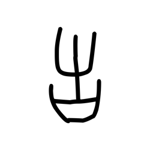

- source_zip_member: `Sub-character Images/fmdym8mxmv/fmdym8mxmv/0eih17h8ah.png`
- checksum_sha256: see `06_component-visual-index.csv`.
- review_status: `needs_human_visual_review`
- caution: source-marked review image only.

## asset-014832

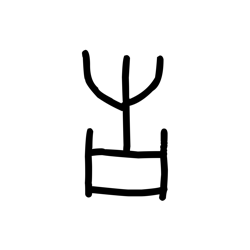

- source_zip_member: `Sub-character Images/fmdym8mxmv/fmdym8mxmv/0lcdkysjpq.png`
- checksum_sha256: see `06_component-visual-index.csv`.
- review_status: `needs_human_visual_review`
- caution: source-marked review image only.

## asset-014833

- source_zip_member: `Sub-character Images/fmdym8mxmv/fmdym8mxmv/0petadxdi8.png`
- checksum_sha256: see `06_component-visual-index.csv`.
- review_status: `needs_human_visual_review`
- caution: source-marked review image only.

## asset-014834

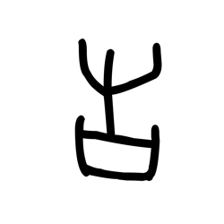

- source_zip_member: `Sub-character Images/fmdym8mxmv/fmdym8mxmv/2klmv7gcrk.png`
- checksum_sha256: see `06_component-visual-index.csv`.
- review_status: `needs_human_visual_review`
- caution: source-marked review image only.

## asset-014835

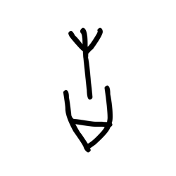

- source_zip_member: `Sub-character Images/fmdym8mxmv/fmdym8mxmv/30gzihuyv2.png`
- checksum_sha256: see `06_component-visual-index.csv`.
- review_status: `needs_human_visual_review`
- caution: source-marked review image only.

## asset-014836

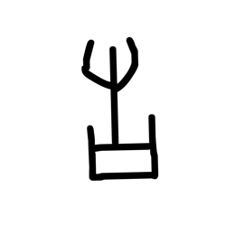

- source_zip_member: `Sub-character Images/fmdym8mxmv/fmdym8mxmv/47xnbmk62f.png`
- checksum_sha256: see `06_component-visual-index.csv`.
- review_status: `needs_human_visual_review`
- caution: source-marked review image only.

## asset-014837

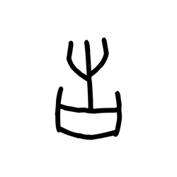

- source_zip_member: `Sub-character Images/fmdym8mxmv/fmdym8mxmv/5bsbz4ylqz.png`
- checksum_sha256: see `06_component-visual-index.csv`.
- review_status: `needs_human_visual_review`
- caution: source-marked review image only.

## asset-014838

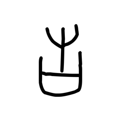

- source_zip_member: `Sub-character Images/fmdym8mxmv/fmdym8mxmv/5f2zgw04bd.png`
- checksum_sha256: see `06_component-visual-index.csv`.
- review_status: `needs_human_visual_review`
- caution: source-marked review image only.

## asset-014839

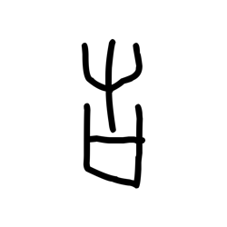

- source_zip_member: `Sub-character Images/fmdym8mxmv/fmdym8mxmv/5z4vnzdfgt.png`
- checksum_sha256: see `06_component-visual-index.csv`.
- review_status: `needs_human_visual_review`
- caution: source-marked review image only.

## asset-014840

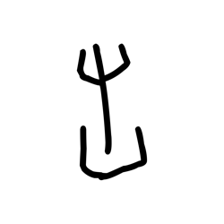

- source_zip_member: `Sub-character Images/fmdym8mxmv/fmdym8mxmv/7t84gg0aw8.png`
- checksum_sha256: see `06_component-visual-index.csv`.
- review_status: `needs_human_visual_review`
- caution: source-marked review image only.

## asset-014841

- source_zip_member: `Sub-character Images/fmdym8mxmv/fmdym8mxmv/8ajyf8ok36.png`
- checksum_sha256: see `06_component-visual-index.csv`.
- review_status: `needs_human_visual_review`
- caution: source-marked review image only.

## asset-014842

- source_zip_member: `Sub-character Images/fmdym8mxmv/fmdym8mxmv/8q5yhrmf7r.png`
- checksum_sha256: see `06_component-visual-index.csv`.
- review_status: `needs_human_visual_review`
- caution: source-marked review image only.

## asset-014843

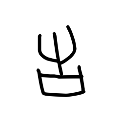

- source_zip_member: `Sub-character Images/fmdym8mxmv/fmdym8mxmv/92mp98dbzn.png`
- checksum_sha256: see `06_component-visual-index.csv`.
- review_status: `needs_human_visual_review`
- caution: source-marked review image only.

## asset-014844

- source_zip_member: `Sub-character Images/fmdym8mxmv/fmdym8mxmv/c8p8kevylt.png`
- checksum_sha256: see `06_component-visual-index.csv`.
- review_status: `needs_human_visual_review`
- caution: source-marked review image only.

## asset-014845

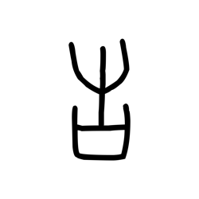

- source_zip_member: `Sub-character Images/fmdym8mxmv/fmdym8mxmv/cvh367itgv.png`
- checksum_sha256: see `06_component-visual-index.csv`.
- review_status: `needs_human_visual_review`
- caution: source-marked review image only.

## asset-014846

- source_zip_member: `Sub-character Images/fmdym8mxmv/fmdym8mxmv/d0ur6zzs75.png`
- checksum_sha256: see `06_component-visual-index.csv`.
- review_status: `needs_human_visual_review`
- caution: source-marked review image only.

## asset-014847

- source_zip_member: `Sub-character Images/fmdym8mxmv/fmdym8mxmv/d6ww7776u1.png`
- checksum_sha256: see `06_component-visual-index.csv`.
- review_status: `needs_human_visual_review`
- caution: source-marked review image only.

## asset-014848

- source_zip_member: `Sub-character Images/fmdym8mxmv/fmdym8mxmv/dovtfssica.png`
- checksum_sha256: see `06_component-visual-index.csv`.
- review_status: `needs_human_visual_review`
- caution: source-marked review image only.

## asset-014849

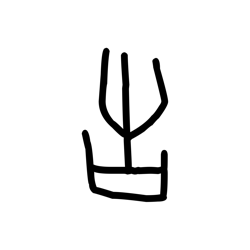

- source_zip_member: `Sub-character Images/fmdym8mxmv/fmdym8mxmv/dp9l6w4w3e.png`
- checksum_sha256: see `06_component-visual-index.csv`.
- review_status: `needs_human_visual_review`
- caution: source-marked review image only.

## asset-014850

- source_zip_member: `Sub-character Images/fmdym8mxmv/fmdym8mxmv/eyz0f32ux0.png`
- checksum_sha256: see `06_component-visual-index.csv`.
- review_status: `needs_human_visual_review`
- caution: source-marked review image only.

## asset-014851

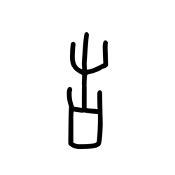

- source_zip_member: `Sub-character Images/fmdym8mxmv/fmdym8mxmv/f0gw0n1zp6.png`
- checksum_sha256: see `06_component-visual-index.csv`.
- review_status: `needs_human_visual_review`
- caution: source-marked review image only.

## asset-014852

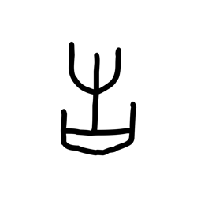

- source_zip_member: `Sub-character Images/fmdym8mxmv/fmdym8mxmv/f0ttlu5d59.png`
- checksum_sha256: see `06_component-visual-index.csv`.
- review_status: `needs_human_visual_review`
- caution: source-marked review image only.

## asset-014853

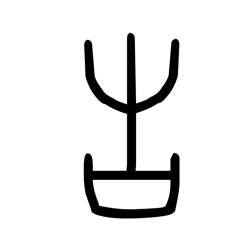

- source_zip_member: `Sub-character Images/fmdym8mxmv/fmdym8mxmv/fmdym8mxmv.png`
- checksum_sha256: see `06_component-visual-index.csv`.
- review_status: `needs_human_visual_review`
- caution: source-marked review image only.

## asset-014854

- source_zip_member: `Sub-character Images/fmdym8mxmv/fmdym8mxmv/frtv6uzsn3.png`
- checksum_sha256: see `06_component-visual-index.csv`.
- review_status: `needs_human_visual_review`
- caution: source-marked review image only.

## asset-014855

- source_zip_member: `Sub-character Images/fmdym8mxmv/fmdym8mxmv/gpyyjqex49.png`
- checksum_sha256: see `06_component-visual-index.csv`.
- review_status: `needs_human_visual_review`
- caution: source-marked review image only.

## asset-014856

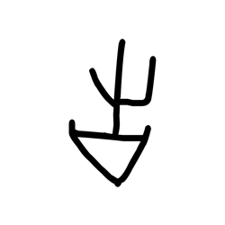

- source_zip_member: `Sub-character Images/fmdym8mxmv/fmdym8mxmv/hbnhhrlug0.png`
- checksum_sha256: see `06_component-visual-index.csv`.
- review_status: `needs_human_visual_review`
- caution: source-marked review image only.

## asset-014857

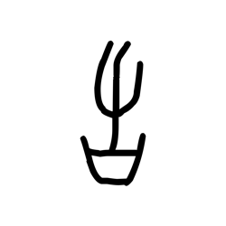

- source_zip_member: `Sub-character Images/fmdym8mxmv/fmdym8mxmv/hhs40xmshy.png`
- checksum_sha256: see `06_component-visual-index.csv`.
- review_status: `needs_human_visual_review`
- caution: source-marked review image only.

## asset-014858

- source_zip_member: `Sub-character Images/fmdym8mxmv/fmdym8mxmv/ibynvk6k27.png`
- checksum_sha256: see `06_component-visual-index.csv`.
- review_status: `needs_human_visual_review`
- caution: source-marked review image only.

## asset-014859

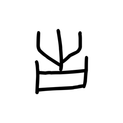

- source_zip_member: `Sub-character Images/fmdym8mxmv/fmdym8mxmv/im59mje3yj.png`
- checksum_sha256: see `06_component-visual-index.csv`.
- review_status: `needs_human_visual_review`
- caution: source-marked review image only.

## asset-014860

- source_zip_member: `Sub-character Images/fmdym8mxmv/fmdym8mxmv/iod4b9i4bv.png`
- checksum_sha256: see `06_component-visual-index.csv`.
- review_status: `needs_human_visual_review`
- caution: source-marked review image only.

## asset-014861

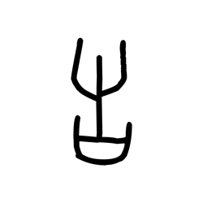

- source_zip_member: `Sub-character Images/fmdym8mxmv/fmdym8mxmv/iuq5h8qhph.png`
- checksum_sha256: see `06_component-visual-index.csv`.
- review_status: `needs_human_visual_review`
- caution: source-marked review image only.

## asset-014862

- source_zip_member: `Sub-character Images/fmdym8mxmv/fmdym8mxmv/iv2zhnaly8.png`
- checksum_sha256: see `06_component-visual-index.csv`.
- review_status: `needs_human_visual_review`
- caution: source-marked review image only.

## asset-014863

- source_zip_member: `Sub-character Images/fmdym8mxmv/fmdym8mxmv/j0dypw34xw.png`
- checksum_sha256: see `06_component-visual-index.csv`.
- review_status: `needs_human_visual_review`
- caution: source-marked review image only.

## asset-014864

- source_zip_member: `Sub-character Images/fmdym8mxmv/fmdym8mxmv/jpndb2svkr.png`
- checksum_sha256: see `06_component-visual-index.csv`.
- review_status: `needs_human_visual_review`
- caution: source-marked review image only.

## asset-014865

- source_zip_member: `Sub-character Images/fmdym8mxmv/fmdym8mxmv/jrokxx5lg0.png`
- checksum_sha256: see `06_component-visual-index.csv`.
- review_status: `needs_human_visual_review`
- caution: source-marked review image only.

## asset-014866

- source_zip_member: `Sub-character Images/fmdym8mxmv/fmdym8mxmv/kvy4xmkg2u.png`
- checksum_sha256: see `06_component-visual-index.csv`.
- review_status: `needs_human_visual_review`
- caution: source-marked review image only.

## asset-014867

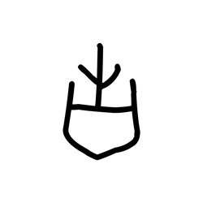

- source_zip_member: `Sub-character Images/fmdym8mxmv/fmdym8mxmv/ltrwkd7v4z.png`
- checksum_sha256: see `06_component-visual-index.csv`.
- review_status: `needs_human_visual_review`
- caution: source-marked review image only.

## asset-014868

- source_zip_member: `Sub-character Images/fmdym8mxmv/fmdym8mxmv/lv6x1r4gu7.png`
- checksum_sha256: see `06_component-visual-index.csv`.
- review_status: `needs_human_visual_review`
- caution: source-marked review image only.

## asset-014869

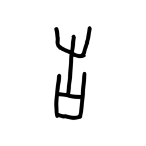

- source_zip_member: `Sub-character Images/fmdym8mxmv/fmdym8mxmv/n19ec1g81e.png`
- checksum_sha256: see `06_component-visual-index.csv`.
- review_status: `needs_human_visual_review`
- caution: source-marked review image only.

## asset-014870

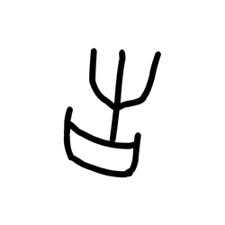

- source_zip_member: `Sub-character Images/fmdym8mxmv/fmdym8mxmv/n4afrhjlmk.png`
- checksum_sha256: see `06_component-visual-index.csv`.
- review_status: `needs_human_visual_review`
- caution: source-marked review image only.

## asset-014871

- source_zip_member: `Sub-character Images/fmdym8mxmv/fmdym8mxmv/o25tje00e5.png`
- checksum_sha256: see `06_component-visual-index.csv`.
- review_status: `needs_human_visual_review`
- caution: source-marked review image only.

## asset-014872

- source_zip_member: `Sub-character Images/fmdym8mxmv/fmdym8mxmv/o6nf50tjak.png`
- checksum_sha256: see `06_component-visual-index.csv`.
- review_status: `needs_human_visual_review`
- caution: source-marked review image only.

## asset-014873

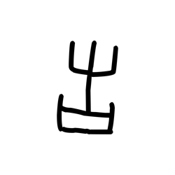

- source_zip_member: `Sub-character Images/fmdym8mxmv/fmdym8mxmv/oh2occmktf.png`
- checksum_sha256: see `06_component-visual-index.csv`.
- review_status: `needs_human_visual_review`
- caution: source-marked review image only.

## asset-014874

- source_zip_member: `Sub-character Images/fmdym8mxmv/fmdym8mxmv/oxc4rwbcq4.png`
- checksum_sha256: see `06_component-visual-index.csv`.
- review_status: `needs_human_visual_review`
- caution: source-marked review image only.

## asset-014875

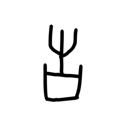

- source_zip_member: `Sub-character Images/fmdym8mxmv/fmdym8mxmv/pt3pqx3gi2.png`
- checksum_sha256: see `06_component-visual-index.csv`.
- review_status: `needs_human_visual_review`
- caution: source-marked review image only.

## asset-014876

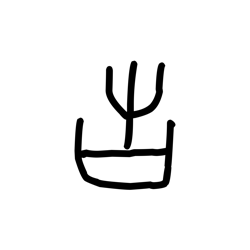

- source_zip_member: `Sub-character Images/fmdym8mxmv/fmdym8mxmv/pvm77fdljs.png`
- checksum_sha256: see `06_component-visual-index.csv`.
- review_status: `needs_human_visual_review`
- caution: source-marked review image only.

## asset-014877

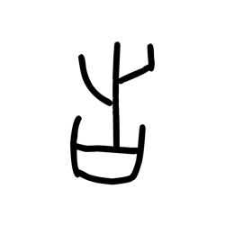

- source_zip_member: `Sub-character Images/fmdym8mxmv/fmdym8mxmv/q7tzw9r8k1.png`
- checksum_sha256: see `06_component-visual-index.csv`.
- review_status: `needs_human_visual_review`
- caution: source-marked review image only.

## asset-014878

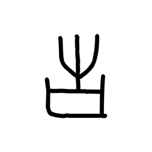

- source_zip_member: `Sub-character Images/fmdym8mxmv/fmdym8mxmv/qiawm3g7he.png`
- checksum_sha256: see `06_component-visual-index.csv`.
- review_status: `needs_human_visual_review`
- caution: source-marked review image only.

## asset-014879

- source_zip_member: `Sub-character Images/fmdym8mxmv/fmdym8mxmv/rwmvne4or1.png`
- checksum_sha256: see `06_component-visual-index.csv`.
- review_status: `needs_human_visual_review`
- caution: source-marked review image only.

## asset-014880

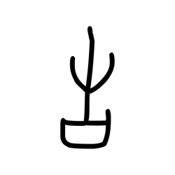

- source_zip_member: `Sub-character Images/fmdym8mxmv/fmdym8mxmv/s9po52kqw9.png`
- checksum_sha256: see `06_component-visual-index.csv`.
- review_status: `needs_human_visual_review`
- caution: source-marked review image only.

## asset-014881

- source_zip_member: `Sub-character Images/fmdym8mxmv/fmdym8mxmv/sbnm8dgw4f.png`
- checksum_sha256: see `06_component-visual-index.csv`.
- review_status: `needs_human_visual_review`
- caution: source-marked review image only.

## asset-014882

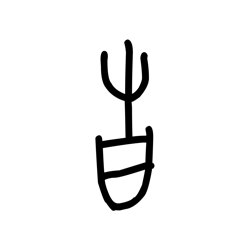

- source_zip_member: `Sub-character Images/fmdym8mxmv/fmdym8mxmv/to5v1ewdow.png`
- checksum_sha256: see `06_component-visual-index.csv`.
- review_status: `needs_human_visual_review`
- caution: source-marked review image only.

## asset-014883

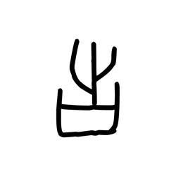

- source_zip_member: `Sub-character Images/fmdym8mxmv/fmdym8mxmv/u4w2ca9vjs.png`
- checksum_sha256: see `06_component-visual-index.csv`.
- review_status: `needs_human_visual_review`
- caution: source-marked review image only.

## asset-014884

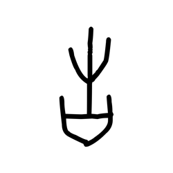

- source_zip_member: `Sub-character Images/fmdym8mxmv/fmdym8mxmv/uxxm23i93q.png`
- checksum_sha256: see `06_component-visual-index.csv`.
- review_status: `needs_human_visual_review`
- caution: source-marked review image only.

## asset-014885

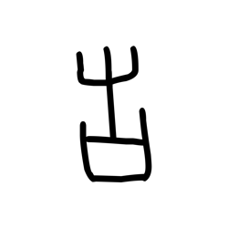

- source_zip_member: `Sub-character Images/fmdym8mxmv/fmdym8mxmv/v6h99bks9j.png`
- checksum_sha256: see `06_component-visual-index.csv`.
- review_status: `needs_human_visual_review`
- caution: source-marked review image only.

## asset-014886

- source_zip_member: `Sub-character Images/fmdym8mxmv/fmdym8mxmv/vimi2w3r87.png`
- checksum_sha256: see `06_component-visual-index.csv`.
- review_status: `needs_human_visual_review`
- caution: source-marked review image only.

## asset-014887

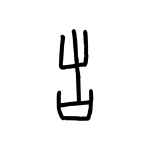

- source_zip_member: `Sub-character Images/fmdym8mxmv/fmdym8mxmv/vklds4gbvj.png`
- checksum_sha256: see `06_component-visual-index.csv`.
- review_status: `needs_human_visual_review`
- caution: source-marked review image only.

## asset-014888

- source_zip_member: `Sub-character Images/fmdym8mxmv/fmdym8mxmv/vpke8i8126.png`
- checksum_sha256: see `06_component-visual-index.csv`.
- review_status: `needs_human_visual_review`
- caution: source-marked review image only.

## asset-014889

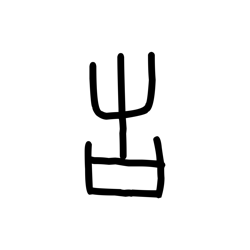

- source_zip_member: `Sub-character Images/fmdym8mxmv/fmdym8mxmv/vpxr2qjizs.png`
- checksum_sha256: see `06_component-visual-index.csv`.
- review_status: `needs_human_visual_review`
- caution: source-marked review image only.

## asset-014890

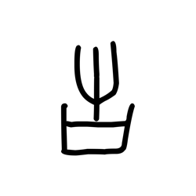

- source_zip_member: `Sub-character Images/fmdym8mxmv/fmdym8mxmv/w9ay1ofec0.png`
- checksum_sha256: see `06_component-visual-index.csv`.
- review_status: `needs_human_visual_review`
- caution: source-marked review image only.

## asset-014891

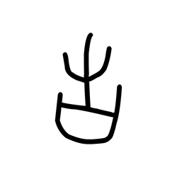

- source_zip_member: `Sub-character Images/fmdym8mxmv/fmdym8mxmv/wxq7g3gv23.png`
- checksum_sha256: see `06_component-visual-index.csv`.
- review_status: `needs_human_visual_review`
- caution: source-marked review image only.

## asset-014892

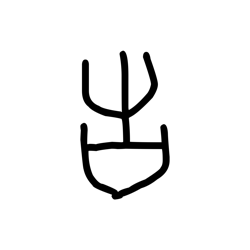

- source_zip_member: `Sub-character Images/fmdym8mxmv/fmdym8mxmv/xd6ktinepf.png`
- checksum_sha256: see `06_component-visual-index.csv`.
- review_status: `needs_human_visual_review`
- caution: source-marked review image only.

## asset-014893

- source_zip_member: `Sub-character Images/fmdym8mxmv/fmdym8mxmv/ybcwqbr3v5.png`
- checksum_sha256: see `06_component-visual-index.csv`.
- review_status: `needs_human_visual_review`
- caution: source-marked review image only.

## asset-014894

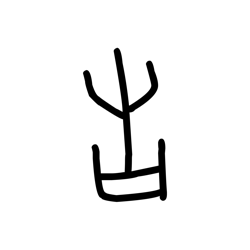

- source_zip_member: `Sub-character Images/fmdym8mxmv/fmdym8mxmv/yf2nv4a5v1.png`
- checksum_sha256: see `06_component-visual-index.csv`.
- review_status: `needs_human_visual_review`
- caution: source-marked review image only.

## asset-014895

- source_zip_member: `Sub-character Images/fmdym8mxmv/fmdym8mxmv/zgnpfmoxq9.png`
- checksum_sha256: see `06_component-visual-index.csv`.
- review_status: `needs_human_visual_review`
- caution: source-marked review image only.

## asset-014896

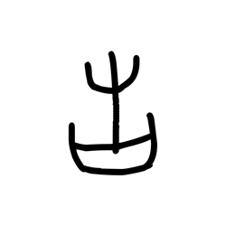

- source_zip_member: `Sub-character Images/fmdym8mxmv/fmdym8mxmv/zmvucmyme7.png`
- checksum_sha256: see `06_component-visual-index.csv`.
- review_status: `needs_human_visual_review`
- caution: source-marked review image only.
