# Component Visual Gallery / 构件图像查看: obs-comp-cand-001099

English:
This page displays OBIMD subcharacter PNG assets extracted into this concrete corpus object directory for human review.

简体中文：
本页展示抽取到当前具体 corpus 对象目录内的 OBIMD subcharacter PNG 资料，供人工复核使用。

Boundary / 边界：dataset image candidate only; not a confirmed component form, component assignment, or decipherment claim.

## asset-014908

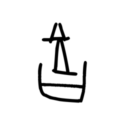

- source_zip_member: `Sub-character Images/xlscyddubk/xlscyddubk/06c1o1m5xb.png`
- checksum_sha256: `6438dd886333e22f7bf92fad4b23c7cee16bff45db6591307b1d24769f3fbd13`
- review_status: `needs_human_visual_review`
- caution: OBIMD subcharacter image is a source-marked review asset only; it is not a confirmed component form, component assignment, or decipherment conclusion.

## asset-014909

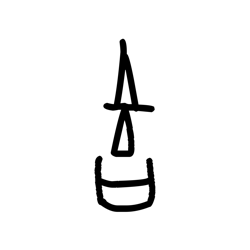

- source_zip_member: `Sub-character Images/xlscyddubk/xlscyddubk/0bfz79ztzw.png`
- checksum_sha256: `94d6e7cf7ff7e4ec619c3c8de80fe7daecf840236d0d4b9c572a9ef8dddfa5cb`
- review_status: `needs_human_visual_review`
- caution: OBIMD subcharacter image is a source-marked review asset only; it is not a confirmed component form, component assignment, or decipherment conclusion.

## asset-014910

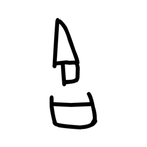

- source_zip_member: `Sub-character Images/xlscyddubk/xlscyddubk/0gzymz9xry.png`
- checksum_sha256: `753ff8c78877b688379c23170cb180e83a9e106cfa81b50bf6d59aff86992c7a`
- review_status: `needs_human_visual_review`
- caution: OBIMD subcharacter image is a source-marked review asset only; it is not a confirmed component form, component assignment, or decipherment conclusion.

## asset-014911

- source_zip_member: `Sub-character Images/xlscyddubk/xlscyddubk/0m4v6pj1zy.png`
- checksum_sha256: `cb16e7af5d332119d653a9d02057d368968bd28b755be2f8e1462f4107679eaa`
- review_status: `needs_human_visual_review`
- caution: OBIMD subcharacter image is a source-marked review asset only; it is not a confirmed component form, component assignment, or decipherment conclusion.

## asset-014912

- source_zip_member: `Sub-character Images/xlscyddubk/xlscyddubk/0u4wbi0041.png`
- checksum_sha256: `3a4a8547d451ce689f69138d9c94ddbfe28d62f660dc546841a265e32abf9009`
- review_status: `needs_human_visual_review`
- caution: OBIMD subcharacter image is a source-marked review asset only; it is not a confirmed component form, component assignment, or decipherment conclusion.

## asset-014913

- source_zip_member: `Sub-character Images/xlscyddubk/xlscyddubk/1chz7v8caj.png`
- checksum_sha256: `af87f32f49229af04214295220e099d9dd56615032d3150f0198951d88b0e32f`
- review_status: `needs_human_visual_review`
- caution: OBIMD subcharacter image is a source-marked review asset only; it is not a confirmed component form, component assignment, or decipherment conclusion.

## asset-014914

- source_zip_member: `Sub-character Images/xlscyddubk/xlscyddubk/1jq2qf8vgq.png`
- checksum_sha256: `101c212e874f8f441cd64c06229ef71dccdd9855cefa7edef885010c15199cac`
- review_status: `needs_human_visual_review`
- caution: OBIMD subcharacter image is a source-marked review asset only; it is not a confirmed component form, component assignment, or decipherment conclusion.

## asset-014915

- source_zip_member: `Sub-character Images/xlscyddubk/xlscyddubk/2bmzck8dtu.png`
- checksum_sha256: `d73aafda0f879f3fa7920e87bb33e8f60773341831bc86df3bdfc05fe04fb252`
- review_status: `needs_human_visual_review`
- caution: OBIMD subcharacter image is a source-marked review asset only; it is not a confirmed component form, component assignment, or decipherment conclusion.

## asset-014916

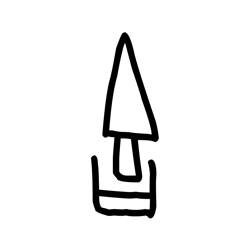

- source_zip_member: `Sub-character Images/xlscyddubk/xlscyddubk/4rrqnlgjxy.png`
- checksum_sha256: `f3d3267179e5ae3aa9d638c53bc60ab161c5bffec2af77839df7bd445f4cd893`
- review_status: `needs_human_visual_review`
- caution: OBIMD subcharacter image is a source-marked review asset only; it is not a confirmed component form, component assignment, or decipherment conclusion.

## asset-014917

- source_zip_member: `Sub-character Images/xlscyddubk/xlscyddubk/5x6vvccg7w.png`
- checksum_sha256: `8d61a4d0e3f60db9a328561524854b25d83759c000f4c366146b398010f950e0`
- review_status: `needs_human_visual_review`
- caution: OBIMD subcharacter image is a source-marked review asset only; it is not a confirmed component form, component assignment, or decipherment conclusion.

## asset-014918

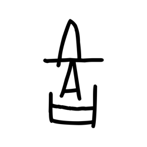

- source_zip_member: `Sub-character Images/xlscyddubk/xlscyddubk/61ykigdrba.png`
- checksum_sha256: `59128d75b18f90d8685aba8f8bb6da78036abab4df48f4702cc6c546301acd02`
- review_status: `needs_human_visual_review`
- caution: OBIMD subcharacter image is a source-marked review asset only; it is not a confirmed component form, component assignment, or decipherment conclusion.

## asset-014919

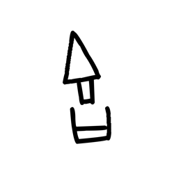

- source_zip_member: `Sub-character Images/xlscyddubk/xlscyddubk/63banqoo4h.png`
- checksum_sha256: `7cf4d4dca49ec0c0eda36423afb8eeeb140dd505b1763550db88134428a8b5de`
- review_status: `needs_human_visual_review`
- caution: OBIMD subcharacter image is a source-marked review asset only; it is not a confirmed component form, component assignment, or decipherment conclusion.

## asset-014920

- source_zip_member: `Sub-character Images/xlscyddubk/xlscyddubk/6yflooqpmc.png`
- checksum_sha256: `5f705e9da0dffb93c2e0b3e144f12fd26d0291b02c504494b791df61f8649e16`
- review_status: `needs_human_visual_review`
- caution: OBIMD subcharacter image is a source-marked review asset only; it is not a confirmed component form, component assignment, or decipherment conclusion.

## asset-014921

- source_zip_member: `Sub-character Images/xlscyddubk/xlscyddubk/7uque37peo.png`
- checksum_sha256: `2bbc42a149426136498abfb52fcf6805c8569fcfabe1aea22e137338cf65d4de`
- review_status: `needs_human_visual_review`
- caution: OBIMD subcharacter image is a source-marked review asset only; it is not a confirmed component form, component assignment, or decipherment conclusion.

## asset-014922

- source_zip_member: `Sub-character Images/xlscyddubk/xlscyddubk/7vtoiosw3p.png`
- checksum_sha256: `0544a7885dd9eb607ea89ceddcdce95516a7637757c0097d50e27bff8b4b42c2`
- review_status: `needs_human_visual_review`
- caution: OBIMD subcharacter image is a source-marked review asset only; it is not a confirmed component form, component assignment, or decipherment conclusion.

## asset-014923

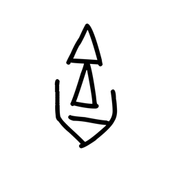

- source_zip_member: `Sub-character Images/xlscyddubk/xlscyddubk/8xohn11b8j.png`
- checksum_sha256: `419f8c415e29c7d6206ee67f7408d9997e4dd16034a85a231abb5be8affcb33b`
- review_status: `needs_human_visual_review`
- caution: OBIMD subcharacter image is a source-marked review asset only; it is not a confirmed component form, component assignment, or decipherment conclusion.

## asset-014924

- source_zip_member: `Sub-character Images/xlscyddubk/xlscyddubk/9pchvwttoa.png`
- checksum_sha256: `0a8c4f47bc91f0a0082d47d0ae0a5758011bb6152fb749b9e46b99a5928452e3`
- review_status: `needs_human_visual_review`
- caution: OBIMD subcharacter image is a source-marked review asset only; it is not a confirmed component form, component assignment, or decipherment conclusion.

## asset-014925

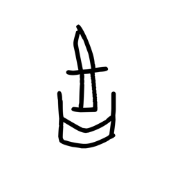

- source_zip_member: `Sub-character Images/xlscyddubk/xlscyddubk/9sgo3zwb0d.png`
- checksum_sha256: `87a6c2901dba05ab4e9a6c0794590ef1a38c6e22153a45ad34a245e4a46e9597`
- review_status: `needs_human_visual_review`
- caution: OBIMD subcharacter image is a source-marked review asset only; it is not a confirmed component form, component assignment, or decipherment conclusion.

## asset-014926

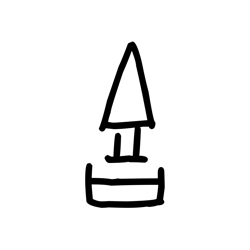

- source_zip_member: `Sub-character Images/xlscyddubk/xlscyddubk/ahjhi54psw.png`
- checksum_sha256: `f37f4e27a8d54fa688676c16119ddbb53657c212dc70199351bdee525d9d2b2e`
- review_status: `needs_human_visual_review`
- caution: OBIMD subcharacter image is a source-marked review asset only; it is not a confirmed component form, component assignment, or decipherment conclusion.

## asset-014927

- source_zip_member: `Sub-character Images/xlscyddubk/xlscyddubk/appiotw7xy.png`
- checksum_sha256: `d8fd6d04ee83782172c2da78af56c356180f3f1f98423ba8f5f1c5fb6f0c8d24`
- review_status: `needs_human_visual_review`
- caution: OBIMD subcharacter image is a source-marked review asset only; it is not a confirmed component form, component assignment, or decipherment conclusion.

## asset-014928

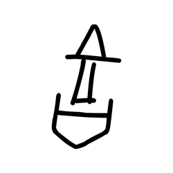

- source_zip_member: `Sub-character Images/xlscyddubk/xlscyddubk/b2ised856u.png`
- checksum_sha256: `f82fa3446a066b8cf4bac31426a7c2c8a9f73ba02761a3465f1c0548b87266a6`
- review_status: `needs_human_visual_review`
- caution: OBIMD subcharacter image is a source-marked review asset only; it is not a confirmed component form, component assignment, or decipherment conclusion.

## asset-014929

- source_zip_member: `Sub-character Images/xlscyddubk/xlscyddubk/b8egcfh9dk.png`
- checksum_sha256: `31e4493b730f5cb4b0e6256f6e73adeee03f0f6ecced5a6de25570be392ef968`
- review_status: `needs_human_visual_review`
- caution: OBIMD subcharacter image is a source-marked review asset only; it is not a confirmed component form, component assignment, or decipherment conclusion.

## asset-014930

- source_zip_member: `Sub-character Images/xlscyddubk/xlscyddubk/bc3qdfk6wz.png`
- checksum_sha256: `9f1d06397b62cd07dc86e707dea8f97c4da8c1711bb5f3cd613511265335085d`
- review_status: `needs_human_visual_review`
- caution: OBIMD subcharacter image is a source-marked review asset only; it is not a confirmed component form, component assignment, or decipherment conclusion.

## asset-014931

- source_zip_member: `Sub-character Images/xlscyddubk/xlscyddubk/bjcilvymkn.png`
- checksum_sha256: `88674af77888231cb4dc4b0f0740ff0f44957616a319207b3ec2276d0a217f83`
- review_status: `needs_human_visual_review`
- caution: OBIMD subcharacter image is a source-marked review asset only; it is not a confirmed component form, component assignment, or decipherment conclusion.

## asset-014932

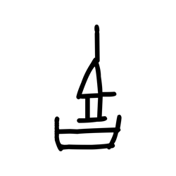

- source_zip_member: `Sub-character Images/xlscyddubk/xlscyddubk/bq91qzcfzu.png`
- checksum_sha256: `b3a5927adb947608ce8a6314ff5c137d73d23a61e3b1085c9b064eeab70541c8`
- review_status: `needs_human_visual_review`
- caution: OBIMD subcharacter image is a source-marked review asset only; it is not a confirmed component form, component assignment, or decipherment conclusion.

## asset-014933

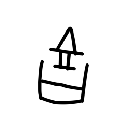

- source_zip_member: `Sub-character Images/xlscyddubk/xlscyddubk/bqcvoihzxl.png`
- checksum_sha256: `dc6c1473c2bf01d96d72099baaa6353b1e99790307bac67a1e0ccd20fd1fe0e7`
- review_status: `needs_human_visual_review`
- caution: OBIMD subcharacter image is a source-marked review asset only; it is not a confirmed component form, component assignment, or decipherment conclusion.

## asset-014934

- source_zip_member: `Sub-character Images/xlscyddubk/xlscyddubk/c3438jclev.png`
- checksum_sha256: `3f1882ed918241ac0746f0416df67e155118c767eeb2cd5d4f9fa5f4a8e831a7`
- review_status: `needs_human_visual_review`
- caution: OBIMD subcharacter image is a source-marked review asset only; it is not a confirmed component form, component assignment, or decipherment conclusion.

## asset-014935

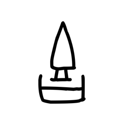

- source_zip_member: `Sub-character Images/xlscyddubk/xlscyddubk/c82hx7q95j.png`
- checksum_sha256: `8120eb20c299b74d07525db111a79568a0697de8094308d80112edef32a58455`
- review_status: `needs_human_visual_review`
- caution: OBIMD subcharacter image is a source-marked review asset only; it is not a confirmed component form, component assignment, or decipherment conclusion.

## asset-014936

- source_zip_member: `Sub-character Images/xlscyddubk/xlscyddubk/ccw88kgy08.png`
- checksum_sha256: `533e48665979184a39eb0e5ed2abfe748c2e54f0d2f285ab063477c4e573172c`
- review_status: `needs_human_visual_review`
- caution: OBIMD subcharacter image is a source-marked review asset only; it is not a confirmed component form, component assignment, or decipherment conclusion.

## asset-014937

- source_zip_member: `Sub-character Images/xlscyddubk/xlscyddubk/cs8qbceaz5.png`
- checksum_sha256: `63ed4e7be23b075ad0cfe949986b283c0630769c2d6e118716e57e5a76931f4a`
- review_status: `needs_human_visual_review`
- caution: OBIMD subcharacter image is a source-marked review asset only; it is not a confirmed component form, component assignment, or decipherment conclusion.

## asset-014938

- source_zip_member: `Sub-character Images/xlscyddubk/xlscyddubk/cw6ucln54u.png`
- checksum_sha256: `a3e8b7bcc9e82f9b49c28f04e20b44c16945339afb5c9e8606850346f0af405b`
- review_status: `needs_human_visual_review`
- caution: OBIMD subcharacter image is a source-marked review asset only; it is not a confirmed component form, component assignment, or decipherment conclusion.

## asset-014939

- source_zip_member: `Sub-character Images/xlscyddubk/xlscyddubk/cwsjwff3qp.png`
- checksum_sha256: `9b4f2d853b0cd6d581ea250e84d48971997fdd12e6d435919a76de75ac56f4ff`
- review_status: `needs_human_visual_review`
- caution: OBIMD subcharacter image is a source-marked review asset only; it is not a confirmed component form, component assignment, or decipherment conclusion.

## asset-014940

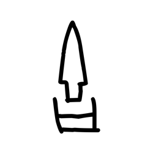

- source_zip_member: `Sub-character Images/xlscyddubk/xlscyddubk/dcx07ek2y1.png`
- checksum_sha256: `764d4a036bd6225c5b569b93440f6acc8714004f4b6f7f26e3011ca9d9e64e60`
- review_status: `needs_human_visual_review`
- caution: OBIMD subcharacter image is a source-marked review asset only; it is not a confirmed component form, component assignment, or decipherment conclusion.

## asset-014941

- source_zip_member: `Sub-character Images/xlscyddubk/xlscyddubk/dupv1n8l4z.png`
- checksum_sha256: `d83c593c0000e5a5cf03b0a44247020c01452e7759478e1aa10eedd11a8b4580`
- review_status: `needs_human_visual_review`
- caution: OBIMD subcharacter image is a source-marked review asset only; it is not a confirmed component form, component assignment, or decipherment conclusion.

## asset-014942

- source_zip_member: `Sub-character Images/xlscyddubk/xlscyddubk/dylclh7cow.png`
- checksum_sha256: `65fa783fe2b0f70d9b1509ab9ee4e4f8352d86724f92119ba54976a661e75a9c`
- review_status: `needs_human_visual_review`
- caution: OBIMD subcharacter image is a source-marked review asset only; it is not a confirmed component form, component assignment, or decipherment conclusion.

## asset-014943

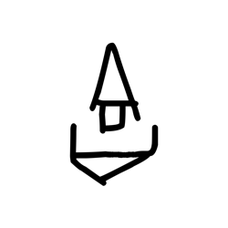

- source_zip_member: `Sub-character Images/xlscyddubk/xlscyddubk/exdqiezqgn.png`
- checksum_sha256: `dc4e46e035f2966b8c91c701af8cdc95e289d4d8ff614ac0816b75754a596a5c`
- review_status: `needs_human_visual_review`
- caution: OBIMD subcharacter image is a source-marked review asset only; it is not a confirmed component form, component assignment, or decipherment conclusion.

## asset-014944

- source_zip_member: `Sub-character Images/xlscyddubk/xlscyddubk/f7w0lya095.png`
- checksum_sha256: `934be255bfdc5fbbf5a52898d754464366674840df4c05c345512206dc207951`
- review_status: `needs_human_visual_review`
- caution: OBIMD subcharacter image is a source-marked review asset only; it is not a confirmed component form, component assignment, or decipherment conclusion.

## asset-014945

- source_zip_member: `Sub-character Images/xlscyddubk/xlscyddubk/fj3xnkwogy.png`
- checksum_sha256: `38c254e0c6d8e3046fcf3f2f315a3c818f033b388850eacee0e803702c576696`
- review_status: `needs_human_visual_review`
- caution: OBIMD subcharacter image is a source-marked review asset only; it is not a confirmed component form, component assignment, or decipherment conclusion.

## asset-014946

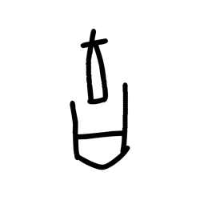

- source_zip_member: `Sub-character Images/xlscyddubk/xlscyddubk/fu9gtmv6py.png`
- checksum_sha256: `b23ce0cdab5b8f3c474a8ed1fd27547bea847d2a32fc76263966b8c8a79b6729`
- review_status: `needs_human_visual_review`
- caution: OBIMD subcharacter image is a source-marked review asset only; it is not a confirmed component form, component assignment, or decipherment conclusion.

## asset-014947

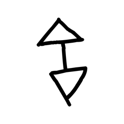

- source_zip_member: `Sub-character Images/xlscyddubk/xlscyddubk/glv0czzsa2.png`
- checksum_sha256: `2fd84bb6df3f7601912f02ae1969c0d207dfbe602da30411976df58d9501fab5`
- review_status: `needs_human_visual_review`
- caution: OBIMD subcharacter image is a source-marked review asset only; it is not a confirmed component form, component assignment, or decipherment conclusion.

## asset-014948

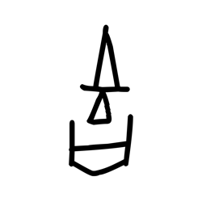

- source_zip_member: `Sub-character Images/xlscyddubk/xlscyddubk/hloi1bv41i.png`
- checksum_sha256: `1d7f2177cf6b60a5311bb08a83f6cad6faf783b235cf8f2663ff678f126ec4a8`
- review_status: `needs_human_visual_review`
- caution: OBIMD subcharacter image is a source-marked review asset only; it is not a confirmed component form, component assignment, or decipherment conclusion.

## asset-014949

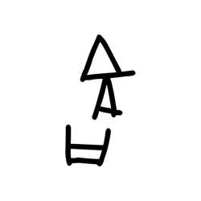

- source_zip_member: `Sub-character Images/xlscyddubk/xlscyddubk/i2gozj49pq.png`
- checksum_sha256: `4bfb583866262f878876844b207d6c24c21ab3e98c9cde11331957ca9c3d8bbd`
- review_status: `needs_human_visual_review`
- caution: OBIMD subcharacter image is a source-marked review asset only; it is not a confirmed component form, component assignment, or decipherment conclusion.

## asset-014950

- source_zip_member: `Sub-character Images/xlscyddubk/xlscyddubk/i3407lbi3y.png`
- checksum_sha256: `94335b0e223766d91314d1c6199ea51e671a8fffe88e99c1919e96ff13d56365`
- review_status: `needs_human_visual_review`
- caution: OBIMD subcharacter image is a source-marked review asset only; it is not a confirmed component form, component assignment, or decipherment conclusion.

## asset-014951

- source_zip_member: `Sub-character Images/xlscyddubk/xlscyddubk/ic9o8fukqi.png`
- checksum_sha256: `d47203aa046380ef1c385c59b13e4df391a91d42709ed98aef203fdf5860a7df`
- review_status: `needs_human_visual_review`
- caution: OBIMD subcharacter image is a source-marked review asset only; it is not a confirmed component form, component assignment, or decipherment conclusion.

## asset-014952

- source_zip_member: `Sub-character Images/xlscyddubk/xlscyddubk/ierahf2itz.png`
- checksum_sha256: `9a7e38396b62f8a10559c341af0912e539b8fad290b99a32897569211d848d03`
- review_status: `needs_human_visual_review`
- caution: OBIMD subcharacter image is a source-marked review asset only; it is not a confirmed component form, component assignment, or decipherment conclusion.

## asset-014953

- source_zip_member: `Sub-character Images/xlscyddubk/xlscyddubk/iozxc5q31u.png`
- checksum_sha256: `9bad7d551985f7ff7d98207ec089a729162a5a6bfd2b674961c7325576a9870f`
- review_status: `needs_human_visual_review`
- caution: OBIMD subcharacter image is a source-marked review asset only; it is not a confirmed component form, component assignment, or decipherment conclusion.

## asset-014954

- source_zip_member: `Sub-character Images/xlscyddubk/xlscyddubk/jewr04i7x9.png`
- checksum_sha256: `32997648f18e05916585d35dbdda633582e374109a654cd5161417df98aee97d`
- review_status: `needs_human_visual_review`
- caution: OBIMD subcharacter image is a source-marked review asset only; it is not a confirmed component form, component assignment, or decipherment conclusion.

## asset-014955

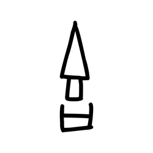

- source_zip_member: `Sub-character Images/xlscyddubk/xlscyddubk/jo5r4dxt1v.png`
- checksum_sha256: `7def886b180d57475cb8be89e9e1b160ebc81f69d71cad7f28164134a789a05b`
- review_status: `needs_human_visual_review`
- caution: OBIMD subcharacter image is a source-marked review asset only; it is not a confirmed component form, component assignment, or decipherment conclusion.

## asset-014956

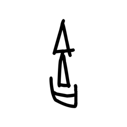

- source_zip_member: `Sub-character Images/xlscyddubk/xlscyddubk/k8x5l2mipc.png`
- checksum_sha256: `fae7247a22c5d019dedd640c180e5e9ea6201a7c4cb83f11f1a8359d7ae85421`
- review_status: `needs_human_visual_review`
- caution: OBIMD subcharacter image is a source-marked review asset only; it is not a confirmed component form, component assignment, or decipherment conclusion.

## asset-014957

- source_zip_member: `Sub-character Images/xlscyddubk/xlscyddubk/kp5piwlknj.png`
- checksum_sha256: `66e1432a14fd4276a8e6f445b7fa5e41337dcd7dae765b3d41e43c861f3018fb`
- review_status: `needs_human_visual_review`
- caution: OBIMD subcharacter image is a source-marked review asset only; it is not a confirmed component form, component assignment, or decipherment conclusion.

## asset-014958

- source_zip_member: `Sub-character Images/xlscyddubk/xlscyddubk/kzjr01utu1.png`
- checksum_sha256: `f8a4c0334f11b25a81866b5c863f249724fbda67eca30540f82abd1d00d50e9d`
- review_status: `needs_human_visual_review`
- caution: OBIMD subcharacter image is a source-marked review asset only; it is not a confirmed component form, component assignment, or decipherment conclusion.

## asset-014959

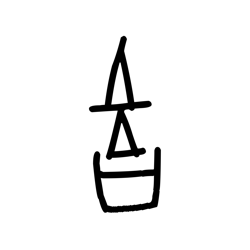

- source_zip_member: `Sub-character Images/xlscyddubk/xlscyddubk/l3gsoqpy32.png`
- checksum_sha256: `0009c522fe55b2fa8d4d5eb621985df58db579eabd88a61de6bf477f9888ea5e`
- review_status: `needs_human_visual_review`
- caution: OBIMD subcharacter image is a source-marked review asset only; it is not a confirmed component form, component assignment, or decipherment conclusion.

## asset-014960

- source_zip_member: `Sub-character Images/xlscyddubk/xlscyddubk/ljktt706w7.png`
- checksum_sha256: `8b421b52f6380236f71adc82472c706cd437ed675207d6d7ed11d2264c3725d6`
- review_status: `needs_human_visual_review`
- caution: OBIMD subcharacter image is a source-marked review asset only; it is not a confirmed component form, component assignment, or decipherment conclusion.

## asset-014961

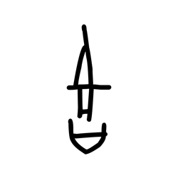

- source_zip_member: `Sub-character Images/xlscyddubk/xlscyddubk/lnxt70amw3.png`
- checksum_sha256: `c7e1e0686ba1da2c7beaa57276aabff18ec010eeb41cf6b159d0148567417bea`
- review_status: `needs_human_visual_review`
- caution: OBIMD subcharacter image is a source-marked review asset only; it is not a confirmed component form, component assignment, or decipherment conclusion.

## asset-014962

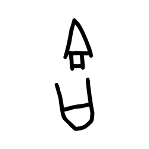

- source_zip_member: `Sub-character Images/xlscyddubk/xlscyddubk/lsdkwd95p3.png`
- checksum_sha256: `31152389fb8044622bfc07a134fe40c3bd4ec548f977f2eda9bdfff5a638a227`
- review_status: `needs_human_visual_review`
- caution: OBIMD subcharacter image is a source-marked review asset only; it is not a confirmed component form, component assignment, or decipherment conclusion.

## asset-014963

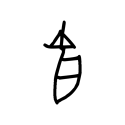

- source_zip_member: `Sub-character Images/xlscyddubk/xlscyddubk/m0pokvcvxz.png`
- checksum_sha256: `148c2fdf448219ec875f6086128ace1dce4bf87b9490b49bb911f7c98539ebc3`
- review_status: `needs_human_visual_review`
- caution: OBIMD subcharacter image is a source-marked review asset only; it is not a confirmed component form, component assignment, or decipherment conclusion.

## asset-014964

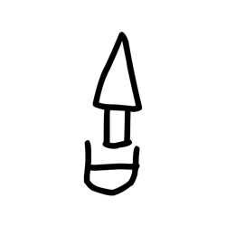

- source_zip_member: `Sub-character Images/xlscyddubk/xlscyddubk/m7r91rubn0.png`
- checksum_sha256: `83446b14b7f533357184684394ba533767ad1219d7151594f0007bd088c427b8`
- review_status: `needs_human_visual_review`
- caution: OBIMD subcharacter image is a source-marked review asset only; it is not a confirmed component form, component assignment, or decipherment conclusion.

## asset-014965

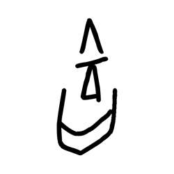

- source_zip_member: `Sub-character Images/xlscyddubk/xlscyddubk/n37p0rjyfq.png`
- checksum_sha256: `3bc231656ff5f6fa1e784c4fa4031f971d543c554fee0076f364d2528b159329`
- review_status: `needs_human_visual_review`
- caution: OBIMD subcharacter image is a source-marked review asset only; it is not a confirmed component form, component assignment, or decipherment conclusion.

## asset-014966

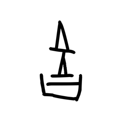

- source_zip_member: `Sub-character Images/xlscyddubk/xlscyddubk/nnssj74ia0.png`
- checksum_sha256: `4517d4ed8155630307f18ebcbe427b4d4988c9643e9e34e86702f32f7e7d293a`
- review_status: `needs_human_visual_review`
- caution: OBIMD subcharacter image is a source-marked review asset only; it is not a confirmed component form, component assignment, or decipherment conclusion.

## asset-014967

- source_zip_member: `Sub-character Images/xlscyddubk/xlscyddubk/nvv3vda2ce.png`
- checksum_sha256: `e1be82c05bb4cc09602113578692c6b418cdbac7c0dee3c891d99505f5b6e059`
- review_status: `needs_human_visual_review`
- caution: OBIMD subcharacter image is a source-marked review asset only; it is not a confirmed component form, component assignment, or decipherment conclusion.

## asset-014968

- source_zip_member: `Sub-character Images/xlscyddubk/xlscyddubk/nxyvry3omv.png`
- checksum_sha256: `bb6b1f4e7a63be4f32aed365119e3d6ac97c27682fa3fb352a0ac53dad1dcbeb`
- review_status: `needs_human_visual_review`
- caution: OBIMD subcharacter image is a source-marked review asset only; it is not a confirmed component form, component assignment, or decipherment conclusion.

## asset-014969

- source_zip_member: `Sub-character Images/xlscyddubk/xlscyddubk/o34zrw69bv.png`
- checksum_sha256: `8fbaec2bef4bf1f1bebc7caafda8ec35f09f0e76be81202fa89975dba119e8f0`
- review_status: `needs_human_visual_review`
- caution: OBIMD subcharacter image is a source-marked review asset only; it is not a confirmed component form, component assignment, or decipherment conclusion.

## asset-014970

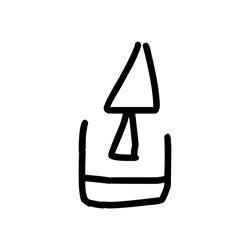

- source_zip_member: `Sub-character Images/xlscyddubk/xlscyddubk/oax9m4kixh.png`
- checksum_sha256: `8bbc8a1d3844457a60f8695722b18eb55560825dd3079e6e3da6435757cd264c`
- review_status: `needs_human_visual_review`
- caution: OBIMD subcharacter image is a source-marked review asset only; it is not a confirmed component form, component assignment, or decipherment conclusion.

## asset-014971

- source_zip_member: `Sub-character Images/xlscyddubk/xlscyddubk/od5amm3bry.png`
- checksum_sha256: `2a949b08632e04a839e60237675fabfd6bcd1dade6ab2aa628c41c60c4b7b64f`
- review_status: `needs_human_visual_review`
- caution: OBIMD subcharacter image is a source-marked review asset only; it is not a confirmed component form, component assignment, or decipherment conclusion.

## asset-014972

- source_zip_member: `Sub-character Images/xlscyddubk/xlscyddubk/oukz0letk9.png`
- checksum_sha256: `282c319a62c16468233dd0f304acddf18171c2ada10a6468a4a68d894608375c`
- review_status: `needs_human_visual_review`
- caution: OBIMD subcharacter image is a source-marked review asset only; it is not a confirmed component form, component assignment, or decipherment conclusion.

## asset-014973

- source_zip_member: `Sub-character Images/xlscyddubk/xlscyddubk/oxdo3wphcv.png`
- checksum_sha256: `1883c2c38c707e89896fe8af87d791ca35b7596b7ff1dc3bd8d1c2066c677431`
- review_status: `needs_human_visual_review`
- caution: OBIMD subcharacter image is a source-marked review asset only; it is not a confirmed component form, component assignment, or decipherment conclusion.

## asset-014974

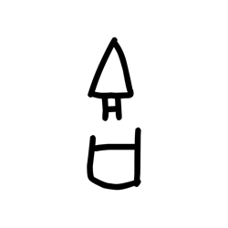

- source_zip_member: `Sub-character Images/xlscyddubk/xlscyddubk/ozxjt5llli.png`
- checksum_sha256: `e2ab9c8223ee92c976089a798d10241e9d090d1baa3d01e018969c640b56a17d`
- review_status: `needs_human_visual_review`
- caution: OBIMD subcharacter image is a source-marked review asset only; it is not a confirmed component form, component assignment, or decipherment conclusion.

## asset-014975

- source_zip_member: `Sub-character Images/xlscyddubk/xlscyddubk/pv86eamqcf.png`
- checksum_sha256: `5fd0ba679302cd6496b25b810fff12b6eac29f0f561c4b2144b8ec2dbab8219a`
- review_status: `needs_human_visual_review`
- caution: OBIMD subcharacter image is a source-marked review asset only; it is not a confirmed component form, component assignment, or decipherment conclusion.

## asset-014976

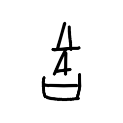

- source_zip_member: `Sub-character Images/xlscyddubk/xlscyddubk/pzk9vnuvbe.png`
- checksum_sha256: `7bdbbf6d9e011d90e843ad990fffc50a4abd37230cc056b4cb8f7d26c0f365b1`
- review_status: `needs_human_visual_review`
- caution: OBIMD subcharacter image is a source-marked review asset only; it is not a confirmed component form, component assignment, or decipherment conclusion.

## asset-014977

- source_zip_member: `Sub-character Images/xlscyddubk/xlscyddubk/qjgj6xclnd.png`
- checksum_sha256: `8936d656a6c91a38d812c6528e871dc1bbe009fb2338df3229dbd932cbf4b756`
- review_status: `needs_human_visual_review`
- caution: OBIMD subcharacter image is a source-marked review asset only; it is not a confirmed component form, component assignment, or decipherment conclusion.

## asset-014978

- source_zip_member: `Sub-character Images/xlscyddubk/xlscyddubk/qk7np6g9be.png`
- checksum_sha256: `c5e2a693406d6110fabf0a8555f8a260196eba30fcb9054e8387a1596b977b29`
- review_status: `needs_human_visual_review`
- caution: OBIMD subcharacter image is a source-marked review asset only; it is not a confirmed component form, component assignment, or decipherment conclusion.

## asset-014979

- source_zip_member: `Sub-character Images/xlscyddubk/xlscyddubk/qldcx54scq.png`
- checksum_sha256: `4eeb8621cc039c88506e4f266ec2bcb1db644a23075623836ea018e21368e229`
- review_status: `needs_human_visual_review`
- caution: OBIMD subcharacter image is a source-marked review asset only; it is not a confirmed component form, component assignment, or decipherment conclusion.

## asset-014980

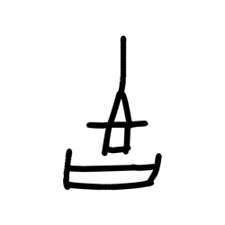

- source_zip_member: `Sub-character Images/xlscyddubk/xlscyddubk/qrm87nnjbr.png`
- checksum_sha256: `44847c378168d650853a8e44305b0b901b586b8e9c3b394b1f5d3c07390fb97e`
- review_status: `needs_human_visual_review`
- caution: OBIMD subcharacter image is a source-marked review asset only; it is not a confirmed component form, component assignment, or decipherment conclusion.

## asset-014981

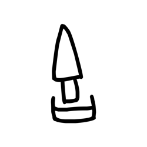

- source_zip_member: `Sub-character Images/xlscyddubk/xlscyddubk/r0uktqjw7a.png`
- checksum_sha256: `5d4884bd81b002c81cccc007e52aa785398a9571210dcba4b46c0a7bc72dfaa8`
- review_status: `needs_human_visual_review`
- caution: OBIMD subcharacter image is a source-marked review asset only; it is not a confirmed component form, component assignment, or decipherment conclusion.

## asset-014982

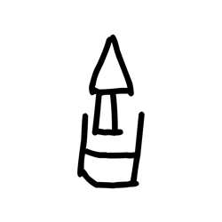

- source_zip_member: `Sub-character Images/xlscyddubk/xlscyddubk/r2ktxhoug3.png`
- checksum_sha256: `37836b3d78e9b08af0acebd7663842b8f54e005872f97fee32966972b50c73f0`
- review_status: `needs_human_visual_review`
- caution: OBIMD subcharacter image is a source-marked review asset only; it is not a confirmed component form, component assignment, or decipherment conclusion.

## asset-014983

- source_zip_member: `Sub-character Images/xlscyddubk/xlscyddubk/r9zcti94jo.png`
- checksum_sha256: `383ceee86b3e15879efe38cba47a31b4fa25eff69dd4e33a07c6589f3396f316`
- review_status: `needs_human_visual_review`
- caution: OBIMD subcharacter image is a source-marked review asset only; it is not a confirmed component form, component assignment, or decipherment conclusion.

## asset-014984

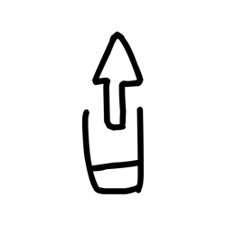

- source_zip_member: `Sub-character Images/xlscyddubk/xlscyddubk/rc0wde08p2.png`
- checksum_sha256: `7c0bd02bdebd2621d7c7fd1c0162520fee40c655280a1e1bfbb0d178d6943f4e`
- review_status: `needs_human_visual_review`
- caution: OBIMD subcharacter image is a source-marked review asset only; it is not a confirmed component form, component assignment, or decipherment conclusion.

## asset-014985

- source_zip_member: `Sub-character Images/xlscyddubk/xlscyddubk/rtizm4y16l.png`
- checksum_sha256: `3b946cb0e671265e294ddf3a0f651c3daafa9ef5ceae8617517a450d4a27330b`
- review_status: `needs_human_visual_review`
- caution: OBIMD subcharacter image is a source-marked review asset only; it is not a confirmed component form, component assignment, or decipherment conclusion.

## asset-014986

- source_zip_member: `Sub-character Images/xlscyddubk/xlscyddubk/rvfv0hpnbr.png`
- checksum_sha256: `03c5bd3a969fff22eaabf05883f35330358ee765c1beee527104a6941943c938`
- review_status: `needs_human_visual_review`
- caution: OBIMD subcharacter image is a source-marked review asset only; it is not a confirmed component form, component assignment, or decipherment conclusion.

## asset-014987

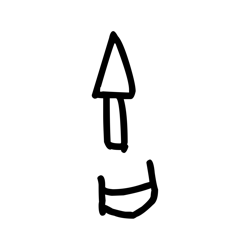

- source_zip_member: `Sub-character Images/xlscyddubk/xlscyddubk/rw1ll5qsn6.png`
- checksum_sha256: `b1b499125d31206919a875a427f9a57378d79577b245731a999d86a0db14b5c0`
- review_status: `needs_human_visual_review`
- caution: OBIMD subcharacter image is a source-marked review asset only; it is not a confirmed component form, component assignment, or decipherment conclusion.

## asset-014988

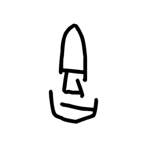

- source_zip_member: `Sub-character Images/xlscyddubk/xlscyddubk/s1piavooxo.png`
- checksum_sha256: `9bac7d30820b42cd905043b707f8f2c1818c72b4f8e5256eb75e0d7518173981`
- review_status: `needs_human_visual_review`
- caution: OBIMD subcharacter image is a source-marked review asset only; it is not a confirmed component form, component assignment, or decipherment conclusion.

## asset-014989

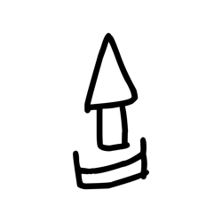

- source_zip_member: `Sub-character Images/xlscyddubk/xlscyddubk/sja6o6t62l.png`
- checksum_sha256: `350d9b9d1e7358c1982278969666d491dbb357ae1d3cd0b618a10109ca0fdee8`
- review_status: `needs_human_visual_review`
- caution: OBIMD subcharacter image is a source-marked review asset only; it is not a confirmed component form, component assignment, or decipherment conclusion.

## asset-014990

- source_zip_member: `Sub-character Images/xlscyddubk/xlscyddubk/sm2t4tczsc.png`
- checksum_sha256: `fe99218a38dda63b966daf828f7f7359b6208af8706077c0ccc5ad8626166c97`
- review_status: `needs_human_visual_review`
- caution: OBIMD subcharacter image is a source-marked review asset only; it is not a confirmed component form, component assignment, or decipherment conclusion.

## asset-014991

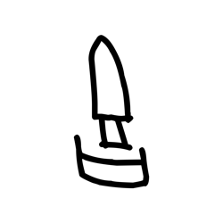

- source_zip_member: `Sub-character Images/xlscyddubk/xlscyddubk/sxf2pm0gkl.png`
- checksum_sha256: `35ad223478e0b4f03c8f80e69628b76be14a1b46ad6d510ac1ba02db8e482c3e`
- review_status: `needs_human_visual_review`
- caution: OBIMD subcharacter image is a source-marked review asset only; it is not a confirmed component form, component assignment, or decipherment conclusion.

## asset-014992

- source_zip_member: `Sub-character Images/xlscyddubk/xlscyddubk/t40y5fsd14.png`
- checksum_sha256: `532cf5bb92b6c98cae4d9ab27ebb4784fc745964d0f65e5bd5de6ae059fe1bf2`
- review_status: `needs_human_visual_review`
- caution: OBIMD subcharacter image is a source-marked review asset only; it is not a confirmed component form, component assignment, or decipherment conclusion.

## asset-014993

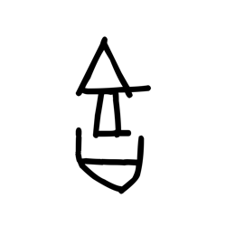

- source_zip_member: `Sub-character Images/xlscyddubk/xlscyddubk/t5loafd1sl.png`
- checksum_sha256: `a6d0a23331240fa37461466975c61eb203f8ee00affdb692494c8504ab4947a3`
- review_status: `needs_human_visual_review`
- caution: OBIMD subcharacter image is a source-marked review asset only; it is not a confirmed component form, component assignment, or decipherment conclusion.

## asset-014994

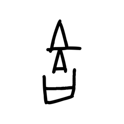

- source_zip_member: `Sub-character Images/xlscyddubk/xlscyddubk/tfs7u8qrt7.png`
- checksum_sha256: `b26e709f1b620fe9e4c5c160123f772ef5802d0a4c0f2fc359f695318b0cf221`
- review_status: `needs_human_visual_review`
- caution: OBIMD subcharacter image is a source-marked review asset only; it is not a confirmed component form, component assignment, or decipherment conclusion.

## asset-014995

- source_zip_member: `Sub-character Images/xlscyddubk/xlscyddubk/tmk9uscxt2.png`
- checksum_sha256: `96fc6c435b31424746cee00846ca3e9dfc122cd2d77524f152025cfb21f10fa3`
- review_status: `needs_human_visual_review`
- caution: OBIMD subcharacter image is a source-marked review asset only; it is not a confirmed component form, component assignment, or decipherment conclusion.

## asset-014996

- source_zip_member: `Sub-character Images/xlscyddubk/xlscyddubk/txlsho1jj6.png`
- checksum_sha256: `06ba9b6881bff831c0592828e6306543cfa48da9bc4d69fde1feead33cff9fd2`
- review_status: `needs_human_visual_review`
- caution: OBIMD subcharacter image is a source-marked review asset only; it is not a confirmed component form, component assignment, or decipherment conclusion.

## asset-014997

- source_zip_member: `Sub-character Images/xlscyddubk/xlscyddubk/u4jnm5klkr.png`
- checksum_sha256: `7b44b0e592aad2a7979d12e3ed1ebb525ff825bc8f0ae8eafc64bd7800ca12f4`
- review_status: `needs_human_visual_review`
- caution: OBIMD subcharacter image is a source-marked review asset only; it is not a confirmed component form, component assignment, or decipherment conclusion.

## asset-014998

- source_zip_member: `Sub-character Images/xlscyddubk/xlscyddubk/ua16xzno6q.png`
- checksum_sha256: `b01c3eace91838cfb33fc886552029cb0f3246ddc24ff8a5e57bf068d3a430ff`
- review_status: `needs_human_visual_review`
- caution: OBIMD subcharacter image is a source-marked review asset only; it is not a confirmed component form, component assignment, or decipherment conclusion.

## asset-014999

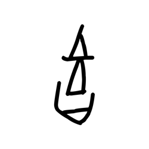

- source_zip_member: `Sub-character Images/xlscyddubk/xlscyddubk/uhx97yp267.png`
- checksum_sha256: `6f03f63318cdc32f86bea67d702c1518ae82bd9a68fd5e43431650531b87f47f`
- review_status: `needs_human_visual_review`
- caution: OBIMD subcharacter image is a source-marked review asset only; it is not a confirmed component form, component assignment, or decipherment conclusion.

## asset-015000

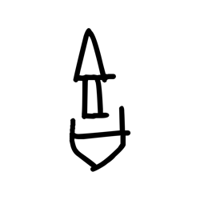

- source_zip_member: `Sub-character Images/xlscyddubk/xlscyddubk/uiww45ap6r.png`
- checksum_sha256: `5d1883f8de3391a262cfac1aac907288d8a203bcd8a373691125d3d27af0f6f5`
- review_status: `needs_human_visual_review`
- caution: OBIMD subcharacter image is a source-marked review asset only; it is not a confirmed component form, component assignment, or decipherment conclusion.

## asset-015001

- source_zip_member: `Sub-character Images/xlscyddubk/xlscyddubk/uk1iu66nxz.png`
- checksum_sha256: `232fff1d8abafe25f17dd9c164cbe9981b0e39d88da63c02f058e7e09598ede3`
- review_status: `needs_human_visual_review`
- caution: OBIMD subcharacter image is a source-marked review asset only; it is not a confirmed component form, component assignment, or decipherment conclusion.

## asset-015002

- source_zip_member: `Sub-character Images/xlscyddubk/xlscyddubk/umymfyi1lo.png`
- checksum_sha256: `fa0fd22cc2363066af6a22b02fcd929b0e5f27ba492c46bfc7cad883b7dd3df2`
- review_status: `needs_human_visual_review`
- caution: OBIMD subcharacter image is a source-marked review asset only; it is not a confirmed component form, component assignment, or decipherment conclusion.

## asset-015003

- source_zip_member: `Sub-character Images/xlscyddubk/xlscyddubk/uw5xycb953.png`
- checksum_sha256: `a454bd4120479c02b97e8bbeaf59b7ebabec7d514c2a273474e816ae2c80c230`
- review_status: `needs_human_visual_review`
- caution: OBIMD subcharacter image is a source-marked review asset only; it is not a confirmed component form, component assignment, or decipherment conclusion.

## asset-015004

- source_zip_member: `Sub-character Images/xlscyddubk/xlscyddubk/vedielafud.png`
- checksum_sha256: `a0114a7e85e8617d4d9a558ad3565fcae7b18fb87062a2a632331ce9cd0d2d13`
- review_status: `needs_human_visual_review`
- caution: OBIMD subcharacter image is a source-marked review asset only; it is not a confirmed component form, component assignment, or decipherment conclusion.

## asset-015005

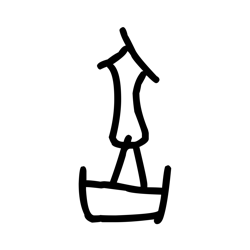

- source_zip_member: `Sub-character Images/xlscyddubk/xlscyddubk/vopxr59m78.png`
- checksum_sha256: `aadd63f87901722e10cb196ce0feb57803d24daecf9bcf44e8ce692c5fe355ed`
- review_status: `needs_human_visual_review`
- caution: OBIMD subcharacter image is a source-marked review asset only; it is not a confirmed component form, component assignment, or decipherment conclusion.

## asset-015006

- source_zip_member: `Sub-character Images/xlscyddubk/xlscyddubk/vvc8432210.png`
- checksum_sha256: `417ae11141aec10bb67d0fa8405436a6935f4507091df84731e7b99ab1ac8cbc`
- review_status: `needs_human_visual_review`
- caution: OBIMD subcharacter image is a source-marked review asset only; it is not a confirmed component form, component assignment, or decipherment conclusion.

## asset-015007

- source_zip_member: `Sub-character Images/xlscyddubk/xlscyddubk/x19kwtdoa4.png`
- checksum_sha256: `6d1ab718209111695426a38624f9de9f63a97d5373ceeb25f36c2a6e20905dc2`
- review_status: `needs_human_visual_review`
- caution: OBIMD subcharacter image is a source-marked review asset only; it is not a confirmed component form, component assignment, or decipherment conclusion.

## asset-015008

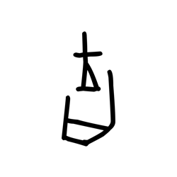

- source_zip_member: `Sub-character Images/xlscyddubk/xlscyddubk/x2o1n2xf17.png`
- checksum_sha256: `761fc5a0f71baa27e598d79c92fe6a47d77c771608ff5c7c5b71f354daee34b2`
- review_status: `needs_human_visual_review`
- caution: OBIMD subcharacter image is a source-marked review asset only; it is not a confirmed component form, component assignment, or decipherment conclusion.

## asset-015009

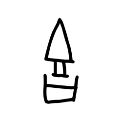

- source_zip_member: `Sub-character Images/xlscyddubk/xlscyddubk/xh0xzlw7bw.png`
- checksum_sha256: `a3d85749e99f59578010ff742ab6fad17da60ec2261be57559e0b5e60c748ee4`
- review_status: `needs_human_visual_review`
- caution: OBIMD subcharacter image is a source-marked review asset only; it is not a confirmed component form, component assignment, or decipherment conclusion.

## asset-015010

- source_zip_member: `Sub-character Images/xlscyddubk/xlscyddubk/xhvb82xyxt.png`
- checksum_sha256: `06b36e5ac9bac42411e4aca8bad58bea13e3d97fa1a68bf8d988e3c50d36cea5`
- review_status: `needs_human_visual_review`
- caution: OBIMD subcharacter image is a source-marked review asset only; it is not a confirmed component form, component assignment, or decipherment conclusion.

## asset-015011

- source_zip_member: `Sub-character Images/xlscyddubk/xlscyddubk/xkd81vqupv.png`
- checksum_sha256: `9190d283f9741d0591cbb496a4835fa8d23473248d189c7c67d1f608c3d96319`
- review_status: `needs_human_visual_review`
- caution: OBIMD subcharacter image is a source-marked review asset only; it is not a confirmed component form, component assignment, or decipherment conclusion.

## asset-015012

- source_zip_member: `Sub-character Images/xlscyddubk/xlscyddubk/xlscyddubk.png`
- checksum_sha256: `c0303758efaf0fdae5732313e06dd3635d6572ea0b2c7459c71db1e3f4b3fb24`
- review_status: `needs_human_visual_review`
- caution: OBIMD subcharacter image is a source-marked review asset only; it is not a confirmed component form, component assignment, or decipherment conclusion.

## asset-015013

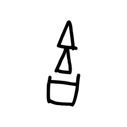

- source_zip_member: `Sub-character Images/xlscyddubk/xlscyddubk/xm78e9tdgk.png`
- checksum_sha256: `55cb6f8a38cdd68a869e41eed6666f763ddfd2f3443c4bc087bbcb4811c0826d`
- review_status: `needs_human_visual_review`
- caution: OBIMD subcharacter image is a source-marked review asset only; it is not a confirmed component form, component assignment, or decipherment conclusion.

## asset-015014

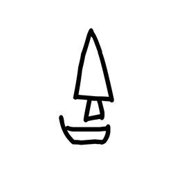

- source_zip_member: `Sub-character Images/xlscyddubk/xlscyddubk/xz7c77ikyd.png`
- checksum_sha256: `6a68c62e3a28a5e3266bea2865cf9170e621432d10ea92f53dbb2caba67db354`
- review_status: `needs_human_visual_review`
- caution: OBIMD subcharacter image is a source-marked review asset only; it is not a confirmed component form, component assignment, or decipherment conclusion.

## asset-015015

- source_zip_member: `Sub-character Images/xlscyddubk/xlscyddubk/ybot6q3blg.png`
- checksum_sha256: `27fd8fedbc9f421e6ef4b77ac9dc69ba7d2d2f002e37414924a8f9ae37596fe4`
- review_status: `needs_human_visual_review`
- caution: OBIMD subcharacter image is a source-marked review asset only; it is not a confirmed component form, component assignment, or decipherment conclusion.

## asset-015016

- source_zip_member: `Sub-character Images/xlscyddubk/xlscyddubk/yhrxykdh7n.png`
- checksum_sha256: `29a62b319567fe6cdf70270f003315066dbd3f99d808c5b11c7e8a11acfcfe7c`
- review_status: `needs_human_visual_review`
- caution: OBIMD subcharacter image is a source-marked review asset only; it is not a confirmed component form, component assignment, or decipherment conclusion.

## asset-015017

- source_zip_member: `Sub-character Images/xlscyddubk/xlscyddubk/yiby9icri1.png`
- checksum_sha256: `2d5f55857a2c813e48ec699dcc534cc2a815ecf69018f7170d898f1b2d1cb8d1`
- review_status: `needs_human_visual_review`
- caution: OBIMD subcharacter image is a source-marked review asset only; it is not a confirmed component form, component assignment, or decipherment conclusion.

## asset-015018

- source_zip_member: `Sub-character Images/xlscyddubk/xlscyddubk/yny46d2q82.png`
- checksum_sha256: `eead368b6bcae74a828e9eeef55cc714143850f3e3ef20f9173202f35a091b05`
- review_status: `needs_human_visual_review`
- caution: OBIMD subcharacter image is a source-marked review asset only; it is not a confirmed component form, component assignment, or decipherment conclusion.

## asset-015019

- source_zip_member: `Sub-character Images/xlscyddubk/xlscyddubk/yozjiz19t1.png`
- checksum_sha256: `592366cc79c2f478b7feb290bd7311bbba4dfb2ceea1403e1776b4a607162189`
- review_status: `needs_human_visual_review`
- caution: OBIMD subcharacter image is a source-marked review asset only; it is not a confirmed component form, component assignment, or decipherment conclusion.

## asset-015020

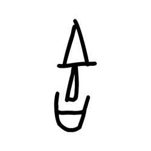

- source_zip_member: `Sub-character Images/xlscyddubk/xlscyddubk/yto8w5d0mx.png`
- checksum_sha256: `3e3fb5ae443586d4028e0ce19892f45ca8fbecd156fc7dd878a97a6b6a51b59f`
- review_status: `needs_human_visual_review`
- caution: OBIMD subcharacter image is a source-marked review asset only; it is not a confirmed component form, component assignment, or decipherment conclusion.

## asset-015021

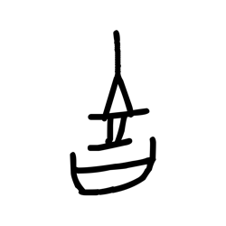

- source_zip_member: `Sub-character Images/xlscyddubk/xlscyddubk/z4bm6y36fb.png`
- checksum_sha256: `97ad706adf020de9571504a0c39133c8dbd8e6b51ca900fc7b570685b026eced`
- review_status: `needs_human_visual_review`
- caution: OBIMD subcharacter image is a source-marked review asset only; it is not a confirmed component form, component assignment, or decipherment conclusion.

## asset-015022

- source_zip_member: `Sub-character Images/xlscyddubk/xlscyddubk/zlplpvg9bq.png`
- checksum_sha256: `36ff64bfe7bc0c3d02bcdccfe5536b6849bf06bc19fbb18633f0d5cdb6e4ff72`
- review_status: `needs_human_visual_review`
- caution: OBIMD subcharacter image is a source-marked review asset only; it is not a confirmed component form, component assignment, or decipherment conclusion.

## asset-015023

- source_zip_member: `Sub-character Images/xlscyddubk/xlscyddubk/zy0tncoulk.png`
- checksum_sha256: `4d0d0d514236458334ba8dd9e2e48f5c4da0da77ccf8b852661bc61098139931`
- review_status: `needs_human_visual_review`
- caution: OBIMD subcharacter image is a source-marked review asset only; it is not a confirmed component form, component assignment, or decipherment conclusion.
