# Component Visual Gallery / 构件图像查看: obs-comp-cand-001104

English:
This page displays OBIMD subcharacter PNG assets extracted into this concrete
corpus object directory for human review.

简体中文：
本页展示抽取到当前具体 corpus 对象目录内的 OBIMD subcharacter PNG 资料，供人工复核使用。

Boundary / 边界：
dataset image candidate only; not a confirmed component form, not a component
assignment, and not a decipherment claim.
- not a confirmed component form
- not a component assignment
- not a decipherment claim

## Concrete Questions To Check / 具体待查问题

- Which local image should be opened first?
- 应先打开哪一张本地构件图像？
- Which source zip member anchors this image?
- 哪一个 source zip member 能定位这张图像？
- Which near-shape or variant comparison is still missing?
- 还缺哪些近形或异体比较？
- Which character or inscription context should be checked next?
- 下一步应核对哪些单字或卜辞上下文？
- What evidence is missing before a component assignment?
- 正式构件归属前还缺哪些证据？

## asset-015028

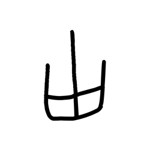

- source_zip_member: `Sub-character Images/r424gd7pwf/r424gd7pwf/3qg5va8twe.png`
- checksum_sha256: see `06_component-visual-index.csv`.
- review_status: `needs_human_visual_review`
- caution: source-marked review image only.

## asset-015029

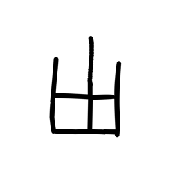

- source_zip_member: `Sub-character Images/r424gd7pwf/r424gd7pwf/6a6b9xcirb.png`
- checksum_sha256: see `06_component-visual-index.csv`.
- review_status: `needs_human_visual_review`
- caution: source-marked review image only.

## asset-015030

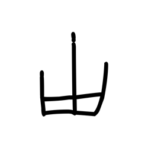

- source_zip_member: `Sub-character Images/r424gd7pwf/r424gd7pwf/bsnkhyoyia.png`
- checksum_sha256: see `06_component-visual-index.csv`.
- review_status: `needs_human_visual_review`
- caution: source-marked review image only.

## asset-015031

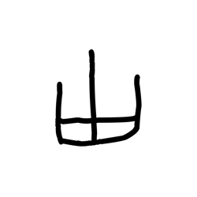

- source_zip_member: `Sub-character Images/r424gd7pwf/r424gd7pwf/e80cmk3vdc.png`
- checksum_sha256: see `06_component-visual-index.csv`.
- review_status: `needs_human_visual_review`
- caution: source-marked review image only.

## asset-015032

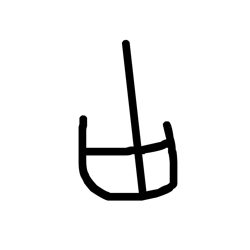

- source_zip_member: `Sub-character Images/r424gd7pwf/r424gd7pwf/emoqg1qgyg.png`
- checksum_sha256: see `06_component-visual-index.csv`.
- review_status: `needs_human_visual_review`
- caution: source-marked review image only.

## asset-015033

- source_zip_member: `Sub-character Images/r424gd7pwf/r424gd7pwf/gn40muskub.png`
- checksum_sha256: see `06_component-visual-index.csv`.
- review_status: `needs_human_visual_review`
- caution: source-marked review image only.

## asset-015034

- source_zip_member: `Sub-character Images/r424gd7pwf/r424gd7pwf/ipw02w5bb1.png`
- checksum_sha256: see `06_component-visual-index.csv`.
- review_status: `needs_human_visual_review`
- caution: source-marked review image only.

## asset-015035

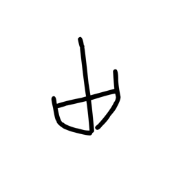

- source_zip_member: `Sub-character Images/r424gd7pwf/r424gd7pwf/jkbtw15pid.png`
- checksum_sha256: see `06_component-visual-index.csv`.
- review_status: `needs_human_visual_review`
- caution: source-marked review image only.

## asset-015036

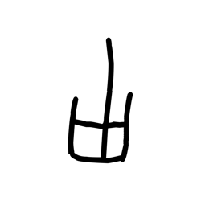

- source_zip_member: `Sub-character Images/r424gd7pwf/r424gd7pwf/knoidgxryp.png`
- checksum_sha256: see `06_component-visual-index.csv`.
- review_status: `needs_human_visual_review`
- caution: source-marked review image only.

## asset-015037

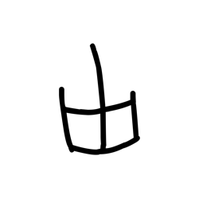

- source_zip_member: `Sub-character Images/r424gd7pwf/r424gd7pwf/mtav3grd3g.png`
- checksum_sha256: see `06_component-visual-index.csv`.
- review_status: `needs_human_visual_review`
- caution: source-marked review image only.

## asset-015038

- source_zip_member: `Sub-character Images/r424gd7pwf/r424gd7pwf/n3bwkfnwmi.png`
- checksum_sha256: see `06_component-visual-index.csv`.
- review_status: `needs_human_visual_review`
- caution: source-marked review image only.

## asset-015039

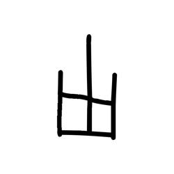

- source_zip_member: `Sub-character Images/r424gd7pwf/r424gd7pwf/p6fl529stu.png`
- checksum_sha256: see `06_component-visual-index.csv`.
- review_status: `needs_human_visual_review`
- caution: source-marked review image only.

## asset-015040

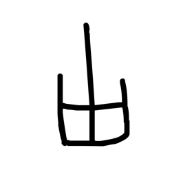

- source_zip_member: `Sub-character Images/r424gd7pwf/r424gd7pwf/pf9efj9864.png`
- checksum_sha256: see `06_component-visual-index.csv`.
- review_status: `needs_human_visual_review`
- caution: source-marked review image only.

## asset-015041

- source_zip_member: `Sub-character Images/r424gd7pwf/r424gd7pwf/q8h047vlme.png`
- checksum_sha256: see `06_component-visual-index.csv`.
- review_status: `needs_human_visual_review`
- caution: source-marked review image only.

## asset-015042

- source_zip_member: `Sub-character Images/r424gd7pwf/r424gd7pwf/qfei8vyial.png`
- checksum_sha256: see `06_component-visual-index.csv`.
- review_status: `needs_human_visual_review`
- caution: source-marked review image only.

## asset-015043

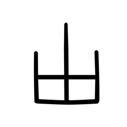

- source_zip_member: `Sub-character Images/r424gd7pwf/r424gd7pwf/r424gd7pwf.png`
- checksum_sha256: see `06_component-visual-index.csv`.
- review_status: `needs_human_visual_review`
- caution: source-marked review image only.

## asset-015044

- source_zip_member: `Sub-character Images/r424gd7pwf/r424gd7pwf/rtsukuemx2.png`
- checksum_sha256: see `06_component-visual-index.csv`.
- review_status: `needs_human_visual_review`
- caution: source-marked review image only.

## asset-015045

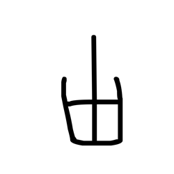

- source_zip_member: `Sub-character Images/r424gd7pwf/r424gd7pwf/xfkhkggxoq.png`
- checksum_sha256: see `06_component-visual-index.csv`.
- review_status: `needs_human_visual_review`
- caution: source-marked review image only.
