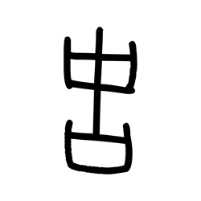
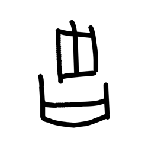
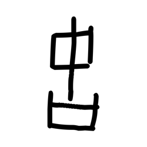
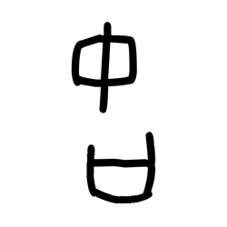
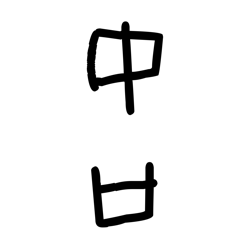
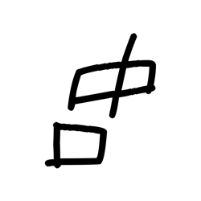
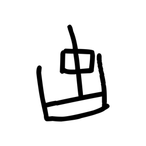
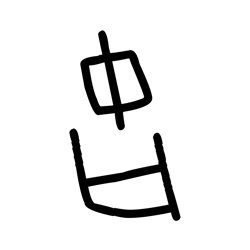

# Component Visual Gallery / 构件图像查看: obs-comp-cand-001125

English:
This page displays OBIMD subcharacter PNG assets extracted into this concrete corpus object directory for human review.

简体中文：
本页展示抽取到当前具体 corpus 对象目录内的 OBIMD subcharacter PNG 资料，供人工复核使用。

Boundary / 边界：dataset image candidate only; not a confirmed component form, component assignment, or decipherment claim.

## asset-015066

- source_zip_member: `Sub-character Images/fgo9aomfqj/fgo9aomfqj/39c9gsndm8.png`
- checksum_sha256: `d3f5023c638e6ac28c465d8ab695a5b912694f03bc517c8c0ae1aec267fb9ad0`
- review_status: `needs_human_visual_review`
- caution: OBIMD subcharacter image is a source-marked review asset only; it is not a confirmed component form, component assignment, or decipherment conclusion.

## asset-015067

- source_zip_member: `Sub-character Images/fgo9aomfqj/fgo9aomfqj/3ag36yi3ku.png`
- checksum_sha256: `f8966780d31eaf2c31f8f2d8b2fe28068381455db9345aeb8350d3b949d40b53`
- review_status: `needs_human_visual_review`
- caution: OBIMD subcharacter image is a source-marked review asset only; it is not a confirmed component form, component assignment, or decipherment conclusion.

## asset-015068

- source_zip_member: `Sub-character Images/fgo9aomfqj/fgo9aomfqj/4b8bpzczcu.png`
- checksum_sha256: `ea9ca6657bb9ec4bfebf200bd37243892c83b697753939dd02dd8cba6ffa8b66`
- review_status: `needs_human_visual_review`
- caution: OBIMD subcharacter image is a source-marked review asset only; it is not a confirmed component form, component assignment, or decipherment conclusion.

## asset-015069

- source_zip_member: `Sub-character Images/fgo9aomfqj/fgo9aomfqj/9tvdfp5jau.png`
- checksum_sha256: `081ff18304b0f2d88228ce047979c2eb791fed43a0f5e76342cddd9706aff792`
- review_status: `needs_human_visual_review`
- caution: OBIMD subcharacter image is a source-marked review asset only; it is not a confirmed component form, component assignment, or decipherment conclusion.

## asset-015070

- source_zip_member: `Sub-character Images/fgo9aomfqj/fgo9aomfqj/9ye0sztiw6.png`
- checksum_sha256: `d08af50478e78275bc25119d0a293c3e8c91e391fc6311c7613b826877dcb39f`
- review_status: `needs_human_visual_review`
- caution: OBIMD subcharacter image is a source-marked review asset only; it is not a confirmed component form, component assignment, or decipherment conclusion.

## asset-015071

- source_zip_member: `Sub-character Images/fgo9aomfqj/fgo9aomfqj/fgo9aomfqj.png`
- checksum_sha256: `8e6d2d69f52302de32b1951b6442006c767cd24b1882d3285b17b26452dcc8fd`
- review_status: `needs_human_visual_review`
- caution: OBIMD subcharacter image is a source-marked review asset only; it is not a confirmed component form, component assignment, or decipherment conclusion.

## asset-015072

- source_zip_member: `Sub-character Images/fgo9aomfqj/fgo9aomfqj/hlrcku9a3w.png`
- checksum_sha256: `86b88151e3437a37a670da973b7558f72bbeefb41dd3b549157963ceb7563d0c`
- review_status: `needs_human_visual_review`
- caution: OBIMD subcharacter image is a source-marked review asset only; it is not a confirmed component form, component assignment, or decipherment conclusion.

## asset-015073

- source_zip_member: `Sub-character Images/fgo9aomfqj/fgo9aomfqj/ls9dc9j8cn.png`
- checksum_sha256: `7537594962da513e308d52ea817ead786df53f50fda16309d15304eea2035eb8`
- review_status: `needs_human_visual_review`
- caution: OBIMD subcharacter image is a source-marked review asset only; it is not a confirmed component form, component assignment, or decipherment conclusion.

## asset-015074

- source_zip_member: `Sub-character Images/fgo9aomfqj/fgo9aomfqj/lw51ly39vy.png`
- checksum_sha256: `5697fb069f5778fb7bc3d6576bdcceeae7daaaa98e9bf02341e73d9d5dc016d1`
- review_status: `needs_human_visual_review`
- caution: OBIMD subcharacter image is a source-marked review asset only; it is not a confirmed component form, component assignment, or decipherment conclusion.

## asset-015075

- source_zip_member: `Sub-character Images/fgo9aomfqj/fgo9aomfqj/ntk49put6l.png`
- checksum_sha256: `397c37a742626d6e6901504f9875579d4d365897140829fa7f36e5f34815f158`
- review_status: `needs_human_visual_review`
- caution: OBIMD subcharacter image is a source-marked review asset only; it is not a confirmed component form, component assignment, or decipherment conclusion.

## asset-015076

- source_zip_member: `Sub-character Images/fgo9aomfqj/fgo9aomfqj/tgxn01qw23.png`
- checksum_sha256: `696d318df4f1684120959614aaab5e94b7d7b5ec14ec11bd0f105a94649aa52e`
- review_status: `needs_human_visual_review`
- caution: OBIMD subcharacter image is a source-marked review asset only; it is not a confirmed component form, component assignment, or decipherment conclusion.

## asset-015077

- source_zip_member: `Sub-character Images/fgo9aomfqj/fgo9aomfqj/uwkuv6m9j7.png`
- checksum_sha256: `3d9c98836979cd19806efd2375ef929159eca3043939633bcdf7c7dfaf86f7b1`
- review_status: `needs_human_visual_review`
- caution: OBIMD subcharacter image is a source-marked review asset only; it is not a confirmed component form, component assignment, or decipherment conclusion.

## asset-015078

- source_zip_member: `Sub-character Images/fgo9aomfqj/fgo9aomfqj/vaeshp8qnc.png`
- checksum_sha256: `741328cd1ca6b875cf9b20c45528e3c1202c061aa6f6fcf65ca4308cb69277fe`
- review_status: `needs_human_visual_review`
- caution: OBIMD subcharacter image is a source-marked review asset only; it is not a confirmed component form, component assignment, or decipherment conclusion.

## asset-015079

- source_zip_member: `Sub-character Images/fgo9aomfqj/fgo9aomfqj/vni9odcsix.png`
- checksum_sha256: `ebb6dc9dd44af8885f8e71e0a07cfa6f0e5501f521cf06116a05aa7a433bf80e`
- review_status: `needs_human_visual_review`
- caution: OBIMD subcharacter image is a source-marked review asset only; it is not a confirmed component form, component assignment, or decipherment conclusion.
