# Component Visual Gallery / 构件图像查看: obs-comp-cand-001141

English:
This page displays OBIMD subcharacter PNG assets extracted into this concrete
corpus object directory for human review.

简体中文：
本页展示抽取到当前具体 corpus 对象目录内的 OBIMD subcharacter PNG 资料，供人工复核使用。

Boundary / 边界：
dataset image candidate only; not a confirmed component form, not a component
assignment, and not a decipherment claim.
- not a confirmed component form
- not a component assignment
- not a decipherment claim

## Concrete Questions To Check / 具体待查问题

- Open 06_component-visual-index.csv and name the local image row.
- 打开 06_component-visual-index.csv，写明本地图像行。
- Open 09_component-visual-route-index.csv and name the source route row.
- 打开 09_component-visual-route-index.csv，写明来源路线行。
- Open 13_component-context-evidence-dossier.md for character context.
- 打开 13_component-context-evidence-dossier.md，核对单字与卜辞上下文。
- Record the missing image, near-shape, source, or context route.
- 记录缺失的图像、近形、来源或上下文路线。

## asset-015095

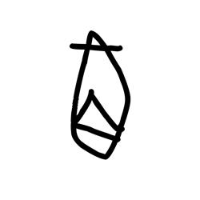

- source_zip_member: `Sub-character Images/vwahtur1cj/vwahtur1cj/0tmf9tz3ge.png`
- checksum_sha256: see `06_component-visual-index.csv`.
- review_status: `needs_human_visual_review`
- caution: source-marked review image only.

## asset-015096

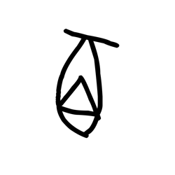

- source_zip_member: `Sub-character Images/vwahtur1cj/vwahtur1cj/1gikhl2ojy.png`
- checksum_sha256: see `06_component-visual-index.csv`.
- review_status: `needs_human_visual_review`
- caution: source-marked review image only.

## asset-015097

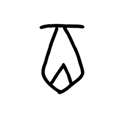

- source_zip_member: `Sub-character Images/vwahtur1cj/vwahtur1cj/28plhrt18j.png`
- checksum_sha256: see `06_component-visual-index.csv`.
- review_status: `needs_human_visual_review`
- caution: source-marked review image only.

## asset-015098

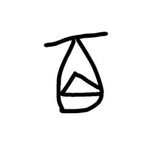

- source_zip_member: `Sub-character Images/vwahtur1cj/vwahtur1cj/2hn7n0kp0r.png`
- checksum_sha256: see `06_component-visual-index.csv`.
- review_status: `needs_human_visual_review`
- caution: source-marked review image only.

## asset-015099

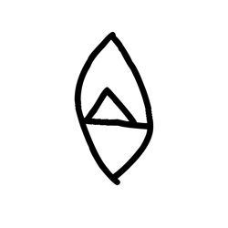

- source_zip_member: `Sub-character Images/vwahtur1cj/vwahtur1cj/3pb8n3ryr3.png`
- checksum_sha256: see `06_component-visual-index.csv`.
- review_status: `needs_human_visual_review`
- caution: source-marked review image only.

## asset-015100

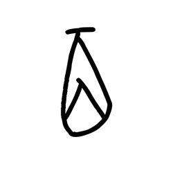

- source_zip_member: `Sub-character Images/vwahtur1cj/vwahtur1cj/3rqa8ktyv6.png`
- checksum_sha256: see `06_component-visual-index.csv`.
- review_status: `needs_human_visual_review`
- caution: source-marked review image only.

## asset-015101

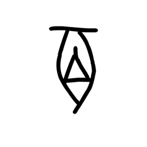

- source_zip_member: `Sub-character Images/vwahtur1cj/vwahtur1cj/3yf4cqdrvh.png`
- checksum_sha256: see `06_component-visual-index.csv`.
- review_status: `needs_human_visual_review`
- caution: source-marked review image only.

## asset-015102

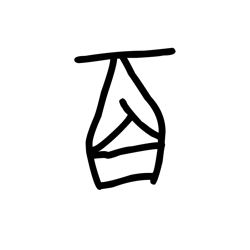

- source_zip_member: `Sub-character Images/vwahtur1cj/vwahtur1cj/44jhwhbjag.png`
- checksum_sha256: see `06_component-visual-index.csv`.
- review_status: `needs_human_visual_review`
- caution: source-marked review image only.

## asset-015103

- source_zip_member: `Sub-character Images/vwahtur1cj/vwahtur1cj/45qhc2raed.png`
- checksum_sha256: see `06_component-visual-index.csv`.
- review_status: `needs_human_visual_review`
- caution: source-marked review image only.

## asset-015104

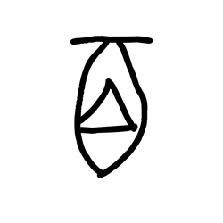

- source_zip_member: `Sub-character Images/vwahtur1cj/vwahtur1cj/6xc9cp0upn.png`
- checksum_sha256: see `06_component-visual-index.csv`.
- review_status: `needs_human_visual_review`
- caution: source-marked review image only.

## asset-015105

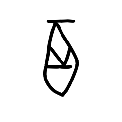

- source_zip_member: `Sub-character Images/vwahtur1cj/vwahtur1cj/6xvu3avmn4.png`
- checksum_sha256: see `06_component-visual-index.csv`.
- review_status: `needs_human_visual_review`
- caution: source-marked review image only.

## asset-015106

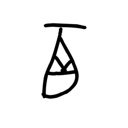

- source_zip_member: `Sub-character Images/vwahtur1cj/vwahtur1cj/7sz9w4i88h.png`
- checksum_sha256: see `06_component-visual-index.csv`.
- review_status: `needs_human_visual_review`
- caution: source-marked review image only.

## asset-015107

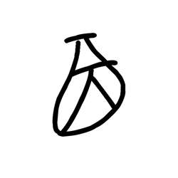

- source_zip_member: `Sub-character Images/vwahtur1cj/vwahtur1cj/7tuc3rplhw.png`
- checksum_sha256: see `06_component-visual-index.csv`.
- review_status: `needs_human_visual_review`
- caution: source-marked review image only.

## asset-015108

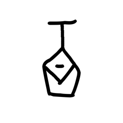

- source_zip_member: `Sub-character Images/vwahtur1cj/vwahtur1cj/bqyzev6s9i.png`
- checksum_sha256: see `06_component-visual-index.csv`.
- review_status: `needs_human_visual_review`
- caution: source-marked review image only.

## asset-015109

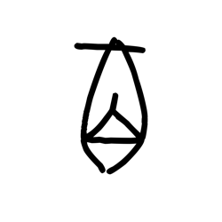

- source_zip_member: `Sub-character Images/vwahtur1cj/vwahtur1cj/bt5427rpdc.png`
- checksum_sha256: see `06_component-visual-index.csv`.
- review_status: `needs_human_visual_review`
- caution: source-marked review image only.

## asset-015110

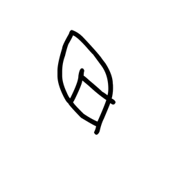

- source_zip_member: `Sub-character Images/vwahtur1cj/vwahtur1cj/cdk5zlg3bf.png`
- checksum_sha256: see `06_component-visual-index.csv`.
- review_status: `needs_human_visual_review`
- caution: source-marked review image only.

## asset-015111

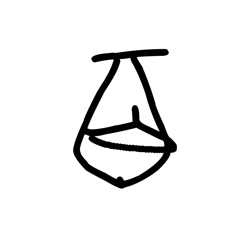

- source_zip_member: `Sub-character Images/vwahtur1cj/vwahtur1cj/f7bts6yps0.png`
- checksum_sha256: see `06_component-visual-index.csv`.
- review_status: `needs_human_visual_review`
- caution: source-marked review image only.

## asset-015112

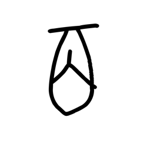

- source_zip_member: `Sub-character Images/vwahtur1cj/vwahtur1cj/f8m4eo14h2.png`
- checksum_sha256: see `06_component-visual-index.csv`.
- review_status: `needs_human_visual_review`
- caution: source-marked review image only.

## asset-015113

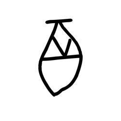

- source_zip_member: `Sub-character Images/vwahtur1cj/vwahtur1cj/fwy44a44qg.png`
- checksum_sha256: see `06_component-visual-index.csv`.
- review_status: `needs_human_visual_review`
- caution: source-marked review image only.

## asset-015114

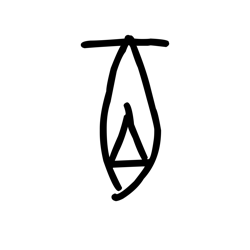

- source_zip_member: `Sub-character Images/vwahtur1cj/vwahtur1cj/gy2rrhp21s.png`
- checksum_sha256: see `06_component-visual-index.csv`.
- review_status: `needs_human_visual_review`
- caution: source-marked review image only.

## asset-015115

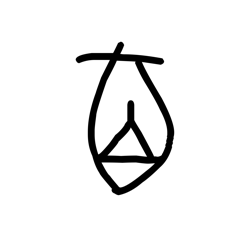

- source_zip_member: `Sub-character Images/vwahtur1cj/vwahtur1cj/jiuc9tjl68.png`
- checksum_sha256: see `06_component-visual-index.csv`.
- review_status: `needs_human_visual_review`
- caution: source-marked review image only.

## asset-015116

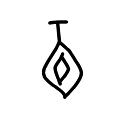

- source_zip_member: `Sub-character Images/vwahtur1cj/vwahtur1cj/jtk16aa4jt.png`
- checksum_sha256: see `06_component-visual-index.csv`.
- review_status: `needs_human_visual_review`
- caution: source-marked review image only.

## asset-015117

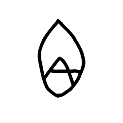

- source_zip_member: `Sub-character Images/vwahtur1cj/vwahtur1cj/lwwczyy92x.png`
- checksum_sha256: see `06_component-visual-index.csv`.
- review_status: `needs_human_visual_review`
- caution: source-marked review image only.

## asset-015118

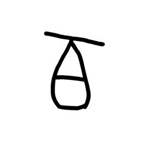

- source_zip_member: `Sub-character Images/vwahtur1cj/vwahtur1cj/m3q6uk17p9.png`
- checksum_sha256: see `06_component-visual-index.csv`.
- review_status: `needs_human_visual_review`
- caution: source-marked review image only.

## asset-015119

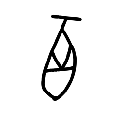

- source_zip_member: `Sub-character Images/vwahtur1cj/vwahtur1cj/o9cntce3ek.png`
- checksum_sha256: see `06_component-visual-index.csv`.
- review_status: `needs_human_visual_review`
- caution: source-marked review image only.

## asset-015120

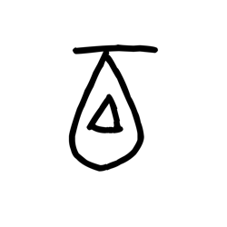

- source_zip_member: `Sub-character Images/vwahtur1cj/vwahtur1cj/oq2q4u4vxl.png`
- checksum_sha256: see `06_component-visual-index.csv`.
- review_status: `needs_human_visual_review`
- caution: source-marked review image only.

## asset-015121

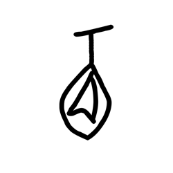

- source_zip_member: `Sub-character Images/vwahtur1cj/vwahtur1cj/ouw4bqj8lr.png`
- checksum_sha256: see `06_component-visual-index.csv`.
- review_status: `needs_human_visual_review`
- caution: source-marked review image only.

## asset-015122

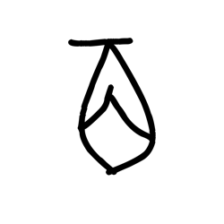

- source_zip_member: `Sub-character Images/vwahtur1cj/vwahtur1cj/p52bbz2dgq.png`
- checksum_sha256: see `06_component-visual-index.csv`.
- review_status: `needs_human_visual_review`
- caution: source-marked review image only.

## asset-015123

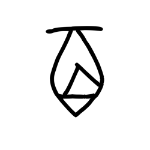

- source_zip_member: `Sub-character Images/vwahtur1cj/vwahtur1cj/pqhy01by2y.png`
- checksum_sha256: see `06_component-visual-index.csv`.
- review_status: `needs_human_visual_review`
- caution: source-marked review image only.

## asset-015124

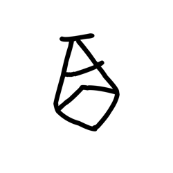

- source_zip_member: `Sub-character Images/vwahtur1cj/vwahtur1cj/qzr57he2ye.png`
- checksum_sha256: see `06_component-visual-index.csv`.
- review_status: `needs_human_visual_review`
- caution: source-marked review image only.

## asset-015125

- source_zip_member: `Sub-character Images/vwahtur1cj/vwahtur1cj/risbyvr2p9.png`
- checksum_sha256: see `06_component-visual-index.csv`.
- review_status: `needs_human_visual_review`
- caution: source-marked review image only.

## asset-015126

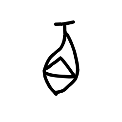

- source_zip_member: `Sub-character Images/vwahtur1cj/vwahtur1cj/rtjujhsy5h.png`
- checksum_sha256: see `06_component-visual-index.csv`.
- review_status: `needs_human_visual_review`
- caution: source-marked review image only.

## asset-015127

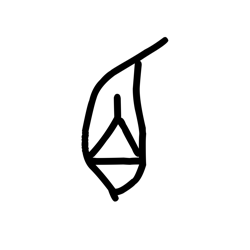

- source_zip_member: `Sub-character Images/vwahtur1cj/vwahtur1cj/sss17j21jk.png`
- checksum_sha256: see `06_component-visual-index.csv`.
- review_status: `needs_human_visual_review`
- caution: source-marked review image only.

## asset-015128

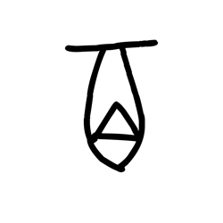

- source_zip_member: `Sub-character Images/vwahtur1cj/vwahtur1cj/udaahfoh4m.png`
- checksum_sha256: see `06_component-visual-index.csv`.
- review_status: `needs_human_visual_review`
- caution: source-marked review image only.

## asset-015129

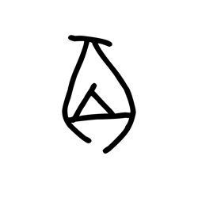

- source_zip_member: `Sub-character Images/vwahtur1cj/vwahtur1cj/ugu8gq6npt.png`
- checksum_sha256: see `06_component-visual-index.csv`.
- review_status: `needs_human_visual_review`
- caution: source-marked review image only.

## asset-015130

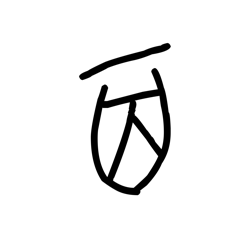

- source_zip_member: `Sub-character Images/vwahtur1cj/vwahtur1cj/vnvosb4mf2.png`
- checksum_sha256: see `06_component-visual-index.csv`.
- review_status: `needs_human_visual_review`
- caution: source-marked review image only.

## asset-015131

- source_zip_member: `Sub-character Images/vwahtur1cj/vwahtur1cj/vtqq55clix.png`
- checksum_sha256: see `06_component-visual-index.csv`.
- review_status: `needs_human_visual_review`
- caution: source-marked review image only.

## asset-015132

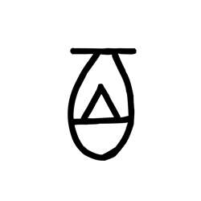

- source_zip_member: `Sub-character Images/vwahtur1cj/vwahtur1cj/vwahtur1cj.png`
- checksum_sha256: see `06_component-visual-index.csv`.
- review_status: `needs_human_visual_review`
- caution: source-marked review image only.

## asset-015133

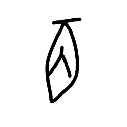

- source_zip_member: `Sub-character Images/vwahtur1cj/vwahtur1cj/wdtjg51i7b.png`
- checksum_sha256: see `06_component-visual-index.csv`.
- review_status: `needs_human_visual_review`
- caution: source-marked review image only.

## asset-015134

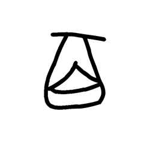

- source_zip_member: `Sub-character Images/vwahtur1cj/vwahtur1cj/xzdui9z37f.png`
- checksum_sha256: see `06_component-visual-index.csv`.
- review_status: `needs_human_visual_review`
- caution: source-marked review image only.

## asset-015135

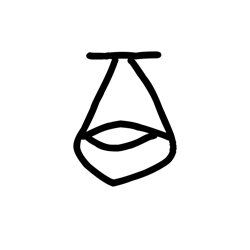

- source_zip_member: `Sub-character Images/vwahtur1cj/vwahtur1cj/yr8af0oo2m.png`
- checksum_sha256: see `06_component-visual-index.csv`.
- review_status: `needs_human_visual_review`
- caution: source-marked review image only.
