# Component Visual Gallery / 构件图像查看: obs-comp-cand-001142

English:
This page displays OBIMD subcharacter PNG assets extracted into this concrete
corpus object directory for human review.

简体中文：
本页展示抽取到当前具体 corpus 对象目录内的 OBIMD subcharacter PNG 资料，供人工复核使用。

Boundary / 边界：
dataset image candidate only; not a confirmed component form, not a component
assignment, and not a decipherment claim.
- not a confirmed component form
- not a component assignment
- not a decipherment claim

## Concrete Questions To Check / 具体待查问题

- Which local image should be opened first?
- 应先打开哪一张本地构件图像？
- Which source zip member anchors this image?
- 哪一个 source zip member 能定位这张图像？
- Which near-shape or variant comparison is still missing?
- 还缺哪些近形或异体比较？
- Which character or inscription context should be checked next?
- 下一步应核对哪些单字或卜辞上下文？
- What evidence is missing before a component assignment?
- 正式构件归属前还缺哪些证据？

## asset-015136

- source_zip_member: `Sub-character Images/c40r3zyq5t/c40r3zyq5t/1pb15ex6dd.png`
- checksum_sha256: see `06_component-visual-index.csv`.
- review_status: `needs_human_visual_review`
- caution: source-marked review image only.

## asset-015137

- source_zip_member: `Sub-character Images/c40r3zyq5t/c40r3zyq5t/26bqbfyi2p.png`
- checksum_sha256: see `06_component-visual-index.csv`.
- review_status: `needs_human_visual_review`
- caution: source-marked review image only.

## asset-015138

- source_zip_member: `Sub-character Images/c40r3zyq5t/c40r3zyq5t/2azq1ldaan.png`
- checksum_sha256: see `06_component-visual-index.csv`.
- review_status: `needs_human_visual_review`
- caution: source-marked review image only.

## asset-015139

- source_zip_member: `Sub-character Images/c40r3zyq5t/c40r3zyq5t/32u7sgye0v.png`
- checksum_sha256: see `06_component-visual-index.csv`.
- review_status: `needs_human_visual_review`
- caution: source-marked review image only.

## asset-015140

- source_zip_member: `Sub-character Images/c40r3zyq5t/c40r3zyq5t/4bmzzea1d4.png`
- checksum_sha256: see `06_component-visual-index.csv`.
- review_status: `needs_human_visual_review`
- caution: source-marked review image only.

## asset-015141

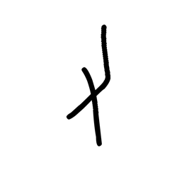

- source_zip_member: `Sub-character Images/c40r3zyq5t/c40r3zyq5t/5ixg7vr5mu.png`
- checksum_sha256: see `06_component-visual-index.csv`.
- review_status: `needs_human_visual_review`
- caution: source-marked review image only.

## asset-015142

- source_zip_member: `Sub-character Images/c40r3zyq5t/c40r3zyq5t/5lguc25wop.png`
- checksum_sha256: see `06_component-visual-index.csv`.
- review_status: `needs_human_visual_review`
- caution: source-marked review image only.

## asset-015143

- source_zip_member: `Sub-character Images/c40r3zyq5t/c40r3zyq5t/6dojtugrx8.png`
- checksum_sha256: see `06_component-visual-index.csv`.
- review_status: `needs_human_visual_review`
- caution: source-marked review image only.

## asset-015144

- source_zip_member: `Sub-character Images/c40r3zyq5t/c40r3zyq5t/6xbij46k3h.png`
- checksum_sha256: see `06_component-visual-index.csv`.
- review_status: `needs_human_visual_review`
- caution: source-marked review image only.

## asset-015145

- source_zip_member: `Sub-character Images/c40r3zyq5t/c40r3zyq5t/73hb9x4xzv.png`
- checksum_sha256: see `06_component-visual-index.csv`.
- review_status: `needs_human_visual_review`
- caution: source-marked review image only.

## asset-015146

- source_zip_member: `Sub-character Images/c40r3zyq5t/c40r3zyq5t/78n0k5bijc.png`
- checksum_sha256: see `06_component-visual-index.csv`.
- review_status: `needs_human_visual_review`
- caution: source-marked review image only.

## asset-015147

- source_zip_member: `Sub-character Images/c40r3zyq5t/c40r3zyq5t/7zn7aoqyfv.png`
- checksum_sha256: see `06_component-visual-index.csv`.
- review_status: `needs_human_visual_review`
- caution: source-marked review image only.

## asset-015148

- source_zip_member: `Sub-character Images/c40r3zyq5t/c40r3zyq5t/7zw1oc597i.png`
- checksum_sha256: see `06_component-visual-index.csv`.
- review_status: `needs_human_visual_review`
- caution: source-marked review image only.

## asset-015149

- source_zip_member: `Sub-character Images/c40r3zyq5t/c40r3zyq5t/834091bqvk.png`
- checksum_sha256: see `06_component-visual-index.csv`.
- review_status: `needs_human_visual_review`
- caution: source-marked review image only.

## asset-015150

- source_zip_member: `Sub-character Images/c40r3zyq5t/c40r3zyq5t/9946bxsb9n.png`
- checksum_sha256: see `06_component-visual-index.csv`.
- review_status: `needs_human_visual_review`
- caution: source-marked review image only.

## asset-015151

- source_zip_member: `Sub-character Images/c40r3zyq5t/c40r3zyq5t/b1c8hjyn5e.png`
- checksum_sha256: see `06_component-visual-index.csv`.
- review_status: `needs_human_visual_review`
- caution: source-marked review image only.

## asset-015152

- source_zip_member: `Sub-character Images/c40r3zyq5t/c40r3zyq5t/bktc41dvh5.png`
- checksum_sha256: see `06_component-visual-index.csv`.
- review_status: `needs_human_visual_review`
- caution: source-marked review image only.

## asset-015153

- source_zip_member: `Sub-character Images/c40r3zyq5t/c40r3zyq5t/bvgdbs1yh9.png`
- checksum_sha256: see `06_component-visual-index.csv`.
- review_status: `needs_human_visual_review`
- caution: source-marked review image only.

## asset-015154

- source_zip_member: `Sub-character Images/c40r3zyq5t/c40r3zyq5t/c3xxqo50vi.png`
- checksum_sha256: see `06_component-visual-index.csv`.
- review_status: `needs_human_visual_review`
- caution: source-marked review image only.

## asset-015155

- source_zip_member: `Sub-character Images/c40r3zyq5t/c40r3zyq5t/c40r3zyq5t.png`
- checksum_sha256: see `06_component-visual-index.csv`.
- review_status: `needs_human_visual_review`
- caution: source-marked review image only.

## asset-015156

- source_zip_member: `Sub-character Images/c40r3zyq5t/c40r3zyq5t/cj36p4zmrp.png`
- checksum_sha256: see `06_component-visual-index.csv`.
- review_status: `needs_human_visual_review`
- caution: source-marked review image only.

## asset-015157

- source_zip_member: `Sub-character Images/c40r3zyq5t/c40r3zyq5t/ckrhcpdiwd.png`
- checksum_sha256: see `06_component-visual-index.csv`.
- review_status: `needs_human_visual_review`
- caution: source-marked review image only.

## asset-015158

- source_zip_member: `Sub-character Images/c40r3zyq5t/c40r3zyq5t/cmaf75ogpc.png`
- checksum_sha256: see `06_component-visual-index.csv`.
- review_status: `needs_human_visual_review`
- caution: source-marked review image only.

## asset-015159

- source_zip_member: `Sub-character Images/c40r3zyq5t/c40r3zyq5t/dwkkjihbnb.png`
- checksum_sha256: see `06_component-visual-index.csv`.
- review_status: `needs_human_visual_review`
- caution: source-marked review image only.

## asset-015160

- source_zip_member: `Sub-character Images/c40r3zyq5t/c40r3zyq5t/fac59tc4w2.png`
- checksum_sha256: see `06_component-visual-index.csv`.
- review_status: `needs_human_visual_review`
- caution: source-marked review image only.

## asset-015161

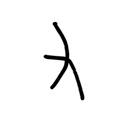

- source_zip_member: `Sub-character Images/c40r3zyq5t/c40r3zyq5t/fq44a301o4.png`
- checksum_sha256: see `06_component-visual-index.csv`.
- review_status: `needs_human_visual_review`
- caution: source-marked review image only.

## asset-015162

- source_zip_member: `Sub-character Images/c40r3zyq5t/c40r3zyq5t/fvrpfvthh9.png`
- checksum_sha256: see `06_component-visual-index.csv`.
- review_status: `needs_human_visual_review`
- caution: source-marked review image only.

## asset-015163

- source_zip_member: `Sub-character Images/c40r3zyq5t/c40r3zyq5t/gc48y4ma49.png`
- checksum_sha256: see `06_component-visual-index.csv`.
- review_status: `needs_human_visual_review`
- caution: source-marked review image only.

## asset-015164

- source_zip_member: `Sub-character Images/c40r3zyq5t/c40r3zyq5t/gi7hbe5xwg.png`
- checksum_sha256: see `06_component-visual-index.csv`.
- review_status: `needs_human_visual_review`
- caution: source-marked review image only.

## asset-015165

- source_zip_member: `Sub-character Images/c40r3zyq5t/c40r3zyq5t/h4n8kwegft.png`
- checksum_sha256: see `06_component-visual-index.csv`.
- review_status: `needs_human_visual_review`
- caution: source-marked review image only.

## asset-015166

- source_zip_member: `Sub-character Images/c40r3zyq5t/c40r3zyq5t/h8plka9a1x.png`
- checksum_sha256: see `06_component-visual-index.csv`.
- review_status: `needs_human_visual_review`
- caution: source-marked review image only.

## asset-015167

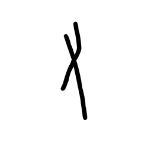

- source_zip_member: `Sub-character Images/c40r3zyq5t/c40r3zyq5t/hkj2vi2auh.png`
- checksum_sha256: see `06_component-visual-index.csv`.
- review_status: `needs_human_visual_review`
- caution: source-marked review image only.

## asset-015168

- source_zip_member: `Sub-character Images/c40r3zyq5t/c40r3zyq5t/ht33ayzrpv.png`
- checksum_sha256: see `06_component-visual-index.csv`.
- review_status: `needs_human_visual_review`
- caution: source-marked review image only.

## asset-015169

- source_zip_member: `Sub-character Images/c40r3zyq5t/c40r3zyq5t/iapjpzshwd.png`
- checksum_sha256: see `06_component-visual-index.csv`.
- review_status: `needs_human_visual_review`
- caution: source-marked review image only.

## asset-015170

- source_zip_member: `Sub-character Images/c40r3zyq5t/c40r3zyq5t/icqbc9ydbz.png`
- checksum_sha256: see `06_component-visual-index.csv`.
- review_status: `needs_human_visual_review`
- caution: source-marked review image only.

## asset-015171

- source_zip_member: `Sub-character Images/c40r3zyq5t/c40r3zyq5t/ihg7mgzkcb.png`
- checksum_sha256: see `06_component-visual-index.csv`.
- review_status: `needs_human_visual_review`
- caution: source-marked review image only.

## asset-015172

- source_zip_member: `Sub-character Images/c40r3zyq5t/c40r3zyq5t/jhwkcd2uzz.png`
- checksum_sha256: see `06_component-visual-index.csv`.
- review_status: `needs_human_visual_review`
- caution: source-marked review image only.

## asset-015173

- source_zip_member: `Sub-character Images/c40r3zyq5t/c40r3zyq5t/kgnwsnlxog.png`
- checksum_sha256: see `06_component-visual-index.csv`.
- review_status: `needs_human_visual_review`
- caution: source-marked review image only.

## asset-015174

- source_zip_member: `Sub-character Images/c40r3zyq5t/c40r3zyq5t/knlgr5redf.png`
- checksum_sha256: see `06_component-visual-index.csv`.
- review_status: `needs_human_visual_review`
- caution: source-marked review image only.

## asset-015175

- source_zip_member: `Sub-character Images/c40r3zyq5t/c40r3zyq5t/kt87og08ok.png`
- checksum_sha256: see `06_component-visual-index.csv`.
- review_status: `needs_human_visual_review`
- caution: source-marked review image only.

## asset-015176

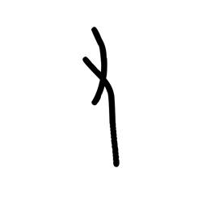

- source_zip_member: `Sub-character Images/c40r3zyq5t/c40r3zyq5t/lpk4mjxilb.png`
- checksum_sha256: see `06_component-visual-index.csv`.
- review_status: `needs_human_visual_review`
- caution: source-marked review image only.

## asset-015177

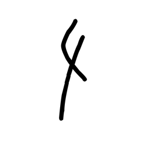

- source_zip_member: `Sub-character Images/c40r3zyq5t/c40r3zyq5t/luk6wodyim.png`
- checksum_sha256: see `06_component-visual-index.csv`.
- review_status: `needs_human_visual_review`
- caution: source-marked review image only.

## asset-015178

- source_zip_member: `Sub-character Images/c40r3zyq5t/c40r3zyq5t/lupgna9avf.png`
- checksum_sha256: see `06_component-visual-index.csv`.
- review_status: `needs_human_visual_review`
- caution: source-marked review image only.

## asset-015179

- source_zip_member: `Sub-character Images/c40r3zyq5t/c40r3zyq5t/lxzvpka2i3.png`
- checksum_sha256: see `06_component-visual-index.csv`.
- review_status: `needs_human_visual_review`
- caution: source-marked review image only.

## asset-015180

- source_zip_member: `Sub-character Images/c40r3zyq5t/c40r3zyq5t/m0mtol6w9e.png`
- checksum_sha256: see `06_component-visual-index.csv`.
- review_status: `needs_human_visual_review`
- caution: source-marked review image only.

## asset-015181

- source_zip_member: `Sub-character Images/c40r3zyq5t/c40r3zyq5t/mcg0r0vloy.png`
- checksum_sha256: see `06_component-visual-index.csv`.
- review_status: `needs_human_visual_review`
- caution: source-marked review image only.

## asset-015182

- source_zip_member: `Sub-character Images/c40r3zyq5t/c40r3zyq5t/myesa0k7oq.png`
- checksum_sha256: see `06_component-visual-index.csv`.
- review_status: `needs_human_visual_review`
- caution: source-marked review image only.

## asset-015183

- source_zip_member: `Sub-character Images/c40r3zyq5t/c40r3zyq5t/n0snaioxes.png`
- checksum_sha256: see `06_component-visual-index.csv`.
- review_status: `needs_human_visual_review`
- caution: source-marked review image only.

## asset-015184

- source_zip_member: `Sub-character Images/c40r3zyq5t/c40r3zyq5t/n2wwy5ret8.png`
- checksum_sha256: see `06_component-visual-index.csv`.
- review_status: `needs_human_visual_review`
- caution: source-marked review image only.

## asset-015185

- source_zip_member: `Sub-character Images/c40r3zyq5t/c40r3zyq5t/nczluc5ndg.png`
- checksum_sha256: see `06_component-visual-index.csv`.
- review_status: `needs_human_visual_review`
- caution: source-marked review image only.

## asset-015186

- source_zip_member: `Sub-character Images/c40r3zyq5t/c40r3zyq5t/niue06nh6z.png`
- checksum_sha256: see `06_component-visual-index.csv`.
- review_status: `needs_human_visual_review`
- caution: source-marked review image only.

## asset-015187

- source_zip_member: `Sub-character Images/c40r3zyq5t/c40r3zyq5t/nmau29aroi.png`
- checksum_sha256: see `06_component-visual-index.csv`.
- review_status: `needs_human_visual_review`
- caution: source-marked review image only.

## asset-015188

- source_zip_member: `Sub-character Images/c40r3zyq5t/c40r3zyq5t/nrk3vlg1jx.png`
- checksum_sha256: see `06_component-visual-index.csv`.
- review_status: `needs_human_visual_review`
- caution: source-marked review image only.

## asset-015189

- source_zip_member: `Sub-character Images/c40r3zyq5t/c40r3zyq5t/o0h1vd7sql.png`
- checksum_sha256: see `06_component-visual-index.csv`.
- review_status: `needs_human_visual_review`
- caution: source-marked review image only.

## asset-015190

- source_zip_member: `Sub-character Images/c40r3zyq5t/c40r3zyq5t/o46c77yayu.png`
- checksum_sha256: see `06_component-visual-index.csv`.
- review_status: `needs_human_visual_review`
- caution: source-marked review image only.

## asset-015191

- source_zip_member: `Sub-character Images/c40r3zyq5t/c40r3zyq5t/oy2dijuetm.png`
- checksum_sha256: see `06_component-visual-index.csv`.
- review_status: `needs_human_visual_review`
- caution: source-marked review image only.

## asset-015192

- source_zip_member: `Sub-character Images/c40r3zyq5t/c40r3zyq5t/p2qds85kdf.png`
- checksum_sha256: see `06_component-visual-index.csv`.
- review_status: `needs_human_visual_review`
- caution: source-marked review image only.

## asset-015193

- source_zip_member: `Sub-character Images/c40r3zyq5t/c40r3zyq5t/p37ywyhkms.png`
- checksum_sha256: see `06_component-visual-index.csv`.
- review_status: `needs_human_visual_review`
- caution: source-marked review image only.

## asset-015194

- source_zip_member: `Sub-character Images/c40r3zyq5t/c40r3zyq5t/q22sg491o2.png`
- checksum_sha256: see `06_component-visual-index.csv`.
- review_status: `needs_human_visual_review`
- caution: source-marked review image only.

## asset-015195

- source_zip_member: `Sub-character Images/c40r3zyq5t/c40r3zyq5t/q6a1gbyx02.png`
- checksum_sha256: see `06_component-visual-index.csv`.
- review_status: `needs_human_visual_review`
- caution: source-marked review image only.

## asset-015196

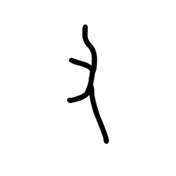

- source_zip_member: `Sub-character Images/c40r3zyq5t/c40r3zyq5t/qkkc6x095i.png`
- checksum_sha256: see `06_component-visual-index.csv`.
- review_status: `needs_human_visual_review`
- caution: source-marked review image only.

## asset-015197

- source_zip_member: `Sub-character Images/c40r3zyq5t/c40r3zyq5t/qrefv1r5yj.png`
- checksum_sha256: see `06_component-visual-index.csv`.
- review_status: `needs_human_visual_review`
- caution: source-marked review image only.

## asset-015198

- source_zip_member: `Sub-character Images/c40r3zyq5t/c40r3zyq5t/rur4ee7pzs.png`
- checksum_sha256: see `06_component-visual-index.csv`.
- review_status: `needs_human_visual_review`
- caution: source-marked review image only.

## asset-015199

- source_zip_member: `Sub-character Images/c40r3zyq5t/c40r3zyq5t/s2n9lyg8iy.png`
- checksum_sha256: see `06_component-visual-index.csv`.
- review_status: `needs_human_visual_review`
- caution: source-marked review image only.

## asset-015200

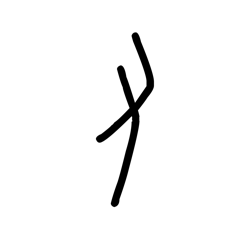

- source_zip_member: `Sub-character Images/c40r3zyq5t/c40r3zyq5t/sipu3ymnc0.png`
- checksum_sha256: see `06_component-visual-index.csv`.
- review_status: `needs_human_visual_review`
- caution: source-marked review image only.

## asset-015201

- source_zip_member: `Sub-character Images/c40r3zyq5t/c40r3zyq5t/smszwhb5f5.png`
- checksum_sha256: see `06_component-visual-index.csv`.
- review_status: `needs_human_visual_review`
- caution: source-marked review image only.

## asset-015202

- source_zip_member: `Sub-character Images/c40r3zyq5t/c40r3zyq5t/sy1esgprve.png`
- checksum_sha256: see `06_component-visual-index.csv`.
- review_status: `needs_human_visual_review`
- caution: source-marked review image only.

## asset-015203

- source_zip_member: `Sub-character Images/c40r3zyq5t/c40r3zyq5t/tmb1or8kbi.png`
- checksum_sha256: see `06_component-visual-index.csv`.
- review_status: `needs_human_visual_review`
- caution: source-marked review image only.

## asset-015204

- source_zip_member: `Sub-character Images/c40r3zyq5t/c40r3zyq5t/tv5hw1kooo.png`
- checksum_sha256: see `06_component-visual-index.csv`.
- review_status: `needs_human_visual_review`
- caution: source-marked review image only.

## asset-015205

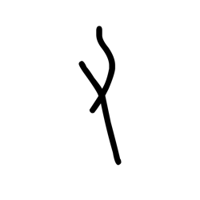

- source_zip_member: `Sub-character Images/c40r3zyq5t/c40r3zyq5t/twkl0uq7g8.png`
- checksum_sha256: see `06_component-visual-index.csv`.
- review_status: `needs_human_visual_review`
- caution: source-marked review image only.

## asset-015206

- source_zip_member: `Sub-character Images/c40r3zyq5t/c40r3zyq5t/uz0iru15zz.png`
- checksum_sha256: see `06_component-visual-index.csv`.
- review_status: `needs_human_visual_review`
- caution: source-marked review image only.

## asset-015207

- source_zip_member: `Sub-character Images/c40r3zyq5t/c40r3zyq5t/v15vl3sbi7.png`
- checksum_sha256: see `06_component-visual-index.csv`.
- review_status: `needs_human_visual_review`
- caution: source-marked review image only.

## asset-015208

- source_zip_member: `Sub-character Images/c40r3zyq5t/c40r3zyq5t/vps6ogwqne.png`
- checksum_sha256: see `06_component-visual-index.csv`.
- review_status: `needs_human_visual_review`
- caution: source-marked review image only.

## asset-015209

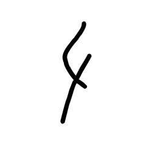

- source_zip_member: `Sub-character Images/c40r3zyq5t/c40r3zyq5t/w5gl29f342.png`
- checksum_sha256: see `06_component-visual-index.csv`.
- review_status: `needs_human_visual_review`
- caution: source-marked review image only.

## asset-015210

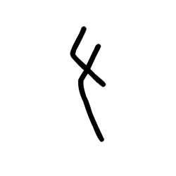

- source_zip_member: `Sub-character Images/c40r3zyq5t/c40r3zyq5t/w5qj0qmq20.png`
- checksum_sha256: see `06_component-visual-index.csv`.
- review_status: `needs_human_visual_review`
- caution: source-marked review image only.

## asset-015211

- source_zip_member: `Sub-character Images/c40r3zyq5t/c40r3zyq5t/wsrwsw0njn.png`
- checksum_sha256: see `06_component-visual-index.csv`.
- review_status: `needs_human_visual_review`
- caution: source-marked review image only.

## asset-015212

- source_zip_member: `Sub-character Images/c40r3zyq5t/c40r3zyq5t/x1gk4d8mm2.png`
- checksum_sha256: see `06_component-visual-index.csv`.
- review_status: `needs_human_visual_review`
- caution: source-marked review image only.

## asset-015213

- source_zip_member: `Sub-character Images/c40r3zyq5t/c40r3zyq5t/y41077lm3o.png`
- checksum_sha256: see `06_component-visual-index.csv`.
- review_status: `needs_human_visual_review`
- caution: source-marked review image only.

## asset-015214

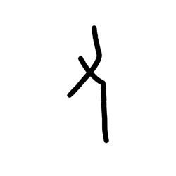

- source_zip_member: `Sub-character Images/c40r3zyq5t/c40r3zyq5t/yktgae46xd.png`
- checksum_sha256: see `06_component-visual-index.csv`.
- review_status: `needs_human_visual_review`
- caution: source-marked review image only.

## asset-015215

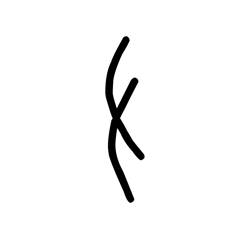

- source_zip_member: `Sub-character Images/c40r3zyq5t/c40r3zyq5t/z1txkp23ae.png`
- checksum_sha256: see `06_component-visual-index.csv`.
- review_status: `needs_human_visual_review`
- caution: source-marked review image only.

## asset-015216

- source_zip_member: `Sub-character Images/c40r3zyq5t/c40r3zyq5t/zpwsut1ssq.png`
- checksum_sha256: see `06_component-visual-index.csv`.
- review_status: `needs_human_visual_review`
- caution: source-marked review image only.
