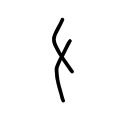
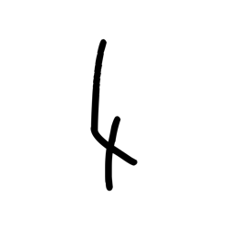
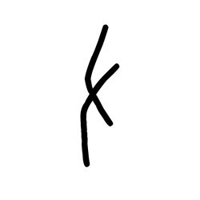
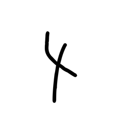

# Component Visual Gallery / 构件图像查看: obs-comp-cand-001143

English:
This page displays OBIMD subcharacter PNG assets extracted into this concrete
corpus object directory for human review.

简体中文：
本页展示抽取到当前具体 corpus 对象目录内的 OBIMD subcharacter PNG 资料，供人工复核使用。

Boundary / 边界：
dataset image candidate only; not a confirmed component form, not a component
assignment, and not a decipherment claim.
- not a confirmed component form
- not a component assignment
- not a decipherment claim

## Concrete Questions To Check / 具体待查问题

- Which local image should be opened first?
- 应先打开哪一张本地构件图像？
- Which source zip member anchors this image?
- 哪一个 source zip member 能定位这张图像？
- Which near-shape or variant comparison is still missing?
- 还缺哪些近形或异体比较？
- Which character or inscription context should be checked next?
- 下一步应核对哪些单字或卜辞上下文？
- What evidence is missing before a component assignment?
- 正式构件归属前还缺哪些证据？

## asset-015217

- source_zip_member: `Sub-character Images/c57ck009xt/c57ck009xt/01s2f0zcy7.png`
- checksum_sha256: see `06_component-visual-index.csv`.
- review_status: `needs_human_visual_review`
- caution: source-marked review image only.

## asset-015218

- source_zip_member: `Sub-character Images/c57ck009xt/c57ck009xt/0l80i3l1ta.png`
- checksum_sha256: see `06_component-visual-index.csv`.
- review_status: `needs_human_visual_review`
- caution: source-marked review image only.

## asset-015219

- source_zip_member: `Sub-character Images/c57ck009xt/c57ck009xt/32l32fyc9q.png`
- checksum_sha256: see `06_component-visual-index.csv`.
- review_status: `needs_human_visual_review`
- caution: source-marked review image only.

## asset-015220

- source_zip_member: `Sub-character Images/c57ck009xt/c57ck009xt/7laytqofb6.png`
- checksum_sha256: see `06_component-visual-index.csv`.
- review_status: `needs_human_visual_review`
- caution: source-marked review image only.

## asset-015221

- source_zip_member: `Sub-character Images/c57ck009xt/c57ck009xt/819qteo7m2.png`
- checksum_sha256: see `06_component-visual-index.csv`.
- review_status: `needs_human_visual_review`
- caution: source-marked review image only.

## asset-015222

- source_zip_member: `Sub-character Images/c57ck009xt/c57ck009xt/89jv0je2a8.png`
- checksum_sha256: see `06_component-visual-index.csv`.
- review_status: `needs_human_visual_review`
- caution: source-marked review image only.

## asset-015223

- source_zip_member: `Sub-character Images/c57ck009xt/c57ck009xt/8pe375qds6.png`
- checksum_sha256: see `06_component-visual-index.csv`.
- review_status: `needs_human_visual_review`
- caution: source-marked review image only.

## asset-015224

- source_zip_member: `Sub-character Images/c57ck009xt/c57ck009xt/c2hyaesd5b.png`
- checksum_sha256: see `06_component-visual-index.csv`.
- review_status: `needs_human_visual_review`
- caution: source-marked review image only.

## asset-015225

- source_zip_member: `Sub-character Images/c57ck009xt/c57ck009xt/c57ck009xt.png`
- checksum_sha256: see `06_component-visual-index.csv`.
- review_status: `needs_human_visual_review`
- caution: source-marked review image only.

## asset-015226

- source_zip_member: `Sub-character Images/c57ck009xt/c57ck009xt/dienwnjksk.png`
- checksum_sha256: see `06_component-visual-index.csv`.
- review_status: `needs_human_visual_review`
- caution: source-marked review image only.

## asset-015227

- source_zip_member: `Sub-character Images/c57ck009xt/c57ck009xt/gcqrkp4akd.png`
- checksum_sha256: see `06_component-visual-index.csv`.
- review_status: `needs_human_visual_review`
- caution: source-marked review image only.

## asset-015228

- source_zip_member: `Sub-character Images/c57ck009xt/c57ck009xt/tqt6ppuoyz.png`
- checksum_sha256: see `06_component-visual-index.csv`.
- review_status: `needs_human_visual_review`
- caution: source-marked review image only.

## asset-015229

- source_zip_member: `Sub-character Images/c57ck009xt/c57ck009xt/vp6lctk9ar.png`
- checksum_sha256: see `06_component-visual-index.csv`.
- review_status: `needs_human_visual_review`
- caution: source-marked review image only.

## asset-015230

- source_zip_member: `Sub-character Images/c57ck009xt/c57ck009xt/x6p6csbkya.png`
- checksum_sha256: see `06_component-visual-index.csv`.
- review_status: `needs_human_visual_review`
- caution: source-marked review image only.
