# Component Visual Gallery / 构件图像查看: obs-comp-cand-001144

English:
This page displays OBIMD subcharacter PNG assets extracted into this concrete
corpus object directory for human review.

简体中文：
本页展示抽取到当前具体 corpus 对象目录内的 OBIMD subcharacter PNG 资料，供人工复核使用。

Boundary / 边界：
dataset image candidate only; not a confirmed component form, not a component
assignment, and not a decipherment claim.
- not a confirmed component form
- not a component assignment
- not a decipherment claim

## Concrete Questions To Check / 具体待查问题

- Open 06_component-visual-index.csv and name the local image row.
- 打开 06_component-visual-index.csv，写明本地图像行。
- Open 09_component-visual-route-index.csv and name the source route row.
- 打开 09_component-visual-route-index.csv，写明来源路线行。
- Open 13_component-context-evidence-dossier.md for character context.
- 打开 13_component-context-evidence-dossier.md，核对单字与卜辞上下文。
- Record the missing image, near-shape, source, or context route.
- 记录缺失的图像、近形、来源或上下文路线。

## asset-015231

- source_zip_member: `Sub-character Images/0u6c7rk2ux/0u6c7rk2ux/0chgltfnx1.png`
- checksum_sha256: see `06_component-visual-index.csv`.
- review_status: `needs_human_visual_review`
- caution: source-marked review image only.

## asset-015232

- source_zip_member: `Sub-character Images/0u6c7rk2ux/0u6c7rk2ux/0u6c7rk2ux.png`
- checksum_sha256: see `06_component-visual-index.csv`.
- review_status: `needs_human_visual_review`
- caution: source-marked review image only.

## asset-015233

- source_zip_member: `Sub-character Images/0u6c7rk2ux/0u6c7rk2ux/2dec7o8s8c.png`
- checksum_sha256: see `06_component-visual-index.csv`.
- review_status: `needs_human_visual_review`
- caution: source-marked review image only.

## asset-015234

- source_zip_member: `Sub-character Images/0u6c7rk2ux/0u6c7rk2ux/2dlvsihflr.png`
- checksum_sha256: see `06_component-visual-index.csv`.
- review_status: `needs_human_visual_review`
- caution: source-marked review image only.

## asset-015235

- source_zip_member: `Sub-character Images/0u6c7rk2ux/0u6c7rk2ux/3t17u4j466.png`
- checksum_sha256: see `06_component-visual-index.csv`.
- review_status: `needs_human_visual_review`
- caution: source-marked review image only.

## asset-015236

- source_zip_member: `Sub-character Images/0u6c7rk2ux/0u6c7rk2ux/50ungq4kt4.png`
- checksum_sha256: see `06_component-visual-index.csv`.
- review_status: `needs_human_visual_review`
- caution: source-marked review image only.

## asset-015237

- source_zip_member: `Sub-character Images/0u6c7rk2ux/0u6c7rk2ux/5odmk5n0uo.png`
- checksum_sha256: see `06_component-visual-index.csv`.
- review_status: `needs_human_visual_review`
- caution: source-marked review image only.

## asset-015238

- source_zip_member: `Sub-character Images/0u6c7rk2ux/0u6c7rk2ux/6arec14fwn.png`
- checksum_sha256: see `06_component-visual-index.csv`.
- review_status: `needs_human_visual_review`
- caution: source-marked review image only.

## asset-015239

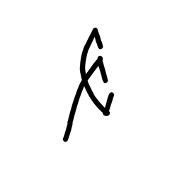

- source_zip_member: `Sub-character Images/0u6c7rk2ux/0u6c7rk2ux/6g75er31lj.png`
- checksum_sha256: see `06_component-visual-index.csv`.
- review_status: `needs_human_visual_review`
- caution: source-marked review image only.

## asset-015240

- source_zip_member: `Sub-character Images/0u6c7rk2ux/0u6c7rk2ux/6r6t55gaak.png`
- checksum_sha256: see `06_component-visual-index.csv`.
- review_status: `needs_human_visual_review`
- caution: source-marked review image only.

## asset-015241

- source_zip_member: `Sub-character Images/0u6c7rk2ux/0u6c7rk2ux/7lmucz1fqr.png`
- checksum_sha256: see `06_component-visual-index.csv`.
- review_status: `needs_human_visual_review`
- caution: source-marked review image only.

## asset-015242

- source_zip_member: `Sub-character Images/0u6c7rk2ux/0u6c7rk2ux/8ywfyrk3zr.png`
- checksum_sha256: see `06_component-visual-index.csv`.
- review_status: `needs_human_visual_review`
- caution: source-marked review image only.

## asset-015243

- source_zip_member: `Sub-character Images/0u6c7rk2ux/0u6c7rk2ux/9ojjw74j20.png`
- checksum_sha256: see `06_component-visual-index.csv`.
- review_status: `needs_human_visual_review`
- caution: source-marked review image only.

## asset-015244

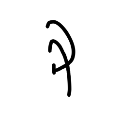

- source_zip_member: `Sub-character Images/0u6c7rk2ux/0u6c7rk2ux/anbkpt32qg.png`
- checksum_sha256: see `06_component-visual-index.csv`.
- review_status: `needs_human_visual_review`
- caution: source-marked review image only.

## asset-015245

- source_zip_member: `Sub-character Images/0u6c7rk2ux/0u6c7rk2ux/c7osghpjsy.png`
- checksum_sha256: see `06_component-visual-index.csv`.
- review_status: `needs_human_visual_review`
- caution: source-marked review image only.

## asset-015246

- source_zip_member: `Sub-character Images/0u6c7rk2ux/0u6c7rk2ux/emjv6sr5tb.png`
- checksum_sha256: see `06_component-visual-index.csv`.
- review_status: `needs_human_visual_review`
- caution: source-marked review image only.

## asset-015247

- source_zip_member: `Sub-character Images/0u6c7rk2ux/0u6c7rk2ux/f9k6vybv96.png`
- checksum_sha256: see `06_component-visual-index.csv`.
- review_status: `needs_human_visual_review`
- caution: source-marked review image only.

## asset-015248

- source_zip_member: `Sub-character Images/0u6c7rk2ux/0u6c7rk2ux/fc1zqdxsz5.png`
- checksum_sha256: see `06_component-visual-index.csv`.
- review_status: `needs_human_visual_review`
- caution: source-marked review image only.

## asset-015249

- source_zip_member: `Sub-character Images/0u6c7rk2ux/0u6c7rk2ux/fd16mskb0r.png`
- checksum_sha256: see `06_component-visual-index.csv`.
- review_status: `needs_human_visual_review`
- caution: source-marked review image only.

## asset-015250

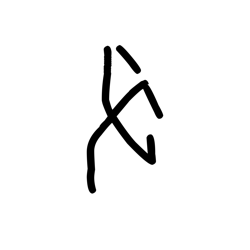

- source_zip_member: `Sub-character Images/0u6c7rk2ux/0u6c7rk2ux/fx4e354srq.png`
- checksum_sha256: see `06_component-visual-index.csv`.
- review_status: `needs_human_visual_review`
- caution: source-marked review image only.

## asset-015251

- source_zip_member: `Sub-character Images/0u6c7rk2ux/0u6c7rk2ux/g2okt7zarp.png`
- checksum_sha256: see `06_component-visual-index.csv`.
- review_status: `needs_human_visual_review`
- caution: source-marked review image only.

## asset-015252

- source_zip_member: `Sub-character Images/0u6c7rk2ux/0u6c7rk2ux/g33cty6rol.png`
- checksum_sha256: see `06_component-visual-index.csv`.
- review_status: `needs_human_visual_review`
- caution: source-marked review image only.

## asset-015253

- source_zip_member: `Sub-character Images/0u6c7rk2ux/0u6c7rk2ux/g3r0lfvpp6.png`
- checksum_sha256: see `06_component-visual-index.csv`.
- review_status: `needs_human_visual_review`
- caution: source-marked review image only.

## asset-015254

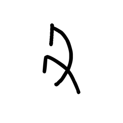

- source_zip_member: `Sub-character Images/0u6c7rk2ux/0u6c7rk2ux/gh9n79yppo.png`
- checksum_sha256: see `06_component-visual-index.csv`.
- review_status: `needs_human_visual_review`
- caution: source-marked review image only.

## asset-015255

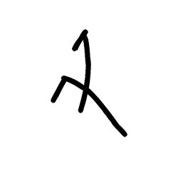

- source_zip_member: `Sub-character Images/0u6c7rk2ux/0u6c7rk2ux/gms2gii4yg.png`
- checksum_sha256: see `06_component-visual-index.csv`.
- review_status: `needs_human_visual_review`
- caution: source-marked review image only.

## asset-015256

- source_zip_member: `Sub-character Images/0u6c7rk2ux/0u6c7rk2ux/h4vgprcurm.png`
- checksum_sha256: see `06_component-visual-index.csv`.
- review_status: `needs_human_visual_review`
- caution: source-marked review image only.

## asset-015257

- source_zip_member: `Sub-character Images/0u6c7rk2ux/0u6c7rk2ux/iozanayiyz.png`
- checksum_sha256: see `06_component-visual-index.csv`.
- review_status: `needs_human_visual_review`
- caution: source-marked review image only.

## asset-015258

- source_zip_member: `Sub-character Images/0u6c7rk2ux/0u6c7rk2ux/jvjusjgabl.png`
- checksum_sha256: see `06_component-visual-index.csv`.
- review_status: `needs_human_visual_review`
- caution: source-marked review image only.

## asset-015259

- source_zip_member: `Sub-character Images/0u6c7rk2ux/0u6c7rk2ux/k8wuf1czpd.png`
- checksum_sha256: see `06_component-visual-index.csv`.
- review_status: `needs_human_visual_review`
- caution: source-marked review image only.

## asset-015260

- source_zip_member: `Sub-character Images/0u6c7rk2ux/0u6c7rk2ux/kbeidtuzra.png`
- checksum_sha256: see `06_component-visual-index.csv`.
- review_status: `needs_human_visual_review`
- caution: source-marked review image only.

## asset-015261

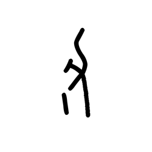

- source_zip_member: `Sub-character Images/0u6c7rk2ux/0u6c7rk2ux/mfu90zw2rw.png`
- checksum_sha256: see `06_component-visual-index.csv`.
- review_status: `needs_human_visual_review`
- caution: source-marked review image only.

## asset-015262

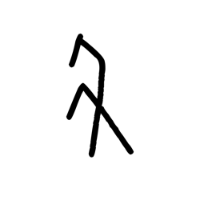

- source_zip_member: `Sub-character Images/0u6c7rk2ux/0u6c7rk2ux/mnl4higdzq.png`
- checksum_sha256: see `06_component-visual-index.csv`.
- review_status: `needs_human_visual_review`
- caution: source-marked review image only.

## asset-015263

- source_zip_member: `Sub-character Images/0u6c7rk2ux/0u6c7rk2ux/n48xz6pxc0.png`
- checksum_sha256: see `06_component-visual-index.csv`.
- review_status: `needs_human_visual_review`
- caution: source-marked review image only.

## asset-015264

- source_zip_member: `Sub-character Images/0u6c7rk2ux/0u6c7rk2ux/ogtahu3e0b.png`
- checksum_sha256: see `06_component-visual-index.csv`.
- review_status: `needs_human_visual_review`
- caution: source-marked review image only.

## asset-015265

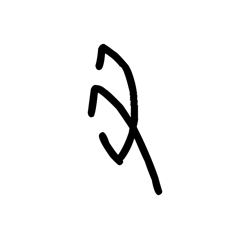

- source_zip_member: `Sub-character Images/0u6c7rk2ux/0u6c7rk2ux/p8d0v9yd48.png`
- checksum_sha256: see `06_component-visual-index.csv`.
- review_status: `needs_human_visual_review`
- caution: source-marked review image only.

## asset-015266

- source_zip_member: `Sub-character Images/0u6c7rk2ux/0u6c7rk2ux/ps565l7bpt.png`
- checksum_sha256: see `06_component-visual-index.csv`.
- review_status: `needs_human_visual_review`
- caution: source-marked review image only.

## asset-015267

- source_zip_member: `Sub-character Images/0u6c7rk2ux/0u6c7rk2ux/pz168tnhzy.png`
- checksum_sha256: see `06_component-visual-index.csv`.
- review_status: `needs_human_visual_review`
- caution: source-marked review image only.

## asset-015268

- source_zip_member: `Sub-character Images/0u6c7rk2ux/0u6c7rk2ux/qch65ure2l.png`
- checksum_sha256: see `06_component-visual-index.csv`.
- review_status: `needs_human_visual_review`
- caution: source-marked review image only.

## asset-015269

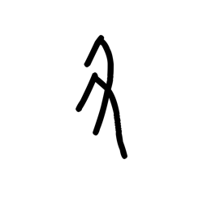

- source_zip_member: `Sub-character Images/0u6c7rk2ux/0u6c7rk2ux/r3zwht6p0c.png`
- checksum_sha256: see `06_component-visual-index.csv`.
- review_status: `needs_human_visual_review`
- caution: source-marked review image only.

## asset-015270

- source_zip_member: `Sub-character Images/0u6c7rk2ux/0u6c7rk2ux/sro6d8k9gl.png`
- checksum_sha256: see `06_component-visual-index.csv`.
- review_status: `needs_human_visual_review`
- caution: source-marked review image only.

## asset-015271

- source_zip_member: `Sub-character Images/0u6c7rk2ux/0u6c7rk2ux/svpa1acw2u.png`
- checksum_sha256: see `06_component-visual-index.csv`.
- review_status: `needs_human_visual_review`
- caution: source-marked review image only.

## asset-015272

- source_zip_member: `Sub-character Images/0u6c7rk2ux/0u6c7rk2ux/sy1zsleu5t.png`
- checksum_sha256: see `06_component-visual-index.csv`.
- review_status: `needs_human_visual_review`
- caution: source-marked review image only.

## asset-015273

- source_zip_member: `Sub-character Images/0u6c7rk2ux/0u6c7rk2ux/tp90znblus.png`
- checksum_sha256: see `06_component-visual-index.csv`.
- review_status: `needs_human_visual_review`
- caution: source-marked review image only.

## asset-015274

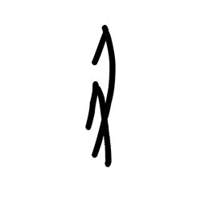

- source_zip_member: `Sub-character Images/0u6c7rk2ux/0u6c7rk2ux/txr5yf3qh7.png`
- checksum_sha256: see `06_component-visual-index.csv`.
- review_status: `needs_human_visual_review`
- caution: source-marked review image only.

## asset-015275

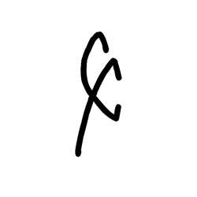

- source_zip_member: `Sub-character Images/0u6c7rk2ux/0u6c7rk2ux/uvx5yw14cr.png`
- checksum_sha256: see `06_component-visual-index.csv`.
- review_status: `needs_human_visual_review`
- caution: source-marked review image only.

## asset-015276

- source_zip_member: `Sub-character Images/0u6c7rk2ux/0u6c7rk2ux/x2jf5hpqqb.png`
- checksum_sha256: see `06_component-visual-index.csv`.
- review_status: `needs_human_visual_review`
- caution: source-marked review image only.

## asset-015277

- source_zip_member: `Sub-character Images/0u6c7rk2ux/0u6c7rk2ux/yob0ag21o6.png`
- checksum_sha256: see `06_component-visual-index.csv`.
- review_status: `needs_human_visual_review`
- caution: source-marked review image only.

## asset-015278

- source_zip_member: `Sub-character Images/0u6c7rk2ux/0u6c7rk2ux/ztmfzqs332.png`
- checksum_sha256: see `06_component-visual-index.csv`.
- review_status: `needs_human_visual_review`
- caution: source-marked review image only.

## asset-015279

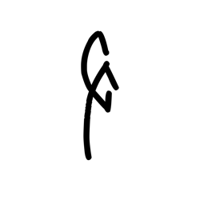

- source_zip_member: `Sub-character Images/0u6c7rk2ux/0u6c7rk2ux/zyqx0bml35.png`
- checksum_sha256: see `06_component-visual-index.csv`.
- review_status: `needs_human_visual_review`
- caution: source-marked review image only.
