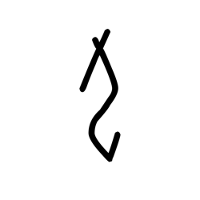

# Component Visual Gallery / 构件图像查看: obs-comp-cand-001146

English:
This page displays OBIMD subcharacter PNG assets extracted into this concrete
corpus object directory for human review.

简体中文：
本页展示抽取到当前具体 corpus 对象目录内的 OBIMD subcharacter PNG 资料，供人工复核使用。

Boundary / 边界：
dataset image candidate only; not a confirmed component form, not a component
assignment, and not a decipherment claim.
- not a confirmed component form
- not a component assignment
- not a decipherment claim

## Concrete Questions To Check / 具体待查问题

- Which local image should be opened first?
- 应先打开哪一张本地构件图像？
- Which source zip member anchors this image?
- 哪一个 source zip member 能定位这张图像？
- Which near-shape or variant comparison is still missing?
- 还缺哪些近形或异体比较？
- Which character or inscription context should be checked next?
- 下一步应核对哪些单字或卜辞上下文？
- What evidence is missing before a component assignment?
- 正式构件归属前还缺哪些证据？

## asset-015281

- source_zip_member: `Sub-character Images/8pu7n71zyl/8pu7n71zyl/16dwre5y6a.png`
- checksum_sha256: see `06_component-visual-index.csv`.
- review_status: `needs_human_visual_review`
- caution: source-marked review image only.

## asset-015282

- source_zip_member: `Sub-character Images/8pu7n71zyl/8pu7n71zyl/1pkaqy95ld.png`
- checksum_sha256: see `06_component-visual-index.csv`.
- review_status: `needs_human_visual_review`
- caution: source-marked review image only.

## asset-015283

- source_zip_member: `Sub-character Images/8pu7n71zyl/8pu7n71zyl/2rlzz890z6.png`
- checksum_sha256: see `06_component-visual-index.csv`.
- review_status: `needs_human_visual_review`
- caution: source-marked review image only.

## asset-015284

- source_zip_member: `Sub-character Images/8pu7n71zyl/8pu7n71zyl/3hwfds9e9l.png`
- checksum_sha256: see `06_component-visual-index.csv`.
- review_status: `needs_human_visual_review`
- caution: source-marked review image only.

## asset-015285

- source_zip_member: `Sub-character Images/8pu7n71zyl/8pu7n71zyl/4io695yfcr.png`
- checksum_sha256: see `06_component-visual-index.csv`.
- review_status: `needs_human_visual_review`
- caution: source-marked review image only.

## asset-015286

- source_zip_member: `Sub-character Images/8pu7n71zyl/8pu7n71zyl/4ngvr4mpy6.png`
- checksum_sha256: see `06_component-visual-index.csv`.
- review_status: `needs_human_visual_review`
- caution: source-marked review image only.

## asset-015287

- source_zip_member: `Sub-character Images/8pu7n71zyl/8pu7n71zyl/4y3cr2foak.png`
- checksum_sha256: see `06_component-visual-index.csv`.
- review_status: `needs_human_visual_review`
- caution: source-marked review image only.

## asset-015288

- source_zip_member: `Sub-character Images/8pu7n71zyl/8pu7n71zyl/5kb761eyst.png`
- checksum_sha256: see `06_component-visual-index.csv`.
- review_status: `needs_human_visual_review`
- caution: source-marked review image only.

## asset-015289

- source_zip_member: `Sub-character Images/8pu7n71zyl/8pu7n71zyl/6ccmkkwg76.png`
- checksum_sha256: see `06_component-visual-index.csv`.
- review_status: `needs_human_visual_review`
- caution: source-marked review image only.

## asset-015290

- source_zip_member: `Sub-character Images/8pu7n71zyl/8pu7n71zyl/6luo1g2fgv.png`
- checksum_sha256: see `06_component-visual-index.csv`.
- review_status: `needs_human_visual_review`
- caution: source-marked review image only.

## asset-015291

- source_zip_member: `Sub-character Images/8pu7n71zyl/8pu7n71zyl/6vqpdcr57t.png`
- checksum_sha256: see `06_component-visual-index.csv`.
- review_status: `needs_human_visual_review`
- caution: source-marked review image only.

## asset-015292

- source_zip_member: `Sub-character Images/8pu7n71zyl/8pu7n71zyl/81gr1pg0h8.png`
- checksum_sha256: see `06_component-visual-index.csv`.
- review_status: `needs_human_visual_review`
- caution: source-marked review image only.

## asset-015293

- source_zip_member: `Sub-character Images/8pu7n71zyl/8pu7n71zyl/8pu7n71zyl.png`
- checksum_sha256: see `06_component-visual-index.csv`.
- review_status: `needs_human_visual_review`
- caution: source-marked review image only.

## asset-015294

- source_zip_member: `Sub-character Images/8pu7n71zyl/8pu7n71zyl/9fdplhz3ke.png`
- checksum_sha256: see `06_component-visual-index.csv`.
- review_status: `needs_human_visual_review`
- caution: source-marked review image only.

## asset-015295

- source_zip_member: `Sub-character Images/8pu7n71zyl/8pu7n71zyl/9w2khrlp6l.png`
- checksum_sha256: see `06_component-visual-index.csv`.
- review_status: `needs_human_visual_review`
- caution: source-marked review image only.

## asset-015296

- source_zip_member: `Sub-character Images/8pu7n71zyl/8pu7n71zyl/af19ytyr8l.png`
- checksum_sha256: see `06_component-visual-index.csv`.
- review_status: `needs_human_visual_review`
- caution: source-marked review image only.

## asset-015297

- source_zip_member: `Sub-character Images/8pu7n71zyl/8pu7n71zyl/b1876kl76i.png`
- checksum_sha256: see `06_component-visual-index.csv`.
- review_status: `needs_human_visual_review`
- caution: source-marked review image only.

## asset-015298

- source_zip_member: `Sub-character Images/8pu7n71zyl/8pu7n71zyl/bgaij3vdlz.png`
- checksum_sha256: see `06_component-visual-index.csv`.
- review_status: `needs_human_visual_review`
- caution: source-marked review image only.

## asset-015299

- source_zip_member: `Sub-character Images/8pu7n71zyl/8pu7n71zyl/brxw3byv4x.png`
- checksum_sha256: see `06_component-visual-index.csv`.
- review_status: `needs_human_visual_review`
- caution: source-marked review image only.

## asset-015300

- source_zip_member: `Sub-character Images/8pu7n71zyl/8pu7n71zyl/c5zr5rprvj.png`
- checksum_sha256: see `06_component-visual-index.csv`.
- review_status: `needs_human_visual_review`
- caution: source-marked review image only.

## asset-015301

- source_zip_member: `Sub-character Images/8pu7n71zyl/8pu7n71zyl/chfg0klh6r.png`
- checksum_sha256: see `06_component-visual-index.csv`.
- review_status: `needs_human_visual_review`
- caution: source-marked review image only.

## asset-015302

- source_zip_member: `Sub-character Images/8pu7n71zyl/8pu7n71zyl/e5st8vpe1d.png`
- checksum_sha256: see `06_component-visual-index.csv`.
- review_status: `needs_human_visual_review`
- caution: source-marked review image only.

## asset-015303

- source_zip_member: `Sub-character Images/8pu7n71zyl/8pu7n71zyl/eqvpy0y1gi.png`
- checksum_sha256: see `06_component-visual-index.csv`.
- review_status: `needs_human_visual_review`
- caution: source-marked review image only.

## asset-015304

- source_zip_member: `Sub-character Images/8pu7n71zyl/8pu7n71zyl/es26i4tq5j.png`
- checksum_sha256: see `06_component-visual-index.csv`.
- review_status: `needs_human_visual_review`
- caution: source-marked review image only.

## asset-015305

- source_zip_member: `Sub-character Images/8pu7n71zyl/8pu7n71zyl/hnl2bumkch.png`
- checksum_sha256: see `06_component-visual-index.csv`.
- review_status: `needs_human_visual_review`
- caution: source-marked review image only.

## asset-015306

- source_zip_member: `Sub-character Images/8pu7n71zyl/8pu7n71zyl/hq6rx1micg.png`
- checksum_sha256: see `06_component-visual-index.csv`.
- review_status: `needs_human_visual_review`
- caution: source-marked review image only.

## asset-015307

- source_zip_member: `Sub-character Images/8pu7n71zyl/8pu7n71zyl/ipvzox0pwk.png`
- checksum_sha256: see `06_component-visual-index.csv`.
- review_status: `needs_human_visual_review`
- caution: source-marked review image only.

## asset-015308

- source_zip_member: `Sub-character Images/8pu7n71zyl/8pu7n71zyl/iv0lwo5g89.png`
- checksum_sha256: see `06_component-visual-index.csv`.
- review_status: `needs_human_visual_review`
- caution: source-marked review image only.

## asset-015309

- source_zip_member: `Sub-character Images/8pu7n71zyl/8pu7n71zyl/k1flgrlxz8.png`
- checksum_sha256: see `06_component-visual-index.csv`.
- review_status: `needs_human_visual_review`
- caution: source-marked review image only.

## asset-015310

- source_zip_member: `Sub-character Images/8pu7n71zyl/8pu7n71zyl/myt5wp8eyc.png`
- checksum_sha256: see `06_component-visual-index.csv`.
- review_status: `needs_human_visual_review`
- caution: source-marked review image only.

## asset-015311

- source_zip_member: `Sub-character Images/8pu7n71zyl/8pu7n71zyl/mzlcf1hd2x.png`
- checksum_sha256: see `06_component-visual-index.csv`.
- review_status: `needs_human_visual_review`
- caution: source-marked review image only.

## asset-015312

- source_zip_member: `Sub-character Images/8pu7n71zyl/8pu7n71zyl/nl6poud32t.png`
- checksum_sha256: see `06_component-visual-index.csv`.
- review_status: `needs_human_visual_review`
- caution: source-marked review image only.

## asset-015313

- source_zip_member: `Sub-character Images/8pu7n71zyl/8pu7n71zyl/qy89n0tkmr.png`
- checksum_sha256: see `06_component-visual-index.csv`.
- review_status: `needs_human_visual_review`
- caution: source-marked review image only.

## asset-015314

- source_zip_member: `Sub-character Images/8pu7n71zyl/8pu7n71zyl/s7up6mthm0.png`
- checksum_sha256: see `06_component-visual-index.csv`.
- review_status: `needs_human_visual_review`
- caution: source-marked review image only.

## asset-015315

- source_zip_member: `Sub-character Images/8pu7n71zyl/8pu7n71zyl/sr5famcf6c.png`
- checksum_sha256: see `06_component-visual-index.csv`.
- review_status: `needs_human_visual_review`
- caution: source-marked review image only.

## asset-015316

- source_zip_member: `Sub-character Images/8pu7n71zyl/8pu7n71zyl/tbq7q0n73e.png`
- checksum_sha256: see `06_component-visual-index.csv`.
- review_status: `needs_human_visual_review`
- caution: source-marked review image only.

## asset-015317

- source_zip_member: `Sub-character Images/8pu7n71zyl/8pu7n71zyl/u4rl9d8i9r.png`
- checksum_sha256: see `06_component-visual-index.csv`.
- review_status: `needs_human_visual_review`
- caution: source-marked review image only.

## asset-015318

- source_zip_member: `Sub-character Images/8pu7n71zyl/8pu7n71zyl/udwjwiwft6.png`
- checksum_sha256: see `06_component-visual-index.csv`.
- review_status: `needs_human_visual_review`
- caution: source-marked review image only.

## asset-015319

- source_zip_member: `Sub-character Images/8pu7n71zyl/8pu7n71zyl/ulzgn1e8yj.png`
- checksum_sha256: see `06_component-visual-index.csv`.
- review_status: `needs_human_visual_review`
- caution: source-marked review image only.

## asset-015320

- source_zip_member: `Sub-character Images/8pu7n71zyl/8pu7n71zyl/v4v5zwewim.png`
- checksum_sha256: see `06_component-visual-index.csv`.
- review_status: `needs_human_visual_review`
- caution: source-marked review image only.

## asset-015321

- source_zip_member: `Sub-character Images/8pu7n71zyl/8pu7n71zyl/vmte0452fx.png`
- checksum_sha256: see `06_component-visual-index.csv`.
- review_status: `needs_human_visual_review`
- caution: source-marked review image only.

## asset-015322

- source_zip_member: `Sub-character Images/8pu7n71zyl/8pu7n71zyl/w2xlizrmei.png`
- checksum_sha256: see `06_component-visual-index.csv`.
- review_status: `needs_human_visual_review`
- caution: source-marked review image only.

## asset-015323

- source_zip_member: `Sub-character Images/8pu7n71zyl/8pu7n71zyl/w3qwjno49x.png`
- checksum_sha256: see `06_component-visual-index.csv`.
- review_status: `needs_human_visual_review`
- caution: source-marked review image only.

## asset-015324

- source_zip_member: `Sub-character Images/8pu7n71zyl/8pu7n71zyl/xjipe0lvxl.png`
- checksum_sha256: see `06_component-visual-index.csv`.
- review_status: `needs_human_visual_review`
- caution: source-marked review image only.
