# Component Visual Gallery / 构件图像查看: obs-comp-cand-001147

English:
This page displays OBIMD subcharacter PNG assets extracted into this concrete corpus object directory for human review.

简体中文：
本页展示抽取到当前具体 corpus 对象目录内的 OBIMD subcharacter PNG 资料，供人工复核使用。

Boundary / 边界：dataset image candidate only; not a confirmed component form, component assignment, or decipherment claim.

## asset-015325

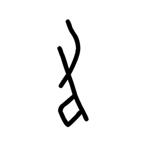

- source_zip_member: `Sub-character Images/cun5nm7d0f/cun5nm7d0f/0gdd133pq6.png`
- checksum_sha256: `ab7cb0af9e6e5f2c7a9141f7230459ad7e7a8a3abe9cc42bc5ddf754ca6f536a`
- review_status: `needs_human_visual_review`
- caution: OBIMD subcharacter image is a source-marked review asset only; it is not a confirmed component form, component assignment, or decipherment conclusion.

## asset-015326

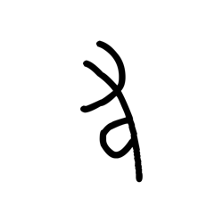

- source_zip_member: `Sub-character Images/cun5nm7d0f/cun5nm7d0f/ays6revql5.png`
- checksum_sha256: `dd300f22b64ecaa93193273c46f7bcd36ac5f7c1ee64497dcf21fbb213146136`
- review_status: `needs_human_visual_review`
- caution: OBIMD subcharacter image is a source-marked review asset only; it is not a confirmed component form, component assignment, or decipherment conclusion.

## asset-015327

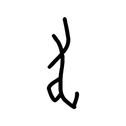

- source_zip_member: `Sub-character Images/cun5nm7d0f/cun5nm7d0f/c2ds79cj0v.png`
- checksum_sha256: `d7b6c5cf3c317bb90f443cda9f766532f1b441cf75cae3889df5f9c0847f0bd1`
- review_status: `needs_human_visual_review`
- caution: OBIMD subcharacter image is a source-marked review asset only; it is not a confirmed component form, component assignment, or decipherment conclusion.

## asset-015328

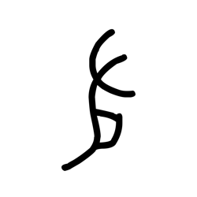

- source_zip_member: `Sub-character Images/cun5nm7d0f/cun5nm7d0f/cun5nm7d0f.png`
- checksum_sha256: `393b406e89da92a7141f20cf1f54dc5d4428d50092bcb3bed15f2de36a05afae`
- review_status: `needs_human_visual_review`
- caution: OBIMD subcharacter image is a source-marked review asset only; it is not a confirmed component form, component assignment, or decipherment conclusion.

## asset-015329

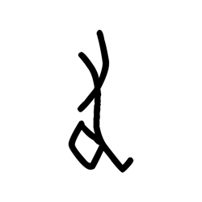

- source_zip_member: `Sub-character Images/cun5nm7d0f/cun5nm7d0f/evji204dxr.png`
- checksum_sha256: `dbcc6e3b7b1b49ba6dd92018287a692f141fdac6dd31187595141016b675d4c8`
- review_status: `needs_human_visual_review`
- caution: OBIMD subcharacter image is a source-marked review asset only; it is not a confirmed component form, component assignment, or decipherment conclusion.

## asset-015330

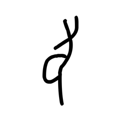

- source_zip_member: `Sub-character Images/cun5nm7d0f/cun5nm7d0f/g8qxhnqhyc.png`
- checksum_sha256: `74bd16d77822356d431dd9a5b939bbc37013d68adef45ac219373718d96fbd28`
- review_status: `needs_human_visual_review`
- caution: OBIMD subcharacter image is a source-marked review asset only; it is not a confirmed component form, component assignment, or decipherment conclusion.

## asset-015331

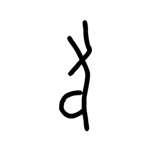

- source_zip_member: `Sub-character Images/cun5nm7d0f/cun5nm7d0f/jppk1wh67u.png`
- checksum_sha256: `ae4f1c782fc0a5bc9c6e4988030463df4043c91e6c28d8fdb5c5fb87d49e6cdc`
- review_status: `needs_human_visual_review`
- caution: OBIMD subcharacter image is a source-marked review asset only; it is not a confirmed component form, component assignment, or decipherment conclusion.

## asset-015332

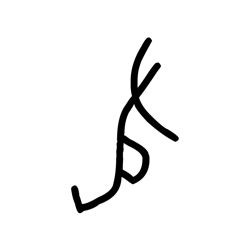

- source_zip_member: `Sub-character Images/cun5nm7d0f/cun5nm7d0f/kumtoorfxc.png`
- checksum_sha256: `71f7feb72cad6d1798a3eb6663fe0ee0ebf72e45b060c8fa5c46f07a39fd28df`
- review_status: `needs_human_visual_review`
- caution: OBIMD subcharacter image is a source-marked review asset only; it is not a confirmed component form, component assignment, or decipherment conclusion.

## asset-015333

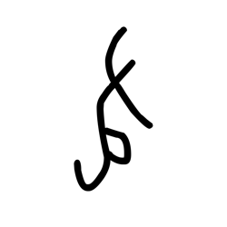

- source_zip_member: `Sub-character Images/cun5nm7d0f/cun5nm7d0f/t1dnikfyff.png`
- checksum_sha256: `e963884bae8c41b358ff084b07fe3ca5e5abc4b1035ddf2d4b2f2b4e302549fb`
- review_status: `needs_human_visual_review`
- caution: OBIMD subcharacter image is a source-marked review asset only; it is not a confirmed component form, component assignment, or decipherment conclusion.

## asset-015334

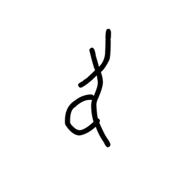

- source_zip_member: `Sub-character Images/cun5nm7d0f/cun5nm7d0f/ub5o86e5cl.png`
- checksum_sha256: `61c275eae931cfa3d129f75250208d644a6b53ca85717e787425049246490124`
- review_status: `needs_human_visual_review`
- caution: OBIMD subcharacter image is a source-marked review asset only; it is not a confirmed component form, component assignment, or decipherment conclusion.

## asset-015335

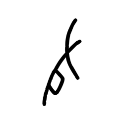

- source_zip_member: `Sub-character Images/cun5nm7d0f/cun5nm7d0f/wk7yvberzr.png`
- checksum_sha256: `6e93e18372807a425329767dd69570a1057996d815835d0e93d13e782201fb01`
- review_status: `needs_human_visual_review`
- caution: OBIMD subcharacter image is a source-marked review asset only; it is not a confirmed component form, component assignment, or decipherment conclusion.

## asset-015336

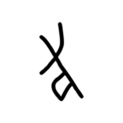

- source_zip_member: `Sub-character Images/cun5nm7d0f/cun5nm7d0f/y8l1d65g3c.png`
- checksum_sha256: `35a752d803cbab170388f8848550d4fcc4a9641a9d8dfcc3685a63298a92ec02`
- review_status: `needs_human_visual_review`
- caution: OBIMD subcharacter image is a source-marked review asset only; it is not a confirmed component form, component assignment, or decipherment conclusion.

## asset-015337

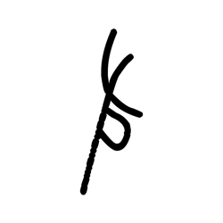

- source_zip_member: `Sub-character Images/cun5nm7d0f/cun5nm7d0f/z4e636sfiu.png`
- checksum_sha256: `efe4dbca18c9635d6e7d8e71ce1ebcef56a03a4a66e30f159af609e8459318d6`
- review_status: `needs_human_visual_review`
- caution: OBIMD subcharacter image is a source-marked review asset only; it is not a confirmed component form, component assignment, or decipherment conclusion.
