# Component Visual Gallery / 构件图像查看: obs-comp-cand-001198

English:
This page displays OBIMD subcharacter PNG assets extracted into this concrete
corpus object directory for human review.

简体中文：
本页展示抽取到当前具体 corpus 对象目录内的 OBIMD subcharacter PNG 资料，供人工复核使用。

Boundary / 边界：
dataset image candidate only; not a confirmed component form, not a component
assignment, and not a decipherment claim.
- not a confirmed component form
- not a component assignment
- not a decipherment claim

## Concrete Questions To Check / 具体待查问题

- Open 06_component-visual-index.csv and name the local image row.
- 打开 06_component-visual-index.csv，写明本地图像行。
- Open 09_component-visual-route-index.csv and name the source route row.
- 打开 09_component-visual-route-index.csv，写明来源路线行。
- Open 13_component-context-evidence-dossier.md for character context.
- 打开 13_component-context-evidence-dossier.md，核对单字与卜辞上下文。
- Record the missing image, near-shape, source, or context route.
- 记录缺失的图像、近形、来源或上下文路线。

## asset-015388

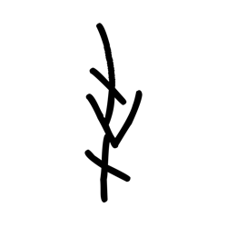

- source_zip_member: `Sub-character Images/50oggjbzcs/50oggjbzcs/0qbuyrjdjk.png`
- checksum_sha256: see `06_component-visual-index.csv`.
- review_status: `needs_human_visual_review`
- caution: source-marked review image only.

## asset-015389

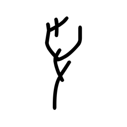

- source_zip_member: `Sub-character Images/50oggjbzcs/50oggjbzcs/0so8fngjtu.png`
- checksum_sha256: see `06_component-visual-index.csv`.
- review_status: `needs_human_visual_review`
- caution: source-marked review image only.

## asset-015390

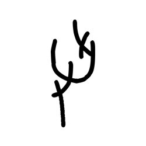

- source_zip_member: `Sub-character Images/50oggjbzcs/50oggjbzcs/1jfm6mzwik.png`
- checksum_sha256: see `06_component-visual-index.csv`.
- review_status: `needs_human_visual_review`
- caution: source-marked review image only.

## asset-015391

- source_zip_member: `Sub-character Images/50oggjbzcs/50oggjbzcs/24fbo67w0f.png`
- checksum_sha256: see `06_component-visual-index.csv`.
- review_status: `needs_human_visual_review`
- caution: source-marked review image only.

## asset-015392

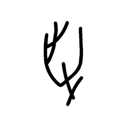

- source_zip_member: `Sub-character Images/50oggjbzcs/50oggjbzcs/37afgigd4e.png`
- checksum_sha256: see `06_component-visual-index.csv`.
- review_status: `needs_human_visual_review`
- caution: source-marked review image only.

## asset-015393

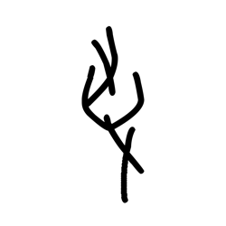

- source_zip_member: `Sub-character Images/50oggjbzcs/50oggjbzcs/3yjs2akc8t.png`
- checksum_sha256: see `06_component-visual-index.csv`.
- review_status: `needs_human_visual_review`
- caution: source-marked review image only.

## asset-015394

- source_zip_member: `Sub-character Images/50oggjbzcs/50oggjbzcs/47ljxy77fa.png`
- checksum_sha256: see `06_component-visual-index.csv`.
- review_status: `needs_human_visual_review`
- caution: source-marked review image only.

## asset-015395

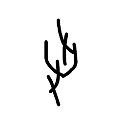

- source_zip_member: `Sub-character Images/50oggjbzcs/50oggjbzcs/4wyur4c3n6.png`
- checksum_sha256: see `06_component-visual-index.csv`.
- review_status: `needs_human_visual_review`
- caution: source-marked review image only.

## asset-015396

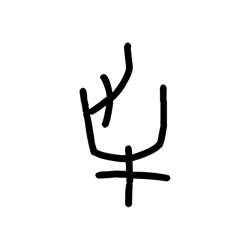

- source_zip_member: `Sub-character Images/50oggjbzcs/50oggjbzcs/4yhz3x3t0v.png`
- checksum_sha256: see `06_component-visual-index.csv`.
- review_status: `needs_human_visual_review`
- caution: source-marked review image only.

## asset-015397

- source_zip_member: `Sub-character Images/50oggjbzcs/50oggjbzcs/50oggjbzcs.png`
- checksum_sha256: see `06_component-visual-index.csv`.
- review_status: `needs_human_visual_review`
- caution: source-marked review image only.

## asset-015398

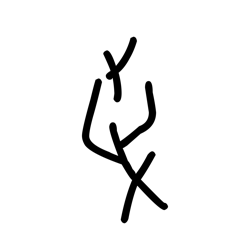

- source_zip_member: `Sub-character Images/50oggjbzcs/50oggjbzcs/54c4l7y6ak.png`
- checksum_sha256: see `06_component-visual-index.csv`.
- review_status: `needs_human_visual_review`
- caution: source-marked review image only.

## asset-015399

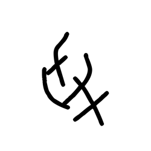

- source_zip_member: `Sub-character Images/50oggjbzcs/50oggjbzcs/5wipdciwws.png`
- checksum_sha256: see `06_component-visual-index.csv`.
- review_status: `needs_human_visual_review`
- caution: source-marked review image only.

## asset-015400

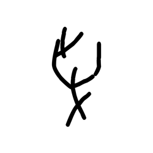

- source_zip_member: `Sub-character Images/50oggjbzcs/50oggjbzcs/688od6m6ea.png`
- checksum_sha256: see `06_component-visual-index.csv`.
- review_status: `needs_human_visual_review`
- caution: source-marked review image only.

## asset-015401

- source_zip_member: `Sub-character Images/50oggjbzcs/50oggjbzcs/7v31ys7fqf.png`
- checksum_sha256: see `06_component-visual-index.csv`.
- review_status: `needs_human_visual_review`
- caution: source-marked review image only.

## asset-015402

- source_zip_member: `Sub-character Images/50oggjbzcs/50oggjbzcs/8c6s8davjg.png`
- checksum_sha256: see `06_component-visual-index.csv`.
- review_status: `needs_human_visual_review`
- caution: source-marked review image only.

## asset-015403

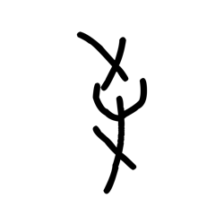

- source_zip_member: `Sub-character Images/50oggjbzcs/50oggjbzcs/9rkpizh4q4.png`
- checksum_sha256: see `06_component-visual-index.csv`.
- review_status: `needs_human_visual_review`
- caution: source-marked review image only.

## asset-015404

- source_zip_member: `Sub-character Images/50oggjbzcs/50oggjbzcs/a0f1byh730.png`
- checksum_sha256: see `06_component-visual-index.csv`.
- review_status: `needs_human_visual_review`
- caution: source-marked review image only.

## asset-015405

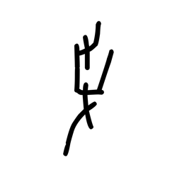

- source_zip_member: `Sub-character Images/50oggjbzcs/50oggjbzcs/bszemmkktw.png`
- checksum_sha256: see `06_component-visual-index.csv`.
- review_status: `needs_human_visual_review`
- caution: source-marked review image only.

## asset-015406

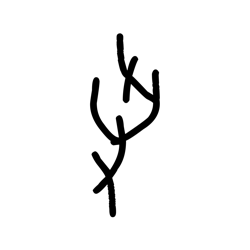

- source_zip_member: `Sub-character Images/50oggjbzcs/50oggjbzcs/dvpfm9j1up.png`
- checksum_sha256: see `06_component-visual-index.csv`.
- review_status: `needs_human_visual_review`
- caution: source-marked review image only.

## asset-015407

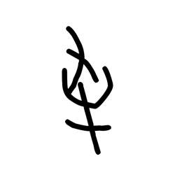

- source_zip_member: `Sub-character Images/50oggjbzcs/50oggjbzcs/dy55e0xo9o.png`
- checksum_sha256: see `06_component-visual-index.csv`.
- review_status: `needs_human_visual_review`
- caution: source-marked review image only.

## asset-015408

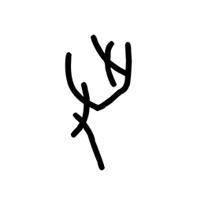

- source_zip_member: `Sub-character Images/50oggjbzcs/50oggjbzcs/fbqncigp6p.png`
- checksum_sha256: see `06_component-visual-index.csv`.
- review_status: `needs_human_visual_review`
- caution: source-marked review image only.

## asset-015409

- source_zip_member: `Sub-character Images/50oggjbzcs/50oggjbzcs/gix1a98ar4.png`
- checksum_sha256: see `06_component-visual-index.csv`.
- review_status: `needs_human_visual_review`
- caution: source-marked review image only.

## asset-015410

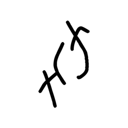

- source_zip_member: `Sub-character Images/50oggjbzcs/50oggjbzcs/gxrm8j8wzj.png`
- checksum_sha256: see `06_component-visual-index.csv`.
- review_status: `needs_human_visual_review`
- caution: source-marked review image only.

## asset-015411

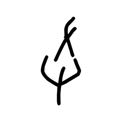

- source_zip_member: `Sub-character Images/50oggjbzcs/50oggjbzcs/h5j3awr398.png`
- checksum_sha256: see `06_component-visual-index.csv`.
- review_status: `needs_human_visual_review`
- caution: source-marked review image only.

## asset-015412

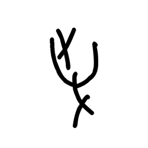

- source_zip_member: `Sub-character Images/50oggjbzcs/50oggjbzcs/irtscqr66c.png`
- checksum_sha256: see `06_component-visual-index.csv`.
- review_status: `needs_human_visual_review`
- caution: source-marked review image only.

## asset-015413

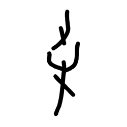

- source_zip_member: `Sub-character Images/50oggjbzcs/50oggjbzcs/jckud13gbk.png`
- checksum_sha256: see `06_component-visual-index.csv`.
- review_status: `needs_human_visual_review`
- caution: source-marked review image only.

## asset-015414

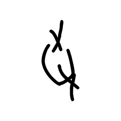

- source_zip_member: `Sub-character Images/50oggjbzcs/50oggjbzcs/jx2b433z8i.png`
- checksum_sha256: see `06_component-visual-index.csv`.
- review_status: `needs_human_visual_review`
- caution: source-marked review image only.

## asset-015415

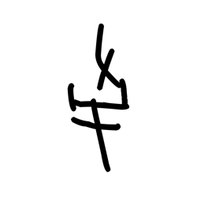

- source_zip_member: `Sub-character Images/50oggjbzcs/50oggjbzcs/kqpvry6mo9.png`
- checksum_sha256: see `06_component-visual-index.csv`.
- review_status: `needs_human_visual_review`
- caution: source-marked review image only.

## asset-015416

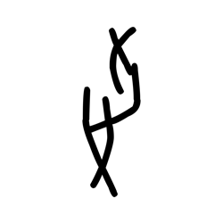

- source_zip_member: `Sub-character Images/50oggjbzcs/50oggjbzcs/m9lmhvpdv8.png`
- checksum_sha256: see `06_component-visual-index.csv`.
- review_status: `needs_human_visual_review`
- caution: source-marked review image only.

## asset-015417

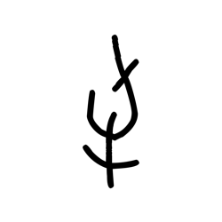

- source_zip_member: `Sub-character Images/50oggjbzcs/50oggjbzcs/ngscn7xn6i.png`
- checksum_sha256: see `06_component-visual-index.csv`.
- review_status: `needs_human_visual_review`
- caution: source-marked review image only.

## asset-015418

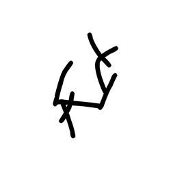

- source_zip_member: `Sub-character Images/50oggjbzcs/50oggjbzcs/pnj08q0hk6.png`
- checksum_sha256: see `06_component-visual-index.csv`.
- review_status: `needs_human_visual_review`
- caution: source-marked review image only.

## asset-015419

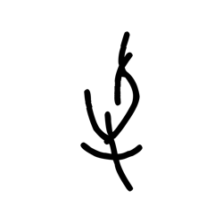

- source_zip_member: `Sub-character Images/50oggjbzcs/50oggjbzcs/qdbq1piq7f.png`
- checksum_sha256: see `06_component-visual-index.csv`.
- review_status: `needs_human_visual_review`
- caution: source-marked review image only.

## asset-015420

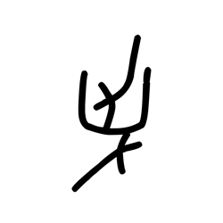

- source_zip_member: `Sub-character Images/50oggjbzcs/50oggjbzcs/rzt8ek16lj.png`
- checksum_sha256: see `06_component-visual-index.csv`.
- review_status: `needs_human_visual_review`
- caution: source-marked review image only.

## asset-015421

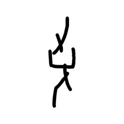

- source_zip_member: `Sub-character Images/50oggjbzcs/50oggjbzcs/sme6rj8euf.png`
- checksum_sha256: see `06_component-visual-index.csv`.
- review_status: `needs_human_visual_review`
- caution: source-marked review image only.

## asset-015422

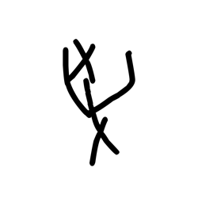

- source_zip_member: `Sub-character Images/50oggjbzcs/50oggjbzcs/tux870gwv6.png`
- checksum_sha256: see `06_component-visual-index.csv`.
- review_status: `needs_human_visual_review`
- caution: source-marked review image only.

## asset-015423

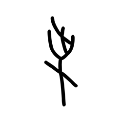

- source_zip_member: `Sub-character Images/50oggjbzcs/50oggjbzcs/uumqu199gh.png`
- checksum_sha256: see `06_component-visual-index.csv`.
- review_status: `needs_human_visual_review`
- caution: source-marked review image only.

## asset-015424

- source_zip_member: `Sub-character Images/50oggjbzcs/50oggjbzcs/uv0fi92cgc.png`
- checksum_sha256: see `06_component-visual-index.csv`.
- review_status: `needs_human_visual_review`
- caution: source-marked review image only.

## asset-015425

- source_zip_member: `Sub-character Images/50oggjbzcs/50oggjbzcs/wb7n3ffnmc.png`
- checksum_sha256: see `06_component-visual-index.csv`.
- review_status: `needs_human_visual_review`
- caution: source-marked review image only.

## asset-015426

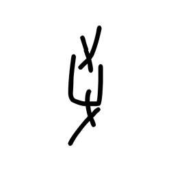

- source_zip_member: `Sub-character Images/50oggjbzcs/50oggjbzcs/xwsdoekpti.png`
- checksum_sha256: see `06_component-visual-index.csv`.
- review_status: `needs_human_visual_review`
- caution: source-marked review image only.

## asset-015427

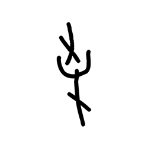

- source_zip_member: `Sub-character Images/50oggjbzcs/50oggjbzcs/zcgv77jbzn.png`
- checksum_sha256: see `06_component-visual-index.csv`.
- review_status: `needs_human_visual_review`
- caution: source-marked review image only.

## asset-015428

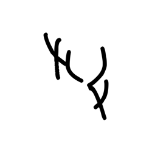

- source_zip_member: `Sub-character Images/50oggjbzcs/50oggjbzcs/zkohw8fcqu.png`
- checksum_sha256: see `06_component-visual-index.csv`.
- review_status: `needs_human_visual_review`
- caution: source-marked review image only.

## asset-015429

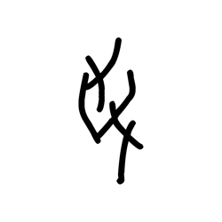

- source_zip_member: `Sub-character Images/50oggjbzcs/50oggjbzcs/zujfuj5gre.png`
- checksum_sha256: see `06_component-visual-index.csv`.
- review_status: `needs_human_visual_review`
- caution: source-marked review image only.
