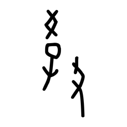
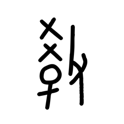
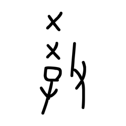
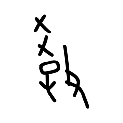
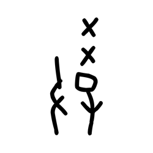
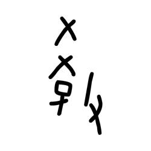
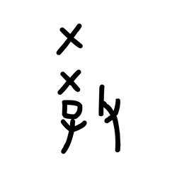
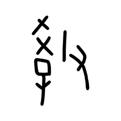

# Component Visual Gallery / 构件图像查看: obs-comp-cand-001222

English:
This page displays OBIMD subcharacter PNG assets extracted into this concrete corpus object directory for human review.

简体中文：
本页展示抽取到当前具体 corpus 对象目录内的 OBIMD subcharacter PNG 资料，供人工复核使用。

Boundary / 边界：dataset image candidate only; not a confirmed component form, component assignment, or decipherment claim.

## asset-015453

- source_zip_member: `Sub-character Images/4tyq3wzq4i/4tyq3wzq4i/2xqxkveekp.png`
- checksum_sha256: `46dcab0f364f7da4d5d7b0112b86fbcd993dd491a5419874af5e31036b01d5ae`
- review_status: `needs_human_visual_review`
- caution: OBIMD subcharacter image is a source-marked review asset only; it is not a confirmed component form, component assignment, or decipherment conclusion.

## asset-015454

- source_zip_member: `Sub-character Images/4tyq3wzq4i/4tyq3wzq4i/4tyq3wzq4i.png`
- checksum_sha256: `ad2c05812d801a478ef3e2637c878be0bf38d14b03dc1f45e8bc4cc19ef0e5fb`
- review_status: `needs_human_visual_review`
- caution: OBIMD subcharacter image is a source-marked review asset only; it is not a confirmed component form, component assignment, or decipherment conclusion.

## asset-015455

- source_zip_member: `Sub-character Images/4tyq3wzq4i/4tyq3wzq4i/ptqsumzlab.png`
- checksum_sha256: `1cd532c33a69dfae19bcc9cd123c5d8a473e9ba13a355bc5089bff9011cb09b7`
- review_status: `needs_human_visual_review`
- caution: OBIMD subcharacter image is a source-marked review asset only; it is not a confirmed component form, component assignment, or decipherment conclusion.

## asset-015456

- source_zip_member: `Sub-character Images/4tyq3wzq4i/4tyq3wzq4i/rj4y9xkn6i.png`
- checksum_sha256: `c325f3c99de0c047d0c571e760942bbfd96fcd3d3e1e5008a425694f786a2121`
- review_status: `needs_human_visual_review`
- caution: OBIMD subcharacter image is a source-marked review asset only; it is not a confirmed component form, component assignment, or decipherment conclusion.

## asset-015457

- source_zip_member: `Sub-character Images/4tyq3wzq4i/4tyq3wzq4i/sykdgf4hy0.png`
- checksum_sha256: `00136030135fbf0a50dd8caecb794336f08fadde469850cda9c90fc823d10803`
- review_status: `needs_human_visual_review`
- caution: OBIMD subcharacter image is a source-marked review asset only; it is not a confirmed component form, component assignment, or decipherment conclusion.

## asset-015458

- source_zip_member: `Sub-character Images/4tyq3wzq4i/4tyq3wzq4i/vnkb8rs0u7.png`
- checksum_sha256: `44cb460e8fa693c78eebaf81a0d17d471556f81b509d00d2e9ed9b948c7f54b3`
- review_status: `needs_human_visual_review`
- caution: OBIMD subcharacter image is a source-marked review asset only; it is not a confirmed component form, component assignment, or decipherment conclusion.

## asset-015459

- source_zip_member: `Sub-character Images/4tyq3wzq4i/4tyq3wzq4i/x3xwy5acoc.png`
- checksum_sha256: `ca4cd9fa10ba9b16b376cafefa1f969f62d25190aa96da4588860dcbc57c2d5c`
- review_status: `needs_human_visual_review`
- caution: OBIMD subcharacter image is a source-marked review asset only; it is not a confirmed component form, component assignment, or decipherment conclusion.

## asset-015460

- source_zip_member: `Sub-character Images/4tyq3wzq4i/4tyq3wzq4i/xbg29aa2jb.png`
- checksum_sha256: `cb06f95262b934b37f6ca1a6bac98fa278610ffa985304283cb6b33e755a150c`
- review_status: `needs_human_visual_review`
- caution: OBIMD subcharacter image is a source-marked review asset only; it is not a confirmed component form, component assignment, or decipherment conclusion.
