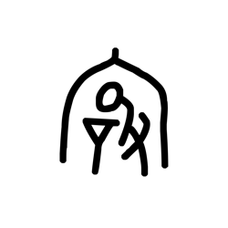

# Component Visual Gallery / 构件图像查看: obs-comp-cand-001243

English:
This page displays OBIMD subcharacter PNG assets extracted into this concrete corpus object directory for human review.

简体中文：
本页展示抽取到当前具体 corpus 对象目录内的 OBIMD subcharacter PNG 资料，供人工复核使用。

Boundary / 边界：dataset image candidate only; not a confirmed component form, component assignment, or decipherment claim.

## asset-015481

- source_zip_member: `Sub-character Images/ciduvuy3ar/ciduvuy3ar/ciduvuy3ar.png`
- checksum_sha256: `4817419557f3a48ed17d21f52da309e0cf274a4180121d99ee41ad795da7a198`
- review_status: `needs_human_visual_review`
- caution: OBIMD subcharacter image is a source-marked review asset only; it is not a confirmed component form, component assignment, or decipherment conclusion.
