# Component Visual Gallery / 构件图像查看: obs-comp-cand-001276

English:
This page displays OBIMD subcharacter PNG assets extracted into this concrete corpus object directory for human review.

简体中文：
本页展示抽取到当前具体 corpus 对象目录内的 OBIMD subcharacter PNG 资料，供人工复核使用。

Boundary / 边界：dataset image candidate only; not a confirmed component form, component assignment, or decipherment claim.

## asset-015514

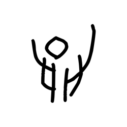

- source_zip_member: `Sub-character Images/4yk9wrn272/4yk9wrn272/1nknmejdxq.png`
- checksum_sha256: `dce5630cf3fc7a716e279386188c6bdb2b118b0d33389da6363e25f95e7b42da`
- review_status: `needs_human_visual_review`
- caution: OBIMD subcharacter image is a source-marked review asset only; it is not a confirmed component form, component assignment, or decipherment conclusion.

## asset-015515

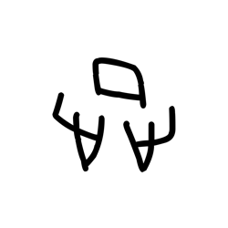

- source_zip_member: `Sub-character Images/4yk9wrn272/4yk9wrn272/1plkdjnbdb.png`
- checksum_sha256: `fab5a66ea62c93887c2e04efecff299a51ce215739caddc206311c573395fee3`
- review_status: `needs_human_visual_review`
- caution: OBIMD subcharacter image is a source-marked review asset only; it is not a confirmed component form, component assignment, or decipherment conclusion.

## asset-015516

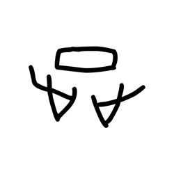

- source_zip_member: `Sub-character Images/4yk9wrn272/4yk9wrn272/1qlvlpozq2.png`
- checksum_sha256: `880b1474271446ef3ee5838b47fa6ce66edc0be2e7a5b461e35ca4861192000b`
- review_status: `needs_human_visual_review`
- caution: OBIMD subcharacter image is a source-marked review asset only; it is not a confirmed component form, component assignment, or decipherment conclusion.

## asset-015517

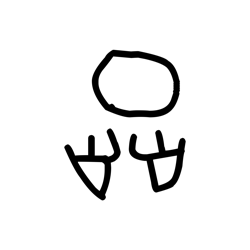

- source_zip_member: `Sub-character Images/4yk9wrn272/4yk9wrn272/1z8jus6rm7.png`
- checksum_sha256: `c237d0eba1fd9f68fa5c45857c4082b8ba1214e907c8d51ace698b2160d7ddde`
- review_status: `needs_human_visual_review`
- caution: OBIMD subcharacter image is a source-marked review asset only; it is not a confirmed component form, component assignment, or decipherment conclusion.

## asset-015518

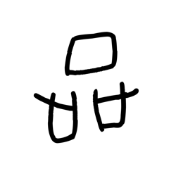

- source_zip_member: `Sub-character Images/4yk9wrn272/4yk9wrn272/22ssjk5chq.png`
- checksum_sha256: `a187a54712343ac437b51a15b0a47f77d9b4425db9549166d9cef0efa4c326c5`
- review_status: `needs_human_visual_review`
- caution: OBIMD subcharacter image is a source-marked review asset only; it is not a confirmed component form, component assignment, or decipherment conclusion.

## asset-015519

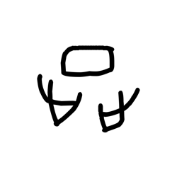

- source_zip_member: `Sub-character Images/4yk9wrn272/4yk9wrn272/2drgwtos3o.png`
- checksum_sha256: `1dac3098f186a29d33d84f7888ea88f5d3caddb773b71f978661a7c3d538e5ee`
- review_status: `needs_human_visual_review`
- caution: OBIMD subcharacter image is a source-marked review asset only; it is not a confirmed component form, component assignment, or decipherment conclusion.

## asset-015520

- source_zip_member: `Sub-character Images/4yk9wrn272/4yk9wrn272/2ihpre9qeo.png`
- checksum_sha256: `09e704ba95b3f7c721ffd8980f609bd4414d02876e8cc8824329433def334288`
- review_status: `needs_human_visual_review`
- caution: OBIMD subcharacter image is a source-marked review asset only; it is not a confirmed component form, component assignment, or decipherment conclusion.

## asset-015521

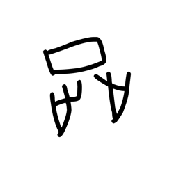

- source_zip_member: `Sub-character Images/4yk9wrn272/4yk9wrn272/32mn4j4v9x.png`
- checksum_sha256: `cd8cd55d6d3f1959c5fc50356db42c358a4a37e0ecfdbd5f9675fce9cbf55231`
- review_status: `needs_human_visual_review`
- caution: OBIMD subcharacter image is a source-marked review asset only; it is not a confirmed component form, component assignment, or decipherment conclusion.

## asset-015522

- source_zip_member: `Sub-character Images/4yk9wrn272/4yk9wrn272/48bvq9dpp0.png`
- checksum_sha256: `f3ba98316b55f0c6ab15aed5c188d7d349afdcd015cff641686068efc7c4dd4b`
- review_status: `needs_human_visual_review`
- caution: OBIMD subcharacter image is a source-marked review asset only; it is not a confirmed component form, component assignment, or decipherment conclusion.

## asset-015523

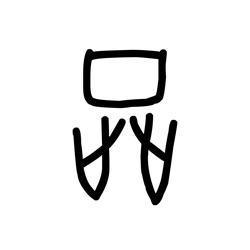

- source_zip_member: `Sub-character Images/4yk9wrn272/4yk9wrn272/4yk9wrn272.png`
- checksum_sha256: `ae221f1c199bc565e48bfbea9f94d7ba17e14db35b2f7ef5cb2c1f2f027cbcbb`
- review_status: `needs_human_visual_review`
- caution: OBIMD subcharacter image is a source-marked review asset only; it is not a confirmed component form, component assignment, or decipherment conclusion.

## asset-015524

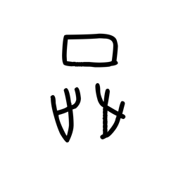

- source_zip_member: `Sub-character Images/4yk9wrn272/4yk9wrn272/5f0fv038gt.png`
- checksum_sha256: `5f91c35a9c1208dcd193b30cfd53b73311d5dee41723299f7b74d4074ba34db5`
- review_status: `needs_human_visual_review`
- caution: OBIMD subcharacter image is a source-marked review asset only; it is not a confirmed component form, component assignment, or decipherment conclusion.

## asset-015525

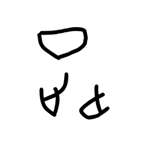

- source_zip_member: `Sub-character Images/4yk9wrn272/4yk9wrn272/6nstx8cr50.png`
- checksum_sha256: `3cffa4e6053d7a3dce1e5a869a8548b0d1d27ff886501a3920101ec2a5a4ccea`
- review_status: `needs_human_visual_review`
- caution: OBIMD subcharacter image is a source-marked review asset only; it is not a confirmed component form, component assignment, or decipherment conclusion.

## asset-015526

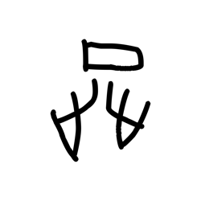

- source_zip_member: `Sub-character Images/4yk9wrn272/4yk9wrn272/7injufbwrj.png`
- checksum_sha256: `ba9631ad30c27b150d1409d21edd86e39d467764b4552e9c14d3b7785572a0c7`
- review_status: `needs_human_visual_review`
- caution: OBIMD subcharacter image is a source-marked review asset only; it is not a confirmed component form, component assignment, or decipherment conclusion.

## asset-015527

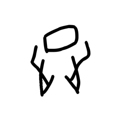

- source_zip_member: `Sub-character Images/4yk9wrn272/4yk9wrn272/8d9buuui5c.png`
- checksum_sha256: `9cceaad82d78cd2dbd8274deb63abb8eed956f380cfc1d866f176ab84eda067a`
- review_status: `needs_human_visual_review`
- caution: OBIMD subcharacter image is a source-marked review asset only; it is not a confirmed component form, component assignment, or decipherment conclusion.

## asset-015528

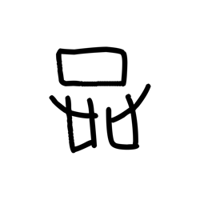

- source_zip_member: `Sub-character Images/4yk9wrn272/4yk9wrn272/bbjp4e74e3.png`
- checksum_sha256: `197afc5b95466a59244f6a651a7a88c3386b3c6f710218b91411324179783412`
- review_status: `needs_human_visual_review`
- caution: OBIMD subcharacter image is a source-marked review asset only; it is not a confirmed component form, component assignment, or decipherment conclusion.

## asset-015529

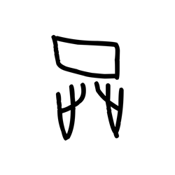

- source_zip_member: `Sub-character Images/4yk9wrn272/4yk9wrn272/c2k5nmnq6m.png`
- checksum_sha256: `7d49588f28210a208d0019221a4bf2719a9fd2d588401cba07ed326a6996e37c`
- review_status: `needs_human_visual_review`
- caution: OBIMD subcharacter image is a source-marked review asset only; it is not a confirmed component form, component assignment, or decipherment conclusion.

## asset-015530

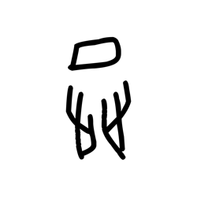

- source_zip_member: `Sub-character Images/4yk9wrn272/4yk9wrn272/dpg3p8lcve.png`
- checksum_sha256: `52318707e05a32c2b5e32a0c434421eb13f6508f62b64a927a2bab17863becbd`
- review_status: `needs_human_visual_review`
- caution: OBIMD subcharacter image is a source-marked review asset only; it is not a confirmed component form, component assignment, or decipherment conclusion.

## asset-015531

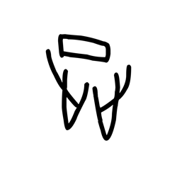

- source_zip_member: `Sub-character Images/4yk9wrn272/4yk9wrn272/e91q8qoq56.png`
- checksum_sha256: `39fd646059350d129c9409bc20f3f2ef1e6f063574ee77dfbc36e8a68160c293`
- review_status: `needs_human_visual_review`
- caution: OBIMD subcharacter image is a source-marked review asset only; it is not a confirmed component form, component assignment, or decipherment conclusion.

## asset-015532

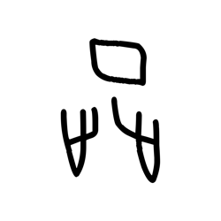

- source_zip_member: `Sub-character Images/4yk9wrn272/4yk9wrn272/ejc9c5welc.png`
- checksum_sha256: `ae8898c6f275d379130a39040c62258b14d8f180dfb50f582c004aa3f88744c5`
- review_status: `needs_human_visual_review`
- caution: OBIMD subcharacter image is a source-marked review asset only; it is not a confirmed component form, component assignment, or decipherment conclusion.

## asset-015533

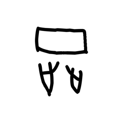

- source_zip_member: `Sub-character Images/4yk9wrn272/4yk9wrn272/equj6edpwr.png`
- checksum_sha256: `f76d44630136bc17cb908971f365b53d75b37c2fde81145ac04f78c7d3cdf757`
- review_status: `needs_human_visual_review`
- caution: OBIMD subcharacter image is a source-marked review asset only; it is not a confirmed component form, component assignment, or decipherment conclusion.

## asset-015534

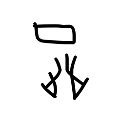

- source_zip_member: `Sub-character Images/4yk9wrn272/4yk9wrn272/fz1fw6r8sz.png`
- checksum_sha256: `e3116a2b22bb20165d414a7399b2f4b7320c2b407b29eb8c7c05f26096b510dd`
- review_status: `needs_human_visual_review`
- caution: OBIMD subcharacter image is a source-marked review asset only; it is not a confirmed component form, component assignment, or decipherment conclusion.

## asset-015535

- source_zip_member: `Sub-character Images/4yk9wrn272/4yk9wrn272/g45xfqgbfx.png`
- checksum_sha256: `9204ed48158a6fb70e0f48de88ab8835f94262e912897e8efa243bc9892456ae`
- review_status: `needs_human_visual_review`
- caution: OBIMD subcharacter image is a source-marked review asset only; it is not a confirmed component form, component assignment, or decipherment conclusion.

## asset-015536

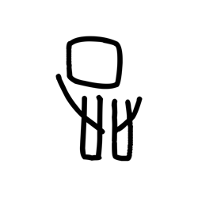

- source_zip_member: `Sub-character Images/4yk9wrn272/4yk9wrn272/gbjrycjaje.png`
- checksum_sha256: `17a67c86cef496ed57550169548df7b06367797c5a992f906077e1b577a493ca`
- review_status: `needs_human_visual_review`
- caution: OBIMD subcharacter image is a source-marked review asset only; it is not a confirmed component form, component assignment, or decipherment conclusion.

## asset-015537

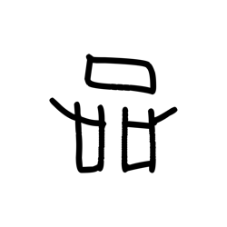

- source_zip_member: `Sub-character Images/4yk9wrn272/4yk9wrn272/gr6y2o6crj.png`
- checksum_sha256: `5b0200b7ff21d9aeb6e03b3f6dc488d1119dff6395f5564b7061fb7bbe36d24a`
- review_status: `needs_human_visual_review`
- caution: OBIMD subcharacter image is a source-marked review asset only; it is not a confirmed component form, component assignment, or decipherment conclusion.

## asset-015538

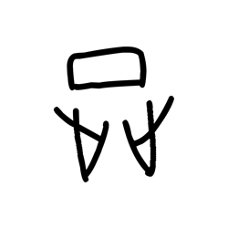

- source_zip_member: `Sub-character Images/4yk9wrn272/4yk9wrn272/gvvufth6ai.png`
- checksum_sha256: `0a57323a4eeadaa7e953b6b078b53af8d64573b4e7ef5d8b84efd8d8732d2e59`
- review_status: `needs_human_visual_review`
- caution: OBIMD subcharacter image is a source-marked review asset only; it is not a confirmed component form, component assignment, or decipherment conclusion.

## asset-015539

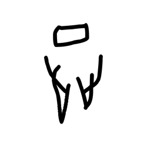

- source_zip_member: `Sub-character Images/4yk9wrn272/4yk9wrn272/hzomaykzfm.png`
- checksum_sha256: `b9b7fedc8cc8278c2a57c33969046bec5d057797d7d0b63e6feec03faa077fa8`
- review_status: `needs_human_visual_review`
- caution: OBIMD subcharacter image is a source-marked review asset only; it is not a confirmed component form, component assignment, or decipherment conclusion.

## asset-015540

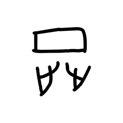

- source_zip_member: `Sub-character Images/4yk9wrn272/4yk9wrn272/jss28kn9ky.png`
- checksum_sha256: `056667215283fe5819bcffe1eec7c1ccd0ce627ac56f9c792dfd61cc84d6b47d`
- review_status: `needs_human_visual_review`
- caution: OBIMD subcharacter image is a source-marked review asset only; it is not a confirmed component form, component assignment, or decipherment conclusion.

## asset-015541

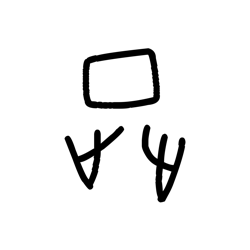

- source_zip_member: `Sub-character Images/4yk9wrn272/4yk9wrn272/ksyxq7v12a.png`
- checksum_sha256: `35f683a591c7d57a2b992dfc9782c73a706e892d27fb8000d4a32d31b0dfaca4`
- review_status: `needs_human_visual_review`
- caution: OBIMD subcharacter image is a source-marked review asset only; it is not a confirmed component form, component assignment, or decipherment conclusion.

## asset-015542

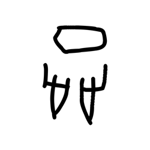

- source_zip_member: `Sub-character Images/4yk9wrn272/4yk9wrn272/kw1fec84mz.png`
- checksum_sha256: `84ab1c1fb9728b198a19474468825dd8e888f6709d6a22012af7db8e6d9bf89c`
- review_status: `needs_human_visual_review`
- caution: OBIMD subcharacter image is a source-marked review asset only; it is not a confirmed component form, component assignment, or decipherment conclusion.

## asset-015543

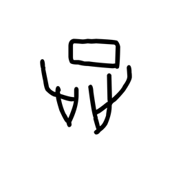

- source_zip_member: `Sub-character Images/4yk9wrn272/4yk9wrn272/m61hz2km1l.png`
- checksum_sha256: `01725b1b991d4e6c724eb63565f3d77828d9517b4742eec3ac18741b74ea33e9`
- review_status: `needs_human_visual_review`
- caution: OBIMD subcharacter image is a source-marked review asset only; it is not a confirmed component form, component assignment, or decipherment conclusion.

## asset-015544

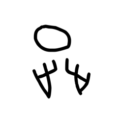

- source_zip_member: `Sub-character Images/4yk9wrn272/4yk9wrn272/mkpt5pgs7q.png`
- checksum_sha256: `17b24c9aa899a0cfc2df1276e392dded86a1b007872990c9515f9701474d20c7`
- review_status: `needs_human_visual_review`
- caution: OBIMD subcharacter image is a source-marked review asset only; it is not a confirmed component form, component assignment, or decipherment conclusion.

## asset-015545

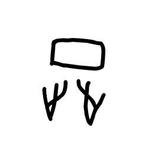

- source_zip_member: `Sub-character Images/4yk9wrn272/4yk9wrn272/nhyq09vn1u.png`
- checksum_sha256: `2f509d54ac20e3a670fb9fee598e161a574fb6e8262d7ffd9a55df80f59d4a7f`
- review_status: `needs_human_visual_review`
- caution: OBIMD subcharacter image is a source-marked review asset only; it is not a confirmed component form, component assignment, or decipherment conclusion.

## asset-015546

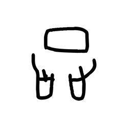

- source_zip_member: `Sub-character Images/4yk9wrn272/4yk9wrn272/opo1hakg3r.png`
- checksum_sha256: `1d09f96681f653b632ddbcccc6c2dfce91bd2269cc9ced79381f2cfacf844894`
- review_status: `needs_human_visual_review`
- caution: OBIMD subcharacter image is a source-marked review asset only; it is not a confirmed component form, component assignment, or decipherment conclusion.

## asset-015547

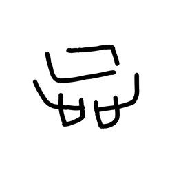

- source_zip_member: `Sub-character Images/4yk9wrn272/4yk9wrn272/orw1c8lj86.png`
- checksum_sha256: `467227905e4359cb45b7b69f29fbdb7ec49b3a63451311220524851bd18a2f76`
- review_status: `needs_human_visual_review`
- caution: OBIMD subcharacter image is a source-marked review asset only; it is not a confirmed component form, component assignment, or decipherment conclusion.

## asset-015548

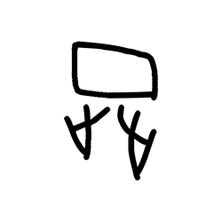

- source_zip_member: `Sub-character Images/4yk9wrn272/4yk9wrn272/pbx69ksdzw.png`
- checksum_sha256: `d11c0f45c9380758e0abe2f956c6e13ce5cd29690225b7c2e6acbfd12fd3b928`
- review_status: `needs_human_visual_review`
- caution: OBIMD subcharacter image is a source-marked review asset only; it is not a confirmed component form, component assignment, or decipherment conclusion.

## asset-015549

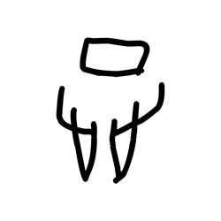

- source_zip_member: `Sub-character Images/4yk9wrn272/4yk9wrn272/r49hjfyxo3.png`
- checksum_sha256: `d65b15ab79624cb62658d765d32bd714ba16e492bb0e05af852b9ae20ceef422`
- review_status: `needs_human_visual_review`
- caution: OBIMD subcharacter image is a source-marked review asset only; it is not a confirmed component form, component assignment, or decipherment conclusion.

## asset-015550

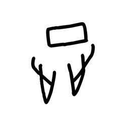

- source_zip_member: `Sub-character Images/4yk9wrn272/4yk9wrn272/t1mmt7u4k7.png`
- checksum_sha256: `807de4a31ca3bf00b8170acb9a8d641ca57afc2e030c5f8cd8a62efcca400eb7`
- review_status: `needs_human_visual_review`
- caution: OBIMD subcharacter image is a source-marked review asset only; it is not a confirmed component form, component assignment, or decipherment conclusion.

## asset-015551

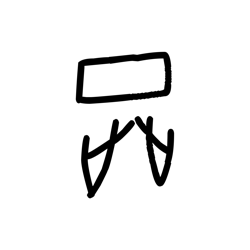

- source_zip_member: `Sub-character Images/4yk9wrn272/4yk9wrn272/t3y9nns2rk.png`
- checksum_sha256: `9757e96d38e548b0a17b43bf15867fe2016d07cb895df48e89c41183b311660f`
- review_status: `needs_human_visual_review`
- caution: OBIMD subcharacter image is a source-marked review asset only; it is not a confirmed component form, component assignment, or decipherment conclusion.

## asset-015552

- source_zip_member: `Sub-character Images/4yk9wrn272/4yk9wrn272/t650aos3lt.png`
- checksum_sha256: `106130dd1177a5baca89806bd98b185614fdc017123aeeb71af19ad1267c7f8a`
- review_status: `needs_human_visual_review`
- caution: OBIMD subcharacter image is a source-marked review asset only; it is not a confirmed component form, component assignment, or decipherment conclusion.

## asset-015553

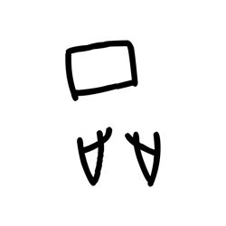

- source_zip_member: `Sub-character Images/4yk9wrn272/4yk9wrn272/tgy6n5kwb1.png`
- checksum_sha256: `9aed10aa8ff577bbc4fc94a09abd11a5ff669ed3458c9ee4981f8014201cc320`
- review_status: `needs_human_visual_review`
- caution: OBIMD subcharacter image is a source-marked review asset only; it is not a confirmed component form, component assignment, or decipherment conclusion.

## asset-015554

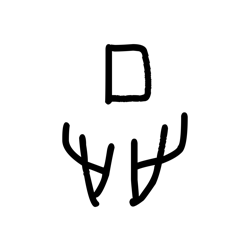

- source_zip_member: `Sub-character Images/4yk9wrn272/4yk9wrn272/uqufqkaee9.png`
- checksum_sha256: `a4b7e1b36f8681e0486a5c3c77c8d603f07c8b08da6977dcc91938e7cc8a5a79`
- review_status: `needs_human_visual_review`
- caution: OBIMD subcharacter image is a source-marked review asset only; it is not a confirmed component form, component assignment, or decipherment conclusion.

## asset-015555

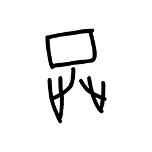

- source_zip_member: `Sub-character Images/4yk9wrn272/4yk9wrn272/vlk0fyc1ms.png`
- checksum_sha256: `f733c8f08407ec0818feca694003f8ab934c8a84a7bb4df7880f63050f811be7`
- review_status: `needs_human_visual_review`
- caution: OBIMD subcharacter image is a source-marked review asset only; it is not a confirmed component form, component assignment, or decipherment conclusion.

## asset-015556

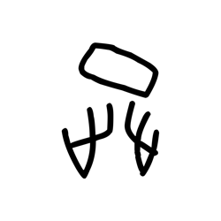

- source_zip_member: `Sub-character Images/4yk9wrn272/4yk9wrn272/vmverbo8yx.png`
- checksum_sha256: `0db3ed7b750386fd83935f373ba2c7e71ab51af1063c835429b237997108c43e`
- review_status: `needs_human_visual_review`
- caution: OBIMD subcharacter image is a source-marked review asset only; it is not a confirmed component form, component assignment, or decipherment conclusion.

## asset-015557

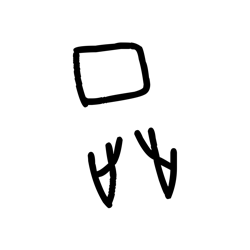

- source_zip_member: `Sub-character Images/4yk9wrn272/4yk9wrn272/vukutimy7g.png`
- checksum_sha256: `fa99fb9a4a7ecfbe2890ace9ffdd6c46e56ce74ac454f7aee5f69543f610af08`
- review_status: `needs_human_visual_review`
- caution: OBIMD subcharacter image is a source-marked review asset only; it is not a confirmed component form, component assignment, or decipherment conclusion.

## asset-015558

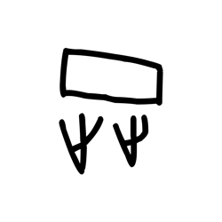

- source_zip_member: `Sub-character Images/4yk9wrn272/4yk9wrn272/vusl2hkdu4.png`
- checksum_sha256: `274d6f18dabe83c376d216c5dd49bc9fb48cb745621c19f19045fd7438932412`
- review_status: `needs_human_visual_review`
- caution: OBIMD subcharacter image is a source-marked review asset only; it is not a confirmed component form, component assignment, or decipherment conclusion.

## asset-015559

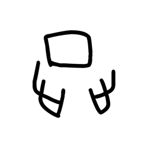

- source_zip_member: `Sub-character Images/4yk9wrn272/4yk9wrn272/wukb30f7qf.png`
- checksum_sha256: `4f6907db985d23bfa498464bf1308fece7c3c641bb2ba58465b8caa695f0187a`
- review_status: `needs_human_visual_review`
- caution: OBIMD subcharacter image is a source-marked review asset only; it is not a confirmed component form, component assignment, or decipherment conclusion.

## asset-015560

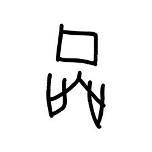

- source_zip_member: `Sub-character Images/4yk9wrn272/4yk9wrn272/xjenvb3mt0.png`
- checksum_sha256: `800dfb6820236a0161a79d73c9c9ac17b5442960dfcc84f2825cc66e330730f2`
- review_status: `needs_human_visual_review`
- caution: OBIMD subcharacter image is a source-marked review asset only; it is not a confirmed component form, component assignment, or decipherment conclusion.

## asset-015561

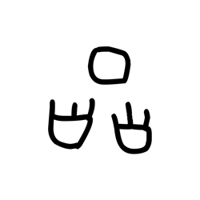

- source_zip_member: `Sub-character Images/4yk9wrn272/4yk9wrn272/z86phstkoi.png`
- checksum_sha256: `4e5c2d5a3ffd5a51dd84e09d0349a9d07449655af72fdf3900c65bb6f41df302`
- review_status: `needs_human_visual_review`
- caution: OBIMD subcharacter image is a source-marked review asset only; it is not a confirmed component form, component assignment, or decipherment conclusion.
