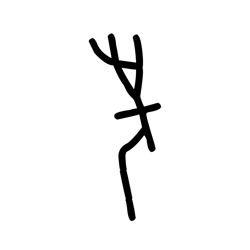
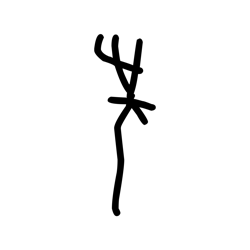
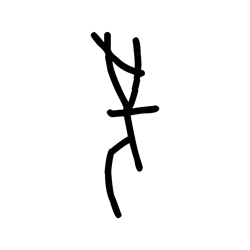
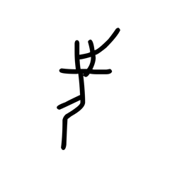
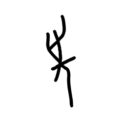
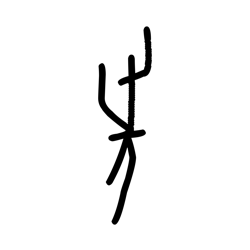

# Component Visual Gallery / 构件图像查看: obs-comp-cand-001294

English:
This page displays OBIMD subcharacter PNG assets extracted into this concrete
corpus object directory for human review.

简体中文：
本页展示抽取到当前具体 corpus 对象目录内的 OBIMD subcharacter PNG 资料，供人工复核使用。

Boundary / 边界：
dataset image candidate only; not a confirmed component form, not a component
assignment, and not a decipherment claim.
- not a confirmed component form
- not a component assignment
- not a decipherment claim

## Concrete Questions To Check / 具体待查问题

- Which local image should be opened first?
- 应先打开哪一张本地构件图像？
- Which source zip member anchors this image?
- 哪一个 source zip member 能定位这张图像？
- Which near-shape or variant comparison is still missing?
- 还缺哪些近形或异体比较？
- Which character or inscription context should be checked next?
- 下一步应核对哪些单字或卜辞上下文？
- What evidence is missing before a component assignment?
- 正式构件归属前还缺哪些证据？

## asset-015579

- source_zip_member: `Sub-character Images/h8exoqnpru/stk8nntqia/0rdl6fpa7a.png`
- checksum_sha256: see `06_component-visual-index.csv`.
- review_status: `needs_human_visual_review`
- caution: source-marked review image only.

## asset-015580

- source_zip_member: `Sub-character Images/h8exoqnpru/stk8nntqia/1ay4td9qi6.png`
- checksum_sha256: see `06_component-visual-index.csv`.
- review_status: `needs_human_visual_review`
- caution: source-marked review image only.

## asset-015581

- source_zip_member: `Sub-character Images/h8exoqnpru/stk8nntqia/1pyrb6bmle.png`
- checksum_sha256: see `06_component-visual-index.csv`.
- review_status: `needs_human_visual_review`
- caution: source-marked review image only.

## asset-015582

- source_zip_member: `Sub-character Images/h8exoqnpru/stk8nntqia/1w01gb4n87.png`
- checksum_sha256: see `06_component-visual-index.csv`.
- review_status: `needs_human_visual_review`
- caution: source-marked review image only.

## asset-015583

- source_zip_member: `Sub-character Images/h8exoqnpru/stk8nntqia/2209k4izji.png`
- checksum_sha256: see `06_component-visual-index.csv`.
- review_status: `needs_human_visual_review`
- caution: source-marked review image only.

## asset-015584

- source_zip_member: `Sub-character Images/h8exoqnpru/stk8nntqia/2bnl1nl1xh.png`
- checksum_sha256: see `06_component-visual-index.csv`.
- review_status: `needs_human_visual_review`
- caution: source-marked review image only.

## asset-015585

- source_zip_member: `Sub-character Images/h8exoqnpru/stk8nntqia/2e85cttiro.png`
- checksum_sha256: see `06_component-visual-index.csv`.
- review_status: `needs_human_visual_review`
- caution: source-marked review image only.

## asset-015586

- source_zip_member: `Sub-character Images/h8exoqnpru/stk8nntqia/3nrfdj9vb3.png`
- checksum_sha256: see `06_component-visual-index.csv`.
- review_status: `needs_human_visual_review`
- caution: source-marked review image only.

## asset-015587

- source_zip_member: `Sub-character Images/h8exoqnpru/stk8nntqia/4b3yiuvj3l.png`
- checksum_sha256: see `06_component-visual-index.csv`.
- review_status: `needs_human_visual_review`
- caution: source-marked review image only.

## asset-015588

- source_zip_member: `Sub-character Images/h8exoqnpru/stk8nntqia/6i0ps9fbn3.png`
- checksum_sha256: see `06_component-visual-index.csv`.
- review_status: `needs_human_visual_review`
- caution: source-marked review image only.

## asset-015589

- source_zip_member: `Sub-character Images/h8exoqnpru/stk8nntqia/6naaw44tol.png`
- checksum_sha256: see `06_component-visual-index.csv`.
- review_status: `needs_human_visual_review`
- caution: source-marked review image only.

## asset-015590

- source_zip_member: `Sub-character Images/h8exoqnpru/stk8nntqia/7jluvw0j48.png`
- checksum_sha256: see `06_component-visual-index.csv`.
- review_status: `needs_human_visual_review`
- caution: source-marked review image only.

## asset-015591

- source_zip_member: `Sub-character Images/h8exoqnpru/stk8nntqia/8dawxhpweu.png`
- checksum_sha256: see `06_component-visual-index.csv`.
- review_status: `needs_human_visual_review`
- caution: source-marked review image only.

## asset-015592

- source_zip_member: `Sub-character Images/h8exoqnpru/stk8nntqia/8e8n6r4v84.png`
- checksum_sha256: see `06_component-visual-index.csv`.
- review_status: `needs_human_visual_review`
- caution: source-marked review image only.

## asset-015593

- source_zip_member: `Sub-character Images/h8exoqnpru/stk8nntqia/9qe4uisyl9.png`
- checksum_sha256: see `06_component-visual-index.csv`.
- review_status: `needs_human_visual_review`
- caution: source-marked review image only.

## asset-015594

- source_zip_member: `Sub-character Images/h8exoqnpru/stk8nntqia/9yhw8dqsnz.png`
- checksum_sha256: see `06_component-visual-index.csv`.
- review_status: `needs_human_visual_review`
- caution: source-marked review image only.

## asset-015595

- source_zip_member: `Sub-character Images/h8exoqnpru/stk8nntqia/adbdubtp4h.png`
- checksum_sha256: see `06_component-visual-index.csv`.
- review_status: `needs_human_visual_review`
- caution: source-marked review image only.

## asset-015596

- source_zip_member: `Sub-character Images/h8exoqnpru/stk8nntqia/afpsoykb28.png`
- checksum_sha256: see `06_component-visual-index.csv`.
- review_status: `needs_human_visual_review`
- caution: source-marked review image only.

## asset-015597

- source_zip_member: `Sub-character Images/h8exoqnpru/stk8nntqia/b9qfiilisj.png`
- checksum_sha256: see `06_component-visual-index.csv`.
- review_status: `needs_human_visual_review`
- caution: source-marked review image only.

## asset-015598

- source_zip_member: `Sub-character Images/h8exoqnpru/stk8nntqia/c2cb1npk0o.png`
- checksum_sha256: see `06_component-visual-index.csv`.
- review_status: `needs_human_visual_review`
- caution: source-marked review image only.

## asset-015599

- source_zip_member: `Sub-character Images/h8exoqnpru/stk8nntqia/ceoudwt3su.png`
- checksum_sha256: see `06_component-visual-index.csv`.
- review_status: `needs_human_visual_review`
- caution: source-marked review image only.

## asset-015600

- source_zip_member: `Sub-character Images/h8exoqnpru/stk8nntqia/clfhxsp4xb.png`
- checksum_sha256: see `06_component-visual-index.csv`.
- review_status: `needs_human_visual_review`
- caution: source-marked review image only.

## asset-015601

- source_zip_member: `Sub-character Images/h8exoqnpru/stk8nntqia/ep33xhgf94.png`
- checksum_sha256: see `06_component-visual-index.csv`.
- review_status: `needs_human_visual_review`
- caution: source-marked review image only.

## asset-015602

- source_zip_member: `Sub-character Images/h8exoqnpru/stk8nntqia/fnt935d12r.png`
- checksum_sha256: see `06_component-visual-index.csv`.
- review_status: `needs_human_visual_review`
- caution: source-marked review image only.

## asset-015603

- source_zip_member: `Sub-character Images/h8exoqnpru/stk8nntqia/fwduj9lx64.png`
- checksum_sha256: see `06_component-visual-index.csv`.
- review_status: `needs_human_visual_review`
- caution: source-marked review image only.

## asset-015604

- source_zip_member: `Sub-character Images/h8exoqnpru/stk8nntqia/gs8kvecxs7.png`
- checksum_sha256: see `06_component-visual-index.csv`.
- review_status: `needs_human_visual_review`
- caution: source-marked review image only.

## asset-015605

- source_zip_member: `Sub-character Images/h8exoqnpru/stk8nntqia/gy6n9o8s7l.png`
- checksum_sha256: see `06_component-visual-index.csv`.
- review_status: `needs_human_visual_review`
- caution: source-marked review image only.

## asset-015606

- source_zip_member: `Sub-character Images/h8exoqnpru/stk8nntqia/iu8k73ehq0.png`
- checksum_sha256: see `06_component-visual-index.csv`.
- review_status: `needs_human_visual_review`
- caution: source-marked review image only.

## asset-015607

- source_zip_member: `Sub-character Images/h8exoqnpru/stk8nntqia/jpb0cu72gd.png`
- checksum_sha256: see `06_component-visual-index.csv`.
- review_status: `needs_human_visual_review`
- caution: source-marked review image only.

## asset-015608

- source_zip_member: `Sub-character Images/h8exoqnpru/stk8nntqia/k1bikhe08i.png`
- checksum_sha256: see `06_component-visual-index.csv`.
- review_status: `needs_human_visual_review`
- caution: source-marked review image only.

## asset-015609

- source_zip_member: `Sub-character Images/h8exoqnpru/stk8nntqia/kvgbde68jg.png`
- checksum_sha256: see `06_component-visual-index.csv`.
- review_status: `needs_human_visual_review`
- caution: source-marked review image only.

## asset-015610

- source_zip_member: `Sub-character Images/h8exoqnpru/stk8nntqia/l7v1gk2fkt.png`
- checksum_sha256: see `06_component-visual-index.csv`.
- review_status: `needs_human_visual_review`
- caution: source-marked review image only.

## asset-015611

- source_zip_member: `Sub-character Images/h8exoqnpru/stk8nntqia/lw7ks6czql.png`
- checksum_sha256: see `06_component-visual-index.csv`.
- review_status: `needs_human_visual_review`
- caution: source-marked review image only.

## asset-015612

- source_zip_member: `Sub-character Images/h8exoqnpru/stk8nntqia/meza5ktsgt.png`
- checksum_sha256: see `06_component-visual-index.csv`.
- review_status: `needs_human_visual_review`
- caution: source-marked review image only.

## asset-015613

- source_zip_member: `Sub-character Images/h8exoqnpru/stk8nntqia/n18plon6lt.png`
- checksum_sha256: see `06_component-visual-index.csv`.
- review_status: `needs_human_visual_review`
- caution: source-marked review image only.

## asset-015614

- source_zip_member: `Sub-character Images/h8exoqnpru/stk8nntqia/qsbi2kpzzl.png`
- checksum_sha256: see `06_component-visual-index.csv`.
- review_status: `needs_human_visual_review`
- caution: source-marked review image only.

## asset-015615

- source_zip_member: `Sub-character Images/h8exoqnpru/stk8nntqia/rh9zejdlnk.png`
- checksum_sha256: see `06_component-visual-index.csv`.
- review_status: `needs_human_visual_review`
- caution: source-marked review image only.

## asset-015616

- source_zip_member: `Sub-character Images/h8exoqnpru/stk8nntqia/s3y1yaqaxi.png`
- checksum_sha256: see `06_component-visual-index.csv`.
- review_status: `needs_human_visual_review`
- caution: source-marked review image only.

## asset-015617

- source_zip_member: `Sub-character Images/h8exoqnpru/stk8nntqia/sfwfh30t4a.png`
- checksum_sha256: see `06_component-visual-index.csv`.
- review_status: `needs_human_visual_review`
- caution: source-marked review image only.

## asset-015618

- source_zip_member: `Sub-character Images/h8exoqnpru/stk8nntqia/stk8nntqia.png`
- checksum_sha256: see `06_component-visual-index.csv`.
- review_status: `needs_human_visual_review`
- caution: source-marked review image only.

## asset-015619

- source_zip_member: `Sub-character Images/h8exoqnpru/stk8nntqia/tvome8cvyc.png`
- checksum_sha256: see `06_component-visual-index.csv`.
- review_status: `needs_human_visual_review`
- caution: source-marked review image only.

## asset-015620

- source_zip_member: `Sub-character Images/h8exoqnpru/stk8nntqia/uhzniohc93.png`
- checksum_sha256: see `06_component-visual-index.csv`.
- review_status: `needs_human_visual_review`
- caution: source-marked review image only.

## asset-015621

- source_zip_member: `Sub-character Images/h8exoqnpru/stk8nntqia/ur33dfhyj6.png`
- checksum_sha256: see `06_component-visual-index.csv`.
- review_status: `needs_human_visual_review`
- caution: source-marked review image only.

## asset-015622

- source_zip_member: `Sub-character Images/h8exoqnpru/stk8nntqia/uxn9eagtol.png`
- checksum_sha256: see `06_component-visual-index.csv`.
- review_status: `needs_human_visual_review`
- caution: source-marked review image only.

## asset-015623

- source_zip_member: `Sub-character Images/h8exoqnpru/stk8nntqia/wmhgx8gyzr.png`
- checksum_sha256: see `06_component-visual-index.csv`.
- review_status: `needs_human_visual_review`
- caution: source-marked review image only.

## asset-015624

- source_zip_member: `Sub-character Images/h8exoqnpru/stk8nntqia/xvo3addikq.png`
- checksum_sha256: see `06_component-visual-index.csv`.
- review_status: `needs_human_visual_review`
- caution: source-marked review image only.

## asset-015625

- source_zip_member: `Sub-character Images/h8exoqnpru/stk8nntqia/y0jg8j9y6x.png`
- checksum_sha256: see `06_component-visual-index.csv`.
- review_status: `needs_human_visual_review`
- caution: source-marked review image only.

## asset-015626

- source_zip_member: `Sub-character Images/h8exoqnpru/stk8nntqia/y4xz1vm55t.png`
- checksum_sha256: see `06_component-visual-index.csv`.
- review_status: `needs_human_visual_review`
- caution: source-marked review image only.

## asset-015627

- source_zip_member: `Sub-character Images/h8exoqnpru/stk8nntqia/y5fxnbg2zs.png`
- checksum_sha256: see `06_component-visual-index.csv`.
- review_status: `needs_human_visual_review`
- caution: source-marked review image only.

## asset-015628

- source_zip_member: `Sub-character Images/h8exoqnpru/stk8nntqia/ytck50bea0.png`
- checksum_sha256: see `06_component-visual-index.csv`.
- review_status: `needs_human_visual_review`
- caution: source-marked review image only.

## asset-015629

- source_zip_member: `Sub-character Images/h8exoqnpru/stk8nntqia/z3j3syveka.png`
- checksum_sha256: see `06_component-visual-index.csv`.
- review_status: `needs_human_visual_review`
- caution: source-marked review image only.

## asset-015630

- source_zip_member: `Sub-character Images/h8exoqnpru/stk8nntqia/z9slq5hile.png`
- checksum_sha256: see `06_component-visual-index.csv`.
- review_status: `needs_human_visual_review`
- caution: source-marked review image only.

## asset-015631

- source_zip_member: `Sub-character Images/h8exoqnpru/stk8nntqia/zeen2qfju3.png`
- checksum_sha256: see `06_component-visual-index.csv`.
- review_status: `needs_human_visual_review`
- caution: source-marked review image only.
