# Component Visual Gallery / 构件图像查看: obs-comp-cand-001337

English:
This page displays OBIMD subcharacter PNG assets extracted into this concrete corpus object directory for human review.

简体中文：
本页展示抽取到当前具体 corpus 对象目录内的 OBIMD subcharacter PNG 资料，供人工复核使用。

Boundary / 边界：dataset image candidate only; not a confirmed component form, component assignment, or decipherment claim.

## asset-015674

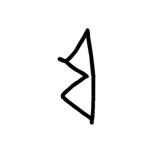

- source_zip_member: `Sub-character Images/0avi2tcy0g/0avi2tcy0g/033rqi8ht0.png`
- checksum_sha256: `f2344952a73417f7bed31b1b956472c934b8f6424d705f96a0c55cdf3e29cb40`
- review_status: `needs_human_visual_review`
- caution: OBIMD subcharacter image is a source-marked review asset only; it is not a confirmed component form, component assignment, or decipherment conclusion.

## asset-015675

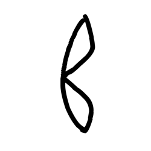

- source_zip_member: `Sub-character Images/0avi2tcy0g/0avi2tcy0g/0avi2tcy0g.png`
- checksum_sha256: `60c0d9be83768ebcb2c2b3bb5c1b3e69617b506e5ccd99d4b22a6b376e54b1ad`
- review_status: `needs_human_visual_review`
- caution: OBIMD subcharacter image is a source-marked review asset only; it is not a confirmed component form, component assignment, or decipherment conclusion.

## asset-015676

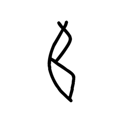

- source_zip_member: `Sub-character Images/0avi2tcy0g/0avi2tcy0g/119vw1tg39.png`
- checksum_sha256: `6c641a20b370fca3fc4b5698413491ff4a52da463ee0c79f94a530951aad8059`
- review_status: `needs_human_visual_review`
- caution: OBIMD subcharacter image is a source-marked review asset only; it is not a confirmed component form, component assignment, or decipherment conclusion.

## asset-015677

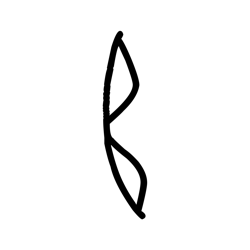

- source_zip_member: `Sub-character Images/0avi2tcy0g/0avi2tcy0g/177h8y3j8b.png`
- checksum_sha256: `5266da8b341f12ce33377933d1b114c50ec2ed15391474e17f5c115235c6de94`
- review_status: `needs_human_visual_review`
- caution: OBIMD subcharacter image is a source-marked review asset only; it is not a confirmed component form, component assignment, or decipherment conclusion.

## asset-015678

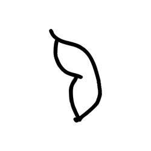

- source_zip_member: `Sub-character Images/0avi2tcy0g/0avi2tcy0g/1t8wbihjpc.png`
- checksum_sha256: `1b36cd6677d46a114863318c9e7f8fe5ba598756868c0924e6983df6748b0d58`
- review_status: `needs_human_visual_review`
- caution: OBIMD subcharacter image is a source-marked review asset only; it is not a confirmed component form, component assignment, or decipherment conclusion.

## asset-015679

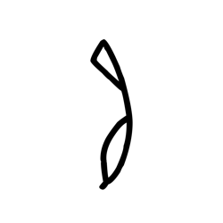

- source_zip_member: `Sub-character Images/0avi2tcy0g/0avi2tcy0g/24abkueygq.png`
- checksum_sha256: `b3bf4e71bacf70ce2a6f94c0d57ce474fa4d969a48f81eac6403000fa6689ab5`
- review_status: `needs_human_visual_review`
- caution: OBIMD subcharacter image is a source-marked review asset only; it is not a confirmed component form, component assignment, or decipherment conclusion.

## asset-015680

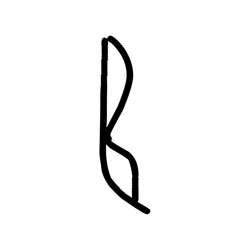

- source_zip_member: `Sub-character Images/0avi2tcy0g/0avi2tcy0g/2vnfypljbc.png`
- checksum_sha256: `1a663a8184e07352f72f61d324055b3c69e7ce925d9952d319a08252a4ce03fb`
- review_status: `needs_human_visual_review`
- caution: OBIMD subcharacter image is a source-marked review asset only; it is not a confirmed component form, component assignment, or decipherment conclusion.

## asset-015681

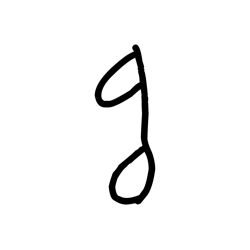

- source_zip_member: `Sub-character Images/0avi2tcy0g/0avi2tcy0g/2zgpxh1av6.png`
- checksum_sha256: `d9934b42d3a9c0d7730a57242474685c78c08bf3a1de639161551b2d4627d88b`
- review_status: `needs_human_visual_review`
- caution: OBIMD subcharacter image is a source-marked review asset only; it is not a confirmed component form, component assignment, or decipherment conclusion.

## asset-015682

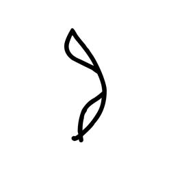

- source_zip_member: `Sub-character Images/0avi2tcy0g/0avi2tcy0g/4o8j04dlo7.png`
- checksum_sha256: `052c358faa61c60328e92e97e0251414fc6f0ab5a31493e1a7bab6c01de1648a`
- review_status: `needs_human_visual_review`
- caution: OBIMD subcharacter image is a source-marked review asset only; it is not a confirmed component form, component assignment, or decipherment conclusion.

## asset-015683

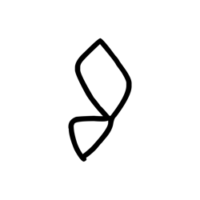

- source_zip_member: `Sub-character Images/0avi2tcy0g/0avi2tcy0g/50vb7mhfji.png`
- checksum_sha256: `da25fcf2007108672d8f4de28d7ba271e742137cef59418b62cd565d6b39e90d`
- review_status: `needs_human_visual_review`
- caution: OBIMD subcharacter image is a source-marked review asset only; it is not a confirmed component form, component assignment, or decipherment conclusion.

## asset-015684

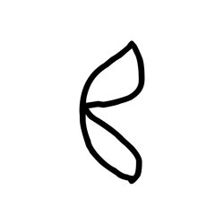

- source_zip_member: `Sub-character Images/0avi2tcy0g/0avi2tcy0g/6qeglaodmh.png`
- checksum_sha256: `027282db789d2f895c1530e5293c2ae5ec449981ea50be82768f1312954a0843`
- review_status: `needs_human_visual_review`
- caution: OBIMD subcharacter image is a source-marked review asset only; it is not a confirmed component form, component assignment, or decipherment conclusion.

## asset-015685

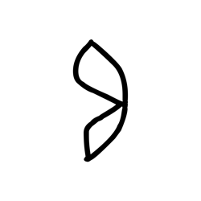

- source_zip_member: `Sub-character Images/0avi2tcy0g/0avi2tcy0g/88mbpo5z04.png`
- checksum_sha256: `3bada71a6aa7c04146f3cc4b7e4ceb484e17f1c023e74d8228745745740c3ff8`
- review_status: `needs_human_visual_review`
- caution: OBIMD subcharacter image is a source-marked review asset only; it is not a confirmed component form, component assignment, or decipherment conclusion.

## asset-015686

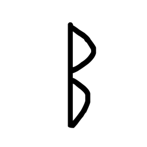

- source_zip_member: `Sub-character Images/0avi2tcy0g/0avi2tcy0g/ap8dcswwg3.png`
- checksum_sha256: `87b24962e894369ea3ed33a35165f7d99fd57d65ecaca02ec32d886b4e98fc78`
- review_status: `needs_human_visual_review`
- caution: OBIMD subcharacter image is a source-marked review asset only; it is not a confirmed component form, component assignment, or decipherment conclusion.

## asset-015687

- source_zip_member: `Sub-character Images/0avi2tcy0g/0avi2tcy0g/cj54zidqm9.png`
- checksum_sha256: `38ca7581d7de142c20d2c176fd325ca20dc9b98e8d9411ed452377bf992d7015`
- review_status: `needs_human_visual_review`
- caution: OBIMD subcharacter image is a source-marked review asset only; it is not a confirmed component form, component assignment, or decipherment conclusion.

## asset-015688

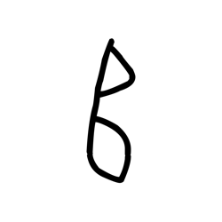

- source_zip_member: `Sub-character Images/0avi2tcy0g/0avi2tcy0g/cmnbaejqb7.png`
- checksum_sha256: `8297d47c08cc09d319b6d49c34cd782c2ad6f1cf55fbd41a0fe7bcf181ef6398`
- review_status: `needs_human_visual_review`
- caution: OBIMD subcharacter image is a source-marked review asset only; it is not a confirmed component form, component assignment, or decipherment conclusion.

## asset-015689

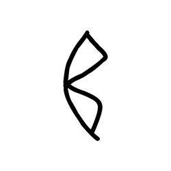

- source_zip_member: `Sub-character Images/0avi2tcy0g/0avi2tcy0g/ct7yeviykt.png`
- checksum_sha256: `7de74a89858b351265861db0aae657431382b9825b8de65f16dada27cea723b9`
- review_status: `needs_human_visual_review`
- caution: OBIMD subcharacter image is a source-marked review asset only; it is not a confirmed component form, component assignment, or decipherment conclusion.

## asset-015690

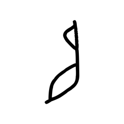

- source_zip_member: `Sub-character Images/0avi2tcy0g/0avi2tcy0g/cue2lfjbss.png`
- checksum_sha256: `4311aeb20e9c3c2de16e5268295db4ac29563986d24bf51accba3abd4bd704f6`
- review_status: `needs_human_visual_review`
- caution: OBIMD subcharacter image is a source-marked review asset only; it is not a confirmed component form, component assignment, or decipherment conclusion.

## asset-015691

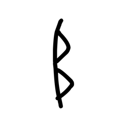

- source_zip_member: `Sub-character Images/0avi2tcy0g/0avi2tcy0g/d42y92613b.png`
- checksum_sha256: `9e54ecc347187ceef41e114e9fc2b04ac731b77572a648b199e58d5a0e250ee5`
- review_status: `needs_human_visual_review`
- caution: OBIMD subcharacter image is a source-marked review asset only; it is not a confirmed component form, component assignment, or decipherment conclusion.

## asset-015692

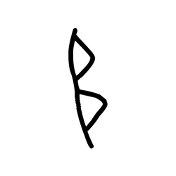

- source_zip_member: `Sub-character Images/0avi2tcy0g/0avi2tcy0g/d9o59udq0j.png`
- checksum_sha256: `7664bab2a7ce86e19f03e803c4ef2c2e1b02e8780146d7403e10ad28ffda0c63`
- review_status: `needs_human_visual_review`
- caution: OBIMD subcharacter image is a source-marked review asset only; it is not a confirmed component form, component assignment, or decipherment conclusion.

## asset-015693

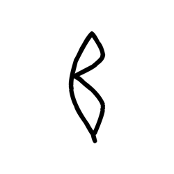

- source_zip_member: `Sub-character Images/0avi2tcy0g/0avi2tcy0g/dp8su884di.png`
- checksum_sha256: `8c26ba2392be7da01fb21e1133f76a59789f0837df44ce3b6922570f3281869a`
- review_status: `needs_human_visual_review`
- caution: OBIMD subcharacter image is a source-marked review asset only; it is not a confirmed component form, component assignment, or decipherment conclusion.

## asset-015694

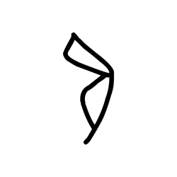

- source_zip_member: `Sub-character Images/0avi2tcy0g/0avi2tcy0g/ebhhrtiqh0.png`
- checksum_sha256: `757d24c39a13b42f14d973039bd467e413dcbe2d1a123391d6d99b07c51cd3c2`
- review_status: `needs_human_visual_review`
- caution: OBIMD subcharacter image is a source-marked review asset only; it is not a confirmed component form, component assignment, or decipherment conclusion.

## asset-015695

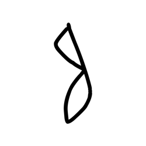

- source_zip_member: `Sub-character Images/0avi2tcy0g/0avi2tcy0g/ez1orikjyl.png`
- checksum_sha256: `a60377f2d9e806a38938c9c6ba26f8e504dd5522b54c9bb8ce54b1a05202df1c`
- review_status: `needs_human_visual_review`
- caution: OBIMD subcharacter image is a source-marked review asset only; it is not a confirmed component form, component assignment, or decipherment conclusion.

## asset-015696

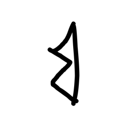

- source_zip_member: `Sub-character Images/0avi2tcy0g/0avi2tcy0g/i6qfj50gm2.png`
- checksum_sha256: `14b7dc2519771fe5d4a116d158eb13e6ccc658649d6f0d48d0737a0f2e2b5e86`
- review_status: `needs_human_visual_review`
- caution: OBIMD subcharacter image is a source-marked review asset only; it is not a confirmed component form, component assignment, or decipherment conclusion.

## asset-015697

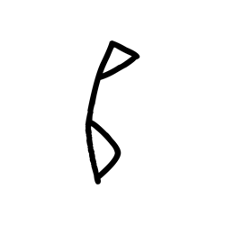

- source_zip_member: `Sub-character Images/0avi2tcy0g/0avi2tcy0g/j241usrrso.png`
- checksum_sha256: `b235b3ee722878b4a02fd1fbdb44aca7eafefce0e68aef28a7327b9bbdb1f908`
- review_status: `needs_human_visual_review`
- caution: OBIMD subcharacter image is a source-marked review asset only; it is not a confirmed component form, component assignment, or decipherment conclusion.

## asset-015698

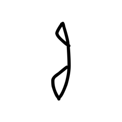

- source_zip_member: `Sub-character Images/0avi2tcy0g/0avi2tcy0g/j3gx55atus.png`
- checksum_sha256: `409c8223503e9d02a695144c414e3363ebf8021a6af6322cb50ca72359e632e7`
- review_status: `needs_human_visual_review`
- caution: OBIMD subcharacter image is a source-marked review asset only; it is not a confirmed component form, component assignment, or decipherment conclusion.

## asset-015699

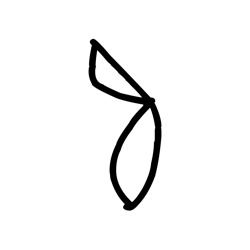

- source_zip_member: `Sub-character Images/0avi2tcy0g/0avi2tcy0g/js8f15wxne.png`
- checksum_sha256: `5058845dea1f78c0c0ce35c16a4bef92e503d9c1d7622c9cb70e993d2d4146b8`
- review_status: `needs_human_visual_review`
- caution: OBIMD subcharacter image is a source-marked review asset only; it is not a confirmed component form, component assignment, or decipherment conclusion.

## asset-015700

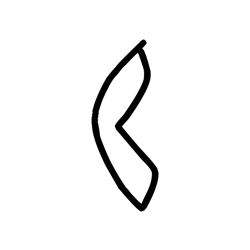

- source_zip_member: `Sub-character Images/0avi2tcy0g/0avi2tcy0g/kohdl7cryy.png`
- checksum_sha256: `5937671ae7b510b5c04875e70a577a86962d34aa9a2c41bf2be825644e31a007`
- review_status: `needs_human_visual_review`
- caution: OBIMD subcharacter image is a source-marked review asset only; it is not a confirmed component form, component assignment, or decipherment conclusion.

## asset-015701

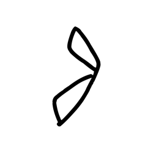

- source_zip_member: `Sub-character Images/0avi2tcy0g/0avi2tcy0g/ksygos1r8o.png`
- checksum_sha256: `4f46f7ea2534180554e7eed9e59314f64bec906a8e33fa261ef11aba788fe7e7`
- review_status: `needs_human_visual_review`
- caution: OBIMD subcharacter image is a source-marked review asset only; it is not a confirmed component form, component assignment, or decipherment conclusion.

## asset-015702

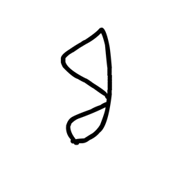

- source_zip_member: `Sub-character Images/0avi2tcy0g/0avi2tcy0g/kw2a46ysby.png`
- checksum_sha256: `dd5f57d5fa96eac8e35fab88bb231a13b5c736860150462c07ffda4bf4a91f42`
- review_status: `needs_human_visual_review`
- caution: OBIMD subcharacter image is a source-marked review asset only; it is not a confirmed component form, component assignment, or decipherment conclusion.

## asset-015703

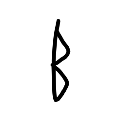

- source_zip_member: `Sub-character Images/0avi2tcy0g/0avi2tcy0g/natfdig4w2.png`
- checksum_sha256: `37e5e9f8c2b2f31e608913c2bc0538c086eb344973230775644411c7b6fece21`
- review_status: `needs_human_visual_review`
- caution: OBIMD subcharacter image is a source-marked review asset only; it is not a confirmed component form, component assignment, or decipherment conclusion.

## asset-015704

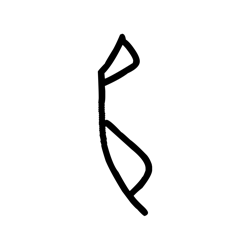

- source_zip_member: `Sub-character Images/0avi2tcy0g/0avi2tcy0g/o72o40qvxd.png`
- checksum_sha256: `794b1a927b1838cbaabe0e405f1c885d691bcfa4a98399c6b5a8871941a270d4`
- review_status: `needs_human_visual_review`
- caution: OBIMD subcharacter image is a source-marked review asset only; it is not a confirmed component form, component assignment, or decipherment conclusion.

## asset-015705

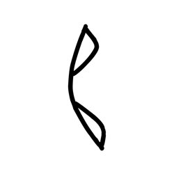

- source_zip_member: `Sub-character Images/0avi2tcy0g/0avi2tcy0g/o7gubn3tmz.png`
- checksum_sha256: `eff85a78ca00d41e33cbfc2dac98fee80461b5a1eab9d476966288ec9e0cfd15`
- review_status: `needs_human_visual_review`
- caution: OBIMD subcharacter image is a source-marked review asset only; it is not a confirmed component form, component assignment, or decipherment conclusion.

## asset-015706

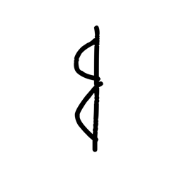

- source_zip_member: `Sub-character Images/0avi2tcy0g/0avi2tcy0g/oa0o30pp5s.png`
- checksum_sha256: `6a9cfcec3aa368a52e750a0b717901032054ce58e3323c18779febc21d91c14f`
- review_status: `needs_human_visual_review`
- caution: OBIMD subcharacter image is a source-marked review asset only; it is not a confirmed component form, component assignment, or decipherment conclusion.

## asset-015707

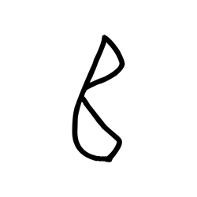

- source_zip_member: `Sub-character Images/0avi2tcy0g/0avi2tcy0g/otsm7c3svm.png`
- checksum_sha256: `abd777b676498832e3a7f9e713237038843130da4c91a173898349b5c2a8a6cf`
- review_status: `needs_human_visual_review`
- caution: OBIMD subcharacter image is a source-marked review asset only; it is not a confirmed component form, component assignment, or decipherment conclusion.

## asset-015708

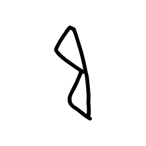

- source_zip_member: `Sub-character Images/0avi2tcy0g/0avi2tcy0g/qo761hvsil.png`
- checksum_sha256: `bac2be9494afeacd4488990fecdf1fe3b2fa7e374ad09ca4b57769adf562b8c2`
- review_status: `needs_human_visual_review`
- caution: OBIMD subcharacter image is a source-marked review asset only; it is not a confirmed component form, component assignment, or decipherment conclusion.

## asset-015709

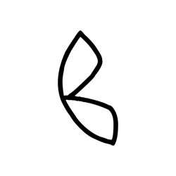

- source_zip_member: `Sub-character Images/0avi2tcy0g/0avi2tcy0g/qvo08y0gxx.png`
- checksum_sha256: `7fea00144a5e21ecc24a74b4d99560ddbef915b1ab7be5de0faec44e365f9ad4`
- review_status: `needs_human_visual_review`
- caution: OBIMD subcharacter image is a source-marked review asset only; it is not a confirmed component form, component assignment, or decipherment conclusion.

## asset-015710

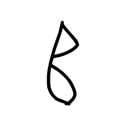

- source_zip_member: `Sub-character Images/0avi2tcy0g/0avi2tcy0g/r7bu5ovl7v.png`
- checksum_sha256: `fb0ca24825ab6fa6f76ab590a175a0a0825af4ec489a70ba5b99e1555aa7842c`
- review_status: `needs_human_visual_review`
- caution: OBIMD subcharacter image is a source-marked review asset only; it is not a confirmed component form, component assignment, or decipherment conclusion.

## asset-015711

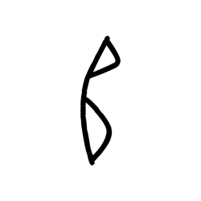

- source_zip_member: `Sub-character Images/0avi2tcy0g/0avi2tcy0g/sxtzc72zyh.png`
- checksum_sha256: `e47202b2cd34287cfa439fea57e16f2792298e556f686069618b2fecdd19d3fc`
- review_status: `needs_human_visual_review`
- caution: OBIMD subcharacter image is a source-marked review asset only; it is not a confirmed component form, component assignment, or decipherment conclusion.

## asset-015712

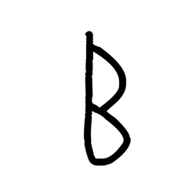

- source_zip_member: `Sub-character Images/0avi2tcy0g/0avi2tcy0g/tgpdrnz3bs.png`
- checksum_sha256: `c82112e5f0159c2a4869d91b1aa94d693f1184c97b33437b96e564b296ad4342`
- review_status: `needs_human_visual_review`
- caution: OBIMD subcharacter image is a source-marked review asset only; it is not a confirmed component form, component assignment, or decipherment conclusion.

## asset-015713

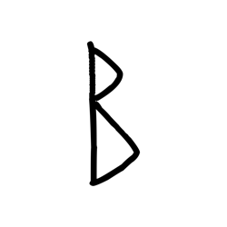

- source_zip_member: `Sub-character Images/0avi2tcy0g/0avi2tcy0g/tw5oiqza60.png`
- checksum_sha256: `37c9525bf35fb37c1f0ff1a3eb360c5fe4498f0b591f84ff8788e2f5d3f8e69d`
- review_status: `needs_human_visual_review`
- caution: OBIMD subcharacter image is a source-marked review asset only; it is not a confirmed component form, component assignment, or decipherment conclusion.

## asset-015714

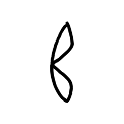

- source_zip_member: `Sub-character Images/0avi2tcy0g/0avi2tcy0g/u4h9mgh2yq.png`
- checksum_sha256: `81459c85a320c6a7f645ff1a13988fa3a8bb56ca94ae3bb6bac04ee65d091596`
- review_status: `needs_human_visual_review`
- caution: OBIMD subcharacter image is a source-marked review asset only; it is not a confirmed component form, component assignment, or decipherment conclusion.

## asset-015715

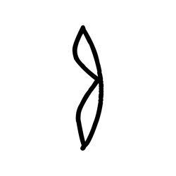

- source_zip_member: `Sub-character Images/0avi2tcy0g/0avi2tcy0g/u9qesn80nw.png`
- checksum_sha256: `fcd916ba3a128a0d7cef06aaf0b88f43f2519645194c4db6216fc55e590b03b4`
- review_status: `needs_human_visual_review`
- caution: OBIMD subcharacter image is a source-marked review asset only; it is not a confirmed component form, component assignment, or decipherment conclusion.

## asset-015716

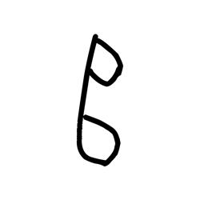

- source_zip_member: `Sub-character Images/0avi2tcy0g/0avi2tcy0g/ugjytot1t1.png`
- checksum_sha256: `bfec715a67a0f8ac096f3c3ffca23f7584af3dca4b0be0b48507380f71548afa`
- review_status: `needs_human_visual_review`
- caution: OBIMD subcharacter image is a source-marked review asset only; it is not a confirmed component form, component assignment, or decipherment conclusion.

## asset-015717

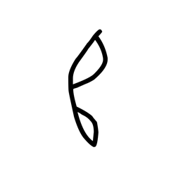

- source_zip_member: `Sub-character Images/0avi2tcy0g/0avi2tcy0g/ukrvr7gpd6.png`
- checksum_sha256: `dd35686271b285c3892c58d66cf02fa5e4fd0e0df1f2659e9dd9815236e849c8`
- review_status: `needs_human_visual_review`
- caution: OBIMD subcharacter image is a source-marked review asset only; it is not a confirmed component form, component assignment, or decipherment conclusion.

## asset-015718

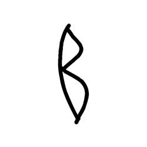

- source_zip_member: `Sub-character Images/0avi2tcy0g/0avi2tcy0g/v3ahte772s.png`
- checksum_sha256: `8dd7214c4c42bb62894383087f6364cbc81593d72bedf44eed89b4fa19805643`
- review_status: `needs_human_visual_review`
- caution: OBIMD subcharacter image is a source-marked review asset only; it is not a confirmed component form, component assignment, or decipherment conclusion.

## asset-015719

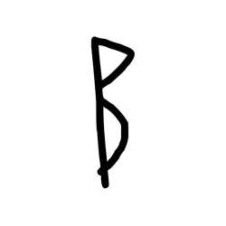

- source_zip_member: `Sub-character Images/0avi2tcy0g/0avi2tcy0g/wajkppvwiq.png`
- checksum_sha256: `8b9b4e34cebd99cce767b48bded75bc03b52d975a05348340c944275b24f1f2a`
- review_status: `needs_human_visual_review`
- caution: OBIMD subcharacter image is a source-marked review asset only; it is not a confirmed component form, component assignment, or decipherment conclusion.

## asset-015720

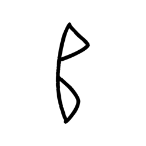

- source_zip_member: `Sub-character Images/0avi2tcy0g/0avi2tcy0g/ww1auqzi1p.png`
- checksum_sha256: `a7f3751bf2bb974779ea87b745f7362cf6dfb16fff6baa54f808e8887d175657`
- review_status: `needs_human_visual_review`
- caution: OBIMD subcharacter image is a source-marked review asset only; it is not a confirmed component form, component assignment, or decipherment conclusion.
