# Component Visual Gallery / 构件图像查看: obs-comp-cand-001358

English:
This page displays OBIMD subcharacter PNG assets extracted into this concrete
corpus object directory for human review.

简体中文：
本页展示抽取到当前具体 corpus 对象目录内的 OBIMD subcharacter PNG 资料，供人工复核使用。

Boundary / 边界：
dataset image candidate only; not a confirmed component form, not a component
assignment, and not a decipherment claim.
- not a confirmed component form
- not a component assignment
- not a decipherment claim

## Concrete Questions To Check / 具体待查问题

- Which local image should be opened first?
- 应先打开哪一张本地构件图像？
- Which source zip member anchors this image?
- 哪一个 source zip member 能定位这张图像？
- Which near-shape or variant comparison is still missing?
- 还缺哪些近形或异体比较？
- Which character or inscription context should be checked next?
- 下一步应核对哪些单字或卜辞上下文？
- What evidence is missing before a component assignment?
- 正式构件归属前还缺哪些证据？

## asset-015747

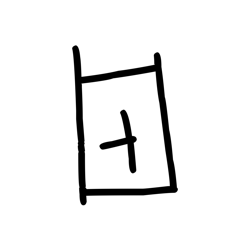

- source_zip_member: `Sub-character Images/tp5ykv5jzh/tp5ykv5jzh/1dj9y7ypfe.png`
- checksum_sha256: see `06_component-visual-index.csv`.
- review_status: `needs_human_visual_review`
- caution: source-marked review image only.

## asset-015748

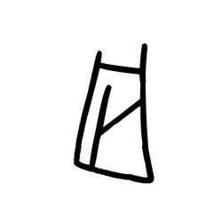

- source_zip_member: `Sub-character Images/tp5ykv5jzh/tp5ykv5jzh/36efd7e84m.png`
- checksum_sha256: see `06_component-visual-index.csv`.
- review_status: `needs_human_visual_review`
- caution: source-marked review image only.

## asset-015749

- source_zip_member: `Sub-character Images/tp5ykv5jzh/tp5ykv5jzh/4cm8bk8nqt.png`
- checksum_sha256: see `06_component-visual-index.csv`.
- review_status: `needs_human_visual_review`
- caution: source-marked review image only.

## asset-015750

- source_zip_member: `Sub-character Images/tp5ykv5jzh/tp5ykv5jzh/6r274witad.png`
- checksum_sha256: see `06_component-visual-index.csv`.
- review_status: `needs_human_visual_review`
- caution: source-marked review image only.

## asset-015751

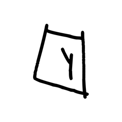

- source_zip_member: `Sub-character Images/tp5ykv5jzh/tp5ykv5jzh/6ssye3lefk.png`
- checksum_sha256: see `06_component-visual-index.csv`.
- review_status: `needs_human_visual_review`
- caution: source-marked review image only.

## asset-015752

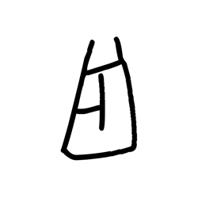

- source_zip_member: `Sub-character Images/tp5ykv5jzh/tp5ykv5jzh/8tlfs7l2ze.png`
- checksum_sha256: see `06_component-visual-index.csv`.
- review_status: `needs_human_visual_review`
- caution: source-marked review image only.

## asset-015753

- source_zip_member: `Sub-character Images/tp5ykv5jzh/tp5ykv5jzh/9s3kbyri6u.png`
- checksum_sha256: see `06_component-visual-index.csv`.
- review_status: `needs_human_visual_review`
- caution: source-marked review image only.

## asset-015754

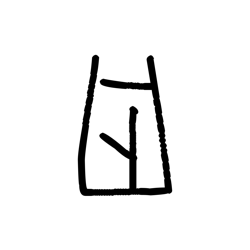

- source_zip_member: `Sub-character Images/tp5ykv5jzh/tp5ykv5jzh/aiwkq7suwe.png`
- checksum_sha256: see `06_component-visual-index.csv`.
- review_status: `needs_human_visual_review`
- caution: source-marked review image only.

## asset-015755

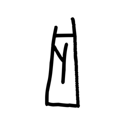

- source_zip_member: `Sub-character Images/tp5ykv5jzh/tp5ykv5jzh/bii6d513ta.png`
- checksum_sha256: see `06_component-visual-index.csv`.
- review_status: `needs_human_visual_review`
- caution: source-marked review image only.

## asset-015756

- source_zip_member: `Sub-character Images/tp5ykv5jzh/tp5ykv5jzh/bu9edd53ev.png`
- checksum_sha256: see `06_component-visual-index.csv`.
- review_status: `needs_human_visual_review`
- caution: source-marked review image only.

## asset-015757

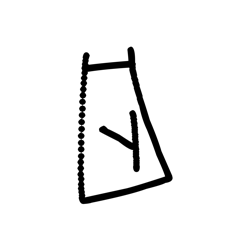

- source_zip_member: `Sub-character Images/tp5ykv5jzh/tp5ykv5jzh/ck5mvre375.png`
- checksum_sha256: see `06_component-visual-index.csv`.
- review_status: `needs_human_visual_review`
- caution: source-marked review image only.

## asset-015758

- source_zip_member: `Sub-character Images/tp5ykv5jzh/tp5ykv5jzh/g4aee3pl5u.png`
- checksum_sha256: see `06_component-visual-index.csv`.
- review_status: `needs_human_visual_review`
- caution: source-marked review image only.

## asset-015759

- source_zip_member: `Sub-character Images/tp5ykv5jzh/tp5ykv5jzh/gyv87fny42.png`
- checksum_sha256: see `06_component-visual-index.csv`.
- review_status: `needs_human_visual_review`
- caution: source-marked review image only.

## asset-015760

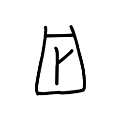

- source_zip_member: `Sub-character Images/tp5ykv5jzh/tp5ykv5jzh/ion53geu1t.png`
- checksum_sha256: see `06_component-visual-index.csv`.
- review_status: `needs_human_visual_review`
- caution: source-marked review image only.

## asset-015761

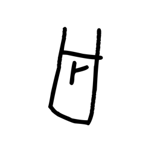

- source_zip_member: `Sub-character Images/tp5ykv5jzh/tp5ykv5jzh/ipqf96yfad.png`
- checksum_sha256: see `06_component-visual-index.csv`.
- review_status: `needs_human_visual_review`
- caution: source-marked review image only.

## asset-015762

- source_zip_member: `Sub-character Images/tp5ykv5jzh/tp5ykv5jzh/l4nsa87oak.png`
- checksum_sha256: see `06_component-visual-index.csv`.
- review_status: `needs_human_visual_review`
- caution: source-marked review image only.

## asset-015763

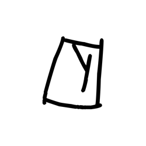

- source_zip_member: `Sub-character Images/tp5ykv5jzh/tp5ykv5jzh/m2e4glh8tz.png`
- checksum_sha256: see `06_component-visual-index.csv`.
- review_status: `needs_human_visual_review`
- caution: source-marked review image only.

## asset-015764

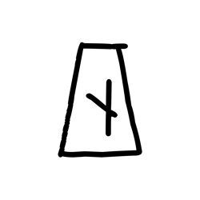

- source_zip_member: `Sub-character Images/tp5ykv5jzh/tp5ykv5jzh/pcjg14f226.png`
- checksum_sha256: see `06_component-visual-index.csv`.
- review_status: `needs_human_visual_review`
- caution: source-marked review image only.

## asset-015765

- source_zip_member: `Sub-character Images/tp5ykv5jzh/tp5ykv5jzh/prh4pvlo45.png`
- checksum_sha256: see `06_component-visual-index.csv`.
- review_status: `needs_human_visual_review`
- caution: source-marked review image only.

## asset-015766

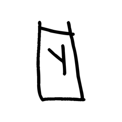

- source_zip_member: `Sub-character Images/tp5ykv5jzh/tp5ykv5jzh/quhbguoya4.png`
- checksum_sha256: see `06_component-visual-index.csv`.
- review_status: `needs_human_visual_review`
- caution: source-marked review image only.

## asset-015767

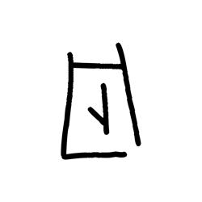

- source_zip_member: `Sub-character Images/tp5ykv5jzh/tp5ykv5jzh/redsezyits.png`
- checksum_sha256: see `06_component-visual-index.csv`.
- review_status: `needs_human_visual_review`
- caution: source-marked review image only.

## asset-015768

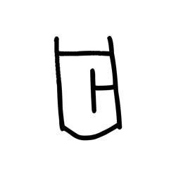

- source_zip_member: `Sub-character Images/tp5ykv5jzh/tp5ykv5jzh/sw537otm6k.png`
- checksum_sha256: see `06_component-visual-index.csv`.
- review_status: `needs_human_visual_review`
- caution: source-marked review image only.

## asset-015769

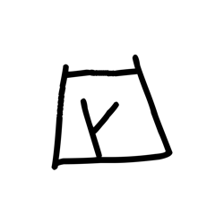

- source_zip_member: `Sub-character Images/tp5ykv5jzh/tp5ykv5jzh/t0ots6z37g.png`
- checksum_sha256: see `06_component-visual-index.csv`.
- review_status: `needs_human_visual_review`
- caution: source-marked review image only.

## asset-015770

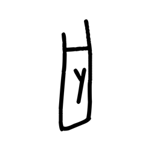

- source_zip_member: `Sub-character Images/tp5ykv5jzh/tp5ykv5jzh/tcd2snr363.png`
- checksum_sha256: see `06_component-visual-index.csv`.
- review_status: `needs_human_visual_review`
- caution: source-marked review image only.

## asset-015771

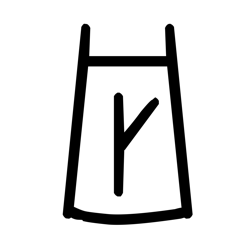

- source_zip_member: `Sub-character Images/tp5ykv5jzh/tp5ykv5jzh/tp5ykv5jzh.png`
- checksum_sha256: see `06_component-visual-index.csv`.
- review_status: `needs_human_visual_review`
- caution: source-marked review image only.

## asset-015772

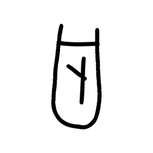

- source_zip_member: `Sub-character Images/tp5ykv5jzh/tp5ykv5jzh/u5pniwvmny.png`
- checksum_sha256: see `06_component-visual-index.csv`.
- review_status: `needs_human_visual_review`
- caution: source-marked review image only.

## asset-015773

- source_zip_member: `Sub-character Images/tp5ykv5jzh/tp5ykv5jzh/xqfo9mn3vt.png`
- checksum_sha256: see `06_component-visual-index.csv`.
- review_status: `needs_human_visual_review`
- caution: source-marked review image only.

## asset-015774

- source_zip_member: `Sub-character Images/tp5ykv5jzh/tp5ykv5jzh/y6seo6xv5a.png`
- checksum_sha256: see `06_component-visual-index.csv`.
- review_status: `needs_human_visual_review`
- caution: source-marked review image only.

## asset-015775

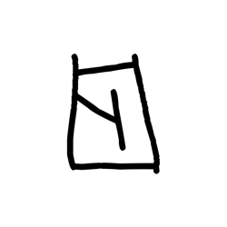

- source_zip_member: `Sub-character Images/tp5ykv5jzh/tp5ykv5jzh/y99jd0qs1i.png`
- checksum_sha256: see `06_component-visual-index.csv`.
- review_status: `needs_human_visual_review`
- caution: source-marked review image only.

## asset-015776

- source_zip_member: `Sub-character Images/tp5ykv5jzh/tp5ykv5jzh/yj3i0sn461.png`
- checksum_sha256: see `06_component-visual-index.csv`.
- review_status: `needs_human_visual_review`
- caution: source-marked review image only.

## asset-015777

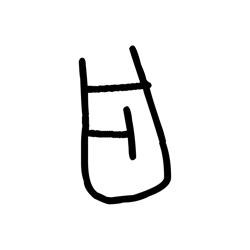

- source_zip_member: `Sub-character Images/tp5ykv5jzh/tp5ykv5jzh/yz3bt6kyh9.png`
- checksum_sha256: see `06_component-visual-index.csv`.
- review_status: `needs_human_visual_review`
- caution: source-marked review image only.
