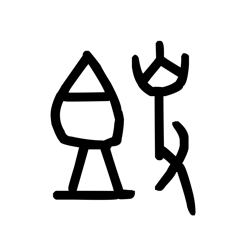

# Component Visual Gallery / 构件图像查看: obs-comp-cand-001405

English:
This page displays OBIMD subcharacter PNG assets extracted into this concrete corpus object directory for human review.

简体中文：
本页展示抽取到当前具体 corpus 对象目录内的 OBIMD subcharacter PNG 资料，供人工复核使用。

Boundary / 边界：dataset image candidate only; not a confirmed component form, component assignment, or decipherment claim.

## asset-015824

- source_zip_member: `Sub-character Images/v34viqk9rx/ujlwnd5sg1/ujlwnd5sg1.png`
- checksum_sha256: `5fc67b43504830566e07f4ddbddbd8dc4cd5d951c6604d02da1a83ffa1880d77`
- review_status: `needs_human_visual_review`
- caution: OBIMD subcharacter image is a source-marked review asset only; it is not a confirmed component form, component assignment, or decipherment conclusion.
