# Component Visual Gallery / 构件图像查看: obs-comp-cand-001422

English:
This page displays OBIMD subcharacter PNG assets extracted into this concrete
corpus object directory for human review.

简体中文：
本页展示抽取到当前具体 corpus 对象目录内的 OBIMD subcharacter PNG 资料，供人工复核使用。

Boundary / 边界：
dataset image candidate only; not a confirmed component form, not a component
assignment, and not a decipherment claim.
- not a confirmed component form
- not a component assignment
- not a decipherment claim

## Concrete Questions To Check / 具体待查问题

- Open 06_component-visual-index.csv and name the local image row.
- 打开 06_component-visual-index.csv，写明本地图像行。
- Open 09_component-visual-route-index.csv and name the source route row.
- 打开 09_component-visual-route-index.csv，写明来源路线行。
- Open 13_component-context-evidence-dossier.md for character context.
- 打开 13_component-context-evidence-dossier.md，核对单字与卜辞上下文。
- Record the missing image, near-shape, source, or context route.
- 记录缺失的图像、近形、来源或上下文路线。

## asset-015841

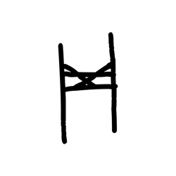

- source_zip_member: `Sub-character Images/dhewuxyotl/dhewuxyotl/013wy4ppyp.png`
- checksum_sha256: see `06_component-visual-index.csv`.
- review_status: `needs_human_visual_review`
- caution: source-marked review image only.

## asset-015842

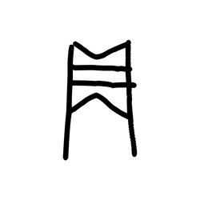

- source_zip_member: `Sub-character Images/dhewuxyotl/dhewuxyotl/0er43dp1zj.png`
- checksum_sha256: see `06_component-visual-index.csv`.
- review_status: `needs_human_visual_review`
- caution: source-marked review image only.

## asset-015843

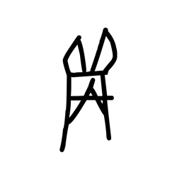

- source_zip_member: `Sub-character Images/dhewuxyotl/dhewuxyotl/0juf0myxb2.png`
- checksum_sha256: see `06_component-visual-index.csv`.
- review_status: `needs_human_visual_review`
- caution: source-marked review image only.

## asset-015844

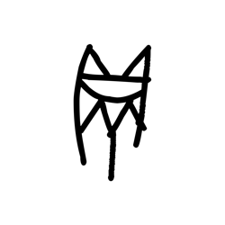

- source_zip_member: `Sub-character Images/dhewuxyotl/dhewuxyotl/0mx4rjxc2m.png`
- checksum_sha256: see `06_component-visual-index.csv`.
- review_status: `needs_human_visual_review`
- caution: source-marked review image only.

## asset-015845

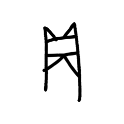

- source_zip_member: `Sub-character Images/dhewuxyotl/dhewuxyotl/0w36v9tpet.png`
- checksum_sha256: see `06_component-visual-index.csv`.
- review_status: `needs_human_visual_review`
- caution: source-marked review image only.

## asset-015846

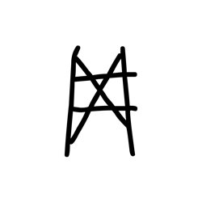

- source_zip_member: `Sub-character Images/dhewuxyotl/dhewuxyotl/1a87orajx0.png`
- checksum_sha256: see `06_component-visual-index.csv`.
- review_status: `needs_human_visual_review`
- caution: source-marked review image only.

## asset-015847

- source_zip_member: `Sub-character Images/dhewuxyotl/dhewuxyotl/1fn0qnieyb.png`
- checksum_sha256: see `06_component-visual-index.csv`.
- review_status: `needs_human_visual_review`
- caution: source-marked review image only.

## asset-015848

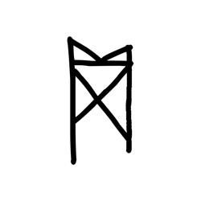

- source_zip_member: `Sub-character Images/dhewuxyotl/dhewuxyotl/1v5lzpy03j.png`
- checksum_sha256: see `06_component-visual-index.csv`.
- review_status: `needs_human_visual_review`
- caution: source-marked review image only.

## asset-015849

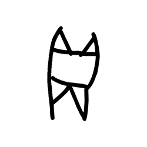

- source_zip_member: `Sub-character Images/dhewuxyotl/dhewuxyotl/2km22vb9hb.png`
- checksum_sha256: see `06_component-visual-index.csv`.
- review_status: `needs_human_visual_review`
- caution: source-marked review image only.

## asset-015850

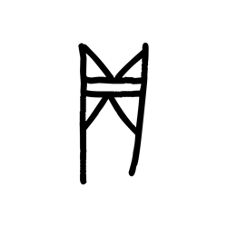

- source_zip_member: `Sub-character Images/dhewuxyotl/dhewuxyotl/2otknefdgi.png`
- checksum_sha256: see `06_component-visual-index.csv`.
- review_status: `needs_human_visual_review`
- caution: source-marked review image only.

## asset-015851

- source_zip_member: `Sub-character Images/dhewuxyotl/dhewuxyotl/2wyn50t86j.png`
- checksum_sha256: see `06_component-visual-index.csv`.
- review_status: `needs_human_visual_review`
- caution: source-marked review image only.

## asset-015852

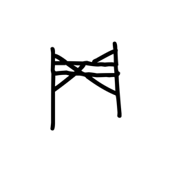

- source_zip_member: `Sub-character Images/dhewuxyotl/dhewuxyotl/30olc9drs4.png`
- checksum_sha256: see `06_component-visual-index.csv`.
- review_status: `needs_human_visual_review`
- caution: source-marked review image only.

## asset-015853

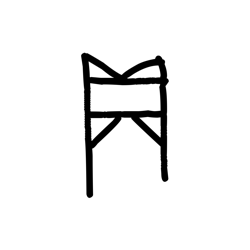

- source_zip_member: `Sub-character Images/dhewuxyotl/dhewuxyotl/32aln4zue6.png`
- checksum_sha256: see `06_component-visual-index.csv`.
- review_status: `needs_human_visual_review`
- caution: source-marked review image only.

## asset-015854

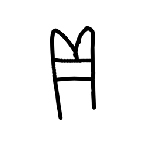

- source_zip_member: `Sub-character Images/dhewuxyotl/dhewuxyotl/36l18ta7lc.png`
- checksum_sha256: see `06_component-visual-index.csv`.
- review_status: `needs_human_visual_review`
- caution: source-marked review image only.

## asset-015855

- source_zip_member: `Sub-character Images/dhewuxyotl/dhewuxyotl/3c5npj9wco.png`
- checksum_sha256: see `06_component-visual-index.csv`.
- review_status: `needs_human_visual_review`
- caution: source-marked review image only.

## asset-015856

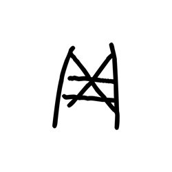

- source_zip_member: `Sub-character Images/dhewuxyotl/dhewuxyotl/40omqtj2b4.png`
- checksum_sha256: see `06_component-visual-index.csv`.
- review_status: `needs_human_visual_review`
- caution: source-marked review image only.

## asset-015857

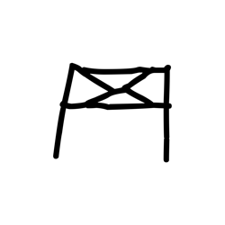

- source_zip_member: `Sub-character Images/dhewuxyotl/dhewuxyotl/450lufplr8.png`
- checksum_sha256: see `06_component-visual-index.csv`.
- review_status: `needs_human_visual_review`
- caution: source-marked review image only.

## asset-015858

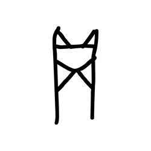

- source_zip_member: `Sub-character Images/dhewuxyotl/dhewuxyotl/491nh0l17w.png`
- checksum_sha256: see `06_component-visual-index.csv`.
- review_status: `needs_human_visual_review`
- caution: source-marked review image only.

## asset-015859

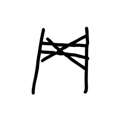

- source_zip_member: `Sub-character Images/dhewuxyotl/dhewuxyotl/4hgx0ql33m.png`
- checksum_sha256: see `06_component-visual-index.csv`.
- review_status: `needs_human_visual_review`
- caution: source-marked review image only.

## asset-015860

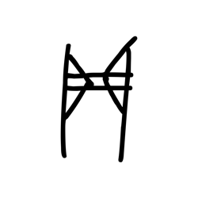

- source_zip_member: `Sub-character Images/dhewuxyotl/dhewuxyotl/4spvlpmudr.png`
- checksum_sha256: see `06_component-visual-index.csv`.
- review_status: `needs_human_visual_review`
- caution: source-marked review image only.

## asset-015861

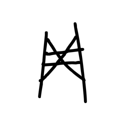

- source_zip_member: `Sub-character Images/dhewuxyotl/dhewuxyotl/4tintrefpv.png`
- checksum_sha256: see `06_component-visual-index.csv`.
- review_status: `needs_human_visual_review`
- caution: source-marked review image only.

## asset-015862

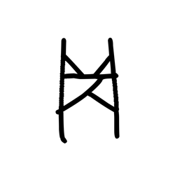

- source_zip_member: `Sub-character Images/dhewuxyotl/dhewuxyotl/4zh7t0mv0y.png`
- checksum_sha256: see `06_component-visual-index.csv`.
- review_status: `needs_human_visual_review`
- caution: source-marked review image only.

## asset-015863

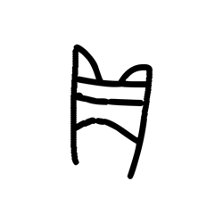

- source_zip_member: `Sub-character Images/dhewuxyotl/dhewuxyotl/4zk5kfarwj.png`
- checksum_sha256: see `06_component-visual-index.csv`.
- review_status: `needs_human_visual_review`
- caution: source-marked review image only.

## asset-015864

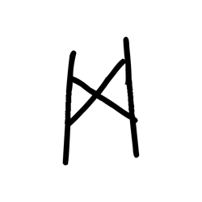

- source_zip_member: `Sub-character Images/dhewuxyotl/dhewuxyotl/50791yam2d.png`
- checksum_sha256: see `06_component-visual-index.csv`.
- review_status: `needs_human_visual_review`
- caution: source-marked review image only.

## asset-015865

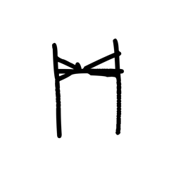

- source_zip_member: `Sub-character Images/dhewuxyotl/dhewuxyotl/632lys9gvn.png`
- checksum_sha256: see `06_component-visual-index.csv`.
- review_status: `needs_human_visual_review`
- caution: source-marked review image only.

## asset-015866

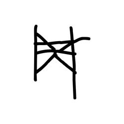

- source_zip_member: `Sub-character Images/dhewuxyotl/dhewuxyotl/65olarn98a.png`
- checksum_sha256: see `06_component-visual-index.csv`.
- review_status: `needs_human_visual_review`
- caution: source-marked review image only.

## asset-015867

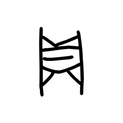

- source_zip_member: `Sub-character Images/dhewuxyotl/dhewuxyotl/6nmqcfoitv.png`
- checksum_sha256: see `06_component-visual-index.csv`.
- review_status: `needs_human_visual_review`
- caution: source-marked review image only.

## asset-015868

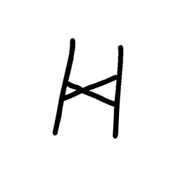

- source_zip_member: `Sub-character Images/dhewuxyotl/dhewuxyotl/6vinkt7oox.png`
- checksum_sha256: see `06_component-visual-index.csv`.
- review_status: `needs_human_visual_review`
- caution: source-marked review image only.

## asset-015869

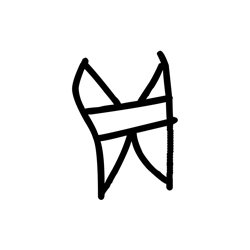

- source_zip_member: `Sub-character Images/dhewuxyotl/dhewuxyotl/7i2wobu1qr.png`
- checksum_sha256: see `06_component-visual-index.csv`.
- review_status: `needs_human_visual_review`
- caution: source-marked review image only.

## asset-015870

- source_zip_member: `Sub-character Images/dhewuxyotl/dhewuxyotl/7is5yehvmk.png`
- checksum_sha256: see `06_component-visual-index.csv`.
- review_status: `needs_human_visual_review`
- caution: source-marked review image only.

## asset-015871

- source_zip_member: `Sub-character Images/dhewuxyotl/dhewuxyotl/7mi7detll3.png`
- checksum_sha256: see `06_component-visual-index.csv`.
- review_status: `needs_human_visual_review`
- caution: source-marked review image only.

## asset-015872

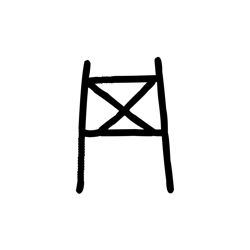

- source_zip_member: `Sub-character Images/dhewuxyotl/dhewuxyotl/7rcdrgeidu.png`
- checksum_sha256: see `06_component-visual-index.csv`.
- review_status: `needs_human_visual_review`
- caution: source-marked review image only.

## asset-015873

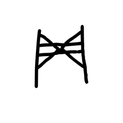

- source_zip_member: `Sub-character Images/dhewuxyotl/dhewuxyotl/8gm1x9mkm9.png`
- checksum_sha256: see `06_component-visual-index.csv`.
- review_status: `needs_human_visual_review`
- caution: source-marked review image only.

## asset-015874

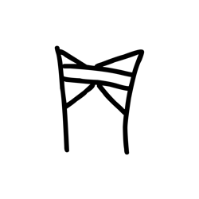

- source_zip_member: `Sub-character Images/dhewuxyotl/dhewuxyotl/8ov484fnvc.png`
- checksum_sha256: see `06_component-visual-index.csv`.
- review_status: `needs_human_visual_review`
- caution: source-marked review image only.

## asset-015875

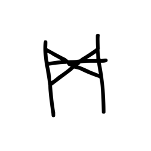

- source_zip_member: `Sub-character Images/dhewuxyotl/dhewuxyotl/96i3ji0fyo.png`
- checksum_sha256: see `06_component-visual-index.csv`.
- review_status: `needs_human_visual_review`
- caution: source-marked review image only.

## asset-015876

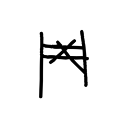

- source_zip_member: `Sub-character Images/dhewuxyotl/dhewuxyotl/9htwlr9qax.png`
- checksum_sha256: see `06_component-visual-index.csv`.
- review_status: `needs_human_visual_review`
- caution: source-marked review image only.

## asset-015877

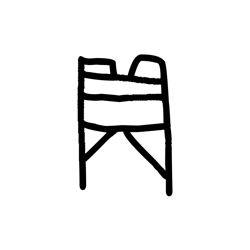

- source_zip_member: `Sub-character Images/dhewuxyotl/dhewuxyotl/9zbwlf84dy.png`
- checksum_sha256: see `06_component-visual-index.csv`.
- review_status: `needs_human_visual_review`
- caution: source-marked review image only.

## asset-015878

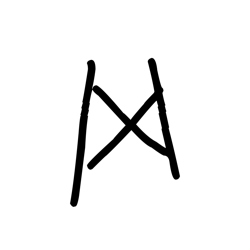

- source_zip_member: `Sub-character Images/dhewuxyotl/dhewuxyotl/a573ufstp5.png`
- checksum_sha256: see `06_component-visual-index.csv`.
- review_status: `needs_human_visual_review`
- caution: source-marked review image only.

## asset-015879

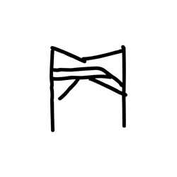

- source_zip_member: `Sub-character Images/dhewuxyotl/dhewuxyotl/ac1peuewm9.png`
- checksum_sha256: see `06_component-visual-index.csv`.
- review_status: `needs_human_visual_review`
- caution: source-marked review image only.

## asset-015880

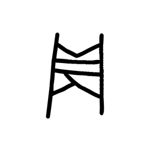

- source_zip_member: `Sub-character Images/dhewuxyotl/dhewuxyotl/aw46gus6ao.png`
- checksum_sha256: see `06_component-visual-index.csv`.
- review_status: `needs_human_visual_review`
- caution: source-marked review image only.

## asset-015881

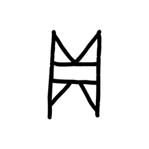

- source_zip_member: `Sub-character Images/dhewuxyotl/dhewuxyotl/az6l2blens.png`
- checksum_sha256: see `06_component-visual-index.csv`.
- review_status: `needs_human_visual_review`
- caution: source-marked review image only.

## asset-015882

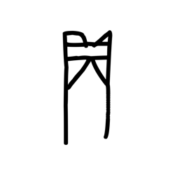

- source_zip_member: `Sub-character Images/dhewuxyotl/dhewuxyotl/b1r159pikf.png`
- checksum_sha256: see `06_component-visual-index.csv`.
- review_status: `needs_human_visual_review`
- caution: source-marked review image only.

## asset-015883

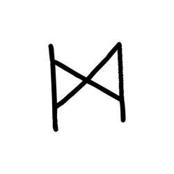

- source_zip_member: `Sub-character Images/dhewuxyotl/dhewuxyotl/b9llonb8b2.png`
- checksum_sha256: see `06_component-visual-index.csv`.
- review_status: `needs_human_visual_review`
- caution: source-marked review image only.

## asset-015884

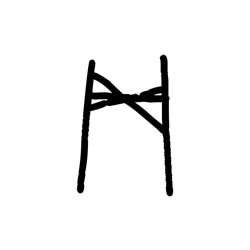

- source_zip_member: `Sub-character Images/dhewuxyotl/dhewuxyotl/bb82exatp2.png`
- checksum_sha256: see `06_component-visual-index.csv`.
- review_status: `needs_human_visual_review`
- caution: source-marked review image only.

## asset-015885

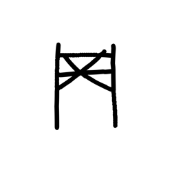

- source_zip_member: `Sub-character Images/dhewuxyotl/dhewuxyotl/bfu8qxqhcu.png`
- checksum_sha256: see `06_component-visual-index.csv`.
- review_status: `needs_human_visual_review`
- caution: source-marked review image only.

## asset-015886

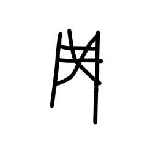

- source_zip_member: `Sub-character Images/dhewuxyotl/dhewuxyotl/bjsfjdrcwl.png`
- checksum_sha256: see `06_component-visual-index.csv`.
- review_status: `needs_human_visual_review`
- caution: source-marked review image only.

## asset-015887

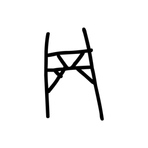

- source_zip_member: `Sub-character Images/dhewuxyotl/dhewuxyotl/brdzl8jurb.png`
- checksum_sha256: see `06_component-visual-index.csv`.
- review_status: `needs_human_visual_review`
- caution: source-marked review image only.

## asset-015888

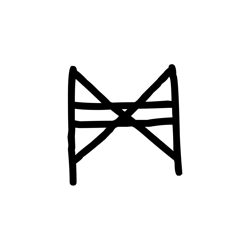

- source_zip_member: `Sub-character Images/dhewuxyotl/dhewuxyotl/c1c3uwic3n.png`
- checksum_sha256: see `06_component-visual-index.csv`.
- review_status: `needs_human_visual_review`
- caution: source-marked review image only.

## asset-015889

- source_zip_member: `Sub-character Images/dhewuxyotl/dhewuxyotl/ccjho3vk0e.png`
- checksum_sha256: see `06_component-visual-index.csv`.
- review_status: `needs_human_visual_review`
- caution: source-marked review image only.

## asset-015890

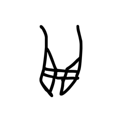

- source_zip_member: `Sub-character Images/dhewuxyotl/dhewuxyotl/cfit826rgl.png`
- checksum_sha256: see `06_component-visual-index.csv`.
- review_status: `needs_human_visual_review`
- caution: source-marked review image only.

## asset-015891

- source_zip_member: `Sub-character Images/dhewuxyotl/dhewuxyotl/cr75zwgt57.png`
- checksum_sha256: see `06_component-visual-index.csv`.
- review_status: `needs_human_visual_review`
- caution: source-marked review image only.

## asset-015892

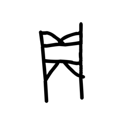

- source_zip_member: `Sub-character Images/dhewuxyotl/dhewuxyotl/cy6g3f2t2g.png`
- checksum_sha256: see `06_component-visual-index.csv`.
- review_status: `needs_human_visual_review`
- caution: source-marked review image only.

## asset-015893

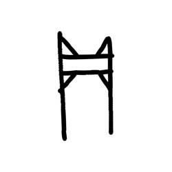

- source_zip_member: `Sub-character Images/dhewuxyotl/dhewuxyotl/czi6wbq1uw.png`
- checksum_sha256: see `06_component-visual-index.csv`.
- review_status: `needs_human_visual_review`
- caution: source-marked review image only.

## asset-015894

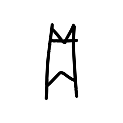

- source_zip_member: `Sub-character Images/dhewuxyotl/dhewuxyotl/d5ugy4vazl.png`
- checksum_sha256: see `06_component-visual-index.csv`.
- review_status: `needs_human_visual_review`
- caution: source-marked review image only.

## asset-015895

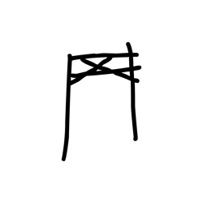

- source_zip_member: `Sub-character Images/dhewuxyotl/dhewuxyotl/d8jgti6xry.png`
- checksum_sha256: see `06_component-visual-index.csv`.
- review_status: `needs_human_visual_review`
- caution: source-marked review image only.

## asset-015896

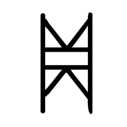

- source_zip_member: `Sub-character Images/dhewuxyotl/dhewuxyotl/dhewuxyotl.png`
- checksum_sha256: see `06_component-visual-index.csv`.
- review_status: `needs_human_visual_review`
- caution: source-marked review image only.

## asset-015897

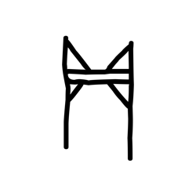

- source_zip_member: `Sub-character Images/dhewuxyotl/dhewuxyotl/dxrquvi9fm.png`
- checksum_sha256: see `06_component-visual-index.csv`.
- review_status: `needs_human_visual_review`
- caution: source-marked review image only.

## asset-015898

- source_zip_member: `Sub-character Images/dhewuxyotl/dhewuxyotl/e4m7op6zgc.png`
- checksum_sha256: see `06_component-visual-index.csv`.
- review_status: `needs_human_visual_review`
- caution: source-marked review image only.

## asset-015899

- source_zip_member: `Sub-character Images/dhewuxyotl/dhewuxyotl/e5o9j1mpmh.png`
- checksum_sha256: see `06_component-visual-index.csv`.
- review_status: `needs_human_visual_review`
- caution: source-marked review image only.

## asset-015900

- source_zip_member: `Sub-character Images/dhewuxyotl/dhewuxyotl/e7urkhrocf.png`
- checksum_sha256: see `06_component-visual-index.csv`.
- review_status: `needs_human_visual_review`
- caution: source-marked review image only.

## asset-015901

- source_zip_member: `Sub-character Images/dhewuxyotl/dhewuxyotl/e918imjk18.png`
- checksum_sha256: see `06_component-visual-index.csv`.
- review_status: `needs_human_visual_review`
- caution: source-marked review image only.

## asset-015902

- source_zip_member: `Sub-character Images/dhewuxyotl/dhewuxyotl/eixlg8knfx.png`
- checksum_sha256: see `06_component-visual-index.csv`.
- review_status: `needs_human_visual_review`
- caution: source-marked review image only.

## asset-015903

- source_zip_member: `Sub-character Images/dhewuxyotl/dhewuxyotl/esnw4d4l5r.png`
- checksum_sha256: see `06_component-visual-index.csv`.
- review_status: `needs_human_visual_review`
- caution: source-marked review image only.

## asset-015904

- source_zip_member: `Sub-character Images/dhewuxyotl/dhewuxyotl/fqxkhw5kw7.png`
- checksum_sha256: see `06_component-visual-index.csv`.
- review_status: `needs_human_visual_review`
- caution: source-marked review image only.

## asset-015905

- source_zip_member: `Sub-character Images/dhewuxyotl/dhewuxyotl/ftz7i7z6hw.png`
- checksum_sha256: see `06_component-visual-index.csv`.
- review_status: `needs_human_visual_review`
- caution: source-marked review image only.

## asset-015906

- source_zip_member: `Sub-character Images/dhewuxyotl/dhewuxyotl/gsea0ebhi8.png`
- checksum_sha256: see `06_component-visual-index.csv`.
- review_status: `needs_human_visual_review`
- caution: source-marked review image only.

## asset-015907

- source_zip_member: `Sub-character Images/dhewuxyotl/dhewuxyotl/gys9nod995.png`
- checksum_sha256: see `06_component-visual-index.csv`.
- review_status: `needs_human_visual_review`
- caution: source-marked review image only.

## asset-015908

- source_zip_member: `Sub-character Images/dhewuxyotl/dhewuxyotl/h0978nzn74.png`
- checksum_sha256: see `06_component-visual-index.csv`.
- review_status: `needs_human_visual_review`
- caution: source-marked review image only.

## asset-015909

- source_zip_member: `Sub-character Images/dhewuxyotl/dhewuxyotl/h6bo85gp4w.png`
- checksum_sha256: see `06_component-visual-index.csv`.
- review_status: `needs_human_visual_review`
- caution: source-marked review image only.

## asset-015910

- source_zip_member: `Sub-character Images/dhewuxyotl/dhewuxyotl/hw46tqadbg.png`
- checksum_sha256: see `06_component-visual-index.csv`.
- review_status: `needs_human_visual_review`
- caution: source-marked review image only.

## asset-015911

- source_zip_member: `Sub-character Images/dhewuxyotl/dhewuxyotl/i1plbefylt.png`
- checksum_sha256: see `06_component-visual-index.csv`.
- review_status: `needs_human_visual_review`
- caution: source-marked review image only.

## asset-015912

- source_zip_member: `Sub-character Images/dhewuxyotl/dhewuxyotl/i8xcisc9vs.png`
- checksum_sha256: see `06_component-visual-index.csv`.
- review_status: `needs_human_visual_review`
- caution: source-marked review image only.

## asset-015913

- source_zip_member: `Sub-character Images/dhewuxyotl/dhewuxyotl/idh39lje5d.png`
- checksum_sha256: see `06_component-visual-index.csv`.
- review_status: `needs_human_visual_review`
- caution: source-marked review image only.

## asset-015914

- source_zip_member: `Sub-character Images/dhewuxyotl/dhewuxyotl/idnlaizjp1.png`
- checksum_sha256: see `06_component-visual-index.csv`.
- review_status: `needs_human_visual_review`
- caution: source-marked review image only.

## asset-015915

- source_zip_member: `Sub-character Images/dhewuxyotl/dhewuxyotl/ijwrunvr37.png`
- checksum_sha256: see `06_component-visual-index.csv`.
- review_status: `needs_human_visual_review`
- caution: source-marked review image only.

## asset-015916

- source_zip_member: `Sub-character Images/dhewuxyotl/dhewuxyotl/iq3oeoot9p.png`
- checksum_sha256: see `06_component-visual-index.csv`.
- review_status: `needs_human_visual_review`
- caution: source-marked review image only.

## asset-015917

- source_zip_member: `Sub-character Images/dhewuxyotl/dhewuxyotl/j7givwgu5c.png`
- checksum_sha256: see `06_component-visual-index.csv`.
- review_status: `needs_human_visual_review`
- caution: source-marked review image only.

## asset-015918

- source_zip_member: `Sub-character Images/dhewuxyotl/dhewuxyotl/j8fpn6843l.png`
- checksum_sha256: see `06_component-visual-index.csv`.
- review_status: `needs_human_visual_review`
- caution: source-marked review image only.

## asset-015919

- source_zip_member: `Sub-character Images/dhewuxyotl/dhewuxyotl/jcqb68l0bd.png`
- checksum_sha256: see `06_component-visual-index.csv`.
- review_status: `needs_human_visual_review`
- caution: source-marked review image only.

## asset-015920

- source_zip_member: `Sub-character Images/dhewuxyotl/dhewuxyotl/jcxuabb9z1.png`
- checksum_sha256: see `06_component-visual-index.csv`.
- review_status: `needs_human_visual_review`
- caution: source-marked review image only.

## asset-015921

- source_zip_member: `Sub-character Images/dhewuxyotl/dhewuxyotl/jd4e4dg1oi.png`
- checksum_sha256: see `06_component-visual-index.csv`.
- review_status: `needs_human_visual_review`
- caution: source-marked review image only.

## asset-015922

- source_zip_member: `Sub-character Images/dhewuxyotl/dhewuxyotl/k59sxp89d5.png`
- checksum_sha256: see `06_component-visual-index.csv`.
- review_status: `needs_human_visual_review`
- caution: source-marked review image only.

## asset-015923

- source_zip_member: `Sub-character Images/dhewuxyotl/dhewuxyotl/ktdqq8bf34.png`
- checksum_sha256: see `06_component-visual-index.csv`.
- review_status: `needs_human_visual_review`
- caution: source-marked review image only.

## asset-015924

- source_zip_member: `Sub-character Images/dhewuxyotl/dhewuxyotl/l5rtik9p09.png`
- checksum_sha256: see `06_component-visual-index.csv`.
- review_status: `needs_human_visual_review`
- caution: source-marked review image only.

## asset-015925

- source_zip_member: `Sub-character Images/dhewuxyotl/dhewuxyotl/l61kq2d6nf.png`
- checksum_sha256: see `06_component-visual-index.csv`.
- review_status: `needs_human_visual_review`
- caution: source-marked review image only.

## asset-015926

- source_zip_member: `Sub-character Images/dhewuxyotl/dhewuxyotl/lgo8yea8x7.png`
- checksum_sha256: see `06_component-visual-index.csv`.
- review_status: `needs_human_visual_review`
- caution: source-marked review image only.

## asset-015927

- source_zip_member: `Sub-character Images/dhewuxyotl/dhewuxyotl/li264tmdzz.png`
- checksum_sha256: see `06_component-visual-index.csv`.
- review_status: `needs_human_visual_review`
- caution: source-marked review image only.

## asset-015928

- source_zip_member: `Sub-character Images/dhewuxyotl/dhewuxyotl/lpg7ajvq5z.png`
- checksum_sha256: see `06_component-visual-index.csv`.
- review_status: `needs_human_visual_review`
- caution: source-marked review image only.

## asset-015929

- source_zip_member: `Sub-character Images/dhewuxyotl/dhewuxyotl/lye19op17c.png`
- checksum_sha256: see `06_component-visual-index.csv`.
- review_status: `needs_human_visual_review`
- caution: source-marked review image only.

## asset-015930

- source_zip_member: `Sub-character Images/dhewuxyotl/dhewuxyotl/m934k6dvqk.png`
- checksum_sha256: see `06_component-visual-index.csv`.
- review_status: `needs_human_visual_review`
- caution: source-marked review image only.

## asset-015931

- source_zip_member: `Sub-character Images/dhewuxyotl/dhewuxyotl/mazgcgc0os.png`
- checksum_sha256: see `06_component-visual-index.csv`.
- review_status: `needs_human_visual_review`
- caution: source-marked review image only.

## asset-015932

- source_zip_member: `Sub-character Images/dhewuxyotl/dhewuxyotl/mh43fpr7kh.png`
- checksum_sha256: see `06_component-visual-index.csv`.
- review_status: `needs_human_visual_review`
- caution: source-marked review image only.

## asset-015933

- source_zip_member: `Sub-character Images/dhewuxyotl/dhewuxyotl/mkgjcs4wl1.png`
- checksum_sha256: see `06_component-visual-index.csv`.
- review_status: `needs_human_visual_review`
- caution: source-marked review image only.

## asset-015934

- source_zip_member: `Sub-character Images/dhewuxyotl/dhewuxyotl/mxnmpblkyd.png`
- checksum_sha256: see `06_component-visual-index.csv`.
- review_status: `needs_human_visual_review`
- caution: source-marked review image only.

## asset-015935

- source_zip_member: `Sub-character Images/dhewuxyotl/dhewuxyotl/n5gwau0urj.png`
- checksum_sha256: see `06_component-visual-index.csv`.
- review_status: `needs_human_visual_review`
- caution: source-marked review image only.

## asset-015936

- source_zip_member: `Sub-character Images/dhewuxyotl/dhewuxyotl/n7vgbzhdja.png`
- checksum_sha256: see `06_component-visual-index.csv`.
- review_status: `needs_human_visual_review`
- caution: source-marked review image only.

## asset-015937

- source_zip_member: `Sub-character Images/dhewuxyotl/dhewuxyotl/ny67ak32h0.png`
- checksum_sha256: see `06_component-visual-index.csv`.
- review_status: `needs_human_visual_review`
- caution: source-marked review image only.

## asset-015938

- source_zip_member: `Sub-character Images/dhewuxyotl/dhewuxyotl/obyqrr050l.png`
- checksum_sha256: see `06_component-visual-index.csv`.
- review_status: `needs_human_visual_review`
- caution: source-marked review image only.

## asset-015939

- source_zip_member: `Sub-character Images/dhewuxyotl/dhewuxyotl/ohqi6ze66c.png`
- checksum_sha256: see `06_component-visual-index.csv`.
- review_status: `needs_human_visual_review`
- caution: source-marked review image only.

## asset-015940

- source_zip_member: `Sub-character Images/dhewuxyotl/dhewuxyotl/oi71hoeztz.png`
- checksum_sha256: see `06_component-visual-index.csv`.
- review_status: `needs_human_visual_review`
- caution: source-marked review image only.

## asset-015941

- source_zip_member: `Sub-character Images/dhewuxyotl/dhewuxyotl/p8gnayhgnz.png`
- checksum_sha256: see `06_component-visual-index.csv`.
- review_status: `needs_human_visual_review`
- caution: source-marked review image only.

## asset-015942

- source_zip_member: `Sub-character Images/dhewuxyotl/dhewuxyotl/pnieub1l3u.png`
- checksum_sha256: see `06_component-visual-index.csv`.
- review_status: `needs_human_visual_review`
- caution: source-marked review image only.

## asset-015943

- source_zip_member: `Sub-character Images/dhewuxyotl/dhewuxyotl/qgkuextzi4.png`
- checksum_sha256: see `06_component-visual-index.csv`.
- review_status: `needs_human_visual_review`
- caution: source-marked review image only.

## asset-015944

- source_zip_member: `Sub-character Images/dhewuxyotl/dhewuxyotl/qhvtaxm23i.png`
- checksum_sha256: see `06_component-visual-index.csv`.
- review_status: `needs_human_visual_review`
- caution: source-marked review image only.

## asset-015945

- source_zip_member: `Sub-character Images/dhewuxyotl/dhewuxyotl/r9tc78nvxq.png`
- checksum_sha256: see `06_component-visual-index.csv`.
- review_status: `needs_human_visual_review`
- caution: source-marked review image only.

## asset-015946

- source_zip_member: `Sub-character Images/dhewuxyotl/dhewuxyotl/rdx16kw9mp.png`
- checksum_sha256: see `06_component-visual-index.csv`.
- review_status: `needs_human_visual_review`
- caution: source-marked review image only.

## asset-015947

- source_zip_member: `Sub-character Images/dhewuxyotl/dhewuxyotl/rgbo681ufa.png`
- checksum_sha256: see `06_component-visual-index.csv`.
- review_status: `needs_human_visual_review`
- caution: source-marked review image only.

## asset-015948

- source_zip_member: `Sub-character Images/dhewuxyotl/dhewuxyotl/rnaz141d13.png`
- checksum_sha256: see `06_component-visual-index.csv`.
- review_status: `needs_human_visual_review`
- caution: source-marked review image only.

## asset-015949

- source_zip_member: `Sub-character Images/dhewuxyotl/dhewuxyotl/rs27s9a4jm.png`
- checksum_sha256: see `06_component-visual-index.csv`.
- review_status: `needs_human_visual_review`
- caution: source-marked review image only.

## asset-015950

- source_zip_member: `Sub-character Images/dhewuxyotl/dhewuxyotl/rshabyu70r.png`
- checksum_sha256: see `06_component-visual-index.csv`.
- review_status: `needs_human_visual_review`
- caution: source-marked review image only.

## asset-015951

- source_zip_member: `Sub-character Images/dhewuxyotl/dhewuxyotl/s0hjdhxv2b.png`
- checksum_sha256: see `06_component-visual-index.csv`.
- review_status: `needs_human_visual_review`
- caution: source-marked review image only.

## asset-015952

- source_zip_member: `Sub-character Images/dhewuxyotl/dhewuxyotl/s3in9x1kmr.png`
- checksum_sha256: see `06_component-visual-index.csv`.
- review_status: `needs_human_visual_review`
- caution: source-marked review image only.

## asset-015953

- source_zip_member: `Sub-character Images/dhewuxyotl/dhewuxyotl/s8n7yrflra.png`
- checksum_sha256: see `06_component-visual-index.csv`.
- review_status: `needs_human_visual_review`
- caution: source-marked review image only.

## asset-015954

- source_zip_member: `Sub-character Images/dhewuxyotl/dhewuxyotl/sc1h989zpz.png`
- checksum_sha256: see `06_component-visual-index.csv`.
- review_status: `needs_human_visual_review`
- caution: source-marked review image only.

## asset-015955

- source_zip_member: `Sub-character Images/dhewuxyotl/dhewuxyotl/siynlfy24q.png`
- checksum_sha256: see `06_component-visual-index.csv`.
- review_status: `needs_human_visual_review`
- caution: source-marked review image only.

## asset-015956

- source_zip_member: `Sub-character Images/dhewuxyotl/dhewuxyotl/sj9a1fk97v.png`
- checksum_sha256: see `06_component-visual-index.csv`.
- review_status: `needs_human_visual_review`
- caution: source-marked review image only.

## asset-015957

- source_zip_member: `Sub-character Images/dhewuxyotl/dhewuxyotl/sk6xrr53io.png`
- checksum_sha256: see `06_component-visual-index.csv`.
- review_status: `needs_human_visual_review`
- caution: source-marked review image only.

## asset-015958

- source_zip_member: `Sub-character Images/dhewuxyotl/dhewuxyotl/slacby8ou1.png`
- checksum_sha256: see `06_component-visual-index.csv`.
- review_status: `needs_human_visual_review`
- caution: source-marked review image only.

## asset-015959

- source_zip_member: `Sub-character Images/dhewuxyotl/dhewuxyotl/sudx59dqgd.png`
- checksum_sha256: see `06_component-visual-index.csv`.
- review_status: `needs_human_visual_review`
- caution: source-marked review image only.

## asset-015960

- source_zip_member: `Sub-character Images/dhewuxyotl/dhewuxyotl/svwfvf1d4j.png`
- checksum_sha256: see `06_component-visual-index.csv`.
- review_status: `needs_human_visual_review`
- caution: source-marked review image only.

## asset-015961

- source_zip_member: `Sub-character Images/dhewuxyotl/dhewuxyotl/t9iofmboew.png`
- checksum_sha256: see `06_component-visual-index.csv`.
- review_status: `needs_human_visual_review`
- caution: source-marked review image only.

## asset-015962

- source_zip_member: `Sub-character Images/dhewuxyotl/dhewuxyotl/td1jod2iap.png`
- checksum_sha256: see `06_component-visual-index.csv`.
- review_status: `needs_human_visual_review`
- caution: source-marked review image only.

## asset-015963

- source_zip_member: `Sub-character Images/dhewuxyotl/dhewuxyotl/tss6sloxs7.png`
- checksum_sha256: see `06_component-visual-index.csv`.
- review_status: `needs_human_visual_review`
- caution: source-marked review image only.

## asset-015964

- source_zip_member: `Sub-character Images/dhewuxyotl/dhewuxyotl/tvrr1z04iw.png`
- checksum_sha256: see `06_component-visual-index.csv`.
- review_status: `needs_human_visual_review`
- caution: source-marked review image only.

## asset-015965

- source_zip_member: `Sub-character Images/dhewuxyotl/dhewuxyotl/tzp8pd7o1t.png`
- checksum_sha256: see `06_component-visual-index.csv`.
- review_status: `needs_human_visual_review`
- caution: source-marked review image only.

## asset-015966

- source_zip_member: `Sub-character Images/dhewuxyotl/dhewuxyotl/u3kpgjh8d1.png`
- checksum_sha256: see `06_component-visual-index.csv`.
- review_status: `needs_human_visual_review`
- caution: source-marked review image only.

## asset-015967

- source_zip_member: `Sub-character Images/dhewuxyotl/dhewuxyotl/u5pcr5cj4x.png`
- checksum_sha256: see `06_component-visual-index.csv`.
- review_status: `needs_human_visual_review`
- caution: source-marked review image only.

## asset-015968

- source_zip_member: `Sub-character Images/dhewuxyotl/dhewuxyotl/u9n0tbn356.png`
- checksum_sha256: see `06_component-visual-index.csv`.
- review_status: `needs_human_visual_review`
- caution: source-marked review image only.

## asset-015969

- source_zip_member: `Sub-character Images/dhewuxyotl/dhewuxyotl/umt23heqai.png`
- checksum_sha256: see `06_component-visual-index.csv`.
- review_status: `needs_human_visual_review`
- caution: source-marked review image only.

## asset-015970

- source_zip_member: `Sub-character Images/dhewuxyotl/dhewuxyotl/un5706sgh0.png`
- checksum_sha256: see `06_component-visual-index.csv`.
- review_status: `needs_human_visual_review`
- caution: source-marked review image only.

## asset-015971

- source_zip_member: `Sub-character Images/dhewuxyotl/dhewuxyotl/uv6bxnv051.png`
- checksum_sha256: see `06_component-visual-index.csv`.
- review_status: `needs_human_visual_review`
- caution: source-marked review image only.

## asset-015972

- source_zip_member: `Sub-character Images/dhewuxyotl/dhewuxyotl/v6cjbyxi0a.png`
- checksum_sha256: see `06_component-visual-index.csv`.
- review_status: `needs_human_visual_review`
- caution: source-marked review image only.

## asset-015973

- source_zip_member: `Sub-character Images/dhewuxyotl/dhewuxyotl/vqfb58uft1.png`
- checksum_sha256: see `06_component-visual-index.csv`.
- review_status: `needs_human_visual_review`
- caution: source-marked review image only.

## asset-015974

- source_zip_member: `Sub-character Images/dhewuxyotl/dhewuxyotl/vu75zkwxeb.png`
- checksum_sha256: see `06_component-visual-index.csv`.
- review_status: `needs_human_visual_review`
- caution: source-marked review image only.

## asset-015975

- source_zip_member: `Sub-character Images/dhewuxyotl/dhewuxyotl/w0po40fdkh.png`
- checksum_sha256: see `06_component-visual-index.csv`.
- review_status: `needs_human_visual_review`
- caution: source-marked review image only.

## asset-015976

- source_zip_member: `Sub-character Images/dhewuxyotl/dhewuxyotl/w3jamozht6.png`
- checksum_sha256: see `06_component-visual-index.csv`.
- review_status: `needs_human_visual_review`
- caution: source-marked review image only.

## asset-015977

- source_zip_member: `Sub-character Images/dhewuxyotl/dhewuxyotl/w4igazy904.png`
- checksum_sha256: see `06_component-visual-index.csv`.
- review_status: `needs_human_visual_review`
- caution: source-marked review image only.

## asset-015978

- source_zip_member: `Sub-character Images/dhewuxyotl/dhewuxyotl/wau3t9h43u.png`
- checksum_sha256: see `06_component-visual-index.csv`.
- review_status: `needs_human_visual_review`
- caution: source-marked review image only.

## asset-015979

- source_zip_member: `Sub-character Images/dhewuxyotl/dhewuxyotl/wawx2bbymo.png`
- checksum_sha256: see `06_component-visual-index.csv`.
- review_status: `needs_human_visual_review`
- caution: source-marked review image only.

## asset-015980

- source_zip_member: `Sub-character Images/dhewuxyotl/dhewuxyotl/wgkad6tzl1.png`
- checksum_sha256: see `06_component-visual-index.csv`.
- review_status: `needs_human_visual_review`
- caution: source-marked review image only.

## asset-015981

- source_zip_member: `Sub-character Images/dhewuxyotl/dhewuxyotl/wxcy5h3mmk.png`
- checksum_sha256: see `06_component-visual-index.csv`.
- review_status: `needs_human_visual_review`
- caution: source-marked review image only.

## asset-015982

- source_zip_member: `Sub-character Images/dhewuxyotl/dhewuxyotl/xh7pgxlt22.png`
- checksum_sha256: see `06_component-visual-index.csv`.
- review_status: `needs_human_visual_review`
- caution: source-marked review image only.

## asset-015983

- source_zip_member: `Sub-character Images/dhewuxyotl/dhewuxyotl/xmyr9vxy3d.png`
- checksum_sha256: see `06_component-visual-index.csv`.
- review_status: `needs_human_visual_review`
- caution: source-marked review image only.

## asset-015984

- source_zip_member: `Sub-character Images/dhewuxyotl/dhewuxyotl/xn9jjrsrsw.png`
- checksum_sha256: see `06_component-visual-index.csv`.
- review_status: `needs_human_visual_review`
- caution: source-marked review image only.

## asset-015985

- source_zip_member: `Sub-character Images/dhewuxyotl/dhewuxyotl/yhwh8d9p2f.png`
- checksum_sha256: see `06_component-visual-index.csv`.
- review_status: `needs_human_visual_review`
- caution: source-marked review image only.

## asset-015986

- source_zip_member: `Sub-character Images/dhewuxyotl/dhewuxyotl/z33qcc6et0.png`
- checksum_sha256: see `06_component-visual-index.csv`.
- review_status: `needs_human_visual_review`
- caution: source-marked review image only.

## asset-015987

- source_zip_member: `Sub-character Images/dhewuxyotl/dhewuxyotl/zb9xr98zag.png`
- checksum_sha256: see `06_component-visual-index.csv`.
- review_status: `needs_human_visual_review`
- caution: source-marked review image only.

## asset-015988

- source_zip_member: `Sub-character Images/dhewuxyotl/dhewuxyotl/zbah874gr0.png`
- checksum_sha256: see `06_component-visual-index.csv`.
- review_status: `needs_human_visual_review`
- caution: source-marked review image only.

## asset-015989

- source_zip_member: `Sub-character Images/dhewuxyotl/dhewuxyotl/zim551ac0k.png`
- checksum_sha256: see `06_component-visual-index.csv`.
- review_status: `needs_human_visual_review`
- caution: source-marked review image only.

## asset-015990

- source_zip_member: `Sub-character Images/dhewuxyotl/dhewuxyotl/zrpb4ou1nm.png`
- checksum_sha256: see `06_component-visual-index.csv`.
- review_status: `needs_human_visual_review`
- caution: source-marked review image only.

## asset-015991

- source_zip_member: `Sub-character Images/dhewuxyotl/dhewuxyotl/zxr8sh27y3.png`
- checksum_sha256: see `06_component-visual-index.csv`.
- review_status: `needs_human_visual_review`
- caution: source-marked review image only.
