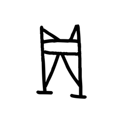
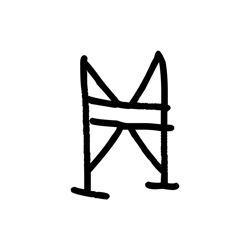
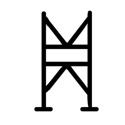
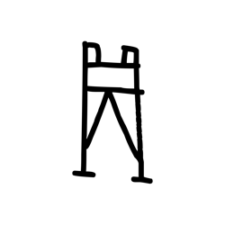
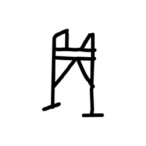
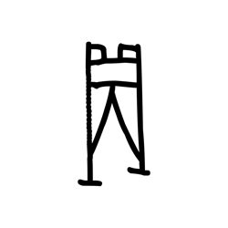
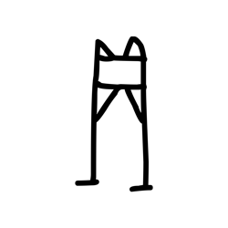
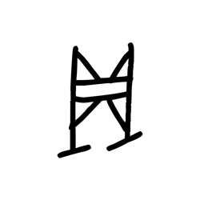
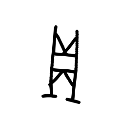

# Component Visual Gallery / 构件图像查看: obs-comp-cand-001423

English:
This page displays OBIMD subcharacter PNG assets extracted into this concrete
corpus object directory for human review.

简体中文：
本页展示抽取到当前具体 corpus 对象目录内的 OBIMD subcharacter PNG 资料，供人工复核使用。

Boundary / 边界：
dataset image candidate only; not a confirmed component form, not a component
assignment, and not a decipherment claim.
- not a confirmed component form
- not a component assignment
- not a decipherment claim

## Concrete Questions To Check / 具体待查问题

- Open 06_component-visual-index.csv and name the local image row.
- 打开 06_component-visual-index.csv，写明本地图像行。
- Open 09_component-visual-route-index.csv and name the source route row.
- 打开 09_component-visual-route-index.csv，写明来源路线行。
- Open 13_component-context-evidence-dossier.md for character context.
- 打开 13_component-context-evidence-dossier.md，核对单字与卜辞上下文。
- Record the missing image, near-shape, source, or context route.
- 记录缺失的图像、近形、来源或上下文路线。

## asset-015992

- source_zip_member: `Sub-character Images/dhewuxyotl/gwsh21hct4/a106a6ob6y.png`
- checksum_sha256: see `06_component-visual-index.csv`.
- review_status: `needs_human_visual_review`
- caution: source-marked review image only.

## asset-015993

- source_zip_member: `Sub-character Images/dhewuxyotl/gwsh21hct4/dv4c7idiio.png`
- checksum_sha256: see `06_component-visual-index.csv`.
- review_status: `needs_human_visual_review`
- caution: source-marked review image only.

## asset-015994

- source_zip_member: `Sub-character Images/dhewuxyotl/gwsh21hct4/gwsh21hct4.png`
- checksum_sha256: see `06_component-visual-index.csv`.
- review_status: `needs_human_visual_review`
- caution: source-marked review image only.

## asset-015995

- source_zip_member: `Sub-character Images/dhewuxyotl/gwsh21hct4/n34kdpaeda.png`
- checksum_sha256: see `06_component-visual-index.csv`.
- review_status: `needs_human_visual_review`
- caution: source-marked review image only.

## asset-015996

- source_zip_member: `Sub-character Images/dhewuxyotl/gwsh21hct4/ok996piat2.png`
- checksum_sha256: see `06_component-visual-index.csv`.
- review_status: `needs_human_visual_review`
- caution: source-marked review image only.

## asset-015997

- source_zip_member: `Sub-character Images/dhewuxyotl/gwsh21hct4/qtixndpzxn.png`
- checksum_sha256: see `06_component-visual-index.csv`.
- review_status: `needs_human_visual_review`
- caution: source-marked review image only.

## asset-015998

- source_zip_member: `Sub-character Images/dhewuxyotl/gwsh21hct4/t5pqggcsxm.png`
- checksum_sha256: see `06_component-visual-index.csv`.
- review_status: `needs_human_visual_review`
- caution: source-marked review image only.

## asset-015999

- source_zip_member: `Sub-character Images/dhewuxyotl/gwsh21hct4/v2kadh6vc9.png`
- checksum_sha256: see `06_component-visual-index.csv`.
- review_status: `needs_human_visual_review`
- caution: source-marked review image only.

## asset-016000

- source_zip_member: `Sub-character Images/dhewuxyotl/gwsh21hct4/y7s1vkehr4.png`
- checksum_sha256: see `06_component-visual-index.csv`.
- review_status: `needs_human_visual_review`
- caution: source-marked review image only.
