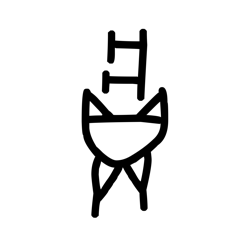

# Component Visual Gallery / 构件图像查看: obs-comp-cand-001427

English:
This page displays OBIMD subcharacter PNG assets extracted into this concrete corpus object directory for human review.

简体中文：
本页展示抽取到当前具体 corpus 对象目录内的 OBIMD subcharacter PNG 资料，供人工复核使用。

Boundary / 边界：dataset image candidate only; not a confirmed component form, component assignment, or decipherment claim.

## asset-016004

- source_zip_member: `Sub-character Images/n9qxfnupux/sz5p9cc92f/sz5p9cc92f.png`
- checksum_sha256: `e3953f4c3455f5c8797cd506be39e56b07498a033ea79a70ee8e076dd27af15c`
- review_status: `needs_human_visual_review`
- caution: OBIMD subcharacter image is a source-marked review asset only; it is not a confirmed component form, component assignment, or decipherment conclusion.
