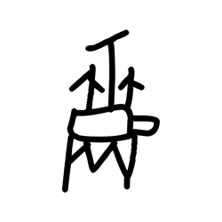

# Component Visual Gallery / 构件图像查看: obs-comp-cand-001446

English:
This page displays OBIMD subcharacter PNG assets extracted into this concrete corpus object directory for human review.

简体中文：
本页展示抽取到当前具体 corpus 对象目录内的 OBIMD subcharacter PNG 资料，供人工复核使用。

Boundary / 边界：dataset image candidate only; not a confirmed component form, component assignment, or decipherment claim.

## asset-016023

- source_zip_member: `Sub-character Images/97dgghy3oj/v5lcoa07g9/v5lcoa07g9.png`
- checksum_sha256: `7b082066c9df70c32e9fbcee7a2fd2b9cbf2e3f5afb40d6c9e29e169aebc2be9`
- review_status: `needs_human_visual_review`
- caution: OBIMD subcharacter image is a source-marked review asset only; it is not a confirmed component form, component assignment, or decipherment conclusion.
