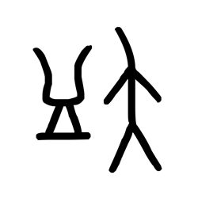

# Component Visual Gallery / 构件图像查看: obs-comp-cand-001462

English:
This page displays OBIMD subcharacter PNG assets extracted into this concrete corpus object directory for human review.

简体中文：
本页展示抽取到当前具体 corpus 对象目录内的 OBIMD subcharacter PNG 资料，供人工复核使用。

Boundary / 边界：dataset image candidate only; not a confirmed component form, component assignment, or decipherment claim.

## asset-016039

- source_zip_member: `Sub-character Images/luw8r1fj9l/luw8r1fj9l/luw8r1fj9l.png`
- checksum_sha256: `3416fcd67ee80260fab818bb1620b253d9c8dd8373d1f7ac560f23491125d45f`
- review_status: `needs_human_visual_review`
- caution: OBIMD subcharacter image is a source-marked review asset only; it is not a confirmed component form, component assignment, or decipherment conclusion.
