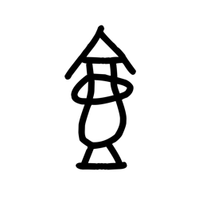

# Component Visual Gallery / 构件图像查看: obs-comp-cand-001480

English:
This page displays OBIMD subcharacter PNG assets extracted into this concrete corpus object directory for human review.

简体中文：
本页展示抽取到当前具体 corpus 对象目录内的 OBIMD subcharacter PNG 资料，供人工复核使用。

Boundary / 边界：dataset image candidate only; not a confirmed component form, component assignment, or decipherment claim.

## asset-016057

- source_zip_member: `Sub-character Images/3lizt17yhy/3lizt17yhy/3lizt17yhy.png`
- checksum_sha256: `80d21ca3ef4d4f8fbd7f04575bb59c2fc413be86da47e480998eeb1973670ace`
- review_status: `needs_human_visual_review`
- caution: OBIMD subcharacter image is a source-marked review asset only; it is not a confirmed component form, component assignment, or decipherment conclusion.
