# Component Visual Gallery / 构件图像查看: obs-comp-cand-001489

English:
This page displays OBIMD subcharacter PNG assets extracted into this concrete
corpus object directory for human review.

简体中文：
本页展示抽取到当前具体 corpus 对象目录内的 OBIMD subcharacter PNG 资料，供人工复核使用。

Boundary / 边界：
dataset image candidate only; not a confirmed component form, not a component
assignment, and not a decipherment claim.
- not a confirmed component form
- not a component assignment
- not a decipherment claim

## Concrete Questions To Check / 具体待查问题

- Open 06_component-visual-index.csv and name the local image row.
- 打开 06_component-visual-index.csv，写明本地图像行。
- Open 09_component-visual-route-index.csv and name the source route row.
- 打开 09_component-visual-route-index.csv，写明来源路线行。
- Open 13_component-context-evidence-dossier.md for character context.
- 打开 13_component-context-evidence-dossier.md，核对单字与卜辞上下文。
- Record the missing image, near-shape, source, or context route.
- 记录缺失的图像、近形、来源或上下文路线。

## asset-016066

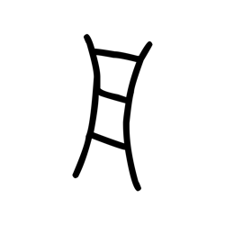

- source_zip_member: `Sub-character Images/34yhwco17n/34yhwco17n/04albq47zi.png`
- checksum_sha256: see `06_component-visual-index.csv`.
- review_status: `needs_human_visual_review`
- caution: source-marked review image only.

## asset-016067

- source_zip_member: `Sub-character Images/34yhwco17n/34yhwco17n/2xh1n19wep.png`
- checksum_sha256: see `06_component-visual-index.csv`.
- review_status: `needs_human_visual_review`
- caution: source-marked review image only.

## asset-016068

- source_zip_member: `Sub-character Images/34yhwco17n/34yhwco17n/34yhwco17n.png`
- checksum_sha256: see `06_component-visual-index.csv`.
- review_status: `needs_human_visual_review`
- caution: source-marked review image only.

## asset-016069

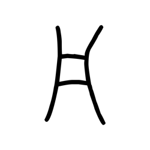

- source_zip_member: `Sub-character Images/34yhwco17n/34yhwco17n/4rni8bc7oe.png`
- checksum_sha256: see `06_component-visual-index.csv`.
- review_status: `needs_human_visual_review`
- caution: source-marked review image only.

## asset-016070

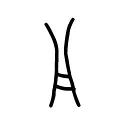

- source_zip_member: `Sub-character Images/34yhwco17n/34yhwco17n/4voycpbtd9.png`
- checksum_sha256: see `06_component-visual-index.csv`.
- review_status: `needs_human_visual_review`
- caution: source-marked review image only.

## asset-016071

- source_zip_member: `Sub-character Images/34yhwco17n/34yhwco17n/56dmxwl0k5.png`
- checksum_sha256: see `06_component-visual-index.csv`.
- review_status: `needs_human_visual_review`
- caution: source-marked review image only.

## asset-016072

- source_zip_member: `Sub-character Images/34yhwco17n/34yhwco17n/59osnj2hpx.png`
- checksum_sha256: see `06_component-visual-index.csv`.
- review_status: `needs_human_visual_review`
- caution: source-marked review image only.

## asset-016073

- source_zip_member: `Sub-character Images/34yhwco17n/34yhwco17n/5gfi1nrd7a.png`
- checksum_sha256: see `06_component-visual-index.csv`.
- review_status: `needs_human_visual_review`
- caution: source-marked review image only.

## asset-016074

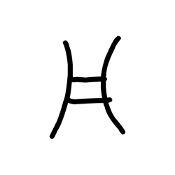

- source_zip_member: `Sub-character Images/34yhwco17n/34yhwco17n/5oefmlmg6u.png`
- checksum_sha256: see `06_component-visual-index.csv`.
- review_status: `needs_human_visual_review`
- caution: source-marked review image only.

## asset-016075

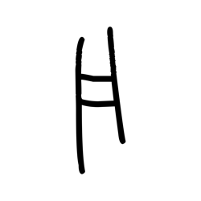

- source_zip_member: `Sub-character Images/34yhwco17n/34yhwco17n/5zpfh66omg.png`
- checksum_sha256: see `06_component-visual-index.csv`.
- review_status: `needs_human_visual_review`
- caution: source-marked review image only.

## asset-016076

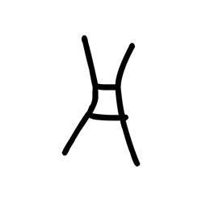

- source_zip_member: `Sub-character Images/34yhwco17n/34yhwco17n/62jlhj4y4s.png`
- checksum_sha256: see `06_component-visual-index.csv`.
- review_status: `needs_human_visual_review`
- caution: source-marked review image only.

## asset-016077

- source_zip_member: `Sub-character Images/34yhwco17n/34yhwco17n/75f0adx93y.png`
- checksum_sha256: see `06_component-visual-index.csv`.
- review_status: `needs_human_visual_review`
- caution: source-marked review image only.

## asset-016078

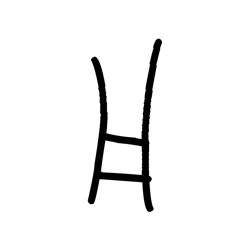

- source_zip_member: `Sub-character Images/34yhwco17n/34yhwco17n/7w2zkm7eot.png`
- checksum_sha256: see `06_component-visual-index.csv`.
- review_status: `needs_human_visual_review`
- caution: source-marked review image only.

## asset-016079

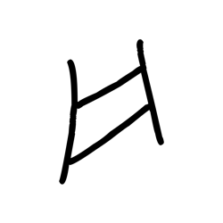

- source_zip_member: `Sub-character Images/34yhwco17n/34yhwco17n/8e6kbmjpnh.png`
- checksum_sha256: see `06_component-visual-index.csv`.
- review_status: `needs_human_visual_review`
- caution: source-marked review image only.

## asset-016080

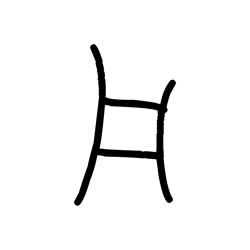

- source_zip_member: `Sub-character Images/34yhwco17n/34yhwco17n/9f9fiuow4q.png`
- checksum_sha256: see `06_component-visual-index.csv`.
- review_status: `needs_human_visual_review`
- caution: source-marked review image only.

## asset-016081

- source_zip_member: `Sub-character Images/34yhwco17n/34yhwco17n/d6rhac7fl7.png`
- checksum_sha256: see `06_component-visual-index.csv`.
- review_status: `needs_human_visual_review`
- caution: source-marked review image only.

## asset-016082

- source_zip_member: `Sub-character Images/34yhwco17n/34yhwco17n/dswjm6h87d.png`
- checksum_sha256: see `06_component-visual-index.csv`.
- review_status: `needs_human_visual_review`
- caution: source-marked review image only.

## asset-016083

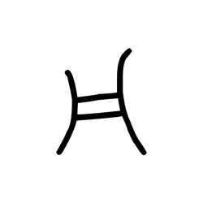

- source_zip_member: `Sub-character Images/34yhwco17n/34yhwco17n/i01hh7gi84.png`
- checksum_sha256: see `06_component-visual-index.csv`.
- review_status: `needs_human_visual_review`
- caution: source-marked review image only.

## asset-016084

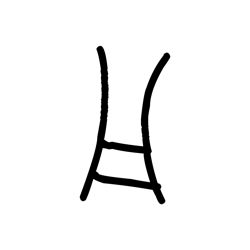

- source_zip_member: `Sub-character Images/34yhwco17n/34yhwco17n/i5cfbo45zr.png`
- checksum_sha256: see `06_component-visual-index.csv`.
- review_status: `needs_human_visual_review`
- caution: source-marked review image only.

## asset-016085

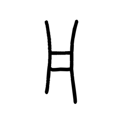

- source_zip_member: `Sub-character Images/34yhwco17n/34yhwco17n/j9567t5bao.png`
- checksum_sha256: see `06_component-visual-index.csv`.
- review_status: `needs_human_visual_review`
- caution: source-marked review image only.

## asset-016086

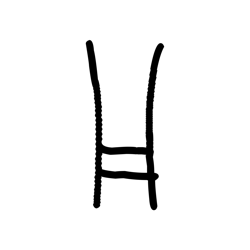

- source_zip_member: `Sub-character Images/34yhwco17n/34yhwco17n/nzy6xwngys.png`
- checksum_sha256: see `06_component-visual-index.csv`.
- review_status: `needs_human_visual_review`
- caution: source-marked review image only.

## asset-016087

- source_zip_member: `Sub-character Images/34yhwco17n/34yhwco17n/onaw7h78x2.png`
- checksum_sha256: see `06_component-visual-index.csv`.
- review_status: `needs_human_visual_review`
- caution: source-marked review image only.

## asset-016088

- source_zip_member: `Sub-character Images/34yhwco17n/34yhwco17n/oq2g4ekl7a.png`
- checksum_sha256: see `06_component-visual-index.csv`.
- review_status: `needs_human_visual_review`
- caution: source-marked review image only.

## asset-016089

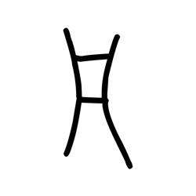

- source_zip_member: `Sub-character Images/34yhwco17n/34yhwco17n/p9tlqfzst7.png`
- checksum_sha256: see `06_component-visual-index.csv`.
- review_status: `needs_human_visual_review`
- caution: source-marked review image only.

## asset-016090

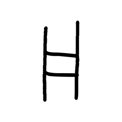

- source_zip_member: `Sub-character Images/34yhwco17n/34yhwco17n/pb54yqpiyi.png`
- checksum_sha256: see `06_component-visual-index.csv`.
- review_status: `needs_human_visual_review`
- caution: source-marked review image only.

## asset-016091

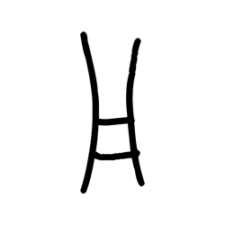

- source_zip_member: `Sub-character Images/34yhwco17n/34yhwco17n/sl6u5xzzov.png`
- checksum_sha256: see `06_component-visual-index.csv`.
- review_status: `needs_human_visual_review`
- caution: source-marked review image only.

## asset-016092

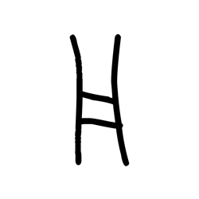

- source_zip_member: `Sub-character Images/34yhwco17n/34yhwco17n/t77xkhbgko.png`
- checksum_sha256: see `06_component-visual-index.csv`.
- review_status: `needs_human_visual_review`
- caution: source-marked review image only.

## asset-016093

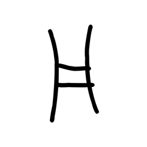

- source_zip_member: `Sub-character Images/34yhwco17n/34yhwco17n/umm0b0ygxh.png`
- checksum_sha256: see `06_component-visual-index.csv`.
- review_status: `needs_human_visual_review`
- caution: source-marked review image only.

## asset-016094

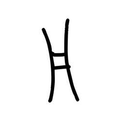

- source_zip_member: `Sub-character Images/34yhwco17n/34yhwco17n/vgii6wrrdn.png`
- checksum_sha256: see `06_component-visual-index.csv`.
- review_status: `needs_human_visual_review`
- caution: source-marked review image only.

## asset-016095

- source_zip_member: `Sub-character Images/34yhwco17n/34yhwco17n/vgoj0wp89o.png`
- checksum_sha256: see `06_component-visual-index.csv`.
- review_status: `needs_human_visual_review`
- caution: source-marked review image only.

## asset-016096

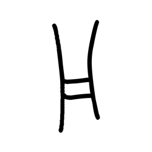

- source_zip_member: `Sub-character Images/34yhwco17n/34yhwco17n/vh6tgjnmmc.png`
- checksum_sha256: see `06_component-visual-index.csv`.
- review_status: `needs_human_visual_review`
- caution: source-marked review image only.

## asset-016097

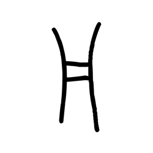

- source_zip_member: `Sub-character Images/34yhwco17n/34yhwco17n/wvy0p7wgdl.png`
- checksum_sha256: see `06_component-visual-index.csv`.
- review_status: `needs_human_visual_review`
- caution: source-marked review image only.

## asset-016098

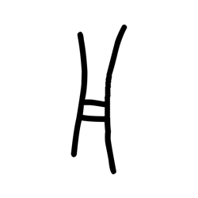

- source_zip_member: `Sub-character Images/34yhwco17n/34yhwco17n/x37mtbu1xh.png`
- checksum_sha256: see `06_component-visual-index.csv`.
- review_status: `needs_human_visual_review`
- caution: source-marked review image only.

## asset-016099

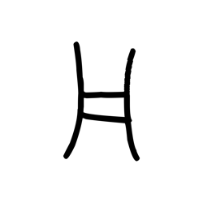

- source_zip_member: `Sub-character Images/34yhwco17n/34yhwco17n/ywea289qid.png`
- checksum_sha256: see `06_component-visual-index.csv`.
- review_status: `needs_human_visual_review`
- caution: source-marked review image only.

## asset-016100

- source_zip_member: `Sub-character Images/34yhwco17n/34yhwco17n/znr3lg0eh8.png`
- checksum_sha256: see `06_component-visual-index.csv`.
- review_status: `needs_human_visual_review`
- caution: source-marked review image only.
