# Component Visual Gallery / 构件图像查看: obs-comp-cand-001496

English:
This page displays OBIMD subcharacter PNG assets extracted into this concrete
corpus object directory for human review.

简体中文：
本页展示抽取到当前具体 corpus 对象目录内的 OBIMD subcharacter PNG 资料，供人工复核使用。

Boundary / 边界：
dataset image candidate only; not a confirmed component form, not a component
assignment, and not a decipherment claim.
- not a confirmed component form
- not a component assignment
- not a decipherment claim

## Concrete Questions To Check / 具体待查问题

- Which local image should be opened first?
- 应先打开哪一张本地构件图像？
- Which source zip member anchors this image?
- 哪一个 source zip member 能定位这张图像？
- Which near-shape or variant comparison is still missing?
- 还缺哪些近形或异体比较？
- Which character or inscription context should be checked next?
- 下一步应核对哪些单字或卜辞上下文？
- What evidence is missing before a component assignment?
- 正式构件归属前还缺哪些证据？

## asset-016107

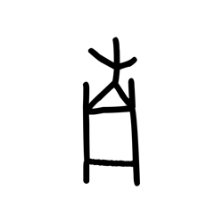

- source_zip_member: `Sub-character Images/qmsdu51da8/qmsdu51da8/1atl21tcfb.png`
- checksum_sha256: see `06_component-visual-index.csv`.
- review_status: `needs_human_visual_review`
- caution: source-marked review image only.

## asset-016108

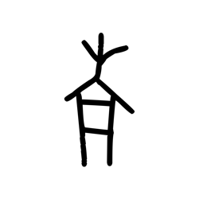

- source_zip_member: `Sub-character Images/qmsdu51da8/qmsdu51da8/2cjgg9msjg.png`
- checksum_sha256: see `06_component-visual-index.csv`.
- review_status: `needs_human_visual_review`
- caution: source-marked review image only.

## asset-016109

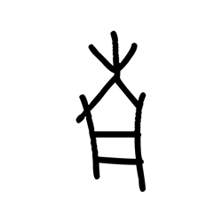

- source_zip_member: `Sub-character Images/qmsdu51da8/qmsdu51da8/2mjv6eh289.png`
- checksum_sha256: see `06_component-visual-index.csv`.
- review_status: `needs_human_visual_review`
- caution: source-marked review image only.

## asset-016110

- source_zip_member: `Sub-character Images/qmsdu51da8/qmsdu51da8/2ri0y6ckeh.png`
- checksum_sha256: see `06_component-visual-index.csv`.
- review_status: `needs_human_visual_review`
- caution: source-marked review image only.

## asset-016111

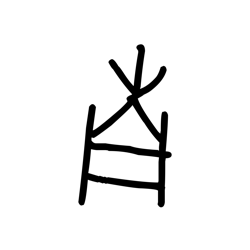

- source_zip_member: `Sub-character Images/qmsdu51da8/qmsdu51da8/31bb1az7a3.png`
- checksum_sha256: see `06_component-visual-index.csv`.
- review_status: `needs_human_visual_review`
- caution: source-marked review image only.

## asset-016112

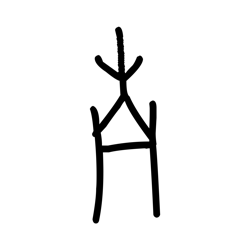

- source_zip_member: `Sub-character Images/qmsdu51da8/qmsdu51da8/36fi0thpuj.png`
- checksum_sha256: see `06_component-visual-index.csv`.
- review_status: `needs_human_visual_review`
- caution: source-marked review image only.

## asset-016113

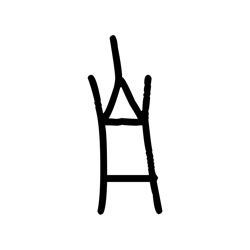

- source_zip_member: `Sub-character Images/qmsdu51da8/qmsdu51da8/36tcyycvdz.png`
- checksum_sha256: see `06_component-visual-index.csv`.
- review_status: `needs_human_visual_review`
- caution: source-marked review image only.

## asset-016114

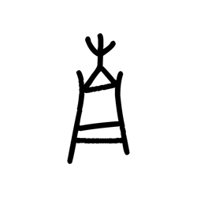

- source_zip_member: `Sub-character Images/qmsdu51da8/qmsdu51da8/3bbetzrpjk.png`
- checksum_sha256: see `06_component-visual-index.csv`.
- review_status: `needs_human_visual_review`
- caution: source-marked review image only.

## asset-016115

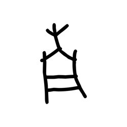

- source_zip_member: `Sub-character Images/qmsdu51da8/qmsdu51da8/4as4q9fgej.png`
- checksum_sha256: see `06_component-visual-index.csv`.
- review_status: `needs_human_visual_review`
- caution: source-marked review image only.

## asset-016116

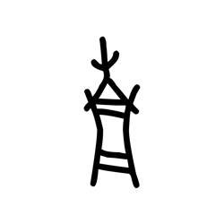

- source_zip_member: `Sub-character Images/qmsdu51da8/qmsdu51da8/4awvwd0l7x.png`
- checksum_sha256: see `06_component-visual-index.csv`.
- review_status: `needs_human_visual_review`
- caution: source-marked review image only.

## asset-016117

- source_zip_member: `Sub-character Images/qmsdu51da8/qmsdu51da8/4cc0s9owid.png`
- checksum_sha256: see `06_component-visual-index.csv`.
- review_status: `needs_human_visual_review`
- caution: source-marked review image only.

## asset-016118

- source_zip_member: `Sub-character Images/qmsdu51da8/qmsdu51da8/50dbxjygft.png`
- checksum_sha256: see `06_component-visual-index.csv`.
- review_status: `needs_human_visual_review`
- caution: source-marked review image only.

## asset-016119

- source_zip_member: `Sub-character Images/qmsdu51da8/qmsdu51da8/57nm7xq3f3.png`
- checksum_sha256: see `06_component-visual-index.csv`.
- review_status: `needs_human_visual_review`
- caution: source-marked review image only.

## asset-016120

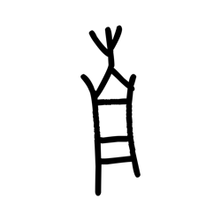

- source_zip_member: `Sub-character Images/qmsdu51da8/qmsdu51da8/6afnil90mk.png`
- checksum_sha256: see `06_component-visual-index.csv`.
- review_status: `needs_human_visual_review`
- caution: source-marked review image only.

## asset-016121

- source_zip_member: `Sub-character Images/qmsdu51da8/qmsdu51da8/6qmgl5tfdg.png`
- checksum_sha256: see `06_component-visual-index.csv`.
- review_status: `needs_human_visual_review`
- caution: source-marked review image only.

## asset-016122

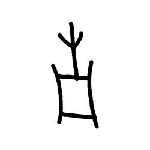

- source_zip_member: `Sub-character Images/qmsdu51da8/qmsdu51da8/6u7wvug646.png`
- checksum_sha256: see `06_component-visual-index.csv`.
- review_status: `needs_human_visual_review`
- caution: source-marked review image only.

## asset-016123

- source_zip_member: `Sub-character Images/qmsdu51da8/qmsdu51da8/786ode6k9v.png`
- checksum_sha256: see `06_component-visual-index.csv`.
- review_status: `needs_human_visual_review`
- caution: source-marked review image only.

## asset-016124

- source_zip_member: `Sub-character Images/qmsdu51da8/qmsdu51da8/7j2qvslgzp.png`
- checksum_sha256: see `06_component-visual-index.csv`.
- review_status: `needs_human_visual_review`
- caution: source-marked review image only.

## asset-016125

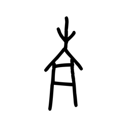

- source_zip_member: `Sub-character Images/qmsdu51da8/qmsdu51da8/885xu13g50.png`
- checksum_sha256: see `06_component-visual-index.csv`.
- review_status: `needs_human_visual_review`
- caution: source-marked review image only.

## asset-016126

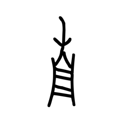

- source_zip_member: `Sub-character Images/qmsdu51da8/qmsdu51da8/8rvl08xqpy.png`
- checksum_sha256: see `06_component-visual-index.csv`.
- review_status: `needs_human_visual_review`
- caution: source-marked review image only.

## asset-016127

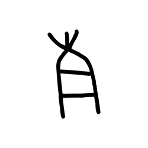

- source_zip_member: `Sub-character Images/qmsdu51da8/qmsdu51da8/910r5sex79.png`
- checksum_sha256: see `06_component-visual-index.csv`.
- review_status: `needs_human_visual_review`
- caution: source-marked review image only.

## asset-016128

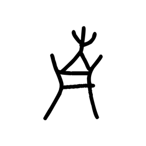

- source_zip_member: `Sub-character Images/qmsdu51da8/qmsdu51da8/a2jxy987r8.png`
- checksum_sha256: see `06_component-visual-index.csv`.
- review_status: `needs_human_visual_review`
- caution: source-marked review image only.

## asset-016129

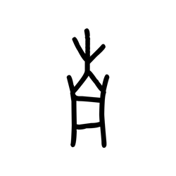

- source_zip_member: `Sub-character Images/qmsdu51da8/qmsdu51da8/a5frrefuk9.png`
- checksum_sha256: see `06_component-visual-index.csv`.
- review_status: `needs_human_visual_review`
- caution: source-marked review image only.

## asset-016130

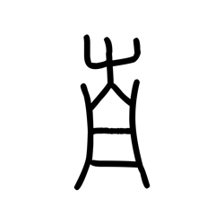

- source_zip_member: `Sub-character Images/qmsdu51da8/qmsdu51da8/ahy1axhpc6.png`
- checksum_sha256: see `06_component-visual-index.csv`.
- review_status: `needs_human_visual_review`
- caution: source-marked review image only.

## asset-016131

- source_zip_member: `Sub-character Images/qmsdu51da8/qmsdu51da8/b8mhpc11pa.png`
- checksum_sha256: see `06_component-visual-index.csv`.
- review_status: `needs_human_visual_review`
- caution: source-marked review image only.

## asset-016132

- source_zip_member: `Sub-character Images/qmsdu51da8/qmsdu51da8/bdpxa5ddu3.png`
- checksum_sha256: see `06_component-visual-index.csv`.
- review_status: `needs_human_visual_review`
- caution: source-marked review image only.

## asset-016133

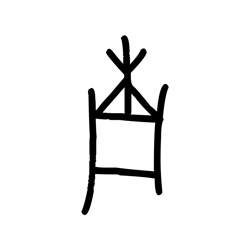

- source_zip_member: `Sub-character Images/qmsdu51da8/qmsdu51da8/bxeirkogkm.png`
- checksum_sha256: see `06_component-visual-index.csv`.
- review_status: `needs_human_visual_review`
- caution: source-marked review image only.

## asset-016134

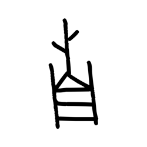

- source_zip_member: `Sub-character Images/qmsdu51da8/qmsdu51da8/c1xws9ylie.png`
- checksum_sha256: see `06_component-visual-index.csv`.
- review_status: `needs_human_visual_review`
- caution: source-marked review image only.

## asset-016135

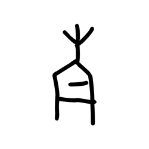

- source_zip_member: `Sub-character Images/qmsdu51da8/qmsdu51da8/c3tv4nh33z.png`
- checksum_sha256: see `06_component-visual-index.csv`.
- review_status: `needs_human_visual_review`
- caution: source-marked review image only.

## asset-016136

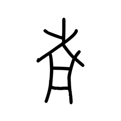

- source_zip_member: `Sub-character Images/qmsdu51da8/qmsdu51da8/cpxutbm1s9.png`
- checksum_sha256: see `06_component-visual-index.csv`.
- review_status: `needs_human_visual_review`
- caution: source-marked review image only.

## asset-016137

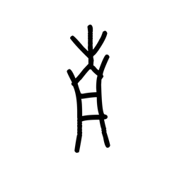

- source_zip_member: `Sub-character Images/qmsdu51da8/qmsdu51da8/d3uy2b7akl.png`
- checksum_sha256: see `06_component-visual-index.csv`.
- review_status: `needs_human_visual_review`
- caution: source-marked review image only.

## asset-016138

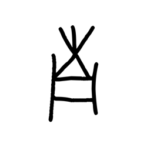

- source_zip_member: `Sub-character Images/qmsdu51da8/qmsdu51da8/d48me6291k.png`
- checksum_sha256: see `06_component-visual-index.csv`.
- review_status: `needs_human_visual_review`
- caution: source-marked review image only.

## asset-016139

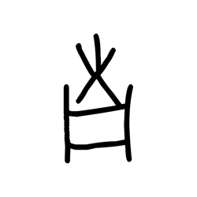

- source_zip_member: `Sub-character Images/qmsdu51da8/qmsdu51da8/d7djemaevg.png`
- checksum_sha256: see `06_component-visual-index.csv`.
- review_status: `needs_human_visual_review`
- caution: source-marked review image only.

## asset-016140

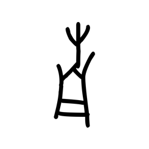

- source_zip_member: `Sub-character Images/qmsdu51da8/qmsdu51da8/dcv9rqf4cr.png`
- checksum_sha256: see `06_component-visual-index.csv`.
- review_status: `needs_human_visual_review`
- caution: source-marked review image only.

## asset-016141

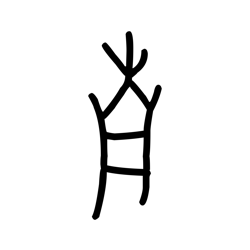

- source_zip_member: `Sub-character Images/qmsdu51da8/qmsdu51da8/dnefjsge4q.png`
- checksum_sha256: see `06_component-visual-index.csv`.
- review_status: `needs_human_visual_review`
- caution: source-marked review image only.

## asset-016142

- source_zip_member: `Sub-character Images/qmsdu51da8/qmsdu51da8/e5bjlbtdua.png`
- checksum_sha256: see `06_component-visual-index.csv`.
- review_status: `needs_human_visual_review`
- caution: source-marked review image only.

## asset-016143

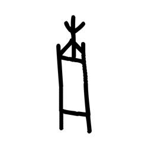

- source_zip_member: `Sub-character Images/qmsdu51da8/qmsdu51da8/eplqcuyzth.png`
- checksum_sha256: see `06_component-visual-index.csv`.
- review_status: `needs_human_visual_review`
- caution: source-marked review image only.

## asset-016144

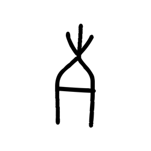

- source_zip_member: `Sub-character Images/qmsdu51da8/qmsdu51da8/f04t1c5g3w.png`
- checksum_sha256: see `06_component-visual-index.csv`.
- review_status: `needs_human_visual_review`
- caution: source-marked review image only.

## asset-016145

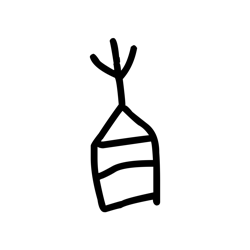

- source_zip_member: `Sub-character Images/qmsdu51da8/qmsdu51da8/fh1ozyix51.png`
- checksum_sha256: see `06_component-visual-index.csv`.
- review_status: `needs_human_visual_review`
- caution: source-marked review image only.

## asset-016146

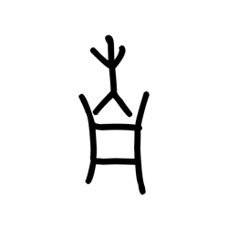

- source_zip_member: `Sub-character Images/qmsdu51da8/qmsdu51da8/fum0amg279.png`
- checksum_sha256: see `06_component-visual-index.csv`.
- review_status: `needs_human_visual_review`
- caution: source-marked review image only.

## asset-016147

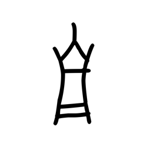

- source_zip_member: `Sub-character Images/qmsdu51da8/qmsdu51da8/gfr7216fno.png`
- checksum_sha256: see `06_component-visual-index.csv`.
- review_status: `needs_human_visual_review`
- caution: source-marked review image only.

## asset-016148

- source_zip_member: `Sub-character Images/qmsdu51da8/qmsdu51da8/i3k9emzgrz.png`
- checksum_sha256: see `06_component-visual-index.csv`.
- review_status: `needs_human_visual_review`
- caution: source-marked review image only.

## asset-016149

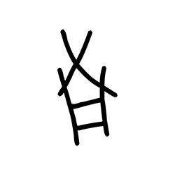

- source_zip_member: `Sub-character Images/qmsdu51da8/qmsdu51da8/iod5csib0c.png`
- checksum_sha256: see `06_component-visual-index.csv`.
- review_status: `needs_human_visual_review`
- caution: source-marked review image only.

## asset-016150

- source_zip_member: `Sub-character Images/qmsdu51da8/qmsdu51da8/j54ddh25ti.png`
- checksum_sha256: see `06_component-visual-index.csv`.
- review_status: `needs_human_visual_review`
- caution: source-marked review image only.

## asset-016151

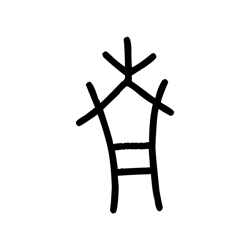

- source_zip_member: `Sub-character Images/qmsdu51da8/qmsdu51da8/jcqrq0oclx.png`
- checksum_sha256: see `06_component-visual-index.csv`.
- review_status: `needs_human_visual_review`
- caution: source-marked review image only.

## asset-016152

- source_zip_member: `Sub-character Images/qmsdu51da8/qmsdu51da8/jgbrn3cnpx.png`
- checksum_sha256: see `06_component-visual-index.csv`.
- review_status: `needs_human_visual_review`
- caution: source-marked review image only.

## asset-016153

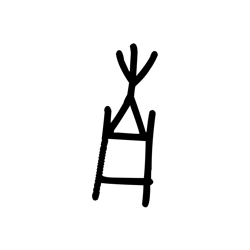

- source_zip_member: `Sub-character Images/qmsdu51da8/qmsdu51da8/joo7oful9a.png`
- checksum_sha256: see `06_component-visual-index.csv`.
- review_status: `needs_human_visual_review`
- caution: source-marked review image only.

## asset-016154

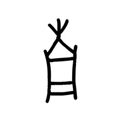

- source_zip_member: `Sub-character Images/qmsdu51da8/qmsdu51da8/jsfbwsu6dq.png`
- checksum_sha256: see `06_component-visual-index.csv`.
- review_status: `needs_human_visual_review`
- caution: source-marked review image only.

## asset-016155

- source_zip_member: `Sub-character Images/qmsdu51da8/qmsdu51da8/jvbfhiv35s.png`
- checksum_sha256: see `06_component-visual-index.csv`.
- review_status: `needs_human_visual_review`
- caution: source-marked review image only.

## asset-016156

- source_zip_member: `Sub-character Images/qmsdu51da8/qmsdu51da8/kwcv0q808v.png`
- checksum_sha256: see `06_component-visual-index.csv`.
- review_status: `needs_human_visual_review`
- caution: source-marked review image only.

## asset-016157

- source_zip_member: `Sub-character Images/qmsdu51da8/qmsdu51da8/l2zzxp6mi7.png`
- checksum_sha256: see `06_component-visual-index.csv`.
- review_status: `needs_human_visual_review`
- caution: source-marked review image only.

## asset-016158

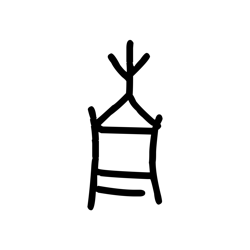

- source_zip_member: `Sub-character Images/qmsdu51da8/qmsdu51da8/l6t3ahei9h.png`
- checksum_sha256: see `06_component-visual-index.csv`.
- review_status: `needs_human_visual_review`
- caution: source-marked review image only.

## asset-016159

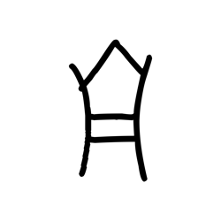

- source_zip_member: `Sub-character Images/qmsdu51da8/qmsdu51da8/ljjiqqmgso.png`
- checksum_sha256: see `06_component-visual-index.csv`.
- review_status: `needs_human_visual_review`
- caution: source-marked review image only.

## asset-016160

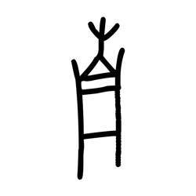

- source_zip_member: `Sub-character Images/qmsdu51da8/qmsdu51da8/m1xzy396tt.png`
- checksum_sha256: see `06_component-visual-index.csv`.
- review_status: `needs_human_visual_review`
- caution: source-marked review image only.

## asset-016161

- source_zip_member: `Sub-character Images/qmsdu51da8/qmsdu51da8/m362jk81yx.png`
- checksum_sha256: see `06_component-visual-index.csv`.
- review_status: `needs_human_visual_review`
- caution: source-marked review image only.

## asset-016162

- source_zip_member: `Sub-character Images/qmsdu51da8/qmsdu51da8/ni4vtl7c1w.png`
- checksum_sha256: see `06_component-visual-index.csv`.
- review_status: `needs_human_visual_review`
- caution: source-marked review image only.

## asset-016163

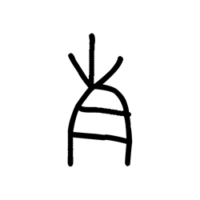

- source_zip_member: `Sub-character Images/qmsdu51da8/qmsdu51da8/ocxnzini53.png`
- checksum_sha256: see `06_component-visual-index.csv`.
- review_status: `needs_human_visual_review`
- caution: source-marked review image only.

## asset-016164

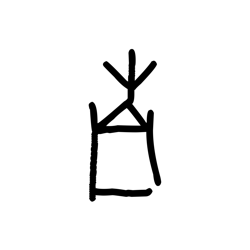

- source_zip_member: `Sub-character Images/qmsdu51da8/qmsdu51da8/oofwugbuk9.png`
- checksum_sha256: see `06_component-visual-index.csv`.
- review_status: `needs_human_visual_review`
- caution: source-marked review image only.

## asset-016165

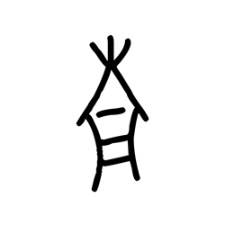

- source_zip_member: `Sub-character Images/qmsdu51da8/qmsdu51da8/pyld0ryymz.png`
- checksum_sha256: see `06_component-visual-index.csv`.
- review_status: `needs_human_visual_review`
- caution: source-marked review image only.

## asset-016166

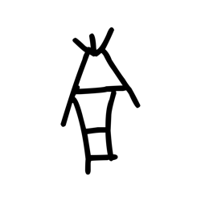

- source_zip_member: `Sub-character Images/qmsdu51da8/qmsdu51da8/q36yget37q.png`
- checksum_sha256: see `06_component-visual-index.csv`.
- review_status: `needs_human_visual_review`
- caution: source-marked review image only.

## asset-016167

- source_zip_member: `Sub-character Images/qmsdu51da8/qmsdu51da8/qmsdu51da8.png`
- checksum_sha256: see `06_component-visual-index.csv`.
- review_status: `needs_human_visual_review`
- caution: source-marked review image only.

## asset-016168

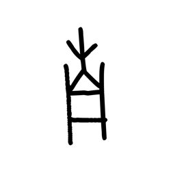

- source_zip_member: `Sub-character Images/qmsdu51da8/qmsdu51da8/s4lx31shnj.png`
- checksum_sha256: see `06_component-visual-index.csv`.
- review_status: `needs_human_visual_review`
- caution: source-marked review image only.

## asset-016169

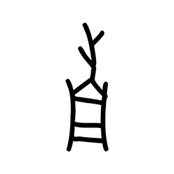

- source_zip_member: `Sub-character Images/qmsdu51da8/qmsdu51da8/sgt9j2aci4.png`
- checksum_sha256: see `06_component-visual-index.csv`.
- review_status: `needs_human_visual_review`
- caution: source-marked review image only.

## asset-016170

- source_zip_member: `Sub-character Images/qmsdu51da8/qmsdu51da8/sj6l4liqky.png`
- checksum_sha256: see `06_component-visual-index.csv`.
- review_status: `needs_human_visual_review`
- caution: source-marked review image only.

## asset-016171

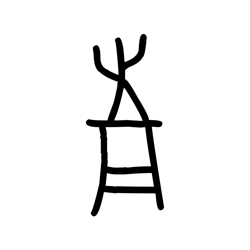

- source_zip_member: `Sub-character Images/qmsdu51da8/qmsdu51da8/t18f0c6j5s.png`
- checksum_sha256: see `06_component-visual-index.csv`.
- review_status: `needs_human_visual_review`
- caution: source-marked review image only.

## asset-016172

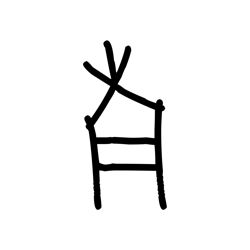

- source_zip_member: `Sub-character Images/qmsdu51da8/qmsdu51da8/t4f5h8t5jh.png`
- checksum_sha256: see `06_component-visual-index.csv`.
- review_status: `needs_human_visual_review`
- caution: source-marked review image only.

## asset-016173

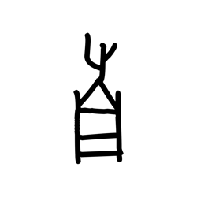

- source_zip_member: `Sub-character Images/qmsdu51da8/qmsdu51da8/tphi4hunt2.png`
- checksum_sha256: see `06_component-visual-index.csv`.
- review_status: `needs_human_visual_review`
- caution: source-marked review image only.

## asset-016174

- source_zip_member: `Sub-character Images/qmsdu51da8/qmsdu51da8/tpnym2snty.png`
- checksum_sha256: see `06_component-visual-index.csv`.
- review_status: `needs_human_visual_review`
- caution: source-marked review image only.

## asset-016175

- source_zip_member: `Sub-character Images/qmsdu51da8/qmsdu51da8/tv4tuybmfc.png`
- checksum_sha256: see `06_component-visual-index.csv`.
- review_status: `needs_human_visual_review`
- caution: source-marked review image only.

## asset-016176

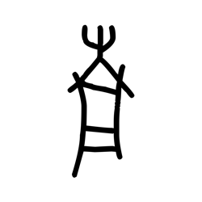

- source_zip_member: `Sub-character Images/qmsdu51da8/qmsdu51da8/u5vcremp44.png`
- checksum_sha256: see `06_component-visual-index.csv`.
- review_status: `needs_human_visual_review`
- caution: source-marked review image only.

## asset-016177

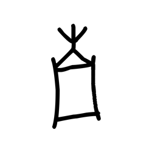

- source_zip_member: `Sub-character Images/qmsdu51da8/qmsdu51da8/uk4dkv8fq8.png`
- checksum_sha256: see `06_component-visual-index.csv`.
- review_status: `needs_human_visual_review`
- caution: source-marked review image only.

## asset-016178

- source_zip_member: `Sub-character Images/qmsdu51da8/qmsdu51da8/umxezkomis.png`
- checksum_sha256: see `06_component-visual-index.csv`.
- review_status: `needs_human_visual_review`
- caution: source-marked review image only.

## asset-016179

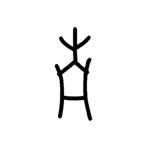

- source_zip_member: `Sub-character Images/qmsdu51da8/qmsdu51da8/up1rhqo781.png`
- checksum_sha256: see `06_component-visual-index.csv`.
- review_status: `needs_human_visual_review`
- caution: source-marked review image only.

## asset-016180

- source_zip_member: `Sub-character Images/qmsdu51da8/qmsdu51da8/uugcz5cafl.png`
- checksum_sha256: see `06_component-visual-index.csv`.
- review_status: `needs_human_visual_review`
- caution: source-marked review image only.

## asset-016181

- source_zip_member: `Sub-character Images/qmsdu51da8/qmsdu51da8/uv651jt5e0.png`
- checksum_sha256: see `06_component-visual-index.csv`.
- review_status: `needs_human_visual_review`
- caution: source-marked review image only.

## asset-016182

- source_zip_member: `Sub-character Images/qmsdu51da8/qmsdu51da8/v3yicxtfou.png`
- checksum_sha256: see `06_component-visual-index.csv`.
- review_status: `needs_human_visual_review`
- caution: source-marked review image only.

## asset-016183

- source_zip_member: `Sub-character Images/qmsdu51da8/qmsdu51da8/v4b7piag07.png`
- checksum_sha256: see `06_component-visual-index.csv`.
- review_status: `needs_human_visual_review`
- caution: source-marked review image only.

## asset-016184

- source_zip_member: `Sub-character Images/qmsdu51da8/qmsdu51da8/vcm6pzc176.png`
- checksum_sha256: see `06_component-visual-index.csv`.
- review_status: `needs_human_visual_review`
- caution: source-marked review image only.

## asset-016185

- source_zip_member: `Sub-character Images/qmsdu51da8/qmsdu51da8/vkybv6ac7m.png`
- checksum_sha256: see `06_component-visual-index.csv`.
- review_status: `needs_human_visual_review`
- caution: source-marked review image only.

## asset-016186

- source_zip_member: `Sub-character Images/qmsdu51da8/qmsdu51da8/w8nzr8w25r.png`
- checksum_sha256: see `06_component-visual-index.csv`.
- review_status: `needs_human_visual_review`
- caution: source-marked review image only.

## asset-016187

- source_zip_member: `Sub-character Images/qmsdu51da8/qmsdu51da8/xd3wjbx2lo.png`
- checksum_sha256: see `06_component-visual-index.csv`.
- review_status: `needs_human_visual_review`
- caution: source-marked review image only.

## asset-016188

- source_zip_member: `Sub-character Images/qmsdu51da8/qmsdu51da8/xsghbpg7k4.png`
- checksum_sha256: see `06_component-visual-index.csv`.
- review_status: `needs_human_visual_review`
- caution: source-marked review image only.

## asset-016189

- source_zip_member: `Sub-character Images/qmsdu51da8/qmsdu51da8/xvm28yxvwg.png`
- checksum_sha256: see `06_component-visual-index.csv`.
- review_status: `needs_human_visual_review`
- caution: source-marked review image only.

## asset-016190

- source_zip_member: `Sub-character Images/qmsdu51da8/qmsdu51da8/yanvfdpnbj.png`
- checksum_sha256: see `06_component-visual-index.csv`.
- review_status: `needs_human_visual_review`
- caution: source-marked review image only.

## asset-016191

- source_zip_member: `Sub-character Images/qmsdu51da8/qmsdu51da8/yzg1d4rz5r.png`
- checksum_sha256: see `06_component-visual-index.csv`.
- review_status: `needs_human_visual_review`
- caution: source-marked review image only.

## asset-016192

- source_zip_member: `Sub-character Images/qmsdu51da8/qmsdu51da8/zqyy0194dl.png`
- checksum_sha256: see `06_component-visual-index.csv`.
- review_status: `needs_human_visual_review`
- caution: source-marked review image only.
