# Component Visual Gallery / 构件图像查看: obs-comp-cand-001498

English:
This page displays OBIMD subcharacter PNG assets extracted into this concrete
corpus object directory for human review.

简体中文：
本页展示抽取到当前具体 corpus 对象目录内的 OBIMD subcharacter PNG 资料，供人工复核使用。

Boundary / 边界：
dataset image candidate only; not a confirmed component form, not a component
assignment, and not a decipherment claim.
- not a confirmed component form
- not a component assignment
- not a decipherment claim

## Concrete Questions To Check / 具体待查问题

- Open 06_component-visual-index.csv and name the local image row.
- 打开 06_component-visual-index.csv，写明本地图像行。
- Open 09_component-visual-route-index.csv and name the source route row.
- 打开 09_component-visual-route-index.csv，写明来源路线行。
- Open 13_component-context-evidence-dossier.md for character context.
- 打开 13_component-context-evidence-dossier.md，核对单字与卜辞上下文。
- Record the missing image, near-shape, source, or context route.
- 记录缺失的图像、近形、来源或上下文路线。

## asset-016194

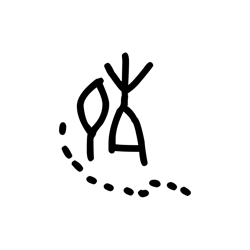

- source_zip_member: `Sub-character Images/5k1l85d8n2/5k1l85d8n2/1ax2j7q7kt.png`
- checksum_sha256: see `06_component-visual-index.csv`.
- review_status: `needs_human_visual_review`
- caution: source-marked review image only.

## asset-016195

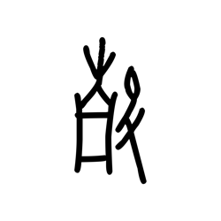

- source_zip_member: `Sub-character Images/5k1l85d8n2/5k1l85d8n2/1lr906dai3.png`
- checksum_sha256: see `06_component-visual-index.csv`.
- review_status: `needs_human_visual_review`
- caution: source-marked review image only.

## asset-016196

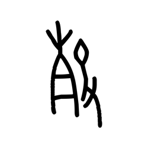

- source_zip_member: `Sub-character Images/5k1l85d8n2/5k1l85d8n2/1yzcb3s3g4.png`
- checksum_sha256: see `06_component-visual-index.csv`.
- review_status: `needs_human_visual_review`
- caution: source-marked review image only.

## asset-016197

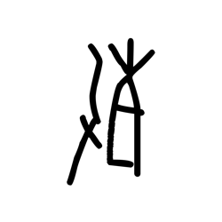

- source_zip_member: `Sub-character Images/5k1l85d8n2/5k1l85d8n2/23i2j8fwot.png`
- checksum_sha256: see `06_component-visual-index.csv`.
- review_status: `needs_human_visual_review`
- caution: source-marked review image only.

## asset-016198

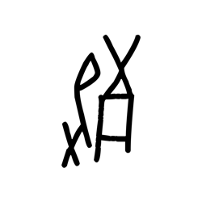

- source_zip_member: `Sub-character Images/5k1l85d8n2/5k1l85d8n2/2puzylbxsy.png`
- checksum_sha256: see `06_component-visual-index.csv`.
- review_status: `needs_human_visual_review`
- caution: source-marked review image only.

## asset-016199

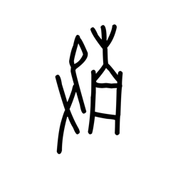

- source_zip_member: `Sub-character Images/5k1l85d8n2/5k1l85d8n2/2x2ag5k99i.png`
- checksum_sha256: see `06_component-visual-index.csv`.
- review_status: `needs_human_visual_review`
- caution: source-marked review image only.

## asset-016200

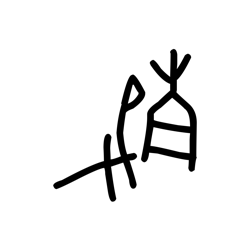

- source_zip_member: `Sub-character Images/5k1l85d8n2/5k1l85d8n2/3m0yrz9owl.png`
- checksum_sha256: see `06_component-visual-index.csv`.
- review_status: `needs_human_visual_review`
- caution: source-marked review image only.

## asset-016201

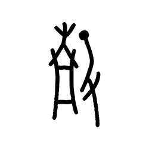

- source_zip_member: `Sub-character Images/5k1l85d8n2/5k1l85d8n2/3vu1j60j1b.png`
- checksum_sha256: see `06_component-visual-index.csv`.
- review_status: `needs_human_visual_review`
- caution: source-marked review image only.

## asset-016202

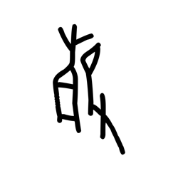

- source_zip_member: `Sub-character Images/5k1l85d8n2/5k1l85d8n2/4b2uhfnvhm.png`
- checksum_sha256: see `06_component-visual-index.csv`.
- review_status: `needs_human_visual_review`
- caution: source-marked review image only.

## asset-016203

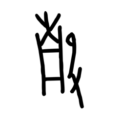

- source_zip_member: `Sub-character Images/5k1l85d8n2/5k1l85d8n2/5ihs5xa77d.png`
- checksum_sha256: see `06_component-visual-index.csv`.
- review_status: `needs_human_visual_review`
- caution: source-marked review image only.

## asset-016204

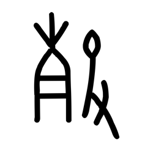

- source_zip_member: `Sub-character Images/5k1l85d8n2/5k1l85d8n2/5k1l85d8n2.png`
- checksum_sha256: see `06_component-visual-index.csv`.
- review_status: `needs_human_visual_review`
- caution: source-marked review image only.

## asset-016205

- source_zip_member: `Sub-character Images/5k1l85d8n2/5k1l85d8n2/5twifpryea.png`
- checksum_sha256: see `06_component-visual-index.csv`.
- review_status: `needs_human_visual_review`
- caution: source-marked review image only.

## asset-016206

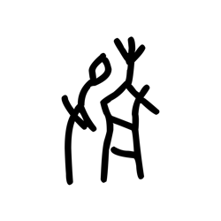

- source_zip_member: `Sub-character Images/5k1l85d8n2/5k1l85d8n2/62ob0suywd.png`
- checksum_sha256: see `06_component-visual-index.csv`.
- review_status: `needs_human_visual_review`
- caution: source-marked review image only.

## asset-016207

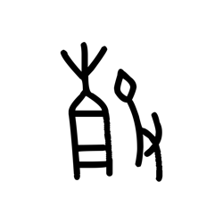

- source_zip_member: `Sub-character Images/5k1l85d8n2/5k1l85d8n2/6ku1reav7k.png`
- checksum_sha256: see `06_component-visual-index.csv`.
- review_status: `needs_human_visual_review`
- caution: source-marked review image only.

## asset-016208

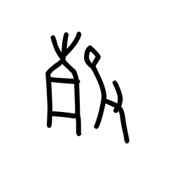

- source_zip_member: `Sub-character Images/5k1l85d8n2/5k1l85d8n2/79ruwe7qxn.png`
- checksum_sha256: see `06_component-visual-index.csv`.
- review_status: `needs_human_visual_review`
- caution: source-marked review image only.

## asset-016209

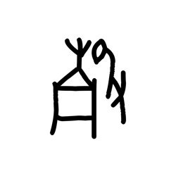

- source_zip_member: `Sub-character Images/5k1l85d8n2/5k1l85d8n2/8maevj5va9.png`
- checksum_sha256: see `06_component-visual-index.csv`.
- review_status: `needs_human_visual_review`
- caution: source-marked review image only.

## asset-016210

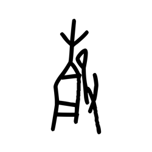

- source_zip_member: `Sub-character Images/5k1l85d8n2/5k1l85d8n2/8mv96ddlu3.png`
- checksum_sha256: see `06_component-visual-index.csv`.
- review_status: `needs_human_visual_review`
- caution: source-marked review image only.

## asset-016211

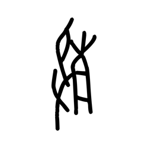

- source_zip_member: `Sub-character Images/5k1l85d8n2/5k1l85d8n2/8vuclzdm1v.png`
- checksum_sha256: see `06_component-visual-index.csv`.
- review_status: `needs_human_visual_review`
- caution: source-marked review image only.

## asset-016212

- source_zip_member: `Sub-character Images/5k1l85d8n2/5k1l85d8n2/9fiaxlotx2.png`
- checksum_sha256: see `06_component-visual-index.csv`.
- review_status: `needs_human_visual_review`
- caution: source-marked review image only.

## asset-016213

- source_zip_member: `Sub-character Images/5k1l85d8n2/5k1l85d8n2/cg5trepde5.png`
- checksum_sha256: see `06_component-visual-index.csv`.
- review_status: `needs_human_visual_review`
- caution: source-marked review image only.

## asset-016214

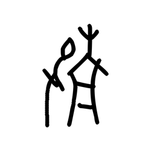

- source_zip_member: `Sub-character Images/5k1l85d8n2/5k1l85d8n2/d0ne16co1a.png`
- checksum_sha256: see `06_component-visual-index.csv`.
- review_status: `needs_human_visual_review`
- caution: source-marked review image only.

## asset-016215

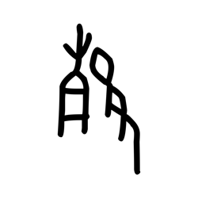

- source_zip_member: `Sub-character Images/5k1l85d8n2/5k1l85d8n2/e7c1rfv0r7.png`
- checksum_sha256: see `06_component-visual-index.csv`.
- review_status: `needs_human_visual_review`
- caution: source-marked review image only.

## asset-016216

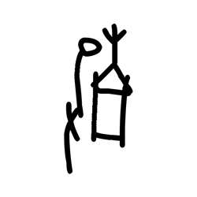

- source_zip_member: `Sub-character Images/5k1l85d8n2/5k1l85d8n2/f4i80q52tn.png`
- checksum_sha256: see `06_component-visual-index.csv`.
- review_status: `needs_human_visual_review`
- caution: source-marked review image only.

## asset-016217

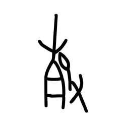

- source_zip_member: `Sub-character Images/5k1l85d8n2/5k1l85d8n2/h9bp0nvz7o.png`
- checksum_sha256: see `06_component-visual-index.csv`.
- review_status: `needs_human_visual_review`
- caution: source-marked review image only.

## asset-016218

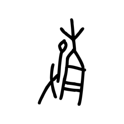

- source_zip_member: `Sub-character Images/5k1l85d8n2/5k1l85d8n2/kjqcghiwb3.png`
- checksum_sha256: see `06_component-visual-index.csv`.
- review_status: `needs_human_visual_review`
- caution: source-marked review image only.

## asset-016219

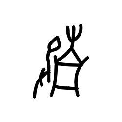

- source_zip_member: `Sub-character Images/5k1l85d8n2/5k1l85d8n2/l11mlqp9gb.png`
- checksum_sha256: see `06_component-visual-index.csv`.
- review_status: `needs_human_visual_review`
- caution: source-marked review image only.

## asset-016220

- source_zip_member: `Sub-character Images/5k1l85d8n2/5k1l85d8n2/n0ty5g7j1k.png`
- checksum_sha256: see `06_component-visual-index.csv`.
- review_status: `needs_human_visual_review`
- caution: source-marked review image only.

## asset-016221

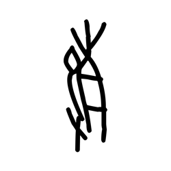

- source_zip_member: `Sub-character Images/5k1l85d8n2/5k1l85d8n2/nk6k1y6rai.png`
- checksum_sha256: see `06_component-visual-index.csv`.
- review_status: `needs_human_visual_review`
- caution: source-marked review image only.

## asset-016222

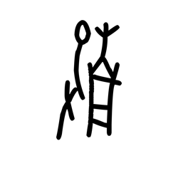

- source_zip_member: `Sub-character Images/5k1l85d8n2/5k1l85d8n2/nuyanek4zm.png`
- checksum_sha256: see `06_component-visual-index.csv`.
- review_status: `needs_human_visual_review`
- caution: source-marked review image only.

## asset-016223

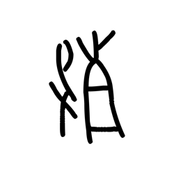

- source_zip_member: `Sub-character Images/5k1l85d8n2/5k1l85d8n2/ocarp8xpeo.png`
- checksum_sha256: see `06_component-visual-index.csv`.
- review_status: `needs_human_visual_review`
- caution: source-marked review image only.

## asset-016224

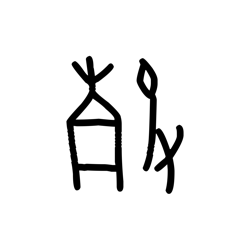

- source_zip_member: `Sub-character Images/5k1l85d8n2/5k1l85d8n2/ocwvek7cm9.png`
- checksum_sha256: see `06_component-visual-index.csv`.
- review_status: `needs_human_visual_review`
- caution: source-marked review image only.

## asset-016225

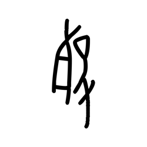

- source_zip_member: `Sub-character Images/5k1l85d8n2/5k1l85d8n2/oi8gzhp4r1.png`
- checksum_sha256: see `06_component-visual-index.csv`.
- review_status: `needs_human_visual_review`
- caution: source-marked review image only.

## asset-016226

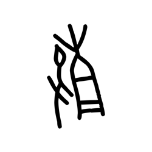

- source_zip_member: `Sub-character Images/5k1l85d8n2/5k1l85d8n2/ojrm1rse0g.png`
- checksum_sha256: see `06_component-visual-index.csv`.
- review_status: `needs_human_visual_review`
- caution: source-marked review image only.

## asset-016227

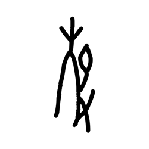

- source_zip_member: `Sub-character Images/5k1l85d8n2/5k1l85d8n2/ou7he5w7xz.png`
- checksum_sha256: see `06_component-visual-index.csv`.
- review_status: `needs_human_visual_review`
- caution: source-marked review image only.

## asset-016228

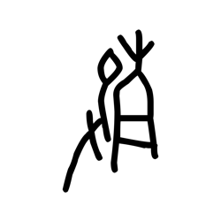

- source_zip_member: `Sub-character Images/5k1l85d8n2/5k1l85d8n2/q13fdtvguz.png`
- checksum_sha256: see `06_component-visual-index.csv`.
- review_status: `needs_human_visual_review`
- caution: source-marked review image only.

## asset-016229

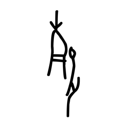

- source_zip_member: `Sub-character Images/5k1l85d8n2/5k1l85d8n2/rcej2vk5au.png`
- checksum_sha256: see `06_component-visual-index.csv`.
- review_status: `needs_human_visual_review`
- caution: source-marked review image only.

## asset-016230

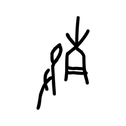

- source_zip_member: `Sub-character Images/5k1l85d8n2/5k1l85d8n2/sz89ijzvsq.png`
- checksum_sha256: see `06_component-visual-index.csv`.
- review_status: `needs_human_visual_review`
- caution: source-marked review image only.

## asset-016231

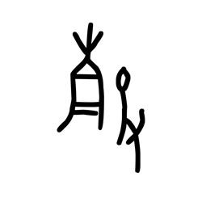

- source_zip_member: `Sub-character Images/5k1l85d8n2/5k1l85d8n2/tdvscbwz7y.png`
- checksum_sha256: see `06_component-visual-index.csv`.
- review_status: `needs_human_visual_review`
- caution: source-marked review image only.

## asset-016232

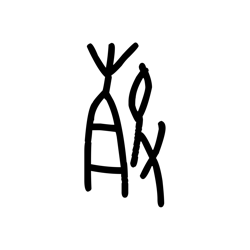

- source_zip_member: `Sub-character Images/5k1l85d8n2/5k1l85d8n2/to5gb3ae8w.png`
- checksum_sha256: see `06_component-visual-index.csv`.
- review_status: `needs_human_visual_review`
- caution: source-marked review image only.

## asset-016233

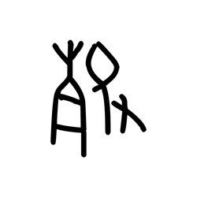

- source_zip_member: `Sub-character Images/5k1l85d8n2/5k1l85d8n2/u52yc2b86m.png`
- checksum_sha256: see `06_component-visual-index.csv`.
- review_status: `needs_human_visual_review`
- caution: source-marked review image only.

## asset-016234

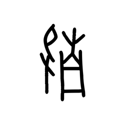

- source_zip_member: `Sub-character Images/5k1l85d8n2/5k1l85d8n2/vdel82ks2l.png`
- checksum_sha256: see `06_component-visual-index.csv`.
- review_status: `needs_human_visual_review`
- caution: source-marked review image only.

## asset-016235

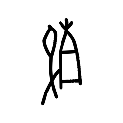

- source_zip_member: `Sub-character Images/5k1l85d8n2/5k1l85d8n2/wmptwmocx3.png`
- checksum_sha256: see `06_component-visual-index.csv`.
- review_status: `needs_human_visual_review`
- caution: source-marked review image only.

## asset-016236

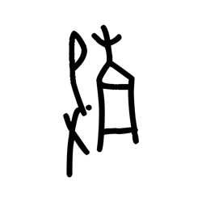

- source_zip_member: `Sub-character Images/5k1l85d8n2/5k1l85d8n2/x191ec0mmb.png`
- checksum_sha256: see `06_component-visual-index.csv`.
- review_status: `needs_human_visual_review`
- caution: source-marked review image only.

## asset-016237

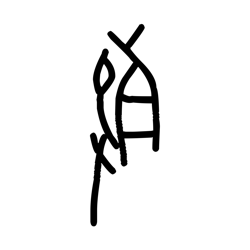

- source_zip_member: `Sub-character Images/5k1l85d8n2/5k1l85d8n2/xfl25any4u.png`
- checksum_sha256: see `06_component-visual-index.csv`.
- review_status: `needs_human_visual_review`
- caution: source-marked review image only.

## asset-016238

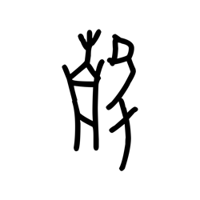

- source_zip_member: `Sub-character Images/5k1l85d8n2/5k1l85d8n2/xut4ji8chz.png`
- checksum_sha256: see `06_component-visual-index.csv`.
- review_status: `needs_human_visual_review`
- caution: source-marked review image only.

## asset-016239

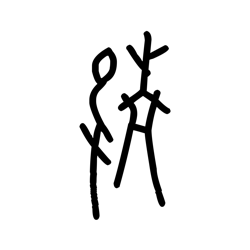

- source_zip_member: `Sub-character Images/5k1l85d8n2/5k1l85d8n2/xy1jtd8iuv.png`
- checksum_sha256: see `06_component-visual-index.csv`.
- review_status: `needs_human_visual_review`
- caution: source-marked review image only.

## asset-016240

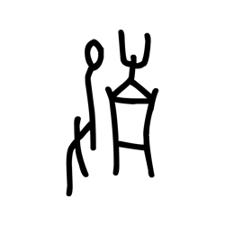

- source_zip_member: `Sub-character Images/5k1l85d8n2/5k1l85d8n2/ydvopweazi.png`
- checksum_sha256: see `06_component-visual-index.csv`.
- review_status: `needs_human_visual_review`
- caution: source-marked review image only.

## asset-016241

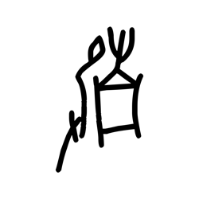

- source_zip_member: `Sub-character Images/5k1l85d8n2/5k1l85d8n2/yei2qg9f9m.png`
- checksum_sha256: see `06_component-visual-index.csv`.
- review_status: `needs_human_visual_review`
- caution: source-marked review image only.

## asset-016242

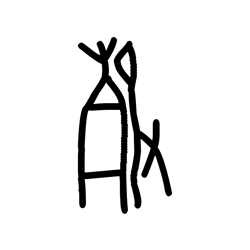

- source_zip_member: `Sub-character Images/5k1l85d8n2/5k1l85d8n2/z00spnl05g.png`
- checksum_sha256: see `06_component-visual-index.csv`.
- review_status: `needs_human_visual_review`
- caution: source-marked review image only.

## asset-016243

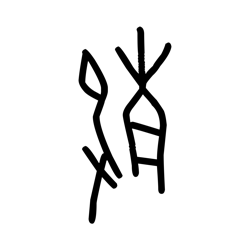

- source_zip_member: `Sub-character Images/5k1l85d8n2/5k1l85d8n2/z3w9qnudn4.png`
- checksum_sha256: see `06_component-visual-index.csv`.
- review_status: `needs_human_visual_review`
- caution: source-marked review image only.
