# Component Visual Gallery / 构件图像查看: obs-comp-cand-001501

English:
This page displays OBIMD subcharacter PNG assets extracted into this concrete corpus object directory for human review.

简体中文：
本页展示抽取到当前具体 corpus 对象目录内的 OBIMD subcharacter PNG 资料，供人工复核使用。

Boundary / 边界：dataset image candidate only; not a confirmed component form, component assignment, or decipherment claim.

## asset-016246

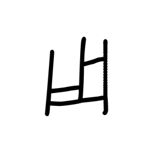

- source_zip_member: `Sub-character Images/353gxm6hd4/353gxm6hd4/03clgqprgn.png`
- checksum_sha256: `f8083586ac1eb60134af7541be7acfe9aa3fa963fdd8c8373d7c7d4bd41b9e0e`
- review_status: `needs_human_visual_review`
- caution: OBIMD subcharacter image is a source-marked review asset only; it is not a confirmed component form, component assignment, or decipherment conclusion.

## asset-016247

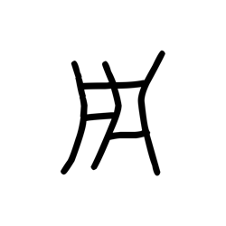

- source_zip_member: `Sub-character Images/353gxm6hd4/353gxm6hd4/09v32jsged.png`
- checksum_sha256: `d8496f1d0099de6bf6fac69445372db3ef85ada271c8f33803512ee6cf6ec4d5`
- review_status: `needs_human_visual_review`
- caution: OBIMD subcharacter image is a source-marked review asset only; it is not a confirmed component form, component assignment, or decipherment conclusion.

## asset-016248

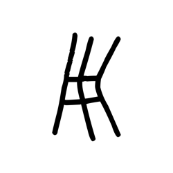

- source_zip_member: `Sub-character Images/353gxm6hd4/353gxm6hd4/0bqdc7mmnr.png`
- checksum_sha256: `0e507fe51b5dcba114465390e3ebe5a55adde3f5cf4cc0dceeed0d8fcf262a6e`
- review_status: `needs_human_visual_review`
- caution: OBIMD subcharacter image is a source-marked review asset only; it is not a confirmed component form, component assignment, or decipherment conclusion.

## asset-016249

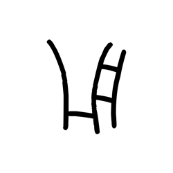

- source_zip_member: `Sub-character Images/353gxm6hd4/353gxm6hd4/0czrp3fyu8.png`
- checksum_sha256: `5b2a511946de5fb03001213d62931f7fcc6427660bf890dd6ec721a167177d16`
- review_status: `needs_human_visual_review`
- caution: OBIMD subcharacter image is a source-marked review asset only; it is not a confirmed component form, component assignment, or decipherment conclusion.

## asset-016250

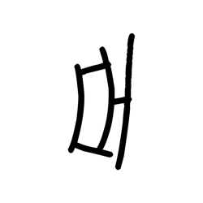

- source_zip_member: `Sub-character Images/353gxm6hd4/353gxm6hd4/0ybad2wrwt.png`
- checksum_sha256: `7ab5970b750c69b029d6a212631e0f6f25eba31e7495b3ce7dabcb3aa6b2364c`
- review_status: `needs_human_visual_review`
- caution: OBIMD subcharacter image is a source-marked review asset only; it is not a confirmed component form, component assignment, or decipherment conclusion.

## asset-016251

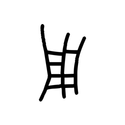

- source_zip_member: `Sub-character Images/353gxm6hd4/353gxm6hd4/168fw5iud9.png`
- checksum_sha256: `c1d1f6c6ddd785f9c440d7aa86f2046757b2f1080592e5b7fd5893fbb63c6818`
- review_status: `needs_human_visual_review`
- caution: OBIMD subcharacter image is a source-marked review asset only; it is not a confirmed component form, component assignment, or decipherment conclusion.

## asset-016252

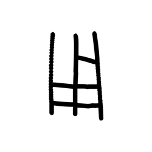

- source_zip_member: `Sub-character Images/353gxm6hd4/353gxm6hd4/16dp0c97nk.png`
- checksum_sha256: `b90eca334d11c92eef9bc4c0351a8e89b42f9cc7f2863a54e1aca88b3e452351`
- review_status: `needs_human_visual_review`
- caution: OBIMD subcharacter image is a source-marked review asset only; it is not a confirmed component form, component assignment, or decipherment conclusion.

## asset-016253

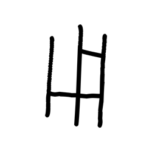

- source_zip_member: `Sub-character Images/353gxm6hd4/353gxm6hd4/1dkwkdrcee.png`
- checksum_sha256: `9e33007b14e26c174b6c66eef8469f545f8b798b0010d731071bc491a9a4dc71`
- review_status: `needs_human_visual_review`
- caution: OBIMD subcharacter image is a source-marked review asset only; it is not a confirmed component form, component assignment, or decipherment conclusion.

## asset-016254

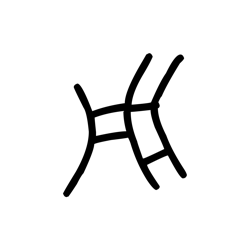

- source_zip_member: `Sub-character Images/353gxm6hd4/353gxm6hd4/1w1pvzj1jn.png`
- checksum_sha256: `e7de7e0c77950eea2a14f34ae5f14dc05188b060d4799590eb404aadeb103b1b`
- review_status: `needs_human_visual_review`
- caution: OBIMD subcharacter image is a source-marked review asset only; it is not a confirmed component form, component assignment, or decipherment conclusion.

## asset-016255

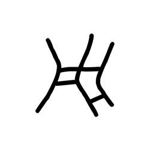

- source_zip_member: `Sub-character Images/353gxm6hd4/353gxm6hd4/205kl4g5pw.png`
- checksum_sha256: `434912e6efca57ee9df3e17c63a194138ef43f91f4a5f1978530d5bbda76f4c5`
- review_status: `needs_human_visual_review`
- caution: OBIMD subcharacter image is a source-marked review asset only; it is not a confirmed component form, component assignment, or decipherment conclusion.

## asset-016256

- source_zip_member: `Sub-character Images/353gxm6hd4/353gxm6hd4/21s5s4dc21.png`
- checksum_sha256: `fe7fd50d612d9ef619b3bc5f6da3730e862c87e81d3a86825cf772717e3bc533`
- review_status: `needs_human_visual_review`
- caution: OBIMD subcharacter image is a source-marked review asset only; it is not a confirmed component form, component assignment, or decipherment conclusion.

## asset-016257

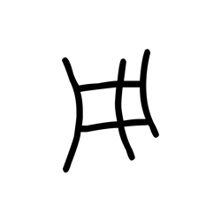

- source_zip_member: `Sub-character Images/353gxm6hd4/353gxm6hd4/2h3qwjjei9.png`
- checksum_sha256: `b8f3973a5f46a131cdb655b217b0cabac03edaede0049708fe3dee99ff086fa2`
- review_status: `needs_human_visual_review`
- caution: OBIMD subcharacter image is a source-marked review asset only; it is not a confirmed component form, component assignment, or decipherment conclusion.

## asset-016258

- source_zip_member: `Sub-character Images/353gxm6hd4/353gxm6hd4/2ha5e2ok9v.png`
- checksum_sha256: `e7812be6767176d32810a1ca009a5454a632f5cf1f4d6890da3606eb32051222`
- review_status: `needs_human_visual_review`
- caution: OBIMD subcharacter image is a source-marked review asset only; it is not a confirmed component form, component assignment, or decipherment conclusion.

## asset-016259

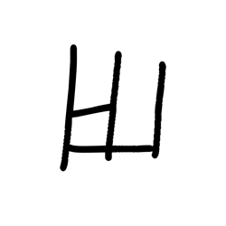

- source_zip_member: `Sub-character Images/353gxm6hd4/353gxm6hd4/2q2pv8wxr5.png`
- checksum_sha256: `fcaa550f918c2e6f0f685fb91e006c57f6fc81e03f6a3a5086ca0628408f363a`
- review_status: `needs_human_visual_review`
- caution: OBIMD subcharacter image is a source-marked review asset only; it is not a confirmed component form, component assignment, or decipherment conclusion.

## asset-016260

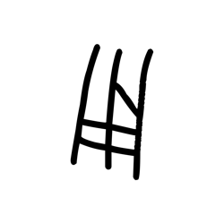

- source_zip_member: `Sub-character Images/353gxm6hd4/353gxm6hd4/3385kyodyd.png`
- checksum_sha256: `225e9a8c0ee92e67b5ba805855d595d26c8a0dacd0173ce4665db541729e6284`
- review_status: `needs_human_visual_review`
- caution: OBIMD subcharacter image is a source-marked review asset only; it is not a confirmed component form, component assignment, or decipherment conclusion.

## asset-016261

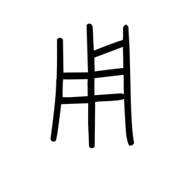

- source_zip_member: `Sub-character Images/353gxm6hd4/353gxm6hd4/353gxm6hd4.png`
- checksum_sha256: `2b15a8c14d81ff989f92f8fdb6dccd02d087490ed12812054f97d8963fed727a`
- review_status: `needs_human_visual_review`
- caution: OBIMD subcharacter image is a source-marked review asset only; it is not a confirmed component form, component assignment, or decipherment conclusion.

## asset-016262

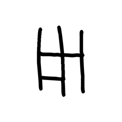

- source_zip_member: `Sub-character Images/353gxm6hd4/353gxm6hd4/371wax9bkn.png`
- checksum_sha256: `b454c3165758349983d30ab562a06a8f276085c8b96deb31b41bc7684e8f42e3`
- review_status: `needs_human_visual_review`
- caution: OBIMD subcharacter image is a source-marked review asset only; it is not a confirmed component form, component assignment, or decipherment conclusion.

## asset-016263

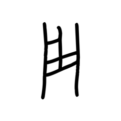

- source_zip_member: `Sub-character Images/353gxm6hd4/353gxm6hd4/3npjsc58rr.png`
- checksum_sha256: `6e1c671da0109b868544d9205a7c743e46f641cbf678c8a03a13f86f520b479c`
- review_status: `needs_human_visual_review`
- caution: OBIMD subcharacter image is a source-marked review asset only; it is not a confirmed component form, component assignment, or decipherment conclusion.

## asset-016264

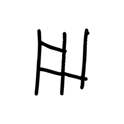

- source_zip_member: `Sub-character Images/353gxm6hd4/353gxm6hd4/3oxd7s1617.png`
- checksum_sha256: `80251c48cf40dc0d27cee05d7f236a40fcd46f09f2d2a740fb2f92aaef3ffd54`
- review_status: `needs_human_visual_review`
- caution: OBIMD subcharacter image is a source-marked review asset only; it is not a confirmed component form, component assignment, or decipherment conclusion.

## asset-016265

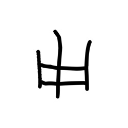

- source_zip_member: `Sub-character Images/353gxm6hd4/353gxm6hd4/46ecjkqoei.png`
- checksum_sha256: `181cdb7fcaa0f6a9e263978b1e3fd1308401df76b8bdb6761ce0457866b1609e`
- review_status: `needs_human_visual_review`
- caution: OBIMD subcharacter image is a source-marked review asset only; it is not a confirmed component form, component assignment, or decipherment conclusion.

## asset-016266

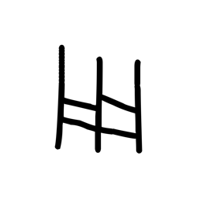

- source_zip_member: `Sub-character Images/353gxm6hd4/353gxm6hd4/4azsl9iygy.png`
- checksum_sha256: `e6ee4b2477c3e9f96fed69a235394dd190d67780783cb823697ba00f1546b000`
- review_status: `needs_human_visual_review`
- caution: OBIMD subcharacter image is a source-marked review asset only; it is not a confirmed component form, component assignment, or decipherment conclusion.

## asset-016267

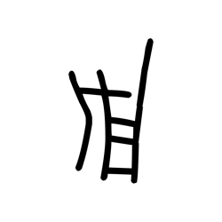

- source_zip_member: `Sub-character Images/353gxm6hd4/353gxm6hd4/4eqursaz4j.png`
- checksum_sha256: `b8f3b1fc7e693e60eaca56835fc8f174dbf3af6667a1688f30bd2dd468e57308`
- review_status: `needs_human_visual_review`
- caution: OBIMD subcharacter image is a source-marked review asset only; it is not a confirmed component form, component assignment, or decipherment conclusion.

## asset-016268

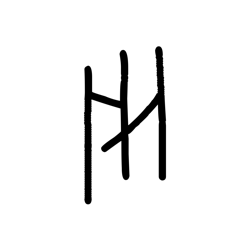

- source_zip_member: `Sub-character Images/353gxm6hd4/353gxm6hd4/4nuwbqa0jh.png`
- checksum_sha256: `7dc66e170347a913314bc8c3f9b8d8ab23cbcfcc51a2d1fc5ad40e174278336c`
- review_status: `needs_human_visual_review`
- caution: OBIMD subcharacter image is a source-marked review asset only; it is not a confirmed component form, component assignment, or decipherment conclusion.

## asset-016269

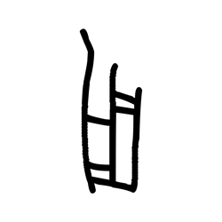

- source_zip_member: `Sub-character Images/353gxm6hd4/353gxm6hd4/4w93y9is8z.png`
- checksum_sha256: `9be57cfa0ec2c19691103aa4eeeb425a802a35f404470fa46e13c1dc960d3802`
- review_status: `needs_human_visual_review`
- caution: OBIMD subcharacter image is a source-marked review asset only; it is not a confirmed component form, component assignment, or decipherment conclusion.

## asset-016270

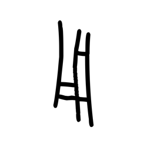

- source_zip_member: `Sub-character Images/353gxm6hd4/353gxm6hd4/4xmjt376sf.png`
- checksum_sha256: `9f989bb2987505a1d6d2ba795745f2bfa6ca496ffec0c24c4e8ed0fd897bd1af`
- review_status: `needs_human_visual_review`
- caution: OBIMD subcharacter image is a source-marked review asset only; it is not a confirmed component form, component assignment, or decipherment conclusion.

## asset-016271

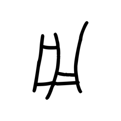

- source_zip_member: `Sub-character Images/353gxm6hd4/353gxm6hd4/56ltya8jph.png`
- checksum_sha256: `e3d212494939700da0fdf76bc519eb0e9d0201b3890c332e19b02a49143e6bc4`
- review_status: `needs_human_visual_review`
- caution: OBIMD subcharacter image is a source-marked review asset only; it is not a confirmed component form, component assignment, or decipherment conclusion.

## asset-016272

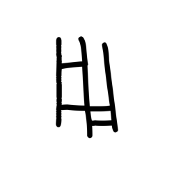

- source_zip_member: `Sub-character Images/353gxm6hd4/353gxm6hd4/58jfifgw7l.png`
- checksum_sha256: `a1c29da31c402afa7b2eeee5ae7175cf6837dad14f5347af92036f96d11b9361`
- review_status: `needs_human_visual_review`
- caution: OBIMD subcharacter image is a source-marked review asset only; it is not a confirmed component form, component assignment, or decipherment conclusion.

## asset-016273

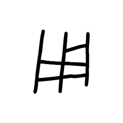

- source_zip_member: `Sub-character Images/353gxm6hd4/353gxm6hd4/5b661587tq.png`
- checksum_sha256: `d4c99f36ed74c5ab1b1c25abbcd6767551d6aecb508687bd7d122082ba7753ee`
- review_status: `needs_human_visual_review`
- caution: OBIMD subcharacter image is a source-marked review asset only; it is not a confirmed component form, component assignment, or decipherment conclusion.

## asset-016274

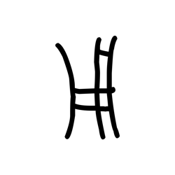

- source_zip_member: `Sub-character Images/353gxm6hd4/353gxm6hd4/5vlxbu7u5g.png`
- checksum_sha256: `0625aa747fc5877c6d1a650937da7d7bb8d3c548c5753069aa800cfeae3a4c69`
- review_status: `needs_human_visual_review`
- caution: OBIMD subcharacter image is a source-marked review asset only; it is not a confirmed component form, component assignment, or decipherment conclusion.

## asset-016275

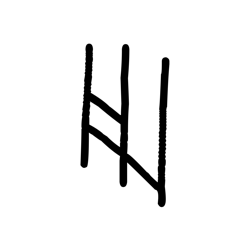

- source_zip_member: `Sub-character Images/353gxm6hd4/353gxm6hd4/6013h310l1.png`
- checksum_sha256: `535564e68e4c632de96802079493bb15881f4639a697ef2486e6c47066c43736`
- review_status: `needs_human_visual_review`
- caution: OBIMD subcharacter image is a source-marked review asset only; it is not a confirmed component form, component assignment, or decipherment conclusion.

## asset-016276

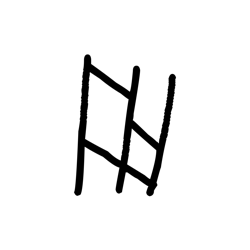

- source_zip_member: `Sub-character Images/353gxm6hd4/353gxm6hd4/6cwxf37556.png`
- checksum_sha256: `8b26e20dfadbe331f6ac93c425535cd38c3c3d353612a8b780e82619a9456906`
- review_status: `needs_human_visual_review`
- caution: OBIMD subcharacter image is a source-marked review asset only; it is not a confirmed component form, component assignment, or decipherment conclusion.

## asset-016277

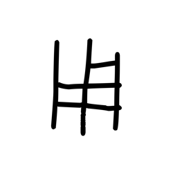

- source_zip_member: `Sub-character Images/353gxm6hd4/353gxm6hd4/6fuj93op3n.png`
- checksum_sha256: `64de07980133c76b2afad51fb543131aafb8ff0fa85ef5a46d5fa2520983d182`
- review_status: `needs_human_visual_review`
- caution: OBIMD subcharacter image is a source-marked review asset only; it is not a confirmed component form, component assignment, or decipherment conclusion.

## asset-016278

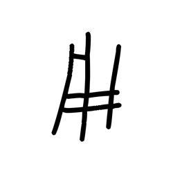

- source_zip_member: `Sub-character Images/353gxm6hd4/353gxm6hd4/6h1cljcwpe.png`
- checksum_sha256: `24b359c765fb83afe0eb948c722a82d620f27c8d20b97ea097e41ff3990d5ff2`
- review_status: `needs_human_visual_review`
- caution: OBIMD subcharacter image is a source-marked review asset only; it is not a confirmed component form, component assignment, or decipherment conclusion.

## asset-016279

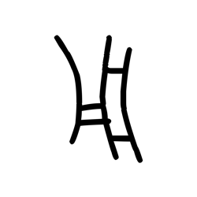

- source_zip_member: `Sub-character Images/353gxm6hd4/353gxm6hd4/6j2fs2nm4b.png`
- checksum_sha256: `d2a757cd38cb3a5e149ce0f82466f9a949a666acd41bc3b5ecdc3d0067eec5ac`
- review_status: `needs_human_visual_review`
- caution: OBIMD subcharacter image is a source-marked review asset only; it is not a confirmed component form, component assignment, or decipherment conclusion.

## asset-016280

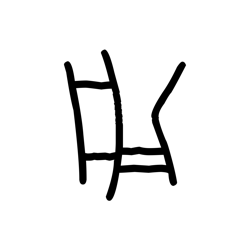

- source_zip_member: `Sub-character Images/353gxm6hd4/353gxm6hd4/6krdhc6td2.png`
- checksum_sha256: `2ac5e210a1371b1970b63b37e41bcb8b453f8d53508e806ea5fc0336b71dbca0`
- review_status: `needs_human_visual_review`
- caution: OBIMD subcharacter image is a source-marked review asset only; it is not a confirmed component form, component assignment, or decipherment conclusion.

## asset-016281

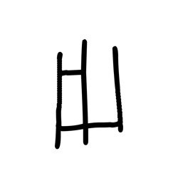

- source_zip_member: `Sub-character Images/353gxm6hd4/353gxm6hd4/6n4gf7n6e7.png`
- checksum_sha256: `4f1550fa598013097eb1b9569b2f18b37f24052b21d9eafb0a81f27e77cf842a`
- review_status: `needs_human_visual_review`
- caution: OBIMD subcharacter image is a source-marked review asset only; it is not a confirmed component form, component assignment, or decipherment conclusion.

## asset-016282

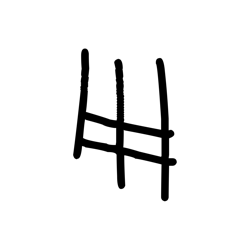

- source_zip_member: `Sub-character Images/353gxm6hd4/353gxm6hd4/7mgr1pk4yb.png`
- checksum_sha256: `45bf72da4619fb6758c8cdca3035d1858030eab0435d884a88bfcfcc7dabd324`
- review_status: `needs_human_visual_review`
- caution: OBIMD subcharacter image is a source-marked review asset only; it is not a confirmed component form, component assignment, or decipherment conclusion.

## asset-016283

- source_zip_member: `Sub-character Images/353gxm6hd4/353gxm6hd4/7mtw8fd23v.png`
- checksum_sha256: `dc8f97bb0712bf2ead4b7f65ec83145861c1b1f286c397901866645e3005ede6`
- review_status: `needs_human_visual_review`
- caution: OBIMD subcharacter image is a source-marked review asset only; it is not a confirmed component form, component assignment, or decipherment conclusion.

## asset-016284

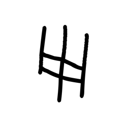

- source_zip_member: `Sub-character Images/353gxm6hd4/353gxm6hd4/7n7di9zkvr.png`
- checksum_sha256: `80728482f91422b7ff0f6f913d24019a53583a4a4d80bcc54b020bdf5cde260e`
- review_status: `needs_human_visual_review`
- caution: OBIMD subcharacter image is a source-marked review asset only; it is not a confirmed component form, component assignment, or decipherment conclusion.

## asset-016285

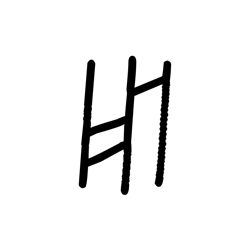

- source_zip_member: `Sub-character Images/353gxm6hd4/353gxm6hd4/7s7q8bb0vw.png`
- checksum_sha256: `c72a5ef5d406878ae5e682af983b379beaa4c9355bb1ad7c6c5c6c625a2a1d7b`
- review_status: `needs_human_visual_review`
- caution: OBIMD subcharacter image is a source-marked review asset only; it is not a confirmed component form, component assignment, or decipherment conclusion.

## asset-016286

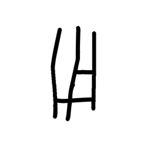

- source_zip_member: `Sub-character Images/353gxm6hd4/353gxm6hd4/810kj7zoaa.png`
- checksum_sha256: `b1811987db9fff4cf8744c6a2844d89f04e131dc79439e11af4e71c000cf4b1a`
- review_status: `needs_human_visual_review`
- caution: OBIMD subcharacter image is a source-marked review asset only; it is not a confirmed component form, component assignment, or decipherment conclusion.

## asset-016287

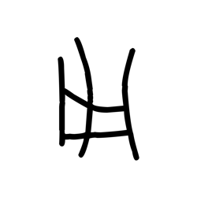

- source_zip_member: `Sub-character Images/353gxm6hd4/353gxm6hd4/8crrhgamkf.png`
- checksum_sha256: `746f00d74b8563bbb8288b6ee3d480c570edb8d4a3b1aa88c8f7080b663fce71`
- review_status: `needs_human_visual_review`
- caution: OBIMD subcharacter image is a source-marked review asset only; it is not a confirmed component form, component assignment, or decipherment conclusion.

## asset-016288

- source_zip_member: `Sub-character Images/353gxm6hd4/353gxm6hd4/8e1uwgcvd3.png`
- checksum_sha256: `09ee54110597d8be75ac3b7dbe67e22d5aa7c1d2a533076f433f4cd1fcfd655e`
- review_status: `needs_human_visual_review`
- caution: OBIMD subcharacter image is a source-marked review asset only; it is not a confirmed component form, component assignment, or decipherment conclusion.

## asset-016289

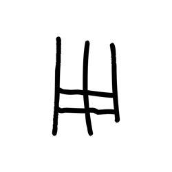

- source_zip_member: `Sub-character Images/353gxm6hd4/353gxm6hd4/8lsrbb0vsa.png`
- checksum_sha256: `37c1352cd5bb5676a0cc33107dc0bf933542dbb5a82321a5d019c6aa70f7cf27`
- review_status: `needs_human_visual_review`
- caution: OBIMD subcharacter image is a source-marked review asset only; it is not a confirmed component form, component assignment, or decipherment conclusion.

## asset-016290

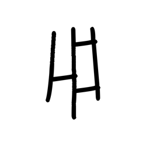

- source_zip_member: `Sub-character Images/353gxm6hd4/353gxm6hd4/8m4lccv5jg.png`
- checksum_sha256: `812806b59bbd4318eec832842dfdb3ee9b355eecbf0dcfb147da10822bc605be`
- review_status: `needs_human_visual_review`
- caution: OBIMD subcharacter image is a source-marked review asset only; it is not a confirmed component form, component assignment, or decipherment conclusion.

## asset-016291

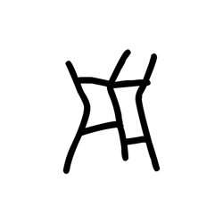

- source_zip_member: `Sub-character Images/353gxm6hd4/353gxm6hd4/8v2zhzcbr6.png`
- checksum_sha256: `f303ffbe9e462eafc73594dd84847a602f82a0175f40608498653c2b3b176c9d`
- review_status: `needs_human_visual_review`
- caution: OBIMD subcharacter image is a source-marked review asset only; it is not a confirmed component form, component assignment, or decipherment conclusion.

## asset-016292

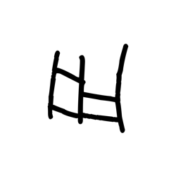

- source_zip_member: `Sub-character Images/353gxm6hd4/353gxm6hd4/8wykl48bds.png`
- checksum_sha256: `3c67642150476b91cb40aaf8d8e0d84e57c30ec92f0f8a82486dffe52c93a00e`
- review_status: `needs_human_visual_review`
- caution: OBIMD subcharacter image is a source-marked review asset only; it is not a confirmed component form, component assignment, or decipherment conclusion.

## asset-016293

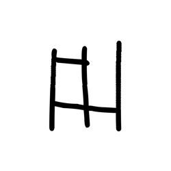

- source_zip_member: `Sub-character Images/353gxm6hd4/353gxm6hd4/900yymxfza.png`
- checksum_sha256: `f3e4856532ec9dfad748d7ebf07f78815ae000e0ba022157e2810a37530c2a26`
- review_status: `needs_human_visual_review`
- caution: OBIMD subcharacter image is a source-marked review asset only; it is not a confirmed component form, component assignment, or decipherment conclusion.

## asset-016294

- source_zip_member: `Sub-character Images/353gxm6hd4/353gxm6hd4/9ppyeyadoj.png`
- checksum_sha256: `611410820e62d366f2b11d70722dd2f8a11bb6d88993c2a20c5824c80ecdf983`
- review_status: `needs_human_visual_review`
- caution: OBIMD subcharacter image is a source-marked review asset only; it is not a confirmed component form, component assignment, or decipherment conclusion.

## asset-016295

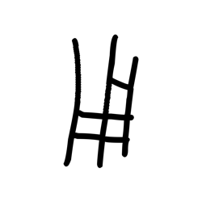

- source_zip_member: `Sub-character Images/353gxm6hd4/353gxm6hd4/9qfnplmtqw.png`
- checksum_sha256: `55b6b060e8c147faf9b809f5eda52a7823fe1b35e9ea46bed38b5ffd12f7e7cb`
- review_status: `needs_human_visual_review`
- caution: OBIMD subcharacter image is a source-marked review asset only; it is not a confirmed component form, component assignment, or decipherment conclusion.

## asset-016296

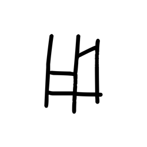

- source_zip_member: `Sub-character Images/353gxm6hd4/353gxm6hd4/9qlujwzo4t.png`
- checksum_sha256: `830f0ed7513bc82aa666e2816f159535635a6ad18c64764d371eb2979e86e1e9`
- review_status: `needs_human_visual_review`
- caution: OBIMD subcharacter image is a source-marked review asset only; it is not a confirmed component form, component assignment, or decipherment conclusion.

## asset-016297

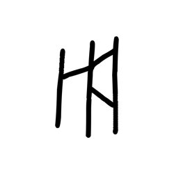

- source_zip_member: `Sub-character Images/353gxm6hd4/353gxm6hd4/a0ok851oet.png`
- checksum_sha256: `3d236c334a82342647654d4a7c6fafcb5a0f6c682045884f528264bfec69cedb`
- review_status: `needs_human_visual_review`
- caution: OBIMD subcharacter image is a source-marked review asset only; it is not a confirmed component form, component assignment, or decipherment conclusion.

## asset-016298

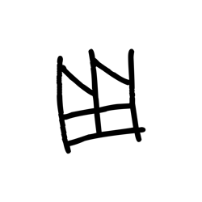

- source_zip_member: `Sub-character Images/353gxm6hd4/353gxm6hd4/aenwi7mxqd.png`
- checksum_sha256: `77202486482387cc52502b70e04fdf2e178f7c1a31840fa989dc9db4946ed763`
- review_status: `needs_human_visual_review`
- caution: OBIMD subcharacter image is a source-marked review asset only; it is not a confirmed component form, component assignment, or decipherment conclusion.

## asset-016299

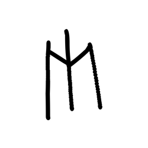

- source_zip_member: `Sub-character Images/353gxm6hd4/353gxm6hd4/ai5269bf8q.png`
- checksum_sha256: `c1a9b787f19e80f73c237f434412b0695ee04f676d3baf354ed1acd3ec57a9c3`
- review_status: `needs_human_visual_review`
- caution: OBIMD subcharacter image is a source-marked review asset only; it is not a confirmed component form, component assignment, or decipherment conclusion.

## asset-016300

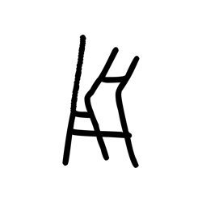

- source_zip_member: `Sub-character Images/353gxm6hd4/353gxm6hd4/amdwpam1so.png`
- checksum_sha256: `89da91d9ba264fd84a919cb18eb55c48f70f990080f4544972eef0c02c4d41d6`
- review_status: `needs_human_visual_review`
- caution: OBIMD subcharacter image is a source-marked review asset only; it is not a confirmed component form, component assignment, or decipherment conclusion.

## asset-016301

- source_zip_member: `Sub-character Images/353gxm6hd4/353gxm6hd4/baetc87v8q.png`
- checksum_sha256: `054f3acd1fe993cdeab5fc2aa4a4da2be26d15fde3e609a13dad8d0142776276`
- review_status: `needs_human_visual_review`
- caution: OBIMD subcharacter image is a source-marked review asset only; it is not a confirmed component form, component assignment, or decipherment conclusion.

## asset-016302

- source_zip_member: `Sub-character Images/353gxm6hd4/353gxm6hd4/baxajkp0xr.png`
- checksum_sha256: `ad8b697a87f5a3d8ea07a9ee6dce91d25e66018152277f714d2473b22d78cb6d`
- review_status: `needs_human_visual_review`
- caution: OBIMD subcharacter image is a source-marked review asset only; it is not a confirmed component form, component assignment, or decipherment conclusion.

## asset-016303

- source_zip_member: `Sub-character Images/353gxm6hd4/353gxm6hd4/bcczltd58w.png`
- checksum_sha256: `594c358384060b625ec478df35c184d7b23ae9bb58e8c784a148e90d09ee06e2`
- review_status: `needs_human_visual_review`
- caution: OBIMD subcharacter image is a source-marked review asset only; it is not a confirmed component form, component assignment, or decipherment conclusion.

## asset-016304

- source_zip_member: `Sub-character Images/353gxm6hd4/353gxm6hd4/bu3stfkbjh.png`
- checksum_sha256: `1f6bd791c8f6461d6f3d1260189eee95ba9d86c800927861d720d135fc4b0582`
- review_status: `needs_human_visual_review`
- caution: OBIMD subcharacter image is a source-marked review asset only; it is not a confirmed component form, component assignment, or decipherment conclusion.

## asset-016305

- source_zip_member: `Sub-character Images/353gxm6hd4/353gxm6hd4/c0zki74vmw.png`
- checksum_sha256: `aa3f0c82225ae087a54afc782eabba53f9c9c3414b8504ca1acd24de3d0e60c8`
- review_status: `needs_human_visual_review`
- caution: OBIMD subcharacter image is a source-marked review asset only; it is not a confirmed component form, component assignment, or decipherment conclusion.

## asset-016306

- source_zip_member: `Sub-character Images/353gxm6hd4/353gxm6hd4/ccr1m0uv4d.png`
- checksum_sha256: `93caf89ab2b50eff2c609b5614accfdbf6314bd6c9e1fabf15db92c25d6f1582`
- review_status: `needs_human_visual_review`
- caution: OBIMD subcharacter image is a source-marked review asset only; it is not a confirmed component form, component assignment, or decipherment conclusion.

## asset-016307

- source_zip_member: `Sub-character Images/353gxm6hd4/353gxm6hd4/cel214t4op.png`
- checksum_sha256: `8710d77bf0b6125ce6761300ed20e338494295c5a86882239919743dfbc146f4`
- review_status: `needs_human_visual_review`
- caution: OBIMD subcharacter image is a source-marked review asset only; it is not a confirmed component form, component assignment, or decipherment conclusion.

## asset-016308

- source_zip_member: `Sub-character Images/353gxm6hd4/353gxm6hd4/cmsau8ygbv.png`
- checksum_sha256: `5469f67cc039b9c3d9897b64005b82550809f23f555a4b447c64bb6f9a0297a0`
- review_status: `needs_human_visual_review`
- caution: OBIMD subcharacter image is a source-marked review asset only; it is not a confirmed component form, component assignment, or decipherment conclusion.

## asset-016309

- source_zip_member: `Sub-character Images/353gxm6hd4/353gxm6hd4/cnvao5acnm.png`
- checksum_sha256: `e15bf1e37ce666ad4f8558a36a2d886ab4bf6863815444789fec5af30f818d16`
- review_status: `needs_human_visual_review`
- caution: OBIMD subcharacter image is a source-marked review asset only; it is not a confirmed component form, component assignment, or decipherment conclusion.

## asset-016310

- source_zip_member: `Sub-character Images/353gxm6hd4/353gxm6hd4/cq80p0gd6k.png`
- checksum_sha256: `0bc42f3b339dbf2069c259ad15b490c6ccbf12d9a0aaa124556b66afd121de90`
- review_status: `needs_human_visual_review`
- caution: OBIMD subcharacter image is a source-marked review asset only; it is not a confirmed component form, component assignment, or decipherment conclusion.

## asset-016311

- source_zip_member: `Sub-character Images/353gxm6hd4/353gxm6hd4/dda4xx28ir.png`
- checksum_sha256: `aa245f5f04b6e8e0934f0e439ee3b97ed2d03d608daa9db0caef7c3268c7d230`
- review_status: `needs_human_visual_review`
- caution: OBIMD subcharacter image is a source-marked review asset only; it is not a confirmed component form, component assignment, or decipherment conclusion.

## asset-016312

- source_zip_member: `Sub-character Images/353gxm6hd4/353gxm6hd4/drdd0h3et3.png`
- checksum_sha256: `c1134c12055f6f9258f953fbbf8736a4c05e7d0bb7ee615ba56a50dac3a1938b`
- review_status: `needs_human_visual_review`
- caution: OBIMD subcharacter image is a source-marked review asset only; it is not a confirmed component form, component assignment, or decipherment conclusion.

## asset-016313

- source_zip_member: `Sub-character Images/353gxm6hd4/353gxm6hd4/dwz1on1bdq.png`
- checksum_sha256: `fa39c790a6b098c639affaf547b5baebcfcf66c9b6ff6b6865695a36251c7a75`
- review_status: `needs_human_visual_review`
- caution: OBIMD subcharacter image is a source-marked review asset only; it is not a confirmed component form, component assignment, or decipherment conclusion.

## asset-016314

- source_zip_member: `Sub-character Images/353gxm6hd4/353gxm6hd4/e13li1j59o.png`
- checksum_sha256: `11e586e3a8a0ce40c4035f4794673be51a57c290770b8b0486c567af5d6a016b`
- review_status: `needs_human_visual_review`
- caution: OBIMD subcharacter image is a source-marked review asset only; it is not a confirmed component form, component assignment, or decipherment conclusion.

## asset-016315

- source_zip_member: `Sub-character Images/353gxm6hd4/353gxm6hd4/e8pzg4dhhs.png`
- checksum_sha256: `ddfee42e629858b2e17947bd6e8f3311466cdab70121c1d622da4960721a276d`
- review_status: `needs_human_visual_review`
- caution: OBIMD subcharacter image is a source-marked review asset only; it is not a confirmed component form, component assignment, or decipherment conclusion.

## asset-016316

- source_zip_member: `Sub-character Images/353gxm6hd4/353gxm6hd4/ea6829pkoe.png`
- checksum_sha256: `423833f66a097d23fd210a3255f7adc86fb0068ca8484d6b5615aafd8958ddc7`
- review_status: `needs_human_visual_review`
- caution: OBIMD subcharacter image is a source-marked review asset only; it is not a confirmed component form, component assignment, or decipherment conclusion.

## asset-016317

- source_zip_member: `Sub-character Images/353gxm6hd4/353gxm6hd4/efmiir7d6a.png`
- checksum_sha256: `683a6427a55cd04175b75e15941f32de331998fcac76fba4fccfa5601d3c4f8d`
- review_status: `needs_human_visual_review`
- caution: OBIMD subcharacter image is a source-marked review asset only; it is not a confirmed component form, component assignment, or decipherment conclusion.

## asset-016318

- source_zip_member: `Sub-character Images/353gxm6hd4/353gxm6hd4/eljmf5tnyf.png`
- checksum_sha256: `767019c47d57b34604023a07d4acf7af6989ade539e606af732e1707ec4a2362`
- review_status: `needs_human_visual_review`
- caution: OBIMD subcharacter image is a source-marked review asset only; it is not a confirmed component form, component assignment, or decipherment conclusion.

## asset-016319

- source_zip_member: `Sub-character Images/353gxm6hd4/353gxm6hd4/ezvaxevb4n.png`
- checksum_sha256: `9ffd1badfbd7c70dab505ff492981b3740a25b2644e87c8f43187e51e7a8ed69`
- review_status: `needs_human_visual_review`
- caution: OBIMD subcharacter image is a source-marked review asset only; it is not a confirmed component form, component assignment, or decipherment conclusion.

## asset-016320

- source_zip_member: `Sub-character Images/353gxm6hd4/353gxm6hd4/f165xtgexj.png`
- checksum_sha256: `949858869610ccefeac9ef5ec8fd2c0073632905c3b8d0ac4f0d661e6317eabc`
- review_status: `needs_human_visual_review`
- caution: OBIMD subcharacter image is a source-marked review asset only; it is not a confirmed component form, component assignment, or decipherment conclusion.

## asset-016321

- source_zip_member: `Sub-character Images/353gxm6hd4/353gxm6hd4/fe1e4t7hu8.png`
- checksum_sha256: `fc20302cf074f60ba005792fd20dae8d7952f5243d0a26d0d4a209298b30041f`
- review_status: `needs_human_visual_review`
- caution: OBIMD subcharacter image is a source-marked review asset only; it is not a confirmed component form, component assignment, or decipherment conclusion.

## asset-016322

- source_zip_member: `Sub-character Images/353gxm6hd4/353gxm6hd4/fegeyru3h2.png`
- checksum_sha256: `e7141b85afe74ad739b88f6711c44a0d91421d011b314119f87548928cdc7d64`
- review_status: `needs_human_visual_review`
- caution: OBIMD subcharacter image is a source-marked review asset only; it is not a confirmed component form, component assignment, or decipherment conclusion.

## asset-016323

- source_zip_member: `Sub-character Images/353gxm6hd4/353gxm6hd4/fq0segcat3.png`
- checksum_sha256: `97d7e3f4c53d758357fe40f356b71a68be216c4cd9e8cefe4a3d85afbe34794e`
- review_status: `needs_human_visual_review`
- caution: OBIMD subcharacter image is a source-marked review asset only; it is not a confirmed component form, component assignment, or decipherment conclusion.

## asset-016324

- source_zip_member: `Sub-character Images/353gxm6hd4/353gxm6hd4/fu5htxpxe3.png`
- checksum_sha256: `2f79f936569ad550ee6e833dc049a303f82d38992a17c893ff32598a66c8ac2e`
- review_status: `needs_human_visual_review`
- caution: OBIMD subcharacter image is a source-marked review asset only; it is not a confirmed component form, component assignment, or decipherment conclusion.

## asset-016325

- source_zip_member: `Sub-character Images/353gxm6hd4/353gxm6hd4/fvi01gizmd.png`
- checksum_sha256: `6dd832299113c6c53eb1e922f27073e157727bc8260014f76ce0c4c210db4213`
- review_status: `needs_human_visual_review`
- caution: OBIMD subcharacter image is a source-marked review asset only; it is not a confirmed component form, component assignment, or decipherment conclusion.

## asset-016326

- source_zip_member: `Sub-character Images/353gxm6hd4/353gxm6hd4/fvnsjbr1gr.png`
- checksum_sha256: `be7327ddf85b2e09a79ab5b3bfd83c87ec30de3cc2f31e4975b3de4db4fb106d`
- review_status: `needs_human_visual_review`
- caution: OBIMD subcharacter image is a source-marked review asset only; it is not a confirmed component form, component assignment, or decipherment conclusion.

## asset-016327

- source_zip_member: `Sub-character Images/353gxm6hd4/353gxm6hd4/fz0irnqs8u.png`
- checksum_sha256: `0e14827bc5e191e2bbb6c13f999c3f56e918cf7dc96fdd589b4e70ce5bc23fa1`
- review_status: `needs_human_visual_review`
- caution: OBIMD subcharacter image is a source-marked review asset only; it is not a confirmed component form, component assignment, or decipherment conclusion.

## asset-016328

- source_zip_member: `Sub-character Images/353gxm6hd4/353gxm6hd4/g0wuonitoa.png`
- checksum_sha256: `adbba27302bd89810b078e883f2d6863077dcba1ce858023ac7692bc33f2abfe`
- review_status: `needs_human_visual_review`
- caution: OBIMD subcharacter image is a source-marked review asset only; it is not a confirmed component form, component assignment, or decipherment conclusion.

## asset-016329

- source_zip_member: `Sub-character Images/353gxm6hd4/353gxm6hd4/gar5bq304v.png`
- checksum_sha256: `0f190607fa0b1559430672d671e3eeb901fd49d9c7afcf2dcb7cb846d9f4335b`
- review_status: `needs_human_visual_review`
- caution: OBIMD subcharacter image is a source-marked review asset only; it is not a confirmed component form, component assignment, or decipherment conclusion.

## asset-016330

- source_zip_member: `Sub-character Images/353gxm6hd4/353gxm6hd4/gesxt2d7ci.png`
- checksum_sha256: `f3eb11b3e879687f05e42159d9f8e36568cefcb5a08988a30d6882dcad8b069c`
- review_status: `needs_human_visual_review`
- caution: OBIMD subcharacter image is a source-marked review asset only; it is not a confirmed component form, component assignment, or decipherment conclusion.

## asset-016331

- source_zip_member: `Sub-character Images/353gxm6hd4/353gxm6hd4/gh5w5lri9q.png`
- checksum_sha256: `8cf51bfd896147e03a69beccf23ad8625074c4297d91b32f1a37ac7cb743c645`
- review_status: `needs_human_visual_review`
- caution: OBIMD subcharacter image is a source-marked review asset only; it is not a confirmed component form, component assignment, or decipherment conclusion.

## asset-016332

- source_zip_member: `Sub-character Images/353gxm6hd4/353gxm6hd4/go32nl39nh.png`
- checksum_sha256: `4d6c3c6fb771b1ef300810680116336271f035482d4092ccd0061df2bcf0f77f`
- review_status: `needs_human_visual_review`
- caution: OBIMD subcharacter image is a source-marked review asset only; it is not a confirmed component form, component assignment, or decipherment conclusion.

## asset-016333

- source_zip_member: `Sub-character Images/353gxm6hd4/353gxm6hd4/h0r82rg87e.png`
- checksum_sha256: `611d658a66d53412b99d2868f13f5bc81168296ce8c153b148fd18ed15cc79ff`
- review_status: `needs_human_visual_review`
- caution: OBIMD subcharacter image is a source-marked review asset only; it is not a confirmed component form, component assignment, or decipherment conclusion.

## asset-016334

- source_zip_member: `Sub-character Images/353gxm6hd4/353gxm6hd4/h3ke84t68s.png`
- checksum_sha256: `319ca98d36e744f4a1dd4342180d1a11a32dce94e132e88c5030d79672990471`
- review_status: `needs_human_visual_review`
- caution: OBIMD subcharacter image is a source-marked review asset only; it is not a confirmed component form, component assignment, or decipherment conclusion.

## asset-016335

- source_zip_member: `Sub-character Images/353gxm6hd4/353gxm6hd4/h9vy1dilab.png`
- checksum_sha256: `e60e49bf3b82f04f9f879cbfa17d73f2c93b11748442b7f7226c89b4e0a6f8a2`
- review_status: `needs_human_visual_review`
- caution: OBIMD subcharacter image is a source-marked review asset only; it is not a confirmed component form, component assignment, or decipherment conclusion.

## asset-016336

- source_zip_member: `Sub-character Images/353gxm6hd4/353gxm6hd4/hit7nwowr1.png`
- checksum_sha256: `91a3a0b8fa1292a2759f76802c3b7c48e1236761a4883782d0d3cb236de8333b`
- review_status: `needs_human_visual_review`
- caution: OBIMD subcharacter image is a source-marked review asset only; it is not a confirmed component form, component assignment, or decipherment conclusion.

## asset-016337

- source_zip_member: `Sub-character Images/353gxm6hd4/353gxm6hd4/hpt364s382.png`
- checksum_sha256: `cb8acf5e4c45200f055ea7aea01e9676dbe2f41c81f225672107e3f16d59d2cd`
- review_status: `needs_human_visual_review`
- caution: OBIMD subcharacter image is a source-marked review asset only; it is not a confirmed component form, component assignment, or decipherment conclusion.

## asset-016338

- source_zip_member: `Sub-character Images/353gxm6hd4/353gxm6hd4/hu1su5rxkt.png`
- checksum_sha256: `dca95e1204a6db5a864be40debb60a736ac87d08e0209635f082c855eec3b325`
- review_status: `needs_human_visual_review`
- caution: OBIMD subcharacter image is a source-marked review asset only; it is not a confirmed component form, component assignment, or decipherment conclusion.

## asset-016339

- source_zip_member: `Sub-character Images/353gxm6hd4/353gxm6hd4/ibqjhlfiva.png`
- checksum_sha256: `f83a9c154af0d1eb883ecca0f089d6ede5586f9d083add1bb8d0cdc5bca0179a`
- review_status: `needs_human_visual_review`
- caution: OBIMD subcharacter image is a source-marked review asset only; it is not a confirmed component form, component assignment, or decipherment conclusion.

## asset-016340

- source_zip_member: `Sub-character Images/353gxm6hd4/353gxm6hd4/ihd3wa09j6.png`
- checksum_sha256: `44b25f52b719256fea177f3d6c1eae6aff58702bbc8da8f289974cff91dd86cc`
- review_status: `needs_human_visual_review`
- caution: OBIMD subcharacter image is a source-marked review asset only; it is not a confirmed component form, component assignment, or decipherment conclusion.

## asset-016341

- source_zip_member: `Sub-character Images/353gxm6hd4/353gxm6hd4/ii5hu0snzg.png`
- checksum_sha256: `6354b2152c882c566d621b346f244bbd0e7921e9b860d631cabba1a760b8a1e1`
- review_status: `needs_human_visual_review`
- caution: OBIMD subcharacter image is a source-marked review asset only; it is not a confirmed component form, component assignment, or decipherment conclusion.

## asset-016342

- source_zip_member: `Sub-character Images/353gxm6hd4/353gxm6hd4/ilnsudgme7.png`
- checksum_sha256: `1416038db7e118a8e6d593017b84f31491edef435364cd1075bee57f03cc583d`
- review_status: `needs_human_visual_review`
- caution: OBIMD subcharacter image is a source-marked review asset only; it is not a confirmed component form, component assignment, or decipherment conclusion.

## asset-016343

- source_zip_member: `Sub-character Images/353gxm6hd4/353gxm6hd4/iw395fvtnt.png`
- checksum_sha256: `5b2bda560ad1fcf254575331531299374ef469c7bb75aa90b2b9f884f3349581`
- review_status: `needs_human_visual_review`
- caution: OBIMD subcharacter image is a source-marked review asset only; it is not a confirmed component form, component assignment, or decipherment conclusion.

## asset-016344

- source_zip_member: `Sub-character Images/353gxm6hd4/353gxm6hd4/j61m0j3inz.png`
- checksum_sha256: `f37fd2cd82b7d310192639d296a5488a26915c47b1d075e6bd4d8b06395b93d7`
- review_status: `needs_human_visual_review`
- caution: OBIMD subcharacter image is a source-marked review asset only; it is not a confirmed component form, component assignment, or decipherment conclusion.

## asset-016345

- source_zip_member: `Sub-character Images/353gxm6hd4/353gxm6hd4/jcq4c6vc4z.png`
- checksum_sha256: `5b7cd6f480435eb0a8c014ab4fd74a0fef8dfead9228e58806a11568cad277b0`
- review_status: `needs_human_visual_review`
- caution: OBIMD subcharacter image is a source-marked review asset only; it is not a confirmed component form, component assignment, or decipherment conclusion.

## asset-016346

- source_zip_member: `Sub-character Images/353gxm6hd4/353gxm6hd4/jlmg27wc8p.png`
- checksum_sha256: `d32c2c8da61a2ec24e48362a7fbf7c04932d6050eee0dbe21309930187b7d5ab`
- review_status: `needs_human_visual_review`
- caution: OBIMD subcharacter image is a source-marked review asset only; it is not a confirmed component form, component assignment, or decipherment conclusion.

## asset-016347

- source_zip_member: `Sub-character Images/353gxm6hd4/353gxm6hd4/jol2xmocg4.png`
- checksum_sha256: `b00e3d4b7b86bd0736c28e93b8743d7b3530f8a93dcc97c1bab0333b2a89090f`
- review_status: `needs_human_visual_review`
- caution: OBIMD subcharacter image is a source-marked review asset only; it is not a confirmed component form, component assignment, or decipherment conclusion.

## asset-016348

- source_zip_member: `Sub-character Images/353gxm6hd4/353gxm6hd4/js277x6usk.png`
- checksum_sha256: `a8498c934090fdb1a2fabf7ea7327b15c686002394a0b1f420f4cd80a92d5ef9`
- review_status: `needs_human_visual_review`
- caution: OBIMD subcharacter image is a source-marked review asset only; it is not a confirmed component form, component assignment, or decipherment conclusion.

## asset-016349

- source_zip_member: `Sub-character Images/353gxm6hd4/353gxm6hd4/jt9pk9ey0q.png`
- checksum_sha256: `fd7d0b06fdbd1f9c223482a6c4310293444e912e5b2f0879f14a0dd02bd91222`
- review_status: `needs_human_visual_review`
- caution: OBIMD subcharacter image is a source-marked review asset only; it is not a confirmed component form, component assignment, or decipherment conclusion.

## asset-016350

- source_zip_member: `Sub-character Images/353gxm6hd4/353gxm6hd4/jxpl2hyzu6.png`
- checksum_sha256: `861584b4cda5f4fc2c9b714a41e180edaf69465c8492d46bed17169b5d8e74f6`
- review_status: `needs_human_visual_review`
- caution: OBIMD subcharacter image is a source-marked review asset only; it is not a confirmed component form, component assignment, or decipherment conclusion.

## asset-016351

- source_zip_member: `Sub-character Images/353gxm6hd4/353gxm6hd4/jyw3u44ypj.png`
- checksum_sha256: `d2d4c5d855901037679f622c6995dd42099dd8987025843359491b43ebb25840`
- review_status: `needs_human_visual_review`
- caution: OBIMD subcharacter image is a source-marked review asset only; it is not a confirmed component form, component assignment, or decipherment conclusion.

## asset-016352

- source_zip_member: `Sub-character Images/353gxm6hd4/353gxm6hd4/k2ztqj8pc3.png`
- checksum_sha256: `f445d13f25169e8bf1bbcfa8dd4d44e70486110d76389bb5049526ae6eb4c639`
- review_status: `needs_human_visual_review`
- caution: OBIMD subcharacter image is a source-marked review asset only; it is not a confirmed component form, component assignment, or decipherment conclusion.

## asset-016353

- source_zip_member: `Sub-character Images/353gxm6hd4/353gxm6hd4/kcbw61fxar.png`
- checksum_sha256: `dbcfe3d838c7807f64f923f5f5b15e08c4f1bc347d8b3d3b29f75c3d2f4585bd`
- review_status: `needs_human_visual_review`
- caution: OBIMD subcharacter image is a source-marked review asset only; it is not a confirmed component form, component assignment, or decipherment conclusion.

## asset-016354

- source_zip_member: `Sub-character Images/353gxm6hd4/353gxm6hd4/klw2txwtlg.png`
- checksum_sha256: `03023e40b3200692f3b7a79ab2b93cd12df65d94a272f83f20eb0abcd1880b55`
- review_status: `needs_human_visual_review`
- caution: OBIMD subcharacter image is a source-marked review asset only; it is not a confirmed component form, component assignment, or decipherment conclusion.

## asset-016355

- source_zip_member: `Sub-character Images/353gxm6hd4/353gxm6hd4/l01r0ekdx5.png`
- checksum_sha256: `c525975035242cab4cf46b28cb8bb7bd1d2496b7190257ad55634d3d9e6c7e94`
- review_status: `needs_human_visual_review`
- caution: OBIMD subcharacter image is a source-marked review asset only; it is not a confirmed component form, component assignment, or decipherment conclusion.

## asset-016356

- source_zip_member: `Sub-character Images/353gxm6hd4/353gxm6hd4/l81pcc5uy3.png`
- checksum_sha256: `61f68e04da5627f1fecb713dbdb341b5399ebc692838ce6665e2ac4e5b6e394e`
- review_status: `needs_human_visual_review`
- caution: OBIMD subcharacter image is a source-marked review asset only; it is not a confirmed component form, component assignment, or decipherment conclusion.

## asset-016357

- source_zip_member: `Sub-character Images/353gxm6hd4/353gxm6hd4/lk3ij941l7.png`
- checksum_sha256: `66fdbe98e7ec02ae0dbd0e1b881b24f48cd27db2564d0403ef183e4a0de376a4`
- review_status: `needs_human_visual_review`
- caution: OBIMD subcharacter image is a source-marked review asset only; it is not a confirmed component form, component assignment, or decipherment conclusion.

## asset-016358

- source_zip_member: `Sub-character Images/353gxm6hd4/353gxm6hd4/ln82pzxwe9.png`
- checksum_sha256: `5e4db91abf197f11c0e6ecaa1aed893598ea84261f12504989dbcd7ac7769026`
- review_status: `needs_human_visual_review`
- caution: OBIMD subcharacter image is a source-marked review asset only; it is not a confirmed component form, component assignment, or decipherment conclusion.

## asset-016359

- source_zip_member: `Sub-character Images/353gxm6hd4/353gxm6hd4/luvbp9wjhv.png`
- checksum_sha256: `cb303573bfe98ddcaef911fd7cd1bbe8daa08d1178b75fd40b2609c30bea54b7`
- review_status: `needs_human_visual_review`
- caution: OBIMD subcharacter image is a source-marked review asset only; it is not a confirmed component form, component assignment, or decipherment conclusion.

## asset-016360

- source_zip_member: `Sub-character Images/353gxm6hd4/353gxm6hd4/lvey6ocikk.png`
- checksum_sha256: `166539e16f27a37994b8d1cb70c244b9e06be5300295bfd93023434fb5c94063`
- review_status: `needs_human_visual_review`
- caution: OBIMD subcharacter image is a source-marked review asset only; it is not a confirmed component form, component assignment, or decipherment conclusion.

## asset-016361

- source_zip_member: `Sub-character Images/353gxm6hd4/353gxm6hd4/ma7tykdwa8.png`
- checksum_sha256: `fca885753c27c583d7b3a30985e1bb7dc65661e773cc0bb708a5bb0a6ee68477`
- review_status: `needs_human_visual_review`
- caution: OBIMD subcharacter image is a source-marked review asset only; it is not a confirmed component form, component assignment, or decipherment conclusion.

## asset-016362

- source_zip_member: `Sub-character Images/353gxm6hd4/353gxm6hd4/mcdnj8f8cs.png`
- checksum_sha256: `522f81d2533160c9f196b1b86c8c49859239dae84864711e6eb06035f1e0e452`
- review_status: `needs_human_visual_review`
- caution: OBIMD subcharacter image is a source-marked review asset only; it is not a confirmed component form, component assignment, or decipherment conclusion.

## asset-016363

- source_zip_member: `Sub-character Images/353gxm6hd4/353gxm6hd4/mg806h6137.png`
- checksum_sha256: `f59a86184fa6f035de33fdbfa5da789f45b1dcdbef42590f789c3c24278d1452`
- review_status: `needs_human_visual_review`
- caution: OBIMD subcharacter image is a source-marked review asset only; it is not a confirmed component form, component assignment, or decipherment conclusion.

## asset-016364

- source_zip_member: `Sub-character Images/353gxm6hd4/353gxm6hd4/n46atzkjoh.png`
- checksum_sha256: `d47ce047c412021e5be48cf490e9beb83b8e7c2bc8bd391584d0b75c8c8921fa`
- review_status: `needs_human_visual_review`
- caution: OBIMD subcharacter image is a source-marked review asset only; it is not a confirmed component form, component assignment, or decipherment conclusion.

## asset-016365

- source_zip_member: `Sub-character Images/353gxm6hd4/353gxm6hd4/ne3r1qn4nk.png`
- checksum_sha256: `cee97029093554aaf18d831179a7c2a2c936dcb535797c7d5cd759c19cae80c7`
- review_status: `needs_human_visual_review`
- caution: OBIMD subcharacter image is a source-marked review asset only; it is not a confirmed component form, component assignment, or decipherment conclusion.

## asset-016366

- source_zip_member: `Sub-character Images/353gxm6hd4/353gxm6hd4/nibpwkqs6a.png`
- checksum_sha256: `2f6ee2776872fa95366472bb40c9842a2ef772f8ea4ae4328e0bc4c8b96b43e6`
- review_status: `needs_human_visual_review`
- caution: OBIMD subcharacter image is a source-marked review asset only; it is not a confirmed component form, component assignment, or decipherment conclusion.

## asset-016367

- source_zip_member: `Sub-character Images/353gxm6hd4/353gxm6hd4/nmo6cywty9.png`
- checksum_sha256: `c1886697f3fead7d69a52d1ed30db3ac08751394960316f9806bddb6442657c0`
- review_status: `needs_human_visual_review`
- caution: OBIMD subcharacter image is a source-marked review asset only; it is not a confirmed component form, component assignment, or decipherment conclusion.

## asset-016368

- source_zip_member: `Sub-character Images/353gxm6hd4/353gxm6hd4/nr63epgutk.png`
- checksum_sha256: `b29eda79a69cb9bc98b043014b3722d6f912d5f5e5c50dde1539d1337cf14872`
- review_status: `needs_human_visual_review`
- caution: OBIMD subcharacter image is a source-marked review asset only; it is not a confirmed component form, component assignment, or decipherment conclusion.

## asset-016369

- source_zip_member: `Sub-character Images/353gxm6hd4/353gxm6hd4/nsockx0igu.png`
- checksum_sha256: `86a7a55bfa4dca187f42039c7a826b693ec4a40a910a94d42d21436d22504cb2`
- review_status: `needs_human_visual_review`
- caution: OBIMD subcharacter image is a source-marked review asset only; it is not a confirmed component form, component assignment, or decipherment conclusion.

## asset-016370

- source_zip_member: `Sub-character Images/353gxm6hd4/353gxm6hd4/ntfrbq4q51.png`
- checksum_sha256: `f5cc466cd6c1ebbf7009e675b39ddf936d322e361518061e829e4597f02dfe62`
- review_status: `needs_human_visual_review`
- caution: OBIMD subcharacter image is a source-marked review asset only; it is not a confirmed component form, component assignment, or decipherment conclusion.

## asset-016371

- source_zip_member: `Sub-character Images/353gxm6hd4/353gxm6hd4/nvbx0hyukr.png`
- checksum_sha256: `6709d3253a97ac5113ef9cc4b08f41da1dcfd962cfac53d0584acc5c2cd13041`
- review_status: `needs_human_visual_review`
- caution: OBIMD subcharacter image is a source-marked review asset only; it is not a confirmed component form, component assignment, or decipherment conclusion.

## asset-016372

- source_zip_member: `Sub-character Images/353gxm6hd4/353gxm6hd4/ocb7pf7gd6.png`
- checksum_sha256: `3eeda00e366a2da3641a022a226b623d741ed1c8390ef491437e2be37523d627`
- review_status: `needs_human_visual_review`
- caution: OBIMD subcharacter image is a source-marked review asset only; it is not a confirmed component form, component assignment, or decipherment conclusion.

## asset-016373

- source_zip_member: `Sub-character Images/353gxm6hd4/353gxm6hd4/odugs1loiw.png`
- checksum_sha256: `3cc7a848a13183ef9cb8eb1ff1b7e3859f323a1a02878efe657c9511ce1e973b`
- review_status: `needs_human_visual_review`
- caution: OBIMD subcharacter image is a source-marked review asset only; it is not a confirmed component form, component assignment, or decipherment conclusion.

## asset-016374

- source_zip_member: `Sub-character Images/353gxm6hd4/353gxm6hd4/p5diks4i4i.png`
- checksum_sha256: `31f7153b0635bba43d6f1c7c9ee4017ba49ae85793310ece92c8cc67907c1b71`
- review_status: `needs_human_visual_review`
- caution: OBIMD subcharacter image is a source-marked review asset only; it is not a confirmed component form, component assignment, or decipherment conclusion.

## asset-016375

- source_zip_member: `Sub-character Images/353gxm6hd4/353gxm6hd4/p7taw7pa4h.png`
- checksum_sha256: `b76bd742f8115ba40621f56df9b9efb26b59e8e480aed5cacaa41df11dca0a2a`
- review_status: `needs_human_visual_review`
- caution: OBIMD subcharacter image is a source-marked review asset only; it is not a confirmed component form, component assignment, or decipherment conclusion.

## asset-016376

- source_zip_member: `Sub-character Images/353gxm6hd4/353gxm6hd4/pghwhy3wop.png`
- checksum_sha256: `881c779aca8ad393bd7d4c9356cab02a4d4424acd08dc7450f512b265539c01d`
- review_status: `needs_human_visual_review`
- caution: OBIMD subcharacter image is a source-marked review asset only; it is not a confirmed component form, component assignment, or decipherment conclusion.

## asset-016377

- source_zip_member: `Sub-character Images/353gxm6hd4/353gxm6hd4/phgwv6bl4y.png`
- checksum_sha256: `d1d8a385a87005b080f4f5a91b4d6eea9f2988d3e2124f1df9c3ca2539742697`
- review_status: `needs_human_visual_review`
- caution: OBIMD subcharacter image is a source-marked review asset only; it is not a confirmed component form, component assignment, or decipherment conclusion.

## asset-016378

- source_zip_member: `Sub-character Images/353gxm6hd4/353gxm6hd4/pomjihnkq8.png`
- checksum_sha256: `02b2083a8127e86878a2230d170461f2fbe569a43e96ee1d94f71d115955e8a7`
- review_status: `needs_human_visual_review`
- caution: OBIMD subcharacter image is a source-marked review asset only; it is not a confirmed component form, component assignment, or decipherment conclusion.

## asset-016379

- source_zip_member: `Sub-character Images/353gxm6hd4/353gxm6hd4/psb137ni6f.png`
- checksum_sha256: `800a474cd58752ce130e71407bb2e25f02909a339676349cb3c21c17dcacd7c1`
- review_status: `needs_human_visual_review`
- caution: OBIMD subcharacter image is a source-marked review asset only; it is not a confirmed component form, component assignment, or decipherment conclusion.

## asset-016380

- source_zip_member: `Sub-character Images/353gxm6hd4/353gxm6hd4/q2b63mqlk4.png`
- checksum_sha256: `584add12ece9cfb6853bc3b3d5154905f99e571ac266d75774d6161745f8b5e3`
- review_status: `needs_human_visual_review`
- caution: OBIMD subcharacter image is a source-marked review asset only; it is not a confirmed component form, component assignment, or decipherment conclusion.

## asset-016381

- source_zip_member: `Sub-character Images/353gxm6hd4/353gxm6hd4/q7okq24r7r.png`
- checksum_sha256: `4067b92306ad8aabbeac7e250b38241a3f10d1d0c1ca6f7253daf22ccd9dc683`
- review_status: `needs_human_visual_review`
- caution: OBIMD subcharacter image is a source-marked review asset only; it is not a confirmed component form, component assignment, or decipherment conclusion.

## asset-016382

- source_zip_member: `Sub-character Images/353gxm6hd4/353gxm6hd4/qcitiw4deh.png`
- checksum_sha256: `561d2bc614e8ddf46d8ff4b94bf540880dc2b30789745245848d4de308b514d5`
- review_status: `needs_human_visual_review`
- caution: OBIMD subcharacter image is a source-marked review asset only; it is not a confirmed component form, component assignment, or decipherment conclusion.

## asset-016383

- source_zip_member: `Sub-character Images/353gxm6hd4/353gxm6hd4/qdi952s313.png`
- checksum_sha256: `db1c3156d8a8c569cf6434e2333bcfcc08242f87832b0436fecb9cf5343480fa`
- review_status: `needs_human_visual_review`
- caution: OBIMD subcharacter image is a source-marked review asset only; it is not a confirmed component form, component assignment, or decipherment conclusion.

## asset-016384

- source_zip_member: `Sub-character Images/353gxm6hd4/353gxm6hd4/qkw0bw6e8i.png`
- checksum_sha256: `6aa15f860a0f8aae51a86321d149297d6aa8188579a2380e4078cd866c5765c3`
- review_status: `needs_human_visual_review`
- caution: OBIMD subcharacter image is a source-marked review asset only; it is not a confirmed component form, component assignment, or decipherment conclusion.

## asset-016385

- source_zip_member: `Sub-character Images/353gxm6hd4/353gxm6hd4/qoy6118oxe.png`
- checksum_sha256: `a7af4aa697a8f7631b8c7d26ec6a42f4bdacbfec356428015906f9afdfc02430`
- review_status: `needs_human_visual_review`
- caution: OBIMD subcharacter image is a source-marked review asset only; it is not a confirmed component form, component assignment, or decipherment conclusion.

## asset-016386

- source_zip_member: `Sub-character Images/353gxm6hd4/353gxm6hd4/qu37v6ir6h.png`
- checksum_sha256: `fd54b6c473bd6585ad6c2f05e513cf2021940b6dd1cc41b447db523cb3995dab`
- review_status: `needs_human_visual_review`
- caution: OBIMD subcharacter image is a source-marked review asset only; it is not a confirmed component form, component assignment, or decipherment conclusion.

## asset-016387

- source_zip_member: `Sub-character Images/353gxm6hd4/353gxm6hd4/qwluezvgag.png`
- checksum_sha256: `54efc13955be814a776545342bcd7782c2b5a25cb362ea44b485fb675ab9f0f1`
- review_status: `needs_human_visual_review`
- caution: OBIMD subcharacter image is a source-marked review asset only; it is not a confirmed component form, component assignment, or decipherment conclusion.

## asset-016388

- source_zip_member: `Sub-character Images/353gxm6hd4/353gxm6hd4/r0lkbs0v1n.png`
- checksum_sha256: `4d12223da8c0765378be3d8d423c9a3dbcf3a351c1d33f39388c0cfde8ee99d7`
- review_status: `needs_human_visual_review`
- caution: OBIMD subcharacter image is a source-marked review asset only; it is not a confirmed component form, component assignment, or decipherment conclusion.

## asset-016389

- source_zip_member: `Sub-character Images/353gxm6hd4/353gxm6hd4/r33h4ki8wi.png`
- checksum_sha256: `37367271840c6872b04528fb3c9be04ff62f2807ea8b235a4f102fda52d4e943`
- review_status: `needs_human_visual_review`
- caution: OBIMD subcharacter image is a source-marked review asset only; it is not a confirmed component form, component assignment, or decipherment conclusion.

## asset-016390

- source_zip_member: `Sub-character Images/353gxm6hd4/353gxm6hd4/ro0iwm95zd.png`
- checksum_sha256: `a6e84a861c2cb8a147910e385824f874e2af6b0add3af240eac0ff6cacbaceda`
- review_status: `needs_human_visual_review`
- caution: OBIMD subcharacter image is a source-marked review asset only; it is not a confirmed component form, component assignment, or decipherment conclusion.

## asset-016391

- source_zip_member: `Sub-character Images/353gxm6hd4/353gxm6hd4/scqfdvmrku.png`
- checksum_sha256: `51b59eb5537f71b3ad0305f68b8f565635f626a41c943279b7e9281fd73cbb8b`
- review_status: `needs_human_visual_review`
- caution: OBIMD subcharacter image is a source-marked review asset only; it is not a confirmed component form, component assignment, or decipherment conclusion.

## asset-016392

- source_zip_member: `Sub-character Images/353gxm6hd4/353gxm6hd4/shf8078btg.png`
- checksum_sha256: `74e61af8738ebde361eba7d59ae292736dc73e45830e715b922ccd10d0cbb1d0`
- review_status: `needs_human_visual_review`
- caution: OBIMD subcharacter image is a source-marked review asset only; it is not a confirmed component form, component assignment, or decipherment conclusion.

## asset-016393

- source_zip_member: `Sub-character Images/353gxm6hd4/353gxm6hd4/slz1oztes2.png`
- checksum_sha256: `ed4a6c0943d33797c8cc59816b885a5acbc925d4145d09fbd6ab5f83bbb308a6`
- review_status: `needs_human_visual_review`
- caution: OBIMD subcharacter image is a source-marked review asset only; it is not a confirmed component form, component assignment, or decipherment conclusion.

## asset-016394

- source_zip_member: `Sub-character Images/353gxm6hd4/353gxm6hd4/sux994qkd4.png`
- checksum_sha256: `93841ccdfb805335630d3da523fd9ee8da3b1d98c1a6e9f996fda5b7e7c20736`
- review_status: `needs_human_visual_review`
- caution: OBIMD subcharacter image is a source-marked review asset only; it is not a confirmed component form, component assignment, or decipherment conclusion.

## asset-016395

- source_zip_member: `Sub-character Images/353gxm6hd4/353gxm6hd4/sx0un7lfkb.png`
- checksum_sha256: `bb7e83d6aec4254ee348556c4d75e96928ed1091dc604335fc1e53c92fa6b6d4`
- review_status: `needs_human_visual_review`
- caution: OBIMD subcharacter image is a source-marked review asset only; it is not a confirmed component form, component assignment, or decipherment conclusion.

## asset-016396

- source_zip_member: `Sub-character Images/353gxm6hd4/353gxm6hd4/sza708lyo0.png`
- checksum_sha256: `d84c7940832744f05d4a0534b1d9a4d298f90b74faa48db5840eb958c70bb10c`
- review_status: `needs_human_visual_review`
- caution: OBIMD subcharacter image is a source-marked review asset only; it is not a confirmed component form, component assignment, or decipherment conclusion.

## asset-016397

- source_zip_member: `Sub-character Images/353gxm6hd4/353gxm6hd4/t9sgvp0rj8.png`
- checksum_sha256: `581bf63de5bec7433c4040fded5fdd03649dbd19a085ad200f9968099c6763df`
- review_status: `needs_human_visual_review`
- caution: OBIMD subcharacter image is a source-marked review asset only; it is not a confirmed component form, component assignment, or decipherment conclusion.

## asset-016398

- source_zip_member: `Sub-character Images/353gxm6hd4/353gxm6hd4/thvfk61dkt.png`
- checksum_sha256: `7e9a1d693b63b5ffdefc4ca1732427fc7e5f52d4cee694b2f115b5e3a02485fe`
- review_status: `needs_human_visual_review`
- caution: OBIMD subcharacter image is a source-marked review asset only; it is not a confirmed component form, component assignment, or decipherment conclusion.

## asset-016399

- source_zip_member: `Sub-character Images/353gxm6hd4/353gxm6hd4/thyg2p0mzk.png`
- checksum_sha256: `391eff4520295c0593a8804c7c0b45cc94ca97115e581307dee81e771933dfa3`
- review_status: `needs_human_visual_review`
- caution: OBIMD subcharacter image is a source-marked review asset only; it is not a confirmed component form, component assignment, or decipherment conclusion.

## asset-016400

- source_zip_member: `Sub-character Images/353gxm6hd4/353gxm6hd4/tkwglgvzgj.png`
- checksum_sha256: `5e9c4ecb4a79eec9e1151e42bc53449ef7588b0fbf18ca45d4ae4e5468a4209f`
- review_status: `needs_human_visual_review`
- caution: OBIMD subcharacter image is a source-marked review asset only; it is not a confirmed component form, component assignment, or decipherment conclusion.

## asset-016401

- source_zip_member: `Sub-character Images/353gxm6hd4/353gxm6hd4/tqqmyetgjq.png`
- checksum_sha256: `374c95516fb13b227a86cbc16c155262f6998629fdf52455ef7f469712dde565`
- review_status: `needs_human_visual_review`
- caution: OBIMD subcharacter image is a source-marked review asset only; it is not a confirmed component form, component assignment, or decipherment conclusion.

## asset-016402

- source_zip_member: `Sub-character Images/353gxm6hd4/353gxm6hd4/ts6l2p732y.png`
- checksum_sha256: `f1a4a0896ab68447ccd13ccb7bfbe7b22bfc69befdf00db7284685e8221cefd7`
- review_status: `needs_human_visual_review`
- caution: OBIMD subcharacter image is a source-marked review asset only; it is not a confirmed component form, component assignment, or decipherment conclusion.

## asset-016403

- source_zip_member: `Sub-character Images/353gxm6hd4/353gxm6hd4/ttjc83r1zm.png`
- checksum_sha256: `55e3de3bc10ad9d1d54ed37cc2c059bed9cdc72bb1c6db04e8e038646ee3b6cf`
- review_status: `needs_human_visual_review`
- caution: OBIMD subcharacter image is a source-marked review asset only; it is not a confirmed component form, component assignment, or decipherment conclusion.

## asset-016404

- source_zip_member: `Sub-character Images/353gxm6hd4/353gxm6hd4/tuitme86cq.png`
- checksum_sha256: `e3b69896928419f344e8437c07528b4af36c34b9eba09aeb7b863cf8ae7e6d2d`
- review_status: `needs_human_visual_review`
- caution: OBIMD subcharacter image is a source-marked review asset only; it is not a confirmed component form, component assignment, or decipherment conclusion.

## asset-016405

- source_zip_member: `Sub-character Images/353gxm6hd4/353gxm6hd4/tzjje88cwk.png`
- checksum_sha256: `806202f6e46c6530c92f32ffd95caa601f8b8f475318bb8082bcf68143a87e24`
- review_status: `needs_human_visual_review`
- caution: OBIMD subcharacter image is a source-marked review asset only; it is not a confirmed component form, component assignment, or decipherment conclusion.

## asset-016406

- source_zip_member: `Sub-character Images/353gxm6hd4/353gxm6hd4/u73rabipo7.png`
- checksum_sha256: `349dd62abcb0938a71c9b56d7d50b954d846f40830a1ed03c009d880dc5d5bfb`
- review_status: `needs_human_visual_review`
- caution: OBIMD subcharacter image is a source-marked review asset only; it is not a confirmed component form, component assignment, or decipherment conclusion.

## asset-016407

- source_zip_member: `Sub-character Images/353gxm6hd4/353gxm6hd4/u7gk7qu7kl.png`
- checksum_sha256: `5de021e6b2732ee0fbe9e301c1ca16e416662effbd507a66441483e460cd23ec`
- review_status: `needs_human_visual_review`
- caution: OBIMD subcharacter image is a source-marked review asset only; it is not a confirmed component form, component assignment, or decipherment conclusion.

## asset-016408

- source_zip_member: `Sub-character Images/353gxm6hd4/353gxm6hd4/uc1ndtwnhq.png`
- checksum_sha256: `4453dcf7a953518db46787634b21ad5923bc899b5c956d0cb158184e24b159f7`
- review_status: `needs_human_visual_review`
- caution: OBIMD subcharacter image is a source-marked review asset only; it is not a confirmed component form, component assignment, or decipherment conclusion.

## asset-016409

- source_zip_member: `Sub-character Images/353gxm6hd4/353gxm6hd4/v7d5gawi7c.png`
- checksum_sha256: `bf9cb2a8c61bc2987718cc9aa915b91a52cc6be5fa8ba7e1bb63ed9b717c10b9`
- review_status: `needs_human_visual_review`
- caution: OBIMD subcharacter image is a source-marked review asset only; it is not a confirmed component form, component assignment, or decipherment conclusion.

## asset-016410

- source_zip_member: `Sub-character Images/353gxm6hd4/353gxm6hd4/vo2qtbm67z.png`
- checksum_sha256: `c3f9ebe6fca61639fe4225754154dbce9a7f5be2fa300d626161efc9ccdc168e`
- review_status: `needs_human_visual_review`
- caution: OBIMD subcharacter image is a source-marked review asset only; it is not a confirmed component form, component assignment, or decipherment conclusion.

## asset-016411

- source_zip_member: `Sub-character Images/353gxm6hd4/353gxm6hd4/vtjal8k27v.png`
- checksum_sha256: `d878d9057d0a1dd94996e8a584797f9b38c644e6024c7941e2f62b71c01b2c94`
- review_status: `needs_human_visual_review`
- caution: OBIMD subcharacter image is a source-marked review asset only; it is not a confirmed component form, component assignment, or decipherment conclusion.

## asset-016412

- source_zip_member: `Sub-character Images/353gxm6hd4/353gxm6hd4/vttc05subu.png`
- checksum_sha256: `94f8a95255ec9105f524f6e62f55fbbd50e76c7cad6d4817c71f32b3adab0991`
- review_status: `needs_human_visual_review`
- caution: OBIMD subcharacter image is a source-marked review asset only; it is not a confirmed component form, component assignment, or decipherment conclusion.

## asset-016413

- source_zip_member: `Sub-character Images/353gxm6hd4/353gxm6hd4/vun6y7c9gk.png`
- checksum_sha256: `4809cfd6f1c971d23bd467cb4b494a75ea7f61e666757bbc58bb4089a212ffc5`
- review_status: `needs_human_visual_review`
- caution: OBIMD subcharacter image is a source-marked review asset only; it is not a confirmed component form, component assignment, or decipherment conclusion.

## asset-016414

- source_zip_member: `Sub-character Images/353gxm6hd4/353gxm6hd4/w0kocpfvr3.png`
- checksum_sha256: `5810a7812c2bbd30e2607a0549449d2046341c7cd1c6b69d8608d2bdf925f125`
- review_status: `needs_human_visual_review`
- caution: OBIMD subcharacter image is a source-marked review asset only; it is not a confirmed component form, component assignment, or decipherment conclusion.

## asset-016415

- source_zip_member: `Sub-character Images/353gxm6hd4/353gxm6hd4/wd6by9r4bs.png`
- checksum_sha256: `be8fd811bd6317368a9cc419cf803c11fc30f395d84a9ccf6fbbe7b477937ace`
- review_status: `needs_human_visual_review`
- caution: OBIMD subcharacter image is a source-marked review asset only; it is not a confirmed component form, component assignment, or decipherment conclusion.

## asset-016416

- source_zip_member: `Sub-character Images/353gxm6hd4/353gxm6hd4/whk87wk8lj.png`
- checksum_sha256: `5d17163c27c59c88b83430a0c42276c0fb89ca595a21e21552483bd3e017630e`
- review_status: `needs_human_visual_review`
- caution: OBIMD subcharacter image is a source-marked review asset only; it is not a confirmed component form, component assignment, or decipherment conclusion.

## asset-016417

- source_zip_member: `Sub-character Images/353gxm6hd4/353gxm6hd4/x0saw78wy7.png`
- checksum_sha256: `a72b48683274e073a427ca9167ffca19c578128aada3ba7d681a609e38425d29`
- review_status: `needs_human_visual_review`
- caution: OBIMD subcharacter image is a source-marked review asset only; it is not a confirmed component form, component assignment, or decipherment conclusion.

## asset-016418

- source_zip_member: `Sub-character Images/353gxm6hd4/353gxm6hd4/y32x0a4mhi.png`
- checksum_sha256: `73055d4522e0d88d6493397619b25c2102da5eaf1da421bee58ffecfe16f3cb8`
- review_status: `needs_human_visual_review`
- caution: OBIMD subcharacter image is a source-marked review asset only; it is not a confirmed component form, component assignment, or decipherment conclusion.

## asset-016419

- source_zip_member: `Sub-character Images/353gxm6hd4/353gxm6hd4/yazmycxu90.png`
- checksum_sha256: `360f684e734cfd1328b4c9aff049e0c4ebf584772cb11aa33fe7f1b861d1ab16`
- review_status: `needs_human_visual_review`
- caution: OBIMD subcharacter image is a source-marked review asset only; it is not a confirmed component form, component assignment, or decipherment conclusion.

## asset-016420

- source_zip_member: `Sub-character Images/353gxm6hd4/353gxm6hd4/yestw45q9t.png`
- checksum_sha256: `41cc938f025a002ff2bf167d828953129a54a9a1848aa347e391ac93fcf882dd`
- review_status: `needs_human_visual_review`
- caution: OBIMD subcharacter image is a source-marked review asset only; it is not a confirmed component form, component assignment, or decipherment conclusion.

## asset-016421

- source_zip_member: `Sub-character Images/353gxm6hd4/353gxm6hd4/yeukroo8b0.png`
- checksum_sha256: `77ef688b93178b3ace7d969c0f134328b2f16fe00e526b768de91fcc823ca155`
- review_status: `needs_human_visual_review`
- caution: OBIMD subcharacter image is a source-marked review asset only; it is not a confirmed component form, component assignment, or decipherment conclusion.

## asset-016422

- source_zip_member: `Sub-character Images/353gxm6hd4/353gxm6hd4/ynsk4nq2x6.png`
- checksum_sha256: `b495d09f923d1329a74b47a24c2674de5a0b0fc18c3ff9c81533d82a0d3e057e`
- review_status: `needs_human_visual_review`
- caution: OBIMD subcharacter image is a source-marked review asset only; it is not a confirmed component form, component assignment, or decipherment conclusion.

## asset-016423

- source_zip_member: `Sub-character Images/353gxm6hd4/353gxm6hd4/yu45zpq4zc.png`
- checksum_sha256: `b84f311734692d08e09fb24f3617bd607471340f33b15977c0704ca1cebcdc4f`
- review_status: `needs_human_visual_review`
- caution: OBIMD subcharacter image is a source-marked review asset only; it is not a confirmed component form, component assignment, or decipherment conclusion.

## asset-016424

- source_zip_member: `Sub-character Images/353gxm6hd4/353gxm6hd4/yvdejuo8bo.png`
- checksum_sha256: `d8093a9081d5ca1a7844c6251ce371b02b30177b9bede2d5be8906c738350543`
- review_status: `needs_human_visual_review`
- caution: OBIMD subcharacter image is a source-marked review asset only; it is not a confirmed component form, component assignment, or decipherment conclusion.

## asset-016425

- source_zip_member: `Sub-character Images/353gxm6hd4/353gxm6hd4/z7zb9i7yz9.png`
- checksum_sha256: `2c28366fd8313d6b542b8b167e5b3864b9ca776201f2fadadd31cbb1238fcf1c`
- review_status: `needs_human_visual_review`
- caution: OBIMD subcharacter image is a source-marked review asset only; it is not a confirmed component form, component assignment, or decipherment conclusion.

## asset-016426

- source_zip_member: `Sub-character Images/353gxm6hd4/353gxm6hd4/zdzmn15v5p.png`
- checksum_sha256: `973a6bdcad7312806896cc30bb588503002e0d16ed4d15dc3c9e52ab292b45af`
- review_status: `needs_human_visual_review`
- caution: OBIMD subcharacter image is a source-marked review asset only; it is not a confirmed component form, component assignment, or decipherment conclusion.

## asset-016427

- source_zip_member: `Sub-character Images/353gxm6hd4/353gxm6hd4/zxb7sbclur.png`
- checksum_sha256: `65d3b4997e5ea6a34b62fbcb289f1e2ce7fd43d31945ff69f5e0b687e0357d7e`
- review_status: `needs_human_visual_review`
- caution: OBIMD subcharacter image is a source-marked review asset only; it is not a confirmed component form, component assignment, or decipherment conclusion.

## asset-016428

- source_zip_member: `Sub-character Images/353gxm6hd4/353gxm6hd4/zxq15nbq5h.png`
- checksum_sha256: `b8c182a55189cc66d6abaa18e39f038f85500c83d5e1636615e6080214fdaee3`
- review_status: `needs_human_visual_review`
- caution: OBIMD subcharacter image is a source-marked review asset only; it is not a confirmed component form, component assignment, or decipherment conclusion.

## asset-016429

- source_zip_member: `Sub-character Images/353gxm6hd4/353gxm6hd4/zxu4oegoxh.png`
- checksum_sha256: `bcd0718268529afd0e0e476317462f1798618a40cba225e692ffeb04608ce37c`
- review_status: `needs_human_visual_review`
- caution: OBIMD subcharacter image is a source-marked review asset only; it is not a confirmed component form, component assignment, or decipherment conclusion.
