# Component Visual Gallery / 构件图像查看: obs-comp-cand-001506

English:
This page displays OBIMD subcharacter PNG assets extracted into this concrete
corpus object directory for human review.

简体中文：
本页展示抽取到当前具体 corpus 对象目录内的 OBIMD subcharacter PNG 资料，供人工复核使用。

Boundary / 边界：
dataset image candidate only; not a confirmed component form, not a component
assignment, and not a decipherment claim.
- not a confirmed component form
- not a component assignment
- not a decipherment claim

## Concrete Questions To Check / 具体待查问题

- Open 06_component-visual-index.csv and name the local image row.
- 打开 06_component-visual-index.csv，写明本地图像行。
- Open 09_component-visual-route-index.csv and name the source route row.
- 打开 09_component-visual-route-index.csv，写明来源路线行。
- Open 13_component-context-evidence-dossier.md for character context.
- 打开 13_component-context-evidence-dossier.md，核对单字与卜辞上下文。
- Record the missing image, near-shape, source, or context route.
- 记录缺失的图像、近形、来源或上下文路线。

## asset-016434

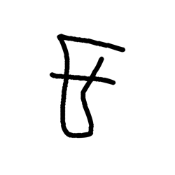

- source_zip_member: `Sub-character Images/4r0g6bx5rc/4r0g6bx5rc/0hruqxq9tk.png`
- checksum_sha256: see `06_component-visual-index.csv`.
- review_status: `needs_human_visual_review`
- caution: source-marked review image only.

## asset-016435

- source_zip_member: `Sub-character Images/4r0g6bx5rc/4r0g6bx5rc/0tefe5i244.png`
- checksum_sha256: see `06_component-visual-index.csv`.
- review_status: `needs_human_visual_review`
- caution: source-marked review image only.

## asset-016436

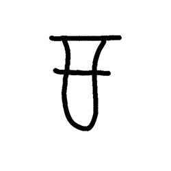

- source_zip_member: `Sub-character Images/4r0g6bx5rc/4r0g6bx5rc/16bqio915t.png`
- checksum_sha256: see `06_component-visual-index.csv`.
- review_status: `needs_human_visual_review`
- caution: source-marked review image only.

## asset-016437

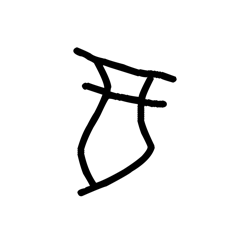

- source_zip_member: `Sub-character Images/4r0g6bx5rc/4r0g6bx5rc/1zktd4otjg.png`
- checksum_sha256: see `06_component-visual-index.csv`.
- review_status: `needs_human_visual_review`
- caution: source-marked review image only.

## asset-016438

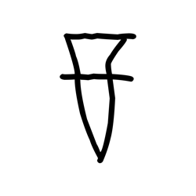

- source_zip_member: `Sub-character Images/4r0g6bx5rc/4r0g6bx5rc/36px8cb6ur.png`
- checksum_sha256: see `06_component-visual-index.csv`.
- review_status: `needs_human_visual_review`
- caution: source-marked review image only.

## asset-016439

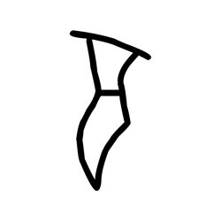

- source_zip_member: `Sub-character Images/4r0g6bx5rc/4r0g6bx5rc/48sy9357hc.png`
- checksum_sha256: see `06_component-visual-index.csv`.
- review_status: `needs_human_visual_review`
- caution: source-marked review image only.

## asset-016440

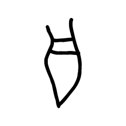

- source_zip_member: `Sub-character Images/4r0g6bx5rc/4r0g6bx5rc/4lci02wle3.png`
- checksum_sha256: see `06_component-visual-index.csv`.
- review_status: `needs_human_visual_review`
- caution: source-marked review image only.

## asset-016441

- source_zip_member: `Sub-character Images/4r0g6bx5rc/4r0g6bx5rc/4r0g6bx5rc.png`
- checksum_sha256: see `06_component-visual-index.csv`.
- review_status: `needs_human_visual_review`
- caution: source-marked review image only.

## asset-016442

- source_zip_member: `Sub-character Images/4r0g6bx5rc/4r0g6bx5rc/6rn2jcw4ep.png`
- checksum_sha256: see `06_component-visual-index.csv`.
- review_status: `needs_human_visual_review`
- caution: source-marked review image only.

## asset-016443

- source_zip_member: `Sub-character Images/4r0g6bx5rc/4r0g6bx5rc/b230fkzjn3.png`
- checksum_sha256: see `06_component-visual-index.csv`.
- review_status: `needs_human_visual_review`
- caution: source-marked review image only.

## asset-016444

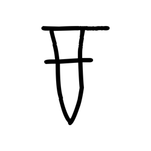

- source_zip_member: `Sub-character Images/4r0g6bx5rc/4r0g6bx5rc/bxyg7wbxar.png`
- checksum_sha256: see `06_component-visual-index.csv`.
- review_status: `needs_human_visual_review`
- caution: source-marked review image only.

## asset-016445

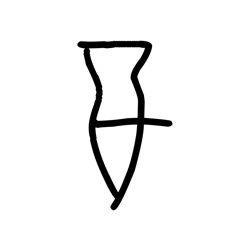

- source_zip_member: `Sub-character Images/4r0g6bx5rc/4r0g6bx5rc/dcfl293uyt.png`
- checksum_sha256: see `06_component-visual-index.csv`.
- review_status: `needs_human_visual_review`
- caution: source-marked review image only.

## asset-016446

- source_zip_member: `Sub-character Images/4r0g6bx5rc/4r0g6bx5rc/eof31hqoxf.png`
- checksum_sha256: see `06_component-visual-index.csv`.
- review_status: `needs_human_visual_review`
- caution: source-marked review image only.

## asset-016447

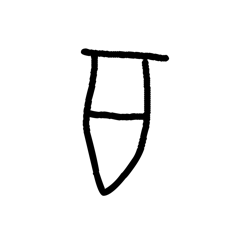

- source_zip_member: `Sub-character Images/4r0g6bx5rc/4r0g6bx5rc/f917ax727x.png`
- checksum_sha256: see `06_component-visual-index.csv`.
- review_status: `needs_human_visual_review`
- caution: source-marked review image only.

## asset-016448

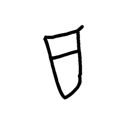

- source_zip_member: `Sub-character Images/4r0g6bx5rc/4r0g6bx5rc/i1x7zmvwz6.png`
- checksum_sha256: see `06_component-visual-index.csv`.
- review_status: `needs_human_visual_review`
- caution: source-marked review image only.

## asset-016449

- source_zip_member: `Sub-character Images/4r0g6bx5rc/4r0g6bx5rc/ia3xkvnlza.png`
- checksum_sha256: see `06_component-visual-index.csv`.
- review_status: `needs_human_visual_review`
- caution: source-marked review image only.

## asset-016450

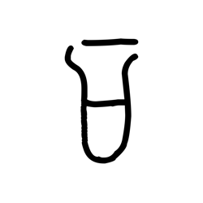

- source_zip_member: `Sub-character Images/4r0g6bx5rc/4r0g6bx5rc/iiqjgu588u.png`
- checksum_sha256: see `06_component-visual-index.csv`.
- review_status: `needs_human_visual_review`
- caution: source-marked review image only.

## asset-016451

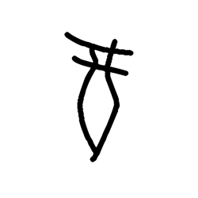

- source_zip_member: `Sub-character Images/4r0g6bx5rc/4r0g6bx5rc/jfeulhbsvb.png`
- checksum_sha256: see `06_component-visual-index.csv`.
- review_status: `needs_human_visual_review`
- caution: source-marked review image only.

## asset-016452

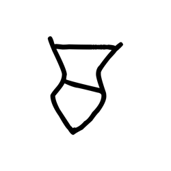

- source_zip_member: `Sub-character Images/4r0g6bx5rc/4r0g6bx5rc/jpiaokcmny.png`
- checksum_sha256: see `06_component-visual-index.csv`.
- review_status: `needs_human_visual_review`
- caution: source-marked review image only.

## asset-016453

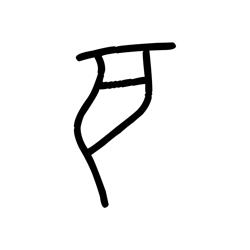

- source_zip_member: `Sub-character Images/4r0g6bx5rc/4r0g6bx5rc/k68xzlkjh6.png`
- checksum_sha256: see `06_component-visual-index.csv`.
- review_status: `needs_human_visual_review`
- caution: source-marked review image only.

## asset-016454

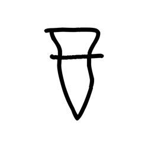

- source_zip_member: `Sub-character Images/4r0g6bx5rc/4r0g6bx5rc/o8bz4f16lj.png`
- checksum_sha256: see `06_component-visual-index.csv`.
- review_status: `needs_human_visual_review`
- caution: source-marked review image only.

## asset-016455

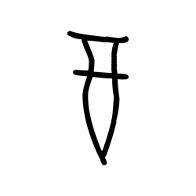

- source_zip_member: `Sub-character Images/4r0g6bx5rc/4r0g6bx5rc/oi1ki84sot.png`
- checksum_sha256: see `06_component-visual-index.csv`.
- review_status: `needs_human_visual_review`
- caution: source-marked review image only.

## asset-016456

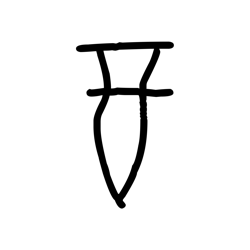

- source_zip_member: `Sub-character Images/4r0g6bx5rc/4r0g6bx5rc/p5o5wthjfc.png`
- checksum_sha256: see `06_component-visual-index.csv`.
- review_status: `needs_human_visual_review`
- caution: source-marked review image only.

## asset-016457

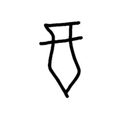

- source_zip_member: `Sub-character Images/4r0g6bx5rc/4r0g6bx5rc/qexwl6txoj.png`
- checksum_sha256: see `06_component-visual-index.csv`.
- review_status: `needs_human_visual_review`
- caution: source-marked review image only.

## asset-016458

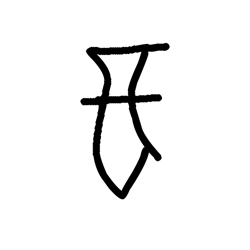

- source_zip_member: `Sub-character Images/4r0g6bx5rc/4r0g6bx5rc/qfry8np5ty.png`
- checksum_sha256: see `06_component-visual-index.csv`.
- review_status: `needs_human_visual_review`
- caution: source-marked review image only.

## asset-016459

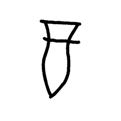

- source_zip_member: `Sub-character Images/4r0g6bx5rc/4r0g6bx5rc/r2oy2gcnpj.png`
- checksum_sha256: see `06_component-visual-index.csv`.
- review_status: `needs_human_visual_review`
- caution: source-marked review image only.

## asset-016460

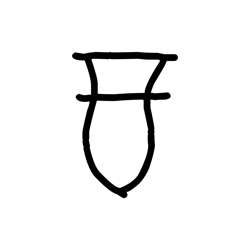

- source_zip_member: `Sub-character Images/4r0g6bx5rc/4r0g6bx5rc/s97lgu5nwo.png`
- checksum_sha256: see `06_component-visual-index.csv`.
- review_status: `needs_human_visual_review`
- caution: source-marked review image only.

## asset-016461

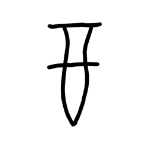

- source_zip_member: `Sub-character Images/4r0g6bx5rc/4r0g6bx5rc/sr584te0be.png`
- checksum_sha256: see `06_component-visual-index.csv`.
- review_status: `needs_human_visual_review`
- caution: source-marked review image only.

## asset-016462

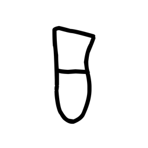

- source_zip_member: `Sub-character Images/4r0g6bx5rc/4r0g6bx5rc/t9aum93gad.png`
- checksum_sha256: see `06_component-visual-index.csv`.
- review_status: `needs_human_visual_review`
- caution: source-marked review image only.

## asset-016463

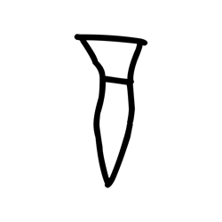

- source_zip_member: `Sub-character Images/4r0g6bx5rc/4r0g6bx5rc/tfcfzg01if.png`
- checksum_sha256: see `06_component-visual-index.csv`.
- review_status: `needs_human_visual_review`
- caution: source-marked review image only.

## asset-016464

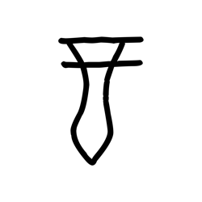

- source_zip_member: `Sub-character Images/4r0g6bx5rc/4r0g6bx5rc/ufo1shtzbh.png`
- checksum_sha256: see `06_component-visual-index.csv`.
- review_status: `needs_human_visual_review`
- caution: source-marked review image only.

## asset-016465

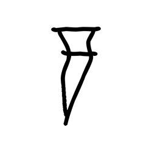

- source_zip_member: `Sub-character Images/4r0g6bx5rc/4r0g6bx5rc/vxend198x4.png`
- checksum_sha256: see `06_component-visual-index.csv`.
- review_status: `needs_human_visual_review`
- caution: source-marked review image only.

## asset-016466

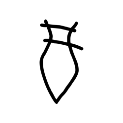

- source_zip_member: `Sub-character Images/4r0g6bx5rc/4r0g6bx5rc/wpfe9h64y3.png`
- checksum_sha256: see `06_component-visual-index.csv`.
- review_status: `needs_human_visual_review`
- caution: source-marked review image only.

## asset-016467

- source_zip_member: `Sub-character Images/4r0g6bx5rc/4r0g6bx5rc/wqvrtb9l8v.png`
- checksum_sha256: see `06_component-visual-index.csv`.
- review_status: `needs_human_visual_review`
- caution: source-marked review image only.

## asset-016468

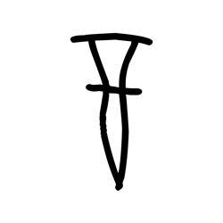

- source_zip_member: `Sub-character Images/4r0g6bx5rc/4r0g6bx5rc/x06rrhuhqe.png`
- checksum_sha256: see `06_component-visual-index.csv`.
- review_status: `needs_human_visual_review`
- caution: source-marked review image only.

## asset-016469

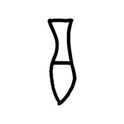

- source_zip_member: `Sub-character Images/4r0g6bx5rc/4r0g6bx5rc/x7ky4h5l87.png`
- checksum_sha256: see `06_component-visual-index.csv`.
- review_status: `needs_human_visual_review`
- caution: source-marked review image only.
