# Component Visual Gallery / 构件图像查看: obs-comp-cand-001527

English:
This page displays OBIMD subcharacter PNG assets extracted into this concrete
corpus object directory for human review.

简体中文：
本页展示抽取到当前具体 corpus 对象目录内的 OBIMD subcharacter PNG 资料，供人工复核使用。

Boundary / 边界：
dataset image candidate only; not a confirmed component form, not a component
assignment, and not a decipherment claim.
- not a confirmed component form
- not a component assignment
- not a decipherment claim

## Concrete Questions To Check / 具体待查问题

- Which local image should be opened first?
- 应先打开哪一张本地构件图像？
- Which source zip member anchors this image?
- 哪一个 source zip member 能定位这张图像？
- Which near-shape or variant comparison is still missing?
- 还缺哪些近形或异体比较？
- Which character or inscription context should be checked next?
- 下一步应核对哪些单字或卜辞上下文？
- What evidence is missing before a component assignment?
- 正式构件归属前还缺哪些证据？

## asset-016490

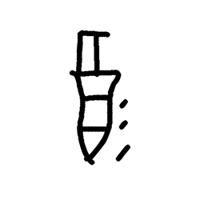

- source_zip_member: `Sub-character Images/hclsl73wg4/hclsl73wg4/0ap1jc7hvo.png`
- checksum_sha256: see `06_component-visual-index.csv`.
- review_status: `needs_human_visual_review`
- caution: source-marked review image only.

## asset-016491

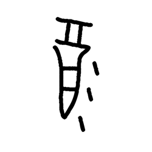

- source_zip_member: `Sub-character Images/hclsl73wg4/hclsl73wg4/0bytgq15kl.png`
- checksum_sha256: see `06_component-visual-index.csv`.
- review_status: `needs_human_visual_review`
- caution: source-marked review image only.

## asset-016492

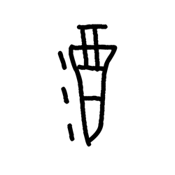

- source_zip_member: `Sub-character Images/hclsl73wg4/hclsl73wg4/0c8ldfc1wq.png`
- checksum_sha256: see `06_component-visual-index.csv`.
- review_status: `needs_human_visual_review`
- caution: source-marked review image only.

## asset-016493

- source_zip_member: `Sub-character Images/hclsl73wg4/hclsl73wg4/0cn42ixr68.png`
- checksum_sha256: see `06_component-visual-index.csv`.
- review_status: `needs_human_visual_review`
- caution: source-marked review image only.

## asset-016494

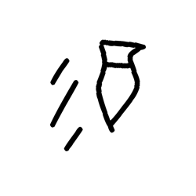

- source_zip_member: `Sub-character Images/hclsl73wg4/hclsl73wg4/0f4dl03sgd.png`
- checksum_sha256: see `06_component-visual-index.csv`.
- review_status: `needs_human_visual_review`
- caution: source-marked review image only.

## asset-016495

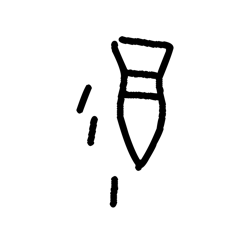

- source_zip_member: `Sub-character Images/hclsl73wg4/hclsl73wg4/0icyyg54v0.png`
- checksum_sha256: see `06_component-visual-index.csv`.
- review_status: `needs_human_visual_review`
- caution: source-marked review image only.

## asset-016496

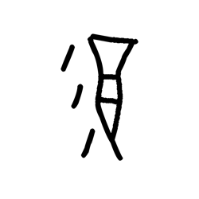

- source_zip_member: `Sub-character Images/hclsl73wg4/hclsl73wg4/0irdgp79kg.png`
- checksum_sha256: see `06_component-visual-index.csv`.
- review_status: `needs_human_visual_review`
- caution: source-marked review image only.

## asset-016497

- source_zip_member: `Sub-character Images/hclsl73wg4/hclsl73wg4/0jr04ptu1u.png`
- checksum_sha256: see `06_component-visual-index.csv`.
- review_status: `needs_human_visual_review`
- caution: source-marked review image only.

## asset-016498

- source_zip_member: `Sub-character Images/hclsl73wg4/hclsl73wg4/0rg94on65k.png`
- checksum_sha256: see `06_component-visual-index.csv`.
- review_status: `needs_human_visual_review`
- caution: source-marked review image only.

## asset-016499

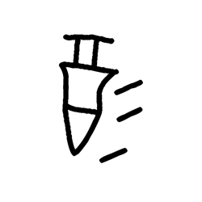

- source_zip_member: `Sub-character Images/hclsl73wg4/hclsl73wg4/0v4ireahyn.png`
- checksum_sha256: see `06_component-visual-index.csv`.
- review_status: `needs_human_visual_review`
- caution: source-marked review image only.

## asset-016500

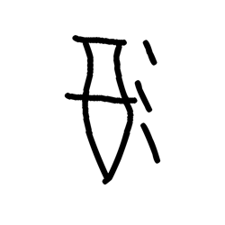

- source_zip_member: `Sub-character Images/hclsl73wg4/hclsl73wg4/0xbhi02fkf.png`
- checksum_sha256: see `06_component-visual-index.csv`.
- review_status: `needs_human_visual_review`
- caution: source-marked review image only.

## asset-016501

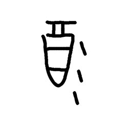

- source_zip_member: `Sub-character Images/hclsl73wg4/hclsl73wg4/19wx2ozp6h.png`
- checksum_sha256: see `06_component-visual-index.csv`.
- review_status: `needs_human_visual_review`
- caution: source-marked review image only.

## asset-016502

- source_zip_member: `Sub-character Images/hclsl73wg4/hclsl73wg4/1busylbcfj.png`
- checksum_sha256: see `06_component-visual-index.csv`.
- review_status: `needs_human_visual_review`
- caution: source-marked review image only.

## asset-016503

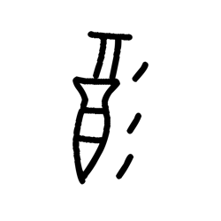

- source_zip_member: `Sub-character Images/hclsl73wg4/hclsl73wg4/1dmhwhx1jx.png`
- checksum_sha256: see `06_component-visual-index.csv`.
- review_status: `needs_human_visual_review`
- caution: source-marked review image only.

## asset-016504

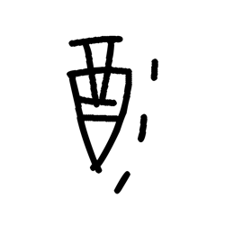

- source_zip_member: `Sub-character Images/hclsl73wg4/hclsl73wg4/1dsvq2to44.png`
- checksum_sha256: see `06_component-visual-index.csv`.
- review_status: `needs_human_visual_review`
- caution: source-marked review image only.

## asset-016505

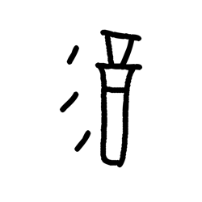

- source_zip_member: `Sub-character Images/hclsl73wg4/hclsl73wg4/1eabap3bw2.png`
- checksum_sha256: see `06_component-visual-index.csv`.
- review_status: `needs_human_visual_review`
- caution: source-marked review image only.

## asset-016506

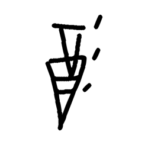

- source_zip_member: `Sub-character Images/hclsl73wg4/hclsl73wg4/1feldk5otr.png`
- checksum_sha256: see `06_component-visual-index.csv`.
- review_status: `needs_human_visual_review`
- caution: source-marked review image only.

## asset-016507

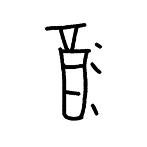

- source_zip_member: `Sub-character Images/hclsl73wg4/hclsl73wg4/1iu8gyzuid.png`
- checksum_sha256: see `06_component-visual-index.csv`.
- review_status: `needs_human_visual_review`
- caution: source-marked review image only.

## asset-016508

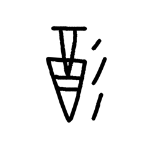

- source_zip_member: `Sub-character Images/hclsl73wg4/hclsl73wg4/1jcspx7a59.png`
- checksum_sha256: see `06_component-visual-index.csv`.
- review_status: `needs_human_visual_review`
- caution: source-marked review image only.

## asset-016509

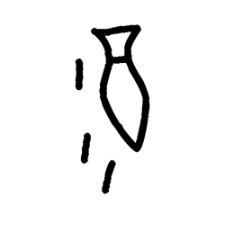

- source_zip_member: `Sub-character Images/hclsl73wg4/hclsl73wg4/1urogy9otw.png`
- checksum_sha256: see `06_component-visual-index.csv`.
- review_status: `needs_human_visual_review`
- caution: source-marked review image only.

## asset-016510

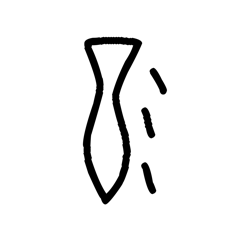

- source_zip_member: `Sub-character Images/hclsl73wg4/hclsl73wg4/1z6k4fbunw.png`
- checksum_sha256: see `06_component-visual-index.csv`.
- review_status: `needs_human_visual_review`
- caution: source-marked review image only.

## asset-016511

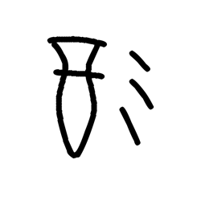

- source_zip_member: `Sub-character Images/hclsl73wg4/hclsl73wg4/214v59wdj9.png`
- checksum_sha256: see `06_component-visual-index.csv`.
- review_status: `needs_human_visual_review`
- caution: source-marked review image only.

## asset-016512

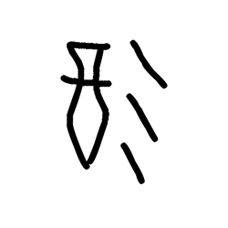

- source_zip_member: `Sub-character Images/hclsl73wg4/hclsl73wg4/2472ck6l8b.png`
- checksum_sha256: see `06_component-visual-index.csv`.
- review_status: `needs_human_visual_review`
- caution: source-marked review image only.

## asset-016513

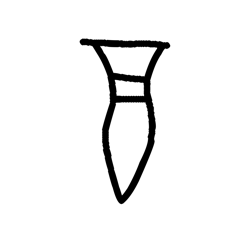

- source_zip_member: `Sub-character Images/hclsl73wg4/hclsl73wg4/25ebm889rc.png`
- checksum_sha256: see `06_component-visual-index.csv`.
- review_status: `needs_human_visual_review`
- caution: source-marked review image only.

## asset-016514

- source_zip_member: `Sub-character Images/hclsl73wg4/hclsl73wg4/2exdf80a8o.png`
- checksum_sha256: see `06_component-visual-index.csv`.
- review_status: `needs_human_visual_review`
- caution: source-marked review image only.

## asset-016515

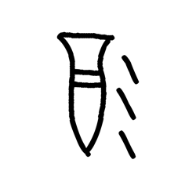

- source_zip_member: `Sub-character Images/hclsl73wg4/hclsl73wg4/2f5c0491uh.png`
- checksum_sha256: see `06_component-visual-index.csv`.
- review_status: `needs_human_visual_review`
- caution: source-marked review image only.

## asset-016516

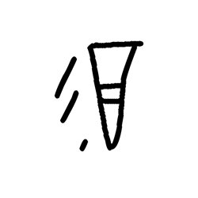

- source_zip_member: `Sub-character Images/hclsl73wg4/hclsl73wg4/2l7dgv7ivq.png`
- checksum_sha256: see `06_component-visual-index.csv`.
- review_status: `needs_human_visual_review`
- caution: source-marked review image only.

## asset-016517

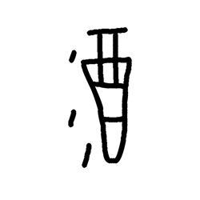

- source_zip_member: `Sub-character Images/hclsl73wg4/hclsl73wg4/2ms2qt0039.png`
- checksum_sha256: see `06_component-visual-index.csv`.
- review_status: `needs_human_visual_review`
- caution: source-marked review image only.

## asset-016518

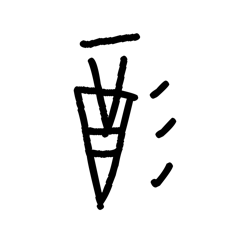

- source_zip_member: `Sub-character Images/hclsl73wg4/hclsl73wg4/2t5db1gjyf.png`
- checksum_sha256: see `06_component-visual-index.csv`.
- review_status: `needs_human_visual_review`
- caution: source-marked review image only.

## asset-016519

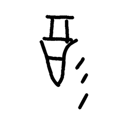

- source_zip_member: `Sub-character Images/hclsl73wg4/hclsl73wg4/2yhb5weuef.png`
- checksum_sha256: see `06_component-visual-index.csv`.
- review_status: `needs_human_visual_review`
- caution: source-marked review image only.

## asset-016520

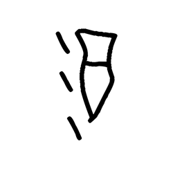

- source_zip_member: `Sub-character Images/hclsl73wg4/hclsl73wg4/32t2adava1.png`
- checksum_sha256: see `06_component-visual-index.csv`.
- review_status: `needs_human_visual_review`
- caution: source-marked review image only.

## asset-016521

- source_zip_member: `Sub-character Images/hclsl73wg4/hclsl73wg4/33plhnld2f.png`
- checksum_sha256: see `06_component-visual-index.csv`.
- review_status: `needs_human_visual_review`
- caution: source-marked review image only.

## asset-016522

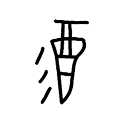

- source_zip_member: `Sub-character Images/hclsl73wg4/hclsl73wg4/35bfl96h9t.png`
- checksum_sha256: see `06_component-visual-index.csv`.
- review_status: `needs_human_visual_review`
- caution: source-marked review image only.

## asset-016523

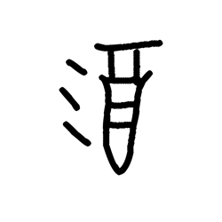

- source_zip_member: `Sub-character Images/hclsl73wg4/hclsl73wg4/35l6nr77zr.png`
- checksum_sha256: see `06_component-visual-index.csv`.
- review_status: `needs_human_visual_review`
- caution: source-marked review image only.

## asset-016524

- source_zip_member: `Sub-character Images/hclsl73wg4/hclsl73wg4/37nrpguk03.png`
- checksum_sha256: see `06_component-visual-index.csv`.
- review_status: `needs_human_visual_review`
- caution: source-marked review image only.

## asset-016525

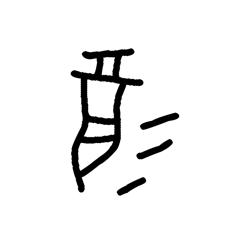

- source_zip_member: `Sub-character Images/hclsl73wg4/hclsl73wg4/3dwtq6bmul.png`
- checksum_sha256: see `06_component-visual-index.csv`.
- review_status: `needs_human_visual_review`
- caution: source-marked review image only.

## asset-016526

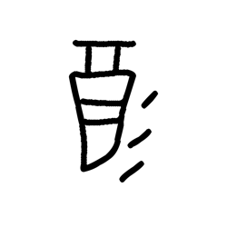

- source_zip_member: `Sub-character Images/hclsl73wg4/hclsl73wg4/3gew5w3lqw.png`
- checksum_sha256: see `06_component-visual-index.csv`.
- review_status: `needs_human_visual_review`
- caution: source-marked review image only.

## asset-016527

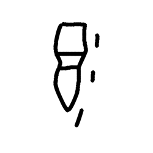

- source_zip_member: `Sub-character Images/hclsl73wg4/hclsl73wg4/3ifn9rf8g3.png`
- checksum_sha256: see `06_component-visual-index.csv`.
- review_status: `needs_human_visual_review`
- caution: source-marked review image only.

## asset-016528

- source_zip_member: `Sub-character Images/hclsl73wg4/hclsl73wg4/3imbhvo1pv.png`
- checksum_sha256: see `06_component-visual-index.csv`.
- review_status: `needs_human_visual_review`
- caution: source-marked review image only.

## asset-016529

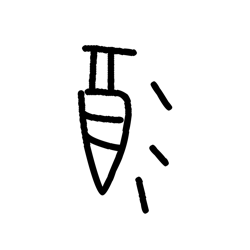

- source_zip_member: `Sub-character Images/hclsl73wg4/hclsl73wg4/3mblkr2nry.png`
- checksum_sha256: see `06_component-visual-index.csv`.
- review_status: `needs_human_visual_review`
- caution: source-marked review image only.

## asset-016530

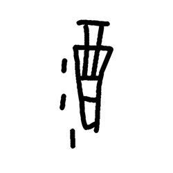

- source_zip_member: `Sub-character Images/hclsl73wg4/hclsl73wg4/3rf22ly57t.png`
- checksum_sha256: see `06_component-visual-index.csv`.
- review_status: `needs_human_visual_review`
- caution: source-marked review image only.

## asset-016531

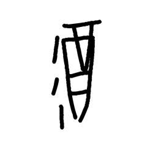

- source_zip_member: `Sub-character Images/hclsl73wg4/hclsl73wg4/3v7ib4jl0a.png`
- checksum_sha256: see `06_component-visual-index.csv`.
- review_status: `needs_human_visual_review`
- caution: source-marked review image only.

## asset-016532

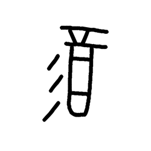

- source_zip_member: `Sub-character Images/hclsl73wg4/hclsl73wg4/48g11t64ef.png`
- checksum_sha256: see `06_component-visual-index.csv`.
- review_status: `needs_human_visual_review`
- caution: source-marked review image only.

## asset-016533

- source_zip_member: `Sub-character Images/hclsl73wg4/hclsl73wg4/49jiyt3ttn.png`
- checksum_sha256: see `06_component-visual-index.csv`.
- review_status: `needs_human_visual_review`
- caution: source-marked review image only.

## asset-016534

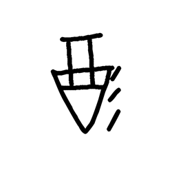

- source_zip_member: `Sub-character Images/hclsl73wg4/hclsl73wg4/4b88qjsobh.png`
- checksum_sha256: see `06_component-visual-index.csv`.
- review_status: `needs_human_visual_review`
- caution: source-marked review image only.

## asset-016535

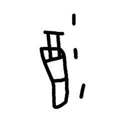

- source_zip_member: `Sub-character Images/hclsl73wg4/hclsl73wg4/4d20e79fzr.png`
- checksum_sha256: see `06_component-visual-index.csv`.
- review_status: `needs_human_visual_review`
- caution: source-marked review image only.

## asset-016536

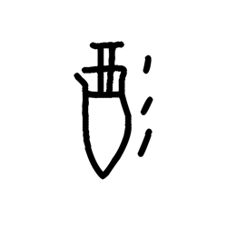

- source_zip_member: `Sub-character Images/hclsl73wg4/hclsl73wg4/4fvoln2uur.png`
- checksum_sha256: see `06_component-visual-index.csv`.
- review_status: `needs_human_visual_review`
- caution: source-marked review image only.

## asset-016537

- source_zip_member: `Sub-character Images/hclsl73wg4/hclsl73wg4/4g5ahdrn9l.png`
- checksum_sha256: see `06_component-visual-index.csv`.
- review_status: `needs_human_visual_review`
- caution: source-marked review image only.

## asset-016538

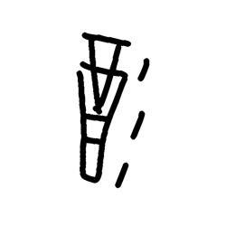

- source_zip_member: `Sub-character Images/hclsl73wg4/hclsl73wg4/4hj1ofesd5.png`
- checksum_sha256: see `06_component-visual-index.csv`.
- review_status: `needs_human_visual_review`
- caution: source-marked review image only.

## asset-016539

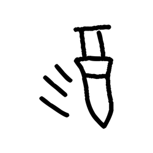

- source_zip_member: `Sub-character Images/hclsl73wg4/hclsl73wg4/4qhxvw5250.png`
- checksum_sha256: see `06_component-visual-index.csv`.
- review_status: `needs_human_visual_review`
- caution: source-marked review image only.

## asset-016540

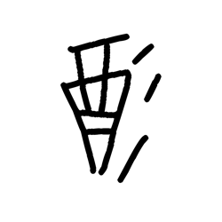

- source_zip_member: `Sub-character Images/hclsl73wg4/hclsl73wg4/4ro716rxg2.png`
- checksum_sha256: see `06_component-visual-index.csv`.
- review_status: `needs_human_visual_review`
- caution: source-marked review image only.

## asset-016541

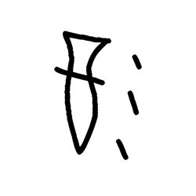

- source_zip_member: `Sub-character Images/hclsl73wg4/hclsl73wg4/4ucvjhrubo.png`
- checksum_sha256: see `06_component-visual-index.csv`.
- review_status: `needs_human_visual_review`
- caution: source-marked review image only.

## asset-016542

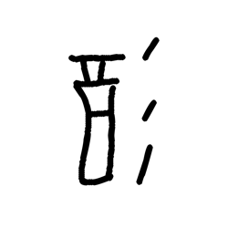

- source_zip_member: `Sub-character Images/hclsl73wg4/hclsl73wg4/4vsap02ovi.png`
- checksum_sha256: see `06_component-visual-index.csv`.
- review_status: `needs_human_visual_review`
- caution: source-marked review image only.

## asset-016543

- source_zip_member: `Sub-character Images/hclsl73wg4/hclsl73wg4/4xw4o9cm5p.png`
- checksum_sha256: see `06_component-visual-index.csv`.
- review_status: `needs_human_visual_review`
- caution: source-marked review image only.

## asset-016544

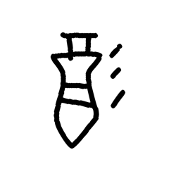

- source_zip_member: `Sub-character Images/hclsl73wg4/hclsl73wg4/53zefu5a6f.png`
- checksum_sha256: see `06_component-visual-index.csv`.
- review_status: `needs_human_visual_review`
- caution: source-marked review image only.

## asset-016545

- source_zip_member: `Sub-character Images/hclsl73wg4/hclsl73wg4/5bbcq82xpk.png`
- checksum_sha256: see `06_component-visual-index.csv`.
- review_status: `needs_human_visual_review`
- caution: source-marked review image only.

## asset-016546

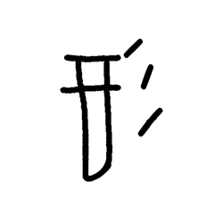

- source_zip_member: `Sub-character Images/hclsl73wg4/hclsl73wg4/5d2gsbvzoy.png`
- checksum_sha256: see `06_component-visual-index.csv`.
- review_status: `needs_human_visual_review`
- caution: source-marked review image only.

## asset-016547

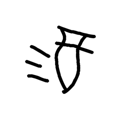

- source_zip_member: `Sub-character Images/hclsl73wg4/hclsl73wg4/5eyr4qd0qs.png`
- checksum_sha256: see `06_component-visual-index.csv`.
- review_status: `needs_human_visual_review`
- caution: source-marked review image only.

## asset-016548

- source_zip_member: `Sub-character Images/hclsl73wg4/hclsl73wg4/5hmi3g1vmj.png`
- checksum_sha256: see `06_component-visual-index.csv`.
- review_status: `needs_human_visual_review`
- caution: source-marked review image only.

## asset-016549

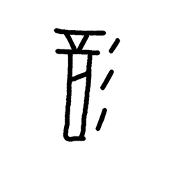

- source_zip_member: `Sub-character Images/hclsl73wg4/hclsl73wg4/5i0n51oj3a.png`
- checksum_sha256: see `06_component-visual-index.csv`.
- review_status: `needs_human_visual_review`
- caution: source-marked review image only.

## asset-016550

- source_zip_member: `Sub-character Images/hclsl73wg4/hclsl73wg4/5icryl2hiv.png`
- checksum_sha256: see `06_component-visual-index.csv`.
- review_status: `needs_human_visual_review`
- caution: source-marked review image only.

## asset-016551

- source_zip_member: `Sub-character Images/hclsl73wg4/hclsl73wg4/5jz2z6kei0.png`
- checksum_sha256: see `06_component-visual-index.csv`.
- review_status: `needs_human_visual_review`
- caution: source-marked review image only.

## asset-016552

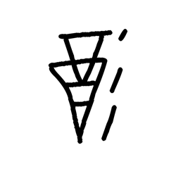

- source_zip_member: `Sub-character Images/hclsl73wg4/hclsl73wg4/5oq0a8uy3n.png`
- checksum_sha256: see `06_component-visual-index.csv`.
- review_status: `needs_human_visual_review`
- caution: source-marked review image only.

## asset-016553

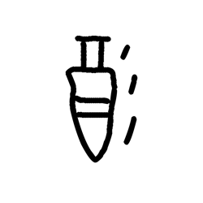

- source_zip_member: `Sub-character Images/hclsl73wg4/hclsl73wg4/5qihxv06z5.png`
- checksum_sha256: see `06_component-visual-index.csv`.
- review_status: `needs_human_visual_review`
- caution: source-marked review image only.

## asset-016554

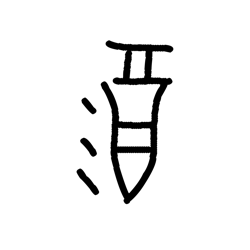

- source_zip_member: `Sub-character Images/hclsl73wg4/hclsl73wg4/5yd401vkbb.png`
- checksum_sha256: see `06_component-visual-index.csv`.
- review_status: `needs_human_visual_review`
- caution: source-marked review image only.

## asset-016555

- source_zip_member: `Sub-character Images/hclsl73wg4/hclsl73wg4/601xi2km9a.png`
- checksum_sha256: see `06_component-visual-index.csv`.
- review_status: `needs_human_visual_review`
- caution: source-marked review image only.

## asset-016556

- source_zip_member: `Sub-character Images/hclsl73wg4/hclsl73wg4/612v24nbjl.png`
- checksum_sha256: see `06_component-visual-index.csv`.
- review_status: `needs_human_visual_review`
- caution: source-marked review image only.

## asset-016557

- source_zip_member: `Sub-character Images/hclsl73wg4/hclsl73wg4/649x7e4o0f.png`
- checksum_sha256: see `06_component-visual-index.csv`.
- review_status: `needs_human_visual_review`
- caution: source-marked review image only.

## asset-016558

- source_zip_member: `Sub-character Images/hclsl73wg4/hclsl73wg4/65rizaihrp.png`
- checksum_sha256: see `06_component-visual-index.csv`.
- review_status: `needs_human_visual_review`
- caution: source-marked review image only.

## asset-016559

- source_zip_member: `Sub-character Images/hclsl73wg4/hclsl73wg4/67yzkc9dwi.png`
- checksum_sha256: see `06_component-visual-index.csv`.
- review_status: `needs_human_visual_review`
- caution: source-marked review image only.

## asset-016560

- source_zip_member: `Sub-character Images/hclsl73wg4/hclsl73wg4/6a13sge4mz.png`
- checksum_sha256: see `06_component-visual-index.csv`.
- review_status: `needs_human_visual_review`
- caution: source-marked review image only.

## asset-016561

- source_zip_member: `Sub-character Images/hclsl73wg4/hclsl73wg4/6g5lpoamng.png`
- checksum_sha256: see `06_component-visual-index.csv`.
- review_status: `needs_human_visual_review`
- caution: source-marked review image only.

## asset-016562

- source_zip_member: `Sub-character Images/hclsl73wg4/hclsl73wg4/6i1utlouto.png`
- checksum_sha256: see `06_component-visual-index.csv`.
- review_status: `needs_human_visual_review`
- caution: source-marked review image only.

## asset-016563

- source_zip_member: `Sub-character Images/hclsl73wg4/hclsl73wg4/6jg53joyit.png`
- checksum_sha256: see `06_component-visual-index.csv`.
- review_status: `needs_human_visual_review`
- caution: source-marked review image only.

## asset-016564

- source_zip_member: `Sub-character Images/hclsl73wg4/hclsl73wg4/6nq9uyxuvd.png`
- checksum_sha256: see `06_component-visual-index.csv`.
- review_status: `needs_human_visual_review`
- caution: source-marked review image only.

## asset-016565

- source_zip_member: `Sub-character Images/hclsl73wg4/hclsl73wg4/70pydz433f.png`
- checksum_sha256: see `06_component-visual-index.csv`.
- review_status: `needs_human_visual_review`
- caution: source-marked review image only.

## asset-016566

- source_zip_member: `Sub-character Images/hclsl73wg4/hclsl73wg4/71meeovf2l.png`
- checksum_sha256: see `06_component-visual-index.csv`.
- review_status: `needs_human_visual_review`
- caution: source-marked review image only.

## asset-016567

- source_zip_member: `Sub-character Images/hclsl73wg4/hclsl73wg4/7aywawqgv5.png`
- checksum_sha256: see `06_component-visual-index.csv`.
- review_status: `needs_human_visual_review`
- caution: source-marked review image only.

## asset-016568

- source_zip_member: `Sub-character Images/hclsl73wg4/hclsl73wg4/7icw2iq1r6.png`
- checksum_sha256: see `06_component-visual-index.csv`.
- review_status: `needs_human_visual_review`
- caution: source-marked review image only.

## asset-016569

- source_zip_member: `Sub-character Images/hclsl73wg4/hclsl73wg4/7n1fwd0uop.png`
- checksum_sha256: see `06_component-visual-index.csv`.
- review_status: `needs_human_visual_review`
- caution: source-marked review image only.

## asset-016570

- source_zip_member: `Sub-character Images/hclsl73wg4/hclsl73wg4/7nqqclzsgl.png`
- checksum_sha256: see `06_component-visual-index.csv`.
- review_status: `needs_human_visual_review`
- caution: source-marked review image only.

## asset-016571

- source_zip_member: `Sub-character Images/hclsl73wg4/hclsl73wg4/7r6wq0stjm.png`
- checksum_sha256: see `06_component-visual-index.csv`.
- review_status: `needs_human_visual_review`
- caution: source-marked review image only.

## asset-016572

- source_zip_member: `Sub-character Images/hclsl73wg4/hclsl73wg4/7sfst3wb61.png`
- checksum_sha256: see `06_component-visual-index.csv`.
- review_status: `needs_human_visual_review`
- caution: source-marked review image only.

## asset-016573

- source_zip_member: `Sub-character Images/hclsl73wg4/hclsl73wg4/7x10roxwsq.png`
- checksum_sha256: see `06_component-visual-index.csv`.
- review_status: `needs_human_visual_review`
- caution: source-marked review image only.

## asset-016574

- source_zip_member: `Sub-character Images/hclsl73wg4/hclsl73wg4/83skdqmp41.png`
- checksum_sha256: see `06_component-visual-index.csv`.
- review_status: `needs_human_visual_review`
- caution: source-marked review image only.

## asset-016575

- source_zip_member: `Sub-character Images/hclsl73wg4/hclsl73wg4/84y9rdbihi.png`
- checksum_sha256: see `06_component-visual-index.csv`.
- review_status: `needs_human_visual_review`
- caution: source-marked review image only.

## asset-016576

- source_zip_member: `Sub-character Images/hclsl73wg4/hclsl73wg4/89yrr88zyd.png`
- checksum_sha256: see `06_component-visual-index.csv`.
- review_status: `needs_human_visual_review`
- caution: source-marked review image only.

## asset-016577

- source_zip_member: `Sub-character Images/hclsl73wg4/hclsl73wg4/8a1fcfx63e.png`
- checksum_sha256: see `06_component-visual-index.csv`.
- review_status: `needs_human_visual_review`
- caution: source-marked review image only.

## asset-016578

- source_zip_member: `Sub-character Images/hclsl73wg4/hclsl73wg4/8bjvblt8dq.png`
- checksum_sha256: see `06_component-visual-index.csv`.
- review_status: `needs_human_visual_review`
- caution: source-marked review image only.

## asset-016579

- source_zip_member: `Sub-character Images/hclsl73wg4/hclsl73wg4/8c7q442com.png`
- checksum_sha256: see `06_component-visual-index.csv`.
- review_status: `needs_human_visual_review`
- caution: source-marked review image only.

## asset-016580

- source_zip_member: `Sub-character Images/hclsl73wg4/hclsl73wg4/8fnoj21au5.png`
- checksum_sha256: see `06_component-visual-index.csv`.
- review_status: `needs_human_visual_review`
- caution: source-marked review image only.

## asset-016581

- source_zip_member: `Sub-character Images/hclsl73wg4/hclsl73wg4/8gbp0wxw05.png`
- checksum_sha256: see `06_component-visual-index.csv`.
- review_status: `needs_human_visual_review`
- caution: source-marked review image only.

## asset-016582

- source_zip_member: `Sub-character Images/hclsl73wg4/hclsl73wg4/8hrqxaucte.png`
- checksum_sha256: see `06_component-visual-index.csv`.
- review_status: `needs_human_visual_review`
- caution: source-marked review image only.

## asset-016583

- source_zip_member: `Sub-character Images/hclsl73wg4/hclsl73wg4/8i3gyrtgko.png`
- checksum_sha256: see `06_component-visual-index.csv`.
- review_status: `needs_human_visual_review`
- caution: source-marked review image only.

## asset-016584

- source_zip_member: `Sub-character Images/hclsl73wg4/hclsl73wg4/8k307eczez.png`
- checksum_sha256: see `06_component-visual-index.csv`.
- review_status: `needs_human_visual_review`
- caution: source-marked review image only.

## asset-016585

- source_zip_member: `Sub-character Images/hclsl73wg4/hclsl73wg4/8l65z4m01k.png`
- checksum_sha256: see `06_component-visual-index.csv`.
- review_status: `needs_human_visual_review`
- caution: source-marked review image only.

## asset-016586

- source_zip_member: `Sub-character Images/hclsl73wg4/hclsl73wg4/8me8w5lwax.png`
- checksum_sha256: see `06_component-visual-index.csv`.
- review_status: `needs_human_visual_review`
- caution: source-marked review image only.

## asset-016587

- source_zip_member: `Sub-character Images/hclsl73wg4/hclsl73wg4/90q62fyoyu.png`
- checksum_sha256: see `06_component-visual-index.csv`.
- review_status: `needs_human_visual_review`
- caution: source-marked review image only.

## asset-016588

- source_zip_member: `Sub-character Images/hclsl73wg4/hclsl73wg4/91zvjw46oz.png`
- checksum_sha256: see `06_component-visual-index.csv`.
- review_status: `needs_human_visual_review`
- caution: source-marked review image only.

## asset-016589

- source_zip_member: `Sub-character Images/hclsl73wg4/hclsl73wg4/982fbl33id.png`
- checksum_sha256: see `06_component-visual-index.csv`.
- review_status: `needs_human_visual_review`
- caution: source-marked review image only.

## asset-016590

- source_zip_member: `Sub-character Images/hclsl73wg4/hclsl73wg4/9aovjyrbra.png`
- checksum_sha256: see `06_component-visual-index.csv`.
- review_status: `needs_human_visual_review`
- caution: source-marked review image only.

## asset-016591

- source_zip_member: `Sub-character Images/hclsl73wg4/hclsl73wg4/9c3ior102n.png`
- checksum_sha256: see `06_component-visual-index.csv`.
- review_status: `needs_human_visual_review`
- caution: source-marked review image only.

## asset-016592

- source_zip_member: `Sub-character Images/hclsl73wg4/hclsl73wg4/9hwi09lk2h.png`
- checksum_sha256: see `06_component-visual-index.csv`.
- review_status: `needs_human_visual_review`
- caution: source-marked review image only.

## asset-016593

- source_zip_member: `Sub-character Images/hclsl73wg4/hclsl73wg4/9jcj1afe8n.png`
- checksum_sha256: see `06_component-visual-index.csv`.
- review_status: `needs_human_visual_review`
- caution: source-marked review image only.

## asset-016594

- source_zip_member: `Sub-character Images/hclsl73wg4/hclsl73wg4/9kksa4z6py.png`
- checksum_sha256: see `06_component-visual-index.csv`.
- review_status: `needs_human_visual_review`
- caution: source-marked review image only.

## asset-016595

- source_zip_member: `Sub-character Images/hclsl73wg4/hclsl73wg4/9luo5rakya.png`
- checksum_sha256: see `06_component-visual-index.csv`.
- review_status: `needs_human_visual_review`
- caution: source-marked review image only.

## asset-016596

- source_zip_member: `Sub-character Images/hclsl73wg4/hclsl73wg4/9p4lnm8gaw.png`
- checksum_sha256: see `06_component-visual-index.csv`.
- review_status: `needs_human_visual_review`
- caution: source-marked review image only.

## asset-016597

- source_zip_member: `Sub-character Images/hclsl73wg4/hclsl73wg4/9rzng223u0.png`
- checksum_sha256: see `06_component-visual-index.csv`.
- review_status: `needs_human_visual_review`
- caution: source-marked review image only.

## asset-016598

- source_zip_member: `Sub-character Images/hclsl73wg4/hclsl73wg4/9sjli6ztx0.png`
- checksum_sha256: see `06_component-visual-index.csv`.
- review_status: `needs_human_visual_review`
- caution: source-marked review image only.

## asset-016599

- source_zip_member: `Sub-character Images/hclsl73wg4/hclsl73wg4/9v7nyshj98.png`
- checksum_sha256: see `06_component-visual-index.csv`.
- review_status: `needs_human_visual_review`
- caution: source-marked review image only.

## asset-016600

- source_zip_member: `Sub-character Images/hclsl73wg4/hclsl73wg4/9xrlw3dme3.png`
- checksum_sha256: see `06_component-visual-index.csv`.
- review_status: `needs_human_visual_review`
- caution: source-marked review image only.

## asset-016601

- source_zip_member: `Sub-character Images/hclsl73wg4/hclsl73wg4/9z9c1cpuns.png`
- checksum_sha256: see `06_component-visual-index.csv`.
- review_status: `needs_human_visual_review`
- caution: source-marked review image only.

## asset-016602

- source_zip_member: `Sub-character Images/hclsl73wg4/hclsl73wg4/a1qjr4c623.png`
- checksum_sha256: see `06_component-visual-index.csv`.
- review_status: `needs_human_visual_review`
- caution: source-marked review image only.

## asset-016603

- source_zip_member: `Sub-character Images/hclsl73wg4/hclsl73wg4/a265c5s2fb.png`
- checksum_sha256: see `06_component-visual-index.csv`.
- review_status: `needs_human_visual_review`
- caution: source-marked review image only.

## asset-016604

- source_zip_member: `Sub-character Images/hclsl73wg4/hclsl73wg4/a6qvus8ojx.png`
- checksum_sha256: see `06_component-visual-index.csv`.
- review_status: `needs_human_visual_review`
- caution: source-marked review image only.

## asset-016605

- source_zip_member: `Sub-character Images/hclsl73wg4/hclsl73wg4/a78knt06ko.png`
- checksum_sha256: see `06_component-visual-index.csv`.
- review_status: `needs_human_visual_review`
- caution: source-marked review image only.

## asset-016606

- source_zip_member: `Sub-character Images/hclsl73wg4/hclsl73wg4/a9ogw7fga7.png`
- checksum_sha256: see `06_component-visual-index.csv`.
- review_status: `needs_human_visual_review`
- caution: source-marked review image only.

## asset-016607

- source_zip_member: `Sub-character Images/hclsl73wg4/hclsl73wg4/abp3zzfk4t.png`
- checksum_sha256: see `06_component-visual-index.csv`.
- review_status: `needs_human_visual_review`
- caution: source-marked review image only.

## asset-016608

- source_zip_member: `Sub-character Images/hclsl73wg4/hclsl73wg4/acjuz4ww8l.png`
- checksum_sha256: see `06_component-visual-index.csv`.
- review_status: `needs_human_visual_review`
- caution: source-marked review image only.

## asset-016609

- source_zip_member: `Sub-character Images/hclsl73wg4/hclsl73wg4/af87g37l1u.png`
- checksum_sha256: see `06_component-visual-index.csv`.
- review_status: `needs_human_visual_review`
- caution: source-marked review image only.

## asset-016610

- source_zip_member: `Sub-character Images/hclsl73wg4/hclsl73wg4/afp4d48izu.png`
- checksum_sha256: see `06_component-visual-index.csv`.
- review_status: `needs_human_visual_review`
- caution: source-marked review image only.

## asset-016611

- source_zip_member: `Sub-character Images/hclsl73wg4/hclsl73wg4/aio7xi4thw.png`
- checksum_sha256: see `06_component-visual-index.csv`.
- review_status: `needs_human_visual_review`
- caution: source-marked review image only.

## asset-016612

- source_zip_member: `Sub-character Images/hclsl73wg4/hclsl73wg4/aiy6avby51.png`
- checksum_sha256: see `06_component-visual-index.csv`.
- review_status: `needs_human_visual_review`
- caution: source-marked review image only.

## asset-016613

- source_zip_member: `Sub-character Images/hclsl73wg4/hclsl73wg4/awwjv004gs.png`
- checksum_sha256: see `06_component-visual-index.csv`.
- review_status: `needs_human_visual_review`
- caution: source-marked review image only.

## asset-016614

- source_zip_member: `Sub-character Images/hclsl73wg4/hclsl73wg4/ayolief5pj.png`
- checksum_sha256: see `06_component-visual-index.csv`.
- review_status: `needs_human_visual_review`
- caution: source-marked review image only.

## asset-016615

- source_zip_member: `Sub-character Images/hclsl73wg4/hclsl73wg4/b11pjy8tpk.png`
- checksum_sha256: see `06_component-visual-index.csv`.
- review_status: `needs_human_visual_review`
- caution: source-marked review image only.

## asset-016616

- source_zip_member: `Sub-character Images/hclsl73wg4/hclsl73wg4/b2lbuc6zdd.png`
- checksum_sha256: see `06_component-visual-index.csv`.
- review_status: `needs_human_visual_review`
- caution: source-marked review image only.

## asset-016617

- source_zip_member: `Sub-character Images/hclsl73wg4/hclsl73wg4/b67y94okva.png`
- checksum_sha256: see `06_component-visual-index.csv`.
- review_status: `needs_human_visual_review`
- caution: source-marked review image only.

## asset-016618

- source_zip_member: `Sub-character Images/hclsl73wg4/hclsl73wg4/b7kqjw5b0p.png`
- checksum_sha256: see `06_component-visual-index.csv`.
- review_status: `needs_human_visual_review`
- caution: source-marked review image only.

## asset-016619

- source_zip_member: `Sub-character Images/hclsl73wg4/hclsl73wg4/b7mms7r112.png`
- checksum_sha256: see `06_component-visual-index.csv`.
- review_status: `needs_human_visual_review`
- caution: source-marked review image only.

## asset-016620

- source_zip_member: `Sub-character Images/hclsl73wg4/hclsl73wg4/bh5c0g8nsq.png`
- checksum_sha256: see `06_component-visual-index.csv`.
- review_status: `needs_human_visual_review`
- caution: source-marked review image only.

## asset-016621

- source_zip_member: `Sub-character Images/hclsl73wg4/hclsl73wg4/bi8dkl6of2.png`
- checksum_sha256: see `06_component-visual-index.csv`.
- review_status: `needs_human_visual_review`
- caution: source-marked review image only.

## asset-016622

- source_zip_member: `Sub-character Images/hclsl73wg4/hclsl73wg4/bley3imucq.png`
- checksum_sha256: see `06_component-visual-index.csv`.
- review_status: `needs_human_visual_review`
- caution: source-marked review image only.

## asset-016623

- source_zip_member: `Sub-character Images/hclsl73wg4/hclsl73wg4/bm07atuf5l.png`
- checksum_sha256: see `06_component-visual-index.csv`.
- review_status: `needs_human_visual_review`
- caution: source-marked review image only.

## asset-016624

- source_zip_member: `Sub-character Images/hclsl73wg4/hclsl73wg4/bozstp7nak.png`
- checksum_sha256: see `06_component-visual-index.csv`.
- review_status: `needs_human_visual_review`
- caution: source-marked review image only.

## asset-016625

- source_zip_member: `Sub-character Images/hclsl73wg4/hclsl73wg4/bq9km01tgh.png`
- checksum_sha256: see `06_component-visual-index.csv`.
- review_status: `needs_human_visual_review`
- caution: source-marked review image only.

## asset-016626

- source_zip_member: `Sub-character Images/hclsl73wg4/hclsl73wg4/bx8u88190r.png`
- checksum_sha256: see `06_component-visual-index.csv`.
- review_status: `needs_human_visual_review`
- caution: source-marked review image only.

## asset-016627

- source_zip_member: `Sub-character Images/hclsl73wg4/hclsl73wg4/by30asleds.png`
- checksum_sha256: see `06_component-visual-index.csv`.
- review_status: `needs_human_visual_review`
- caution: source-marked review image only.

## asset-016628

- source_zip_member: `Sub-character Images/hclsl73wg4/hclsl73wg4/c0afjliz9s.png`
- checksum_sha256: see `06_component-visual-index.csv`.
- review_status: `needs_human_visual_review`
- caution: source-marked review image only.

## asset-016629

- source_zip_member: `Sub-character Images/hclsl73wg4/hclsl73wg4/c0b5bs65rq.png`
- checksum_sha256: see `06_component-visual-index.csv`.
- review_status: `needs_human_visual_review`
- caution: source-marked review image only.

## asset-016630

- source_zip_member: `Sub-character Images/hclsl73wg4/hclsl73wg4/c2gjiya0vw.png`
- checksum_sha256: see `06_component-visual-index.csv`.
- review_status: `needs_human_visual_review`
- caution: source-marked review image only.

## asset-016631

- source_zip_member: `Sub-character Images/hclsl73wg4/hclsl73wg4/c3efe7zvqt.png`
- checksum_sha256: see `06_component-visual-index.csv`.
- review_status: `needs_human_visual_review`
- caution: source-marked review image only.

## asset-016632

- source_zip_member: `Sub-character Images/hclsl73wg4/hclsl73wg4/c67tp9zns0.png`
- checksum_sha256: see `06_component-visual-index.csv`.
- review_status: `needs_human_visual_review`
- caution: source-marked review image only.

## asset-016633

- source_zip_member: `Sub-character Images/hclsl73wg4/hclsl73wg4/c7dygdkynu.png`
- checksum_sha256: see `06_component-visual-index.csv`.
- review_status: `needs_human_visual_review`
- caution: source-marked review image only.

## asset-016634

- source_zip_member: `Sub-character Images/hclsl73wg4/hclsl73wg4/c84mv8y5sl.png`
- checksum_sha256: see `06_component-visual-index.csv`.
- review_status: `needs_human_visual_review`
- caution: source-marked review image only.

## asset-016635

- source_zip_member: `Sub-character Images/hclsl73wg4/hclsl73wg4/ca7p1lr5to.png`
- checksum_sha256: see `06_component-visual-index.csv`.
- review_status: `needs_human_visual_review`
- caution: source-marked review image only.

## asset-016636

- source_zip_member: `Sub-character Images/hclsl73wg4/hclsl73wg4/cafbr8jirv.png`
- checksum_sha256: see `06_component-visual-index.csv`.
- review_status: `needs_human_visual_review`
- caution: source-marked review image only.

## asset-016637

- source_zip_member: `Sub-character Images/hclsl73wg4/hclsl73wg4/chqiwad58d.png`
- checksum_sha256: see `06_component-visual-index.csv`.
- review_status: `needs_human_visual_review`
- caution: source-marked review image only.

## asset-016638

- source_zip_member: `Sub-character Images/hclsl73wg4/hclsl73wg4/chrgbt0kdn.png`
- checksum_sha256: see `06_component-visual-index.csv`.
- review_status: `needs_human_visual_review`
- caution: source-marked review image only.

## asset-016639

- source_zip_member: `Sub-character Images/hclsl73wg4/hclsl73wg4/ck7nq1c4zf.png`
- checksum_sha256: see `06_component-visual-index.csv`.
- review_status: `needs_human_visual_review`
- caution: source-marked review image only.

## asset-016640

- source_zip_member: `Sub-character Images/hclsl73wg4/hclsl73wg4/ckxea74cdd.png`
- checksum_sha256: see `06_component-visual-index.csv`.
- review_status: `needs_human_visual_review`
- caution: source-marked review image only.

## asset-016641

- source_zip_member: `Sub-character Images/hclsl73wg4/hclsl73wg4/cm4gxggu2z.png`
- checksum_sha256: see `06_component-visual-index.csv`.
- review_status: `needs_human_visual_review`
- caution: source-marked review image only.

## asset-016642

- source_zip_member: `Sub-character Images/hclsl73wg4/hclsl73wg4/cpeamovqii.png`
- checksum_sha256: see `06_component-visual-index.csv`.
- review_status: `needs_human_visual_review`
- caution: source-marked review image only.

## asset-016643

- source_zip_member: `Sub-character Images/hclsl73wg4/hclsl73wg4/cqy50ou8f7.png`
- checksum_sha256: see `06_component-visual-index.csv`.
- review_status: `needs_human_visual_review`
- caution: source-marked review image only.

## asset-016644

- source_zip_member: `Sub-character Images/hclsl73wg4/hclsl73wg4/cs7uezt37l.png`
- checksum_sha256: see `06_component-visual-index.csv`.
- review_status: `needs_human_visual_review`
- caution: source-marked review image only.

## asset-016645

- source_zip_member: `Sub-character Images/hclsl73wg4/hclsl73wg4/czmsemf6mj.png`
- checksum_sha256: see `06_component-visual-index.csv`.
- review_status: `needs_human_visual_review`
- caution: source-marked review image only.

## asset-016646

- source_zip_member: `Sub-character Images/hclsl73wg4/hclsl73wg4/d251olnsjf.png`
- checksum_sha256: see `06_component-visual-index.csv`.
- review_status: `needs_human_visual_review`
- caution: source-marked review image only.

## asset-016647

- source_zip_member: `Sub-character Images/hclsl73wg4/hclsl73wg4/d55pq6fhdv.png`
- checksum_sha256: see `06_component-visual-index.csv`.
- review_status: `needs_human_visual_review`
- caution: source-marked review image only.

## asset-016648

- source_zip_member: `Sub-character Images/hclsl73wg4/hclsl73wg4/d5peeq9hja.png`
- checksum_sha256: see `06_component-visual-index.csv`.
- review_status: `needs_human_visual_review`
- caution: source-marked review image only.

## asset-016649

- source_zip_member: `Sub-character Images/hclsl73wg4/hclsl73wg4/d8dnkwtc3f.png`
- checksum_sha256: see `06_component-visual-index.csv`.
- review_status: `needs_human_visual_review`
- caution: source-marked review image only.

## asset-016650

- source_zip_member: `Sub-character Images/hclsl73wg4/hclsl73wg4/dccxh4e0td.png`
- checksum_sha256: see `06_component-visual-index.csv`.
- review_status: `needs_human_visual_review`
- caution: source-marked review image only.

## asset-016651

- source_zip_member: `Sub-character Images/hclsl73wg4/hclsl73wg4/dehhb1rpzu.png`
- checksum_sha256: see `06_component-visual-index.csv`.
- review_status: `needs_human_visual_review`
- caution: source-marked review image only.

## asset-016652

- source_zip_member: `Sub-character Images/hclsl73wg4/hclsl73wg4/dg89xb1hgj.png`
- checksum_sha256: see `06_component-visual-index.csv`.
- review_status: `needs_human_visual_review`
- caution: source-marked review image only.

## asset-016653

- source_zip_member: `Sub-character Images/hclsl73wg4/hclsl73wg4/dhhiac812s.png`
- checksum_sha256: see `06_component-visual-index.csv`.
- review_status: `needs_human_visual_review`
- caution: source-marked review image only.

## asset-016654

- source_zip_member: `Sub-character Images/hclsl73wg4/hclsl73wg4/ds6w8jxf68.png`
- checksum_sha256: see `06_component-visual-index.csv`.
- review_status: `needs_human_visual_review`
- caution: source-marked review image only.

## asset-016655

- source_zip_member: `Sub-character Images/hclsl73wg4/hclsl73wg4/dsarltua0e.png`
- checksum_sha256: see `06_component-visual-index.csv`.
- review_status: `needs_human_visual_review`
- caution: source-marked review image only.

## asset-016656

- source_zip_member: `Sub-character Images/hclsl73wg4/hclsl73wg4/dwc3ex23e0.png`
- checksum_sha256: see `06_component-visual-index.csv`.
- review_status: `needs_human_visual_review`
- caution: source-marked review image only.

## asset-016657

- source_zip_member: `Sub-character Images/hclsl73wg4/hclsl73wg4/dwenjlyq70.png`
- checksum_sha256: see `06_component-visual-index.csv`.
- review_status: `needs_human_visual_review`
- caution: source-marked review image only.

## asset-016658

- source_zip_member: `Sub-character Images/hclsl73wg4/hclsl73wg4/dyelk2caym.png`
- checksum_sha256: see `06_component-visual-index.csv`.
- review_status: `needs_human_visual_review`
- caution: source-marked review image only.

## asset-016659

- source_zip_member: `Sub-character Images/hclsl73wg4/hclsl73wg4/dz1iuy6cku.png`
- checksum_sha256: see `06_component-visual-index.csv`.
- review_status: `needs_human_visual_review`
- caution: source-marked review image only.

## asset-016660

- source_zip_member: `Sub-character Images/hclsl73wg4/hclsl73wg4/e3iuduhtzo.png`
- checksum_sha256: see `06_component-visual-index.csv`.
- review_status: `needs_human_visual_review`
- caution: source-marked review image only.

## asset-016661

- source_zip_member: `Sub-character Images/hclsl73wg4/hclsl73wg4/e3kjagwmtg.png`
- checksum_sha256: see `06_component-visual-index.csv`.
- review_status: `needs_human_visual_review`
- caution: source-marked review image only.

## asset-016662

- source_zip_member: `Sub-character Images/hclsl73wg4/hclsl73wg4/egmqit1x74.png`
- checksum_sha256: see `06_component-visual-index.csv`.
- review_status: `needs_human_visual_review`
- caution: source-marked review image only.

## asset-016663

- source_zip_member: `Sub-character Images/hclsl73wg4/hclsl73wg4/ej2e94sx23.png`
- checksum_sha256: see `06_component-visual-index.csv`.
- review_status: `needs_human_visual_review`
- caution: source-marked review image only.

## asset-016664

- source_zip_member: `Sub-character Images/hclsl73wg4/hclsl73wg4/ejqyr4btua.png`
- checksum_sha256: see `06_component-visual-index.csv`.
- review_status: `needs_human_visual_review`
- caution: source-marked review image only.

## asset-016665

- source_zip_member: `Sub-character Images/hclsl73wg4/hclsl73wg4/el3r1l2cdf.png`
- checksum_sha256: see `06_component-visual-index.csv`.
- review_status: `needs_human_visual_review`
- caution: source-marked review image only.

## asset-016666

- source_zip_member: `Sub-character Images/hclsl73wg4/hclsl73wg4/elz5i9lpwk.png`
- checksum_sha256: see `06_component-visual-index.csv`.
- review_status: `needs_human_visual_review`
- caution: source-marked review image only.

## asset-016667

- source_zip_member: `Sub-character Images/hclsl73wg4/hclsl73wg4/emcpmulsuk.png`
- checksum_sha256: see `06_component-visual-index.csv`.
- review_status: `needs_human_visual_review`
- caution: source-marked review image only.

## asset-016668

- source_zip_member: `Sub-character Images/hclsl73wg4/hclsl73wg4/emuda66mbx.png`
- checksum_sha256: see `06_component-visual-index.csv`.
- review_status: `needs_human_visual_review`
- caution: source-marked review image only.

## asset-016669

- source_zip_member: `Sub-character Images/hclsl73wg4/hclsl73wg4/emw849a88n.png`
- checksum_sha256: see `06_component-visual-index.csv`.
- review_status: `needs_human_visual_review`
- caution: source-marked review image only.

## asset-016670

- source_zip_member: `Sub-character Images/hclsl73wg4/hclsl73wg4/epa9om2a32.png`
- checksum_sha256: see `06_component-visual-index.csv`.
- review_status: `needs_human_visual_review`
- caution: source-marked review image only.

## asset-016671

- source_zip_member: `Sub-character Images/hclsl73wg4/hclsl73wg4/exwlcq85oz.png`
- checksum_sha256: see `06_component-visual-index.csv`.
- review_status: `needs_human_visual_review`
- caution: source-marked review image only.

## asset-016672

- source_zip_member: `Sub-character Images/hclsl73wg4/hclsl73wg4/eyeinswpm7.png`
- checksum_sha256: see `06_component-visual-index.csv`.
- review_status: `needs_human_visual_review`
- caution: source-marked review image only.

## asset-016673

- source_zip_member: `Sub-character Images/hclsl73wg4/hclsl73wg4/f14k33nkl7.png`
- checksum_sha256: see `06_component-visual-index.csv`.
- review_status: `needs_human_visual_review`
- caution: source-marked review image only.

## asset-016674

- source_zip_member: `Sub-character Images/hclsl73wg4/hclsl73wg4/f21i5n1rew.png`
- checksum_sha256: see `06_component-visual-index.csv`.
- review_status: `needs_human_visual_review`
- caution: source-marked review image only.

## asset-016675

- source_zip_member: `Sub-character Images/hclsl73wg4/hclsl73wg4/f4gjyzslyz.png`
- checksum_sha256: see `06_component-visual-index.csv`.
- review_status: `needs_human_visual_review`
- caution: source-marked review image only.

## asset-016676

- source_zip_member: `Sub-character Images/hclsl73wg4/hclsl73wg4/f4m00iykkg.png`
- checksum_sha256: see `06_component-visual-index.csv`.
- review_status: `needs_human_visual_review`
- caution: source-marked review image only.

## asset-016677

- source_zip_member: `Sub-character Images/hclsl73wg4/hclsl73wg4/f6nmw3upqk.png`
- checksum_sha256: see `06_component-visual-index.csv`.
- review_status: `needs_human_visual_review`
- caution: source-marked review image only.

## asset-016678

- source_zip_member: `Sub-character Images/hclsl73wg4/hclsl73wg4/f88e3nd3lh.png`
- checksum_sha256: see `06_component-visual-index.csv`.
- review_status: `needs_human_visual_review`
- caution: source-marked review image only.

## asset-016679

- source_zip_member: `Sub-character Images/hclsl73wg4/hclsl73wg4/f8yyl2n08o.png`
- checksum_sha256: see `06_component-visual-index.csv`.
- review_status: `needs_human_visual_review`
- caution: source-marked review image only.

## asset-016680

- source_zip_member: `Sub-character Images/hclsl73wg4/hclsl73wg4/fcmqsscjgl.png`
- checksum_sha256: see `06_component-visual-index.csv`.
- review_status: `needs_human_visual_review`
- caution: source-marked review image only.

## asset-016681

- source_zip_member: `Sub-character Images/hclsl73wg4/hclsl73wg4/fgifuu1hea.png`
- checksum_sha256: see `06_component-visual-index.csv`.
- review_status: `needs_human_visual_review`
- caution: source-marked review image only.

## asset-016682

- source_zip_member: `Sub-character Images/hclsl73wg4/hclsl73wg4/fjaxbtx81b.png`
- checksum_sha256: see `06_component-visual-index.csv`.
- review_status: `needs_human_visual_review`
- caution: source-marked review image only.

## asset-016683

- source_zip_member: `Sub-character Images/hclsl73wg4/hclsl73wg4/fjidzphecw.png`
- checksum_sha256: see `06_component-visual-index.csv`.
- review_status: `needs_human_visual_review`
- caution: source-marked review image only.

## asset-016684

- source_zip_member: `Sub-character Images/hclsl73wg4/hclsl73wg4/fs0e9x9kgh.png`
- checksum_sha256: see `06_component-visual-index.csv`.
- review_status: `needs_human_visual_review`
- caution: source-marked review image only.

## asset-016685

- source_zip_member: `Sub-character Images/hclsl73wg4/hclsl73wg4/fuhv4idy35.png`
- checksum_sha256: see `06_component-visual-index.csv`.
- review_status: `needs_human_visual_review`
- caution: source-marked review image only.

## asset-016686

- source_zip_member: `Sub-character Images/hclsl73wg4/hclsl73wg4/fvou1gbr1x.png`
- checksum_sha256: see `06_component-visual-index.csv`.
- review_status: `needs_human_visual_review`
- caution: source-marked review image only.

## asset-016687

- source_zip_member: `Sub-character Images/hclsl73wg4/hclsl73wg4/fxptgz51lo.png`
- checksum_sha256: see `06_component-visual-index.csv`.
- review_status: `needs_human_visual_review`
- caution: source-marked review image only.

## asset-016688

- source_zip_member: `Sub-character Images/hclsl73wg4/hclsl73wg4/g1doopce67.png`
- checksum_sha256: see `06_component-visual-index.csv`.
- review_status: `needs_human_visual_review`
- caution: source-marked review image only.

## asset-016689

- source_zip_member: `Sub-character Images/hclsl73wg4/hclsl73wg4/g282pdixea.png`
- checksum_sha256: see `06_component-visual-index.csv`.
- review_status: `needs_human_visual_review`
- caution: source-marked review image only.

## asset-016690

- source_zip_member: `Sub-character Images/hclsl73wg4/hclsl73wg4/g2zhiwla2g.png`
- checksum_sha256: see `06_component-visual-index.csv`.
- review_status: `needs_human_visual_review`
- caution: source-marked review image only.

## asset-016691

- source_zip_member: `Sub-character Images/hclsl73wg4/hclsl73wg4/g6j3e8hp72.png`
- checksum_sha256: see `06_component-visual-index.csv`.
- review_status: `needs_human_visual_review`
- caution: source-marked review image only.

## asset-016692

- source_zip_member: `Sub-character Images/hclsl73wg4/hclsl73wg4/g73333e6bq.png`
- checksum_sha256: see `06_component-visual-index.csv`.
- review_status: `needs_human_visual_review`
- caution: source-marked review image only.

## asset-016693

- source_zip_member: `Sub-character Images/hclsl73wg4/hclsl73wg4/ge1npw3dfm.png`
- checksum_sha256: see `06_component-visual-index.csv`.
- review_status: `needs_human_visual_review`
- caution: source-marked review image only.

## asset-016694

- source_zip_member: `Sub-character Images/hclsl73wg4/hclsl73wg4/gixquuf1n3.png`
- checksum_sha256: see `06_component-visual-index.csv`.
- review_status: `needs_human_visual_review`
- caution: source-marked review image only.

## asset-016695

- source_zip_member: `Sub-character Images/hclsl73wg4/hclsl73wg4/go5py0rkrx.png`
- checksum_sha256: see `06_component-visual-index.csv`.
- review_status: `needs_human_visual_review`
- caution: source-marked review image only.

## asset-016696

- source_zip_member: `Sub-character Images/hclsl73wg4/hclsl73wg4/goag48fpab.png`
- checksum_sha256: see `06_component-visual-index.csv`.
- review_status: `needs_human_visual_review`
- caution: source-marked review image only.

## asset-016697

- source_zip_member: `Sub-character Images/hclsl73wg4/hclsl73wg4/gok4ssf1d2.png`
- checksum_sha256: see `06_component-visual-index.csv`.
- review_status: `needs_human_visual_review`
- caution: source-marked review image only.

## asset-016698

- source_zip_member: `Sub-character Images/hclsl73wg4/hclsl73wg4/grq8xhup64.png`
- checksum_sha256: see `06_component-visual-index.csv`.
- review_status: `needs_human_visual_review`
- caution: source-marked review image only.

## asset-016699

- source_zip_member: `Sub-character Images/hclsl73wg4/hclsl73wg4/gtto49v38h.png`
- checksum_sha256: see `06_component-visual-index.csv`.
- review_status: `needs_human_visual_review`
- caution: source-marked review image only.

## asset-016700

- source_zip_member: `Sub-character Images/hclsl73wg4/hclsl73wg4/gvb114h7zg.png`
- checksum_sha256: see `06_component-visual-index.csv`.
- review_status: `needs_human_visual_review`
- caution: source-marked review image only.

## asset-016701

- source_zip_member: `Sub-character Images/hclsl73wg4/hclsl73wg4/gyf4g3m7si.png`
- checksum_sha256: see `06_component-visual-index.csv`.
- review_status: `needs_human_visual_review`
- caution: source-marked review image only.

## asset-016702

- source_zip_member: `Sub-character Images/hclsl73wg4/hclsl73wg4/gyhgbczy1l.png`
- checksum_sha256: see `06_component-visual-index.csv`.
- review_status: `needs_human_visual_review`
- caution: source-marked review image only.

## asset-016703

- source_zip_member: `Sub-character Images/hclsl73wg4/hclsl73wg4/gzewzeviqc.png`
- checksum_sha256: see `06_component-visual-index.csv`.
- review_status: `needs_human_visual_review`
- caution: source-marked review image only.

## asset-016704

- source_zip_member: `Sub-character Images/hclsl73wg4/hclsl73wg4/h03gclfhrp.png`
- checksum_sha256: see `06_component-visual-index.csv`.
- review_status: `needs_human_visual_review`
- caution: source-marked review image only.

## asset-016705

- source_zip_member: `Sub-character Images/hclsl73wg4/hclsl73wg4/h21tjnyl2q.png`
- checksum_sha256: see `06_component-visual-index.csv`.
- review_status: `needs_human_visual_review`
- caution: source-marked review image only.

## asset-016706

- source_zip_member: `Sub-character Images/hclsl73wg4/hclsl73wg4/havmccktue.png`
- checksum_sha256: see `06_component-visual-index.csv`.
- review_status: `needs_human_visual_review`
- caution: source-marked review image only.

## asset-016707

- source_zip_member: `Sub-character Images/hclsl73wg4/hclsl73wg4/hb28kvl08l.png`
- checksum_sha256: see `06_component-visual-index.csv`.
- review_status: `needs_human_visual_review`
- caution: source-marked review image only.

## asset-016708

- source_zip_member: `Sub-character Images/hclsl73wg4/hclsl73wg4/hch462hobh.png`
- checksum_sha256: see `06_component-visual-index.csv`.
- review_status: `needs_human_visual_review`
- caution: source-marked review image only.

## asset-016709

- source_zip_member: `Sub-character Images/hclsl73wg4/hclsl73wg4/hclsl73wg4.png`
- checksum_sha256: see `06_component-visual-index.csv`.
- review_status: `needs_human_visual_review`
- caution: source-marked review image only.

## asset-016710

- source_zip_member: `Sub-character Images/hclsl73wg4/hclsl73wg4/hculpkvmxd.png`
- checksum_sha256: see `06_component-visual-index.csv`.
- review_status: `needs_human_visual_review`
- caution: source-marked review image only.

## asset-016711

- source_zip_member: `Sub-character Images/hclsl73wg4/hclsl73wg4/hdpuj499py.png`
- checksum_sha256: see `06_component-visual-index.csv`.
- review_status: `needs_human_visual_review`
- caution: source-marked review image only.

## asset-016712

- source_zip_member: `Sub-character Images/hclsl73wg4/hclsl73wg4/hfdcpkzes0.png`
- checksum_sha256: see `06_component-visual-index.csv`.
- review_status: `needs_human_visual_review`
- caution: source-marked review image only.

## asset-016713

- source_zip_member: `Sub-character Images/hclsl73wg4/hclsl73wg4/hfrbnv09ld.png`
- checksum_sha256: see `06_component-visual-index.csv`.
- review_status: `needs_human_visual_review`
- caution: source-marked review image only.

## asset-016714

- source_zip_member: `Sub-character Images/hclsl73wg4/hclsl73wg4/hhceyex8ox.png`
- checksum_sha256: see `06_component-visual-index.csv`.
- review_status: `needs_human_visual_review`
- caution: source-marked review image only.

## asset-016715

- source_zip_member: `Sub-character Images/hclsl73wg4/hclsl73wg4/hpkg0dytoi.png`
- checksum_sha256: see `06_component-visual-index.csv`.
- review_status: `needs_human_visual_review`
- caution: source-marked review image only.

## asset-016716

- source_zip_member: `Sub-character Images/hclsl73wg4/hclsl73wg4/hu654wv85b.png`
- checksum_sha256: see `06_component-visual-index.csv`.
- review_status: `needs_human_visual_review`
- caution: source-marked review image only.

## asset-016717

- source_zip_member: `Sub-character Images/hclsl73wg4/hclsl73wg4/hvemyo1uep.png`
- checksum_sha256: see `06_component-visual-index.csv`.
- review_status: `needs_human_visual_review`
- caution: source-marked review image only.

## asset-016718

- source_zip_member: `Sub-character Images/hclsl73wg4/hclsl73wg4/hwkf7sxtgz.png`
- checksum_sha256: see `06_component-visual-index.csv`.
- review_status: `needs_human_visual_review`
- caution: source-marked review image only.

## asset-016719

- source_zip_member: `Sub-character Images/hclsl73wg4/hclsl73wg4/i55rumxw5b.png`
- checksum_sha256: see `06_component-visual-index.csv`.
- review_status: `needs_human_visual_review`
- caution: source-marked review image only.

## asset-016720

- source_zip_member: `Sub-character Images/hclsl73wg4/hclsl73wg4/i56fnyqkdp.png`
- checksum_sha256: see `06_component-visual-index.csv`.
- review_status: `needs_human_visual_review`
- caution: source-marked review image only.

## asset-016721

- source_zip_member: `Sub-character Images/hclsl73wg4/hclsl73wg4/i74nzsg71a.png`
- checksum_sha256: see `06_component-visual-index.csv`.
- review_status: `needs_human_visual_review`
- caution: source-marked review image only.

## asset-016722

- source_zip_member: `Sub-character Images/hclsl73wg4/hclsl73wg4/i8qioy6185.png`
- checksum_sha256: see `06_component-visual-index.csv`.
- review_status: `needs_human_visual_review`
- caution: source-marked review image only.

## asset-016723

- source_zip_member: `Sub-character Images/hclsl73wg4/hclsl73wg4/ianu06lu2t.png`
- checksum_sha256: see `06_component-visual-index.csv`.
- review_status: `needs_human_visual_review`
- caution: source-marked review image only.

## asset-016724

- source_zip_member: `Sub-character Images/hclsl73wg4/hclsl73wg4/iaui5hm4qm.png`
- checksum_sha256: see `06_component-visual-index.csv`.
- review_status: `needs_human_visual_review`
- caution: source-marked review image only.

## asset-016725

- source_zip_member: `Sub-character Images/hclsl73wg4/hclsl73wg4/idu3emujle.png`
- checksum_sha256: see `06_component-visual-index.csv`.
- review_status: `needs_human_visual_review`
- caution: source-marked review image only.

## asset-016726

- source_zip_member: `Sub-character Images/hclsl73wg4/hclsl73wg4/ik4ioa2ba4.png`
- checksum_sha256: see `06_component-visual-index.csv`.
- review_status: `needs_human_visual_review`
- caution: source-marked review image only.

## asset-016727

- source_zip_member: `Sub-character Images/hclsl73wg4/hclsl73wg4/iof9gow9gg.png`
- checksum_sha256: see `06_component-visual-index.csv`.
- review_status: `needs_human_visual_review`
- caution: source-marked review image only.

## asset-016728

- source_zip_member: `Sub-character Images/hclsl73wg4/hclsl73wg4/iql9f2ssbj.png`
- checksum_sha256: see `06_component-visual-index.csv`.
- review_status: `needs_human_visual_review`
- caution: source-marked review image only.

## asset-016729

- source_zip_member: `Sub-character Images/hclsl73wg4/hclsl73wg4/ir3io4s0po.png`
- checksum_sha256: see `06_component-visual-index.csv`.
- review_status: `needs_human_visual_review`
- caution: source-marked review image only.

## asset-016730

- source_zip_member: `Sub-character Images/hclsl73wg4/hclsl73wg4/isc74b8gn7.png`
- checksum_sha256: see `06_component-visual-index.csv`.
- review_status: `needs_human_visual_review`
- caution: source-marked review image only.

## asset-016731

- source_zip_member: `Sub-character Images/hclsl73wg4/hclsl73wg4/ise1w3cjie.png`
- checksum_sha256: see `06_component-visual-index.csv`.
- review_status: `needs_human_visual_review`
- caution: source-marked review image only.

## asset-016732

- source_zip_member: `Sub-character Images/hclsl73wg4/hclsl73wg4/isjvdhq91i.png`
- checksum_sha256: see `06_component-visual-index.csv`.
- review_status: `needs_human_visual_review`
- caution: source-marked review image only.

## asset-016733

- source_zip_member: `Sub-character Images/hclsl73wg4/hclsl73wg4/iz0o5i7c0h.png`
- checksum_sha256: see `06_component-visual-index.csv`.
- review_status: `needs_human_visual_review`
- caution: source-marked review image only.

## asset-016734

- source_zip_member: `Sub-character Images/hclsl73wg4/hclsl73wg4/j09l7nummu.png`
- checksum_sha256: see `06_component-visual-index.csv`.
- review_status: `needs_human_visual_review`
- caution: source-marked review image only.

## asset-016735

- source_zip_member: `Sub-character Images/hclsl73wg4/hclsl73wg4/j4nm6hg0sx.png`
- checksum_sha256: see `06_component-visual-index.csv`.
- review_status: `needs_human_visual_review`
- caution: source-marked review image only.

## asset-016736

- source_zip_member: `Sub-character Images/hclsl73wg4/hclsl73wg4/j4ucffwkqb.png`
- checksum_sha256: see `06_component-visual-index.csv`.
- review_status: `needs_human_visual_review`
- caution: source-marked review image only.

## asset-016737

- source_zip_member: `Sub-character Images/hclsl73wg4/hclsl73wg4/je3j7kt7db.png`
- checksum_sha256: see `06_component-visual-index.csv`.
- review_status: `needs_human_visual_review`
- caution: source-marked review image only.

## asset-016738

- source_zip_member: `Sub-character Images/hclsl73wg4/hclsl73wg4/jkckenk88v.png`
- checksum_sha256: see `06_component-visual-index.csv`.
- review_status: `needs_human_visual_review`
- caution: source-marked review image only.

## asset-016739

- source_zip_member: `Sub-character Images/hclsl73wg4/hclsl73wg4/jkg9ctwptt.png`
- checksum_sha256: see `06_component-visual-index.csv`.
- review_status: `needs_human_visual_review`
- caution: source-marked review image only.

## asset-016740

- source_zip_member: `Sub-character Images/hclsl73wg4/hclsl73wg4/jkisw4n8io.png`
- checksum_sha256: see `06_component-visual-index.csv`.
- review_status: `needs_human_visual_review`
- caution: source-marked review image only.

## asset-016741

- source_zip_member: `Sub-character Images/hclsl73wg4/hclsl73wg4/jkv4d1qaly.png`
- checksum_sha256: see `06_component-visual-index.csv`.
- review_status: `needs_human_visual_review`
- caution: source-marked review image only.

## asset-016742

- source_zip_member: `Sub-character Images/hclsl73wg4/hclsl73wg4/jorkv3w1ry.png`
- checksum_sha256: see `06_component-visual-index.csv`.
- review_status: `needs_human_visual_review`
- caution: source-marked review image only.

## asset-016743

- source_zip_member: `Sub-character Images/hclsl73wg4/hclsl73wg4/jowb5wxv5a.png`
- checksum_sha256: see `06_component-visual-index.csv`.
- review_status: `needs_human_visual_review`
- caution: source-marked review image only.

## asset-016744

- source_zip_member: `Sub-character Images/hclsl73wg4/hclsl73wg4/junko6cfqo.png`
- checksum_sha256: see `06_component-visual-index.csv`.
- review_status: `needs_human_visual_review`
- caution: source-marked review image only.

## asset-016745

- source_zip_member: `Sub-character Images/hclsl73wg4/hclsl73wg4/jwod642241.png`
- checksum_sha256: see `06_component-visual-index.csv`.
- review_status: `needs_human_visual_review`
- caution: source-marked review image only.

## asset-016746

- source_zip_member: `Sub-character Images/hclsl73wg4/hclsl73wg4/jxn43x0gqk.png`
- checksum_sha256: see `06_component-visual-index.csv`.
- review_status: `needs_human_visual_review`
- caution: source-marked review image only.

## asset-016747

- source_zip_member: `Sub-character Images/hclsl73wg4/hclsl73wg4/jyhc3ahm3z.png`
- checksum_sha256: see `06_component-visual-index.csv`.
- review_status: `needs_human_visual_review`
- caution: source-marked review image only.

## asset-016748

- source_zip_member: `Sub-character Images/hclsl73wg4/hclsl73wg4/jyjnmd9gz9.png`
- checksum_sha256: see `06_component-visual-index.csv`.
- review_status: `needs_human_visual_review`
- caution: source-marked review image only.

## asset-016749

- source_zip_member: `Sub-character Images/hclsl73wg4/hclsl73wg4/k0emus89zo.png`
- checksum_sha256: see `06_component-visual-index.csv`.
- review_status: `needs_human_visual_review`
- caution: source-marked review image only.

## asset-016750

- source_zip_member: `Sub-character Images/hclsl73wg4/hclsl73wg4/k1ttf3oqy9.png`
- checksum_sha256: see `06_component-visual-index.csv`.
- review_status: `needs_human_visual_review`
- caution: source-marked review image only.

## asset-016751

- source_zip_member: `Sub-character Images/hclsl73wg4/hclsl73wg4/k55qf6fjhk.png`
- checksum_sha256: see `06_component-visual-index.csv`.
- review_status: `needs_human_visual_review`
- caution: source-marked review image only.

## asset-016752

- source_zip_member: `Sub-character Images/hclsl73wg4/hclsl73wg4/k6qz3g0qvb.png`
- checksum_sha256: see `06_component-visual-index.csv`.
- review_status: `needs_human_visual_review`
- caution: source-marked review image only.

## asset-016753

- source_zip_member: `Sub-character Images/hclsl73wg4/hclsl73wg4/k6zs8rmfg4.png`
- checksum_sha256: see `06_component-visual-index.csv`.
- review_status: `needs_human_visual_review`
- caution: source-marked review image only.

## asset-016754

- source_zip_member: `Sub-character Images/hclsl73wg4/hclsl73wg4/k7qwoop8il.png`
- checksum_sha256: see `06_component-visual-index.csv`.
- review_status: `needs_human_visual_review`
- caution: source-marked review image only.

## asset-016755

- source_zip_member: `Sub-character Images/hclsl73wg4/hclsl73wg4/ka5gg9iqwn.png`
- checksum_sha256: see `06_component-visual-index.csv`.
- review_status: `needs_human_visual_review`
- caution: source-marked review image only.

## asset-016756

- source_zip_member: `Sub-character Images/hclsl73wg4/hclsl73wg4/keyd9alu1s.png`
- checksum_sha256: see `06_component-visual-index.csv`.
- review_status: `needs_human_visual_review`
- caution: source-marked review image only.

## asset-016757

- source_zip_member: `Sub-character Images/hclsl73wg4/hclsl73wg4/kfe9rf8udu.png`
- checksum_sha256: see `06_component-visual-index.csv`.
- review_status: `needs_human_visual_review`
- caution: source-marked review image only.

## asset-016758

- source_zip_member: `Sub-character Images/hclsl73wg4/hclsl73wg4/klb0uifkny.png`
- checksum_sha256: see `06_component-visual-index.csv`.
- review_status: `needs_human_visual_review`
- caution: source-marked review image only.

## asset-016759

- source_zip_member: `Sub-character Images/hclsl73wg4/hclsl73wg4/klg6o6b124.png`
- checksum_sha256: see `06_component-visual-index.csv`.
- review_status: `needs_human_visual_review`
- caution: source-marked review image only.

## asset-016760

- source_zip_member: `Sub-character Images/hclsl73wg4/hclsl73wg4/ks40kwkvm0.png`
- checksum_sha256: see `06_component-visual-index.csv`.
- review_status: `needs_human_visual_review`
- caution: source-marked review image only.

## asset-016761

- source_zip_member: `Sub-character Images/hclsl73wg4/hclsl73wg4/kt21yapg4a.png`
- checksum_sha256: see `06_component-visual-index.csv`.
- review_status: `needs_human_visual_review`
- caution: source-marked review image only.

## asset-016762

- source_zip_member: `Sub-character Images/hclsl73wg4/hclsl73wg4/kt2p5idirg.png`
- checksum_sha256: see `06_component-visual-index.csv`.
- review_status: `needs_human_visual_review`
- caution: source-marked review image only.

## asset-016763

- source_zip_member: `Sub-character Images/hclsl73wg4/hclsl73wg4/kvvi015ocu.png`
- checksum_sha256: see `06_component-visual-index.csv`.
- review_status: `needs_human_visual_review`
- caution: source-marked review image only.

## asset-016764

- source_zip_member: `Sub-character Images/hclsl73wg4/hclsl73wg4/kxi5q6m4wf.png`
- checksum_sha256: see `06_component-visual-index.csv`.
- review_status: `needs_human_visual_review`
- caution: source-marked review image only.

## asset-016765

- source_zip_member: `Sub-character Images/hclsl73wg4/hclsl73wg4/l3hhn0qnsn.png`
- checksum_sha256: see `06_component-visual-index.csv`.
- review_status: `needs_human_visual_review`
- caution: source-marked review image only.

## asset-016766

- source_zip_member: `Sub-character Images/hclsl73wg4/hclsl73wg4/l6l8fsjvyz.png`
- checksum_sha256: see `06_component-visual-index.csv`.
- review_status: `needs_human_visual_review`
- caution: source-marked review image only.

## asset-016767

- source_zip_member: `Sub-character Images/hclsl73wg4/hclsl73wg4/l7rax7ug87.png`
- checksum_sha256: see `06_component-visual-index.csv`.
- review_status: `needs_human_visual_review`
- caution: source-marked review image only.

## asset-016768

- source_zip_member: `Sub-character Images/hclsl73wg4/hclsl73wg4/ldama9htpx.png`
- checksum_sha256: see `06_component-visual-index.csv`.
- review_status: `needs_human_visual_review`
- caution: source-marked review image only.

## asset-016769

- source_zip_member: `Sub-character Images/hclsl73wg4/hclsl73wg4/ldlf9bx1dd.png`
- checksum_sha256: see `06_component-visual-index.csv`.
- review_status: `needs_human_visual_review`
- caution: source-marked review image only.

## asset-016770

- source_zip_member: `Sub-character Images/hclsl73wg4/hclsl73wg4/ljewrmxdgl.png`
- checksum_sha256: see `06_component-visual-index.csv`.
- review_status: `needs_human_visual_review`
- caution: source-marked review image only.

## asset-016771

- source_zip_member: `Sub-character Images/hclsl73wg4/hclsl73wg4/ll55fx201y.png`
- checksum_sha256: see `06_component-visual-index.csv`.
- review_status: `needs_human_visual_review`
- caution: source-marked review image only.

## asset-016772

- source_zip_member: `Sub-character Images/hclsl73wg4/hclsl73wg4/lmyj92xxp3.png`
- checksum_sha256: see `06_component-visual-index.csv`.
- review_status: `needs_human_visual_review`
- caution: source-marked review image only.

## asset-016773

- source_zip_member: `Sub-character Images/hclsl73wg4/hclsl73wg4/lpa18bv9v8.png`
- checksum_sha256: see `06_component-visual-index.csv`.
- review_status: `needs_human_visual_review`
- caution: source-marked review image only.

## asset-016774

- source_zip_member: `Sub-character Images/hclsl73wg4/hclsl73wg4/lqmxjoriuq.png`
- checksum_sha256: see `06_component-visual-index.csv`.
- review_status: `needs_human_visual_review`
- caution: source-marked review image only.

## asset-016775

- source_zip_member: `Sub-character Images/hclsl73wg4/hclsl73wg4/lsy507a3at.png`
- checksum_sha256: see `06_component-visual-index.csv`.
- review_status: `needs_human_visual_review`
- caution: source-marked review image only.

## asset-016776

- source_zip_member: `Sub-character Images/hclsl73wg4/hclsl73wg4/lyx3fdxyfx.png`
- checksum_sha256: see `06_component-visual-index.csv`.
- review_status: `needs_human_visual_review`
- caution: source-marked review image only.

## asset-016777

- source_zip_member: `Sub-character Images/hclsl73wg4/hclsl73wg4/lzfkie8ljz.png`
- checksum_sha256: see `06_component-visual-index.csv`.
- review_status: `needs_human_visual_review`
- caution: source-marked review image only.

## asset-016778

- source_zip_member: `Sub-character Images/hclsl73wg4/hclsl73wg4/m2fr052403.png`
- checksum_sha256: see `06_component-visual-index.csv`.
- review_status: `needs_human_visual_review`
- caution: source-marked review image only.

## asset-016779

- source_zip_member: `Sub-character Images/hclsl73wg4/hclsl73wg4/m3uers7qz8.png`
- checksum_sha256: see `06_component-visual-index.csv`.
- review_status: `needs_human_visual_review`
- caution: source-marked review image only.

## asset-016780

- source_zip_member: `Sub-character Images/hclsl73wg4/hclsl73wg4/m7lbafmk8f.png`
- checksum_sha256: see `06_component-visual-index.csv`.
- review_status: `needs_human_visual_review`
- caution: source-marked review image only.

## asset-016781

- source_zip_member: `Sub-character Images/hclsl73wg4/hclsl73wg4/m92t72p5ck.png`
- checksum_sha256: see `06_component-visual-index.csv`.
- review_status: `needs_human_visual_review`
- caution: source-marked review image only.

## asset-016782

- source_zip_member: `Sub-character Images/hclsl73wg4/hclsl73wg4/mem1cztlug.png`
- checksum_sha256: see `06_component-visual-index.csv`.
- review_status: `needs_human_visual_review`
- caution: source-marked review image only.

## asset-016783

- source_zip_member: `Sub-character Images/hclsl73wg4/hclsl73wg4/mifu65tvvm.png`
- checksum_sha256: see `06_component-visual-index.csv`.
- review_status: `needs_human_visual_review`
- caution: source-marked review image only.

## asset-016784

- source_zip_member: `Sub-character Images/hclsl73wg4/hclsl73wg4/mkp9memp92.png`
- checksum_sha256: see `06_component-visual-index.csv`.
- review_status: `needs_human_visual_review`
- caution: source-marked review image only.

## asset-016785

- source_zip_member: `Sub-character Images/hclsl73wg4/hclsl73wg4/mmu66p69de.png`
- checksum_sha256: see `06_component-visual-index.csv`.
- review_status: `needs_human_visual_review`
- caution: source-marked review image only.

## asset-016786

- source_zip_member: `Sub-character Images/hclsl73wg4/hclsl73wg4/momt7a2nnk.png`
- checksum_sha256: see `06_component-visual-index.csv`.
- review_status: `needs_human_visual_review`
- caution: source-marked review image only.

## asset-016787

- source_zip_member: `Sub-character Images/hclsl73wg4/hclsl73wg4/monw4iexbb.png`
- checksum_sha256: see `06_component-visual-index.csv`.
- review_status: `needs_human_visual_review`
- caution: source-marked review image only.

## asset-016788

- source_zip_member: `Sub-character Images/hclsl73wg4/hclsl73wg4/mor1ihpfd0.png`
- checksum_sha256: see `06_component-visual-index.csv`.
- review_status: `needs_human_visual_review`
- caution: source-marked review image only.

## asset-016789

- source_zip_member: `Sub-character Images/hclsl73wg4/hclsl73wg4/mpuzi0zaho.png`
- checksum_sha256: see `06_component-visual-index.csv`.
- review_status: `needs_human_visual_review`
- caution: source-marked review image only.

## asset-016790

- source_zip_member: `Sub-character Images/hclsl73wg4/hclsl73wg4/mtqpi49x7d.png`
- checksum_sha256: see `06_component-visual-index.csv`.
- review_status: `needs_human_visual_review`
- caution: source-marked review image only.

## asset-016791

- source_zip_member: `Sub-character Images/hclsl73wg4/hclsl73wg4/mxssw80lyh.png`
- checksum_sha256: see `06_component-visual-index.csv`.
- review_status: `needs_human_visual_review`
- caution: source-marked review image only.

## asset-016792

- source_zip_member: `Sub-character Images/hclsl73wg4/hclsl73wg4/nbvlm98tpu.png`
- checksum_sha256: see `06_component-visual-index.csv`.
- review_status: `needs_human_visual_review`
- caution: source-marked review image only.

## asset-016793

- source_zip_member: `Sub-character Images/hclsl73wg4/hclsl73wg4/nffuxlzaw5.png`
- checksum_sha256: see `06_component-visual-index.csv`.
- review_status: `needs_human_visual_review`
- caution: source-marked review image only.

## asset-016794

- source_zip_member: `Sub-character Images/hclsl73wg4/hclsl73wg4/nfkipn5tg8.png`
- checksum_sha256: see `06_component-visual-index.csv`.
- review_status: `needs_human_visual_review`
- caution: source-marked review image only.

## asset-016795

- source_zip_member: `Sub-character Images/hclsl73wg4/hclsl73wg4/ngaonyxhd9.png`
- checksum_sha256: see `06_component-visual-index.csv`.
- review_status: `needs_human_visual_review`
- caution: source-marked review image only.

## asset-016796

- source_zip_member: `Sub-character Images/hclsl73wg4/hclsl73wg4/nh2k6fqi1o.png`
- checksum_sha256: see `06_component-visual-index.csv`.
- review_status: `needs_human_visual_review`
- caution: source-marked review image only.

## asset-016797

- source_zip_member: `Sub-character Images/hclsl73wg4/hclsl73wg4/nnh2qshqnb.png`
- checksum_sha256: see `06_component-visual-index.csv`.
- review_status: `needs_human_visual_review`
- caution: source-marked review image only.

## asset-016798

- source_zip_member: `Sub-character Images/hclsl73wg4/hclsl73wg4/ntkom5pkqh.png`
- checksum_sha256: see `06_component-visual-index.csv`.
- review_status: `needs_human_visual_review`
- caution: source-marked review image only.

## asset-016799

- source_zip_member: `Sub-character Images/hclsl73wg4/hclsl73wg4/nuxzsz4xsy.png`
- checksum_sha256: see `06_component-visual-index.csv`.
- review_status: `needs_human_visual_review`
- caution: source-marked review image only.

## asset-016800

- source_zip_member: `Sub-character Images/hclsl73wg4/hclsl73wg4/nzr18e4kps.png`
- checksum_sha256: see `06_component-visual-index.csv`.
- review_status: `needs_human_visual_review`
- caution: source-marked review image only.

## asset-016801

- source_zip_member: `Sub-character Images/hclsl73wg4/hclsl73wg4/o4ifnpgfds.png`
- checksum_sha256: see `06_component-visual-index.csv`.
- review_status: `needs_human_visual_review`
- caution: source-marked review image only.

## asset-016802

- source_zip_member: `Sub-character Images/hclsl73wg4/hclsl73wg4/o7g98n82lf.png`
- checksum_sha256: see `06_component-visual-index.csv`.
- review_status: `needs_human_visual_review`
- caution: source-marked review image only.

## asset-016803

- source_zip_member: `Sub-character Images/hclsl73wg4/hclsl73wg4/o7rhaz3da2.png`
- checksum_sha256: see `06_component-visual-index.csv`.
- review_status: `needs_human_visual_review`
- caution: source-marked review image only.

## asset-016804

- source_zip_member: `Sub-character Images/hclsl73wg4/hclsl73wg4/odjg7q0hhp.png`
- checksum_sha256: see `06_component-visual-index.csv`.
- review_status: `needs_human_visual_review`
- caution: source-marked review image only.

## asset-016805

- source_zip_member: `Sub-character Images/hclsl73wg4/hclsl73wg4/oetbuiqgve.png`
- checksum_sha256: see `06_component-visual-index.csv`.
- review_status: `needs_human_visual_review`
- caution: source-marked review image only.

## asset-016806

- source_zip_member: `Sub-character Images/hclsl73wg4/hclsl73wg4/ofevne0v9s.png`
- checksum_sha256: see `06_component-visual-index.csv`.
- review_status: `needs_human_visual_review`
- caution: source-marked review image only.

## asset-016807

- source_zip_member: `Sub-character Images/hclsl73wg4/hclsl73wg4/oidpkxoqw4.png`
- checksum_sha256: see `06_component-visual-index.csv`.
- review_status: `needs_human_visual_review`
- caution: source-marked review image only.

## asset-016808

- source_zip_member: `Sub-character Images/hclsl73wg4/hclsl73wg4/orkppmx3mb.png`
- checksum_sha256: see `06_component-visual-index.csv`.
- review_status: `needs_human_visual_review`
- caution: source-marked review image only.

## asset-016809

- source_zip_member: `Sub-character Images/hclsl73wg4/hclsl73wg4/othbmhctsl.png`
- checksum_sha256: see `06_component-visual-index.csv`.
- review_status: `needs_human_visual_review`
- caution: source-marked review image only.

## asset-016810

- source_zip_member: `Sub-character Images/hclsl73wg4/hclsl73wg4/ow1880vjim.png`
- checksum_sha256: see `06_component-visual-index.csv`.
- review_status: `needs_human_visual_review`
- caution: source-marked review image only.

## asset-016811

- source_zip_member: `Sub-character Images/hclsl73wg4/hclsl73wg4/ozb9dazfjq.png`
- checksum_sha256: see `06_component-visual-index.csv`.
- review_status: `needs_human_visual_review`
- caution: source-marked review image only.

## asset-016812

- source_zip_member: `Sub-character Images/hclsl73wg4/hclsl73wg4/p0lrnbl1m5.png`
- checksum_sha256: see `06_component-visual-index.csv`.
- review_status: `needs_human_visual_review`
- caution: source-marked review image only.

## asset-016813

- source_zip_member: `Sub-character Images/hclsl73wg4/hclsl73wg4/p467ehvhv9.png`
- checksum_sha256: see `06_component-visual-index.csv`.
- review_status: `needs_human_visual_review`
- caution: source-marked review image only.

## asset-016814

- source_zip_member: `Sub-character Images/hclsl73wg4/hclsl73wg4/p4js4bcgml.png`
- checksum_sha256: see `06_component-visual-index.csv`.
- review_status: `needs_human_visual_review`
- caution: source-marked review image only.

## asset-016815

- source_zip_member: `Sub-character Images/hclsl73wg4/hclsl73wg4/p7oa1aaaoz.png`
- checksum_sha256: see `06_component-visual-index.csv`.
- review_status: `needs_human_visual_review`
- caution: source-marked review image only.

## asset-016816

- source_zip_member: `Sub-character Images/hclsl73wg4/hclsl73wg4/pctsbh7yib.png`
- checksum_sha256: see `06_component-visual-index.csv`.
- review_status: `needs_human_visual_review`
- caution: source-marked review image only.

## asset-016817

- source_zip_member: `Sub-character Images/hclsl73wg4/hclsl73wg4/pdze7uj2u5.png`
- checksum_sha256: see `06_component-visual-index.csv`.
- review_status: `needs_human_visual_review`
- caution: source-marked review image only.

## asset-016818

- source_zip_member: `Sub-character Images/hclsl73wg4/hclsl73wg4/pfvy8g1c09.png`
- checksum_sha256: see `06_component-visual-index.csv`.
- review_status: `needs_human_visual_review`
- caution: source-marked review image only.

## asset-016819

- source_zip_member: `Sub-character Images/hclsl73wg4/hclsl73wg4/pioh21uko6.png`
- checksum_sha256: see `06_component-visual-index.csv`.
- review_status: `needs_human_visual_review`
- caution: source-marked review image only.

## asset-016820

- source_zip_member: `Sub-character Images/hclsl73wg4/hclsl73wg4/pjkgu8rhlz.png`
- checksum_sha256: see `06_component-visual-index.csv`.
- review_status: `needs_human_visual_review`
- caution: source-marked review image only.

## asset-016821

- source_zip_member: `Sub-character Images/hclsl73wg4/hclsl73wg4/po868beeon.png`
- checksum_sha256: see `06_component-visual-index.csv`.
- review_status: `needs_human_visual_review`
- caution: source-marked review image only.

## asset-016822

- source_zip_member: `Sub-character Images/hclsl73wg4/hclsl73wg4/pppupmiy02.png`
- checksum_sha256: see `06_component-visual-index.csv`.
- review_status: `needs_human_visual_review`
- caution: source-marked review image only.

## asset-016823

- source_zip_member: `Sub-character Images/hclsl73wg4/hclsl73wg4/pxfkwihxve.png`
- checksum_sha256: see `06_component-visual-index.csv`.
- review_status: `needs_human_visual_review`
- caution: source-marked review image only.

## asset-016824

- source_zip_member: `Sub-character Images/hclsl73wg4/hclsl73wg4/pyizyr92b9.png`
- checksum_sha256: see `06_component-visual-index.csv`.
- review_status: `needs_human_visual_review`
- caution: source-marked review image only.

## asset-016825

- source_zip_member: `Sub-character Images/hclsl73wg4/hclsl73wg4/q1v6n3i8yu.png`
- checksum_sha256: see `06_component-visual-index.csv`.
- review_status: `needs_human_visual_review`
- caution: source-marked review image only.

## asset-016826

- source_zip_member: `Sub-character Images/hclsl73wg4/hclsl73wg4/q2nsxkzz1x.png`
- checksum_sha256: see `06_component-visual-index.csv`.
- review_status: `needs_human_visual_review`
- caution: source-marked review image only.

## asset-016827

- source_zip_member: `Sub-character Images/hclsl73wg4/hclsl73wg4/q4xuaa330d.png`
- checksum_sha256: see `06_component-visual-index.csv`.
- review_status: `needs_human_visual_review`
- caution: source-marked review image only.

## asset-016828

- source_zip_member: `Sub-character Images/hclsl73wg4/hclsl73wg4/q5qt50qkew.png`
- checksum_sha256: see `06_component-visual-index.csv`.
- review_status: `needs_human_visual_review`
- caution: source-marked review image only.

## asset-016829

- source_zip_member: `Sub-character Images/hclsl73wg4/hclsl73wg4/qbcelex3gh.png`
- checksum_sha256: see `06_component-visual-index.csv`.
- review_status: `needs_human_visual_review`
- caution: source-marked review image only.

## asset-016830

- source_zip_member: `Sub-character Images/hclsl73wg4/hclsl73wg4/qkp8z6k2b7.png`
- checksum_sha256: see `06_component-visual-index.csv`.
- review_status: `needs_human_visual_review`
- caution: source-marked review image only.

## asset-016831

- source_zip_member: `Sub-character Images/hclsl73wg4/hclsl73wg4/qmzsxmanfr.png`
- checksum_sha256: see `06_component-visual-index.csv`.
- review_status: `needs_human_visual_review`
- caution: source-marked review image only.

## asset-016832

- source_zip_member: `Sub-character Images/hclsl73wg4/hclsl73wg4/qz2mq2zrv7.png`
- checksum_sha256: see `06_component-visual-index.csv`.
- review_status: `needs_human_visual_review`
- caution: source-marked review image only.

## asset-016833

- source_zip_member: `Sub-character Images/hclsl73wg4/hclsl73wg4/r0dykigyfg.png`
- checksum_sha256: see `06_component-visual-index.csv`.
- review_status: `needs_human_visual_review`
- caution: source-marked review image only.

## asset-016834

- source_zip_member: `Sub-character Images/hclsl73wg4/hclsl73wg4/r7qpmn1dpd.png`
- checksum_sha256: see `06_component-visual-index.csv`.
- review_status: `needs_human_visual_review`
- caution: source-marked review image only.

## asset-016835

- source_zip_member: `Sub-character Images/hclsl73wg4/hclsl73wg4/r9h005t5j9.png`
- checksum_sha256: see `06_component-visual-index.csv`.
- review_status: `needs_human_visual_review`
- caution: source-marked review image only.

## asset-016836

- source_zip_member: `Sub-character Images/hclsl73wg4/hclsl73wg4/racamua0o0.png`
- checksum_sha256: see `06_component-visual-index.csv`.
- review_status: `needs_human_visual_review`
- caution: source-marked review image only.

## asset-016837

- source_zip_member: `Sub-character Images/hclsl73wg4/hclsl73wg4/rcfoda8j6n.png`
- checksum_sha256: see `06_component-visual-index.csv`.
- review_status: `needs_human_visual_review`
- caution: source-marked review image only.

## asset-016838

- source_zip_member: `Sub-character Images/hclsl73wg4/hclsl73wg4/rcmnie9l5v.png`
- checksum_sha256: see `06_component-visual-index.csv`.
- review_status: `needs_human_visual_review`
- caution: source-marked review image only.

## asset-016839

- source_zip_member: `Sub-character Images/hclsl73wg4/hclsl73wg4/rhagp4enyh.png`
- checksum_sha256: see `06_component-visual-index.csv`.
- review_status: `needs_human_visual_review`
- caution: source-marked review image only.

## asset-016840

- source_zip_member: `Sub-character Images/hclsl73wg4/hclsl73wg4/rk4m74sh4o.png`
- checksum_sha256: see `06_component-visual-index.csv`.
- review_status: `needs_human_visual_review`
- caution: source-marked review image only.

## asset-016841

- source_zip_member: `Sub-character Images/hclsl73wg4/hclsl73wg4/rl5s19pgtp.png`
- checksum_sha256: see `06_component-visual-index.csv`.
- review_status: `needs_human_visual_review`
- caution: source-marked review image only.

## asset-016842

- source_zip_member: `Sub-character Images/hclsl73wg4/hclsl73wg4/rova185yvr.png`
- checksum_sha256: see `06_component-visual-index.csv`.
- review_status: `needs_human_visual_review`
- caution: source-marked review image only.

## asset-016843

- source_zip_member: `Sub-character Images/hclsl73wg4/hclsl73wg4/rrg45fdo18.png`
- checksum_sha256: see `06_component-visual-index.csv`.
- review_status: `needs_human_visual_review`
- caution: source-marked review image only.

## asset-016844

- source_zip_member: `Sub-character Images/hclsl73wg4/hclsl73wg4/rvfnao6xuc.png`
- checksum_sha256: see `06_component-visual-index.csv`.
- review_status: `needs_human_visual_review`
- caution: source-marked review image only.

## asset-016845

- source_zip_member: `Sub-character Images/hclsl73wg4/hclsl73wg4/rvhlr5y2y7.png`
- checksum_sha256: see `06_component-visual-index.csv`.
- review_status: `needs_human_visual_review`
- caution: source-marked review image only.

## asset-016846

- source_zip_member: `Sub-character Images/hclsl73wg4/hclsl73wg4/rwgke03wyz.png`
- checksum_sha256: see `06_component-visual-index.csv`.
- review_status: `needs_human_visual_review`
- caution: source-marked review image only.

## asset-016847

- source_zip_member: `Sub-character Images/hclsl73wg4/hclsl73wg4/s1j6l3luaa.png`
- checksum_sha256: see `06_component-visual-index.csv`.
- review_status: `needs_human_visual_review`
- caution: source-marked review image only.

## asset-016848

- source_zip_member: `Sub-character Images/hclsl73wg4/hclsl73wg4/s1me89rnw1.png`
- checksum_sha256: see `06_component-visual-index.csv`.
- review_status: `needs_human_visual_review`
- caution: source-marked review image only.

## asset-016849

- source_zip_member: `Sub-character Images/hclsl73wg4/hclsl73wg4/s3364pld3c.png`
- checksum_sha256: see `06_component-visual-index.csv`.
- review_status: `needs_human_visual_review`
- caution: source-marked review image only.

## asset-016850

- source_zip_member: `Sub-character Images/hclsl73wg4/hclsl73wg4/s5g3g7mrws.png`
- checksum_sha256: see `06_component-visual-index.csv`.
- review_status: `needs_human_visual_review`
- caution: source-marked review image only.

## asset-016851

- source_zip_member: `Sub-character Images/hclsl73wg4/hclsl73wg4/s6kp6v4ure.png`
- checksum_sha256: see `06_component-visual-index.csv`.
- review_status: `needs_human_visual_review`
- caution: source-marked review image only.

## asset-016852

- source_zip_member: `Sub-character Images/hclsl73wg4/hclsl73wg4/s6zgfdy5wg.png`
- checksum_sha256: see `06_component-visual-index.csv`.
- review_status: `needs_human_visual_review`
- caution: source-marked review image only.

## asset-016853

- source_zip_member: `Sub-character Images/hclsl73wg4/hclsl73wg4/sa8z175dbr.png`
- checksum_sha256: see `06_component-visual-index.csv`.
- review_status: `needs_human_visual_review`
- caution: source-marked review image only.

## asset-016854

- source_zip_member: `Sub-character Images/hclsl73wg4/hclsl73wg4/sae035r3wp.png`
- checksum_sha256: see `06_component-visual-index.csv`.
- review_status: `needs_human_visual_review`
- caution: source-marked review image only.

## asset-016855

- source_zip_member: `Sub-character Images/hclsl73wg4/hclsl73wg4/sb2lun34jk.png`
- checksum_sha256: see `06_component-visual-index.csv`.
- review_status: `needs_human_visual_review`
- caution: source-marked review image only.

## asset-016856

- source_zip_member: `Sub-character Images/hclsl73wg4/hclsl73wg4/sjx8c9er90.png`
- checksum_sha256: see `06_component-visual-index.csv`.
- review_status: `needs_human_visual_review`
- caution: source-marked review image only.

## asset-016857

- source_zip_member: `Sub-character Images/hclsl73wg4/hclsl73wg4/sozc8tdu0e.png`
- checksum_sha256: see `06_component-visual-index.csv`.
- review_status: `needs_human_visual_review`
- caution: source-marked review image only.

## asset-016858

- source_zip_member: `Sub-character Images/hclsl73wg4/hclsl73wg4/srem2kmbho.png`
- checksum_sha256: see `06_component-visual-index.csv`.
- review_status: `needs_human_visual_review`
- caution: source-marked review image only.

## asset-016859

- source_zip_member: `Sub-character Images/hclsl73wg4/hclsl73wg4/srmpnvz1d3.png`
- checksum_sha256: see `06_component-visual-index.csv`.
- review_status: `needs_human_visual_review`
- caution: source-marked review image only.

## asset-016860

- source_zip_member: `Sub-character Images/hclsl73wg4/hclsl73wg4/swsi0y0uis.png`
- checksum_sha256: see `06_component-visual-index.csv`.
- review_status: `needs_human_visual_review`
- caution: source-marked review image only.

## asset-016861

- source_zip_member: `Sub-character Images/hclsl73wg4/hclsl73wg4/t22w774ygp.png`
- checksum_sha256: see `06_component-visual-index.csv`.
- review_status: `needs_human_visual_review`
- caution: source-marked review image only.

## asset-016862

- source_zip_member: `Sub-character Images/hclsl73wg4/hclsl73wg4/t531f1exs0.png`
- checksum_sha256: see `06_component-visual-index.csv`.
- review_status: `needs_human_visual_review`
- caution: source-marked review image only.

## asset-016863

- source_zip_member: `Sub-character Images/hclsl73wg4/hclsl73wg4/tdpf223sgm.png`
- checksum_sha256: see `06_component-visual-index.csv`.
- review_status: `needs_human_visual_review`
- caution: source-marked review image only.

## asset-016864

- source_zip_member: `Sub-character Images/hclsl73wg4/hclsl73wg4/tf6uefra9q.png`
- checksum_sha256: see `06_component-visual-index.csv`.
- review_status: `needs_human_visual_review`
- caution: source-marked review image only.

## asset-016865

- source_zip_member: `Sub-character Images/hclsl73wg4/hclsl73wg4/tfzufkkqlr.png`
- checksum_sha256: see `06_component-visual-index.csv`.
- review_status: `needs_human_visual_review`
- caution: source-marked review image only.

## asset-016866

- source_zip_member: `Sub-character Images/hclsl73wg4/hclsl73wg4/tis4equely.png`
- checksum_sha256: see `06_component-visual-index.csv`.
- review_status: `needs_human_visual_review`
- caution: source-marked review image only.

## asset-016867

- source_zip_member: `Sub-character Images/hclsl73wg4/hclsl73wg4/tnn6iadeby.png`
- checksum_sha256: see `06_component-visual-index.csv`.
- review_status: `needs_human_visual_review`
- caution: source-marked review image only.

## asset-016868

- source_zip_member: `Sub-character Images/hclsl73wg4/hclsl73wg4/toj675w9cq.png`
- checksum_sha256: see `06_component-visual-index.csv`.
- review_status: `needs_human_visual_review`
- caution: source-marked review image only.

## asset-016869

- source_zip_member: `Sub-character Images/hclsl73wg4/hclsl73wg4/tpkipz9g5u.png`
- checksum_sha256: see `06_component-visual-index.csv`.
- review_status: `needs_human_visual_review`
- caution: source-marked review image only.

## asset-016870

- source_zip_member: `Sub-character Images/hclsl73wg4/hclsl73wg4/tt7361pbpl.png`
- checksum_sha256: see `06_component-visual-index.csv`.
- review_status: `needs_human_visual_review`
- caution: source-marked review image only.

## asset-016871

- source_zip_member: `Sub-character Images/hclsl73wg4/hclsl73wg4/tukbtzpmn9.png`
- checksum_sha256: see `06_component-visual-index.csv`.
- review_status: `needs_human_visual_review`
- caution: source-marked review image only.

## asset-016872

- source_zip_member: `Sub-character Images/hclsl73wg4/hclsl73wg4/tvsqbba3bq.png`
- checksum_sha256: see `06_component-visual-index.csv`.
- review_status: `needs_human_visual_review`
- caution: source-marked review image only.

## asset-016873

- source_zip_member: `Sub-character Images/hclsl73wg4/hclsl73wg4/u0ik42gssk.png`
- checksum_sha256: see `06_component-visual-index.csv`.
- review_status: `needs_human_visual_review`
- caution: source-marked review image only.

## asset-016874

- source_zip_member: `Sub-character Images/hclsl73wg4/hclsl73wg4/u6q8czrier.png`
- checksum_sha256: see `06_component-visual-index.csv`.
- review_status: `needs_human_visual_review`
- caution: source-marked review image only.

## asset-016875

- source_zip_member: `Sub-character Images/hclsl73wg4/hclsl73wg4/u9bba4cnsm.png`
- checksum_sha256: see `06_component-visual-index.csv`.
- review_status: `needs_human_visual_review`
- caution: source-marked review image only.

## asset-016876

- source_zip_member: `Sub-character Images/hclsl73wg4/hclsl73wg4/u9x1twar0v.png`
- checksum_sha256: see `06_component-visual-index.csv`.
- review_status: `needs_human_visual_review`
- caution: source-marked review image only.

## asset-016877

- source_zip_member: `Sub-character Images/hclsl73wg4/hclsl73wg4/ub2sdpcf6x.png`
- checksum_sha256: see `06_component-visual-index.csv`.
- review_status: `needs_human_visual_review`
- caution: source-marked review image only.

## asset-016878

- source_zip_member: `Sub-character Images/hclsl73wg4/hclsl73wg4/ufa3rsbv4b.png`
- checksum_sha256: see `06_component-visual-index.csv`.
- review_status: `needs_human_visual_review`
- caution: source-marked review image only.

## asset-016879

- source_zip_member: `Sub-character Images/hclsl73wg4/hclsl73wg4/uj8dwbd4cd.png`
- checksum_sha256: see `06_component-visual-index.csv`.
- review_status: `needs_human_visual_review`
- caution: source-marked review image only.

## asset-016880

- source_zip_member: `Sub-character Images/hclsl73wg4/hclsl73wg4/ur09v4q78m.png`
- checksum_sha256: see `06_component-visual-index.csv`.
- review_status: `needs_human_visual_review`
- caution: source-marked review image only.

## asset-016881

- source_zip_member: `Sub-character Images/hclsl73wg4/hclsl73wg4/uugksyccp7.png`
- checksum_sha256: see `06_component-visual-index.csv`.
- review_status: `needs_human_visual_review`
- caution: source-marked review image only.

## asset-016882

- source_zip_member: `Sub-character Images/hclsl73wg4/hclsl73wg4/v2y36sl9xc.png`
- checksum_sha256: see `06_component-visual-index.csv`.
- review_status: `needs_human_visual_review`
- caution: source-marked review image only.

## asset-016883

- source_zip_member: `Sub-character Images/hclsl73wg4/hclsl73wg4/v5j08x0wuw.png`
- checksum_sha256: see `06_component-visual-index.csv`.
- review_status: `needs_human_visual_review`
- caution: source-marked review image only.

## asset-016884

- source_zip_member: `Sub-character Images/hclsl73wg4/hclsl73wg4/vbcrrirpzg.png`
- checksum_sha256: see `06_component-visual-index.csv`.
- review_status: `needs_human_visual_review`
- caution: source-marked review image only.

## asset-016885

- source_zip_member: `Sub-character Images/hclsl73wg4/hclsl73wg4/vc5fjkri6x.png`
- checksum_sha256: see `06_component-visual-index.csv`.
- review_status: `needs_human_visual_review`
- caution: source-marked review image only.

## asset-016886

- source_zip_member: `Sub-character Images/hclsl73wg4/hclsl73wg4/vhgys10ntj.png`
- checksum_sha256: see `06_component-visual-index.csv`.
- review_status: `needs_human_visual_review`
- caution: source-marked review image only.

## asset-016887

- source_zip_member: `Sub-character Images/hclsl73wg4/hclsl73wg4/vj7mzevxvq.png`
- checksum_sha256: see `06_component-visual-index.csv`.
- review_status: `needs_human_visual_review`
- caution: source-marked review image only.

## asset-016888

- source_zip_member: `Sub-character Images/hclsl73wg4/hclsl73wg4/vjpoq669yp.png`
- checksum_sha256: see `06_component-visual-index.csv`.
- review_status: `needs_human_visual_review`
- caution: source-marked review image only.

## asset-016889

- source_zip_member: `Sub-character Images/hclsl73wg4/hclsl73wg4/vk4twy4ki1.png`
- checksum_sha256: see `06_component-visual-index.csv`.
- review_status: `needs_human_visual_review`
- caution: source-marked review image only.

## asset-016890

- source_zip_member: `Sub-character Images/hclsl73wg4/hclsl73wg4/vknh03o06n.png`
- checksum_sha256: see `06_component-visual-index.csv`.
- review_status: `needs_human_visual_review`
- caution: source-marked review image only.

## asset-016891

- source_zip_member: `Sub-character Images/hclsl73wg4/hclsl73wg4/vknhzkcj5h.png`
- checksum_sha256: see `06_component-visual-index.csv`.
- review_status: `needs_human_visual_review`
- caution: source-marked review image only.

## asset-016892

- source_zip_member: `Sub-character Images/hclsl73wg4/hclsl73wg4/vm5sqk6h12.png`
- checksum_sha256: see `06_component-visual-index.csv`.
- review_status: `needs_human_visual_review`
- caution: source-marked review image only.

## asset-016893

- source_zip_member: `Sub-character Images/hclsl73wg4/hclsl73wg4/vniwqf1qzw.png`
- checksum_sha256: see `06_component-visual-index.csv`.
- review_status: `needs_human_visual_review`
- caution: source-marked review image only.

## asset-016894

- source_zip_member: `Sub-character Images/hclsl73wg4/hclsl73wg4/vnmni34pny.png`
- checksum_sha256: see `06_component-visual-index.csv`.
- review_status: `needs_human_visual_review`
- caution: source-marked review image only.

## asset-016895

- source_zip_member: `Sub-character Images/hclsl73wg4/hclsl73wg4/vxzhznhwpv.png`
- checksum_sha256: see `06_component-visual-index.csv`.
- review_status: `needs_human_visual_review`
- caution: source-marked review image only.

## asset-016896

- source_zip_member: `Sub-character Images/hclsl73wg4/hclsl73wg4/vyo6g9139o.png`
- checksum_sha256: see `06_component-visual-index.csv`.
- review_status: `needs_human_visual_review`
- caution: source-marked review image only.

## asset-016897

- source_zip_member: `Sub-character Images/hclsl73wg4/hclsl73wg4/vytj1qn4ub.png`
- checksum_sha256: see `06_component-visual-index.csv`.
- review_status: `needs_human_visual_review`
- caution: source-marked review image only.

## asset-016898

- source_zip_member: `Sub-character Images/hclsl73wg4/hclsl73wg4/w14k01i6cb.png`
- checksum_sha256: see `06_component-visual-index.csv`.
- review_status: `needs_human_visual_review`
- caution: source-marked review image only.

## asset-016899

- source_zip_member: `Sub-character Images/hclsl73wg4/hclsl73wg4/w314ulku34.png`
- checksum_sha256: see `06_component-visual-index.csv`.
- review_status: `needs_human_visual_review`
- caution: source-marked review image only.

## asset-016900

- source_zip_member: `Sub-character Images/hclsl73wg4/hclsl73wg4/w947tyoath.png`
- checksum_sha256: see `06_component-visual-index.csv`.
- review_status: `needs_human_visual_review`
- caution: source-marked review image only.

## asset-016901

- source_zip_member: `Sub-character Images/hclsl73wg4/hclsl73wg4/weimu09qp1.png`
- checksum_sha256: see `06_component-visual-index.csv`.
- review_status: `needs_human_visual_review`
- caution: source-marked review image only.

## asset-016902

- source_zip_member: `Sub-character Images/hclsl73wg4/hclsl73wg4/welzbbj1up.png`
- checksum_sha256: see `06_component-visual-index.csv`.
- review_status: `needs_human_visual_review`
- caution: source-marked review image only.

## asset-016903

- source_zip_member: `Sub-character Images/hclsl73wg4/hclsl73wg4/wh94ojr80u.png`
- checksum_sha256: see `06_component-visual-index.csv`.
- review_status: `needs_human_visual_review`
- caution: source-marked review image only.

## asset-016904

- source_zip_member: `Sub-character Images/hclsl73wg4/hclsl73wg4/wiuh6p61hy.png`
- checksum_sha256: see `06_component-visual-index.csv`.
- review_status: `needs_human_visual_review`
- caution: source-marked review image only.

## asset-016905

- source_zip_member: `Sub-character Images/hclsl73wg4/hclsl73wg4/wl6lnrt3bg.png`
- checksum_sha256: see `06_component-visual-index.csv`.
- review_status: `needs_human_visual_review`
- caution: source-marked review image only.

## asset-016906

- source_zip_member: `Sub-character Images/hclsl73wg4/hclsl73wg4/wlf1bb1p8w.png`
- checksum_sha256: see `06_component-visual-index.csv`.
- review_status: `needs_human_visual_review`
- caution: source-marked review image only.

## asset-016907

- source_zip_member: `Sub-character Images/hclsl73wg4/hclsl73wg4/wlswszji96.png`
- checksum_sha256: see `06_component-visual-index.csv`.
- review_status: `needs_human_visual_review`
- caution: source-marked review image only.

## asset-016908

- source_zip_member: `Sub-character Images/hclsl73wg4/hclsl73wg4/wplm4sl6w8.png`
- checksum_sha256: see `06_component-visual-index.csv`.
- review_status: `needs_human_visual_review`
- caution: source-marked review image only.

## asset-016909

- source_zip_member: `Sub-character Images/hclsl73wg4/hclsl73wg4/wrx5c50s9j.png`
- checksum_sha256: see `06_component-visual-index.csv`.
- review_status: `needs_human_visual_review`
- caution: source-marked review image only.

## asset-016910

- source_zip_member: `Sub-character Images/hclsl73wg4/hclsl73wg4/wwt1hja2aq.png`
- checksum_sha256: see `06_component-visual-index.csv`.
- review_status: `needs_human_visual_review`
- caution: source-marked review image only.

## asset-016911

- source_zip_member: `Sub-character Images/hclsl73wg4/hclsl73wg4/wz4qa0u5jy.png`
- checksum_sha256: see `06_component-visual-index.csv`.
- review_status: `needs_human_visual_review`
- caution: source-marked review image only.

## asset-016912

- source_zip_member: `Sub-character Images/hclsl73wg4/hclsl73wg4/x3bmb3k3mh.png`
- checksum_sha256: see `06_component-visual-index.csv`.
- review_status: `needs_human_visual_review`
- caution: source-marked review image only.

## asset-016913

- source_zip_member: `Sub-character Images/hclsl73wg4/hclsl73wg4/x4jv636z0h.png`
- checksum_sha256: see `06_component-visual-index.csv`.
- review_status: `needs_human_visual_review`
- caution: source-marked review image only.

## asset-016914

- source_zip_member: `Sub-character Images/hclsl73wg4/hclsl73wg4/x7g1i76baf.png`
- checksum_sha256: see `06_component-visual-index.csv`.
- review_status: `needs_human_visual_review`
- caution: source-marked review image only.

## asset-016915

- source_zip_member: `Sub-character Images/hclsl73wg4/hclsl73wg4/x937k6yqdz.png`
- checksum_sha256: see `06_component-visual-index.csv`.
- review_status: `needs_human_visual_review`
- caution: source-marked review image only.

## asset-016916

- source_zip_member: `Sub-character Images/hclsl73wg4/hclsl73wg4/x9igjs3ey0.png`
- checksum_sha256: see `06_component-visual-index.csv`.
- review_status: `needs_human_visual_review`
- caution: source-marked review image only.

## asset-016917

- source_zip_member: `Sub-character Images/hclsl73wg4/hclsl73wg4/xasnczzawd.png`
- checksum_sha256: see `06_component-visual-index.csv`.
- review_status: `needs_human_visual_review`
- caution: source-marked review image only.

## asset-016918

- source_zip_member: `Sub-character Images/hclsl73wg4/hclsl73wg4/xdzt12ggvq.png`
- checksum_sha256: see `06_component-visual-index.csv`.
- review_status: `needs_human_visual_review`
- caution: source-marked review image only.

## asset-016919

- source_zip_member: `Sub-character Images/hclsl73wg4/hclsl73wg4/xhsuyj70hh.png`
- checksum_sha256: see `06_component-visual-index.csv`.
- review_status: `needs_human_visual_review`
- caution: source-marked review image only.

## asset-016920

- source_zip_member: `Sub-character Images/hclsl73wg4/hclsl73wg4/xirvex4x9a.png`
- checksum_sha256: see `06_component-visual-index.csv`.
- review_status: `needs_human_visual_review`
- caution: source-marked review image only.

## asset-016921

- source_zip_member: `Sub-character Images/hclsl73wg4/hclsl73wg4/xmyptllovi.png`
- checksum_sha256: see `06_component-visual-index.csv`.
- review_status: `needs_human_visual_review`
- caution: source-marked review image only.

## asset-016922

- source_zip_member: `Sub-character Images/hclsl73wg4/hclsl73wg4/xo0ybsxrvp.png`
- checksum_sha256: see `06_component-visual-index.csv`.
- review_status: `needs_human_visual_review`
- caution: source-marked review image only.

## asset-016923

- source_zip_member: `Sub-character Images/hclsl73wg4/hclsl73wg4/xp7iswmrd1.png`
- checksum_sha256: see `06_component-visual-index.csv`.
- review_status: `needs_human_visual_review`
- caution: source-marked review image only.

## asset-016924

- source_zip_member: `Sub-character Images/hclsl73wg4/hclsl73wg4/xvm8zv27hm.png`
- checksum_sha256: see `06_component-visual-index.csv`.
- review_status: `needs_human_visual_review`
- caution: source-marked review image only.

## asset-016925

- source_zip_member: `Sub-character Images/hclsl73wg4/hclsl73wg4/y7kupbkns0.png`
- checksum_sha256: see `06_component-visual-index.csv`.
- review_status: `needs_human_visual_review`
- caution: source-marked review image only.

## asset-016926

- source_zip_member: `Sub-character Images/hclsl73wg4/hclsl73wg4/y8w30p57z6.png`
- checksum_sha256: see `06_component-visual-index.csv`.
- review_status: `needs_human_visual_review`
- caution: source-marked review image only.

## asset-016927

- source_zip_member: `Sub-character Images/hclsl73wg4/hclsl73wg4/y9is4j7h6o.png`
- checksum_sha256: see `06_component-visual-index.csv`.
- review_status: `needs_human_visual_review`
- caution: source-marked review image only.

## asset-016928

- source_zip_member: `Sub-character Images/hclsl73wg4/hclsl73wg4/yj1v42a6g4.png`
- checksum_sha256: see `06_component-visual-index.csv`.
- review_status: `needs_human_visual_review`
- caution: source-marked review image only.

## asset-016929

- source_zip_member: `Sub-character Images/hclsl73wg4/hclsl73wg4/yjudu1tkqv.png`
- checksum_sha256: see `06_component-visual-index.csv`.
- review_status: `needs_human_visual_review`
- caution: source-marked review image only.

## asset-016930

- source_zip_member: `Sub-character Images/hclsl73wg4/hclsl73wg4/ykx6xiy2mn.png`
- checksum_sha256: see `06_component-visual-index.csv`.
- review_status: `needs_human_visual_review`
- caution: source-marked review image only.

## asset-016931

- source_zip_member: `Sub-character Images/hclsl73wg4/hclsl73wg4/yl1o6f4x6w.png`
- checksum_sha256: see `06_component-visual-index.csv`.
- review_status: `needs_human_visual_review`
- caution: source-marked review image only.

## asset-016932

- source_zip_member: `Sub-character Images/hclsl73wg4/hclsl73wg4/yw8z6z7qtn.png`
- checksum_sha256: see `06_component-visual-index.csv`.
- review_status: `needs_human_visual_review`
- caution: source-marked review image only.

## asset-016933

- source_zip_member: `Sub-character Images/hclsl73wg4/hclsl73wg4/yww2p79m6a.png`
- checksum_sha256: see `06_component-visual-index.csv`.
- review_status: `needs_human_visual_review`
- caution: source-marked review image only.

## asset-016934

- source_zip_member: `Sub-character Images/hclsl73wg4/hclsl73wg4/yz0rc6ib64.png`
- checksum_sha256: see `06_component-visual-index.csv`.
- review_status: `needs_human_visual_review`
- caution: source-marked review image only.

## asset-016935

- source_zip_member: `Sub-character Images/hclsl73wg4/hclsl73wg4/z8fdhd5t21.png`
- checksum_sha256: see `06_component-visual-index.csv`.
- review_status: `needs_human_visual_review`
- caution: source-marked review image only.

## asset-016936

- source_zip_member: `Sub-character Images/hclsl73wg4/hclsl73wg4/z8u9m3mid9.png`
- checksum_sha256: see `06_component-visual-index.csv`.
- review_status: `needs_human_visual_review`
- caution: source-marked review image only.

## asset-016937

- source_zip_member: `Sub-character Images/hclsl73wg4/hclsl73wg4/z9uaqrs3el.png`
- checksum_sha256: see `06_component-visual-index.csv`.
- review_status: `needs_human_visual_review`
- caution: source-marked review image only.

## asset-016938

- source_zip_member: `Sub-character Images/hclsl73wg4/hclsl73wg4/ziw3zozm7l.png`
- checksum_sha256: see `06_component-visual-index.csv`.
- review_status: `needs_human_visual_review`
- caution: source-marked review image only.

## asset-016939

- source_zip_member: `Sub-character Images/hclsl73wg4/hclsl73wg4/zm5klo42re.png`
- checksum_sha256: see `06_component-visual-index.csv`.
- review_status: `needs_human_visual_review`
- caution: source-marked review image only.

## asset-016940

- source_zip_member: `Sub-character Images/hclsl73wg4/hclsl73wg4/zq4rxroo9u.png`
- checksum_sha256: see `06_component-visual-index.csv`.
- review_status: `needs_human_visual_review`
- caution: source-marked review image only.

## asset-016941

- source_zip_member: `Sub-character Images/hclsl73wg4/hclsl73wg4/zx05gts36u.png`
- checksum_sha256: see `06_component-visual-index.csv`.
- review_status: `needs_human_visual_review`
- caution: source-marked review image only.
