# Component Visual Gallery / 构件图像查看: obs-comp-cand-001554

English:
This page displays OBIMD subcharacter PNG assets extracted into this concrete
corpus object directory for human review.

简体中文：
本页展示抽取到当前具体 corpus 对象目录内的 OBIMD subcharacter PNG 资料，供人工复核使用。

Boundary / 边界：
dataset image candidate only; not a confirmed component form, not a component
assignment, and not a decipherment claim.
- not a confirmed component form
- not a component assignment
- not a decipherment claim

## Concrete Questions To Check / 具体待查问题

- Which local image should be opened first?
- 应先打开哪一张本地构件图像？
- Which source zip member anchors this image?
- 哪一个 source zip member 能定位这张图像？
- Which near-shape or variant comparison is still missing?
- 还缺哪些近形或异体比较？
- Which character or inscription context should be checked next?
- 下一步应核对哪些单字或卜辞上下文？
- What evidence is missing before a component assignment?
- 正式构件归属前还缺哪些证据？

## asset-016968

- source_zip_member: `Sub-character Images/z640bkv6r7/z640bkv6r7/0rdtcyhim9.png`
- checksum_sha256: see `06_component-visual-index.csv`.
- review_status: `needs_human_visual_review`
- caution: source-marked review image only.

## asset-016969

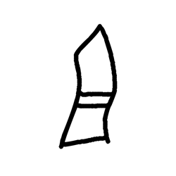

- source_zip_member: `Sub-character Images/z640bkv6r7/z640bkv6r7/311gm3v6d3.png`
- checksum_sha256: see `06_component-visual-index.csv`.
- review_status: `needs_human_visual_review`
- caution: source-marked review image only.

## asset-016970

- source_zip_member: `Sub-character Images/z640bkv6r7/z640bkv6r7/36t2azeyuy.png`
- checksum_sha256: see `06_component-visual-index.csv`.
- review_status: `needs_human_visual_review`
- caution: source-marked review image only.

## asset-016971

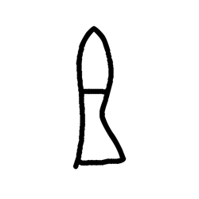

- source_zip_member: `Sub-character Images/z640bkv6r7/z640bkv6r7/3g3ko1gcvh.png`
- checksum_sha256: see `06_component-visual-index.csv`.
- review_status: `needs_human_visual_review`
- caution: source-marked review image only.

## asset-016972

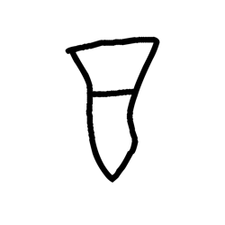

- source_zip_member: `Sub-character Images/z640bkv6r7/z640bkv6r7/3je9cc64m4.png`
- checksum_sha256: see `06_component-visual-index.csv`.
- review_status: `needs_human_visual_review`
- caution: source-marked review image only.

## asset-016973

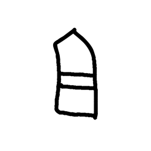

- source_zip_member: `Sub-character Images/z640bkv6r7/z640bkv6r7/3k07kp07hv.png`
- checksum_sha256: see `06_component-visual-index.csv`.
- review_status: `needs_human_visual_review`
- caution: source-marked review image only.

## asset-016974

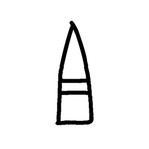

- source_zip_member: `Sub-character Images/z640bkv6r7/z640bkv6r7/3phdl2t77g.png`
- checksum_sha256: see `06_component-visual-index.csv`.
- review_status: `needs_human_visual_review`
- caution: source-marked review image only.

## asset-016975

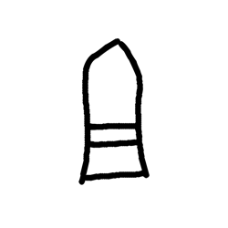

- source_zip_member: `Sub-character Images/z640bkv6r7/z640bkv6r7/3zxxkowg1b.png`
- checksum_sha256: see `06_component-visual-index.csv`.
- review_status: `needs_human_visual_review`
- caution: source-marked review image only.

## asset-016976

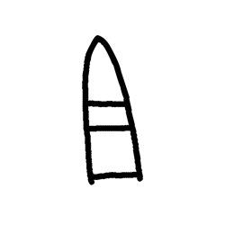

- source_zip_member: `Sub-character Images/z640bkv6r7/z640bkv6r7/40reiwq9i1.png`
- checksum_sha256: see `06_component-visual-index.csv`.
- review_status: `needs_human_visual_review`
- caution: source-marked review image only.

## asset-016977

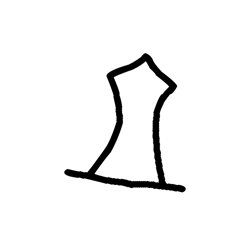

- source_zip_member: `Sub-character Images/z640bkv6r7/z640bkv6r7/4luico0z4d.png`
- checksum_sha256: see `06_component-visual-index.csv`.
- review_status: `needs_human_visual_review`
- caution: source-marked review image only.

## asset-016978

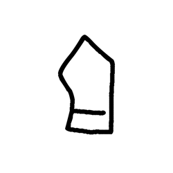

- source_zip_member: `Sub-character Images/z640bkv6r7/z640bkv6r7/4lv9rvkok9.png`
- checksum_sha256: see `06_component-visual-index.csv`.
- review_status: `needs_human_visual_review`
- caution: source-marked review image only.

## asset-016979

- source_zip_member: `Sub-character Images/z640bkv6r7/z640bkv6r7/4ty1s0gy86.png`
- checksum_sha256: see `06_component-visual-index.csv`.
- review_status: `needs_human_visual_review`
- caution: source-marked review image only.

## asset-016980

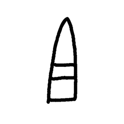

- source_zip_member: `Sub-character Images/z640bkv6r7/z640bkv6r7/5lce2djcxk.png`
- checksum_sha256: see `06_component-visual-index.csv`.
- review_status: `needs_human_visual_review`
- caution: source-marked review image only.

## asset-016981

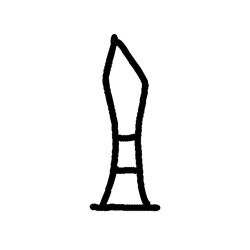

- source_zip_member: `Sub-character Images/z640bkv6r7/z640bkv6r7/5rr8yn9nhd.png`
- checksum_sha256: see `06_component-visual-index.csv`.
- review_status: `needs_human_visual_review`
- caution: source-marked review image only.

## asset-016982

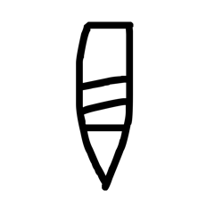

- source_zip_member: `Sub-character Images/z640bkv6r7/z640bkv6r7/63vkqt0tjk.png`
- checksum_sha256: see `06_component-visual-index.csv`.
- review_status: `needs_human_visual_review`
- caution: source-marked review image only.

## asset-016983

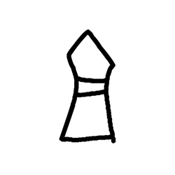

- source_zip_member: `Sub-character Images/z640bkv6r7/z640bkv6r7/69293fbdnt.png`
- checksum_sha256: see `06_component-visual-index.csv`.
- review_status: `needs_human_visual_review`
- caution: source-marked review image only.

## asset-016984

- source_zip_member: `Sub-character Images/z640bkv6r7/z640bkv6r7/6ed52uzhsj.png`
- checksum_sha256: see `06_component-visual-index.csv`.
- review_status: `needs_human_visual_review`
- caution: source-marked review image only.

## asset-016985

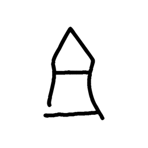

- source_zip_member: `Sub-character Images/z640bkv6r7/z640bkv6r7/6ue254ja6y.png`
- checksum_sha256: see `06_component-visual-index.csv`.
- review_status: `needs_human_visual_review`
- caution: source-marked review image only.

## asset-016986

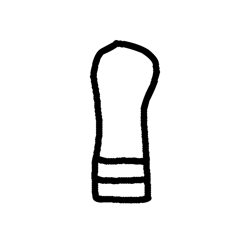

- source_zip_member: `Sub-character Images/z640bkv6r7/z640bkv6r7/6xzk8cw1ly.png`
- checksum_sha256: see `06_component-visual-index.csv`.
- review_status: `needs_human_visual_review`
- caution: source-marked review image only.

## asset-016987

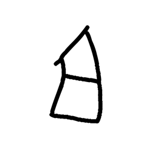

- source_zip_member: `Sub-character Images/z640bkv6r7/z640bkv6r7/70gseb02z8.png`
- checksum_sha256: see `06_component-visual-index.csv`.
- review_status: `needs_human_visual_review`
- caution: source-marked review image only.

## asset-016988

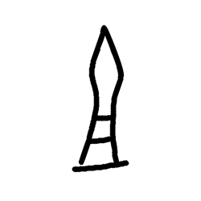

- source_zip_member: `Sub-character Images/z640bkv6r7/z640bkv6r7/75iz39uuhj.png`
- checksum_sha256: see `06_component-visual-index.csv`.
- review_status: `needs_human_visual_review`
- caution: source-marked review image only.

## asset-016989

- source_zip_member: `Sub-character Images/z640bkv6r7/z640bkv6r7/75kef5cle6.png`
- checksum_sha256: see `06_component-visual-index.csv`.
- review_status: `needs_human_visual_review`
- caution: source-marked review image only.

## asset-016990

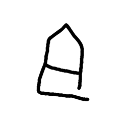

- source_zip_member: `Sub-character Images/z640bkv6r7/z640bkv6r7/76klafok3y.png`
- checksum_sha256: see `06_component-visual-index.csv`.
- review_status: `needs_human_visual_review`
- caution: source-marked review image only.

## asset-016991

- source_zip_member: `Sub-character Images/z640bkv6r7/z640bkv6r7/7stw2rwtcn.png`
- checksum_sha256: see `06_component-visual-index.csv`.
- review_status: `needs_human_visual_review`
- caution: source-marked review image only.

## asset-016992

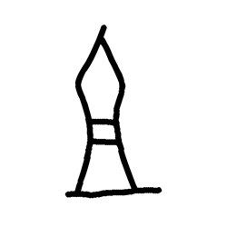

- source_zip_member: `Sub-character Images/z640bkv6r7/z640bkv6r7/8n6h84x7vg.png`
- checksum_sha256: see `06_component-visual-index.csv`.
- review_status: `needs_human_visual_review`
- caution: source-marked review image only.

## asset-016993

- source_zip_member: `Sub-character Images/z640bkv6r7/z640bkv6r7/8plnchx2fe.png`
- checksum_sha256: see `06_component-visual-index.csv`.
- review_status: `needs_human_visual_review`
- caution: source-marked review image only.

## asset-016994

- source_zip_member: `Sub-character Images/z640bkv6r7/z640bkv6r7/8xnpdgsmpw.png`
- checksum_sha256: see `06_component-visual-index.csv`.
- review_status: `needs_human_visual_review`
- caution: source-marked review image only.

## asset-016995

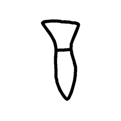

- source_zip_member: `Sub-character Images/z640bkv6r7/z640bkv6r7/9pwa6qfgca.png`
- checksum_sha256: see `06_component-visual-index.csv`.
- review_status: `needs_human_visual_review`
- caution: source-marked review image only.

## asset-016996

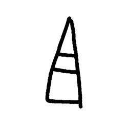

- source_zip_member: `Sub-character Images/z640bkv6r7/z640bkv6r7/9qnbrqp8q8.png`
- checksum_sha256: see `06_component-visual-index.csv`.
- review_status: `needs_human_visual_review`
- caution: source-marked review image only.

## asset-016997

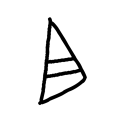

- source_zip_member: `Sub-character Images/z640bkv6r7/z640bkv6r7/a0rp3o4uqi.png`
- checksum_sha256: see `06_component-visual-index.csv`.
- review_status: `needs_human_visual_review`
- caution: source-marked review image only.

## asset-016998

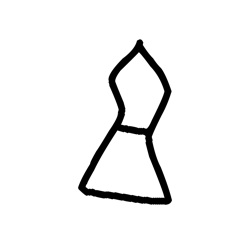

- source_zip_member: `Sub-character Images/z640bkv6r7/z640bkv6r7/a2cos67xbi.png`
- checksum_sha256: see `06_component-visual-index.csv`.
- review_status: `needs_human_visual_review`
- caution: source-marked review image only.

## asset-016999

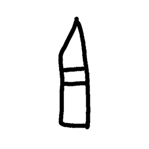

- source_zip_member: `Sub-character Images/z640bkv6r7/z640bkv6r7/al5tv44eqc.png`
- checksum_sha256: see `06_component-visual-index.csv`.
- review_status: `needs_human_visual_review`
- caution: source-marked review image only.

## asset-017000

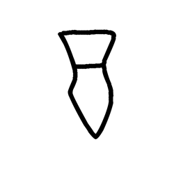

- source_zip_member: `Sub-character Images/z640bkv6r7/z640bkv6r7/apoh8ogmn3.png`
- checksum_sha256: see `06_component-visual-index.csv`.
- review_status: `needs_human_visual_review`
- caution: source-marked review image only.

## asset-017001

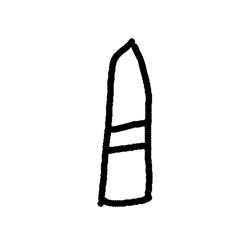

- source_zip_member: `Sub-character Images/z640bkv6r7/z640bkv6r7/bo7yvd95l3.png`
- checksum_sha256: see `06_component-visual-index.csv`.
- review_status: `needs_human_visual_review`
- caution: source-marked review image only.

## asset-017002

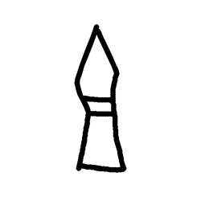

- source_zip_member: `Sub-character Images/z640bkv6r7/z640bkv6r7/c2qawvm6az.png`
- checksum_sha256: see `06_component-visual-index.csv`.
- review_status: `needs_human_visual_review`
- caution: source-marked review image only.

## asset-017003

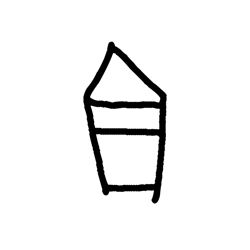

- source_zip_member: `Sub-character Images/z640bkv6r7/z640bkv6r7/c9kmxp2dna.png`
- checksum_sha256: see `06_component-visual-index.csv`.
- review_status: `needs_human_visual_review`
- caution: source-marked review image only.

## asset-017004

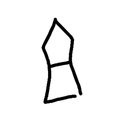

- source_zip_member: `Sub-character Images/z640bkv6r7/z640bkv6r7/cybvut897w.png`
- checksum_sha256: see `06_component-visual-index.csv`.
- review_status: `needs_human_visual_review`
- caution: source-marked review image only.

## asset-017005

- source_zip_member: `Sub-character Images/z640bkv6r7/z640bkv6r7/daog2dj81l.png`
- checksum_sha256: see `06_component-visual-index.csv`.
- review_status: `needs_human_visual_review`
- caution: source-marked review image only.

## asset-017006

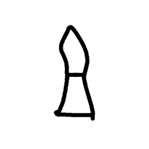

- source_zip_member: `Sub-character Images/z640bkv6r7/z640bkv6r7/dmobrn89rg.png`
- checksum_sha256: see `06_component-visual-index.csv`.
- review_status: `needs_human_visual_review`
- caution: source-marked review image only.

## asset-017007

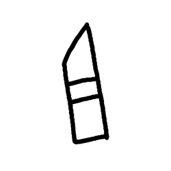

- source_zip_member: `Sub-character Images/z640bkv6r7/z640bkv6r7/dx64tmxkur.png`
- checksum_sha256: see `06_component-visual-index.csv`.
- review_status: `needs_human_visual_review`
- caution: source-marked review image only.

## asset-017008

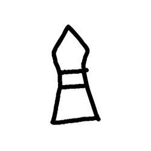

- source_zip_member: `Sub-character Images/z640bkv6r7/z640bkv6r7/e7ms5jw08t.png`
- checksum_sha256: see `06_component-visual-index.csv`.
- review_status: `needs_human_visual_review`
- caution: source-marked review image only.

## asset-017009

- source_zip_member: `Sub-character Images/z640bkv6r7/z640bkv6r7/elf6ndg9sl.png`
- checksum_sha256: see `06_component-visual-index.csv`.
- review_status: `needs_human_visual_review`
- caution: source-marked review image only.

## asset-017010

- source_zip_member: `Sub-character Images/z640bkv6r7/z640bkv6r7/elqod1xz4e.png`
- checksum_sha256: see `06_component-visual-index.csv`.
- review_status: `needs_human_visual_review`
- caution: source-marked review image only.

## asset-017011

- source_zip_member: `Sub-character Images/z640bkv6r7/z640bkv6r7/ewq4mzdrkp.png`
- checksum_sha256: see `06_component-visual-index.csv`.
- review_status: `needs_human_visual_review`
- caution: source-marked review image only.

## asset-017012

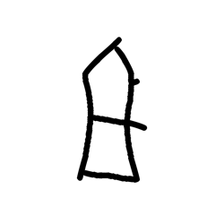

- source_zip_member: `Sub-character Images/z640bkv6r7/z640bkv6r7/faxdhgu8x1.png`
- checksum_sha256: see `06_component-visual-index.csv`.
- review_status: `needs_human_visual_review`
- caution: source-marked review image only.

## asset-017013

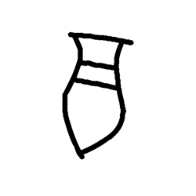

- source_zip_member: `Sub-character Images/z640bkv6r7/z640bkv6r7/fsuk8csm36.png`
- checksum_sha256: see `06_component-visual-index.csv`.
- review_status: `needs_human_visual_review`
- caution: source-marked review image only.

## asset-017014

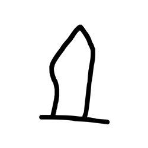

- source_zip_member: `Sub-character Images/z640bkv6r7/z640bkv6r7/fx0tmbs7nd.png`
- checksum_sha256: see `06_component-visual-index.csv`.
- review_status: `needs_human_visual_review`
- caution: source-marked review image only.

## asset-017015

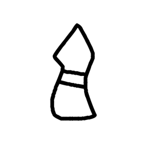

- source_zip_member: `Sub-character Images/z640bkv6r7/z640bkv6r7/gc5wiiip6f.png`
- checksum_sha256: see `06_component-visual-index.csv`.
- review_status: `needs_human_visual_review`
- caution: source-marked review image only.

## asset-017016

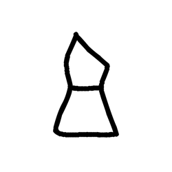

- source_zip_member: `Sub-character Images/z640bkv6r7/z640bkv6r7/gxnpxq8dnq.png`
- checksum_sha256: see `06_component-visual-index.csv`.
- review_status: `needs_human_visual_review`
- caution: source-marked review image only.

## asset-017017

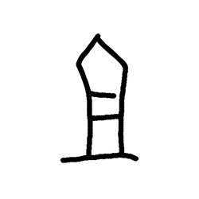

- source_zip_member: `Sub-character Images/z640bkv6r7/z640bkv6r7/h8esqltufh.png`
- checksum_sha256: see `06_component-visual-index.csv`.
- review_status: `needs_human_visual_review`
- caution: source-marked review image only.

## asset-017018

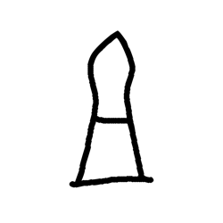

- source_zip_member: `Sub-character Images/z640bkv6r7/z640bkv6r7/h97de2gnvs.png`
- checksum_sha256: see `06_component-visual-index.csv`.
- review_status: `needs_human_visual_review`
- caution: source-marked review image only.

## asset-017019

- source_zip_member: `Sub-character Images/z640bkv6r7/z640bkv6r7/hq8mzkd914.png`
- checksum_sha256: see `06_component-visual-index.csv`.
- review_status: `needs_human_visual_review`
- caution: source-marked review image only.

## asset-017020

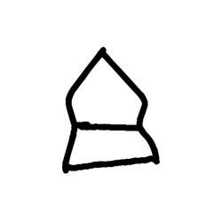

- source_zip_member: `Sub-character Images/z640bkv6r7/z640bkv6r7/hwncz51dqp.png`
- checksum_sha256: see `06_component-visual-index.csv`.
- review_status: `needs_human_visual_review`
- caution: source-marked review image only.

## asset-017021

- source_zip_member: `Sub-character Images/z640bkv6r7/z640bkv6r7/hy43zjaytz.png`
- checksum_sha256: see `06_component-visual-index.csv`.
- review_status: `needs_human_visual_review`
- caution: source-marked review image only.

## asset-017022

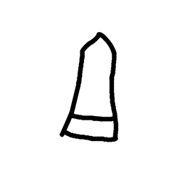

- source_zip_member: `Sub-character Images/z640bkv6r7/z640bkv6r7/i75hme59uw.png`
- checksum_sha256: see `06_component-visual-index.csv`.
- review_status: `needs_human_visual_review`
- caution: source-marked review image only.

## asset-017023

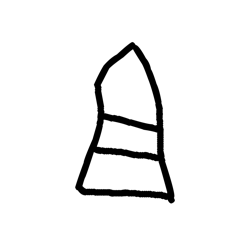

- source_zip_member: `Sub-character Images/z640bkv6r7/z640bkv6r7/i7kpn8j7cr.png`
- checksum_sha256: see `06_component-visual-index.csv`.
- review_status: `needs_human_visual_review`
- caution: source-marked review image only.

## asset-017024

- source_zip_member: `Sub-character Images/z640bkv6r7/z640bkv6r7/iqnz7u8m3j.png`
- checksum_sha256: see `06_component-visual-index.csv`.
- review_status: `needs_human_visual_review`
- caution: source-marked review image only.

## asset-017025

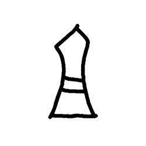

- source_zip_member: `Sub-character Images/z640bkv6r7/z640bkv6r7/jheiwptyop.png`
- checksum_sha256: see `06_component-visual-index.csv`.
- review_status: `needs_human_visual_review`
- caution: source-marked review image only.

## asset-017026

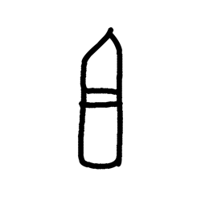

- source_zip_member: `Sub-character Images/z640bkv6r7/z640bkv6r7/jxxxx546vk.png`
- checksum_sha256: see `06_component-visual-index.csv`.
- review_status: `needs_human_visual_review`
- caution: source-marked review image only.

## asset-017027

- source_zip_member: `Sub-character Images/z640bkv6r7/z640bkv6r7/kl8436l23u.png`
- checksum_sha256: see `06_component-visual-index.csv`.
- review_status: `needs_human_visual_review`
- caution: source-marked review image only.

## asset-017028

- source_zip_member: `Sub-character Images/z640bkv6r7/z640bkv6r7/kusu7cp4tp.png`
- checksum_sha256: see `06_component-visual-index.csv`.
- review_status: `needs_human_visual_review`
- caution: source-marked review image only.

## asset-017029

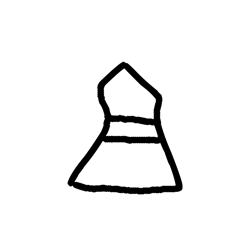

- source_zip_member: `Sub-character Images/z640bkv6r7/z640bkv6r7/kys6c632un.png`
- checksum_sha256: see `06_component-visual-index.csv`.
- review_status: `needs_human_visual_review`
- caution: source-marked review image only.

## asset-017030

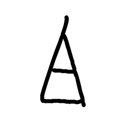

- source_zip_member: `Sub-character Images/z640bkv6r7/z640bkv6r7/lx3b3hd4yn.png`
- checksum_sha256: see `06_component-visual-index.csv`.
- review_status: `needs_human_visual_review`
- caution: source-marked review image only.

## asset-017031

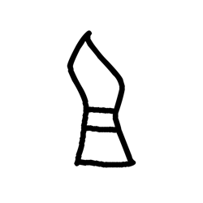

- source_zip_member: `Sub-character Images/z640bkv6r7/z640bkv6r7/m2mk0alzcr.png`
- checksum_sha256: see `06_component-visual-index.csv`.
- review_status: `needs_human_visual_review`
- caution: source-marked review image only.

## asset-017032

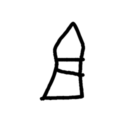

- source_zip_member: `Sub-character Images/z640bkv6r7/z640bkv6r7/mqk7t5vlch.png`
- checksum_sha256: see `06_component-visual-index.csv`.
- review_status: `needs_human_visual_review`
- caution: source-marked review image only.

## asset-017033

- source_zip_member: `Sub-character Images/z640bkv6r7/z640bkv6r7/npvb8qhhka.png`
- checksum_sha256: see `06_component-visual-index.csv`.
- review_status: `needs_human_visual_review`
- caution: source-marked review image only.

## asset-017034

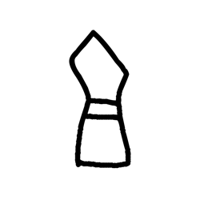

- source_zip_member: `Sub-character Images/z640bkv6r7/z640bkv6r7/nt644rjmm9.png`
- checksum_sha256: see `06_component-visual-index.csv`.
- review_status: `needs_human_visual_review`
- caution: source-marked review image only.

## asset-017035

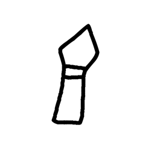

- source_zip_member: `Sub-character Images/z640bkv6r7/z640bkv6r7/o5mldwa8ia.png`
- checksum_sha256: see `06_component-visual-index.csv`.
- review_status: `needs_human_visual_review`
- caution: source-marked review image only.

## asset-017036

- source_zip_member: `Sub-character Images/z640bkv6r7/z640bkv6r7/o8on0ecic3.png`
- checksum_sha256: see `06_component-visual-index.csv`.
- review_status: `needs_human_visual_review`
- caution: source-marked review image only.

## asset-017037

- source_zip_member: `Sub-character Images/z640bkv6r7/z640bkv6r7/p44j2mwf26.png`
- checksum_sha256: see `06_component-visual-index.csv`.
- review_status: `needs_human_visual_review`
- caution: source-marked review image only.

## asset-017038

- source_zip_member: `Sub-character Images/z640bkv6r7/z640bkv6r7/payfy3sxdg.png`
- checksum_sha256: see `06_component-visual-index.csv`.
- review_status: `needs_human_visual_review`
- caution: source-marked review image only.

## asset-017039

- source_zip_member: `Sub-character Images/z640bkv6r7/z640bkv6r7/pf31619psk.png`
- checksum_sha256: see `06_component-visual-index.csv`.
- review_status: `needs_human_visual_review`
- caution: source-marked review image only.

## asset-017040

- source_zip_member: `Sub-character Images/z640bkv6r7/z640bkv6r7/pvw8cvu6l7.png`
- checksum_sha256: see `06_component-visual-index.csv`.
- review_status: `needs_human_visual_review`
- caution: source-marked review image only.

## asset-017041

- source_zip_member: `Sub-character Images/z640bkv6r7/z640bkv6r7/q1omsszco5.png`
- checksum_sha256: see `06_component-visual-index.csv`.
- review_status: `needs_human_visual_review`
- caution: source-marked review image only.

## asset-017042

- source_zip_member: `Sub-character Images/z640bkv6r7/z640bkv6r7/qfokx7wpja.png`
- checksum_sha256: see `06_component-visual-index.csv`.
- review_status: `needs_human_visual_review`
- caution: source-marked review image only.

## asset-017043

- source_zip_member: `Sub-character Images/z640bkv6r7/z640bkv6r7/qp37jr3ejk.png`
- checksum_sha256: see `06_component-visual-index.csv`.
- review_status: `needs_human_visual_review`
- caution: source-marked review image only.

## asset-017044

- source_zip_member: `Sub-character Images/z640bkv6r7/z640bkv6r7/r0h359m2ln.png`
- checksum_sha256: see `06_component-visual-index.csv`.
- review_status: `needs_human_visual_review`
- caution: source-marked review image only.

## asset-017045

- source_zip_member: `Sub-character Images/z640bkv6r7/z640bkv6r7/rdzeep539v.png`
- checksum_sha256: see `06_component-visual-index.csv`.
- review_status: `needs_human_visual_review`
- caution: source-marked review image only.

## asset-017046

- source_zip_member: `Sub-character Images/z640bkv6r7/z640bkv6r7/rnpsztf4w6.png`
- checksum_sha256: see `06_component-visual-index.csv`.
- review_status: `needs_human_visual_review`
- caution: source-marked review image only.

## asset-017047

- source_zip_member: `Sub-character Images/z640bkv6r7/z640bkv6r7/s6woxpiyrp.png`
- checksum_sha256: see `06_component-visual-index.csv`.
- review_status: `needs_human_visual_review`
- caution: source-marked review image only.

## asset-017048

- source_zip_member: `Sub-character Images/z640bkv6r7/z640bkv6r7/sh3lc6osrm.png`
- checksum_sha256: see `06_component-visual-index.csv`.
- review_status: `needs_human_visual_review`
- caution: source-marked review image only.

## asset-017049

- source_zip_member: `Sub-character Images/z640bkv6r7/z640bkv6r7/skyqsq0je4.png`
- checksum_sha256: see `06_component-visual-index.csv`.
- review_status: `needs_human_visual_review`
- caution: source-marked review image only.

## asset-017050

- source_zip_member: `Sub-character Images/z640bkv6r7/z640bkv6r7/sxvqlg29ze.png`
- checksum_sha256: see `06_component-visual-index.csv`.
- review_status: `needs_human_visual_review`
- caution: source-marked review image only.

## asset-017051

- source_zip_member: `Sub-character Images/z640bkv6r7/z640bkv6r7/sylgg30cai.png`
- checksum_sha256: see `06_component-visual-index.csv`.
- review_status: `needs_human_visual_review`
- caution: source-marked review image only.

## asset-017052

- source_zip_member: `Sub-character Images/z640bkv6r7/z640bkv6r7/t8vuryem7a.png`
- checksum_sha256: see `06_component-visual-index.csv`.
- review_status: `needs_human_visual_review`
- caution: source-marked review image only.

## asset-017053

- source_zip_member: `Sub-character Images/z640bkv6r7/z640bkv6r7/tj6x20c6b9.png`
- checksum_sha256: see `06_component-visual-index.csv`.
- review_status: `needs_human_visual_review`
- caution: source-marked review image only.

## asset-017054

- source_zip_member: `Sub-character Images/z640bkv6r7/z640bkv6r7/u5dm7fj840.png`
- checksum_sha256: see `06_component-visual-index.csv`.
- review_status: `needs_human_visual_review`
- caution: source-marked review image only.

## asset-017055

- source_zip_member: `Sub-character Images/z640bkv6r7/z640bkv6r7/ub200nh9en.png`
- checksum_sha256: see `06_component-visual-index.csv`.
- review_status: `needs_human_visual_review`
- caution: source-marked review image only.

## asset-017056

- source_zip_member: `Sub-character Images/z640bkv6r7/z640bkv6r7/uf5kouu77n.png`
- checksum_sha256: see `06_component-visual-index.csv`.
- review_status: `needs_human_visual_review`
- caution: source-marked review image only.

## asset-017057

- source_zip_member: `Sub-character Images/z640bkv6r7/z640bkv6r7/v0jqifrfda.png`
- checksum_sha256: see `06_component-visual-index.csv`.
- review_status: `needs_human_visual_review`
- caution: source-marked review image only.

## asset-017058

- source_zip_member: `Sub-character Images/z640bkv6r7/z640bkv6r7/v74s33653u.png`
- checksum_sha256: see `06_component-visual-index.csv`.
- review_status: `needs_human_visual_review`
- caution: source-marked review image only.

## asset-017059

- source_zip_member: `Sub-character Images/z640bkv6r7/z640bkv6r7/vcivgcq7sc.png`
- checksum_sha256: see `06_component-visual-index.csv`.
- review_status: `needs_human_visual_review`
- caution: source-marked review image only.

## asset-017060

- source_zip_member: `Sub-character Images/z640bkv6r7/z640bkv6r7/vdqsz747r0.png`
- checksum_sha256: see `06_component-visual-index.csv`.
- review_status: `needs_human_visual_review`
- caution: source-marked review image only.

## asset-017061

- source_zip_member: `Sub-character Images/z640bkv6r7/z640bkv6r7/vqy3ryoyg5.png`
- checksum_sha256: see `06_component-visual-index.csv`.
- review_status: `needs_human_visual_review`
- caution: source-marked review image only.

## asset-017062

- source_zip_member: `Sub-character Images/z640bkv6r7/z640bkv6r7/vznab1llpo.png`
- checksum_sha256: see `06_component-visual-index.csv`.
- review_status: `needs_human_visual_review`
- caution: source-marked review image only.

## asset-017063

- source_zip_member: `Sub-character Images/z640bkv6r7/z640bkv6r7/w94inkf23e.png`
- checksum_sha256: see `06_component-visual-index.csv`.
- review_status: `needs_human_visual_review`
- caution: source-marked review image only.

## asset-017064

- source_zip_member: `Sub-character Images/z640bkv6r7/z640bkv6r7/wxazmadnz6.png`
- checksum_sha256: see `06_component-visual-index.csv`.
- review_status: `needs_human_visual_review`
- caution: source-marked review image only.

## asset-017065

- source_zip_member: `Sub-character Images/z640bkv6r7/z640bkv6r7/xr951yckg9.png`
- checksum_sha256: see `06_component-visual-index.csv`.
- review_status: `needs_human_visual_review`
- caution: source-marked review image only.

## asset-017066

- source_zip_member: `Sub-character Images/z640bkv6r7/z640bkv6r7/xtwliwm5br.png`
- checksum_sha256: see `06_component-visual-index.csv`.
- review_status: `needs_human_visual_review`
- caution: source-marked review image only.

## asset-017067

- source_zip_member: `Sub-character Images/z640bkv6r7/z640bkv6r7/y49qjlkwu7.png`
- checksum_sha256: see `06_component-visual-index.csv`.
- review_status: `needs_human_visual_review`
- caution: source-marked review image only.

## asset-017068

- source_zip_member: `Sub-character Images/z640bkv6r7/z640bkv6r7/ycrh75di23.png`
- checksum_sha256: see `06_component-visual-index.csv`.
- review_status: `needs_human_visual_review`
- caution: source-marked review image only.

## asset-017069

- source_zip_member: `Sub-character Images/z640bkv6r7/z640bkv6r7/ydxag1j44a.png`
- checksum_sha256: see `06_component-visual-index.csv`.
- review_status: `needs_human_visual_review`
- caution: source-marked review image only.

## asset-017070

- source_zip_member: `Sub-character Images/z640bkv6r7/z640bkv6r7/yi9qokm4wz.png`
- checksum_sha256: see `06_component-visual-index.csv`.
- review_status: `needs_human_visual_review`
- caution: source-marked review image only.

## asset-017071

- source_zip_member: `Sub-character Images/z640bkv6r7/z640bkv6r7/yuimuhsa50.png`
- checksum_sha256: see `06_component-visual-index.csv`.
- review_status: `needs_human_visual_review`
- caution: source-marked review image only.

## asset-017072

- source_zip_member: `Sub-character Images/z640bkv6r7/z640bkv6r7/z640bkv6r7.png`
- checksum_sha256: see `06_component-visual-index.csv`.
- review_status: `needs_human_visual_review`
- caution: source-marked review image only.

## asset-017073

- source_zip_member: `Sub-character Images/z640bkv6r7/z640bkv6r7/zm4vaeuhrp.png`
- checksum_sha256: see `06_component-visual-index.csv`.
- review_status: `needs_human_visual_review`
- caution: source-marked review image only.

## asset-017074

- source_zip_member: `Sub-character Images/z640bkv6r7/z640bkv6r7/zzk2ruy0cm.png`
- checksum_sha256: see `06_component-visual-index.csv`.
- review_status: `needs_human_visual_review`
- caution: source-marked review image only.
